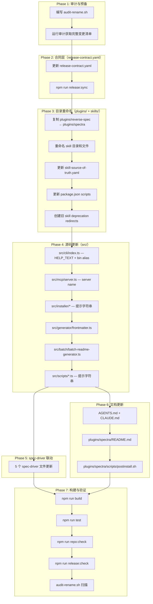

# 技术实现计划：品牌重命名 reverse-spec → Spectra

## Summary

本 feature 是 Spectra Evolution（M-100）的 Phase 0 基础工作，将产品从 "reverse-spec" 品牌全面重命名为 "Spectra"。技术性质为**纯机械替换**，零功能变更，零新依赖引入。

变更范围：npm 包名、CLI 入口文本、MCP server name、plugin manifest、marketplace entry、skill 目录与文件名、release contract、文档、spec-driver 联动引用，共涉及约 40 个需人工或脚本修改的文件，另有约 65 处 `dist/` 构建产物通过重新构建覆盖。

---

## Technical Context

| 维度 | 值 |
|------|-----|
| 语言/版本 | TypeScript 5.x / Node.js ≥ 20 |
| 构建工具 | tsc（`npm run build`） |
| 测试框架 | Vitest（unit + integration 两个 project） |
| 包管理 | npm（含 package-lock.json 受控发布合同） |
| 版本跳跃 | v2.9.0 → v3.0.0（major bump，breaking change） |
| 新引入依赖 | 无 |
| 数据迁移 | 无（现有 `specs/` 目录和 spec 文件格式不变） |

---

## Codebase Reality Check

### 核心目标文件

| 文件 | 估计 LOC | 引用次数 | 关键内容 | 已知 debt |
|------|---------|---------|---------|---------|
| `package.json` | 63 | — | `name`, `bin` 字段 | 无 |
| `contracts/release-contract.yaml` | 31 | — | `products.reverse-spec.*` 键 | 无 |
| `plugins/reverse-spec/.claude-plugin/plugin.json` | 20 | — | `name`, `description`, `keywords` | 无 |
| `plugins/reverse-spec/.mcp.json` | 8 | — | `mcpServers.reverse-spec` 键 | 无 |
| `plugins/reverse-spec/contracts/skill-source-of-truth.yaml` | 35 | 全文 | `plugin.id`, skill `source`/`mirrors` 路径 | 无 |
| `plugins/reverse-spec/scripts/postinstall.sh` | 19 | 全文 | CLI 可用性检测字符串 | 硬编码 PROJECT_ROOT 路径 |
| `src/cli/index.ts` | 137 | 10 | HELP_TEXT、版本打印 | 无 |
| `src/mcp/server.ts` | — | 1 | `name: 'reverse-spec'` | 无 |
| `src/installer/skill-installer.ts` | — | 9 | 用户提示字符串 | 无 |
| `src/installer/skill-templates.ts` | — | 6 | `REVERSE_SPEC_SKILL_NAMES`、路径拼接 | 无 |
| `src/generator/frontmatter.ts` | — | 1 | `generatedBy: 'reverse-spec v2.0'` | 版本号硬编码 |
| `src/batch/batch-readme-generator.ts` | — | 2 | 版本注释字符串 | 无 |
| `src/config/project-config.ts` | — | 3 | `.reverse-spec.yaml` 配置文件名 | **特殊：此处不更名** |
| `src/scripts/postinstall.ts` | — | 2 | 用户提示字符串 | 无 |
| `src/scripts/preuninstall.ts` | — | 1 | 用户提示字符串 | 无 |
| `src/core/single-spec-orchestrator.ts` | — | 1 | 注释 | 无 |
| `AGENTS.md` | — | 3 | 文档标题和说明 | 无 |
| `CLAUDE.md` | — | 2 | 文档标题和说明 | 无 |

### Skill 文件（全量 3+3 mirror）

| 目录/文件 | 操作 |
|----------|------|
| `plugins/reverse-spec/skills/reverse-spec/SKILL.md` | → `plugins/spectra/skills/spectra/SKILL.md`（内容全量更新） |
| `plugins/reverse-spec/skills/reverse-spec-batch/SKILL.md` | → `plugins/spectra/skills/spectra-batch/SKILL.md` |
| `plugins/reverse-spec/skills/reverse-spec-diff/SKILL.md` | → `plugins/spectra/skills/spectra-diff/SKILL.md` |
| `src/skills-global/reverse-spec/SKILL.md` | → `src/skills-global/spectra/SKILL.md`（mirror） |
| `src/skills-global/reverse-spec-batch/SKILL.md` | → `src/skills-global/spectra-batch/SKILL.md` |
| `src/skills-global/reverse-spec-diff/SKILL.md` | → `src/skills-global/spectra-diff/SKILL.md` |
| `skills/reverse-spec/SKILL.md` | → `skills/spectra/SKILL.md`（mirror） |
| `skills/reverse-spec-batch/SKILL.md` | → `skills/spectra-batch/SKILL.md` |
| `skills/reverse-spec-diff/SKILL.md` | → `skills/spectra-diff/SKILL.md` |

### spec-driver 5 个文件（15 处引用）

| 文件 | 处理方式 |
|------|---------|
| `plugins/spec-driver/agents/constitution.md` | 替换 `reverse-spec` 品牌引用（排除路径示例注释） |
| `plugins/spec-driver/README.md` | 替换品牌名（保留历史上下文说明） |
| `plugins/spec-driver/scripts/lib/sync-product-mapping.mjs` | 替换注释中的品牌标识 |
| `plugins/spec-driver/skills/spec-driver-doc/SKILL.md` | 替换 CLI 命令引用 `npx reverse-spec prepare` → `npx spectra prepare` |
| `plugins/spec-driver/scripts/generate-product-entity-catalog.mjs` | 替换 `WORKFLOW_REFS_BY_PRODUCT['reverse-spec']`  键名和引用 |

### 配置文件名不更改（已知豁免）

`src/config/project-config.ts` 中 `.reverse-spec.yaml` / `.reverse-spec.yml` / `.reverse-spec.json` 是**用户项目中的配置文件名**。为避免破坏已安装用户的配置，本次不改名；在 v3.1.0 中通过添加 `.spectra.yaml` 兼容前缀并保留旧名作为 fallback 来处理（超出本 feature 范围）。

### 无需手动修改的文件

| 文件 | 原因 |
|------|------|
| `dist/**` | 重新构建 `npm run build` 自动覆盖 |
| `package-lock.json` | `npm run release:sync` 统一更新 |
| `changelog` / git history | 豁免项 |
| 用户已生成的 `specs/` 内容 | FR-016 明确不得修改 |

---

## Impact Assessment

| 维度 | 评估 |
|------|------|
| 直接修改文件数 | ~40 个（不含 dist/） |
| 间接受影响（rebuild/sync） | 65+ 处构建产物 + package-lock.json |
| 跨包影响 | `plugins/reverse-spec/`、`plugins/spectra/`（新建）、`src/`、`skills/`、`contracts/`、`AGENTS.md`、`CLAUDE.md`，共 6 个顶层区域 |
| 数据迁移 | 无 |
| API/契约变更 | CLI bin 名称变更（`reverse-spec` → `spectra`，保留 alias）；MCP server name 变更；plugin ID 变更 |
| 风险等级 | **MEDIUM** |

**风险等级判定**：影响文件数 ~40（>20 临界）但变更全为机械替换，跨包影响 6 区，无数据迁移，公共 API 通过 alias 保持向后兼容。主要风险为**遗漏替换点**（非逻辑风险），通过 `audit-rename.sh` 门禁控制。

---

## Constitution Check

本 feature 无需读取 `constitution.md`（文件可能在 spec-driver plugin 内），下方基于项目约定直接评估：

| 原则 | 适用性 | 评估 | 说明 |
|------|-------|------|------|
| 向后兼容性 | 适用 | COMPLIANT | `reverse-spec` CLI alias 保留，打印 deprecation warning 但正常执行 |
| 发布合同约定 | 适用 | COMPLIANT | 通过 `release:sync` 统一更新受控字段 |
| 仓库级同步约定 | 适用 | COMPLIANT | 修改后运行 `repo:sync` + `repo:check` |
| 不引入新依赖 | 适用 | COMPLIANT | 零新 npm 依赖 |
| 功能不变性 | 适用 | COMPLIANT | FR-015/016 明确保护现有行为和 specs/ 内容 |
| 用户配置保护 | 适用 | PARTIAL | `.reverse-spec.yaml` 配置文件名本次不改，豁免已登记 |

无 VIOLATION 项。

---

## Architecture



---

## Phase 详述

### Phase 1：审计脚本

**目标**：在动手改代码之前，生成全量 `reverse-spec` 引用清单，作为替换工作的 checklist 和最终验收门禁。

**操作**：
1. 在 `scripts/audit-rename.sh` 创建（或扩展现有脚本）审计脚本
2. 脚本使用 `ripgrep`/`grep -r` 扫描排除豁免目录（`dist/`、`.git/`、`node_modules/`、`CHANGELOG*`）后的全仓库 `reverse-spec` 引用
3. 输出两类报告：残留引用列表、豁免项列表

**串行约束**：必须在 Phase 2 之前完成，作为基准快照。

---

### Phase 2：release-contract.yaml 更新 + release:sync

**目标**：更新发布合同的 canonical source，驱动下游受控文件的自动同步。

**操作**：
1. 修改 `contracts/release-contract.yaml`：
   - `products.reverse-spec` 键重命名为 `products.spectra`（或保留 reverse-spec 键名但更新内容值——取决于 sync 脚本的键引用方式，需确认）
   - `displayName`: `"Reverse-Spec"` → `"Spectra"`
   - `version`: `"2.9.0"` → `"3.0.0"`
   - `pluginManifestPath`: 指向新目录 `plugins/spectra/.claude-plugin/plugin.json`
   - `pluginReadmePath`: `plugins/spectra/README.md`
   - `productMappingKey`: `"reverse-spec"` → `"spectra"`
   - `pluginDescription` / `marketplaceDescription` / `productMappingDescription`: 更新品牌描述
2. 运行 `npm run release:sync` 让下游文件（`package.json` 的 `name`、`version`、`package-lock.json` 等受控字段）自动同步

**注意**：`package.json` 的 `bin` 字段**不受 release:sync 控制**，需在 Phase 3 手动同步。

**串行约束**：在 Phase 3 目录重命名之前完成，确保 `pluginManifestPath` 路径先存在。

---

### Phase 3：目录重命名（plugins/ + skills/）

**目标**：将插件目录从 `plugins/reverse-spec/` 重命名为 `plugins/spectra/`，同步更新所有 skill 目录和 mirror。

**操作（串行）**：

1. **复制 plugin 目录**：`cp -r plugins/reverse-spec plugins/spectra`（保留旧目录作为 deprecation stub）
2. **更新新目录内容**：
   - `plugins/spectra/.claude-plugin/plugin.json`：`name` → `spectra`，`keywords` 替换
   - `plugins/spectra/.mcp.json`：`mcpServers.reverse-spec` → `mcpServers.spectra`，`command` → `spectra`
   - `plugins/spectra/scripts/postinstall.sh`：全量更新检测逻辑，新增旧版检测提示
   - `plugins/spectra/README.md`：全量更新品牌引用
3. **新建 spectra skill 文件**：
   - `plugins/spectra/skills/spectra/SKILL.md`（内容 = 更新后的 reverse-spec/SKILL.md）
   - `plugins/spectra/skills/spectra-batch/SKILL.md`
   - `plugins/spectra/skills/spectra-diff/SKILL.md`
4. **创建 deprecation redirect stub**（保留在旧位置）：
   - `plugins/reverse-spec/skills/reverse-spec/SKILL.md` → 内容改为 redirect notice + deprecation
   - 同理处理 `reverse-spec-batch`、`reverse-spec-diff`
5. **更新 skill-source-of-truth.yaml**（新建 `plugins/spectra/contracts/skill-source-of-truth.yaml`）
6. **更新 mirror 文件**：
   - `src/skills-global/spectra/SKILL.md`（新建）
   - `src/skills-global/spectra-batch/SKILL.md`（新建）
   - `src/skills-global/spectra-diff/SKILL.md`（新建）
   - `skills/spectra/SKILL.md`（新建）
   - `skills/spectra-batch/SKILL.md`（新建）
   - `skills/spectra-diff/SKILL.md`（新建）
7. **更新 `package.json` scripts**：
   - `reverse-spec:sync:skills` → `spectra:sync:skills`
   - `reverse-spec:check:skills` → `spectra:check:skills`
   - `bin` 字段新增 `"spectra": "dist/cli/index.js"`（保留 `"reverse-spec"` alias）

**可并行**：步骤 3、4 可同时进行（新建与 stub 化互不依赖）。

**串行约束**：步骤 2 必须在步骤 3 之前（先有目录再写文件）；步骤 5、6 依赖步骤 3 完成。

---

### Phase 4：源码更新（src/）

**目标**：更新 `src/` 内所有品牌字符串（用户可见的提示文本、CLI 帮助文本、MCP server name 等）。

**操作（可并行执行，无相互依赖）**：

| 文件 | 操作 |
|------|------|
| `src/cli/index.ts` | HELP_TEXT 全量更新为 `spectra` 命令名；`console.log(\`reverse-spec v${version}\`)` → `spectra`；**新增** `reverse-spec` alias handler 打印 deprecation warning 后转发到相同逻辑（见注意事项） |
| `src/mcp/server.ts` | `name: 'reverse-spec'` → `name: 'spectra'` |
| `src/installer/skill-installer.ts` | 9 处用户提示字符串 `reverse-spec skills` → `spectra skills`；`/reverse-spec` → `/spectra` |
| `src/installer/skill-templates.ts` | `REVERSE_SPEC_SKILL_NAMES` 数组更新为 `['spectra', 'spectra-batch', 'spectra-diff']`；路径拼接 `'plugins', 'reverse-spec', 'skills'` → `'plugins', 'spectra', 'skills'`；常量重命名 `SPECTRA_SKILL_NAMES` |
| `src/generator/frontmatter.ts` | `generatedBy: 'reverse-spec v2.0'` → `generatedBy: 'spectra v3.0'` |
| `src/batch/batch-readme-generator.ts` | 版本注释字符串更新 |
| `src/scripts/postinstall.ts` | 2 处提示字符串 |
| `src/scripts/preuninstall.ts` | 1 处提示字符串 |
| `src/core/single-spec-orchestrator.ts` | 注释中的品牌名 |

**注意事项 — deprecation wrapper**：
`package.json` 同时注册 `"spectra"` 和 `"reverse-spec"` 两个 bin 均指向 `dist/cli/index.js`。CLI 入口通过检测 `process.argv[1]` 或 `path.basename(process.argv[1])` 判断是否通过旧名调用，若是则在执行前打印：
```
[DEPRECATED] 'reverse-spec' is deprecated. Please use 'spectra' instead.
This alias will be removed in the next major release.
```
随后正常执行，不改变 exit code。

---

### Phase 5：spec-driver 联动

**目标**：更新 spec-driver 内 5 个文件、15 处品牌引用。

| 文件 | 具体操作 |
|------|---------|
| `plugins/spec-driver/agents/constitution.md` | 第 29 行 `reverse-spec` 品牌引用 → `spectra`（非路径示例） |
| `plugins/spec-driver/README.md` | 2 处品牌引用 |
| `plugins/spec-driver/scripts/lib/sync-product-mapping.mjs` | 注释中的品牌示例（保留 `001-reverse-spec-v2` 历史格式示例，仅更新说明文字） |
| `plugins/spec-driver/skills/spec-driver-doc/SKILL.md` | 第 88 行 `npx reverse-spec prepare` → `npx spectra prepare` |
| `plugins/spec-driver/scripts/generate-product-entity-catalog.mjs` | `WORKFLOW_REFS_BY_PRODUCT['reverse-spec']` → `['spectra']` 键及所有 workflow ref 字符串；productId 判断逻辑更新 |

**串行约束**：可与 Phase 4 并行执行，但需在 Phase 7 构建之前全部完成。

---

### Phase 6：文档更新

**目标**：更新仓库顶层文档和 plugin README。

| 文件 | 操作 |
|------|------|
| `AGENTS.md` | 标题 `reverse-spec / spec-driver` → `Spectra / spec-driver`；第 7 行 CLI 说明；第 94 行说明文字 |
| `CLAUDE.md` | 标题；第 80 行说明文字 |
| `plugins/spectra/README.md` | 全量更新（在 Phase 3 中已完成，这里作为验收确认） |
| `plugins/spectra/scripts/postinstall.sh` | 全量更新，新增旧版 `reverse-spec` plugin 检测与提示卸载逻辑 |

**可并行**：Phase 5 与 Phase 6 完全可并行。

---

### Phase 7：构建、测试与完整性验证

**目标**：确保所有机械替换正确落地，全量测试通过，repo:check 零错误。

**操作（串行）**：

1. `npm run build` — 重新编译，覆盖 `dist/` 下约 65 处旧引用
2. `npm run test` — 全量测试（unit + integration）
3. `scripts/audit-rename.sh` — 扫描残余 `reverse-spec` 引用（对照 Phase 1 基准）
4. `npm run repo:check` — 仓库完整性验证
5. `npm run release:check` — 发布合同验证
6. 手动验证：`spectra batch --help`（确认新名称）；`reverse-spec batch --help`（确认 deprecation warning）

---

## 执行顺序约束

### 强制串行（不可打乱）

```
Phase 1（审计）→ Phase 2（release-contract）→ Phase 3（目录重命名）
Phase 3 → Phase 4（src/ 更新）
Phase 4 + Phase 5 + Phase 6 全部完成 → Phase 7（构建验证）
```

### 可并行

```
Phase 4 ‖ Phase 5 ‖ Phase 6（互不依赖，可同时进行）
```

---

## 风险点与回退策略

| 风险 | 说明 | 回退策略 |
|------|------|---------|
| release:sync 脚本键名依赖 | `sync-release-contracts.mjs` 可能硬编码 `reverse-spec` 键名，导致同步逻辑失效 | 执行前先读取脚本确认键名引用方式；若键名固定，先改脚本再改 YAML |
| skill-source-of-truth.yaml 同步链路 | `sync-skill-mirrors.mjs` 读取该文件，重命名后脚本命令名需同步更新 | Phase 3 步骤 5 中确认 npm scripts 已更新；新建脚本引用仍指向正确的新文件路径 |
| deprecation wrapper 检测逻辑 | `process.argv[1]` 在全局安装和 npx 场景下路径格式可能不同 | 使用 `path.basename(process.argv[1]).replace(/\.js$/, '')` 稳健提取命令名 |
| repo:check 中的硬编码路径 | `check-plugin-sync.sh` 等校验脚本可能引用 `plugins/reverse-spec/` 路径 | Phase 1 审计时同步检查 scripts/ 内引用；Phase 3 后运行一次 repo:check 提前发现 |
| 遗漏豁免外引用 | 广度型变更容易遗漏 | `audit-rename.sh` 作为硬门禁，Phase 7 必须零残留通过 |
| 旧目录清理时机 | `plugins/reverse-spec/` 保留 deprecation stub 还是完全删除？ | 保留旧目录但内容改为 stub（用户通过旧 skill 名仍可获得 redirect 通知）；v3.1.0 再移除 |

---

## Complexity Tracking

| 决策 | 偏离简单方案的理由 |
|------|-----------------|
| 同时保留 `plugins/reverse-spec/` 和 `plugins/spectra/` | 存量用户仍可通过旧 skill 名获得 deprecation redirect，避免硬断。如直接重命名则旧 skill 调用报 404 |
| `bin` 同时注册两个入口（spectra + reverse-spec） | npm 支持多 bin；单一 bin 需要用户手动 alias，体验差 |
| deprecation 检测走 `process.argv[1]` 而非 wrapper 脚本 | 无需额外中间文件，dist 构建后直接生效；wrapper 脚本需维护额外文件且 npm link 场景复杂 |
| `src/config/project-config.ts` 中 `.reverse-spec.yaml` 本次不改名 | 改名会破坏所有已安装用户的项目级配置，属于二次 breaking change；通过 v3.1.0 新增 `.spectra.yaml` 兼容 |
