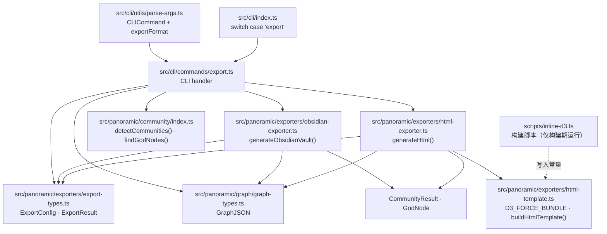
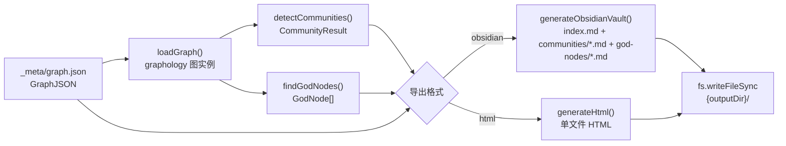

# Implementation Plan: multi-format-export

**Branch**: `103-multi-format-export` | **Date**: 2026-04-12 | **Spec**: specs/103-multi-format-export/spec.md

## Summary

将知识图谱（Feature 101）和社区分析（Feature 102）的分析结果导出为两种可直接消费的格式：Obsidian Vault（Markdown 文件集 + 双向链接）和 HTML 交互式可视化（单文件，内嵌 d3-force）。

技术方向：完全复制 Graphify 的纯函数管道模式，无类封装，无实例状态。每个导出格式是一条独立的纯函数数据管道：`GraphJSON + CommunityResult + GodNode[] → 文件产物`。d3-force bundle 通过构建脚本 `scripts/inline-d3.ts` 在构建期内联到 `html-template.ts` 常量，不引入运行时 npm 依赖。

---

## Technical Context

**Language/Version**: TypeScript 5.x，Node.js 20.x LTS  
**Primary Dependencies**: 复用现有 `graphology`、`graphology-communities-louvain`；d3-force 构建期内联（不作为运行时依赖）  
**Storage**: 文件系统写入（`fs.mkdirSync` + `fs.writeFileSync`）；复用现有 `atomic-write.ts` 工具  
**Testing**: `vitest`（现有测试框架），单元测试 + 集成测试  
**Target Platform**: Node.js CLI（`spectra` 命令行工具）  
**Performance Goals**: Obsidian 导出 500 节点 < 5 秒；HTML 导出 500 节点 < 3 秒；大图 5,000 节点 HTML 交互 60fps  
**Constraints**: 单文件 HTML < 2 MB；Obsidian 文件名无非法字符且长度 < 200；`module: "NodeNext"`（import 带 `.js` 后缀）；TypeScript strict + `noUncheckedIndexedAccess: true`  
**Scale/Scope**: 新增 6 个模块（2 个导出器 + 1 个 HTML 模板 + 1 个类型定义 + 1 个 CLI 命令 + 1 个构建脚本），修改 2 个现有文件（CLI 入口 + 参数解析器）

---

## Codebase Reality Check

本次变更涉及以下目标文件的读取和修改：

| 文件 | LOC | 公开接口数 | 已知 Debt | 操作类型 |
|------|-----|-----------|-----------|---------|
| `src/cli/index.ts` | 181 | 1（`main`） | 0 | 修改（新增 import + switch case + HELP_TEXT 条目） |
| `src/cli/utils/parse-args.ts` | 625 | 3（`parseArgs`、`CLICommand`、`ParseResult`） | 0 | 修改（新增 `export` 分支 + `exportFormat` 字段） |
| `src/panoramic/community/index.ts` | 94 | 7（`runCommunityAnalysis` + 类型导出） | 0 | 只读（复用 `detectCommunities`、`findGodNodes`） |
| `src/panoramic/community/community-detector.ts` | 244 | 3（`loadGraph`、`detectCommunities`、`CommunityResult`） | 0 | 只读（复用接口） |
| `src/panoramic/community/god-node-analyzer.ts` | 125 | 2（`findGodNodes`、`GodNode`） | 0 | 只读（复用接口） |
| `src/panoramic/exporters/architecture-ir-exporters.ts` | ~200 | 2 | 0 | 只读（参考同目录的导出器模式） |

**前置清理规则评估**：

- `parse-args.ts` 625 行，本次将新增约 40 行（export 子命令分支），不超过 50 行阈值
- 无 TODO/FIXME 标记
- 无明确代码重复（各子命令分支模式相似但属于并列展开，非重复逻辑）

**结论**：无需前置 cleanup task，可直接进入功能实现。

---

## Impact Assessment

| 维度 | 值 |
|------|-----|
| **直接修改文件数** | 2（`cli/index.ts`、`cli/utils/parse-args.ts`） |
| **新增文件数** | 6（见项目结构） |
| **间接受影响文件** | 0（导出器模块为叶子节点，无下游调用方） |
| **跨包影响** | 0（仅在 `src/` 内部，`src/cli/` + `src/panoramic/exporters/` + `scripts/`） |
| **数据迁移** | 无（不修改 graph.json 或 community-report.json 格式） |
| **API/契约变更** | CLI 新增 `export` 子命令（向后兼容，现有命令不受影响） |
| **风险等级** | **LOW** |

**风险等级判定**：影响文件 8（2 修改 + 6 新增），无跨包影响，无数据迁移，CLI 变更为纯新增（不修改已有子命令逻辑）。判定为 LOW，无需强制分阶段。

---

## Constitution Check

| 原则 | 适用性 | 评估 | 说明 |
|------|--------|------|------|
| **I. 双语文档规范** | 适用 | PASS | plan.md 使用中文散文 + 英文代码标识符；新增模块注释使用中文 |
| **II. Spec-Driven Development** | 适用 | PASS | 有完整的 spec.md → plan.md 制品链，不直接修改源代码 |
| **III. 如无必要勿增实体（YAGNI）** | 适用 | PASS | 6 个模块均有当前明确使用场景；d3 不引入运行时依赖；无"以后可能用到"的抽象 |
| **IV. 诚实标注不确定性** | 适用 | PASS | 所有技术决策均有明确依据，无推测性内容 |
| **V. AST 精确性优先** | 不适用 | N/A | 本 Feature 不涉及 AST 解析，是图谱数据的格式转换 |
| **VI. 混合分析流水线** | 不适用 | N/A | 本 Feature 不涉及 LLM 生成内容 |
| **VII. 只读安全性** | 适用 | PASS | 导出器仅写入 `_meta/export/` 等用户指定目录，不修改源代码或 `specs/` 以外目录的已有文件 |
| **VIII. 纯 Node.js 生态** | 适用 | PASS | 无新增 npm 运行时依赖；d3-force 构建期内联；scripts/inline-d3.ts 为构建辅助脚本 |
| **IX-XIV（spec-driver 相关）** | 不适用 | N/A | 本 Feature 属于 spectra plugin 范畴 |

**Constitution Check 结论**：无 VIOLATION，无需豁免，计划有效。

---

## Project Structure

### 文档（本 Feature）

```text
specs/103-multi-format-export/
├── spec.md              # 需求规范（已完成）
├── research/
│   └── tech-research.md # 技术调研（已完成）
├── plan.md              # 本文件
└── tasks.md             # Phase 2 输出（/spec-driver.tasks 命令生成）
```

### 源代码（新增文件）

```text
src/
└── panoramic/
    └── exporters/
        ├── architecture-ir-exporters.ts    # 现有文件（只读参考）
        ├── export-types.ts                 # [新增] 导出相关类型定义
        ├── obsidian-exporter.ts            # [新增] Obsidian Vault 导出器（纯函数）
        ├── html-exporter.ts                # [新增] HTML 交互式可视化导出器（纯函数）
        └── html-template.ts               # [新增] HTML 模板（含内联 d3-force bundle）

src/cli/
    ├── index.ts                           # [修改] 新增 export 命令 import + switch case
    ├── utils/
    │   └── parse-args.ts                  # [修改] 新增 export 子命令解析 + CLICommand 字段
    └── commands/
        └── export.ts                      # [新增] export 命令 handler

scripts/
    └── inline-d3.ts                       # [新增] 构建期 d3-force 内联脚本
```

### 测试文件

```text
src/
└── panoramic/
    └── exporters/
        ├── export-types.test.ts           # sanitizeFilename 边界测试
        ├── obsidian-exporter.test.ts      # Obsidian 导出器单元 + 集成测试
        └── html-exporter.test.ts          # HTML 导出器单元 + 集成测试

src/cli/commands/
    └── export.test.ts                     # CLI 命令参数解析 + graceful exit 测试
```

**Structure Decision**：沿用 `src/panoramic/exporters/` 目录（已有 `architecture-ir-exporters.ts`），导出器作为 `panoramic` 模块的叶子节点，不引入新的顶层目录。

---

## Architecture

### 模块依赖关系



### 数据流图



### 核心接口设计

#### `src/panoramic/exporters/export-types.ts`

```typescript
/** 导出格式枚举 */
export type ExportFormat = 'obsidian' | 'html';

/** 导出配置 */
export interface ExportConfig {
  format: ExportFormat;
  outputDir: string;
}

/** 导出结果 */
export interface ExportResult {
  /** 生成的文件路径列表 */
  files: string[];
  /** 生成文件总数 */
  fileCount: number;
  /** 执行耗时（毫秒） */
  durationMs: number;
}

/** Obsidian 页面内容表示 */
export interface ObsidianPage {
  /** 相对于 outputDir 的文件路径（如 "communities/community-0.md"） */
  relativePath: string;
  /** 文件内容（Markdown 字符串） */
  content: string;
}
```

#### `src/panoramic/exporters/obsidian-exporter.ts`

```typescript
import type { GraphJSON } from '../graph/graph-types.js';
import type { CommunityResult, GodNode } from '../community/index.js';
import type { ExportResult, ObsidianPage } from './export-types.js';

/**
 * 对文件名执行 Obsidian 安全 sanitize
 * 替换 / \ : * ? " < > | 和空格为 -；合并连续 -；去除首尾 -；超 200 字符截断
 */
export function sanitizeFilename(name: string): string;

/**
 * 生成 index.md 总览页内容（纯函数）
 */
export function buildIndexPage(
  graphJson: GraphJSON,
  communityResult: CommunityResult,
  godNodes: GodNode[],
): ObsidianPage;

/**
 * 生成单个社区页内容（纯函数）
 * coreNodes 字段存储节点 ID，通过 nodeIdToLabel 反查 label
 */
export function buildCommunityPage(
  communityId: number,
  communityInfo: CommunityResult['communities'][number],
  nodeIdToLabel: Map<string, string>,
): ObsidianPage;

/**
 * 生成单个 God Node 页内容（纯函数）
 */
export function buildGodNodePage(
  godNode: GodNode,
  communityResult: CommunityResult,
  graphJson: GraphJSON,
  nodeIdToLabel: Map<string, string>,
): ObsidianPage;

/**
 * 生成完整 Obsidian Vault（写盘入口）
 * 纯函数管道：graphJson + communityResult + godNodes → 文件产物
 */
export function generateObsidianVault(
  graphJson: GraphJSON,
  communityResult: CommunityResult,
  godNodes: GodNode[],
  outputDir: string,
): ExportResult;
```

#### `src/panoramic/exporters/html-exporter.ts`

```typescript
import type { GraphJSON } from '../graph/graph-types.js';
import type { CommunityResult, GodNode } from '../community/index.js';
import type { ExportResult } from './export-types.js';

/** 大图阈值：节点数超过此值跳过 d3-force 仿真 */
const LARGE_GRAPH_THRESHOLD = 5_000;

/** 网格布局节点间距（px） */
const GRID_SPACING = 60;

/**
 * 计算节点颜色（按社区 ID 映射色相，HSL 色彩空间）
 */
export function communityColor(communityId: number, totalCommunities: number): string;

/**
 * 计算节点半径（度数对数缩放，范围 [4, 20]px）
 */
export function nodeRadius(degree: number): number;

/**
 * 计算边透明度（confidenceScore 线性映射，范围 [0.1, 0.8]）
 */
export function edgeOpacity(confidenceScore: number): number;

/**
 * 生成预计算网格布局坐标（节点数 > 5000 时使用）
 * 列数 = Math.ceil(Math.sqrt(nodeCount))，间距 GRID_SPACING px
 */
export function computeGridLayout(
  nodeIds: string[],
): Map<string, { x: number; y: number }>;

/**
 * 将图谱数据序列化为嵌入 HTML 的 JSON 对象（纯函数）
 * 包含节点颜色、半径、社区归属、坐标（大图预计算）
 */
export function buildGraphData(
  graphJson: GraphJSON,
  communityResult: CommunityResult,
  godNodes: GodNode[],
): string; // 返回 JSON.stringify 后的字符串

/**
 * 生成单文件 HTML（纯函数，不写盘）
 * 返回完整 HTML 字符串，内嵌 d3-force bundle + 图谱数据 + CSS + JS
 */
export function generateHtml(
  graphJson: GraphJSON,
  communityResult: CommunityResult,
  godNodes: GodNode[],
): string;

/**
 * HTML 导出写盘入口
 * 纯函数管道：graphJson + communityResult + godNodes → 单文件 HTML
 */
export function generateHtmlExport(
  graphJson: GraphJSON,
  communityResult: CommunityResult,
  godNodes: GodNode[],
  outputDir: string,
): ExportResult;
```

#### `src/panoramic/exporters/html-template.ts`

```typescript
// 内联 d3-force bundle — 由 scripts/inline-d3.ts 在构建期生成
// d3-force 版本: 3.x（由构建脚本从 node_modules 读取，版本号记录于此注释）
const D3_FORCE_BUNDLE = `...`;  // 由构建脚本写入

/**
 * 构建完整 HTML 模板
 * 将 d3 bundle、图谱数据 JSON、CSS、交互 JS 组装为单文件字符串
 */
export function buildHtmlTemplate(graphDataJson: string): string;
```

#### `src/cli/commands/export.ts`

```typescript
import type { CLICommand } from '../utils/parse-args.js';

/**
 * 执行 export 子命令
 * 1. 读取 _meta/graph.json（缺失则 graceful exit）
 * 2. 重建 communityResult（detectCommunities）
 * 3. 重建 godNodes（findGodNodes）
 * 4. 路由到 generateObsidianVault 或 generateHtmlExport
 */
export async function runExportCommand(command: CLICommand): Promise<void>;
```

### `CLICommand` 新增字段

```typescript
// 在 parse-args.ts 的 CLICommand 接口中新增：
/** export 命令的目标格式（使用 exportFormat 避免与现有 --format 冲突） */
exportFormat?: 'obsidian' | 'html';
```

`subcommand` 联合类型新增 `'export'`：

```typescript
subcommand: 'generate' | 'batch' | 'diff' | 'init' | 'prepare' | 'auth-status'
  | 'mcp-server' | 'panoramic' | 'cache' | 'watch' | 'graph' | 'community' | 'query'
  | 'export';  // 新增
```

---

## 关键技术决策

### 决策 1：`nodeCommunityMap` 重建策略

**背景**：`CommunityResult.nodeCommunityMap` 是 `Map<string, number>`，`Map` 不能 JSON 序列化，Feature 102 不将其持久化到磁盘（仅持久化 `GRAPH_REPORT.md` 文本报告）。

**决策**：`export` 命令在运行时调用 `detectCommunities(loadGraph(graphJson))` 重建完整 `CommunityResult`（含 `nodeCommunityMap`），再调用 `findGodNodes`。复用 Feature 102 现有函数，无重复逻辑。

**理由**：社区检测是确定性算法（Louvain），相同 `graphJson` 输入必然产生等价结果。重建成本极低（< 1 秒），远低于引入持久化 Map 序列化机制的复杂度。

### 决策 2：`coreNodes` 标签反查策略

**背景**：`CommunityInfo.coreNodes` 存储的是节点 ID（如 `"src/utils/helper"`），Obsidian 双向链接需要的是 `[[filename]]` 格式（基于 `sanitizeFilename(label)` 生成的文件名）。

**决策**：在 `generateObsidianVault` 入口处构建 `nodeIdToLabel: Map<string, string>`（遍历 `graphJson.nodes`，以 `id` 为 key，`label` 为 value），下游 page builder 通过此 Map 反查。

**理由**：O(n) 一次构建，O(1) 反查，避免每次生成社区页都遍历节点数组。

### 决策 3：d3-force 内联策略

**背景**：spec 要求 d3-force 不作为 npm 运行时依赖，需要内联到单文件 HTML。

**决策**：构建脚本 `scripts/inline-d3.ts` 在构建期读取 `node_modules/d3-force/dist/d3-force.min.js`，输出形如 `export const D3_FORCE_BUNDLE = \`...\`;` 到 `html-template.ts` 顶部。版本号从 `node_modules/d3-force/package.json` 读取并写入顶部注释。此脚本在 `package.json` 的 `prebuild` 中注册（`tsx scripts/inline-d3.ts`）。

**理由**：相比手动复制 bundle 字符串，构建脚本在 `npm install` 后自动同步版本，保持 zero-manual-sync 原则。

### 决策 4：大图降级策略（> 5,000 节点）

**背景**：d3-force 物理仿真在 5,000 节点规模下会导致浏览器卡顿。

**决策**：`buildGraphData` 中判断 `graphJson.nodes.length > LARGE_GRAPH_THRESHOLD`，若成立则调用 `computeGridLayout` 预计算坐标，将 `fx`/`fy`（d3 固定坐标）注入节点数据，跳过 d3 仿真（在 JS 中设置 `simulation.stop()`，直接使用预计算坐标渲染）。

**理由**：预计算网格是最简单且视觉均匀的降级策略，无需引入额外布局库，浏览器端纯渲染可维持 60fps。

### 决策 5：`sanitizeFilename` 与文件名唯一性

**背景**：节点 ID 可能含路径分隔符和特殊字符；截断后可能产生碰撞。

**决策**：
1. 替换 `/ \ : * ? " < > |` 和空格为 `-`
2. 合并连续 `-` 为单个 `-`
3. 去除首尾 `-`
4. 若结果长度 > 200：取前 195 字符 + 4 字符短哈希（`fnv1a(originalName).toString(16).padStart(4,'0').slice(0,4)`）
5. 大小写保持原样不规范化

哈希方案：使用 FNV-1a（32-bit），纯 JS 实现，无需引入 `crypto`，32-bit 碰撞率在项目规模下可接受。

### 决策 6：`exportFormat` 字段命名

**背景**：`CLICommand` 已有 `format?: 'text' | 'json'`（用于 `query` 命令），直接复用会导致语义冲突。

**决策**：新增 `exportFormat?: 'obsidian' | 'html'` 字段，与现有 `format` 并存，各自独立。

---

## 测试策略

### 单元测试（`vitest`）

| 测试文件 | 覆盖目标 | 关键场景 |
|---------|---------|---------|
| `export-types.test.ts` | `sanitizeFilename()` | 正常路径、`/`→`-`、连续 `-` 合并、首尾去除、超 200 字符截断、空字符串 |
| `obsidian-exporter.test.ts` | `buildIndexPage`、`buildCommunityPage`、`buildGodNodePage` | 正常数据、空邻居列表、无社区归属节点（"未分类"）、spec 节点 sourceTarget 条件判断 |
| `html-exporter.test.ts` | `communityColor`、`nodeRadius`、`edgeOpacity`、`computeGridLayout`、`generateHtml` | 颜色范围、半径范围、不透明度范围、大图网格坐标正确性、HTML 字符串包含 d3 bundle 关键词 |
| `export.test.ts` | `runExportCommand` | graph.json 缺失 graceful exit、community 缺失降级、无效 format 错误、空图 graceful exit |

### 集成测试

| 场景 | 验证点 |
|------|-------|
| 500 节点图谱 Obsidian 导出 | 文件数量 = 1（index） + 社区数 + god node 数；双向链接格式 `[[...]]`；文件名无非法字符 |
| 500 节点图谱 HTML 导出 | 单文件大小 < 2 MB；包含 `<svg>` 或 `<canvas>` 关键词；无外部 URL 引用 |
| 空图（0 节点） | 两种格式均无文件生成；退出码非零 |
| 孤立节点图（有节点无边） | 正常导出；God Node 页邻居列表包含"无直接依赖关系" |
| 含特殊字符节点 ID | 生成文件名符合 Obsidian 规范 |

---

## 实现顺序

1. **`export-types.ts`**（类型定义）— 无依赖，先行定义接口约束
2. **`sanitizeFilename()`**（`obsidian-exporter.ts` 中的工具函数）— 纯函数，最先可测试
3. **`scripts/inline-d3.ts`** + **`html-template.ts`** — 构建脚本生成 d3 常量，HTML 模板骨架
4. **`obsidian-exporter.ts`**（完整 Obsidian 管道）— 依赖 export-types
5. **`html-exporter.ts`**（完整 HTML 管道）— 依赖 export-types + html-template
6. **`src/cli/commands/export.ts`**（CLI handler）— 依赖两个导出器
7. **`parse-args.ts` 修改**（新增 export 子命令解析）
8. **`src/cli/index.ts` 修改**（新增 import + switch case + HELP_TEXT）
9. **测试文件**（与各模块同步编写）
10. **`package.json` 修改**（在 `prebuild` 脚本中注册 `inline-d3.ts`）

---

## Complexity Tracking

> 本 Feature Constitution Check 无 VIOLATION，此区块记录偏离"最简方案"的决策。

| 决策 | 偏离简单方案 | 偏离理由 |
|------|------------|---------|
| 构建脚本内联 d3 | 比手动复制字符串复杂 | spec FR-006a 明确要求构建脚本；zero-manual-sync 原则；版本可追踪性 |
| `computeGridLayout` 预计算 | 比直接运行 d3 仿真复杂 | spec FR-012 明确要求 > 5000 节点时跳过仿真保证 60fps；无法在构建期完成 d3 仿真 |
| FNV-1a 短哈希后缀 | 比直接截断复杂 | spec FR-005 要求截断后保证唯一性；纯 JS 实现，不引入依赖 |
