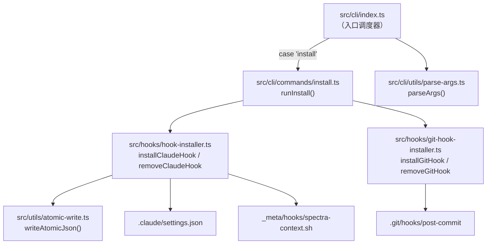
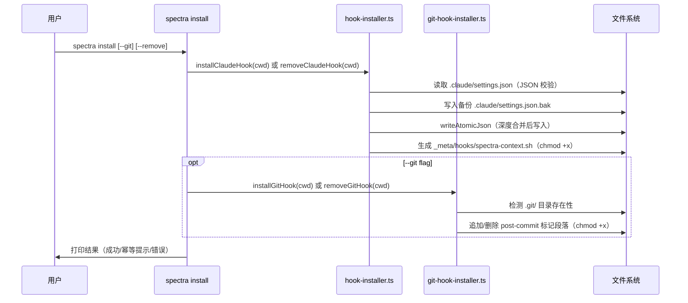

# Implementation Plan: Feature 104 — PreToolUse Hook 注入 + Post-commit Hook

**Branch**: `claude/pedantic-mendeleev` | **Date**: 2026-04-12 | **Spec**: [spec.md](./spec.md)

## 摘要

本 Feature 实现两类自动化 hook 的安装与卸载能力：

1. **Claude Code PreToolUse Hook**：将 `_meta/hooks/spectra-context.sh` 注册到 `.claude/settings.json`，使 Claude 在调用 `Glob`/`Grep` 前自动获取架构摘要（节点数、社区数、God Node 列表）。
2. **Git Post-commit Hook**：在 `.git/hooks/post-commit` 中追加标记段落，commit 后自动检测文件类型并触发增量图谱更新。

统一通过 `spectra install [--git] [--remove]` 子命令管理。技术选型遵循 Graphify 极简设计哲学：新增 `src/hooks/` 模块仅含 2 个实现文件（将 `spec.md` 中预设的 5 文件精简为 3 文件），零外部依赖，全部 Node.js 标准库实现。

---

## Technical Context

**语言/版本**: TypeScript 5.x + Node.js 20.x（ESM 模块系统）
**主要依赖**: Node.js 内置模块（`fs`、`path`、`os`、`child_process`）；`writeAtomicJson`（已有工具，`src/utils/atomic-write.ts`）
**存储**: 文件系统（`.claude/settings.json`、`.git/hooks/post-commit`、`_meta/hooks/spectra-context.sh`）
**测试框架**: Vitest（`vitest run`）；临时目录策略：`mkdtempSync` + `beforeEach/afterEach` 清理
**目标平台**: macOS/Linux（shell 脚本依赖 bash）
**性能目标**: `spectra install` 本身 < 500ms；post-commit hook 自身逻辑 < 100ms
**约束**: 零新增 npm 运行时依赖；只操作项目级配置（绝不修改 `~/.claude/settings.json`）

---

## Codebase Reality Check

> 对所有将被修改的目标文件进行扫描，记录当前状态。

| 文件 | LOC | 公开方法/接口数 | 已知 debt | 操作类型 |
|------|-----|----------------|-----------|----------|
| `src/cli/utils/parse-args.ts` | 625 | 1 函数（`parseArgs`）+ 1 interface（`CLICommand`）| 无 TODO/FIXME；`CLICommand` 接口字段较多（12 个可选字段），添加新字段符合现有模式 | 修改（新增 `install` 分支 + 3 个字段） |
| `src/cli/index.ts` | 181 | 1 函数（`main`）| 无 TODO/FIXME；帮助文本较长但有明确结构 | 修改（新增 `case 'install'` + import） |
| `src/utils/atomic-write.ts` | 30 | 1 函数（`writeAtomicJson`）| 无 | 只读使用（不修改） |

**新增文件**（不存在目标，LOC = 0）：

| 新增文件 | 预估 LOC | 说明 |
|---------|---------|------|
| `src/hooks/hook-installer.ts` | ~120 | PreToolUse hook 安装/卸载核心逻辑 |
| `src/hooks/git-hook-installer.ts` | ~100 | git post-commit hook 安装/卸载 |
| `src/cli/commands/install.ts` | ~60 | `runInstall` CLI handler（替代原来设计的 `hook-script-generator.ts` 和 `hook-types.ts`，脚本内容内联，类型定义合并到实现文件） |
| `tests/unit/hook-installer.test.ts` | ~150 | settings.json 读写/合并/幂等单元测试 |
| `tests/unit/git-hook-installer.test.ts` | ~120 | post-commit 追加/幂等/卸载单元测试 |
| `tests/integration/install-e2e.test.ts` | ~80 | 完整安装-验证-卸载 E2E 测试 |

**前置清理评估**：

- `parse-args.ts`（625 LOC）将新增约 30 行代码（< 50 行阈值），无 TODO/FIXME，无前置 cleanup 需求。
- `index.ts`（181 LOC）仅新增约 5 行，无 cleanup 需求。
- **结论**：无需前置 cleanup task，可直接进入功能实现。

---

## Impact Assessment

| 维度 | 评估 |
|------|------|
| 直接修改文件 | 2（`parse-args.ts`、`index.ts`） |
| 新增文件 | 3 个实现文件 + 3 个测试文件（共 6 个） |
| 间接受影响文件 | 1（`src/cli/utils/error-handler.ts`，只读引用，无需修改） |
| 影响文件总计 | 8 |
| 跨包影响 | 无（仅 `src/` 内部，新增 `src/hooks/` 子目录） |
| 数据迁移 | 无（操作项目本地 `.claude/settings.json`，非 spectra 自身状态文件） |
| API/契约变更 | `CLICommand` interface 新增 3 个可选字段（`installGit`、`installRemove`、`subcommand` 联合类型扩展）；不破坏已有调用方 |
| 风险等级 | **LOW** |

**风险等级判定**：影响文件 < 10 且无跨包影响，判定为 LOW。无需强制分阶段。

---

## Constitution Check

| 原则 | 适用性 | 评估 | 说明 |
|------|--------|------|------|
| I. 双语文档规范 | 适用 | PASS | 本 plan 正文中文，代码标识符英文，注释用中文 |
| II. Spec-Driven Development | 适用 | PASS | 本 Feature 通过 spec-driver 流程执行，存在完整的 spec.md |
| III. 如无必要勿增实体（YAGNI） | 适用 | PASS（调整后）| spec.md 预设 5 文件，本计划精简为 3 文件：`hook-script-generator.ts` 合并到 `hook-installer.ts`，`hook-types.ts` 的类型定义就地声明。剩余 3 文件职责明确，无过度抽象 |
| IV. 诚实标注不确定性 | 适用 | PASS | 不确定项已在 spec.md 中通过 `[CLARIFIED]` 标注 |
| V. AST 精确性优先 | 不适用 | N/A | 本 Feature 不涉及 AST 解析 |
| VI. 混合分析流水线 | 不适用 | N/A | 本 Feature 不涉及 LLM 调用 |
| VII. 只读安全性 | 部分适用 | PASS | `spectra install` 写入 `.claude/settings.json` 和 `_meta/hooks/`，均为项目输出目录，不修改源代码；NFR-003 明确禁止修改用户级配置 |
| VIII. 纯 Node.js 生态 | 适用 | PASS | 零新增 npm 依赖；shell 脚本为辅助产物，不属于 TypeScript 运行时 |
| IX-XIV（spec-driver 原则）| 不适用 | N/A | 本 Feature 属于 spectra plugin，不涉及 spec-driver 编排 |

**Constitution Check 结论**：无 VIOLATION，无豁免需要。关键调整：依据原则 III，将原设计的 5 个模块精简为 3 个（详见「极简调整」章节）。

---

## 极简调整说明（YAGNI 决策记录）

spec.md 中预设了 5 个组件文件。本计划基于 Constitution 原则 III 和 Graphify 参考要点，作如下调整：

| 原设计文件 | 调整 | 理由 |
|-----------|------|------|
| `hook-types.ts` | **删除**，类型就地声明在各使用文件 | 3 个类型接口无需独立文件；跨文件共用的 `HookConfig` 类型定义在 `hook-installer.ts` 并由测试直接导入即可 |
| `hook-script-generator.ts` | **合并**到 `hook-installer.ts` | shell 脚本内容是一段静态字符串模板，拆成独立文件反而引入无意义的模块边界 |
| `hook-installer.ts` | **保留**（吸收脚本生成职责）| 对应 FR-002、FR-003、FR-004、FR-005、FR-006、FR-007、FR-008、FR-011 |
| `git-hook-installer.ts` | **保留**（独立文件）| git hook 操作（追加段落、标记检测、chmod）与 settings.json 写入职责完全不同，合并会造成单文件职责混乱 |
| `install.ts`（原 index.ts）| **保留**，改名为 CLI handler | 对应 FR-001，薄包装层，仅负责参数校验和调用分发 |

---

## Project Structure

### 本 Feature 文档制品

```text
specs/104-pretooluse-hook/
├── spec.md              # 需求规范（已通过 GATE_DESIGN）
├── plan.md              # 本文件
├── research/
│   └── tech-research.md # 技术调研报告
└── tasks.md             # 待生成（/spec-driver.tasks）
```

### 源码布局（新增/修改）

```text
src/
├── hooks/                          # 新增目录
│   ├── hook-installer.ts           # PreToolUse hook 安装/卸载 + 脚本生成（新增）
│   └── git-hook-installer.ts       # git post-commit hook 安装/卸载（新增）
├── cli/
│   ├── index.ts                    # 新增 import + case 'install'（修改）
│   ├── commands/
│   │   └── install.ts              # runInstall() CLI handler（新增）
│   └── utils/
│       └── parse-args.ts           # CLICommand 扩展 + install 分支（修改）

tests/
├── unit/
│   ├── hook-installer.test.ts      # settings.json 读写/合并/幂等（新增）
│   └── git-hook-installer.test.ts  # post-commit 追加/幂等/卸载（新增）
└── integration/
    └── install-e2e.test.ts         # 完整安装→验证→卸载（新增）
```

**运行时产物**（由 `spectra install` 写入，不纳入版本控制）：

```text
.claude/
└── settings.json              # 注入 hooks.PreToolUse 条目

_meta/
└── hooks/
    └── spectra-context.sh     # 生成的 shell 脚本（chmod +x）

.git/
└── hooks/
    └── post-commit            # 追加 spectra 段落
```

---

## 架构设计

### 模块依赖关系



### 数据流



---

## 接口设计

### 1. `src/hooks/hook-installer.ts`

```typescript
/** settings.json 中 hook 条目结构 */
export interface HookConfig {
  matcher: string;   // 如 "Glob|Grep"
  command: string;   // 如 "bash _meta/hooks/spectra-context.sh"
}

/** settings.json 顶层结构（保留未知字段） */
export interface ClaudeSettings {
  hooks?: {
    PreToolUse?: HookConfig[];
    PostToolUse?: HookConfig[];
  };
  [key: string]: unknown;
}

/**
 * 安装 Claude Code PreToolUse hook
 * 幂等：已安装时打印提示并返回，不重复写入
 * @param projectRoot - 项目根目录绝对路径
 */
export function installClaudeHook(projectRoot: string): void;

/**
 * 卸载 Claude Code PreToolUse hook
 * 幂等：未找到时静默退出
 * @param projectRoot - 项目根目录绝对路径
 */
export function removeClaudeHook(projectRoot: string): void;

/**
 * 生成 spectra-context.sh 脚本内容
 * （包可见，供测试验证脚本格式）
 */
export function generateContextScript(): string;
```

**错误处理**：
- `settings.json` 存在但非合法 JSON → `throw new Error('[spectra] settings.json 格式错误，请手动修复后重试。')`，调用方捕获并以非零退出码退出
- `.claude/` 目录不存在 → `mkdirSync({ recursive: true })` 自动创建，不报错
- `_meta/hooks/` 目录不存在 → `mkdirSync({ recursive: true })` 自动创建

**幂等判定**：检查 `settings.PreToolUse` 数组中是否存在 `command` 包含 `spectra-context.sh` 的条目。

**备份策略**：每次写入前 `copyFileSync(settingsPath, settingsPath + '.bak')`，Last-Write-Wins（不累积备份）。

---

### 2. `src/hooks/git-hook-installer.ts`

```typescript
/**
 * 安装 git post-commit hook 段落
 * 幂等：段落已存在时打印提示并返回
 * @param projectRoot - 项目根目录绝对路径
 * @throws 当 .git/ 目录不存在时（FR-013）
 */
export function installGitHook(projectRoot: string): void;

/**
 * 卸载 git post-commit hook 段落
 * 幂等：段落不存在时静默退出
 * @param projectRoot - 项目根目录绝对路径
 */
export function removeGitHook(projectRoot: string): void;

/**
 * 生成 post-commit spectra 段落内容
 * （包可见，供测试验证脚本格式）
 */
export function generatePostCommitSegment(): string;
```

**错误处理**：
- `.git/` 不存在 → `throw new Error('[spectra] .git directory not found. Is this a git repository?')`
- `post-commit` 文件不存在时，`installGitHook` 先写入 `#!/bin/sh\n` 头部再追加段落

**标记段落边界**（精确字符串）：
- 开始：`# --- spectra begin ---`
- 结束：`# --- spectra end ---`

**幂等判定**：`readFileSync` 检查文件是否包含开始标记字符串。

---

### 3. `src/cli/commands/install.ts`

```typescript
import type { CLICommand } from '../utils/parse-args.js';

/**
 * install 子命令 handler
 * 薄包装层：参数校验 + 调用 hook-installer / git-hook-installer
 */
export function runInstall(command: CLICommand): void;
```

**职责边界**：`runInstall` 仅做 try/catch 包装和 `process.exitCode` 设置，业务逻辑均在 `hook-installer` 和 `git-hook-installer` 中。

---

### 4. `src/cli/utils/parse-args.ts` 修改点

`CLICommand` interface 新增字段：

```typescript
/** install 子命令：是否同时操作 git hook */
installGit?: boolean;
/** install 子命令：是否切换为卸载模式 */
installRemove?: boolean;
```

`subcommand` 联合类型新增 `'install'` 值：

```typescript
subcommand: 'generate' | 'batch' | ... | 'query' | 'install';
```

`parseArgs` 新增 `if (sub === 'install')` 分支（约 25 行），遵循现有同类分支模式：

```typescript
if (sub === 'install') {
  const installGit = argv.includes('--git');
  const installRemove = argv.includes('--remove');
  return {
    ok: true,
    command: {
      subcommand: 'install',
      installGit,
      installRemove,
      deep: false, force: false, version: false, help: false,
      global: false, remove: false, skillTarget: defaultSkillTarget(),
    },
  };
}
```

另需修改现有的 `--remove` 孤立 flag 错误检测：当 `sub !== 'init' && sub !== 'install'` 时才报错（避免 `--remove` 在 `install` 子命令下被误拦截）。

---

## Shell 脚本设计

### `spectra-context.sh` 逻辑流程

```bash
#!/bin/bash
set -euo pipefail

GRAPH_FILE="_meta/graph.json"
REPORT_FILE="_meta/GRAPH_REPORT.md"

# 静默降级：graph.json 不存在时直接退出
[ -f "$GRAPH_FILE" ] || exit 0

# 读取节点数
NODE_COUNT=$(node -e "
  try {
    const g = JSON.parse(require('fs').readFileSync('$GRAPH_FILE','utf8'));
    console.log(g.graph?.nodeCount ?? 0);
  } catch(e) { process.exit(0); }
")

# 读取社区数：从 GRAPH_REPORT.md grep，fallback 为 N/A
COMMUNITY_COUNT="N/A"
if [ -f "$REPORT_FILE" ]; then
  COMMUNITY_COUNT=$(grep -oP '(?<=\| 社区 \| )\d+' "$REPORT_FILE" 2>/dev/null | head -1 || echo "N/A")
fi

# 读取 God Nodes（按 degree 排序取前 5）
GOD_NODES=$(node -e "
  try {
    const g = JSON.parse(require('fs').readFileSync('$GRAPH_FILE','utf8'));
    const nodes = (g.nodes || [])
      .filter(n => n.metadata?.degree != null)
      .sort((a,b) => (b.metadata.degree - a.metadata.degree))
      .slice(0,5)
      .map(n => n.label + '(' + n.metadata.degree + ')')
      .join(', ');
    console.log(nodes || 'none');
  } catch(e) { console.log('none'); }
")

echo "spectra: Knowledge graph loaded ($NODE_COUNT nodes · $COMMUNITY_COUNT communities)"
echo "God nodes: $GOD_NODES"
echo "→ Read specs/project/graph-report.md before searching raw files."

exit 0
```

**设计决策**：
- 使用 `node -e` 内联脚本解析 JSON，避免依赖 `jq`（macOS 默认不含 `jq`，NFR-005 要求零外部工具依赖）
- 任何 node 脚本内部异常均 `process.exit(0)` 或 `console.log('none')`，确保 hook 不阻塞 Claude
- `COMMUNITY_COUNT` 从 `GRAPH_REPORT.md` grep，与 spec.md `[CLARIFIED]` 一致

**安全性**：`set -euo pipefail` 保证脚本在意外情况下快速退出；所有路径均为相对路径（相对于项目根目录，即 Claude Code 的工作目录）。

---

### post-commit hook 段落逻辑流程

```sh
# --- spectra begin ---
_spectra_changed=$(git diff HEAD~1 HEAD --name-only 2>/dev/null || true)

_spectra_has_code=$(echo "$_spectra_changed" | grep -E '\.(ts|js|tsx|jsx|py|go|rs|java|rb|php|cs)$' | wc -l | tr -d ' ')
_spectra_has_docs=$(echo "$_spectra_changed" | grep -E '\.(md|txt|rst|adoc)$' | wc -l | tr -d ' ')

if [ "$_spectra_has_code" -gt 0 ]; then
  # 后台运行，hook 本身 <100ms 完成（FR-010 CLARIFIED 约定）
  nohup spectra graph > /dev/null 2>&1 &
fi

if [ "$_spectra_has_docs" -gt 0 ]; then
  echo "[spectra] Docs changed. Run 'spectra batch --update' to refresh."
fi
# --- spectra end ---
```

**设计决策**：
- 后台运行（`nohup ... &`）：与 spec.md `[CLARIFIED]` 约定完全一致，git post-commit 是同步阻塞的，若同步运行 `spectra graph` 将阻塞用户 git 工作流
- 使用 `#!/bin/sh` 兼容（段落内用 POSIX sh 语法，不用 bash 特性）
- `2>/dev/null || true` 保证 initial commit（无 HEAD~1）时安全退出

---

## 实现顺序

### Phase 1：类型与解析层（对应 FR-001）

**步骤 1.1 — `parse-args.ts` 修改**

- 扩展 `CLICommand.subcommand` 联合类型，加入 `'install'`
- 新增 `installGit?: boolean` 和 `installRemove?: boolean` 字段
- 在 `parseArgs` 中添加 `install` 分支（约 25 行）
- 调整 `--remove` 孤立 flag 错误检测逻辑

修改文件：`src/cli/utils/parse-args.ts`

---

### Phase 2：核心实现层（对应 FR-002 ~ FR-013）

**步骤 2.1 — `hook-installer.ts`（对应 FR-002、FR-003、FR-004、FR-005、FR-006、FR-007、FR-008、FR-011）**

实现顺序：
1. `HookConfig` / `ClaudeSettings` 类型定义
2. `generateContextScript()` — 返回 shell 脚本字符串
3. `installClaudeHook(projectRoot)` — 读取→校验→合并→备份→原子写入→生成脚本
4. `removeClaudeHook(projectRoot)` — 读取→过滤→原子写入

新增文件：`src/hooks/hook-installer.ts`

**步骤 2.2 — `git-hook-installer.ts`（对应 FR-009、FR-010、FR-012、FR-013）**

实现顺序：
1. `generatePostCommitSegment()` — 返回 post-commit 段落字符串
2. `installGitHook(projectRoot)` — 检测 `.git/`→读取→幂等检查→追加→chmod
3. `removeGitHook(projectRoot)` — 读取→段落删除（正则匹配标记边界）→写回→保持 chmod

新增文件：`src/hooks/git-hook-installer.ts`

**步骤 2.3 — `install.ts` CLI handler（对应 FR-001）**

实现顺序：
1. `runInstall(command)` — try/catch 包装，调用 2.1/2.2 函数，设置 `process.exitCode`
2. 更新 `src/cli/index.ts`：import + `case 'install'`
3. 更新 `src/cli/index.ts` 帮助文本

修改文件：`src/cli/index.ts`；新增文件：`src/cli/commands/install.ts`

---

### Phase 3：测试（对应 FR-014）

**步骤 3.1 — `tests/unit/hook-installer.test.ts`**

覆盖点：
- `settings.json` 不存在时自动创建（FR-002）
- 合法 JSON 深度合并，保留已有字段
- 非法 JSON 报错不修改原文件（FR-003）
- 幂等安装：重复调用不产生重复条目（FR-004）
- `generateContextScript()` 输出包含 `#!/bin/bash`、`set -euo pipefail`、`exit 0`
- `removeClaudeHook` 只删除 spectra 条目，保留其他条目

**步骤 3.2 — `tests/unit/git-hook-installer.test.ts`**

覆盖点：
- `.git/` 不存在时抛出错误（FR-013）
- `post-commit` 不存在时创建带 `#!/bin/sh` 头部的文件
- 已存在非 spectra 内容时追加，原内容保留（FR-009）
- 幂等：标记已存在时跳过，不重复追加（FR-009）
- `removeGitHook` 精确删除标记段落，非 spectra 内容保留（FR-012）
- 卸载后文件保持可执行权限

**步骤 3.3 — `tests/integration/install-e2e.test.ts`**

场景：
- 完整安装 → 验证 settings.json 内容 → 验证脚本文件存在且可执行 → 卸载 → 验证清除
- `spectra install --git` 完整流程（构建真实 git 仓库）
- 幂等性：三次安装后 hook 条目数量 = 1

---

## 测试工具函数约定

所有测试共享以下辅助模式（就地内联，不抽象为独立工具文件）：

```typescript
// 构建临时目录（含 .git 结构，用于 git hook 测试）
function makeTempGitRepo(): string {
  const dir = mkdtempSync(join(tmpdir(), 'spectra-test-'));
  mkdirSync(join(dir, '.git', 'hooks'), { recursive: true });
  return dir;
}

// 读取 settings.json 内容
function readSettings(dir: string): ClaudeSettings {
  return JSON.parse(readFileSync(join(dir, '.claude', 'settings.json'), 'utf-8'));
}
```

---

## 风险缓解方案

| 风险 | 可能性 | 影响 | 技术缓解方案 |
|------|--------|------|------------|
| Claude Code hooks JSON schema 变更 | 低 | 高 | `installClaudeHook` 使用深度合并策略（不覆盖已有结构），仅追加 `PreToolUse` 数组条目；schema 变更后只需更新 matcher/command 字段值 |
| `graph.json` 路径不一致（specs/_meta/ vs _meta/）| 中 | 中 | hook 脚本以 `exit 0` 静默跳过（FR-007）；脚本使用相对路径，运行时路径由 Claude Code 的 cwd 决定 |
| post-commit hook 阻塞 git 工作流 | 中 | 高 | `nohup spectra graph > /dev/null 2>&1 &` 后台运行（spec.md CLARIFIED 约定），hook 自身逻辑 < 100ms |
| settings.json 并发写入 | 低 | 中 | `writeAtomicJson`（tmp → rename 原子操作，FR-002） |
| init / install 命令语义混淆 | 中 | 低 | 帮助文本显式说明：`init` = skill 安装，`install` = hook 安装；help text 分段描述 |
| `--remove` flag 被 init 分支误拦截 | 低 | 中 | 修改现有孤立 flag 检测逻辑：`--remove` 错误只在 `sub !== 'init' && sub !== 'install'` 时触发 |

---

## Complexity Tracking

> 本 Feature 无 Constitution VIOLATION，以下记录主动偏离简单方案的设计决策及理由。

| 决策点 | 选择 | 简单替代方案 | 选择理由 |
|--------|------|------------|---------|
| 社区数量读取方式 | `grep` 从 `GRAPH_REPORT.md` 提取 | 从 graph.json 统计 unique communityId | Feature 101 的 `GraphJSON` 不含 `communityCount`，Feature 102 结果只写 Markdown；`jq` 统计 array 性能差且依赖外部工具 |
| JSON 解析工具 | shell 中用 `node -e` | `jq` | macOS 默认不含 `jq`；NFR-005 零外部工具依赖 |
| post-commit 运行模式 | `nohup ... &` 后台运行 | 同步运行 `spectra graph` | git post-commit 是同步阻塞的，`spectra graph` 可能耗时数秒，阻塞用户工作流（spec.md CLARIFIED） |
| 5 文件精简为 3 文件 | 合并 generator + types | 保持原设计 5 文件 | Constitution 原则 III（YAGNI）；shell 脚本内容是静态字符串，类型接口不足以支撑独立文件 |
