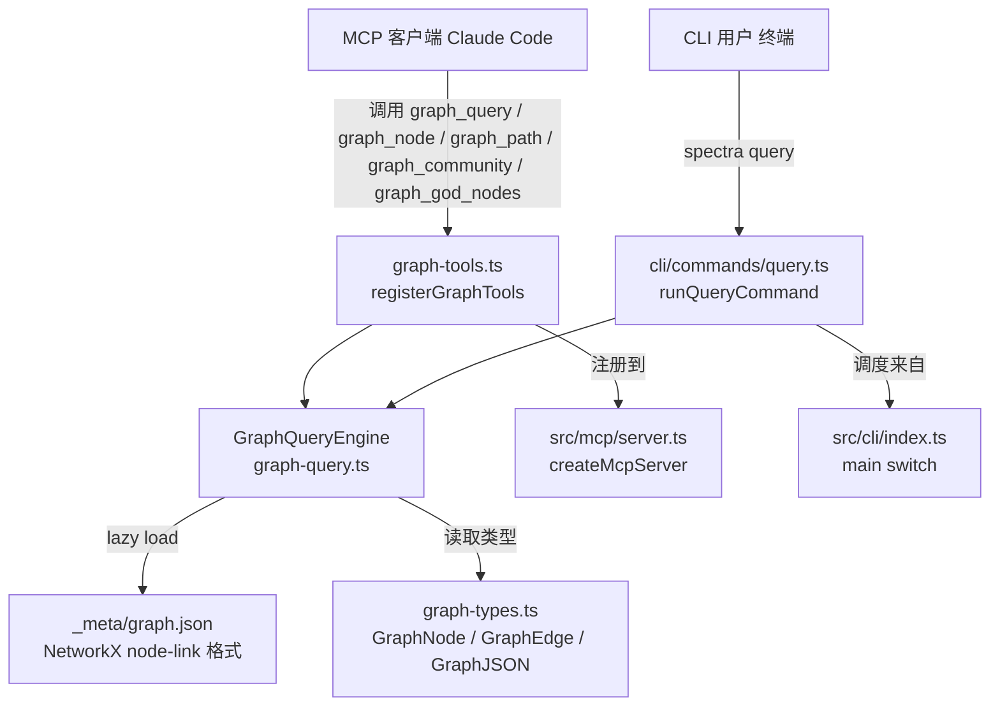

# Implementation Plan: MCP Graph Query 工具集

**Branch**: `105-mcp-graph-query` | **Date**: 2026-04-12 | **Spec**: [spec.md](./spec.md)
**Input**: Feature specification from `/specs/105-mcp-graph-query/spec.md`

## 摘要

基于 Feature 101 生成的 `_meta/graph.json` 知识图谱，为 MCP server 新增 5 个 graph query tool（`graph_query`、`graph_node`、`graph_path`、`graph_community`、`graph_god_nodes`），并同步新增 `spectra query` CLI 子命令。图遍历逻辑采用纯 JavaScript BFS/DFS 实现，不引入任何新运行时依赖，参照 graphify 项目的极简设计，将加载和索引合并于单一 `GraphQueryEngine` 类中。

## 技术上下文

**Language/Version**: TypeScript 5.x + Node.js 20.x LTS
**Primary Dependencies**: `@modelcontextprotocol/sdk`（已存在）、`zod`（已存在）
**Storage**: 磁盘文件 `_meta/graph.json`（NetworkX node-link 格式），运行时内存缓存（lazy load）
**Testing**: `vitest`（项目现有测试框架）
**Target Platform**: Node.js CLI + MCP stdio server
**Performance Goals**: `graph_query` P95 < 500ms（图已加载）；`graph.json` 磁盘加载 < 2s（5,000 节点）；`graph_path` < 100ms；`graph_node` 按 ID < 50ms
**Constraints**: 零新增运行时依赖（FR-014 / Constitution VIII）；所有 graph tool 错误返回 `isError: true`，不 crash（FR-008）
**Scale/Scope**: 目标支持 5,000 节点规模的知识图谱；内存缓存 + lazy load 单实例模型

---

## Codebase Reality Check

对本次将被修改的目标文件进行逐一审查：

| 文件 | LOC | 公开接口数 | 已知 debt | 状态 |
|------|-----|------------|-----------|------|
| `src/mcp/server.ts` | 253 | 5 个 MCP tool + `createMcpServer()` | 无 TODO/FIXME；`require('node:path')` 内联调用（非标准 ESM 用法，第 61-62 行） | 将新增 ~15 行（import + `registerGraphTools` 调用）|
| `src/cli/index.ts` | 166 | `main()` + 11 个 switch case | 无 TODO/FIXME；结构清晰 | 将新增 ~10 行（import + case + HELP_TEXT）|
| `src/panoramic/graph/index.ts` | 11 | 3 个 re-export 行 | 无 | 将新增 1 行（导出 GraphQueryEngine）|
| `src/panoramic/graph/graph-types.ts` | 119 | 5 个类型/接口 | 无 | 只读引用，不修改；新增查询结果类型定义于新文件 |

**前置清理规则评估**：

- `server.ts`（253 行）新增 ~15 行，不超过 500 行阈值，且无相关 TODO/FIXME——**无需前置清理 task**。
- `cli/index.ts`（166 行）新增 ~10 行——**无需前置清理 task**。
- 无文件满足前置清理触发条件。

---

## Impact Assessment

| 维度 | 评估 |
|------|------|
| **直接修改文件** | 3 个（`server.ts`、`cli/index.ts`、`graph/index.ts`） |
| **新增文件** | 3 个（`graph-query.ts`、`graph-tools.ts`、`cli/commands/query.ts`） |
| **间接受影响** | MCP 客户端（Claude Code）通过新 tool 调用；无其他调用方需修改 |
| **跨包影响** | 仅 `src/` 内部；跨越 `panoramic/graph/` → `mcp/` → `cli/` 三个子目录，均在同一顶层包内 |
| **数据迁移** | 无，消费现有 `_meta/graph.json`，不修改其 schema |
| **API/契约变更** | 新增 5 个 MCP tool（`graph_query`、`graph_node`、`graph_path`、`graph_community`、`graph_god_nodes`）；新增 1 个 CLI 子命令（`query`）；不修改任何现有接口 |
| **风险等级** | **LOW** |

**风险等级判定**：影响文件 6 个（< 10），无跨顶层包影响，无数据迁移，不修改任何现有公共 API 契约。

---

## Constitution Check

| 原则 | 适用性 | 评估 | 说明 |
|------|--------|------|------|
| **I. 双语文档规范** | 适用 | PASS | 本计划及所有设计文档使用中文散文 + 英文代码标识符 |
| **II. Spec-Driven Development** | 适用 | PASS | 已通过 spec.md → plan.md → tasks.md 流程；不直接修改源代码 |
| **III. YAGNI / 奥卡姆剃刀** | 适用 | PASS | 将 graph-loader.ts 和 graph-index.ts 合并入 `GraphQueryEngine`（参照 graphify 设计）；不为"以后可能用到"的泛化场景创建额外层 |
| **IV. 诚实标注不确定性** | 适用 | PASS | 所有推断均在 research.md 中标注理由 |
| **V. AST 精确性优先** | 不适用 | N/A | 本 Feature 是图查询消费层，不生成 AST 分析内容 |
| **VI. 混合分析流水线** | 不适用 | N/A | 本 Feature 不涉及 LLM 生成流水线 |
| **VII. 只读安全性** | 适用 | PASS | 所有 graph tool 仅读取 `_meta/graph.json`，不写入任何源文件 |
| **VIII. 纯 Node.js 生态** | 适用 | PASS | FR-014 明确要求零新增运行时依赖；BFS/DFS 纯 JS 实现；复用现有 `zod` 和 `@modelcontextprotocol/sdk` |
| **IX-XIV（spec-driver 原则）** | 不适用 | N/A | 本 Feature 属于 spectra plugin，不涉及 spec-driver 插件开发 |

**结论：无 VIOLATION，Constitution Check PASS。**

---

## 项目结构

### 本 Feature 文档制品

```text
specs/105-mcp-graph-query/
├── spec.md              # 需求规范（已生成，142 行）
├── plan.md              # 本文件
├── tasks.md             # 任务清单（本次一并生成）
└── research.md          # 技术决策研究（本次一并生成）
```

### 源代码修改布局

```text
src/
├── panoramic/
│   └── graph/
│       ├── graph-query.ts        # [新增] GraphQueryEngine — 图加载 + 索引 + 查询
│       ├── graph-types.ts        # [只读] 现有类型，新增 QueryResult 等接口于 graph-query.ts 内部
│       ├── graph-builder.ts      # [只读] 现有构建器，不修改
│       └── index.ts              # [修改] 新增 GraphQueryEngine 导出
├── mcp/
│   ├── server.ts                 # [修改] 调用 registerGraphTools(server)
│   └── graph-tools.ts            # [新增] 5 个 MCP tool 注册函数
└── cli/
    ├── index.ts                  # [修改] 新增 'query' case + import + HELP_TEXT
    └── commands/
        ├── graph.ts              # [只读] 现有 graph 子命令，不修改
        └── query.ts              # [新增] spectra query 子命令处理函数
```

**结构决策**：单项目结构（TypeScript 单包），所有新增文件均在现有 `src/` 目录下按模块关系放置。

---

## 架构设计

### 系统组件图



### 核心类：GraphQueryEngine（~250 行）

```typescript
export class GraphQueryEngine {
  private graph: GraphJSON;
  private nodeMap: Map<string, GraphNode>;        // id → node
  private adjacency: Map<string, Array<{ node: string; edge: GraphEdge }>>;

  constructor(graph: GraphJSON);
  static loadFromFile(graphPath: string): GraphQueryEngine;

  // 公开查询方法（对应 5 个 MCP tool）
  query(question: string, options?: { budget?: number; mode?: 'bfs' | 'dfs'; depth?: number }): QueryResult;
  getNode(params: { id?: string; keyword?: string; budget?: number }): NodeResult;
  findPath(source: string, target: string): PathResult;
  getCommunity(communityId: string, budget?: number): CommunityResult;
  getGodNodes(limit?: number): GodNodesResult;

  // 内部方法
  private scoreNodes(terms: string[]): Array<{ id: string; score: number }>;
  private bfs(startIds: string[], depth: number): { nodes: Set<string>; edges: Array<[string, string]> };
  private truncateByBudget(nodes: GraphNode[], budget: number): { nodes: GraphNode[]; truncated: boolean; totalMatches: number };
}
```

**关键内部逻辑参照 graphify 实现**：

- `scoreNodes()`：对每个节点计算关键词匹配分（label 权重 1.0，metadata.path 权重 0.5），返回按分数降序排列的节点 ID 列表。
- `bfs()`：按层遍历邻接表，返回访问节点集合和遍历到的边列表。
- `truncateByBudget()`：当节点数超过 budget 时，按度数降序截断，标注 `truncated: true` 和 `totalMatches`。

### MCP Tool 注册器（~150 行）

`registerGraphTools(server, getEngine)` 函数：

- 定义 5 个 Zod schema（含完整 `description` 字段，供 Claude 决策调用时机）。
- Lazy load 策略：首次调用任意 tool 时从磁盘加载 graph，后续复用内存缓存。
- 错误处理：`graph.json` 不存在或格式错误时，返回 `isError: true` 的结构化响应。
- `reloadGraph()` 支持：提供工具 handler 重置缓存，下次调用时重新加载。

### CLI Query 命令（~80 行）

`runQueryCommand()` 函数：

- 从 `process.cwd()` 查找 `_meta/graph.json`（不存在时打印友好错误，exit code 1）。
- 调用 `GraphQueryEngine.loadFromFile()` + `.query()`。
- `--format text`：生成人类可读摘要（节点 label + 关系列表）。
- `--format json`：`JSON.stringify` 输出 `QueryResult`（可通过 `JSON.parse` 解析）。

---

## 实现策略

### 阶段划分

**Phase 1 — 核心引擎**（阻塞后续所有工作）：
先实现 `GraphQueryEngine`，包含 `loadFromFile()`、`scoreNodes()`、`bfs()`、`truncateByBudget()` 和 5 个公开查询方法。该类是 MCP tool 和 CLI 命令共同的基础依赖。

**Phase 2 — MCP Tool 层**（依赖 Phase 1）：
实现 `graph-tools.ts` 中的 `registerGraphTools()`，将 5 个 MCP tool 的 Zod schema + handler 串联到 `GraphQueryEngine`。修改 `server.ts` 注册。

**Phase 3 — CLI 命令层**（依赖 Phase 1，可与 Phase 2 并行）：
实现 `cli/commands/query.ts` 的 `runQueryCommand()`，修改 `cli/index.ts` 添加 `'query'` 分支。

### 错误处理规范

所有 MCP tool handler 的错误响应格式：

```typescript
{ content: [{ type: 'text', text: JSON.stringify({ error: '...', hint: '运行 spectra graph 先生成图谱' }) }], isError: true }
```

CLI 错误：打印带前缀的错误信息至 stderr，`process.exitCode = 1`（不使用 `process.exit()` 直接退出，保持一致性）。

### budget 处理规范

- 默认 budget = 50。
- budget ≤ 0 时使用默认值并在响应中标注 `{ warning: 'budget 无效，使用默认值 50' }`。
- `truncateByBudget()` 按节点度数降序截断（高连接度节点优先保留，符合 FR-010 优先级策略）。

---

## 复杂度追踪

> 无 Constitution VIOLATION，本节记录偏离最简方案的有据可查决策。

| 决策点 | 选择 | 理由 |
|--------|------|------|
| 图加载和索引合并入 `GraphQueryEngine` 构造函数 | YAGNI 合并 | `loadFromFile()` 只在 2 处调用（graph-tools + query.ts）；独立 loader/index 类会增加 2 个无状态包装文件（+50 行）而无复用价值 |
| MCP tool 独立文件 `graph-tools.ts` 而非直接写入 `server.ts` | 合理分离 | `server.ts` 已 253 行，新增 5 个 tool 定义（~150 行）后将达 400 行，超过合理单文件上限；分离后 `server.ts` 保持 ~270 行 |
| BFS 而非 DFS 作为 `graph_query` 默认模式 | BFS 优先 | BFS 按层遍历天然生成"近似度递减"的结果集，符合"相关节点"语义；DFS 作为可选参数保留 |
| `graph_path` 使用 BFS 最短路径（非 Dijkstra） | 无权图简化 | `GraphJSON` 边无权重（仅 `confidenceScore`），无权图 BFS 即可求最短路径，无需引入 Dijkstra 实现 |
