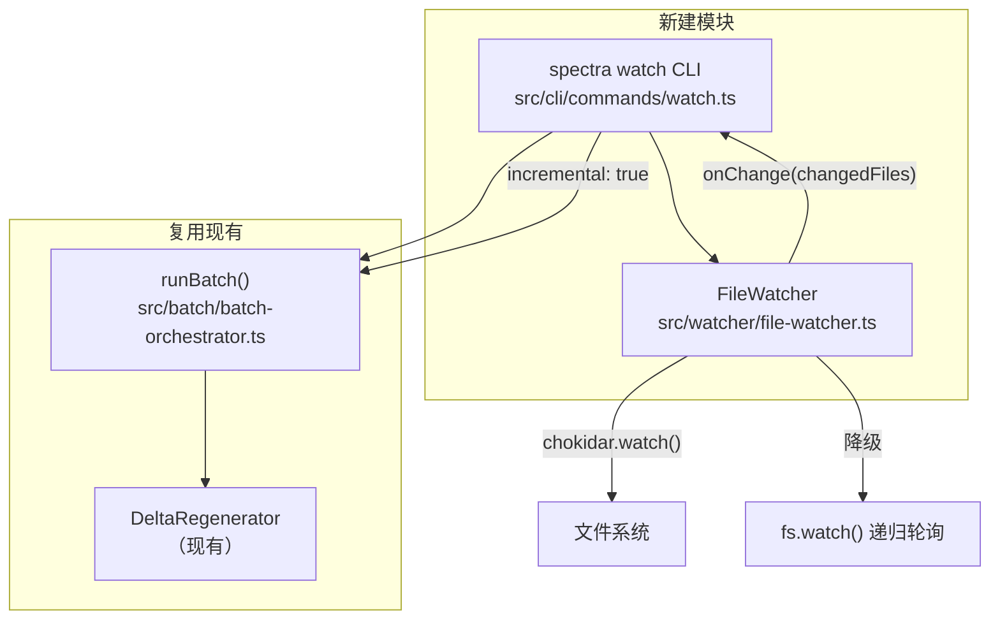

# Feature 106 技术实现计划：文件监听 + 自动增量同步

**Feature Branch**: `106-watch-incremental`
**Created**: 2026-04-12
**Status**: Draft

---

## Summary

Feature 106 在现有 `batch --incremental` 路径之上叠加一层文件监听外壳，实现"代码变更 → 自动文档同步"的持续监听能力。核心设计原则：**最小化新增逻辑，最大化复用已有组件**。

技术路径：`spectra watch` 启动后，使用 chokidar v4.x 监听项目目录，通过 3 秒 debounce 收集变更文件集，然后直接调用已有的 `runBatch({ incremental: true })` 完成增量更新。整个 watch 进程内串行执行，无需锁文件或中间状态文件。

---

## Technical Context

| 维度 | 值 |
|------|-----|
| 语言/版本 | TypeScript 5.x + Node.js 20.x+ |
| 模块系统 | ESM（`"type": "module"` + `"moduleResolution": "bundler"`） |
| 新增依赖 | chokidar@^4.x（ESM-first，无 CJS 兼容层） |
| 降级策略 | chokidar 初始化失败时回退 `fs.watch` 递归模式 + 5 秒轮询 |
| 测试框架 | vitest（与现有测试一致） |
| 增量路径 | 复用 `BatchOrchestrator.runBatch({ incremental: true })` |

---

## Codebase Reality Check

| 目标文件 | LOC | 主要方法/接口数 | 已知 Debt |
|----------|-----|-----------------|-----------|
| `src/cli/utils/parse-args.ts` | 453 | `parseArgs`、`CLICommand` interface | 无 TODO/FIXME；L290 的多联 `&&` 校验在增加子命令后需维护 |
| `src/cli/index.ts` | 151 | `main`、`HELP_TEXT`、switch 分支 | 无明显 debt；switch 分支线性增长可接受 |
| `src/cli/commands/cache.ts` | 74 | `runCacheCommand` | 无 |

**新建文件**（不存在 debt 基线）：
- `src/cli/commands/watch.ts`（预计 ~120 行）
- `src/watcher/file-watcher.ts`（预计 ~180 行）

**前置清理规则判定**：
- `parse-args.ts` LOC 453 > 500 阈值未超，新增约 30 行，不触发前置清理
- 无 TODO/FIXME 标记相关
- **结论**：无需前置 `[CLEANUP]` 任务

---

## Impact Assessment

| 维度 | 值 |
|------|-----|
| 直接修改文件数 | 2（`parse-args.ts`、`index.ts`） |
| 新建文件数 | 2（`watch.ts`、`file-watcher.ts`） |
| 跨包影响 | 无（仅在 `src/cli/` 和新建 `src/watcher/` 内） |
| 数据迁移 | 无 |
| API / 契约变更 | `CLICommand` interface 新增字段（向后兼容，可选字段） |
| 风险等级 | **LOW** |

**判定理由**：影响文件 4 个（< 10），无跨顶层包边界，无 schema 变更，`CLICommand` 新增可选字段不破坏现有调用方。

---

## Architecture



### 组件职责

**`FileWatcher`**（`src/watcher/file-watcher.ts`）
- 封装 chokidar v4.x；初始化失败时降级到 `fs.watch`
- 读取并解析 `.gitignore`；合并内置默认忽略规则
- 维护 debounce timer（`setTimeout` / `clearTimeout`）
- 收集变更文件集（`Set<string>`），debounce 到期后触发回调
- 变更分类：按文件扩展名映射到 `'code' | 'docs' | 'config'`
- 导出 `start()` / `stop()` 生命周期接口

**`runWatchCommand`**（`src/cli/commands/watch.ts`）
- 解析 `WatchOptions`（debounce 时长、verbose 等）
- 实例化 `FileWatcher`，注册 `onChange` 回调
- `onChange` 回调内：检测外部 batch 进程 → 若 `isRunning` 为真则记录 pending → 否则触发 `runBatch({ incremental: true })`
- 管理 `isRunning` 布尔标志（串行保护）
- 注册 `SIGINT` / `SIGTERM` 信号处理器；等待当前 batch 完成后调用 `watcher.stop()` 退出

---

## 文件变更清单

### 新建文件

| 文件路径 | 说明 |
|----------|------|
| `src/watcher/file-watcher.ts` | 文件监听核心模块：chokidar 封装、降级、debounce、.gitignore 解析、变更分类 |
| `src/cli/commands/watch.ts` | watch 子命令 handler：生命周期管理、并发保护、信号处理 |

### 修改文件

| 文件路径 | 变更说明 |
|----------|----------|
| `src/cli/utils/parse-args.ts` | `CLICommand.subcommand` 联合类型添加 `'watch'`；新增 `watchDebounce?: number`、`watchVerbose?: boolean` 字段；`parseArgs` 添加 `watch` 解析分支；L290 多联校验字符串添加 `'watch'` |
| `src/cli/index.ts` | 新增 `import { runWatchCommand }` 语句；`HELP_TEXT` 添加 watch 用法说明；`switch` 块添加 `case 'watch'` 分支 |
| `package.json` | `dependencies` 添加 `"chokidar": "^4.0.0"` |

---

## 关键实现细节

### 1. chokidar v4.x 集成 + 降级路径

```typescript
// 初始化逻辑（伪代码）
async function initWatcher(rootDir: string, ignored: string[]): Promise<WatcherAdapter> {
  try {
    const { watch } = await import('chokidar');
    const watcher = watch(rootDir, {
      ignored,
      ignoreInitial: true,   // 启动时不触发已有文件的 add 事件
      persistent: true,
      awaitWriteFinish: { stabilityThreshold: 200, pollInterval: 100 },
    });
    return new ChokidarAdapter(watcher);
  } catch (err) {
    console.warn('[watch] chokidar 初始化失败，降级到原生 fs.watch（轮询间隔 5 秒）');
    return new NativeFsWatchAdapter(rootDir, { interval: 5000 });
  }
}
```

chokidar v4.x 为 ESM-only 包，需要 dynamic `import()`（项目已是 ESM，无兼容问题）。`awaitWriteFinish` 选项避免编辑器"先清空后写入"触发误判。

### 2. Debounce 实现策略

使用简单的 `setTimeout` + `clearTimeout` 模式，无需引入额外库：

```typescript
// FileWatcher 内部状态
private debounceTimer: ReturnType<typeof setTimeout> | null = null;
private pendingChanges: Set<string> = new Set();

private handleRawChange(filePath: string): void {
  this.pendingChanges.add(filePath);
  if (this.debounceTimer) clearTimeout(this.debounceTimer);
  this.debounceTimer = setTimeout(() => {
    const batch = new Set(this.pendingChanges);
    this.pendingChanges.clear();
    this.debounceTimer = null;
    this.onChange(batch);  // 触发回调
  }, this.debounceMs);
}
```

`debounceMs` 默认 3000（毫秒），可通过 `--debounce <seconds>` 覆盖。

### 3. 变更文件集传递给 runBatch

spec 中 FR-008 要求将变更文件集传递给增量判定逻辑。`BatchOrchestrator.runBatch()` 的 `BatchOptions` 当前没有 `changedFiles` 字段，`DeltaRegenerator.plan()` 也基于 AST hash 比对自动判断变更。

**实现方案**：watch handler 调用 `runBatch({ incremental: true })`，DeltaRegenerator 内部会通过比对现有 spec 的 AST hash 与源文件的当前 hash 来确定哪些模块需要重生成。watch 感知到的 `changedFiles` 集合用于**日志输出**（打印哪些文件触发了本轮更新），而不直接注入到 `runBatch` 的增量判定流程（避免引入新的增量语义，遵循 FR-007）。

如果后续需要精确的"仅分析受 changedFiles 影响的模块"优化，可在 `BatchOptions` 添加 `hintChangedFiles?: string[]` 字段，但这属于性能优化，不在本 feature 范围内。

### 4. .gitignore 读取与解析

```typescript
import { readFileSync, existsSync } from 'node:fs';
import { resolve } from 'node:path';

// 内置默认忽略规则
const DEFAULT_IGNORED = ['.git', 'node_modules', 'dist', 'specs', '_meta'];

function loadIgnorePatterns(projectRoot: string): string[] {
  const gitignorePath = resolve(projectRoot, '.gitignore');
  const patterns = [...DEFAULT_IGNORED];

  if (existsSync(gitignorePath)) {
    const lines = readFileSync(gitignorePath, 'utf-8').split('\n');
    for (const line of lines) {
      const trimmed = line.trim();
      // 跳过注释和空行
      if (!trimmed || trimmed.startsWith('#')) continue;
      patterns.push(trimmed);
    }
  }

  return patterns;
}
```

chokidar 的 `ignored` 选项接受字符串数组（glob 模式），可直接传入。不引入 `ignore` 或 `minimatch` 等额外依赖——chokidar v4.x 内部使用 `picomatch` 处理 glob，与 `.gitignore` 语法高度兼容。

### 5. SIGINT / SIGTERM 优雅退出

```typescript
// watch.ts 内
let isRunning = false;
let pendingShutdown = false;

function setupSignalHandlers(watcher: FileWatcher): void {
  const shutdown = async () => {
    if (pendingShutdown) return;
    pendingShutdown = true;
    console.log('\n[watch] 收到停止信号，等待当前更新完成...');
    // isRunning 为 true 时，batch 完成后会检查 pendingShutdown 并退出
    if (!isRunning) {
      await watcher.stop();
      process.exit(0);
    }
    // 否则，batch 完成回调中负责退出
  };

  process.on('SIGINT', shutdown);
  process.on('SIGTERM', shutdown);
}
```

### 6. 变更文件分类（扩展名映射）

```typescript
type ChangeCategory = 'code' | 'docs' | 'config';

const CODE_EXTENSIONS = new Set(['.ts', '.tsx', '.js', '.jsx', '.py', '.go', '.rs', '.java', '.kt', '.swift', '.rb', '.php', '.c', '.cpp', '.h']);
const DOC_EXTENSIONS = new Set(['.md', '.mdx', '.txt', '.rst', '.adoc']);
const CONFIG_EXTENSIONS = new Set(['.json', '.yaml', '.yml', '.toml', '.env', '.ini', '.xml']);

function classifyChange(filePath: string): ChangeCategory {
  const ext = path.extname(filePath).toLowerCase();
  if (CODE_EXTENSIONS.has(ext)) return 'code';
  if (DOC_EXTENSIONS.has(ext)) return 'docs';
  if (CONFIG_EXTENSIONS.has(ext)) return 'config';
  return 'code';  // 默认归为代码变更
}

// 控制台输出标签
const CATEGORY_LABEL: Record<ChangeCategory, string> = {
  code: '[代码变更]',
  docs: '[文档变更]',
  config: '[配置变更]',
};
```

### 7. CLI 注册

**`parse-args.ts` 修改要点**：

1. `CLICommand.subcommand` 联合类型：添加 `'watch'`
2. 新增可选字段：
   ```typescript
   /** watch debounce 时长（秒，仅 watch 子命令，默认 3） */
   watchDebounce?: number;
   /** watch 详细日志模式（仅 watch 子命令） */
   watchVerbose?: boolean;
   ```
3. `parseArgs` 中在 `cache` 分支后添加 `watch` 分支：
   ```typescript
   if (sub === 'watch') {
     const debounceIdx = argv.indexOf('--debounce');
     const debounceRaw = debounceIdx !== -1 ? argv[debounceIdx + 1] : undefined;
     const watchDebounce = debounceRaw ? parseInt(debounceRaw, 10) : undefined;
     const watchVerbose = argv.includes('--verbose');
     return {
       ok: true,
       command: {
         subcommand: 'watch',
         watchDebounce,
         watchVerbose,
         deep: false, force: false, version: false, help: false,
         global: false, remove: false, skillTarget: defaultSkillTarget(),
       },
     };
   }
   ```
4. L290 多联子命令校验字符串：添加 `'watch'`

**`index.ts` 修改要点**：

1. 新增 import：`import { runWatchCommand } from './commands/watch.js';`
2. `HELP_TEXT` 用法行添加：`spectra watch [--debounce <seconds>] [--verbose]`
3. 子命令说明添加：`watch         监听文件变更，自动触发增量文档同步`
4. 选项说明添加：`--debounce    文件变更静默等待时长（秒，默认 3，仅 watch）`
5. switch 块添加：
   ```typescript
   case 'watch':
     await runWatchCommand(command);
     break;
   ```

### 8. 并发保护

**进程内串行（FR-011）**：通过 `isRunning` 布尔标志实现。当 `isRunning` 为 `true` 时，新的 onChange 回调将变更文件加入 `pendingNextRound` 集合，而不立即触发 batch。batch 完成后检查 `pendingNextRound`，若非空则立即发起下一轮。

**外部 batch 进程检测（FR-010）**：使用 `ps aux | grep 'spectra batch'` 或检查 `process.env.SPECTRA_BATCH_RUNNING` 环境变量（如果项目已有此约定）。简单实现：

```typescript
import { execSync } from 'node:child_process';

function isExternalBatchRunning(): boolean {
  try {
    const output = execSync('pgrep -f "spectra batch"', { encoding: 'utf-8', stdio: ['ignore', 'pipe', 'ignore'] });
    // 排除当前进程自身（watch 进程）
    return output.trim().length > 0;
  } catch {
    return false;  // pgrep 返回非 0 表示无匹配进程
  }
}
```

---

## 依赖变更

### package.json

```json
{
  "dependencies": {
    "chokidar": "^4.0.0"
  }
}
```

chokidar v4.x 是 ESM-only 包，与项目 `"type": "module"` 配置完全兼容。v4.x 相比 v3.x 移除了 CJS 支持，但内存占用更小、启动更快，满足 FR-013（2 秒内就绪）和 FR-014（50MB 内存限制）的要求。

无需额外的 `@types/chokidar`（v4.x 自带 TypeScript 类型定义）。

---

## 测试策略

### 单元测试（vitest）

**`src/watcher/file-watcher.test.ts`**：

| 测试点 | 覆盖需求 |
|--------|----------|
| debounce 合并：3 秒内多次变更只触发一次回调 | FR-002, US3-AC3 |
| debounce 时长可配置（`--debounce 1`） | FR-002 |
| 变更分类：.ts → `[代码变更]`，.md → `[文档变更]`，.json → `[配置变更]` | FR-006 |
| `.gitignore` 解析：注释行和空行被跳过 | FR-004 |
| `.gitignore` 不存在时使用内置默认规则 | FR-004, US3-AC2 |
| chokidar 初始化异常时触发降级逻辑 | FR-005 |

**`src/cli/utils/parse-args.test.ts`**（现有测试文件扩展）：

| 测试点 |
|--------|
| `spectra watch` 解析为 `subcommand: 'watch'` |
| `spectra watch --debounce 5` 解析 `watchDebounce: 5` |
| `spectra watch --verbose` 解析 `watchVerbose: true` |

### 集成测试

**`src/cli/commands/watch.integration.test.ts`**：

| 测试点 | 覆盖需求 |
|--------|----------|
| 启动后 2 秒内打印"已就绪" | FR-013, SC-002 |
| 文件变更后 debounce 结束触发 `runBatch` 调用 | US1-AC2 |
| `isRunning` 期间新变更被 pending 而非立即触发 | FR-011 |
| SIGINT 时等待当前 batch 完成后退出 | FR-003, US1-AC4 |
| node_modules 中的变更不触发回调（mock .gitignore） | US3-AC1 |

集成测试中使用 `vi.mock('../../../batch/batch-orchestrator')` mock `runBatch`，不触发真实 LLM 调用。文件变更通过 `fs.writeFileSync` 在临时目录中制造。

---

## 风险与缓解

| 风险 | 可能性 | 影响 | 缓解措施 |
|------|--------|------|---------|
| chokidar v4.x 在受限容器中无法监听 inotify | 低 | 中 | FR-005 降级到 fs.watch 轮询；5 秒轮询延迟在 spec 中已接受 |
| 大型项目（10,000+ 文件）启动扫描超过 2 秒 | 低 | 中 | chokidar `ignoreInitial: true` 跳过初始扫描；.gitignore 过滤大幅减少监听文件数 |
| watch 与外部 batch 进程并发写文档索引 | 低 | 高 | `isExternalBatchRunning()` 检测后跳过并提示；ManifestManager 并发安全性由现有约束保证 |
| pgrep 在 macOS/Linux 以外的系统不可用 | 极低 | 低 | `isExternalBatchRunning()` 内部 try/catch，异常时返回 `false`（宁可误触发也不崩溃） |
| debounce 计时器在进程异常退出时泄漏 | 低 | 低 | SIGINT/SIGTERM 处理器调用 `clearTimeout(debounceTimer)` |

---

## Complexity Tracking

本 feature 总体复杂度评估为 LOW，无偏离简单方案的决策。记录以下刻意保持简单的决策：

| 决策点 | 选择 | 理由 |
|--------|------|------|
| 不向 `BatchOptions` 添加 `hintChangedFiles` | 不添加 | watch 感知的变更文件用于日志，DeltaRegenerator 内部 hash 比对足够精确；避免引入新的增量语义（FR-007） |
| 不引入 `ignore` / `minimatch` 解析 .gitignore | 不引入 | chokidar 内部 picomatch 已处理大部分 gitignore glob 语法，简单解析足够；边缘语法（negation `!`、`**` 多级）暂不支持，不影响主要用例 |
| 外部进程检测用 pgrep 而不是 lock file | 用 pgrep | spec 已明确移除 lock file 方案；pgrep 实现 3 行，无状态，无清理负担 |
| `.gitignore` 不做热重载 | 仅启动加载 | spec Clarification #4 已明确为 YAGNI |
