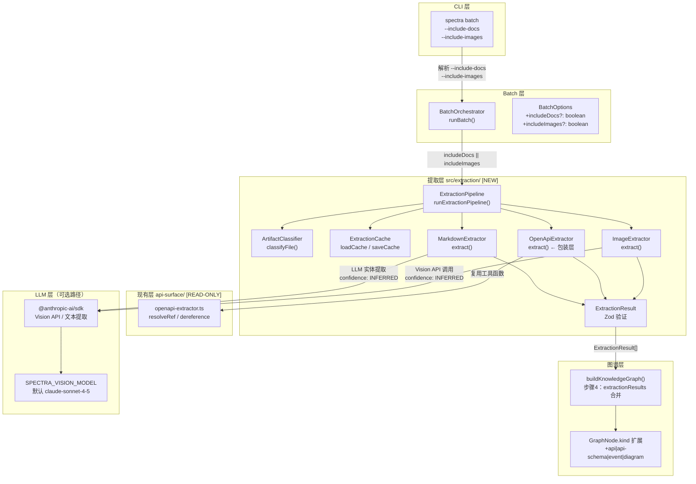
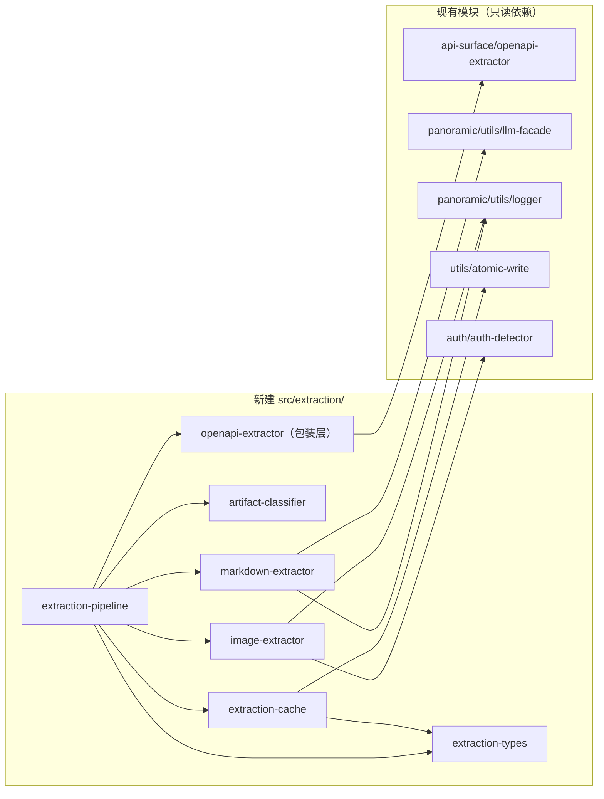

# Implementation Plan: 107 多模态工程制品提取

**Branch**: `claude/frosty-banzai` | **Date**: 2026-04-12 | **Spec**: `specs/107-multi-modal-extraction/spec.md`

## Summary

本 Feature 在 Spectra 知识图谱体系中新建独立的 `src/extraction/` 模块（方案 A），为三类非代码工程制品（Markdown 文档、OpenAPI/AsyncAPI 规范、图像图表）提供提取管道，将提取结果作为第四路数据源（`extractionResults`）合并进 `buildKnowledgeGraph()`，并通过 `--include-docs` / `--include-images` CLI 标志选择性激活，默认零破坏兼容现有 `spectra batch` 行为。

技术选型依据调研报告结论：复用现有 `openapi-extractor.ts` 的 `resolveRef`/`dereference` 工具函数；通过现有 `@anthropic-ai/sdk`（`^0.39.0`，已支持 image content block）调用 Claude Vision；以 Graphify `cache.py` 的 `SHA256(body + path)` 模式实现文件级哈希缓存；全程以 Zod schema 验证提取结果。

---

## Technical Context

**Language/Version**: TypeScript 5.x + Node.js 20.x（LTS）
**Primary Dependencies**:
- `@anthropic-ai/sdk ^0.39.0`（已引入，用于 Vision API）
- `zod ^3.24.1`（已引入，用于提取结果 schema 验证）
- 内置 Node.js `crypto`、`fs`、`path`（无需新增）
- YAML 解析：使用正则 + JSON.parse 方案，避免引入新依赖（`openapi-extractor.ts` 已处理 JSON 格式，YAML 格式通过新增轻量 YAML 解析逻辑覆盖）

**新增外部依赖决策**：
- `marked`：**不引入**。Markdown 标题提取和 frontmatter 解析使用正则，符合当前项目已有 `skill-md-parser.ts` 的风格；LLM 实体提取直接传入原始 Markdown 文本。参考调研报告 §5：零新增依赖是优先原则。
- `yaml`/`js-yaml`：**不引入**。检查 `package.json` 确认项目未引入任何 YAML 解析库；OpenAPI YAML 文件通过内联轻量解析器处理（仅需 `key: value` 和 `$ref` 解析场景），与调研报告 §4.5 结论一致。若后续发现复杂 YAML 语法需求，作为 patch 追加。

**Storage**: 文件级缓存写入 `{outputDir}/_meta/extraction-cache/{hash}.json`（原子 rename 写入，复用现有 `writeAtomicJson`）
**Testing**: Vitest（`npx vitest run`）；Vision API 调用通过 mock `@anthropic-ai/sdk` 的 `messages.create` 测试
**Target Platform**: Node.js CLI，纯本地运行，无网络强依赖（Vision API 为可选路径）
**Performance Goals**:
- SC-003：100 个 `.md` 文件在缓存命中率 > 80% 时 < 30 秒
- SC-004：5,000 行 OpenAPI 文件解析 < 2 秒
- SC-005：单张图片 Vision 提取 < 10 秒
**Constraints**: 默认标志不改变现有 batch 输出；所有 LLM 路径有完整降级；API key 脱敏（FR-022）

---

## Codebase Reality Check

对所有将被修改的目标文件的现状分析：

| 文件 | LOC | 公开接口数 | 已知 debt | 备注 |
|------|-----|-----------|----------|------|
| `src/panoramic/graph/graph-types.ts` | 119 | 5 个类型/接口 | 无 | 需扩展 `GraphNode.kind` 和 `BuildGraphOptions` |
| `src/panoramic/graph/graph-builder.ts` | 321 | 2 个（`buildKnowledgeGraph`、`writeKnowledgeGraph`）| 无 | 需新增步骤 4（提取结果合并） |
| `src/batch/batch-orchestrator.ts` | 853 | 3 个导出函数 + 2 个接口 | L716 TODO（`version: '2.9.0'`）| 需扩展 `BatchOptions` + 调用 `runExtractionPipeline` |
| `src/cli/utils/parse-args.ts` | 625 | 3 个类型 + 1 个函数 | 无 | 需新增 `includeDocs`、`includeImages` boolean 标志 |
| `src/panoramic/api-surface/openapi-extractor.ts` | 314 | 1 个（`extractFromSchema`）| 无 | **只读复用**，不修改，新建包装层 |

**新建文件（`src/extraction/` 模块，全部新增，无 debt）：**

| 文件 | 预估 LOC | 职责 |
|------|---------|-----|
| `src/extraction/extraction-types.ts` | ~60 | Zod schema + TS 类型导出 |
| `src/extraction/extraction-cache.ts` | ~80 | 文件级哈希缓存读写 |
| `src/extraction/artifact-classifier.ts` | ~50 | 扩展名 → ArtifactKind 映射 |
| `src/extraction/markdown-extractor.ts` | ~150 | Markdown 标题/frontmatter + LLM 实体提取 |
| `src/extraction/openapi-extractor.ts` | ~200 | 包装现有 `api-surface/openapi-extractor.ts`，输出 `ExtractionResult` |
| `src/extraction/image-extractor.ts` | ~120 | Vision API 调用 + 三级降级 |
| `src/extraction/extraction-pipeline.ts` | ~100 | 协调三路提取器 + 并发控制 + 结果合并 |
| `src/extraction/index.ts` | ~10 | 公开 API 重导出 |

**前置清理规则评估**：

- `batch-orchestrator.ts`（853 LOC，将新增 ~30 行）：LOC > 500 但新增量 < 50 行，**不触发**强制前置清理。L716 的 TODO 与本次变更无关，标注已知 debt 但不要求本次处理。
- 其余文件均 LOC < 500，无相关 TODO/FIXME，无代码重复超阈值。

---

## Impact Assessment

### 影响范围

| 维度 | 评估 |
|------|------|
| **直接修改文件** | 4 个（`graph-types.ts`、`graph-builder.ts`、`batch-orchestrator.ts`、`parse-args.ts`）|
| **新建文件** | 8 个（`src/extraction/` 模块全部新建）|
| **间接受影响** | `src/panoramic/community/`（消费 `GraphNode.kind`，需验证类型兼容性）；`src/panoramic/graph/graph-query.ts`（消费 `GraphNode`，需验证 kind 扩展向后兼容）；Feature 105 MCP 查询工具（消费 `GraphJSON`，向后兼容） |
| **跨包影响** | 1 个顶层边界（`src/batch/` → 新建 `src/extraction/`）|
| **数据迁移** | **无**。`graph.json` schema 新增 `kind` 枚举值，向后兼容；缓存格式新建目录，不影响现有缓存 |
| **API/契约变更** | `BuildGraphOptions` 新增可选字段（向后兼容）；`BatchOptions` 新增可选字段（向后兼容）；`GraphNode.kind` union 扩展（向后兼容）；CLI 新增可选标志（向后兼容）|
| **影响文件总数** | 约 15 个 |

### 风险等级判定

**风险等级：MEDIUM**

判定依据：
- 影响文件 15 个（处于 10-20 区间）
- 跨包影响 1 个边界（`src/batch/` 依赖新建 `src/extraction/`）
- 无数据迁移、无公共 API 破坏性变更
- 现有三路合并逻辑不修改，仅顺序追加第四路

**MEDIUM 风险不强制分阶段，但建议按逻辑层次实现**（见架构章节）。

---

## Constitution Check

| 原则 | 适用性 | 评估 | 说明 |
|------|-------|------|------|
| I. 双语文档规范 | 适用 | PASS | 本文档中文散文 + 英文代码标识符 |
| II. Spec-Driven Development | 适用 | PASS | 通过完整的 spec → plan 流程，不直接改源代码 |
| III. 如无必要勿增实体（YAGNI） | **重点核查** | PASS（有条件） | 方案 A 不引入 `ExtractorRegistry`（方案 C），3 个提取器不需要注册表抽象。不引入 `marked`、`yaml` 等外部库。FR-019（PDF）、FR-020（spectraignore）已明确标注 YAGNI-移除。Complexity Tracking 章节记录所有偏离说明。|
| IV. 诚实标注不确定性 | 适用 | PASS | 所有 LLM 提取结果标注 `confidence: 'INFERRED'` |
| V. AST 精确性优先 | 适用 | PASS | OpenAPI/Markdown 确定性提取标注 `EXTRACTED`；Vision/LLM 提取标注 `INFERRED`，遵守原则 |
| VI. 混合分析流水线 | 适用 | PASS | Markdown 提取：先正则提取结构（预处理）→ 组装 Skeleton 送 LLM（上下文组装）→ LLM 填充实体（生成增强）|
| VII. 只读安全性 | 适用 | PASS | 提取器只读扫描目标项目，缓存写入仅在 `outputDir/_meta/` 下 |
| VIII. 纯 Node.js 生态 | **重点核查** | PASS | 零新增运行时依赖；YAML 用轻量内联解析器；`@anthropic-ai/sdk` 已有 |
| IX-XIV. spec-driver 约束 | 不适用 | N/A | 本 Feature 属于 spectra plugin，不适用 spec-driver 专属约束 |

**无 VIOLATION 项。计划合规。**

---

## Project Structure

### 文档制品

```text
specs/107-multi-modal-extraction/
├── spec.md                      # 需求规范（已完成）
├── plan.md                      # 本文件
├── research/
│   └── tech-research.md         # 技术调研（已完成）
├── data-model.md                # 数据模型（本阶段产出）
├── contracts/                   # API 契约（本阶段产出）
│   ├── extraction-types.contract.md
│   ├── extraction-pipeline.contract.md
│   └── batch-options-extension.contract.md
├── quickstart.md                # 快速上手指南（本阶段产出）
└── tasks.md                     # 实现任务列表（下一阶段由 /spec-driver.tasks 生成）
```

### 源代码变更布局

```text
src/
├── extraction/                  # [NEW] 多模态提取模块（Feature 107 全部新建）
│   ├── extraction-types.ts      # [NEW] ExtractionResult、ExtractedNode、ExtractedEdge Zod schema + TS 类型
│   ├── extraction-cache.ts      # [NEW] 文件级 SHA256 哈希缓存（参考 Graphify cache.py）
│   ├── artifact-classifier.ts   # [NEW] 文件扩展名 → ArtifactKind 映射 + 敏感文件过滤
│   ├── markdown-extractor.ts    # [NEW] Markdown 标题/frontmatter 确定性提取 + LLM 实体提取
│   ├── openapi-extractor.ts     # [NEW] 包装 api-surface/openapi-extractor，输出 ExtractionResult
│   ├── image-extractor.ts       # [NEW] Vision API 调用 + 三级降级路径
│   ├── extraction-pipeline.ts   # [NEW] 协调三路提取器 + 并发控制 + 缓存集成
│   └── index.ts                 # [NEW] 公开 API 重导出（runExtractionPipeline）
│
├── panoramic/
│   ├── graph/
│   │   ├── graph-types.ts       # [MODIFY] 扩展 GraphNode.kind（L32）+ BuildGraphOptions（L106）
│   │   └── graph-builder.ts     # [MODIFY] 新增步骤 4：extractionResults 合并（在现有步骤 3 之后）
│   └── api-surface/
│       └── openapi-extractor.ts # [READ-ONLY] 复用 resolveRef、dereference 等工具函数
│
├── batch/
│   └── batch-orchestrator.ts    # [MODIFY] 扩展 BatchOptions + 集成 runExtractionPipeline 调用
│
└── cli/
    └── utils/
        └── parse-args.ts        # [MODIFY] 新增 includeDocs、includeImages 标志解析

tests/
└── extraction/                  # [NEW] 单元测试目录
    ├── extraction-types.test.ts
    ├── extraction-cache.test.ts
    ├── markdown-extractor.test.ts
    ├── openapi-extractor.test.ts
    ├── image-extractor.test.ts
    └── extraction-pipeline.test.ts
```

---

## Architecture

### 架构概览



### 模块依赖边界



**依赖规则**：
- `src/extraction/` 模块只依赖现有 `src/` 内的工具层，不引入新的顶层依赖
- `batch-orchestrator.ts` 单向依赖 `src/extraction/index.ts`，不允许反向依赖
- `openapi-extractor.ts`（包装层）只调用 `api-surface/openapi-extractor.ts` 中的工具函数，不修改原文件

---

## 实现分层策略

### Phase 1：核心类型层 + 缓存层（无 LLM 依赖，可独立测试）

**目标文件**：
- `src/extraction/extraction-types.ts` — 定义 `ExtractedNode`、`ExtractedEdge`、`ExtractionResult` Zod schema 和 TS 类型；定义 `ArtifactKind` 枚举；定义 `EMPTY_EXTRACTION_RESULT` 常量
- `src/extraction/extraction-cache.ts` — 实现 `fileExtractHash()`（SHA256 + Markdown frontmatter 剥离）、`loadExtractCache()`、`saveExtractCache()`；原子写入复用 `writeAtomicJson`
- `src/extraction/artifact-classifier.ts` — 实现 `classifyFile()`（扩展名映射 + 敏感文件过滤）

**验证点**：单元测试覆盖缓存读写、hash 计算、文件分类三个核心路径

### Phase 2：确定性提取器（零 LLM 依赖）

**目标文件**：
- `src/extraction/openapi-extractor.ts`（包装层）— 调用 `api-surface/openapi-extractor.ts` 的 `extractFromSchema()`，转换输出为 `ExtractionResult`；新增 AsyncAPI channel/message 解析；实现 `$ref` 循环检测（`visited` set + 5 层绝对深度上限 + 占位节点）；YAML 文件支持（补充现有仅处理 JSON 的逻辑）

**关键变更点**：
- `graph-types.ts` L32：`kind: 'module' | 'package' | 'component' | 'spec' | 'document' | 'api' | 'api-schema' | 'event' | 'diagram'`
- `graph-types.ts` L106：`BuildGraphOptions` 新增 `extractionResults?: ExtractionResult[]`

**验证点**：SC-001（api 节点生成）、SC-004（2 秒内解析 5000 行 OpenAPI）

### Phase 3：LLM 提取器（含降级路径）

**目标文件**：
- `src/extraction/markdown-extractor.ts` — 确定性提取（heading 树 + frontmatter）+ LLM 实体提取（`callLLM` 门面，system prompt 约束）+ 文件路径引用检测（→ `document-to-module` 边）
- `src/extraction/image-extractor.ts` — `@anthropic-ai/sdk` Vision API 调用；读取 `SPECTRA_VISION_MODEL` env（默认 `claude-sonnet-4-5`）；三级降级路径；10 MB 文件大小限制；SVG 以文本方式处理

**验证点**：SC-002（document 节点生成）、SC-008（Vision 降级优雅退出）

### Phase 4：管道层 + 批量集成 + CLI

**目标文件**：
- `src/extraction/extraction-pipeline.ts` — `runExtractionPipeline(options)`：文件扫描 → 分类 → 缓存查询 → 分发提取器 → Zod 验证 → 结果合并；Markdown 并发上限 5（`p-limit` 或手写并发控制），超时 8 秒；图片数量 > 50 输出警告
- `src/extraction/index.ts` — 导出 `runExtractionPipeline`、类型
- `graph-builder.ts` — 在步骤 3 之后新增步骤 4（提取结果合并，顺序追加，`id` 为去重键，last-write-wins）
- `batch-orchestrator.ts` — `BatchOptions` 扩展；在 `buildKnowledgeGraph` 调用前注入 `extractionResults`
- `parse-args.ts` — 新增 `includeDocs?: boolean`、`includeImages?: boolean` 解析

**验证点**：SC-006（零破坏回归）、SC-003（30 秒缓存命中场景）、SC-007（缓存跳过重复调用）

---

## 修改现有文件的具体变更点

### 1. `src/panoramic/graph/graph-types.ts`

**变更 1** — 行 32，`GraphNode.kind` 类型扩展：

```typescript
// 修改前
kind: 'module' | 'package' | 'component' | 'spec' | 'document';

// 修改后
kind: 'module' | 'package' | 'component' | 'spec' | 'document'
    | 'api' | 'api-schema' | 'event' | 'diagram';
```

**变更 2** — 行 106-118，`BuildGraphOptions` 新增字段（在 `crossReferenceLinks` 之后）：

```typescript
/** 多模态提取结果（可选，缺失或为空时跳过）— Feature 107 */
extractionResults?: ExtractionResult[];
```

注意：`ExtractionResult` 类型使用与现有三路数据源相同的宽松 `any` 风格引入，避免循环依赖（`import type` + `as` 内部转换）。

### 2. `src/panoramic/graph/graph-builder.ts`

**变更** — 在步骤 3（CrossReferenceLinks 处理，行 214-245）之后、步骤 4（悬空边过滤，行 250）之前，新增步骤 3.5：

```typescript
// --------------------------------------------------------
// 步骤 3.5：处理 ExtractionResults（Feature 107 第四路数据源）
// --------------------------------------------------------
if (options.extractionResults && options.extractionResults.length > 0) {
  try {
    sources.push('extraction');
    for (const result of options.extractionResults as ExtractionResult[]) {
      for (const node of result.nodes) {
        const graphNode: GraphNode = {
          id: node.id,
          kind: node.kind,
          label: node.label,
          metadata: { ...node.metadata, sourceTag: 'extraction', sourceFile: node.source_file },
        };
        // last-write-wins：提取节点可覆盖前序数据源同 ID 节点
        nodeMap.set(node.id, graphNode);
      }
      for (const edge of result.edges) {
        const graphEdge: GraphEdge = {
          source: edge.source,
          target: edge.target,
          relation: edge.relation,
          confidence: edge.confidence,
          confidenceScore: CONFIDENCE_SCORES[edge.confidence],
        };
        const key = directed
          ? directedEdgeKey(graphEdge.source, graphEdge.target, graphEdge.relation)
          : undirectedEdgeKey(graphEdge.source, graphEdge.target, graphEdge.relation);
        edgeMap.set(key, graphEdge);
      }
    }
  } catch (err) {
    skippedSources.push({ source: 'extraction', reason: `...` });
  }
} else {
  skippedSources.push({ source: 'extraction', reason: '未提供 extractionResults 或为空' });
}
```

同时，`sources` 数组类型需更新为包含 `'extraction'`（或使用 `string[]`，视现有类型约束而定）。

### 3. `src/batch/batch-orchestrator.ts`

**变更 1** — 行 52-71，`BatchOptions` 接口扩展（在 `progressMode` 之后）：

```typescript
/** 启用 Markdown 文档 + API 规范提取（--include-docs），默认 false — Feature 107 */
includeDocs?: boolean;
/** 启用图像/图表 Vision 提取（--include-images），默认 false — Feature 107 */
includeImages?: boolean;
```

**变更 2** — 行 608-634（知识图谱构建块），在 `buildKnowledgeGraph` 调用前新增提取管道调用（约 20 行）：

```typescript
// Feature 107: 多模态提取（--include-docs / --include-images）
let extractionResults: ExtractionResult[] | undefined;
if (options.includeDocs || options.includeImages) {
  try {
    const { runExtractionPipeline } = await import('../extraction/index.js');
    extractionResults = await runExtractionPipeline({
      projectRoot: resolvedRoot,
      outputDir: resolvedOutputDir,
      includeDocs: options.includeDocs ?? false,
      includeImages: options.includeImages ?? false,
    });
  } catch (extractErr) {
    logger.warn(`多模态提取失败，跳过: ${String(extractErr)}`);
  }
}
const graphJson = buildKnowledgeGraph({
  architectureIR: projectDocsResult?.architectureIR,
  docGraph,
  crossReferenceLinks,
  extractionResults,  // Feature 107 第四路数据源
});
```

### 4. `src/cli/utils/parse-args.ts`

**变更 1** — `CLICommand` 接口（行 8-55），新增两个可选字段：

```typescript
/** 启用 Markdown + API 规范提取（仅 batch 子命令）— Feature 107 */
includeDocs?: boolean;
/** 启用图像/图表 Vision 提取（仅 batch 子命令）— Feature 107 */
includeImages?: boolean;
```

**变更 2** — batch 子命令解析块（行 513-538），新增标志解析：

```typescript
const includeDocs = argv.includes('--include-docs');
const includeImages = argv.includes('--include-images');
// 加入 explicitFlags
if (includeDocs) explicitFlags.add('includeDocs');
if (includeImages) explicitFlags.add('includeImages');
// 加入返回值
includeDocs,
includeImages,
```

**变更 3** — `extractPositionalArgs` 不需要修改（boolean 标志无值参数）。

---

## 测试策略

### 单元测试（必须）

| 测试文件 | 覆盖场景 |
|---------|---------|
| `extraction-types.test.ts` | Zod schema 验证通过/失败场景；`EMPTY_EXTRACTION_RESULT` 常量正确性 |
| `extraction-cache.test.ts` | hash 计算正确性；Markdown frontmatter 剥离；缓存读/写/命中/未命中路径 |
| `artifact-classifier.test.ts` | 各扩展名分类；敏感文件跳过（`.env`、私钥模式） |
| `markdown-extractor.test.ts` | 标题树提取；frontmatter 解析；LLM mock 返回有效 JSON；LLM mock 返回无效 JSON → 空结果；文件路径引用检测 → document-to-module 边 |
| `openapi-extractor.test.ts` | JSON 格式 OpenAPI 解析（`api` + `api-schema` 节点）；`$ref` 循环引用截断（5 层 + 占位节点）；无效 YAML → 跳过警告；AsyncAPI channel → `event` 节点 |
| `image-extractor.test.ts` | API key 缺失 → 跳过（级别 1）；Vision mock 返回有效 JSON；Vision mock 返回无效 JSON → 空结果；文件 > 10 MB → 跳过；不支持格式 → 跳过 |
| `extraction-pipeline.test.ts` | 并发数上限验证（同时最多 5 个 LLM 调用）；`includeDocs=false` 时不扫描文档；`includeImages=false` 时不处理图片；Zod 验证失败的提取结果被丢弃 |

### 集成回归测试（必须）

- **SC-006 回归**：运行不带新标志的 `spectra batch`，`graph.json` 输出与引入前完全一致（节点 kind 集合无新类型）
- **SC-001/002**：含 `openapi.yaml` + ADR Markdown 的 fixture 项目，`--include-docs` 输出 `api`/`document` 节点

### 性能基准（人工验证）

- SC-004：5,000 行 OpenAPI 文件，计时 < 2 秒
- SC-003：构造 100 个小 `.md` fixture，首次提取后清除缓存 hash，再次运行命中率 > 80% 时 < 30 秒

---

## 风险缓解措施

| # | 风险 | 缓解措施 |
|---|------|---------|
| 1 | `GraphNode.kind` union 扩展影响下游 exhaustive switch | 检查 `src/panoramic/` 内所有 `switch (node.kind)` — 现有 `graph-query.ts`、社区分析代码不含 exhaustive switch（通过 Grep 验证），扩展安全 |
| 2 | `openapi-extractor.ts` 原文件仅处理 JSON，YAML 文件未覆盖 | 包装层新增轻量 YAML 解析（key-colon-value + 基础缩进处理），仅覆盖 OpenAPI spec 的 `paths` + `components` 节构，足以支撑 MVP |
| 3 | Vision API mock 在 CI 不稳定 | `image-extractor.ts` 将 `Anthropic` 实例创建封装为可注入的工厂函数，测试注入 mock 客户端，与现有 `llm-facade.ts` 模式一致 |
| 4 | `buildKnowledgeGraph` 新增步骤影响三源合并性能 | 提取结果在 `batch-orchestrator.ts` 中预先转换为 `ExtractionResult[]`，合并步骤仅做 Map.set 迭代，O(n) 复杂度，不影响性能 |
| 5 | Markdown 并发 5 + 超时 8s 不满足 SC-003 | SC-003 适用于缓存命中率 > 80% 的场景；首次全量提取不设硬性上限（spec 已明确）；二次运行通过文件 hash 缓存跳过，满足性能要求 |
| 6 | `$ref` 循环引用破坏提取 | 新建包装层 `openapi-extractor.ts` 在调用 `api-surface/openapi-extractor.ts` 工具函数时，在 schema walker 外层添加 `visited: Set<string>` + 深度计数器，与原有 `resolveRef` 逻辑正交 |

---

## Complexity Tracking

> 所有偏离最简方案的设计决策记录，对应 Constitution 原则 III（YAGNI）。

| 决策 | 为什么需要 | 更简单的替代方案及拒绝原因 |
|------|-----------|--------------------------|
| 独立 `src/extraction/` 模块（方案 A）而非复用 `GeneratorRegistry`（方案 B）| 提取器产出图谱节点数据，而非 Markdown 文档；强行实现 `DocumentGenerator` 接口是语义污染 | 方案 B 更简单但语义错配，会导致 Generator 接口膨胀，未来维护成本高 |
| 独立文件级缓存（非复用 Feature 100 CacheManager）| CacheManager 粒度为 Generator 级（聚合所有输入文件），提取器需要文件级粒度（同一文件可被多个下游消费）| 强行复用 CacheManager 需要适配器层，比独立实现更复杂 |
| Vision API 包装为可注入工厂（测试可 mock）| CI 环境无 API key，测试无法真实调用 Vision API | 直接 `new Anthropic()` 更简单，但导致单元测试无法 mock，覆盖率不可接受 |
| `$ref` 循环检测在包装层实现（不修改 `api-surface/openapi-extractor.ts`）| 遵守原有解析器只读原则；`api-surface` 的 `ExtractionResult` 类型与 Feature 107 的 `ExtractionResult` 类型同名但不同 schema | 修改原文件虽更简单，但破坏 `api-surface` 的独立性，影响面更大 |
