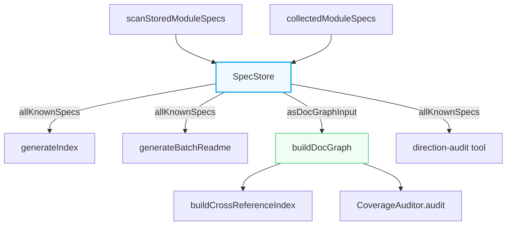
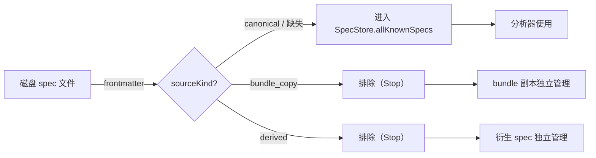
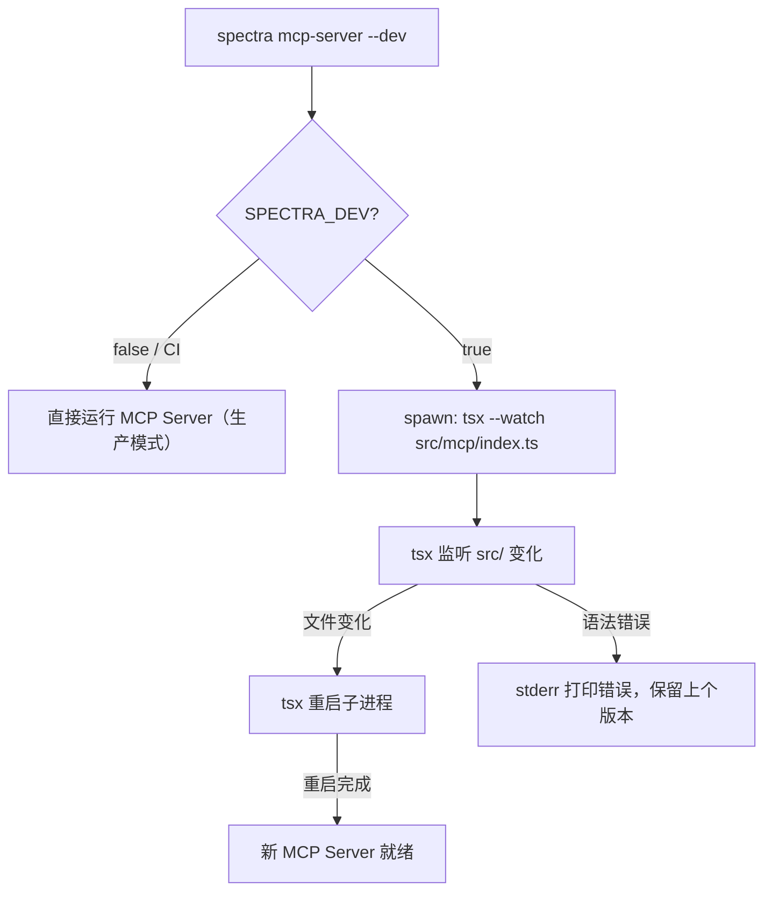

# Implementation Plan: Harden — SpecStore Abstraction & Source-Kind Metadata & Dev Hot Reload

**Branch**: `128-harden-spec-store` | **Date**: 2026-04-19 | **Spec**: [spec.md](spec.md)

---

## Summary

### 问题根源

Fix 126/127/128 修复链暴露了三个深层架构风险：

1. **存储状态模型不清晰**（Fix 127 的本质）：`batch-orchestrator.ts` 用私有函数 `mergeIndexSpecs`（第 912 行）手动合并"本次生成"和"历史存储"，但 `buildDocGraph`（第 643 行）却直接接收 `collectedModuleSpecs + existingStoredSpecs` 两个原始列表，`generateIndex`（第 765 行）用的是 `allIndexSpecs`（合并后），而 `generateBatchReadme`（第 818 行）也用 `allIndexSpecs`。**5 个消费方各有各的合并时机**，Fix 127 只修了 README 一处，其余消费方仍有潜在 bug。

2. **canonical / derived / bundle_copy 边界模糊**（Fix 128 的本质）：`scanStoredModuleSpecs` 通过"排除 `bundles/` 目录名"（workaround）过滤 bundle 副本。这个约定不在 spec 文件本身，而在分析器代码里。新增衍生产物类型就必须改代码。

3. **开发体验问题**（Fix 126 的本质）：MCP Server 是长期进程，ESM import cache 不会自动清除，每次 Spectra 代码修改都需要手动 kill + restart，拖慢开发效率。

**附加问题（来自 User Story 4）**：Spectra 自身的依赖图可能存在和 Graphify 同源的方向倒置 bug，需要主动自查。

### 解法概要

- **SpecStore 抽象**：建立 `src/spec-store/` 模块，封装"本次生成 + 历史存储 + orphan 识别 + 身份过滤"语义。5 个消费方全部迁移，删除分散的合并逻辑。
- **sourceKind 元数据**：在 `SpecFrontmatterSchema` 新增 `sourceKind` / `derivedFrom` 两个 optional 字段，bundle 复制时主动设置。`scanStoredModuleSpecs` 读取字段，SpecStore 按身份过滤，移除目录排除 workaround。
- **Dev 热重载**：在 `src/cli/commands/mcp-server.ts` 增加 `--dev` / `SPECTRA_DEV=1` 入口，dev 模式下 spawn `tsx --watch` 子进程。
- **Direction Audit**：新建 `src/cli/commands/direction-audit.ts`，接收 `graph.json` 并对照 AST import 数据做方向分类审计，输出 `DirectionAuditReport`。

### 与相关修复/Feature 的关系

| 关联 | 关系说明 |
|---|---|
| Fix 127 | SpecStore 是 Fix 127（`allIndexSpecs` 补丁）的泛化，覆盖所有消费方 |
| Fix 128 | Step H 完成后，Fix 128 的 `bundles/` 目录排除可被完全移除 |
| F1 Reveal（`127-reveal-cost-transparency`） | F1 修改 `tokenUsage`/`durationMs` 字段，F2 修改 `sourceKind`/`derivedFrom`，字段不重叠，合并冲突仅在 `SpecFrontmatterSchema` 的同一文件约 5 行 |

---

## Technical Context

**Language/Version**: TypeScript 5.x + Node.js 20.x（LTS）
**Primary Dependencies**:
- `zod`：schema 验证（`SpecFrontmatterSchema` 扩展）
- `vitest`：单元测试
- `gray-matter`：frontmatter 读写（现有 pipeline 已使用）
- `tsx`：dev 模式热重载（已有 devDependency）
- `chokidar`（已有）：file watcher（`src/watcher/` 已实现，dev 模式不直接用它，由 tsx 内置）
- `@modelcontextprotocol/sdk`：MCP 协议栈（现有，不修改）
- `dependency-cruiser`（现有）：AST import 数据来源，direction audit 工具复用

**Storage**: 磁盘 Markdown `.spec.md` 文件，YAML frontmatter（现有格式 + 新增 2 字段）
**Testing**: vitest（现有）
**Project Type**: single（monorepo spectra CLI + MCP server）
**Performance Goals**:
- SC-004：Dev 模式"改代码 → 下次调用生效" ≤ 5 秒
- SC-004：非 dev 模式性能回归 ≤ 2%（SpecStore 构造为纯内存操作，无额外 I/O）
- SC-005：direction audit 工具 ≤ 10 分钟跑完本仓库（~125 个 feature dir）

**Constraints**:
- 向后兼容：历史 spec 缺少 `sourceKind` 字段时默认视为 `canonical`
- 不触碰 F1 领地字段：`tokenUsage`、`durationMs`、`llmModel`、`fallbackReason`
- 不引入新运行时依赖（`tsx` 已有，`dependency-cruiser` 已有）
- 提交前强制 `npx vitest run`（除 pre-existing `export-command.test.ts` 失败外零新增）
- 提交前强制 `npm run build` 零错误

**Scale**: 本仓库约 125 个 feature dir；批量场景 SpecStore 构造的 spec 数量通常 50-200 个

---

## Codebase Reality Check

对所有将被修改的目标文件的现状进行检查。

### 目标文件清单

| 文件 | LOC | 公开接口数 | 已知 Debt | 是否需要前置清理 |
|---|---|---|---|---|
| `src/batch/batch-orchestrator.ts` | 967 行 | 4（`runBatch`、`mergeGraphsForTopologicalSort`、`detectCrossLanguageRefs`、`mergeIndexSpecs`[私有]） | 无 TODO/FIXME；`mergeIndexSpecs` 私有且与 `buildDocGraph` 的双参数传递语义重叠（架构债，本 feature 正是修复目标） | 是：LOC > 500 且将重构合并逻辑 |
| `src/panoramic/builders/doc-graph-builder.ts` | 541 行 | 5（`scanExistingSpecDocuments`、`scanStoredModuleSpecs`、`buildDocGraph`、`resolveSpecForSource`、`walkSpecFiles`） | `walkSpecFiles` 的 `excludeDir` 参数是 Fix 128 的 workaround，本 feature Step H 移除 | 否（LOC < 500，workaround 是功能目标而非额外 debt） |
| `src/models/module-spec.ts` | 267 行 | 15（各 Schema 和 type export） | 无 | 否 |
| `src/generator/frontmatter.ts` | 71 行 | 1（`generateFrontmatter`） | 无 | 否 |
| `src/cli/commands/mcp-server.ts` | 待查（预计 < 100 行） | 1（`runMcpServerCommand`） | 无 | 否 |
| `src/panoramic/pipelines/docs-bundle-orchestrator.ts` | > 100 行（复制逻辑入口） | 1（`orchestrateDocsBundle`） | 无 | 否 |
| `src/panoramic/pipelines/coverage-auditor.ts` | 460 行 | 1（`CoverageAuditor` 类） | 无 | 否 |
| `src/batch/batch-readme-generator.ts` | 165 行 | 1（`generateBatchReadme`） | 无，`moduleSpecs` 参数目前由 orchestrator 手动传入，Step B 迁移后由 SpecStore 提供 | 否 |
| `src/generator/index-generator.ts` | 196 行 | 1（`generateIndex`） | 无 | 否 |
| `src/panoramic/cross-reference-index.ts` | 294 行 | 1（`buildCrossReferenceIndex`） | 无 | 否 |
| `src/cli/commands/graph.ts` | 187 行 | 1（`runGraphCommand`） | `scanStoredModuleSpecs` 在独立调用时直接 import，Step C 迁移后改用 SpecStore（仅限 batch 场景；graph 命令的独立运行路径另行处理） | 否 |

### 前置清理任务

根据规则，`src/batch/batch-orchestrator.ts`（967 行，新增 ~80 行重构）满足"LOC > 500 且将新增 > 50 行"条件，需要一个前置清理 commit（Step A 之前）。

**[CLEANUP] 清理内容**：
- 将 `mergeIndexSpecs` 私有函数提取到 `src/spec-store/` 中作为 SpecStore 的实现基础（即 Step A 本身包含这个清理）
- 由于 Step A 就是建 SpecStore 类，`mergeIndexSpecs` 的提取和清理与 Step A 合并处理，不单独增加 commit

---

## Impact Assessment

### 影响范围

| 维度 | 详情 |
|---|---|
| 直接修改文件数 | 11 个文件（见 Codebase Reality Check） |
| 新增文件 | `src/spec-store/index.ts`、`src/spec-store/spec-identity.ts`、`src/cli/commands/direction-audit.ts`（共 3 个） |
| 间接受影响（调用方） | `tests/panoramic/doc-graph-builder.test.ts`、`tests/integration/batch-incremental.test.ts`、`tests/panoramic/coverage-auditor.test.ts`、`tests/integration/batch-singlelang.test.ts` 等共约 8 个测试文件 |
| 跨包影响 | 无（单 monorepo，所有文件在 `src/` 下） |
| 数据迁移 | 无强制迁移：`sourceKind` 字段为 optional，历史 spec 不需要修改 |
| API/契约变更 | `buildDocGraph` 的调用方式变更（通过 `specStore.asDocGraphInput()` 传参），但 `BuildDocGraphOptions` 接口本身不变；`generateIndex`、`generateBatchReadme` 接口签名不变（参数由 SpecStore 提供） |
| 公共 MCP API 变更 | 无（MCP 工具参数不变，dev 模式是新增能力） |

### 风险等级

**MEDIUM**

判定依据：
- 影响文件数：11（直接）+ 3（新增）+ 8（测试）= 22，接近 MEDIUM/HIGH 边界（规则是 > 20 为 HIGH）
- 无跨包影响
- 无数据迁移（字段 optional）
- API 契约：`buildDocGraph` 的调用方式变更，但接口不变；属于"内部接口"修改

**降为 MEDIUM 的理由**：`buildDocGraph` 的两个参数（`moduleSpecs` + `existingSpecs`）在 Step C 后改为通过 `specStore.asDocGraphInput()` 提供，但函数签名本身不变，只是传参来源改变。这属于内部实现重构，不是公共 API 变更。

### HIGH 风险分阶段要求

不适用（风险等级为 MEDIUM）。

---

## Constitution Check

基于 `.specify/memory/constitution.md`（版本 2.2.0）评估技术计划。

| 原则 | 编号 | 适用性 | 评估 | 说明 |
|---|---|---|---|---|
| 双语文档规范 | I | 高 | **PASS** | 所有生成的 spec 产物使用中文散文 + 英文标识符，`SpecSourceKind` 等字段名保持英文 |
| Spec-Driven Development | II | 高 | **PASS** | 本 Feature 遵循完整流程：spec → plan → tasks → implement，不直接改源代码 |
| 如无必要勿增实体（YAGNI） | III | 高 | **PASS**（需说明） | SpecStore 有 5 个已有消费方的明确使用场景。direction audit 工具直接映射 FR-015/FR-016/FR-017。dev 热重载直接映射 FR-010/FR-011。无假设性未来需求驱动的额外抽象。 |
| 诚实标注不确定性 | IV | 中 | **PASS** | direction audit 报告的 `suspicious` 分类明确标注"无直接证据"，不以确定性口吻呈现 |
| AST 精确性优先 | V | 高 | **PASS** | direction audit 工具以 AST import 为 ground truth（宪法 V 要求），LLM 推断的边标为 `suspicious` 而非 `correct` |
| 混合分析流水线 | VI | 低 | **PASS（不适用）** | 本 Feature 不新增 LLM 分析流水线 |
| 只读安全性 | VII | 高 | **PASS** | SpecStore 是纯只读查询，不修改源文件；新增的 `sourceKind` 字段写入只发生在 spec 输出文件（`specs/` 目录），符合"写操作仅允许 `specs/` 和 `drift-logs/`" |
| 纯 Node.js 生态 | VIII | 高 | **PASS** | dev 模式使用 `tsx`（已有 devDependency），direction audit 使用 `dependency-cruiser`（已有），无新运行时依赖 |
| Prompt 编排 + Harness 强制 | IX | 低 | **PASS（不适用）** | spec-driver plugin 约束，本 Feature 修改的是 spectra plugin 的源代码 |
| 零运行时依赖 | X | 低 | **PASS（不适用）** | spec-driver plugin 约束 |
| 质量门控不可绕过 | XI | 低 | **PASS（不适用）** | spec-driver plugin 约束 |
| 验证铁律 | XII | 中 | **PASS** | 每个 Step 都有明确验证点（`npx vitest run` + golden-master 比对） |
| 向后兼容 | XIII | 高 | **PASS** | `sourceKind` / `derivedFrom` 均为 optional，历史 spec 缺失时 SpecStore 默认 canonical；`generateBatchReadme` 接口签名不变；`generateIndex` 接口签名不变 |
| 可观测性与架构守护 | XIV | 中 | **PASS** | direction audit 工具提供可读报告；`execSourceKind` CI guard 防止架构劣化 |

**Constitution Check 结论：全部 PASS，无 VIOLATION。**

---

## Project Structure

### 制品结构（本 Feature）

```text
specs/128-harden-spec-store/
├── spec.md              # 需求规范（已有）
├── plan.md              # 本文件
├── research.md          # Phase 0 技术决策研究
├── data-model.md        # Phase 1 数据模型
├── quickstart.md        # Phase 1 快速上手指南
├── contracts/           # Phase 1 接口合同
│   ├── spec-store-interface.ts     # SpecStore TypeScript 接口
│   ├── source-kind-schema.ts       # sourceKind Zod schema
│   └── direction-audit-report-schema.json  # DirectionAuditReport JSON schema
└── tasks.md             # Phase 2 输出（/spec-driver.tasks 生成，本 Feature 不创建）
```

### 源代码结构（变更范围）

```text
src/
├── spec-store/                            [新建]
│   ├── index.ts                           # SpecStore 类（主实现）
│   └── spec-identity.ts                   # SpecSourceKind 类型 + 默认值逻辑
│
├── models/
│   └── module-spec.ts                     [修改] 新增 sourceKind / derivedFrom 字段到 SpecFrontmatterSchema
│
├── generator/
│   └── frontmatter.ts                     [修改] 新增 sourceKind / derivedFrom 可选参数
│
├── panoramic/
│   ├── builders/
│   │   └── doc-graph-builder.ts           [修改] StoredModuleSpecSummary 新增字段 + 手动解析器扩展 + 移除 excludeDir workaround（Step H）
│   └── pipelines/
│       ├── coverage-auditor.ts            [修改] Step D：接收 SpecStore.asDocGraphInput() 而非直接 docGraph
│       └── docs-bundle-orchestrator.ts    [修改] Step G/H：复制 spec 时写入 sourceKind: 'bundle_copy'
│
├── batch/
│   ├── batch-orchestrator.ts              [修改] 步骤 5 前初始化 SpecStore，替换 5 个消费方的合并逻辑
│   ├── batch-readme-generator.ts          [修改] Step B：接收 SpecStore.allKnownSpecs() 而非手动计算列表
│   └── delta-regenerator.ts              [不改]
│
├── generator/
│   └── index-generator.ts                 [修改] Step E：接收 SpecStore.allKnownSpecs() 而非 allIndexSpecs
│
├── panoramic/
│   └── cross-reference-index.ts          [修改] Step F：通过 SpecStore 获取所有 spec，确保无副本污染
│
└── cli/
    └── commands/
        ├── mcp-server.ts                  [修改] dev 模式入口（FR-010/FR-011/FR-013/FR-014）
        ├── graph.ts                       [修改] Step C：独立运行的 graph 命令适配 SpecStore
        └── direction-audit.ts             [新建] FR-015/FR-016/FR-017

tests/
├── spec-store/                            [新建]
│   ├── spec-store.test.ts                 # Step A：SpecStore 单测（4 种视图覆盖）
│   └── spec-identity.test.ts              # sourceKind 默认值 + orphan 识别测试
├── panoramic/
│   └── doc-graph-builder.test.ts         [修改] 移除 excludeDir 相关测试，新增 sourceKind 过滤测试
├── integration/
│   ├── batch-incremental.test.ts         [修改] golden-master：4 场景 spec 数量一致性验证
│   └── direction-audit.test.ts           [新建] direction audit 工具集成测试
└── cli/
    └── dev-reload.test.ts                [新建] dev 模式 E2E（CI 环境跳过实际 tsx spawn）
```

---

## Architecture

### 核心数据流（迁移后）



### sourceKind 过滤链



### Dev 模式架构



---

## Implementation Strategy

### 总体原则

**每个 Step 对应一个独立 commit**，可以独立 `npx vitest run` 验证，独立 push，发生问题时可单独 revert。

### Step A：建立 SpecStore 类 + 完整单测

**涉及文件**：
- 新建 `src/spec-store/index.ts`（SpecStore 类实现）
- 新建 `src/spec-store/spec-identity.ts`（SpecSourceKind 类型 + 默认值逻辑）
- 新建 `tests/spec-store/spec-store.test.ts`（4 种视图覆盖）
- 新建 `tests/spec-store/spec-identity.test.ts`（orphan 识别 + 身份过滤测试）

**实现要点**：
- 将 `batch-orchestrator.ts` 的 `mergeIndexSpecs` 逻辑迁移到 SpecStore 构造函数中
- `allKnownSpecs()` 默认过滤 `sourceKind === 'bundle_copy'` 和 `'derived'`（历史缺失字段视为 canonical）
- orphan 判断在构造时预计算（`fs.existsSync`）
- `asDocGraphInput()` 返回类型与 `BuildDocGraphOptions` 中的两个字段精确对应

**风险**：`mergeIndexSpecs` 有 `skeletonHash` 存在检查（第 930 行），SpecStore 必须保留此过滤条件

**验证**：
```bash
npx vitest run tests/spec-store/
```

---

### Step B：README 生成器迁移

**涉及文件**：
- 修改 `src/batch/batch-orchestrator.ts`：步骤 7 改用 `specStore.allKnownSpecs()` 提供 `moduleSpecs`
- 修改 `src/batch/batch-readme-generator.ts`：`ReadmeGeneratorInput.moduleSpecs` 的类型来源由 orchestrator 直接计算改为 SpecStore 提供

**实现要点**：
- 在步骤 5 初始化 SpecStore（`const allIndexSpecs = mergeIndexSpecs(...)` 那一行替换为 `const specStore = new SpecStore(...)`）
- 步骤 7 的 `allIndexSpecs` 过滤逻辑（第 823-830 行）移入 SpecStore.allKnownSpecs() 的 `modulesDirRel` 前缀过滤

**风险**：当前 README 生成用的是 `allIndexSpecs`（已含 bundle 路径过滤），SpecStore 必须保留等效逻辑

**验证**：
```bash
npx vitest run tests/integration/batch-singlelang.test.ts
npx vitest run tests/golden-master/golden-master.test.ts
```

---

### Step C：Graph Builder 迁移

**涉及文件**：
- 修改 `src/batch/batch-orchestrator.ts`：步骤 5 改用 `specStore.asDocGraphInput()`
- 修改 `src/cli/commands/graph.ts`：独立运行时构造轻量 SpecStore（storedSpecs 来自 `scanStoredModuleSpecs`，currentSpecs = []）

**实现要点**：
- `batch-orchestrator` 中 `buildDocGraph` 的调用从 `{ moduleSpecs: collectedModuleSpecs, existingSpecs: existingStoredSpecs }` 改为 `specStore.asDocGraphInput()`
- `graph.ts` 的独立运行路径：`stored = scanStoredModuleSpecs(outputDir, projectRoot)` → `specStore = new SpecStore({ currentSpecs: [], storedSpecs: stored, ... })` → `docGraph = buildDocGraph({ ...specStore.asDocGraphInput(), ... })`

**风险**：`buildDocGraph` 函数内部区分 `currentRun: true/false`，需要 `asDocGraphInput()` 正确设置该标志

**验证**：
```bash
npx vitest run tests/panoramic/doc-graph-builder.test.ts
npx vitest run tests/integration/batch-doc-graph.test.ts
```

---

### Step D：Coverage Auditor 迁移

**涉及文件**：
- 修改 `src/batch/batch-orchestrator.ts`：coverage auditor 调用改用已由 Step C 构建的 docGraph（通过 SpecStore 构建）
- 修改 `src/panoramic/pipelines/coverage-auditor.ts`：确认接口不变（coverage auditor 已接收 `DocGraph`，不需要改接口，只是 docGraph 的来源变为 SpecStore 链路）

**实现要点**：
- coverage auditor 已接收 `docGraph`，本 Step 主要确认迁移链路正确（SpecStore → docGraph → coverage auditor 各环节数据一致）
- 在 docGraph.specs 中，非 canonical 的 spec（`sourceKind === 'bundle_copy'`）已被 SpecStore 过滤，coverage auditor 不需要额外处理

**风险**：coverage auditor 的 `docGraph.unlinkedSpecs` 来源于 docGraph，需要确认 bundle_copy 不会混入 unlinkedSpecs

**验证**：
```bash
npx vitest run tests/panoramic/coverage-auditor.test.ts
npx vitest run tests/integration/batch-coverage-report.test.ts
```

---

### Step E：Index Generator 迁移

**涉及文件**：
- 修改 `src/batch/batch-orchestrator.ts`：步骤 6 的 `generateIndex(allIndexSpecs, ...)` 改为 `generateIndex(specStore.allKnownSpecs(), ...)`
- `src/generator/index-generator.ts`：接口不变（`IndexableModuleSpec[]` 类型与 SpecStore 输出兼容）

**实现要点**：
- `IndexableModuleSpec` 接口（`src/generator/index-generator.ts` 第 18-23 行）与 SpecStore 内部的 `IndexableModuleSpec`（见合同文件）对齐，两者应是同一类型（可以从 SpecStore 导出后重用）

**风险**：`generateIndex` 内部用 `specs.length` 做 `totalModules`，需要确认 SpecStore.allKnownSpecs() 的计数与 Fix 127 修复的行为一致

**验证**：
```bash
npx vitest run tests/integration/batch-singlelang.test.ts
# SC-001 验证：4 场景 spec 数量一致
```

---

### Step F：Cross-Reference Builder 迁移

**涉及文件**：
- 修改 `src/batch/batch-orchestrator.ts`：`buildCrossReferenceIndex` 调用通过 SpecStore 提供的 `docGraph` 进行
- `src/panoramic/cross-reference-index.ts`：接口不变（已接收 `ModuleSpec` + `DocGraph`）

**实现要点**：
- cross-reference-index 依赖 `docGraph.specs`，该列表由 SpecStore 通过 `asDocGraphInput()` 驱动构建，已排除 bundle_copy
- `supplementCrossModuleFromSkeletonImports`（第 151-189 行）处理 Python 绝对 import，无需修改

**风险**：`buildCrossReferenceIndex` 在 `docGraph.specs` 中查找当前 spec（第 32 行），需要确认 bundle_copy 排除后不影响 canonical spec 的查找

**验证**：
```bash
npx vitest run tests/panoramic/cross-reference-index.test.ts
```

---

### Step G：删除旧合并逻辑

**涉及文件**：
- 修改 `src/batch/batch-orchestrator.ts`：删除 `mergeIndexSpecs` 私有函数（第 912-966 行）及其所有调用点（`allIndexSpecs` 变量）

**实现要点**：
- 此时 5 个消费方已全部迁移到 SpecStore，`allIndexSpecs` 变量已无用
- 检查 `existingStoredSpecs` 的其他使用点（第 298、324、647 行），确认都已通过 SpecStore 封装

**风险**：`storedSpecByTarget`（第 298 行）用于增量模式的 `regenerateTargets` 计算，不属于 SpecStore 管理范围（它是 batch 策略逻辑，不是"查询所有已知 spec"），**保留不删**

**验证**：
```bash
npm run build   # 零 TypeScript 错误
npx vitest run  # 全量测试（除 pre-existing 失败外零新增）
```

---

### Step H：开启 sourceKind 过滤 + 移除 Fix 128 workaround + 完整回归

**涉及文件**：
- 修改 `src/panoramic/builders/doc-graph-builder.ts`：
  - `StoredModuleSpecSummary` 新增 `sourceKind?: SpecSourceKind`、`derivedFrom?: string | null`
  - `extractStoredModuleSpecSummary` 手动解析器新增两个字段的解析分支
  - `scanStoredModuleSpecs` 移除 `excludeDir`（Fix 128 workaround），改为通过 `sourceKind` 过滤
  - `walkSpecFiles` 函数签名移除 `excludeDir` 参数
- 修改 `src/models/module-spec.ts`：`SpecFrontmatterSchema` 新增 `sourceKind` / `derivedFrom`
- 修改 `src/generator/frontmatter.ts`：`FrontmatterInput` 新增可选字段，`generateFrontmatter` 传递到输出
- 修改 `src/panoramic/pipelines/docs-bundle-orchestrator.ts`：bundle 复制时写入 `sourceKind: 'bundle_copy'` 和 `derivedFrom`

**验证**（SC-002）：
- 在有 3 层副本的项目上验证 graph 节点数 = canonical 数量
- `scanStoredModuleSpecs` 不再传 `excludeDir`，测试依然通过

```bash
npx vitest run
npm run build
# 手动验证 SC-002：graph 节点数 = canonical spec 数量
```

---

### Dev 模式（Step D-addon，P2）

**涉及文件**：
- 修改 `src/cli/commands/mcp-server.ts`：增加 `--dev` 参数解析 + SPECTRA_DEV 环境变量检测
- 新建 `tests/cli/dev-reload.test.ts`

**实现要点**：
- dev 模式检测：`const isDev = (command.flags?.dev ?? false) || process.env.SPECTRA_DEV === '1'`
- CI 禁用：`const isDev = isDev && process.env.CI !== 'true'`
- spawn：`child_process.spawn('tsx', ['--watch', path.join(srcDir, 'mcp/index.ts')], { stdio: 'inherit' })`
- 进程退出时 `child.kill('SIGTERM')`

---

### Direction Audit（Step I，P2）

**涉及文件**：
- 新建 `src/cli/commands/direction-audit.ts`
- 修改 `src/cli/index.ts`：注册 `direction-audit` 子命令
- 新建 `tests/integration/direction-audit.test.ts`

**实现要点**：
- 读取 `graph.json`（NetworkX 格式）
- 对 `links` 中 `relation === 'imports'`（或其他 cross-reference 类型）的边做方向验证
- 加载 AST import 数据（优先从 `_meta/architecture-ir.json`，其次从内存 docGraph）
- 输出 `DirectionAuditReport`（见 data-model.md）

---

## Validation Plan

### 单元测试（Step A）

`tests/spec-store/spec-store.test.ts` 需覆盖以下场景：

| 场景 | 验证点 |
|---|---|
| orphan 识别 | storedSpec 的 sourceTarget 不存在时，`orphanSpecs()` 返回该 spec |
| 空集合 | 未初始化项目（currentSpecs = [], storedSpecs = []）时，`allKnownSpecs()` 返回 [] 不报错 |
| 身份过滤 | bundle_copy 的 storedSpec 不出现在 `allKnownSpecs()` 中 |
| 本次生成优先 | 同一 outputPath 在 currentSpecs 和 storedSpecs 都有时，以 currentSpec 为准 |
| 去重逻辑 | `allKnownSpecs()` 对同一 outputPath 只返回一条记录 |

### Golden Master 测试（SC-001 验证）

`tests/integration/batch-incremental.test.ts` 需验证 4 种场景下 5 个消费方报告一致的 spec 总数：

| 场景 | 验证方式 |
|---|---|
| 全量（force）| `specCount` 相同 |
| 增量（只改 1 文件）| specCount = N（其余从缓存读取） |
| 无改动重跑 | specCount = N（全部走缓存） |
| AST-only 降级 | specCount = N |

验证点：README footer 中的模块计数 = graph.json 节点数 = coverage-report 的 `totalModules`。

### SC-002 验收

在有 3 层副本（canonical × 5 + bundle_copy × 10 = 15 个 .spec.md）的测试场景中：
- `scanStoredModuleSpecs` 移除 `excludeDir` 参数后仍正确过滤
- graph 节点数 = 5
- 所有边指向 canonical 路径

### Dev 模式 E2E（SC-004）

`tests/cli/dev-reload.test.ts`：
- 验证 CI 环境（`process.env.CI === 'true'`）下 dev 模式不启动 watcher
- 验证 `--dev` 标志传递正确（不实际 spawn tsx，mock `child_process.spawn`）
- 实际 E2E（手动验证）：改代码 → 下次 MCP 调用生效 ≤ 5 秒

### Direction Audit（SC-005/SC-006）

- `tests/integration/direction-audit.test.ts`：对本仓库 `specs/_meta/graph.json` 跑审计，验证报告结构符合 schema
- 性能验证：~125 个 feature dir 全量审计 < 10 分钟
- 若发现 incorrect 边：修复后 regression test 快照守卫纳入 CI（SC-006）

### SC-007 验证

所有 Step 完成后，全量跑：
```bash
npx vitest run
```
除 pre-existing `export-command.test.ts` 失败外，无新增失败。

---

## Complexity Tracking

> 本计划 Constitution Check 全部 PASS，无需填写复杂度偏差说明。
