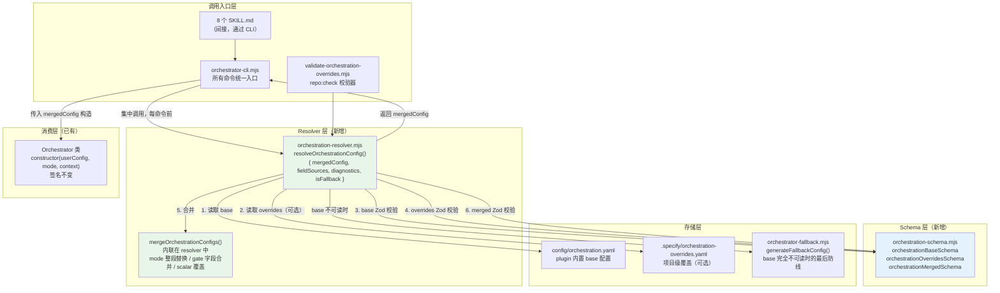

# Feature 133 — 技术实施计划

**Branch**: `claude/wonderful-chatterjee-22066e` | **Date**: 2026-04-26 | **Spec**: [spec.md](./spec.md)

## Summary

Feature 133 为 spec-driver 引入分层 orchestration 架构：plugin 提供基础配置（base），项目层通过 `.specify/orchestration-overrides.yaml` 按需覆盖 gate 行为、mode phase 序列及全局调度参数。技术方案选定**方案 B（Wrapper/Factory）**：新增 `lib/orchestration-resolver.mjs` 纯函数，以 `project-profile-resolver.mjs` 为范本实现加载→合并→Zod 校验→降级→fieldSources 追踪完整链路。同时按 GATE_DESIGN CL-016 激进决策，将 `orchestrator.mjs` 中的手写 `validateOrchestrationYaml()` 替换为 Zod schema，消除双校验链路漂移风险（R8）。

核心新增：1 个 Zod schema 三件套文件、1 个 resolver、1 个 merger（内联在 resolver 中）、1 个 repo:check 校验器、1 个 CLI 子命令；核心改造：`orchestrator.mjs`（base 校验迁移）、`orchestrator-cli.mjs`（追加 case 并集中改造所有命令）、`repo-maintenance-core.mjs`（追加 `aggregateValidation` 调用）。零新外部依赖，`zod ^3.24.1` 和 `simple-yaml.mjs` 均已在项目中。

---

## Technical Context

**Language/Version**: Node.js 20.x ESM（`.mjs` 模块），JavaScript（无 TypeScript 编译产物要求）
**Primary Dependencies**: `zod ^3.24.1`（已在 `package.json`），`simple-yaml.mjs`（仓库内置 YAML 解析器）
**Storage**: 本地文件系统（`.specify/orchestration-overrides.yaml`，纳入 git 跟踪）
**Testing**: `node:test`（跟随 `plugins/spec-driver/tests/orchestrator.test.mjs` 已有形态，避免在本 Feature 中引入 vitest 改造）；现有 vitest 测试在 `npx vitest run` 中单独运行
**Target Platform**: 本地开发环境，Node.js 20.x+，本地文件系统，overrides 文件不超过 200 行
**Performance Goals**: `resolveOrchestrationConfig()` 全链路不超过 200ms（NFR-001）
**Constraints**:
- `Orchestrator` 构造函数签名 `(userConfig, mode, context)` **不变**（NFR-002）
- 零新外部依赖（NFR-005）
- 单一 schema 源原则——base/overrides/merged 三件套共用 `orchestration-schema.mjs`（NFR-006）
- 不改动任何 SKILL.md 文件（FR-025）

---

## Codebase Reality Check

以下为本 Feature 将修改的目标文件现状扫描（2026-04-26）：

| 文件路径 | LOC | 方法/导出数 | 已知 Debt / 风险点 |
|---------|-----|-----------|-----------------|
| `plugins/spec-driver/lib/orchestrator.mjs` | 259 | 10 | `validateOrchestrationYaml()`（第 188-210 行）是手写校验，将被替换；`loadAndValidateConfig()` 中 `configPath` 硬编码，方案 B 不需要修改 |
| `plugins/spec-driver/scripts/orchestrator-cli.mjs` | 258 | 7 个命令函数 | `switch(command)` 块（第 218-257 行）追加 1 case；所有现有命令需集中改造为先调 resolver |
| `scripts/lib/repo-maintenance-core.mjs` | 263 | 2 个导出函数 | `validateRepository()`（第 205-262 行）末尾追加 `aggregateValidation` 调用；文件是核心同步链路，改错会中断整个 `repo:check`（R3） |
| `.specify/project-context.yaml` | 58 | — | `forbidden_changes` 列表追加 1 条旁注，极小改 |

**新增文件**（无 debt，全新开发）：

| 文件路径 | 预估 LOC | 说明 |
|---------|---------|------|
| `plugins/spec-driver/contracts/orchestration-schema.mjs` | ~120 行 | Zod 三件套 schema |
| `plugins/spec-driver/lib/orchestration-resolver.mjs` | ~200 行 | 核心 resolver（含内联 merger） |
| `plugins/spec-driver/scripts/validate-orchestration-overrides.mjs` | ~60 行 | repo:check 校验器 |
| `plugins/spec-driver/tests/orchestration-resolver.test.mjs` | ~180 行 | T1/T2/T3/T4 四组测试 |
| `plugins/spec-driver/contracts/orchestration-overrides-contract.yaml` | ~50 行 | 人读合同文档 |
| `plugins/spec-driver/templates/orchestration-overrides.example.yaml` | ~60 行 | 示例文件（三个场景） |
| `docs/shared/agent-orchestration-overrides.md` | ~20 行 | agent 约定片段 |

**前置清理规则检查**：
- `orchestrator.mjs`（259 行）将新增约 20-30 行 Zod schema 调用替换手写函数：净变化为删减，无需前置清理
- `orchestrator-cli.mjs`（258 行）将新增约 50 行：超过阈值，但无相关 TODO/FIXME；改动集中在追加 case + 命令前统一调 resolver，无重复逻辑需要清理
- `repo-maintenance-core.mjs`（263 行）仅追加 3 行：无清理需求

**结论**：无文件满足前置 cleanup task 触发条件，不需要增加 `[CLEANUP]` 任务。

---

## Impact Assessment

| 评估维度 | 结论 |
|---------|------|
| **直接修改文件数** | 4 个（orchestrator.mjs、orchestrator-cli.mjs、repo-maintenance-core.mjs、project-context.yaml） |
| **新增文件数** | 7 个 |
| **间接受影响** | 8 个 SKILL.md 通过 CLI 间接感知 overrides（无代码修改，行为变化，需回归验证） |
| **跨包影响** | 跨越 `plugins/spec-driver/` 和 `scripts/lib/`（2 个顶层包边界） |
| **数据迁移** | 无（新增 `.specify/orchestration-overrides.yaml` 由用户按需创建，不存在时行为与上线前完全一致） |
| **API/契约变更** | `orchestration-schema.mjs` 是新增 public API；`orchestration-resolver.mjs` 是新增 internal API；`orchestrator-cli.mjs` 新增 `effective-orchestration` 子命令 |
| **schema 变更** | `validateOrchestrationYaml()` 被 Zod schema 替换，校验逻辑改变（R11 风险：需验证现有 orchestration.yaml 100% 通过 Zod） |
| **风险等级** | **MEDIUM** |

**风险等级判定理由**：影响文件 11 个（4 改造 + 7 新增，8 个 SKILL.md 间接受影响共 12 个，但无代码修改）；跨越 2 个包边界（`plugins/` 和 `scripts/`）；无数据迁移；修改公共 CLI 接口（新增命令但不破坏现有命令）。不触发 HIGH 的决定因素：无 schema/数据迁移，现有 API 契约不变（构造函数签名不变），跨包影响不超过 2。

**HIGH 风险强制分阶段**：本 Feature 风险等级为 MEDIUM，不强制分阶段。但 CL-016 决策引入了 `orchestrator.mjs` 改造，该改造是高影响回归风险（R11/R12），在实施顺序上单独列为早期验证步骤（步骤 2：base 兼容性验证），确保 100% 通过后再继续其他步骤。

---

## Constitution Check

| 宪法原则 | 适用性 | 评估 | 说明 |
|---------|--------|------|------|
| 不引入未经评估的新依赖 | 适用 | PASS | 零新外部依赖，`zod` 和 `simple-yaml.mjs` 均已在项目中 |
| 优先修改 `plugins/**` 与 `src/**` 源码，不直接手改包装产物 | 适用 | PASS | 所有修改在 `plugins/spec-driver/` 和 `scripts/lib/` 源码层，不触及 `.codex/**` |
| 避免把 Spec 级执行策略写进 Project Context | 适用 | PASS | `.specify/project-context.yaml` 仅追加旁注，内容为"流程结构覆盖应放 `.specify/orchestration-overrides.yaml`"，属于约束引导而非执行策略 |
| 提交前 `npm run repo:check` 零失败 | 适用 | PASS | 新校验器采用标准 `{ status, checks, warnings, errors }` 接口，不破坏现有校验链路 |
| 使用 spec-driver 方式执行需求变更 | 适用 | PASS | 本 Feature 通过 spec-driver 完整流程推进 |
| `Orchestrator` 构造函数签名不变 | 适用 | PASS | 方案 B（Wrapper/Factory）完全绕开构造函数，签名 `(userConfig, mode, context)` 保持不变 |
| 测试前 `npx vitest run` 零失败 | 适用 | PASS | 新增测试使用 `node:test` 与现有形态一致，需确认 CI 同时跑 `node --test` 和 `vitest run`（R5） |

**无 VIOLATION**：技术计划与所有宪法原则兼容，无需豁免。

---

## Project Structure

### 文档产物（本 Feature）

```text
specs/133-orchestration-overrides/
├── spec.md               # 需求规范（事实源，v1.1）
├── clarifications.md     # 澄清记录（16 条，4 条已由 GATE_DESIGN 锁定）
├── research/
│   ├── research-synthesis.md   # 产研汇总
│   └── tech-research.md        # 技术调研
├── plan.md               # 本文件（技术实施计划）
└── tasks.md              # Phase 5 输出（待生成）
```

### 源码变更（仓库根目录）

```text
plugins/spec-driver/
├── contracts/
│   ├── orchestration-schema.mjs              # [新增] Zod 三件套 schema（base/overrides/merged）
│   └── orchestration-overrides-contract.yaml # [新增] 人读合同文档
├── lib/
│   ├── orchestration-resolver.mjs            # [新增] 核心 resolver（含内联 merger）
│   └── orchestrator.mjs                      # [改造] validateOrchestrationYaml() → Zod schema
├── scripts/
│   ├── orchestrator-cli.mjs                  # [改造] 追加 effective-orchestration + 集中 resolver 调用
│   └── validate-orchestration-overrides.mjs  # [新增] repo:check 校验器
├── templates/
│   └── orchestration-overrides.example.yaml  # [新增] 示例文件（三个场景）
└── tests/
    ├── orchestration-resolver.test.mjs       # [新增] T1/T2/T3/T4 四组测试
    └── orchestrator.test.mjs                 # [小改] 增量补充 base Zod 校验断言

scripts/lib/
└── repo-maintenance-core.mjs                 # [小改] validateRepository() 末尾追加 aggregateValidation

docs/shared/
└── agent-orchestration-overrides.md          # [新增] agent 约定共享片段（通过 docs:sync:agents 同步）

.specify/
└── project-context.yaml                      # [极小改] forbidden_changes 追加旁注
```

**结构决策**：选择将 Zod schema 放在 `contracts/` 目录（与 `wrapper-source-of-truth.yaml` 并列），而非放在 `lib/` 下，因为 schema 本质上是 "合同声明"，不是 "运行时逻辑"，与现有 `contracts/` 的用途对齐。文件名用 `orchestration-schema.mjs`（不含 `overrides` 词以强调三件套共用性，schema 文件本身既校验 base 也校验 overrides）。

---

## Architecture

### 数据流架构图



### 降级路径精确分支

```
┌─────────────────────────────────────────────────────────────────────┐
│  resolveOrchestrationConfig() 完整流程                               │
│                                                                     │
│  1. 读 base YAML                                                    │
│     ├─ I/O 异常 → generateFallbackConfig() + error diagnostic       │
│     │             code: orchestration.base-invalid                  │
│     └─ 读取成功 ↓                                                   │
│                                                                     │
│  2. orchestrationBaseSchema.safeParse(base)                         │
│     ├─ 失败 → generateFallbackConfig() + error diagnostic           │
│     │         code: orchestration.base-invalid                      │
│     └─ 通过 ↓                                                       │
│                                                                     │
│  3. 检查 overrides 文件是否存在                                      │
│     ├─ 不存在 → 直接用 base，无 diagnostic，isFallback: false       │
│     └─ 存在 ↓                                                       │
│                                                                     │
│  4. 读 overrides YAML（simple-yaml.mjs parseYamlDocument）          │
│     ├─ 抛出异常 → 用 base + warning: parse-error，isFallback: true  │
│     └─ 成功 ↓                                                       │
│                                                                     │
│  5. 解析结果为空/null → 等同"不存在"，静默用 base（CL-007 选项 A）  │
│                                                                     │
│  6. version 比对：overrides.version vs base.version                 │
│     ├─ 不一致 → 用 base + warning: version-mismatch，isFallback: true│
│     └─ 一致 ↓                                                       │
│                                                                     │
│  7. strip 已知 MVP 不支持字段（parallel_groups 等）                 │
│     └─ 每个 strip 字段发出 warning: unsupported-field              │
│                                                                     │
│  8. orchestrationOverridesSchema.safeParse(stripped_overrides)     │
│     ├─ 失败（含非 reserved mode 名）→ 用 base + warning: schema-fallback│
│     └─ 通过 ↓                                                       │
│                                                                     │
│  9. mergeOrchestrationConfigs(base, overrides) → merged             │
│     └─ 同步生成 fieldSources                                        │
│                                                                     │
│ 10. orchestrationMergedSchema.safeParse(merged)（防御性）            │
│     ├─ 失败 → 用 base + warning: schema-fallback                    │
│     └─ 通过 → 返回 { mergedConfig: merged, fieldSources, ... }     │
└─────────────────────────────────────────────────────────────────────┘
```

---

## 模块清单与接口设计

### 2.1 `contracts/orchestration-schema.mjs`（新增）

**文件定位**：Zod schema 三件套，是整个 Feature 所有下游的依赖，优先实现。

**关键导出**：

```javascript
// orchestrationBaseSchema：校验 plugin base orchestration.yaml
// 所有字段必填（严格），用于 orchestrator.mjs 的 loadAndValidateConfig() 迁移
export const orchestrationBaseSchema = z.object({
  version: z.string(),
  parallel_scheduling: z.object({
    max_concurrent_tasks: z.number().int().positive(),
    fallback_to_serial_on_failure: z.boolean().optional(),
    fallback_reason_log: z.boolean().optional(),
  }),
  gates: z.record(gateDefinitionSchema),
  parallel_groups: z.record(parallelGroupSchema).optional(),
  modes: z.record(modeDefinitionSchema),
}).strict();

// orchestrationOverridesSchema：校验 .specify/orchestration-overrides.yaml
// 所有字段可选，modes key 使用 enum 校验（CL-001 决策）
// parallel_groups 使用 .strip()（CL-010 决策），不使整体 overrides 失效
export const orchestrationOverridesSchema = z.object({
  $schema_version: z.string().optional(),  // 二期预留
  version: z.string(),                     // 必填，用于 version 比对
  modes: z.object({
    feature: modeOverrideSchema.optional(),
    story: modeOverrideSchema.optional(),
    implement: modeOverrideSchema.optional(),
    fix: modeOverrideSchema.optional(),
    resume: modeOverrideSchema.optional(),
    sync: modeOverrideSchema.optional(),
    doc: modeOverrideSchema.optional(),
    refactor: modeOverrideSchema.optional(),
  }).optional(),
  gates: z.record(gateOverrideSchema).optional(),
  parallel_scheduling: z.object({
    max_concurrent_tasks: z.number().int().positive().optional(),
  }).passthrough().optional(),
  parallel_groups: z.any().optional().transform(() => undefined),  // strip（CL-010）
}).strict();  // 顶层真正未知字段用 .strict() 拒绝

// orchestrationMergedSchema：校验合并结果，与 orchestrationBaseSchema 同等严格度
// 复用 orchestrationBaseSchema 对合并结果做最终防御性校验
export const orchestrationMergedSchema = orchestrationBaseSchema;
```

**共用子 schema**（DRY 原则）：

- `phaseSchema`：Phase 对象（`id`、`name`、`display_name`、`agent`、`agent_mode`、`gates_before`、`gates_after`、`conditional`、`skip_if_exists`、`is_critical`）
- `gateDefinitionSchema`：Gate 定义（`type`、`default_behavior`、`severity`、`hard_gate_modes`、`description`、`applicable_modes` 等）
- `gateOverrideSchema`：Gate 覆盖（仅 `default_behavior`、`severity`、`hard_gate_modes` 三个可覆盖字段）
- `modeDefinitionSchema`：Mode 定义（`name`、`description`、`phases` 数组）
- `modeOverrideSchema`：Mode 覆盖（`extends` 可选预留、`phases` 必须完整数组）
- `parallelGroupSchema`：并行组定义

**关键设计决策（CL-001）**：`modes` key 不使用 `z.record()`（允许任意 string key），而使用 `z.object()` 显式列出 8 个 reserved mode 名。错误 mode 名（如 `fxi`）会导致 Zod 校验失败，触发 `schema-fallback` 降级。

**关键设计决策（CL-010）**：`parallel_groups` 在 overrides schema 中通过 `.transform(() => undefined)` strip 掉，Zod 校验通过后 resolver 额外检查是否有该字段并发出 `unsupported-field` warning（在 strip 之前检查原始 parse 结果，而非 safeParse 后的 output）。

**错误信息中文化**：参考 `config-schema.mjs` 的 Zod 错误处理模式，对 `invalid_enum_value`（mode 名不合法）、`invalid_type`（字段类型错误）生成中文 message 并作为 diagnostic。

**预估 LOC**：~120 行（含所有子 schema 定义）

---

### 2.2 `lib/orchestration-resolver.mjs`（新增）

**主导出函数签名**：

```javascript
export async function resolveOrchestrationConfig({
  projectRoot,       // string，默认 process.cwd()
  mode,              // string 可选，用于 fieldSources 过滤输出，不影响合并逻辑
  _loadBase,         // () => Promise<unknown> 可选，测试用依赖注入钩子（CL-011 决策）
}) {
  // 返回值：
  return {
    mergedConfig,    // OrchestratorConfig，最终生效配置
    fieldSources,    // FieldSources，各路径来源 map
    diagnostics,     // Diagnostic[]，加载过程中所有诊断
    isFallback,      // boolean，true = 发生降级，mergedConfig 等于纯 base
    isBaseInvalid,   // boolean，true = base 本身不可读（使用 generateFallbackConfig()）
  };
}
```

**内部实现结构**（伪代码描述，不是最终代码）：

```
1. 读 base：_loadBase() 或默认读取 plugin config/orchestration.yaml
2. base Zod 校验：orchestrationBaseSchema.safeParse(base)
   → 失败：generateFallbackConfig() + error diagnostic（orchestration.base-invalid）
3. 检查 overridesPath 存在性
   → 不存在：返回 { mergedConfig: base, fieldSources: allBase, diagnostics: [], isFallback: false }
4. simple-yaml.mjs 解析 overrides
   → 抛异常：warning diagnostic（parse-error）+ isFallback: true
5. 解析结果为空/null → 视为无 overrides（CL-007）
6. version 比对（在 Zod 校验前）
   → 不一致：warning diagnostic（version-mismatch）+ isFallback: true
7. strip MVP 不支持字段，记录每个 strip 字段发 unsupported-field warning
8. orchestrationOverridesSchema.safeParse(strippedOverrides)
   → 失败：warning diagnostic（schema-fallback）+ isFallback: true
9. mergeOrchestrationConfigs(base, overrides) → merged + fieldSources
10. orchestrationMergedSchema.safeParse(merged)（防御性）
    → 失败：warning diagnostic（schema-fallback）+ isFallback: true
11. 生成 mode-overridden info diagnostics（对所有 overrides 中的 mode key 发出）
12. 返回 { mergedConfig: merged, fieldSources, diagnostics, isFallback: false }
```

**`createDiagnostic` 复用**：直接 import `project-profile-resolver.mjs` 中的 `createDiagnostic` 函数，或内联相同的 3 行实现（根据 CL-013 实现评估结果决定）。

**`_loadBase` 测试钩子**：默认值为 `null`，resolver 内部判断 `if (_loadBase) { rawBase = await _loadBase(); } else { /* 读取真实文件 */ }`。这是测试 `orchestration.base-invalid` 路径（T2 最后一个用例）的唯一方式，不污染生产路径。

**预估 LOC**：~200 行（含内联 merger 约 50 行）

---

### 2.3 合并函数 `mergeOrchestrationConfigs`（内联在 resolver 中）

**D-PLAN-1 决策（内联 vs 独立模块）**：**内联在 `orchestration-resolver.mjs` 中**，不单独提取为 `orchestration-merger.mjs`。理由：merger 逻辑约 40-50 行，单独文件增加导入复杂度而无独立测试收益（resolver 的 T1 测试已间接覆盖 merger）；仅在二期 merger 逻辑超过 100 行或需要独立测试时再提取。

**合并语义（代码内必须显式注释）**：

```javascript
function mergeOrchestrationConfigs(base, overrides) {
  const fieldSources = {};
  const merged = { ...base };

  // modes：整段替换（不是 patch），用户必须声明完整 phases 数组
  // 注意：overrides 中的 mode 整段替换 base 同名 mode，不保留 base 的其他字段
  if (overrides.modes) {
    merged.modes = { ...base.modes };
    for (const [modeName, modeConfig] of Object.entries(overrides.modes)) {
      if (modeConfig != null) {
        merged.modes[modeName] = modeConfig;
        fieldSources[`modes.${modeName}`] = 'overrides';
      }
    }
  }
  // 未被 overrides 声明的 mode，标注来源为 base
  for (const modeName of Object.keys(base.modes ?? {})) {
    if (!fieldSources[`modes.${modeName}`]) {
      fieldSources[`modes.${modeName}`] = 'base';
    }
  }

  // gates：对象字段合并（仅允许覆盖 default_behavior、severity、hard_gate_modes）
  // hard_gate_modes 数组：整段替换，不做数组 append
  if (overrides.gates) {
    merged.gates = { ...base.gates };
    for (const [gateId, gateOverride] of Object.entries(overrides.gates)) {
      merged.gates[gateId] = { ...base.gates[gateId], ...gateOverride };
      fieldSources[`gates.${gateId}`] = 'overrides';
    }
  }
  for (const gateId of Object.keys(base.gates ?? {})) {
    if (!fieldSources[`gates.${gateId}`]) {
      fieldSources[`gates.${gateId}`] = 'base';
    }
  }

  // parallel_scheduling：顶层标量后者覆盖前者
  if (overrides.parallel_scheduling) {
    merged.parallel_scheduling = {
      ...base.parallel_scheduling,
      ...overrides.parallel_scheduling,
    };
    fieldSources['parallel_scheduling'] = 'overrides';
  } else {
    fieldSources['parallel_scheduling'] = 'base';
  }

  // parallel_groups：MVP 中 overrides 不应出现此字段（已被 strip），合并阶段保留 base 值
  merged.parallel_groups = base.parallel_groups;

  return { merged, fieldSources };
}
```

**`fieldSources` 粒度说明（对应 FR-005）**：Mode 级（`modes.feature`）和 Gate 级（`gates.GATE_DESIGN`）；`parallel_scheduling` 整体一个 key；不下钻到 phase 数组元素。

---

### 2.4 `lib/orchestrator.mjs`（小改）

**改造范围（CL-016 决策）**：

- `loadAndValidateConfig()` 方法中，将调用 `validateOrchestrationYaml(parsed)` 的代码替换为 `orchestrationBaseSchema.safeParse(parsed)`
- 失败路径：`this.config = generateFallbackConfig(); this.isFallback = true;` 逻辑不变，但 diagnostic 改为通过 logger 输出，不改变外部接口
- `validateOrchestrationYaml()` 函数：退化为 `orchestrationBaseSchema.safeParse` 的薄壳调用，保持函数导出不删除（因为 `orchestrator-cli.mjs` 的 import 中有该函数名，改造期间不改 import 语句）

**改造前 vs 改造后对照**：

```
改造前：
  const result = validateOrchestrationYaml(parsed);
  if (!result.valid) { ... }

改造后：
  const { success, error } = orchestrationBaseSchema.safeParse(parsed);
  if (!success) {
    this.logger.error(`[ORCHESTRATOR] Config Zod 校验失败: ${error.message}`);
    this.config = generateFallbackConfig();
    this.isFallback = true;
    return;
  }
```

**AC-020 验证方法**：`grep "validateOrchestrationYaml"` 在 `orchestrator.mjs` 中返回的函数定义只剩薄壳（内部调用 `orchestrationBaseSchema.safeParse`），不包含原有的手写校验逻辑（循环遍历 modes/phases 的那段代码消失）。

**预估净改动**：约 -20 行（删除手写校验函数主体）+ 约 +10 行（Zod schema import + safeParse 调用），净减约 10 行。

---

### 2.5 `scripts/orchestrator-cli.mjs`（改造）

**两类改造**（必须同步完成，不能只做其中一个）：

**改造 1：集中 resolver 调用（所有现有命令）**

所有 command handler 函数在创建 `Orchestrator` 实例前，先调用 `resolveOrchestrationConfig()` 获取 `mergedConfig`，再将 `mergedConfig` 传入构造函数（注：`Orchestrator` 构造函数当前从文件系统读取 base config，改造后需要绕开此行为）。

**关键问题**：`Orchestrator` 构造函数签名 `(userConfig, mode, context)` 中的 `userConfig` 来自 `.specify/spec-driver.config.yaml`，与 orchestration base config 是不同的文件。合并后的 `mergedConfig` 需要注入给 `Orchestrator`，但当前 `Orchestrator` 构造函数内部自己读文件（硬编码路径），无法接收外部传入的 orchestration config。

**解决方案**：在 `orchestrator.mjs` 的 `loadAndValidateConfig()` 中新增可选钩子，允许外部注入 pre-loaded config；或在 CLI 层对 `Orchestrator` 实例化后直接替换 `orch.config` 属性。

**推荐实现**：方案 B 的精确实现是在 `Orchestrator` 类中增加一个静态工厂方法或构造函数可选第四参数 `{ preloadedConfig? }`（不影响 NFR-002 的"签名不变"要求，因为是可选尾参数扩展）。若评估后认为违反 NFR-002 精神，则在 CLI 层直接赋值 `orch.config = mergedConfig`（不推荐，但可行）。

**D-PLAN 补充决策（CLI Orchestrator 注入方式）**：此问题在 plan 阶段需要明确，见 §D-PLAN-6。

**改造 2：新增 `effective-orchestration` 子命令**

```javascript
case 'effective-orchestration': {
  const mode = args[1];
  if (!mode) fail('effective-orchestration 需要 <mode> 参数');
  const annotate = args.includes('--annotate');
  const diff = args.includes('--diff');
  const formatIdx = args.indexOf('--format');
  const format = formatIdx !== -1 ? args[formatIdx + 1] : 'yaml';
  const projectRootIdx = args.indexOf('--project-root');
  const projectRoot = projectRootIdx !== -1 ? args[projectRootIdx + 1] : process.cwd();
  await cmdEffectiveOrchestration(mode, { annotate, diff, format, projectRoot });
  break;
}
```

**`cmdEffectiveOrchestration` 核心逻辑**：

1. 调用 `resolveOrchestrationConfig({ projectRoot, mode })`
2. 若 `diagnostics` 非空，输出到 stderr
3. 根据 `format`：
   - `yaml`（默认）：将 `mergedConfig.modes[mode]` + gates 序列化为 YAML；若 `--annotate` 则在每个 Mode/Gate 顶层 key 后追加 `# source: base|overrides` 注释
   - `json`：输出 `{ config: mergedConfig, fieldSources, diagnostics }` JSON 结构体
4. 若 `--diff`：仅输出 `fieldSources` 中 `"overrides"` 的字段路径及变化描述，`--annotate` 被忽略（`--diff` 优先）
5. 若 mode 在 `mergedConfig.modes` 中不存在：`process.exit(1)`

**`--annotate` YAML 生成（D-PLAN-5 决策）**：使用手写序列化而非第三方 YAML 序列化器，因为 `simple-yaml.mjs` 只做解析不做序列化，而 `js-yaml` 未在项目中。手写序列化约 30-40 行，仅需支持 modes + gates 两个顶层 key 的 YAML 输出（不需要全量序列化 `mergedConfig`），可控复杂度。

---

### 2.6 `scripts/validate-orchestration-overrides.mjs`（新增）

**主导出签名**：

```javascript
export function validateOrchestrationOverrides({ projectRoot }) {
  // 返回值严格遵循 repo-maintenance-core.mjs aggregateValidation 接口
  return {
    status,   // "ok" | "warning" | "error"（warning 时 repo:check 退出码仍为 0，CL-012 决策）
    checks,   // createCheck() 对象数组
    warnings, // string[]
    errors,   // string[]
  };
}
```

**校验内容**：
1. base config 是否通过 `orchestrationBaseSchema`（Zod 校验）
2. overrides 文件是否存在（若不存在则跳过，无 warning）
3. 若存在：调用 `resolveOrchestrationConfig({ projectRoot })` 获取结果
4. 根据 `diagnostics` 中的 level 生成 checks/warnings/errors

**与 `resolver.mjs` 的关系**：validator 是 resolver 的 thin wrapper，共享 schema，但调用方式独立（resolver 是流程加载入口，validator 是 repo:check 入口，两者职责不同，不应合并）。

---

### 2.7 `scripts/lib/repo-maintenance-core.mjs`（极小改）

在 `validateRepository()` 函数末尾、`return` 语句之前，追加：

```javascript
// 追加的 3 行（导入需在文件顶部添加 1 行 import）
aggregateValidation(
  'orchestration-overrides',
  validateOrchestrationOverrides({ projectRoot: resolvedRoot }),
  warnings, errors, checks,
);
```

同时在文件顶部 `import` 块添加：

```javascript
import { validateOrchestrationOverrides } from '../../plugins/spec-driver/scripts/validate-orchestration-overrides.mjs';
```

**风险（R3）**：`aggregateValidation` 期望 result 具有 `{ warnings, errors, checks }` 接口（见第 163-173 行确认），`validateOrchestrationOverrides` 必须严格返回此结构，否则 `result.warnings ?? []` 会默认为 `[]` 不报错，但 `namespaceCheck` 对 check 对象的格式有要求（`{ id, title, status, evidence }`）。

---

### 2.8 `contracts/orchestration-overrides-contract.yaml`（新增）

参考 `wrapper-source-of-truth.yaml` 风格，结构如下：

```yaml
title: "orchestration-overrides 合同说明"
description: "项目级 orchestration 覆盖文件的 schema 结构、合并语义与使用指南"
canonical_schema: "plugins/spec-driver/contracts/orchestration-schema.mjs"
supported_overrides:
  - field: "modes.<modeName>"
    merge_semantic: "整段替换（非 patch）"
    enum_constraint: "feature|story|implement|fix|resume|sync|doc|refactor"
  - field: "gates.<GATE_ID>"
    merge_semantic: "对象字段合并（default_behavior/severity/hard_gate_modes 可覆盖）"
  - field: "parallel_scheduling"
    merge_semantic: "标量覆盖（后者覆盖前者）"
diagnostic_codes: [...]
vs_spec_driver_config:
  spec_driver_config_yaml: "控制行为偏好（verbosity、timeout、gate_policy）"
  orchestration_overrides_yaml: "控制流程结构（phases、gates、parallel_scheduling）"
examples_path: "plugins/spec-driver/templates/orchestration-overrides.example.yaml"
out_of_scope:
  - "Phase patch（局部修改单 phase 字段）"
  - "Mode extends 派生"
  - "并行组覆盖"
```

---

### 2.9 `templates/orchestration-overrides.example.yaml`（新增）

包含三个场景，每个场景有丰富注释：

```yaml
# orchestration-overrides.example.yaml
# 项目级 orchestration 覆盖示例文件
# 文件路径：.specify/orchestration-overrides.yaml
# Schema：plugins/spec-driver/contracts/orchestration-schema.mjs

version: "1.0"  # 必填，必须与 plugin base 版本一致

# 场景 1：GATE_DESIGN 在 fix 模式下改为 auto（低风险项目减少审批摩擦）
gates:
  GATE_DESIGN:
    default_behavior: auto  # 可选值：always | auto | on_failure | skip（字段级合并，其他字段保留 base 值）

# 场景 2：fix 模式裁剪（整段替换，必须声明完整 phases 数组）
# 注意：modes.fix 的整段替换会覆盖 base 中 fix 模式的所有 phases
# 如果只想调整 gate 行为，请使用 gates.* 覆盖（场景 1），而非 modes.* 整段替换
modes:
  fix:
    phases:
      - id: "3"
        name: specify
        # ... 完整 phase 定义

# 场景 3：CI 资源限制（收紧并行度）
parallel_scheduling:
  max_concurrent_tasks: 1  # 默认值 2，改为 1 避免 CI 上下文超限
```

---

### 2.10 `tests/orchestration-resolver.test.mjs`（新增）

测试框架：`node:test`（跟随 `orchestrator.test.mjs` 已有形态）。

**测试矩阵**：

| 测试组 | 用例数 | 覆盖点 |
|-------|--------|--------|
| **T1 base+overrides 合并** | ≥6 | ① 仅 base（无 overrides 文件）→ fieldSources 全为 base；② overrides 整段替换 modes.fix → fieldSources["modes.fix"] = "overrides"；③ overrides 覆盖 gates.GATE_DESIGN.default_behavior → 字段合并正确；④ overrides 覆盖 parallel_scheduling.max_concurrent_tasks → 标量覆盖正确；⑤ fieldSources 标记正确（mode/gate 两级）；⑥ merged config 通过 orchestrationMergedSchema 校验 |
| **T2 降级路径** | ≥5 | ① overrides 文件不存在 → 无 diagnostic；② YAML 语法错误 → parse-error warning + isFallback: true；③ Zod 校验失败（非 reserved mode 名 `fxi`）→ schema-fallback warning + isFallback: true；④ version 不一致 → version-mismatch warning + isFallback: true；⑤ base 不可读（`_loadBase` 注入抛异常）→ base-invalid error + isBaseInvalid: true |
| **T3 CLI dry-run** | ≥4 | ① `--format yaml` 默认输出（无 source 注释）；② `--format json` 含 fieldSources 结构体；③ `--annotate` 输出含 `# source: base\|overrides` 注释；④ `--diff` 仅显示变更字段路径 |
| **T4 base Zod 兼容性回归** | ≥3 | ① 现有 orchestration.yaml 通过 orchestrationBaseSchema.safeParse（所有 8 mode + 6 gate + 3 parallel_group）；② 现有 orchestrator.test.mjs 全通过（集成验证，不是独立 test case）；③ 无 overrides 时 Orchestrator.getPhases("feature") 结果与迁移前一致 |

**测试 Fixture 放置（D-PLAN-7 决策）**：使用 `tests/fixtures/orchestration/` 目录存放测试用 YAML 文件，而非内联在测试文件中。理由：YAML 文件内联会产生大量模板字符串，降低可读性；独立 fixture 文件可以直接参考真实 `orchestration.yaml` 片段。

**辅助函数**：

```javascript
// 创建临时项目目录（含 .specify/ 子目录）
async function createTempProjectDir(overridesContent) {
  const tmpDir = fs.mkdtempSync(path.join(os.tmpdir(), 'spec-driver-test-'));
  const specifyDir = path.join(tmpDir, '.specify');
  fs.mkdirSync(specifyDir, { recursive: true });
  if (overridesContent) {
    fs.writeFileSync(path.join(specifyDir, 'orchestration-overrides.yaml'), overridesContent);
  }
  return tmpDir;
}
```

---

### 2.11 `docs/shared/agent-orchestration-overrides.md`（新增）

内容仅 1-3 条 agent 约定（CL-013 决策），不包含用户操作指引：

```markdown
## orchestration-overrides 约定

- `.specify/orchestration-overrides.yaml` 是项目级流程结构覆盖文件；执行编排时 orchestration-resolver 已自动感知此文件，agent 无需手动检查
- 流程结构覆盖（phases/gates/parallel_scheduling）应放 `.specify/orchestration-overrides.yaml`，不进 Project Context；行为偏好（gate_policy/verbosity）放 `.specify/spec-driver.config.yaml`
- schema 在 `plugins/spec-driver/contracts/orchestration-schema.mjs`，合同说明在 `plugins/spec-driver/contracts/orchestration-overrides-contract.yaml`
```

---

### 2.12 `.specify/project-context.yaml`（极小改）

在 `forbidden_changes` 列表追加：

```yaml
forbidden_changes:
  # ... 已有条目 ...
  - "流程结构覆盖（phases/gates）应放 .specify/orchestration-overrides.yaml，不进 Project Context；行为偏好放 .specify/spec-driver.config.yaml。"
```

---

### 2.13 `script-diagnostics.mjs` 共享模块评估

**评估结论**：`createDiagnostic` 函数在 `project-profile-resolver.mjs:11` 是内联 3 行实现，不在独立共享模块中。本 Feature 的 `orchestration-resolver.mjs` 直接内联相同的 3 行实现（不跨文件 import），保持与现有范本一致的风格。若未来 diagnostic 工具函数积累到需要共享，可在二期提取为 `scripts/lib/diagnostics.mjs`，不在本 Feature 中强制提取。

---

## 实施顺序（DAG 拓扑序）

以下顺序基于依赖关系推导，标注前置条件、产物和验证命令：

| 步骤 | 文件/任务 | 前置条件 | 产物 | 验证命令 |
|------|---------|---------|------|---------|
| **1** | `contracts/orchestration-schema.mjs`（Zod 三件套） | 无（先行，是所有下游的依赖） | 三个 schema 导出 | `node -e "import('./...schema.mjs').then(m => console.log(Object.keys(m)))"` |
| **2** | base 兼容性验证（关键！） | 步骤 1 | 确认 `orchestration.yaml` 100% 通过 `orchestrationBaseSchema` | `node -e "import('./...schema.mjs').then(async m => { const yaml = ...; console.log(m.orchestrationBaseSchema.safeParse(yaml)) })"` |
| **3** | `lib/orchestration-resolver.mjs`（含内联 merger） | 步骤 1、2 | `resolveOrchestrationConfig()` 导出 | 手动调用验证基本路径 |
| **4** | `lib/orchestrator.mjs` 改造（base 校验迁移） | 步骤 1、2 | `validateOrchestrationYaml()` 退化为薄壳 | `node scripts/orchestrator-cli.mjs validate-config`（现有命令回归） |
| **5** | `tests/orchestration-resolver.test.mjs` 中的 T4 回归测试 | 步骤 3、4 | T4 全通过 | `node --test plugins/spec-driver/tests/orchestration-resolver.test.mjs --grep "T4"` |
| **6** | `tests/orchestration-resolver.test.mjs` 中的 T1/T2 合并与降级测试 | 步骤 3 | T1/T2 全通过 | `node --test plugins/spec-driver/tests/orchestration-resolver.test.mjs --grep "T1\|T2"` |
| **7** | `scripts/orchestrator-cli.mjs` 改造（集中 resolver + 新 case） | 步骤 3、4 | `effective-orchestration` 子命令可用 | `node scripts/orchestrator-cli.mjs effective-orchestration feature` |
| **8** | `tests/orchestration-resolver.test.mjs` 中的 T3 CLI 测试 | 步骤 7 | T3 全通过 | `node --test plugins/spec-driver/tests/orchestration-resolver.test.mjs --grep "T3"` |
| **9** | `scripts/validate-orchestration-overrides.mjs`（新增） | 步骤 3 | `validateOrchestrationOverrides()` 导出 | 手动调用 |
| **10** | `scripts/lib/repo-maintenance-core.mjs` 集成 | 步骤 9 | `npm run repo:check` 包含新校验项 | `npm run repo:check` |
| **11** | `tests/orchestrator.test.mjs` 增量补充 base Zod 断言 | 步骤 4 | 现有测试 + 新断言全通过 | `node --test plugins/spec-driver/tests/orchestrator.test.mjs` |
| **12** | 文档与示例（contract.yaml、example.yaml、project-context.yaml 旁注） | 无依赖 | 三个文档产物 | `grep "orchestration-overrides" .specify/project-context.yaml` |
| **13** | `docs/shared/agent-orchestration-overrides.md` | 无依赖 | 共享 agent 约定片段 | `npm run docs:sync:agents`，确认 AGENTS.md 包含片段 |
| **14** | 端到端全量验证 | 步骤 1-13 全通过 | 所有 AC 通过 | `npm run lint && npm run build && npx vitest run && node --test plugins/spec-driver/tests/ && npm run repo:check` |

**关键串行链路（不能并行）**：

步骤 1（Schema）→ 步骤 2（base 兼容性验证）→ 步骤 3（Resolver）→ 步骤 4（Orchestrator 改造）→ 步骤 7（CLI 改造）→ 步骤 8（T3 测试）

此链路上任意一步失败，后续步骤必须停止。步骤 2 是最关键的验证点：如果 `orchestrationBaseSchema` 不兼容现有 `orchestration.yaml`（R11），必须在步骤 1 修正 schema，而不是继续推进。

**可并行的步骤**：步骤 9、12、13 可与步骤 6-8 并行；步骤 10 依赖步骤 9 而非步骤 8。

---

## 关键技术决策（Plan 层面）

### D-PLAN-1：merger 是单独模块还是内联在 resolver 中？

**备选**：A = 单独 `orchestration-merger.mjs`；B = 内联在 resolver 中
**推荐**：**内联（B）**
**理由**：merger 逻辑约 40-50 行，单独文件增加导入复杂度而无独立测试收益（resolver T1 测试已间接覆盖所有合并路径）；仅在二期逻辑超过 100 行时再提取

---

### D-PLAN-2：fieldSources 的数据结构

**备选**：A = `Map<string, 'base'|'overrides'>`；B = 普通 JavaScript 对象 `{ [path]: 'base'|'overrides' }`；C = 数组 `Array<{ path, source }>`
**推荐**：**普通对象（B）**
**理由**：CLI `--format json` 直接序列化为 JSON 对象，无需 Map → Object 转换；与 `project-profile-resolver.mjs` 的 `fieldSources` 实现一致（对象形式）；dot-path 键名（CL-002 选项 A）与对象 key 天然匹配

---

### D-PLAN-3：Zod 错误信息中文化

**备选**：A = hook into `ZodError.format()` 自定义错误 map；B = 在 resolver 层解析 `ZodError.issues` 并生成中文 message
**推荐**：**B（resolver 层解析）**
**理由**：与 `config-schema.mjs:279-320` 的既有模式一致（手动遍历 `error.issues` 生成中文 message）；Zod 的 `errorMap` 全局配置会影响整个进程，不适合库层面修改；resolver 层生成 diagnostic message 更符合 SRP（单一职责）

---

### D-PLAN-4：`_loadBase` 注入接口精确签名

**精确签名**：

```javascript
// 生产调用（不传 _loadBase）
await resolveOrchestrationConfig({ projectRoot });

// 测试调用（注入抛异常的 mock，测试 base-invalid 路径）
await resolveOrchestrationConfig({
  projectRoot: tmpDir,
  _loadBase: async () => { throw new Error('模拟 base 文件不可读'); }
});

// 测试调用（注入自定义 base 内容，用于其他 T2 测试）
await resolveOrchestrationConfig({
  projectRoot: tmpDir,
  _loadBase: async () => parseYamlDocument(fs.readFileSync(customBasePath, 'utf-8')),
});
```

内部逻辑：`const rawBase = _loadBase ? await _loadBase() : defaultLoadBase();`，其中 `defaultLoadBase()` 读取 `path.join(__dirname, '..', 'config', 'orchestration.yaml')`。

---

### D-PLAN-5：CLI `--annotate` YAML 输出生成

**备选**：A = 手写带注释的 YAML 序列化器（仅覆盖 modes + gates 两个顶层 key）；B = 使用 `js-yaml` 序列化后后期注入注释（`js-yaml` 未在项目中，需引入新依赖）
**推荐**：**A（手写序列化，约 30-40 行）**
**理由**：仅需序列化 modes + gates 两个顶层 key（不需要全量序列化 mergedConfig）；`--annotate` 输出面向人阅读，不需要 100% 符合 YAML 规范；零新依赖原则（NFR-005）

**输出格式实现**（伪代码）：

```javascript
function serializeWithAnnotations(config, fieldSources) {
  const lines = [];
  for (const [modeName, modeConfig] of Object.entries(config.modes ?? {})) {
    const source = fieldSources[`modes.${modeName}`] || 'base';
    lines.push(`  ${modeName}:  # source: ${source}`);
    // ... 序列化 phases 数组
  }
  // ... gates 同理
  return lines.join('\n');
}
```

---

### D-PLAN-6：CLI Orchestrator 注入方式（Config 注入问题）

**问题背景**：`Orchestrator` 构造函数内部硬编码读取 base config，CLI 改造后需要将 `resolveOrchestrationConfig()` 返回的 `mergedConfig` 注入给 Orchestrator 实例。

**备选**：
- A = `Orchestrator` 构造函数增加可选第四参数 `options = {}` 含 `preloadedConfig` 字段（保持向后兼容，现有调用不受影响）
- B = CLI 层直接覆盖 `orch.config = mergedConfig`（不推荐，绕过封装）
- C = 在 `Orchestrator.loadAndValidateConfig()` 中增加 `static fromConfig(mergedConfig)` 工厂方法

**推荐**：**A（可选第四参数 `options`）**
**理由**：选项 C 是静态工厂方法，与现有测试中 `new Orchestrator({}, mode, ctx)` 调用方式不一致，改造面更大；选项 A 的 `options` 可选参数不破坏 NFR-002 的构造函数兼容性（所有现有调用方不传第四参数，行为完全一致）；选项 B 破坏封装性

**精确实现**：

```javascript
constructor(userConfig, mode, context = {}, options = {}) {
  // ...
  if (options.preloadedConfig) {
    this.config = options.preloadedConfig;
    this.isFallback = false;
  } else {
    this.loadAndValidateConfig();
  }
  // ...
}
```

CLI 调用改为：

```javascript
const { mergedConfig } = await resolveOrchestrationConfig({ projectRoot, mode });
const orch = new Orchestrator({}, mode, { logger: silentLogger }, { preloadedConfig: mergedConfig });
```

---

### D-PLAN-7：测试 fixture 放置

**备选**：A = `tests/fixtures/orchestration/` 目录（独立 YAML fixture 文件）；B = 测试文件内联（模板字符串）
**推荐**：**A（独立 fixture 目录）**
**理由**：YAML 内联产生大量模板字符串，降低可读性；fixture 文件可直接复用真实 `orchestration.yaml` 的片段，可读性更好；T1/T2 测试需要多种 overrides 组合，各自一个文件更清晰

---

## 风险与缓解（Plan 视角）

| 风险 | Spec 编号 | Plan 层面的具体技术缓解措施 |
|------|----------|--------------------------|
| **Mode 整段替换语义不直觉** | R1 | ① `mergeOrchestrationConfigs()` 函数顶部写一段反例注释："如果只想修改单个 phase 的 agent 字段，必须重写整个 phases 数组；局部 patch 在 Phase 2 支持"；② `orchestration-overrides.example.yaml` 中 modes.fix 示例必须包含完整 phases 数组（不允许省略任何 phase）；③ `--diff` 输出格式显示 `base phases: N, overrides phases: M` |
| **simple-yaml.mjs 不提供行号** | R2 | ① Zod 错误 message 必须包含完整 dot-path（如 `modes.fix.phases[1].id`）作为定位替代；② `contracts/orchestration-overrides-contract.yaml` 明确标注"不支持 YAML anchor，行号不可用"；③ `orchestration-overrides.example.yaml` 注释提醒 anchor 限制 |
| **repo-maintenance-core.mjs 改动回归** | R3 | ① `validateOrchestrationOverrides` 返回值类型必须严格匹配 `{ status, checks, warnings, errors }`（使用 TypeScript 类型注释或 JSDoc 明确标注）；② 改动前阅读完整 `aggregateValidation` 实现（已确认第 163-173 行）；③ 同步提交 `validate-orchestration-overrides.mjs` 的单元测试 |
| **Override 漂移（plugin 更新不继承）** | R4 | `--annotate` 输出中每个 `overrides` 来源字段的注释改为 `# source: overrides (locked - will not inherit plugin updates)`，不仅标注来源，还提醒用户此字段已脱离 plugin 更新轨道 |
| **测试框架不一致（node:test vs vitest）** | R5 | ① 在 `package.json` 中确认 `"test:node"` 脚本覆盖 `node --test plugins/spec-driver/tests/`；② 验证 `npx vitest run` 是否识别 `.test.mjs` 文件（若不识别，vitest 配置中排除 `plugins/spec-driver/tests/`）；③ CI 必须同时跑两套 |
| **base 校验迁移 Zod 不兼容** | R11 | **步骤 2（base 兼容性验证）是最高优先级的早期验证**：实施时第一步即运行 `orchestrationBaseSchema.safeParse(yaml)` 验证现有 `orchestration.yaml`；若发现任何字段不通过，在步骤 1 修正 schema 定义，绝对不能为了让现有文件通过校验而放宽 schema 约束 |
| **扩大的回归测试面** | R12 | ① T4 测试组（≥3 个用例）专门验证 base 迁移零回归；② `tests/orchestrator.test.mjs` 增量补充 base Zod 校验断言（步骤 11）；③ 全量验证命令（步骤 14）作为合并前的最终关卡 |

---

## 实施工作量（精确化）

| 文件 | 变更类型 | 主代码行数 | 测试代码行数 | 文档行数 |
|------|---------|----------|------------|---------|
| `contracts/orchestration-schema.mjs` | 新增 | ~120 | — | — |
| `lib/orchestration-resolver.mjs` | 新增 | ~200 | — | — |
| `scripts/validate-orchestration-overrides.mjs` | 新增 | ~60 | — | — |
| `tests/orchestration-resolver.test.mjs` | 新增 | — | ~180 | — |
| `contracts/orchestration-overrides-contract.yaml` | 新增 | — | — | ~50 |
| `templates/orchestration-overrides.example.yaml` | 新增 | — | — | ~60 |
| `docs/shared/agent-orchestration-overrides.md` | 新增 | — | — | ~20 |
| `lib/orchestrator.mjs` | 小改（净减） | -10 | — | — |
| `scripts/orchestrator-cli.mjs` | 改造 | +50 | — | — |
| `scripts/lib/repo-maintenance-core.mjs` | 极小改 | +4 | — | — |
| `tests/orchestrator.test.mjs` | 小改 | — | +30 | — |
| `.specify/project-context.yaml` | 极小改 | — | — | +2 |
| **合计** | | **~424 行** | **~210 行** | **~132 行** |

**总计**：约 766 行（新增 + 改造主代码 424 行 + 测试 210 行 + 文档 132 行）；与 spec.md 复杂度评估的"530-560 行"差异在于本计划将测试（180 行）和文档（132 行）单独统计，主代码行数（~424 行）与 spec 评估对齐（spec 评估 530-560 行含测试）。

---

## 验证策略（AC 对应表）

以下每条 AC 给出验证位置、期望输出片段和执行顺序：

| AC | 验证文件/命令 | 期望输出片段 | 执行顺序 |
|----|------------|------------|---------|
| **AC-001** | `node scripts/orchestrator-cli.mjs get-phases fix`（有 overrides） | `"phase_count": 2`（与 overrides 声明一致） | 步骤 7 之后 |
| **AC-002** | `node scripts/orchestrator-cli.mjs effective-orchestration fix --annotate` | stdout 含 `# source: overrides`（针对 modes.fix 和 gates.GATE_DESIGN） | 步骤 7 之后 |
| **AC-003** | `node scripts/orchestrator-cli.mjs effective-orchestration fix --format json` | stdout 是合法 JSON，含 `config`、`fieldSources`、`diagnostics`；`fieldSources["modes.fix"] == "overrides"` | 步骤 7 之后 |
| **AC-004** | `node scripts/orchestrator-cli.mjs effective-orchestration fix --diff` | stdout 仅含 `modes.fix` 和 `gates.GATE_DESIGN.default_behavior` 路径，不含 `modes.feature` | 步骤 7 之后 |
| **AC-005** | 写入语法错误 overrides，运行任意 CLI 命令 | 退出码 0；stderr 含 `[warning]` + `orchestration-overrides.parse-error` | T2 测试（步骤 6） |
| **AC-006** | 写入非 reserved mode 名 `modes.fxi`，运行任意 CLI 命令 | 退出码 0；stderr 含 `orchestration-overrides.schema-fallback` | T2 测试（步骤 6） |
| **AC-007** | 无 overrides 文件，运行任意 CLI 命令 | 退出码 0；stderr 无任何 `orchestration-overrides` 相关字符串 | T1/T2 测试（步骤 6） |
| **AC-008** | 合法 overrides，`npm run repo:check` | 输出包含 `[orchestration-overrides]` check 通过项；整体退出码 0 | 步骤 10 之后 |
| **AC-009** | 非法 overrides，`npm run repo:check` | 整体退出码非零；输出含字段路径错误指引 | 步骤 10 之后 |
| **AC-010** | `node --test plugins/spec-driver/tests/orchestration-resolver.test.mjs` | 全部 T1/T2/T3 用例通过，零失败 | 步骤 8 |
| **AC-011** | `node scripts/orchestrator-cli.mjs get-phases feature --project-root <有 overrides 的项目>` | 返回合并后的 phase 序列（不是 base 的 feature phase） | 步骤 7 之后 |
| **AC-012** | `node -e "import('./lib/orchestration-resolver.mjs').then(m => console.log(typeof m.resolveOrchestrationConfig))"` | `function` | 步骤 3 |
| **AC-013** | `node -e "import('./contracts/orchestration-schema.mjs').then(m => console.log(Object.keys(m)))"` | `['orchestrationBaseSchema', 'orchestrationOverridesSchema', 'orchestrationMergedSchema', ...]` | 步骤 1 |
| **AC-014** | `ls plugins/spec-driver/templates/orchestration-overrides.example.yaml` + `grep "GATE_DESIGN\|parallel_scheduling\|modes"` | 文件存在，三个场景均出现 | 步骤 12 |
| **AC-015** | 无 overrides，`resolveOrchestrationConfig({ projectRoot })` 返回值 | `isFallback: false`；`diagnostics: []`；fieldSources 所有 mode/gate 均为 `"base"` | T1 测试（步骤 6） |
| **AC-016** | 在有/无 overrides 的项目中，计时 `resolveOrchestrationConfig()` 调用 | 不超过 200ms | T1 测试中添加计时断言 |
| **AC-017** | `npm run docs:sync:agents`，然后 `grep "orchestration-overrides.yaml" AGENTS.md CLAUDE.md` | 两个文件均含匹配行 | 步骤 13 |
| **AC-018** | `grep "orchestration-overrides" .specify/project-context.yaml` | 返回至少 1 行 | 步骤 12 |
| **AC-019** | `node scripts/orchestrator-cli.mjs validate-config` | `success: true`；`is_fallback: false`；`mode_count: 8` | 步骤 4 |
| **AC-020** | `grep -n "validateOrchestrationYaml" plugins/spec-driver/lib/orchestrator.mjs` | 函数定义存在但内部只有 `orchestrationBaseSchema.safeParse(...)` 调用，无手写循环逻辑 | 步骤 4 |
| **AC-021** | `node --test plugins/spec-driver/tests/orchestrator.test.mjs` | 所有已有测试 + 新增 Zod 断言，零失败 | 步骤 11 |
| **AC-022** | 写入 `version: "2.0"`（与 base "1.0" 不一致）的 overrides | stderr 含 `orchestration-overrides.version-mismatch`（不是 `schema-fallback`）；退出码 0 | T2 测试（步骤 6） |
| **AC-023** | 写入含 `parallel_groups` 字段的 overrides + 合法 gate 覆盖 | stderr 含 `orchestration-overrides.unsupported-field`；其他合法 gate 覆盖正常生效；退出码 0 | T2 测试（步骤 6） |

---

## Open Questions / 待决策问题

**无开放问题**。

所有 GATE_DESIGN 必须审批的条目（CL-001/CL-008/CL-010/CL-016）已在 spec.md v1.1 中锁定，plan 已按锁定决策执行。实现侧可自决的条目（CL-002 ~ CL-007/CL-009/CL-011 ~ CL-015）已在本 plan 各节中逐一拍板，汇总如下：

| 澄清条目 | 本 plan 的决策 |
|---------|-------------|
| CL-002（fieldSources 命名风格） | dot-path 统一风格，数组用 `[N]` |
| CL-003（parallel_scheduling 粒度） | 整体 `"parallel_scheduling"` key |
| CL-004（--format json + --annotate 组合） | 静默忽略 --annotate，不输出 info 提示（简化实现；JSON fieldSources 已包含等效信息） |
| CL-005（--annotate 注释粒度） | Mode 级和 Gate 级，不下钻到 phase 元素 |
| CL-006（退出码区分）| 统一退出码 1，不区分用户错误和系统错误 |
| CL-007（空/注释文件处理） | 解析结果为空/null → 等同"不存在"，静默用 base |
| CL-009（modes.fix: null 处理） | Zod schema 校验失败（null 不是合法 object）→ schema-fallback |
| CL-011（base 不可读测试） | `_loadBase` 依赖注入参数 |
| CL-012（warning 退出码）| warning 退出码 0，error 退出码非零 |
| CL-013（docs/shared 内容定位） | 仅 agent 约定（精简 1-3 条） |
| CL-014（example.yaml 是否复制到 init） | 仅作 docs 引用，不复制到新项目 |
| CL-015（两个配置文件分工）| 在 contract.yaml 中说明，不修改 spec.md |

---

## Complexity Tracking

> 记录偏离"最简单方案"的决策及理由

| 偏离点 | 为何需要 | 更简单的方案及被拒原因 |
|-------|---------|-------------------|
| CL-016（顺带迁移 `validateOrchestrationYaml()` 到 Zod） | 消除双校验链路漂移（R8），长期维护成本低；GATE_DESIGN 已锁定 | 更简单方案：保留手写校验函数，TODO 注释标记待迁移；被拒原因：R8 技术债确认存在，两套校验随时间漂移产生隐性 bug 风险 |
| D-PLAN-6（Orchestrator 构造函数新增 `options` 第四参数） | 解决 CLI 无法将 mergedConfig 注入 Orchestrator 的核心问题，不破坏已有调用方 | 更简单方案 B：CLI 直接覆盖 `orch.config` 属性；被拒原因：破坏封装性，且 `buildGateBehaviorMap()` 在构造时已执行，直接替换 `config` 不能触发重新构建 |
| D-PLAN-5（手写 YAML 序列化） | `--annotate` 需要生成带注释的 YAML，`simple-yaml.mjs` 只做解析不做序列化；零新依赖原则（NFR-005） | 更简单方案：引入 `js-yaml` 序列化后后期注入注释；被拒原因：违反零新依赖原则，且 `js-yaml` 的注释注入在序列化后需要字符串操作，未必更简单 |
