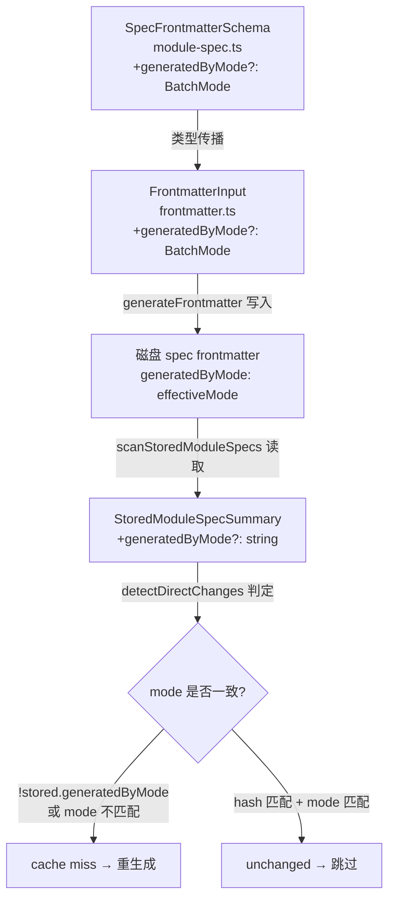
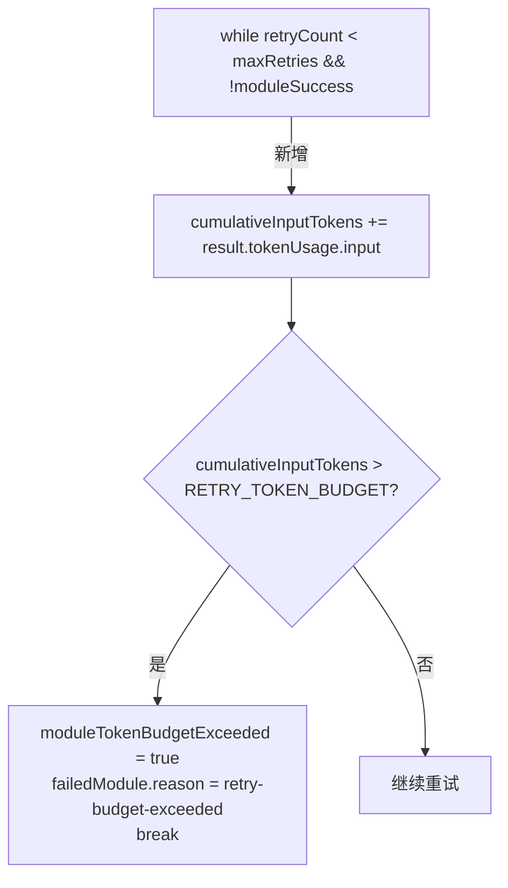
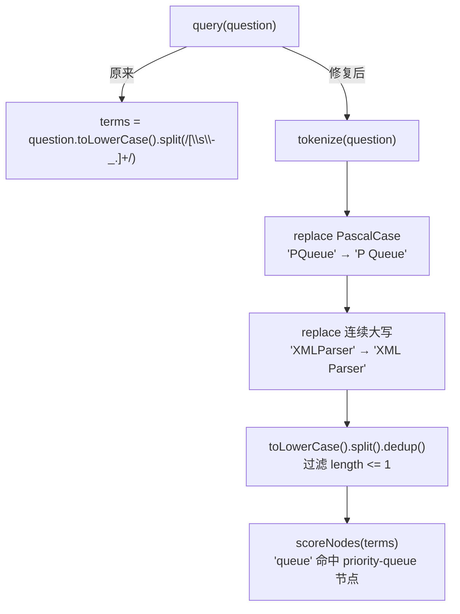

# 修复计划：v4.0.2 Batch 质量 + 跨模式断点修复

**分支**: `142-fix-batch-quality-and-checkpoint` | **日期**: 2026-04-27 | **报告**: fix-report.md

## 摘要

修复 3 个在 sindresorhus/p-queue 端到端验证中发现的生产级 bug：
1. **Bug 3**（优先）：跨模式断点复用——`SpecFrontmatter` 无 `generatedByMode` 字段，delta-regenerator 在 unchanged 判定时不区分模式，full mode 误命中 reading mode 缓存
2. **Bug 1**（次优先）：单模块重试无 token 预算上限——retry loop 仅检查重试次数，无累计 token 短路机制，相同 prompt 失败最多浪费 3× token
3. **Bug 4**（末优先）：query 不识别 PascalCase 符号——`query()` 方法整词 lowercase 匹配，无 PascalCase tokenization，`PQueue` 类名无法命中 "priority-queue" 节点

修复顺序按架构影响从大到小排列（Bug 3 影响 3 个文件 + 数据模型；Bug 1 影响单函数控制流；Bug 4 影响独立工具函数）。

## 技术上下文

**语言/版本**: TypeScript 5.x / Node.js 20.x+
**主要依赖**: `zod`（schema 验证）、`ts-morph`（AST，间接）、`@anthropic-ai/sdk`（LLM 调用）
**测试**: Vitest（`npx vitest run`）
**目标平台**: 本地 Node.js / Claude Code 沙箱
**性能目标**: N/A（正确性修复）
**约束**: `generatedByMode` 字段必须 optional（向后兼容现存 spec 文件）；旧 spec 一律视为 cache miss（安全降级）

## Codebase Reality Check

| 文件 | LOC | 公开方法/接口数 | 已知 Debt |
|------|-----|----------------|-----------|
| `src/models/module-spec.ts` | 302 | 17 个 Zod schema / type export | 无 TODO；`SpecFrontmatterSchema` 已有 12 个字段，扩展路径清晰 |
| `src/generator/frontmatter.ts` | 124 | 3（`getSpectraVersionString`、`generateFrontmatter`、`incrementVersion`） | 无；`FrontmatterInput` 接口扩展模式已建立 |
| `src/batch/delta-regenerator.ts` | 361 | 2 公开（`DeltaRegenerator.plan`、`DeltaRegenerator.render`） + 6 内部函数 | 无 TODO；`detectDirectChanges` 函数（L264-311）为主修复点，逻辑清晰 |
| `src/batch/batch-orchestrator.ts` | ~1412 | 1 主函数 `batchGenerateSpecs` + 多个内部辅助 | 文件较大（>1000 LOC）；L654-837 重试 loop 是修复目标；无明显循环依赖 |
| `src/panoramic/graph/graph-query.ts` | 722 | 7 公开方法（`query`、`getNode`、`findPath`、`getCommunity`、`getHyperedges`、`getSemanticEdges`、`getGodNodes`） | 无；`query()` 方法 L323-407 为修复目标 |

**前置清理判定**：
- `batch-orchestrator.ts` LOC > 500 且本次新增 < 20 行（仅在现有 while loop 处加 5 行），不触发前置 cleanup
- 无文件满足 3 个 TODO/FIXME 相关阈值
- **不需要前置 CLEANUP task**

## Impact Assessment

**影响文件数**：
- 直接修改：5 个文件（`module-spec.ts`、`frontmatter.ts`、`delta-regenerator.ts`、`batch-orchestrator.ts`、`graph-query.ts`）
- 间接受影响（读取 `SpecFrontmatter` 类型的调用方）：`doc-graph-builder.ts`（`StoredModuleSpecSummary` 扩展可能需要同步）— 实际仅类型消费，schema optional 字段不影响已有解析逻辑

**跨包影响**：无（全在 `src/` 内，panoramic 子目录独立）

**数据迁移**：
- `SpecFrontmatterSchema` 新增 optional 字段 `generatedByMode`，向后兼容（旧 spec 缺失该字段视为 cache miss，不破坏现有读取路径）
- `StoredModuleSpecSummary` 可能需要同步增加 `generatedByMode?: string` 字段，取决于 `scanStoredModuleSpecs()` 的解析逻辑
- 无数据库 schema 变更；无配置文件格式变更

**API/契约变更**：
- `FailedModule` 类型的 `reason` 字段（Bug 1）：当前 `FailedModule` 没有 `reason` 字段，新增为 optional（见 `module-spec.ts:232-239`）
- `FrontmatterInput` 接口新增 `generatedByMode?: BatchMode` 参数（可选，向后兼容）
- `query()` 方法签名不变，仅内部 tokenization 逻辑变更

**风险等级**：**MEDIUM**（影响文件 5 个；Bug 3 涉及 SpecFrontmatter 数据模型变更；存在旧 spec 兼容读取路径需验证）

**不触发 HIGH**：影响文件 < 10，无跨包影响，无 schema 破坏性变更（全 optional），无公共 API 契约重定义

## Constitution Check

| 原则 | 适用性 | 评估 | 说明 |
|------|--------|------|------|
| I. 双语文档规范 | 适用 | PASS | 计划文档中文散文 + 英文代码标识符 |
| II. Spec-Driven Development | 适用 | PASS | 本文件为 fix-report → plan → tasks 流程的组成部分，不直接修改源代码 |
| III. YAGNI / 奥卡姆剃刀 | 适用 | PASS | 每处修改均有当前明确的 bug 场景驱动；`tokenize()` 函数不引入额外抽象层 |
| IV. 诚实标注不确定性 | 适用 | PASS | Bug 4 的 tokenization 逻辑基于 fix-report 提供的参考实现，确定性高 |
| V. AST 精确性优先 | 部分适用 | PASS | 本次修复不涉及 AST 解析逻辑；`generatedByMode` 由运行时 `effectiveMode` 注入，非 AST 推断 |
| VI. 混合分析流水线 | 不适用 | N/A | 本次修复在批处理层和查询层，不改变三阶段流水线 |
| VII. 只读安全性 | 适用 | PASS | 修复不影响源代码读写范围；仅修改 spec 生成逻辑和查询逻辑 |
| VIII. 纯 Node.js 生态 | 适用 | PASS | 无新引入依赖；`tokenize()` 使用原生正则 |
| XIII. 向后兼容 | 适用 | PASS | `generatedByMode` optional；旧 spec 走 cache miss 路径（安全降级）；`reason` 字段 optional |

**结论：Constitution Check 全部通过，无 VIOLATION 项。**

## 修复顺序与依赖关系

```
Bug 3（SpecFrontmatter + frontmatter 写入 + delta-regenerator 判定）
    ↓  [数据模型确立后，batch-orchestrator 传参才有意义]
Bug 3 后续：batch-orchestrator 传参确认
    ↓  [无依赖]
Bug 1（batch-orchestrator retry loop token 预算）
    ↓  [无依赖]
Bug 4（graph-query tokenize）
```

Bug 3 四个修改点有内部依赖（`SpecFrontmatterSchema` 先行，`FrontmatterInput` + `generateFrontmatter` 次之，`delta-regenerator` 读取字段最后），必须按序完成。Bug 1 和 Bug 4 无相互依赖，可并行实现但按顺序验证。

## 项目结构

```text
src/
├── models/
│   └── module-spec.ts           # Bug 3：SpecFrontmatterSchema 新增 generatedByMode 字段
├── generator/
│   └── frontmatter.ts           # Bug 3：FrontmatterInput + generateFrontmatter 写入 generatedByMode
├── batch/
│   ├── delta-regenerator.ts     # Bug 3：detectDirectChanges() 加 mode 检查
│   └── batch-orchestrator.ts    # Bug 3：确认 effectiveMode 传参链路；Bug 1：retry loop token 预算
└── panoramic/graph/
    └── graph-query.ts           # Bug 4：query() 加 tokenize() PascalCase 拆分

tests/unit/
├── delta-regenerator-mode.test.ts    # Bug 3 集成测试（新增）
├── batch-orchestrator-retry.test.ts  # Bug 1 单元测试（新增）
└── graph-query-tokenize.test.ts      # Bug 4 单元测试（新增）
```

## 架构

### Bug 3 修复架构



### Bug 1 修复架构



### Bug 4 修复架构



## 每个 Bug 的文件变更清单

### Bug 3：跨模式断点复用

**文件 1：`src/models/module-spec.ts`**
- 修改位置：`SpecFrontmatterSchema`（L55-82）
- 新增字段：`generatedByMode: z.enum(['full', 'reading', 'code-only']).optional()`
- 在 `sourceKind` 字段（L79）之前插入，保持字段分组一致性

**文件 2：`src/generator/frontmatter.ts`**
- 修改位置：`FrontmatterInput` 接口（L31-60）+ `generateFrontmatter` 函数（L80-124）
- `FrontmatterInput` 新增字段：`generatedByMode?: 'full' | 'reading' | 'code-only'`
- `generateFrontmatter` 在 `sourceKind` 写入块之前，新增：
  ```typescript
  if (data.generatedByMode !== undefined) {
    frontmatter.generatedByMode = data.generatedByMode;
  }
  ```

**文件 3：`src/batch/delta-regenerator.ts`**
- 修改位置：`detectDirectChanges` 函数（L264-311）中的 unchanged 返回路径（当前 L297-308）
- 在 `stored.skeletonHash !== snapshot.currentHash` 检查之后（L297），新增 mode 检查：
  ```typescript
  if (stored.generatedByMode && stored.generatedByMode !== effectiveMode) {
    return [{ ..., reason: 'mode-changed' as DeltaChangeReason, ... }];
  }
  ```
- 需同步：`DeltaChangeReason` 类型（L19-23）新增 `'mode-changed'` 值
- 需同步：`detectDirectChanges` 函数签名新增 `effectiveMode` 参数
- 需同步：`StoredModuleSpecSummary` 在 `doc-graph-builder.ts` 中可能需要新增 `generatedByMode?: string` 字段（取决于 `scanStoredModuleSpecs` 是否传递该字段）

**文件 4：`src/batch/batch-orchestrator.ts`**
- 修改位置：`DeltaRegenerator.plan()` 调用处，确认 `effectiveMode` 已传入 `detectDirectChanges`
- 修改位置：`generateSpec` 调用处的 `genOptions`，确认 `generatedByMode: effectiveMode` 传入 frontmatter 写入链路（通过 `FrontmatterInput`）

### Bug 1：单模块重试无 token 预算上限

**文件：`src/batch/batch-orchestrator.ts`**
- 修改位置：L654-837 重试 loop
- 在 `while` 循环（L661）之前新增常量和变量：
  ```typescript
  const RETRY_TOKEN_BUDGET = 40_000;
  let cumulativeInputTokens = 0;
  let moduleTokenBudgetExceeded = false;
  ```
- 在每次 LLM 调用结果获取后（`result` 拿到之后），新增：
  ```typescript
  if (result.costMetadata?.tokenUsage.input) {
    cumulativeInputTokens += result.costMetadata.tokenUsage.input;
    if (cumulativeInputTokens > RETRY_TOKEN_BUDGET) {
      moduleTokenBudgetExceeded = true;
      break;
    }
  }
  ```
- 修改位置：catch 块（L822-836），当 `moduleTokenBudgetExceeded` 时生成 `failedModule.reason = 'retry-budget-exceeded'`
- 同步：`FailedModule`（`module-spec.ts:232-239`）新增 `reason?: string` optional 字段

### Bug 4：query 不识别 PascalCase 代码符号

**文件：`src/panoramic/graph/graph-query.ts`**
- 修改位置：`query()` 方法（L323-407），L330-334 的 terms 提取逻辑
- 在 `scoreNodes` 私有方法之前（约 L210），新增 module-level 纯函数：
  ```typescript
  function tokenize(q: string): string[] {
    const normalized = q
      .replace(/([a-z])([A-Z])/g, '$1 $2')
      .replace(/([A-Z]+)([A-Z][a-z])/g, '$1 $2');
    return Array.from(new Set(
      normalized.toLowerCase().split(/[\s\-_.]+/).filter((t) => t.length > 1)
    ));
  }
  ```
- 替换 `query()` 内 L330-334 的 terms 提取：
  ```typescript
  // 原：const terms = question.toLowerCase().split(...).filter(...)
  // 新：
  const terms = tokenize(question);
  ```

## 回归风险评估

### Bug 3 回归风险（中）

**风险点 1：旧 spec 读取路径**
- 旧 spec 无 `generatedByMode` 字段，读取时 `stored.generatedByMode === undefined`
- 修复逻辑：`if (stored.generatedByMode && stored.generatedByMode !== effectiveMode)` — 当字段缺失时条件为 `false`，不触发 cache miss，走下一步 hash 比对
- **此处有设计矛盾**：fix-report 指定"老 spec 一律视为 cache miss"，而上述条件会让旧 spec 走 hash 比对（不是 cache miss）。需在 T03 中明确实现策略，推荐实现为：
  ```typescript
  // 旧 spec（无 generatedByMode）→ cache miss（安全兜底）
  if (!stored.generatedByMode || stored.generatedByMode !== effectiveMode) {
    return [{ ..., reason: 'mode-changed' ... }];
  }
  ```
  这样旧 spec 触发重生成，是安全降级方向。

**风险点 2：`StoredModuleSpecSummary` 字段同步**
- `delta-regenerator.ts` 中 `storedSpecs: StoredModuleSpecSummary[]`，如果 `scanStoredModuleSpecs` 不传递 `generatedByMode`，`stored.generatedByMode` 始终 undefined，mode 检查永远跳过
- 需检查 `scanStoredModuleSpecs` 读取 frontmatter 的代码路径，确认 `generatedByMode` 被传出

**风险点 3：`effectiveMode` 传递链路**
- `detectDirectChanges` 当前签名无 `effectiveMode` 参数（L264），需新增参数并在 `DeltaRegenerator.plan()` 调用处传入
- `batch-orchestrator` 中 `DeltaRegenerator.plan()` 调用处需传入 `effectiveMode`

### Bug 1 回归风险（低）

- `result.costMetadata` 可能为 undefined（AST-only 降级时）；条件加 `?.` 保护，不影响降级路径
- `RETRY_TOKEN_BUDGET = 40_000` 为模块级常量，后续可配置化（当前不需要）
- loop 中 `break` 后流向 catch 块之外，需确认 `moduleTokenBudgetExceeded` 的处理逻辑位置（catch 内部 vs while 后）

### Bug 4 回归风险（低）

- `tokenize()` 过滤 `length > 1`，会排除单字符词（如 "P" 来自 "PQueue" 拆分），这是预期行为
- 现有测试若 mock query 词为短词可能受影响——需检查已有 graph-query 测试

## 验证方法

### Bug 3 验证

```bash
# 1. 类型检查确认无编译错误
npm run build

# 2. 单元测试
npx vitest run tests/unit/delta-regenerator-mode.test.ts

# 集成测试场景（新增测试）：
# - reading mode 生成后，接 full mode → 所有模块进入 LLM pipeline（无 unchanged 跳过）
# - full mode 生成后，接 full mode → hash 未变时正常跳过（不因 mode 检查误判）
# - 旧 spec（无 generatedByMode） + full mode → 触发 cache miss
```

### Bug 1 验证

```bash
# 单元测试（新增）
npx vitest run tests/unit/batch-orchestrator-retry.test.ts

# 测试场景：
# - mock LLM 持续失败，前两次各消耗 22k token → 第二次后 cumulativeInputTokens > 40k → 早期 break
# - 验证 failedModule.reason === 'retry-budget-exceeded'
# - mock LLM 消耗 5k/次，3次后 retryCount >= maxRetries → 正常失败路径（不触发预算短路）
```

### Bug 4 验证

```bash
# 单元测试（新增）
npx vitest run tests/unit/graph-query-tokenize.test.ts

# 测试场景：
# - tokenize('PQueue') → ['p', 'queue', 'pqueue'] 含子词
# - tokenize('XMLParser') → ['xml', 'parser', 'xmlparser'] 含子词
# - query('How does PQueue handle concurrency?') → 返回含 'priority-queue' 相关节点

# 全量回归
npx vitest run
```

### 全量验证

```bash
npm run build && npx vitest run
```

## Complexity Tracking

本次修复无 Constitution 违规，无需豁免论证。

| 决策 | 理由 | 更简单方案被拒绝的原因 |
|------|------|----------------------|
| `RETRY_TOKEN_BUDGET = 40_000` 硬编码为常量而非配置项 | 当前无用户配置需求；fix-report 明确建议 40k；YAGNI | 引入新配置项会扩大验证面，超出本次 hotfix 范围 |
| `tokenize()` 定义为 module-level 函数而非 `GraphQueryEngine` 方法 | 纯函数，无状态依赖，便于独立单元测试 | 定义为私有方法会与 `scoreNodes` 耦合，不利于独立测试 |
| 旧 spec（无 `generatedByMode`）一律 cache miss | 安全降级：不假设旧 spec 与当前 mode 兼容，宁可多生成一次 | 假设旧 spec 兼容会导致 full mode 误复用 reading spec，与 Bug 3 同根因 |
