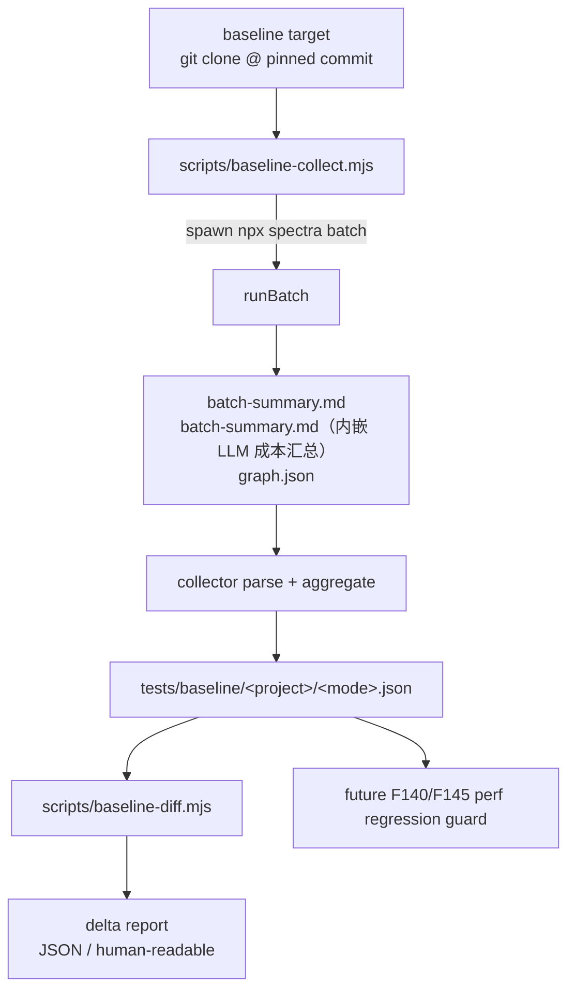

# Feature 143 — Implementation Plan

**Branch**: `feature/143-large-project-e2e-baseline`  
**Date**: 2026-04-30  
**Spec**: [spec.md](./spec.md)  
**Mode**: feature（Spec-Driven Development）

---

## 0. Summary

Feature 143 在 spec.md 中被定位为"一次性测量"（在 Continue / Khoj 等真实大项目上跑 spectra batch full mode，产出 `perf-baseline-report.md` + `bottleneck-analysis.md`，为 Phase 3 优化决策提供数据基础）。

本次实施在 spec.md scope 之上做了一层**基础设施化升级**，将"一次性研究"扩展为"reproducible baseline infrastructure"，原因如下：

| 维度 | spec.md 原始 | 本次扩张 | 扩张理由 |
|------|-------------|---------|---------|
| 项目数量 | 2 | 3-5（不同规模/语言） | F140（panoramic 大改）和 F146（并发优化已合并到 master）之后需要回归验证；2 个项目无法支撑分层 |
| Mode 覆盖 | full | full / reading / code-only | reading 模式省 38% 时间，是用户最可能用的；code-only 是"快速分析"。三模式对比能定位"哪个 mode 才是性价比拐点" |
| 数据持久化 | specs/ 下文档 | `tests/baseline/<project>/<mode>.json`（fixture，< 1MB gzip） | 文档不适合机器消费；JSON fixture 才能作为 perf regression guard 的 source of truth |
| 配套工具 | 无 | `scripts/baseline-collect.mjs` + `scripts/baseline-diff.mjs` | 没有自动化 collector，重跑成本极高，违反 §6 "可重复"原则 |
| CI 集成 | 不在 CI 跑 | 可选 weekly cron workflow | 不强制集成 CI；提供 workflow 模板让用户按需启用 |

**Phase 化交付**：

- **Phase 0**: collector skeleton + baseline data schema 定稿 + 1 个小项目（karpathy/micrograd）端到端验证 + 空报告骨架（让 SC-002 字段完整性可机器化检查，但**不**标 SC-002/SC-003 PASS）
- **Phase 1**: 3 个 Wave 1 baseline target 首轮采集（micrograd / 本仓库 dogfood / Continue），生成首批 fixture，回填 perf-baseline-report.md / bottleneck-analysis.md（**Phase 1 完成才可标 SC-002/SC-003 PASS**）
- **Phase 2**: diff 工具 + 同 commit 重跑 reproducibility 验证（< 5% 偏差）+ Wave 2 Khoj backend 采集补齐 spec §2.1"至少 1 个 Python 500+ 项目"要求（**Phase 2 完成才可标 SC-001 PASS**）
- **Phase 3**（可选）: CI workflow 模板（默认 workflow_dispatch）+ Wave 2 扩展项目（LangChain）

**SC 验收映射**：

| SC | 完整满足节点 | 验证方式 |
|----|-------------|---------|
| SC-001（2 个项目 full-mode batch）| Phase 2 末（Wave 1 Continue + Wave 2 Khoj 都跑完）| 本地命令 `npm run baseline:collect -- --verify-artifacts` |
| SC-002（perf-baseline-report 数据完整）| Phase 1 末 | 字段 grep + collector 单测覆盖 schema 全字段 |
| SC-003（bottleneck-analysis 含 ≥3 个瓶颈）| Phase 1 末 | 文档 grep + 人工审 |
| SC-004（具体数字，无"约/估计"）| Phase 1 末 | grep 排除 `约|估计|estimated`（白名单 dryRun.estimatedTokens 除外）|
| SC-005（F145/F146 并发数建议）| Phase 1 末 | bottleneck-analysis §4 关键词 grep |

---

## 1. Technical Context

| 项 | 取值 |
|----|------|
| Language/Version | Node.js 20.x（与仓库 package.json engines 对齐），ES Module（`.mjs`） |
| Primary Dependencies | 仅复用现有 `node:child_process` / `node:fs` / `node:zlib`；**不新增 npm 依赖** |
| Storage | 文件系统：`tests/baseline/<project>/<mode>.json`（可选 gzip）+ `tests/baseline/.workspaces/`（gitignored） |
| Testing | vitest（与现有项目对齐），collector / diff 单测放 `tests/unit/baseline-{collect,diff}.test.ts` |
| Target Platform | macOS / Linux（开发者本地 + CI runner），Windows 不支持（git submodule + bash 兼容性问题） |
| Project Type | single（不是 web/mobile） |
| Performance Goals | collector 自身开销 < 5% 总耗时（即 baseline 跑 60 分钟时 collector 不超过 3 分钟） |
| Constraints | 单 fixture < 1MB（gzip 后），所有 LLM 调用强制 `claude-sonnet-4-6`；diff 工具不调 LLM |
| Scale/Scope | 当前阶段：3-5 个 baseline projects × 1-3 个 mode = 最多 15 个 fixture；Wave 2 可扩到 7-8 个 projects |

---

## 2. Codebase Reality Check

| 现有文件 | LOC | 角色 | 本 Feature 关系 |
|----------|-----|------|----------------|
| `src/batch/batch-orchestrator.ts` | ~600+ | batch 入口（runBatch） | **只读使用**（通过 spawn `npx spectra batch`）|
| `src/batch/cost-summary.ts` | ~200 | cost summary 聚合 | 输出格式是 collector 解析对象之一 |
| `src/cli/commands/batch.ts` | 100+ | batch CLI flag | collector 通过 CLI 调用，不直连 runBatch API |
| `scripts/repo-sync.mjs` | ~500 | 仓库同步 | 不动；仅参考脚本风格（ESM、pure Node、无外部依赖） |
| `scripts/repo-check.mjs` | ~300 | 仓库校验 | 不动；同上 |
| `scripts/sync-release-contracts.mjs` | ~400 | release contract sync | 不动 |
| `package.json` (scripts 段) | — | npm scripts 注册表 | **+2 行**：`baseline:collect` / `baseline:diff` |
| `.gitignore` | — | git 忽略规则 | **+1 行**：`tests/baseline/.workspaces/` |

**前置 cleanup 评估**：本 Feature 不修改任何 src/ 代码，新增脚本独立成文件，**无需前置 cleanup task**。

---

## 3. Impact Assessment

| 维度 | 评估 |
|------|------|
| 直接修改文件数 | 核心代码/配置 6-8（collector / diff / 2 个单测 / package.json / .gitignore / tests/baseline/README.md / 可选 CI yaml）+ 报告 2-3 份（plan / tasks / verification / perf-baseline / bottleneck）+ fixture 若干（5-9 个 JSON）|
| 间接受影响文件 | 0（不动 src/ 任何代码，无下游消费者） |
| 跨包影响 | 0（仅 scripts/ + tests/baseline/，不跨 src/ 或 plugins/） |
| 数据迁移 | 无（新建 fixture 目录，无历史数据格式变更） |
| API/契约变更 | 无（不改 batch-orchestrator 公开接口；fixture schema 是新建的内部约定） |
| **风险等级** | **LOW**（影响文件 < 10，无跨包，不动 API 契约） |

**LOW 风险结论**：不需要"HIGH 风险强制分阶段"，但本 plan 仍主动分 4 phase 交付，原因是 baseline 采集本身有外部依赖（git clone 大项目、API 速率限制），分阶段能让单 phase 失败不阻塞已完成数据的提交。

---

## 4. Constitution Check

| 原则 | 适用性 | 评估 | 说明 |
|------|--------|------|------|
| I. 双语文档规范 | 是 | ✅ PASS | 所有 plan/tasks/verification 中文散文 + 英文标识符 |
| II. Spec-Driven Development | 是 | ✅ PASS | 通过 spec-driver-feature 流程执行 |
| III. YAGNI | 是 | ✅ PASS | 不新增 npm 依赖；collector/diff 用纯 Node（no zod、no commander），仅 2 个 npm script（`baseline:collect` + `baseline:diff`）+ 2 个脚本文件 |
| IV. 测试覆盖 | 是 | ✅ PASS | collector / diff 各配单测（fixture 解析、阈值判定）|
| V. 提交前验证 | 是 | ✅ PASS | 计划中每个 phase commit 前跑 `npx vitest run` + `npm run build` |

**无 VIOLATION**，进入 Phase 0。

---

## 5. Architecture

### 5.1 数据流图



### 5.2 模块边界

| 模块 | 职责 | 不做 |
|------|------|------|
| `baseline-collect.mjs` | 接受 target/mode/commit；clone target；spawn batch；解析产物；写 fixture | 不修改 batch 行为；不并行多 target（顺序跑避免 API rate limit）|
| `baseline-diff.mjs` | 读两个 fixture（old / new）；按 schema 字段维度算 delta；按阈值染色；输出 JSON / 文本 | 不调 LLM；不读 batch 原始产物 |
| `tests/baseline/<project>/<mode>.json` | 只读 fixture，作为 perf regression source of truth | 不被业务代码 import |
| `tests/baseline/.workspaces/` | 运行时 clone 大项目的 scratch 目录，gitignored | 不持久化；collector 跑完不清理（避免每次重 clone）|

### 5.3 Baseline 数据 schema（fixture JSON 结构）

```jsonc
{
  "schemaVersion": "1.0",
  "meta": {
    "spectraVersion": "4.1.0",            // 来自 package.json
    "collectorVersion": "0.1.0",          // collector 自身版本，schema 演化用
    "targetProject": "continuedev/continue",
    "targetCommit": "abc123...",          // 必须是 pin 死的 commit hash
    "targetFileCountsByType": {           // 按扩展名分桶（spec §5.1 必含）
      "ts": 720,
      "tsx": 80,
      "py": 0,
      "md": 45,
      "other": 0
    },
    "targetLocEstimate": 78500,           // sum of LOC; cloc 不可用时用 awk/wc -l 估算
    "spectraModuleCount": 78,             // Spectra 自己识别的 module 数（与 specModuleCount 区分）
    "mode": "full",                       // full | reading | code-only
    "model": "claude-sonnet-4-6",
    "runTimestampUtc": "2026-04-30T10:00:00Z",
    "runHostOs": "darwin",
    "command": "npx",                     // 完整命令 + 参数 + env，确保 spec §6 可重复性
    "args": ["spectra", "batch", "tests/baseline/.workspaces/continue", "--mode", "full", "--budget", "500000"],
    "envAllowlist": {
      "ANTHROPIC_API_KEY": "<redacted>",  // 仅记录 key 是否存在，不存值
      "SPECTRA_LOG_LEVEL": "info"
    },
    "outputDir": "tests/baseline/.workspaces/continue/.spectra"
  },
  "dryRun": {                             // spec §5.1 必含：dry-run 偏差
    "estimatedTokens": 250000,            // npx spectra batch --dry-run 输出
    "actualTokens": 280245,               // 实跑 input + output 之和
    "biasRatio": 1.12                     // actual / estimated
  },
  "perf": {
    "totalWallMs": 1234567,               // process.hrtime.bigint() 测墙钟
    "llmCallCount": 87,
    "llmCallDurationsMs": {               // 来自 batch-summary.md + stdout/stderr 解析
      "p50": 1200,
      "p95": 4500,
      "min": 300,
      "max": 12000,
      "samplesCount": 87                  // 样本数，便于判定 P95 可信度
    },
    "tokensInput": 234567,                // 来自 batch-summary.md（内嵌 LLM 成本汇总）
    "tokensOutput": 45678,
    "tokensCacheRead": 123456,
    "estimatedCostUsd": 0.87,
    "memoryPeakKb": 524288                // 来自 /usr/bin/time -v "Maximum resident set size"；无法采集时为 null + 注释原因
  },
  "output": {
    "graphNodeCount": 5234,               // 来自 graph.json
    "graphEdgeCount": 12456,
    "graphHyperedgeCount": 234,           // F133 之后才有意义
    "graphSizeBytes": 1234567,            // wc -c graph.json
    "specModuleCount": 78,                // 来自 batch result（与 meta.spectraModuleCount 一般相等，但保留两侧便于诊断不一致）
    "specSuccessCount": 75,
    "specSkippedCount": 2,
    "specFailedCount": 1
  },
  "phases": {                             // 来自 stdout/stderr timestamp 分析（spec §2.1）
    "specGenerationMs": 800000,
    "graphBuildMs": 200000,
    "docsGenerationMs": 100000,
    "embeddingCacheMs": 50000,
    "otherMs": 84567,
    "extractionMethod": "stdout-timestamps"  // 标注阶段耗时来源，便于后续 F140 改进口径
  },
  "quality": null                         // schemaVersion 1.0 不强制；F140 回填时见下面升级规则
}
```

**Schema versioning 规则**：
- `schemaVersion` 是字符串 SemVer（`1.x` 兼容、`2.x` breaking）
- diff 工具默认只比较同 schemaVersion major 段（`1.x` vs `1.y` 兼容；`2.x` vs `1.x` 报错）
- minor bump（`1.0 → 1.1`）：纯字段添加，老 fixture 自动补 `null`，diff 工具按存在字段比较
- major bump（`1.x → 2.0`）：字段重命名/删除/语义变更，diff 工具拒绝跨 major 比较
- **F140 回填 quality 的预期路径**：F140 把 `quality` 从 `null` 改为 `{ specCompletenessRatio, hyperedgeAccuracy, ... }` 结构 → schemaVersion 升 `1.1`；diff 提供 `--ignore-quality` flag 允许 1.0 fixture 与 1.1 fixture 对比 perf 维度
- collector 始终写当前 schemaVersion；不支持手工降级老 fixture

### 5.4 Diff 阈值策略

**两个独立维度**：reproducibility gate（同 commit 重跑应稳定）与 regression diff（跨 commit 比较新旧 baseline），两者用不同阈值。

#### 5.4.1 Reproducibility gate（同 commit 重跑）

| 维度 | FAIL 阈值 | 理由 |
|------|----------|------|
| `perf.totalWallMs` | \|delta\| > 5% | spec §6 "再跑一次结果差异 < 5%" |
| `perf.tokensInput + tokensOutput` | \|delta\| > 3% | LLM 调用本身有少量随机性，但 token 应基本稳定 |
| `output.graphNodeCount / graphEdgeCount` | \|delta\| > 1% | graph 是 AST 静态产物，应完全确定（>1% 通常意味 collector bug）|
| `output.specSuccessCount` | 任何差异 | 模块成功率应完全可重复 |

> Reproducibility gate 由 `baseline-diff --mode=reproducibility` 触发（Phase 2 验证用）。任何 FAIL = collector 不可信，必须先修 collector，再继续 baseline 采集。

#### 5.4.2 Regression diff threshold（跨 commit 比较）

| 维度 | 黄色（warning）| 红色（fail）| 理由 |
|------|---------------|------------|------|
| `perf.totalWallMs` | +10% ~ +20% | > +20% | 性能回归首要信号 |
| `perf.tokensInput + tokensOutput` | +5% ~ +15% | > +15% | 直接挂钩成本 |
| `perf.estimatedCostUsd` | +10% ~ +20% | > +20% | 复合维度，与上面冗余但更直观 |
| `output.graphNodeCount` | ±10% | ±20% | 结构变化预期，但巨变需关注 |
| `output.specSuccessCount / specModuleCount` | < 95% | < 90% | 质量回归 |
| `phases.*` 单项占比 | ±5pp | ±10pp | 瓶颈漂移信号 |

> Regression diff 是 `baseline-diff` 默认行为；用于 F140/F146 完成后对比新旧 fixture，作为 PR 描述附件。绿色窗口（< +5% / < +10%）就是"正常涨跌"，不报警。

阈值都写成常量在 `scripts/baseline-diff.mjs` 顶部（`REPRODUCIBILITY_THRESHOLDS` + `REGRESSION_THRESHOLDS` 两个 object），便于调整。

---

## 6. Project Structure

### 6.1 本 Feature 文档

```
specs/143-large-project-e2e-baseline/
├── spec.md                          # 已存在（227 行）
├── plan.md                          # 本文件
├── tasks.md                         # 下一阶段产出
├── perf-baseline-report.md          # Phase 1 产出（spec.md §5.1 要求）
├── bottleneck-analysis.md           # Phase 1 产出（spec.md §5.2 要求）
└── verification/
    └── verification-report.md       # Phase 4 产出
```

### 6.2 源代码 + fixture 布局

```
scripts/
├── baseline-collect.mjs             # 新建（~250 行）
└── baseline-diff.mjs                # 新建（~150 行）

tests/
├── baseline/
│   ├── README.md                    # 新建（fixture 目录说明）
│   ├── micrograd/
│   │   ├── full.json                # ~5KB
│   │   ├── reading.json
│   │   └── code-only.json
│   ├── self-dogfood/                # 本仓库自身
│   │   ├── full.json
│   │   └── reading.json
│   ├── continue/                    # Wave 1，最大 TS 目标
│   │   └── full.json                # ~8-15KB（实际由 collector 跑出）
│   ├── khoj/                        # Wave 2，Python 目标（满足 spec §2.1）
│   │   └── full.json
│   └── .workspaces/                 # 内容 gitignored，目录用 .gitkeep 保留
│       └── .gitkeep                 # gitignore 规则：`tests/baseline/.workspaces/*` + `!tests/baseline/.workspaces/.gitkeep`
└── unit/
    ├── baseline-collect.test.ts     # 新建（解析 fixture / 错误处理 / schema 完整性）
    └── baseline-diff.test.ts        # 新建（阈值判定 / schema mismatch / reproducibility 模式）

.github/workflows/
└── baseline-weekly.yml              # 可选（Phase 3，默认 on: workflow_dispatch）
```

**Fixture 大小预估**：每个 JSON 主体在 5-15KB（取决于 llmCallDurationsMs 是否 inline 全部样本；当前设计仅存 P50/P95/min/max，不存全样本数组，所以 << 1MB 上限）。如未来需要 inline 全样本，使用 `gzip` 压缩后再写盘，扩展名为 `.json.gz`。

---

## 7. 决策日志（D1-D6）

### D1: Baseline target projects 选型

**Decision**: Wave 1 选 3 个 TS 项目（覆盖小/中/大规模），Wave 2 必补 1 个 Python 500+（满足 spec §2.1 双语言要求），可选再扩 1 个极限压力。

| Wave | 项目 | URL | Pin commit | 文件数 | 主语言 | 选择理由 |
|------|------|-----|-----------|-------|-------|---------|
| 1 必跑 | karpathy/micrograd | github.com/karpathy/micrograd | tag `master`（commit 在 collector 跑时记录到 fixture） | ~6 | Python | 极小项目锚点，验证 collector 自身正确性（参考 spec.md §1.1 的 v3.x baseline，**注**：v4.1 数据不与 v3.x 直接可比，仅作为锚点） |
| 1 必跑 | self-dogfood（本仓库）| 当前 worktree | HEAD（写入 fixture）| ~250+ | TypeScript | 中等规模 + 我们最熟悉的代码，便于人工 sanity-check fixture 数据 |
| 1 必跑 | continuedev/continue | github.com/continuedev/continue | **`v0.9.245` 或 collector 跑时的最新 stable tag**（在 tasks 阶段锁定具体 tag）| 800+ | TypeScript | spec.md §4 推荐，最接近 Phase 3 用户场景；满足 spec §2.1 "TS 500+"|
| 2 必跑 | khoj-ai/khoj（含 backend）| github.com/khoj-ai/khoj | release tag（tasks 阶段锁定）| 300+ .py + 100+ .ts | Python | **必跑**：spec §2.1 要求"至少 1 个 Python 500+"；khoj 总文件数 500+（Python + TS 混合），是当前 Python 项目候选中最现实的选择 |
| 2 可选 | langchain-ai/langchain | github.com/langchain-ai/langchain | release tag | 1000+ .py | Python | 极限压力测试，cost $2+，仅在前面四个全部成功且预算允许时跑 |

**SC-001 满足节点**: spec §3 SC-001 要求"2 个项目各完成至少 1 次完整 full-mode batch"——**Wave 1 完成后 Continue 单项就满足"至少 1 个 TS 500+"，但 spec §2.1 要求双语言**，因此 SC-001 完整 PASS 需要 Wave 2 的 khoj 也跑完。Phase 化交付（§0）已经把 Wave 2 khoj 划入 Phase 2。

**Rationale**: Wave 1 三档（小/中/大）覆盖规模主轴 + 双语言（TS/Python）。Wave 2 优先 Python 后端（khoj）补 Python AST patch 后的对比基线。LangChain 作为可选压力测试，不是 Wave 1 必需。

**Alternatives 拒绝**:
- 全选 5 个 Wave 1：单 Feature 跑完成本 $5+，且 Continue 可能 60+ 分钟，全部排队跑会超出本 Feature 1-2 天工期
- 只选 1 个大项目：无对比，无法识别"小项目锚点 vs 大项目放大"的非线性

### D2: Mode 覆盖矩阵

**Decision**:

| Project | full | reading | code-only |
|---------|------|---------|-----------|
| micrograd | ✅ Wave 1 | ✅ Wave 1 | ✅ Wave 1 |
| self-dogfood | ✅ Wave 1 | ✅ Wave 1 | ⚪ Wave 2 |
| continue | ✅ Wave 1 | ⚪ Wave 2 | ⚪ Wave 2 |

**Rationale**: micrograd 极小（< 5 分钟），三模式全跑成本可忽略，作为 mode 对比的"完整样本"。Continue 跑 full 一次就够大（预计 30-60 分钟，$1-2），先采 full 确认基线；reading / code-only 留 Wave 2。self-dogfood 中等成本，full + reading 即可形成对比。

**Alternatives 拒绝**:
- 全 3×3 矩阵：Continue 跑 3 次成本 $3-6，超出 spec.md §7 风险表的"< $5"预算
- 只跑 full：无法回答"reading 模式真的省 38%？" 的可验证 SC

### D3: Baseline data schema

**Decision**: 见 §5.3 完整 schema。schemaVersion 1.0 起步，字段规则遵循 SemVer（add minor / break major）。

**Rationale**:
- `meta` 包含完整 reproducibility 信息（version + commit + model + flags 等价物）
- `perf` 字段直接可比，对应 spec.md §5.1 的所有维度
- `phases` 单独成段而非平铺到 perf，因为 phase 占比是 bottleneck 分析的核心
- `quality` 留 placeholder，不在本 Feature 强制 schema（避免和 F140 强耦合）

**Alternatives 拒绝**:
- 用 protobuf / TypeBox 强类型 schema：违反 III YAGNI，3-5 个 fixture 不需要类型生成
- 把 quality 字段直接砍掉：F140 完成后回填会触发 schemaVersion bump，提前留 placeholder 更稳

### D4: Collector 实现策略

**Decision**: 纯 Node.js ESM 脚本（`.mjs`），用 `node:child_process` spawn 调用 `/usr/bin/time -l npx spectra batch`（macOS）或 `/usr/bin/time -v npx spectra batch`（Linux），不直连 runBatch API。

**Rationale**:
- 不直连 runBatch：避免 collector 被 src/batch 的内部 refactor 冲击（F140 在大改）
- 用 `npx spectra batch`：CLI 接口稳定（v4.x 不会大改），collector 解耦
- ESM `.mjs`：与现有 scripts/repo-*.mjs 风格一致
- 包 `/usr/bin/time`：从 stderr 抓 memoryPeakKb（"Maximum resident set size"），spec §2.1 必含

**解析数据来源完整清单**（确保 schema 全字段都有源）：

| Schema 字段 | 来源 |
|------------|------|
| `meta.targetFileCountsByType` / `targetLocEstimate` | collector 跑前对 target 目录 `find . -name '*.{ts,tsx,py,md}' \| wc -l` + `wc -l` 累加 |
| `meta.spectraModuleCount` | batch-summary.md frontmatter 或 stdout"模块总数: N"行 |
| `meta.command / args / envAllowlist / outputDir` | collector 自己持有（spawn 之前就知道） |
| `dryRun.estimatedTokens` | 第一遍跑 `npx spectra batch --dry-run` 的 stdout |
| `dryRun.actualTokens` / `dryRun.biasRatio` | 实跑后从 batch-summary.md（内嵌 LLM 成本汇总） 算 |
| `perf.totalWallMs` | `process.hrtime.bigint()` 测墙钟（spawn 前/后）|
| `perf.llmCallCount` / `llmCallDurationsMs` | **stdout/stderr log 解析**（spawn 时 `stdio: 'pipe'`，全程缓存 stdout 到 `<output>/spectra-stdout.log`，再用正则提取每次 LLM call 的开始/结束 timestamp 和耗时）|
| `perf.tokens*` / `estimatedCostUsd` | batch-summary.md（内嵌 LLM 成本汇总） |
| `perf.memoryPeakKb` | `/usr/bin/time` stderr 解析；不可用时（如非 GNU time）写 `null` 并在 fixture 注 `memoryPeakKb_skipReason: "..."` |
| `output.graph*` | graph.json 解析 + `wc -c` |
| `output.spec*` | batch-summary.md frontmatter 或 result 对象 |
| `phases.*` | stdout timestamp 分析：根据 batch-orchestrator 的 phase 边界日志（"开始构建 graph"/"开始生成 spec"等关键字）算各段耗时；如关键字缺失则写 `extractionMethod: "unavailable"` 并标 phase 字段 `null` |

**Alternatives 拒绝**:
- 直接 import runBatch：F140 大改 panoramic 时可能被破坏（虽然 batch-orchestrator 不在 panoramic，但内部依赖链有风险）
- 用 `tsx` 跑 TypeScript collector：增加构建依赖，不必要
- 不抓 stdout/stderr 全文：那样 LLM 耗时分布、phase 占比、memory 都拿不到，schema 多个字段会全 null，spec §2.1 验收失败

### D5: Diff 工具阈值

**Decision**: 见 §5.4。阈值写常量，不引入配置文件。

**Rationale**:
- 阈值首版凭经验定，调整通过 PR review；不需要"运行时配置"灵活性（YAGNI）
- 黄/红两档够用；细分四档反而让用户失去判断力

**Alternatives 拒绝**:
- 配置化阈值：违反 III YAGNI，3-5 个 fixture 用不上
- 仅二元（pass/fail）：缺中间态，会让"小幅波动"被误判

### D6: CI 集成

**Decision**: **Phase 3 提供 workflow 模板，但默认 `on: workflow_dispatch`（不绑 cron，不绑 PR）**。SC-001 的验收**不依赖 CI**，由本地命令 `npm run baseline:collect -- --verify-artifacts` 自验证（见 §10）。

**Rationale**:
- weekly cron 一年成本 $25-100（3-5 个 project × full mode），超出"测量基础设施"的成本范围
- 提供模板让用户/团队自行决定启用 cron 还是手动 dispatch
- 真正的 perf regression guard 应该是 PR-time 跑 micrograd（< $0.05），由 F144 后续做，不是本 Feature 范围
- SC-001 验证由 collector 自带的 `--verify-artifacts` 模式处理：跑完后检查 `tests/baseline/<project>/<mode>.json` 文件存在 + schema 完整 + 必含字段非 null

**Workflow 模板内容**（最小骨架，Phase 3 落地）：

```yaml
name: Baseline Collection
on:
  workflow_dispatch:
    inputs:
      targets: { description: 'comma-separated project names', default: 'micrograd' }
      mode: { description: 'full|reading|code-only', default: 'full' }
jobs:
  collect:
    runs-on: ubuntu-latest
    steps:
      - uses: actions/checkout@v4
      - uses: actions/setup-node@v4
      - run: npm ci && npm run build
      - run: npm run baseline:collect -- --targets ${{ inputs.targets }} --mode ${{ inputs.mode }}
        env: { ANTHROPIC_API_KEY: ${{ secrets.ANTHROPIC_API_KEY }} }
      - uses: actions/upload-artifact@v4
        with: { name: baseline-fixtures, path: tests/baseline/**/*.json }
```

**Alternatives 拒绝**:
- 默认开 weekly cron：未授权的持续 API 消费
- 完全不出 CI 模板：用户需自行写 workflow，违反"可重复"原则
- 让 SC-001 依赖 CI：CI 不是 SC-001 的必要路径，本地跑也算满足

---

## 8. 不适用的子产物

| 子产物 | 状态 | 原因 |
|--------|------|------|
| research.md | 跳过 | spec.md 已含 §4 候选项目调研；prompt 明确"跳过 research" |
| data-model.md | 不适用 | 测量基础设施只对内部使用，无业务实体建模需求；schema 见 §5.3 |
| contracts/ | 不适用 | 无外部 API/合约；fixture JSON schema 是内部约定 |
| quickstart.md | 不适用 | 用法直接写到 `tests/baseline/README.md`，不需要独立 quickstart |

---

## 9. Complexity Tracking

| 决策点 | 偏离简单方案 | 偏离理由 |
|--------|-------------|---------|
| 提供 schemaVersion 字段 | 不直接用 raw JSON | 未来 F140 / F146 后续要回填 quality 字段，schemaVersion 是唯一前向兼容入口 |
| 单独 `phases` 段而非平铺 perf | 多一层嵌套 | 瓶颈分析（spec.md §5.2 bottleneck-analysis）核心维度，分组让 diff 输出更清晰 |
| 默认不绑 cron | 用户需手动启用 CI | 持续 API 消费需用户授权（参考"不要把一次授权当成长期授权"原则） |

---

## 10. 后续阶段流程

### 10.1 阶段执行守卫

| 阶段 | 守卫 | 通过条件 |
|------|------|---------|
| tasks | 按本 plan 的 Phase 0-3 拆任务，每 phase 独立 commit | tasks.md 列出全部 task，每个挂 phase 标签 |
| implement | 严格按 tasks.md 顺序，每 task 完成跑相关单测 | 同 task 的修改不破坏已通过的单测 |
| Phase 0 commit | **不可标 SC-002/SC-003 PASS**（产物只有空报告骨架）；commit message 必须含 `[Phase 0/4]` 标签 | collector skeleton + 单测通过 + micrograd 端到端跑成 fixture |
| Phase 1 commit | 标 SC-002/SC-003 PASS；commit message 含 `[Phase 1/4]` | Wave 1 三个 fixture 全部存在 + perf-baseline-report.md / bottleneck-analysis.md 完整 |
| Phase 2 commit | 标 SC-001 PASS（Wave 2 khoj 已采集）+ reproducibility gate 通过 | 至少 2 次同 commit 重跑 micrograd + self-dogfood，diff `--mode=reproducibility` 全绿 |
| Phase 3 commit（可选）| CI workflow 模板存在；不要求 cron 启用 | yaml lint 通过 |
| verification 阶段 | vitest run + `npm run build` + `npm run repo:check` 全绿 | 零失败 |
| push 阶段 | rebase master + 等用户授权 | 用户明确说"可以 push" |

### 10.2 SC-001 本地验证命令

```bash
# Phase 2 完成后跑：
npm run baseline:collect -- --verify-artifacts
# 内部行为：扫描 tests/baseline/{micrograd,self-dogfood,continue,khoj}/full.json
#          检查 schema 完整性（meta.targetFileCountsByType / perf.tokensInput 等关键字段非 null）
#          至少 2 个 500+ 项目（continue + khoj）的 full mode fixture 存在
# 退出码：0=PASS，非 0=FAIL（缺哪个项目/字段输出到 stderr）
```

### 10.3 SC-004 ("具体数字、非估计") 自动校验

```bash
# perf-baseline-report.md / bottleneck-analysis.md 不应含 "约|估计|estimated|大约"
# 白名单：dryRun.estimatedTokens 是字段名本身允许出现
# Phase 1 commit 守卫：
grep -n -E "(约|估计|大约|estimated)" specs/143-large-project-e2e-baseline/perf-baseline-report.md \
  | grep -v "estimatedTokens" \
  && { echo "FAIL: 报告含'估计/约'字样" >&2; exit 1; } \
  || echo "PASS: 报告均为具体数字"
```

---

---

*Plan 由主线程（Opus 4.7）基于 spec.md + prompt scope 扩张生成，未委派 sonnet plan agent（首次委派 timeout，避免重复触发）。2026-04-30。*
