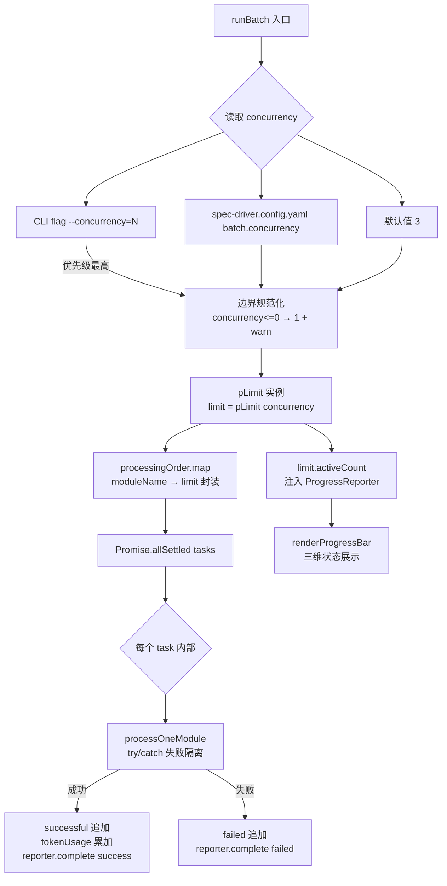
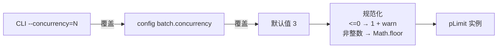

# 实施计划：LLM 并发优化器

**分支**: `146-llm-concurrency-optimizer` | **日期**: 2026-04-29 | **Spec**: [spec.md](./spec.md)
**输入**: Feature 146 规范 + tech-research.md + clarify.md（GATE_DESIGN 决议已固化）

---

## 摘要

Feature 146 是对 `src/batch/batch-orchestrator.ts` 中现有手写信号量并发控制的**重构与激活**，而非新增功能。核心工作包括：

1. 引入 `p-limit ^6.1.0` 替换约 30 行手写信号量代码（已有 `Promise.race([])` 死锁 bug 历史）
2. 将 `BatchOptions.concurrency` 默认值从 1 提升到 3
3. 在 `spec-driver.config.yaml` 新增 `batch.concurrency` 配置节
4. 在 CLI 新增 `--concurrency=N` flag（优先级：CLI > config > 默认值 3）
5. 扩展 `ProgressReporter` 支持「进行中」状态展示
6. 修复 `progressMode: 'silent'` 类型缺失（FR-012 可选项，随本次同步修复）
7. 新建 `tests/e2e/batch-concurrency.e2e.test.ts`，验证并发上限约束和错误隔离

整体复杂度 LOW：无新增模块，影响文件 ≤ 6，无数据迁移，无 API 契约破坏性变更。

---

## 技术上下文

**语言/版本**: TypeScript 5.x / Node.js 20.x（纯 ESM，`"type": "module"`）
**主要依赖**: `p-limit ^6.1.0`（新增）、`@anthropic-ai/sdk@0.39.0`（不改动）
**存储**: 不适用（无数据迁移，checkpoint 文件写入顺序不确定已记录为 TD-001）
**测试**: `vitest`（单元测试 + E2E），运行命令 `npx vitest run` / `npm run test:e2e`
**目标平台**: 本地开发 + CI 环境（Linux / macOS）
**并发模型**: JavaScript 单线程事件循环（`Promise`/`async-await` 协作式多任务），无操作系统级并发竞态
**新增依赖**: `p-limit@^6.1.0`——纯 ESM，~400B gzip，内置 TypeScript 类型，约 100M 周下载量；`vitest` 原生支持纯 ESM 依赖，无需额外配置

---

## Codebase Reality Check

本次直接修改的目标文件如下。数据基于当前 master 读取结果。

| 文件 | 行数（LOC） | 公开接口数 | 已知 Debt |
|------|------------|-----------|-----------|
| `src/batch/batch-orchestrator.ts` | ~1540 | 2（`runBatch`、`BatchOptions`） | 手写信号量 `Promise.race([])` 死锁历史（H2 注释，lines 920-951）；文件超大（>1500 行） |
| `src/batch/progress-reporter.ts` | ~260 | 3（`createReporter`、`writeSummaryLog`、`ProgressMode`） | `ProgressMode` 类型缺失 `'silent'` 值（TD-002）；`renderProgressBar` 只支持二维（已完成/总计） |
| `src/cli/`（CLI 入口文件，实现阶段确认具体路径） | 待确认 | `--concurrency` flag 尚不存在 | 无 |
| `tests/e2e/batch-pipeline.e2e.test.ts` | ~300（估算） | 4 个测试用例 | `progressMode: 'silent'` 类型不匹配（TD-002 来源） |
| `tests/e2e/batch-concurrency.e2e.test.ts` | 0（新建） | N/A | N/A |
| `package.json` | ~80 | `dependencies` 节 | 无 |
| `.specify/spec-driver.config.yaml` | 待确认 | `batch` 节不存在 | 无 |

**前置清理判定**：
- `batch-orchestrator.ts` LOC 约 1540 > 500 且本次新增约 10 行（p-limit 接入）。但净增量 < 50 行（替换 30 行手写信号量，实际行数可能减少）；债务注释（H2）数量为 1 个且与本次变更直接相关，替换后即消除。
- **结论**：不需要独立前置 cleanup task；p-limit 替换本身就是清理，在 Phase 1 步骤 3 中完成。

---

## Impact Assessment

| 评估维度 | 详情 |
|---------|------|
| 直接修改文件数 | 6（batch-orchestrator.ts、progress-reporter.ts、CLI 入口、package.json、spec-driver.config.yaml、新建 batch-concurrency.e2e.test.ts） |
| 间接受影响 | `tests/e2e/batch-pipeline.e2e.test.ts`（需确认 `progressMode:'silent'` 类型修复后是否需调整）；F144 E2E 4 个测试（默认值从 1→3，需锁定） |
| 跨包影响 | 无（所有改动在 `src/batch/`、`src/cli/`、`tests/` 范围内，不触及 `src/panoramic/`、`plugins/` 边界） |
| 数据迁移 | 无 |
| API/契约变更 | `BatchOptions.concurrency` 默认值从 1→3（向后兼容，非破坏性）；`ProgressMode` 类型新增 `'silent'`（向后兼容扩展）；`spec-driver.config.yaml` 新增 `batch.concurrency` 节（新增字段，不影响存量配置） |
| **风险等级** | **LOW**（影响文件 6 个，无跨包影响，无数据迁移，无公共 API 破坏性变更） |

**关键风险点与应对**：

**R1 — runBatch 签名语义不变**：`concurrency` 字段已存在于 `BatchOptions` 接口，本次仅改默认值注释，不新增必填参数。所有现有调用方（包括 F144 E2E）零改动即可运行，调用语义等同或更快。应对：实现前验证 `BatchOptions.concurrency` 字段类型签名不变；替换后运行 `npm run build` 确认零 TS 错误。

**R2 — p-limit 纯 ESM 在 vitest 运行时**：tech-research 已确认 vitest 原生支持纯 ESM，项目本身已是 `"type": "module"`。应对：实现后立即运行 `npx vitest run`，若出现 ESM 解析错误，检查 `vitest.config.ts` 的 `resolve.conditions` 是否含 `'import'`。

**R3 — 429/529 SDK 双层重试 9N 放大**：tech-research 已分析，`concurrency=3` 是有效的速率总闸。理论最差情况每模块 9 次 HTTP 请求（3 SDK × 3 应用层）。本次实施不主动节流，依赖 `concurrency` 限制总流量。plan 阶段决议：先观察，若实际触发大量 429 再做 follow-up Feature。FR-016 代码注释必须写明双层重试语义及 9N 上限。

**R4 — F144 E2E 默认值变更影响**：F144 的 `batch-pipeline.e2e.test.ts` 未显式传 `concurrency` 参数，升级后将以 `concurrency=3` 运行。由于 E2E 使用 `vi.mock` 模拟 LLM 调用（无真实网络延迟），并发与顺序在 mock 场景下行为等同，功能输出不受影响。应对：执行阶段必须先运行 F144 E2E 套件确认 4/4 通过；若发现时序敏感问题，在 `batch-pipeline.e2e.test.ts` 显式传入 `concurrency: 1` 锁定顺序路径。

---

## Constitution Check

| 原则 | 适用性 | 评估 | 说明 |
|------|-------|------|------|
| I. 双语文档规范 | 适用 | PASS | plan.md 中文散文 + 英文代码标识符；代码注释中文 |
| II. Spec-Driven Development | 适用 | PASS | 通过完整 spec→plan→tasks 流程，不直接改源代码 |
| III. YAGNI / 奥卡姆剃刀 | 适用 | PASS | 仅替换手写实现，不新增模块；`p-limit` 是有当前明确使用场景的最小外部依赖；P2 功能（进度展示、`'silent'` 类型）有 spec 依据，非假设性扩展 |
| IV. 诚实标注不确定性 | 适用 | PASS | CLI 入口文件路径标注为"实现阶段确认"，不猜测 |
| V. AST 精确性优先 | 不适用 | N/A | 本 Feature 不涉及 AST 解析或 Spec 生成逻辑 |
| VI. 混合分析流水线 | 不适用 | N/A | 本 Feature 不修改 LLM prompt 组装或 spec 生成流程 |
| VII. 只读安全性 | 适用 | PASS | `runBatch` 仅写入 `specs/` 和 `_meta/` 目录，并发控制不改变写入目标 |
| VIII. 纯 Node.js 生态 | 适用 | PASS | `p-limit` 属于 npm 生态，纯 ESM Node.js 包 |
| IX–XIV | 不适用 | N/A | spec-driver 插件内部约束，本 Feature 不修改 `plugins/spec-driver/` |
| XIII. 向后兼容 | 适用 | PASS | `runBatch` 签名不变；`concurrency` 默认值变更只加速，不改变功能输出；`ProgressMode` 新增 `'silent'` 是向后兼容扩展 |
| XIV. 可观测性与架构守护 | 适用 | PASS | `batch-orchestrator.ts` 行数已超 1500，但本次净增量为负（替换 30 行信号量为约 5 行 p-limit），不加剧劣化；代码注释增强可观测性（FR-008、FR-016） |

**Constitution Check 结论**：无 VIOLATION，无需豁免。

---

## 项目结构

### 本 Feature 制品

```text
specs/146-llm-concurrency-optimizer/
├── spec.md              # 需求规范（已完成）
├── clarify.md           # 澄清文档（已完成）
├── research/
│   └── tech-research.md # 技术调研（已完成）
├── plan.md              # 本文件
└── tasks.md             # Phase 2 输出（待生成）
```

### 源代码改动范围

```text
src/
├── batch/
│   ├── batch-orchestrator.ts   # 步骤 4 并发调度段重构（主要改动）
│   └── progress-reporter.ts    # ProgressMode 扩展 + renderProgressBar 增强
└── cli/
    └── <batch 命令入口>          # --concurrency flag 解析（具体文件实现阶段确认）

tests/
├── batch/
│   └── <相关单元测试>            # 并发上限单元测试（具体文件实现阶段确认）
└── e2e/
    ├── batch-pipeline.e2e.test.ts  # F144 已有（可能需微调 progressMode 类型修复）
    └── batch-concurrency.e2e.test.ts  # 新建（并发 E2E 测试）

package.json                    # 新增 p-limit ^6.1.0 到 dependencies
.specify/spec-driver.config.yaml # 新增 batch.concurrency 节
```

---

## 架构

### 并发调度重构示意



### 并发优先级决策链



---

## 实施阶段

### Phase 1：依赖与配置（前置，无风险）

**目标**：引入外部依赖，建立配置入口，不改动任何运行时逻辑。

**步骤 1.1 — 引入 p-limit 依赖**

修改文件：`package.json`

- 在 `dependencies` 节（非 `devDependencies`）新增 `"p-limit": "^6.1.0"`
- 安装后确认 `package-lock.json` 一并更新
- 验证：`node -e "import('p-limit').then(m => console.log(m.default.toString()))"` 可正常 import

**决策依据**：p-limit 在 `batch-orchestrator.ts` 运行时路径中被调用，属于生产依赖。clarify.md AU-002 已自动决议版本为 `^6.1.0`。

**步骤 1.2 — spec-driver.config.yaml 新增 batch.concurrency 节**

修改文件：`.specify/spec-driver.config.yaml`

新增配置节（位置：`batch` 顶层键，若已存在则在其下新增 `concurrency`）：

```yaml
batch:
  concurrency: 3  # 并发处理模块数上限（1=顺序，建议 3-5）
                  # CLI --concurrency=N 优先级高于此配置
                  # GATE_DESIGN 决议 C-001：配置位置确认为 spec-driver.config.yaml
```

**验证**：`cat .specify/spec-driver.config.yaml | grep -A2 'batch:'` 确认字段存在。

**步骤 1.3 — 确认 spec-driver.config.yaml schema 读取路径**

实现阶段在 CLI 入口文件和 `runBatch` 调用处确认 `spec-driver.config.yaml` 的读取逻辑（是否已有 config loader），确保新增的 `batch.concurrency` 字段能被读到。若读取逻辑不存在，在 CLI 入口补充。

---

### Phase 2：核心重构 — 替换手写信号量（最高优先级）

**目标**：用 `pLimit` 替换 `batch-orchestrator.ts` lines 920-951 的手写信号量，消除 `Promise.race([])` 死锁风险，同时修改默认值并更新注释。

**步骤 2.1 — 替换手写信号量**

修改文件：`src/batch/batch-orchestrator.ts`

在文件顶部添加 import：
```typescript
import pLimit from 'p-limit';
```

将步骤 4 并发调度段（lines 920-951）从当前的 `if (concurrency <= 1) { ... } else { 手写信号量 }` 结构替换为统一 `pLimit` 路径：

```typescript
// 步骤 4：并发调度（p-limit 统一路径，pLimit(1) 语义等同顺序执行）
// clarify.md AU-005：统一走 p-limit(1) 路径，移除 concurrency<=1 的独立 for-await 分支。
// pLimit(1) 保证顺序语义（队列串行），维护成本低于双路径。
const limit = pLimit(concurrency);
const tasks = processingOrder.map((moduleName) =>
  limit(() => processOneModule(moduleName))
);
await Promise.allSettled(tasks);
```

**关键点**：
- `Promise.allSettled` 保留（非 `Promise.all`），提供额外安全网（FR-007）
- 移除 `pending: Promise<void>[]`、手写 `activeCount`、`Promise.race` 相关代码（约 30 行）
- 净增量约 7 行（import 1 + pLimit 接入 6 行）

**步骤 2.2 — 修改默认值并强化注释**

在 `BatchOptions.concurrency` 字段的 JSDoc 注释中更新：

```typescript
/**
 * 并发处理的模块数上限（默认 3，顺序处理请传 1）。
 *
 * 默认值从 1 提升到 3（Feature 146）：Sonnet 单次调用 15-30s，
 * concurrency=3 时吞吐量显著提升且 429 风险可控（Anthropic RPM ~50-60）。
 *
 * 双层重试语义（FR-016）：
 * - SDK 层：maxRetries=2（含退避），处理单次请求级 429/529
 * - 应用层：maxRetries=3（模块级），处理更高层次的模块失败
 * - 理论最差情况：每模块 3×3=9 次 HTTP 请求（9N 放大）
 * - concurrency=3 作为速率总闸，限制总体并发流量
 *
 * 边界规范化（FR-002）：
 * - <=0 → 静默修正为 1 并输出 warn
 * - 非整数 → Math.floor 向下取整
 */
concurrency?: number;
```

**步骤 2.3 — 边界规范化逻辑**

在 `runBatch` 函数体内（读取 `concurrency` 的位置），添加规范化：

```typescript
// FR-002：边界规范化
let concurrency = Math.floor(options.concurrency ?? configConcurrency ?? 3);
if (concurrency <= 0) {
  logger.warn(`concurrency=${options.concurrency} 无效，修正为 1（顺序处理）`);
  concurrency = 1;
}
```

其中 `configConcurrency` 来自 Phase 3 步骤 3.1 的 config 读取。

---

### Phase 3：CLI flag 与配置读取

**目标**：暴露 `--concurrency=N` CLI flag，建立 CLI → config → 默认值的优先级链。

**步骤 3.1 — CLI 参数解析**

修改文件：CLI 入口文件（`src/cli/` 下，实现阶段读取具体路径确认）

添加 `--concurrency` 参数解析：
- 支持 `--concurrency=N` 和 `--concurrency N` 两种语法
- 类型为 `number`，传入前执行 `parseInt`，非数字字符给出明确错误提示
- 解析后传入 `BatchOptions.concurrency`

**步骤 3.2 — config.yaml 读取逻辑**

在 CLI 入口的 `runBatch` 调用处，读取 `spec-driver.config.yaml` 的 `batch.concurrency` 字段：
- 若 CLI flag 已传入 `--concurrency`，忽略 config 值
- 若 CLI flag 未传，读取 config `batch.concurrency`（若存在且为有效整数）
- 若 config 也未配置，使用代码默认值 3

**优先级链**（明确文档化在 config 加载注释中）：
```
CLI --concurrency=N > spec-driver.config.yaml batch.concurrency > 默认值 3
```

---

### Phase 4：Progress 集成与类型修复

**目标**：扩展进度展示支持「进行中」状态；修复 `progressMode: 'silent'` 类型 mismatch。

**步骤 4.1 — ProgressMode 类型扩展**

修改文件：`src/batch/progress-reporter.ts`

```typescript
// 修复 TD-002（FR-012 可选项，随本次同步修复）
export type ProgressMode = 'tty' | 'pipe' | 'silent';
```

扩展 `createReporter` 工厂函数，新增 `'silent'` 模式处理：当 `effectiveMode === 'silent'` 时，返回所有方法为 no-op 的 reporter（`start`/`stage`/`complete` 不输出任何内容，`finish` 返回最小化 `BatchSummary`）。

**步骤 4.2 — renderProgressBar 增强（FR-010）**

修改文件：`src/batch/progress-reporter.ts`

将 `renderProgressBar` 签名从 `(completed, total)` 扩展为 `(completed, total, active = 0)`：

```typescript
function renderProgressBar(completed: number, total: number, active: number = 0): string {
  const percent = total > 0 ? completed / total : 0;
  const barWidth = 20;
  const filled = Math.floor(percent * barWidth);
  const bar = '='.repeat(filled).padEnd(barWidth, ' ');
  const queued = Math.max(0, total - completed - active);
  // active > 0 时展示三维状态；active = 0 时降级为原始二维格式（向后兼容）
  if (active > 0) {
    return `[${bar}] ${completed}/${total} | 进行中: ${active} | 排队: ${queued}`;
  }
  return `[${bar}] ${completed}/${total}`;
}
```

**步骤 4.3 — 注入 limit.activeCount 到 ProgressReporter**

修改文件：`src/batch/batch-orchestrator.ts`

在 TTY 模式的进度渲染调用处（`renderProgressBar` 被调用的位置），将 `limit.activeCount` 传入：

```typescript
// FR-011：不修改 ProgressReporter 接口签名
// 通过在渲染时读取 limit.activeCount，注入「进行中」维度
process.stdout.write(`\x1b[2K\r${renderProgressBar(completed, total, limit.activeCount)}`);
```

**注意**：`renderProgressBar` 是 `progress-reporter.ts` 内部函数，不在 `ProgressReporter` 接口上。注入 `activeCount` 需要考虑作用域——若 `renderProgressBar` 在 reporter 闭包外调用，可选方案为：在 `createReporter` 工厂函数中接受一个可选的 `getActiveCount: () => number` getter 参数，TTY 模式下使用该 getter 获取实时 `activeCount`。具体实现方式在 implement 阶段根据代码实际结构确认（FR-011 约定不修改 `ProgressReporter` 接口本身）。

---

### Phase 5：测试

**目标**：新建 E2E 测试验证并发约束，补充关键单元测试，确保全量测试零回归。

**步骤 5.1 — 新建并发 E2E 测试**

新建文件：`tests/e2e/batch-concurrency.e2e.test.ts`

测试场景（参考 tech-research Q6 代码示例）：

| 测试用例 | 验证内容 | 断言 |
|---------|---------|------|
| 并发上限严格执行 | `concurrency=3`，10 个模块，每个 mock LLM 延迟 20ms | `maxConcurrentCalls ≤ 3` 且 `> 1`（确认并发真的触发）|
| 单模块失败不阻塞 | 6 个模块，第 2 个 mock 抛出 `Error('Network error')` | `result.failed.length === 1`，`result.successful.length === 5` |
| tokenUsage 累加正确性 | 10 个模块各返回 `input_tokens: 100`，`concurrency=3` | `costSummary.totalInputTokens === 1000`（严格相等，clarify.md AU-006） |
| 并行加速（SC-006） | 每个模块 mock 延迟 100ms，10 个模块，`concurrency=3` | 总耗时 `< 700ms` |

**fixture 要求**：需要至少 10 个模块的 fixture 目录（`concurrency=3` 时至少 4 批次才能充分测试并发上限）。可扩展现有 `tests/fixtures/e2e/small-ts-project/` 或新建专属 `tests/fixtures/e2e/concurrency-test-project/`，具体在 implement 阶段确认。

**关键 mock 模式**（沿用 F144 E2E 的 `vi.hoisted()` + `vi.mock('@anthropic-ai/sdk')` 模式）：

```typescript
// 并发计数器（通过闭包暴露，非共享状态）
const mocks = vi.hoisted(() => {
  let concurrentCalls = 0;
  let maxConcurrentCalls = 0;
  // ... mockCreate 定义
  return { mockCreate, getConcurrencyMetrics: () => ({ maxConcurrentCalls }) };
});
```

**步骤 5.2 — 单元测试：边界规范化**

在 `tests/batch/`（具体文件实现阶段确认）新增测试用例：

| 测试用例 | 输入 | 预期行为 |
|---------|------|---------|
| `concurrency=0` 规范化 | `options.concurrency = 0` | 修正为 1，logger.warn 被调用 |
| `concurrency=-1` 规范化 | `options.concurrency = -1` | 修正为 1，logger.warn 被调用 |
| `concurrency=3.7` 取整 | `options.concurrency = 3.7` | `Math.floor` 后为 3 |
| `concurrency > moduleCount` | `concurrency=50`，3 个模块 | 正常运行，不报错（p-limit 内部处理） |

**步骤 5.3 — 回归验证**

- 运行 `npx vitest run`：测试通过数 ≥ 2268，零失败（SC-008）
- 运行 `npm run test:e2e`：F144 E2E 4/4 通过（SC-007）
- 运行 `npm run build`：TypeScript 编译零错误（SC-009）

---

## 测试策略

### 单元测试（快速反馈层）

- **测试目标**：`concurrency` 边界规范化逻辑、`ProgressMode: 'silent'` 行为
- **mock 策略**：mock `processOneModule`（函数级 stub），不启动完整 pipeline
- **运行时间要求**：单个测试 < 50ms

### E2E 测试（集成验证层）

- **测试目标**：并发上限约束、错误隔离、tokenUsage 累加、并行加速效果
- **mock 策略**：`vi.mock('@anthropic-ai/sdk')` 模块级拦截，使用真实 `runBatch` 代码路径
- **时序控制**：`mockCreate` 内 `setTimeout(r, 20)` 人为延迟制造并发重叠窗口
- **fixture 规模**：≥ 10 个模块（确保 `concurrency=3` 触发多批次调度）
- **运行时间预算**：单个 E2E 文件 < 10s

### 回归保护策略

- F144 `batch-pipeline.e2e.test.ts` 4 个现有测试不改动（`progressMode: 'silent'` 类型修复后不影响行为语义）
- 若 F144 E2E 出现时序相关失败，在该文件显式传入 `concurrency: 1` 锁定顺序路径（不改变测试意图）
- tokenUsage 累加的正确性通过严格相等断言（`=== 1000`）验证，不接受模糊误差范围

---

## 回滚方案

Feature 146 的改动范围小、可独立 revert：

1. **p-limit 依赖**：从 `package.json` 移除 `p-limit`，还原 `package-lock.json`
2. **手写信号量恢复**：git revert `batch-orchestrator.ts` 的步骤 4 改动（约 10 行 import + pLimit 接入 → 还原约 30 行手写信号量），默认值从 3 改回 1
3. **config.yaml 恢复**：移除 `batch.concurrency` 节
4. **CLI flag 移除**：revert CLI 参数解析代码
5. **ProgressMode 类型还原**：revert `'silent'` 扩展（测试文件中 `progressMode: 'silent'` 重新产生类型错误，可用 `@ts-expect-error` 临时规避）

回滚后运行 `npx vitest run` 和 `npm run test:e2e` 确认 F144 测试恢复原状。

---

## 复杂度追踪

| 决策 | 选择 | 简单替代方案 | 简单方案被拒绝的原因 |
|------|------|------------|-------------------|
| 引入 p-limit 而非修复手写信号量 | 引入 p-limit | 修复手写信号量 `Promise.race([])` 边界 | 手写实现已有 bug 历史（H2 修复注释），边界情况难以穷举；p-limit 100M 周下载提供生产验证；替换净增约 7 行，维护成本远低于修复 |
| 统一走 `pLimit(1)` 移除顺序分支 | 统一路径 | 保留 `if (concurrency <= 1) for-await` 分支 | clarify.md AU-005 已确认 `pLimit(1)` 语义等同顺序执行；双路径维护成本高；移除分支更符合 YAGNI 原则 |
| `progressMode: 'silent'` 同步修复 | 同步修复 | 留作独立 Feature | TD-002 是现有 E2E 测试的类型错误，本次修复 ProgressMode 时顺手修复，变更成本接近零；推迟会导致 E2E 长期带 `@ts-ignore` |
| 新建独立 E2E 文件而非扩展 F144 | 新建文件 | 在 `batch-pipeline.e2e.test.ts` 追加 describe | spec DQ4 已决议（独立文件，关注点隔离，不增加 F144 运行时间）；并发测试需要特殊 mock 时序控制，与 F144 的 `beforeAll` 逻辑独立更清晰 |

---

## 制品清单

本 plan 阶段产出：

| 制品 | 路径 | 状态 |
|------|------|------|
| 实施计划 | `specs/146-llm-concurrency-optimizer/plan.md` | 本文件，完成 |
| 技术调研 | `specs/146-llm-concurrency-optimizer/research/tech-research.md` | 已存在，完成 |
| 澄清文档 | `specs/146-llm-concurrency-optimizer/clarify.md` | 已存在，完成 |
| 任务清单 | `specs/146-llm-concurrency-optimizer/tasks.md` | 待 tasks 阶段生成 |

**注**：本 Feature 无新的数据模型变更（`BatchOptions.concurrency` 字段已存在），无需单独生成 `data-model.md`。无新的 API 契约文件（接口不变），无需 `contracts/`。无需 `quickstart.md`（并发仅通过 CLI flag 或 config 启用，使用方式已在 spec.md User Story 1 中完整描述）。
