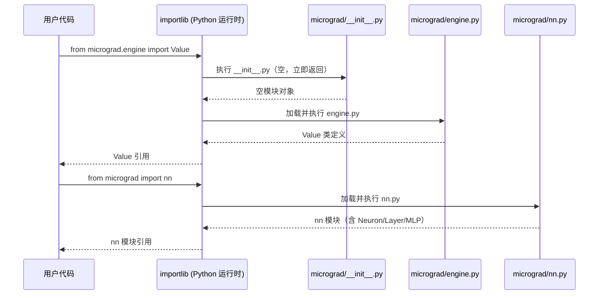
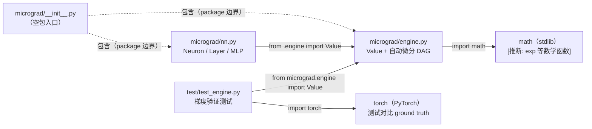

<a id="module-spec"></a>

# __init__.py

<!-- cross-reference-index: auto generatedAt=2026-04-30T07:57:06.444Z same=0 cross=0 -->

## 相关 Spec

当前模块暂无可自动归档的相关 Spec 链接。


## 1. 意图

这个模块（`micrograd/__init__.py`）将 `micrograd` 目录标记为 Python 包，使 `micrograd.engine` 和 `micrograd.nn` 两个子模块可被外部导入，同时刻意保持空文件以不污染包命名空间。

核心职责：

1. **包声明**：向 Python 模块系统声明 `micrograd` 是一个可安装、可导入的 package（`micrograd/__init__.py` 存在即为 package 边界）
2. **子模块路由**：允许用户通过 `from micrograd.engine import Value` 和 `from micrograd import nn` 两种路径访问引擎与神经网络 API，路由由 Python 运行时隐式完成
3. **命名空间隔离**：文件内容为空（0 行），不将任何子模块符号提升到 `micrograd.*` 顶层命名空间，迫使用户显式引用子模块路径
4. **安装入口点**：配合 `setup.py` / `pyproject.toml`，使 `pip install micrograd` 能将该包注册到 site-packages，`__init__.py` 是 pip 识别 package 结构的必要条件

该模块在系统中的定位：纯粹的包结构声明层，不承载任何业务逻辑，是 `engine.py`（~100 行）和 `nn.py`（~50 行）两个核心模块的入口锚点。

---

## 2. 业务逻辑

由于 `__init__.py` 文件内容为空（0 行），本模块**无运行时业务逻辑**。但其存在触发了以下 Python 包系统的隐式处理管线：

**阶段 1 — 包发现**（Python import machinery in `importlib`）：当解释器遇到 `import micrograd` 或 `from micrograd.engine import Value` 时，首先在 `sys.path` 上定位 `micrograd/` 目录，确认 `__init__.py` 存在后将其标记为 package 根。输入：`sys.path` + 目录结构；输出：`sys.modules['micrograd']` 条目被创建。特殊处理：若 `__init__.py` 不存在，Python 3.3+ 会降级为 namespace package（无 `__file__` 属性），行为略有不同 [推断: 基于 PEP 420 / PEP 328 规范]

**阶段 2 — __init__ 执行**（Python interpreter）：解释器执行 `__init__.py` 内容。当前文件为空，执行时间为 O(1)，不产生任何副作用。输入：空文本；输出：`micrograd` 模块对象的 `__dict__` 仅含 `__name__`, `__file__`, `__path__`, `__package__`, `__spec__` 等元属性。特殊处理：无用户定义属性，`dir(micrograd)` 返回最小集合

**阶段 3 — 子模块延迟加载**（Python import machinery）：用户实际使用时才触发子模块加载。`from micrograd.engine import Value` 触发 `engine.py` 解析；`from micrograd import nn` 触发 `nn.py` 解析。两个子模块独立加载，互不依赖 [推断: 基于 README 示例和标准 Python 子模块机制]。输入：import 语句；输出：`Value` 类和 `nn` 模块引用。

```mermaid
flowchart TD
    A[用户执行 import / from micrograd] --> B{import machinery\n扫描 sys.path}
    B --> C[定位 micrograd/ 目录]
    C --> D{__init__.py 存在?}
    D -- 是 --> E[创建 package 对象\nsys.modules['micrograd']]
    D -- 否 --> F[降级: namespace package\n无 __file__]
    E --> G[执行 __init__.py\n空文件 → 无副作用]
    G --> H{访问子模块?}
    H -- engine --> I[加载 micrograd/engine.py\n定义 Value 类]
    H -- nn --> J[加载 micrograd/nn.py\n定义 Neuron/Layer/MLP]
    I --> K[用户获得 Value 引用]
    J --> L[用户获得 nn 模块引用]
```



| 子系统 | 文件 | 功能 |
|--------|------|------|
| 自动微分引擎 | `micrograd/engine.py` | `Value` 类：标量前向计算 + 反向传播 DAG |
| 神经网络层 | `micrograd/nn.py` | `Neuron`, `Layer`, `MLP`：PyTorch-like 神经网络 API |
| 包入口 | `micrograd/__init__.py` | 空文件，包声明 |

---

## 3. 接口定义

由于 `__init__.py` 为空（0 行），**不存在任何公开导出符号**。AST 解析结果为空集，以下为诚实标注：

| 名称 | 类型 | 签名 | 说明 |
|------|------|------|------|
| （无） | — | — | `__init__.py` 文件为空，未定义任何函数、类或 `__all__`，`dir(micrograd)` 仅返回 Python 内置元属性 |

[推断: 如果未来维护者希望提供便捷导入，可能会在此文件添加 `from micrograd.engine import Value` 和 `from micrograd.nn import MLP` 等提升语句，但当前 AST 数据不支持此推断，此处仅作设计建议]

---


## 4. 数据结构

`__init__.py` 本身不定义任何数据结构。以下为包级别隐式创建的运行时对象（由 Python import machinery 生成）：

```python
# Python 运行时为每个 package 自动创建以下元属性（非用户定义）
micrograd.__name__    # str: "micrograd"
micrograd.__file__    # str: 绝对路径到 __init__.py
micrograd.__path__    # list[str]: ["/path/to/micrograd/"]，package 子模块搜索路径
micrograd.__package__ # str: "micrograd"
micrograd.__spec__    # ModuleSpec: importlib 内部规格对象
```

| 字段 | 类型 | 说明 |
|------|------|------|
| `__name__` | `str` | 模块全限定名，值为 `"micrograd"` |
| `__file__` | `str` | `__init__.py` 的绝对文件路径 |
| `__path__` | `list[str]` | 子模块搜索路径列表，使 `micrograd.engine` 可被发现 |
| `__package__` | `str` | 所属包名，与 `__name__` 相同（顶级 package） |
| `__spec__` | `ModuleSpec` | importlib 内部模块规格，含 loader 信息 |

---

## 5. 约束条件

| 约束 | 值 | 说明 |
|------|----|------|
| Python 版本要求 | ≥ 3.x | `__init__.py` 空文件在 Python 2 也有效，但 `engine.py` / `nn.py` 的 f-string 语法要求 Python 3.6+ [推断: 基于 README 未指定版本，但 f-string 是已知事实] |
| 文件内容 | 0 字节 | 当前文件严格为空，不含任何 import、赋值或 `__all__` 定义 |
| 命名空间暴露 | 0 个符号 | 不主动提升任何子模块符号到 `micrograd.*` 顶层，用户必须显式引用子路径 |
| 循环导入风险 | 无 | 空文件消除了 `__init__.py` 引入循环导入的可能性 |
| 包名唯一性 | `micrograd` | PyPI 已注册 `micrograd`，本地 `pip install -e .` 会与已安装版本冲突 [推断: 基于 README 的 pip install 说明] |

---

## 6. 边界条件

- **场景**: 在未安装 `micrograd` 的环境中 `import micrograd`：抛出 `ModuleNotFoundError: No module named 'micrograd'`，无降级行为
- **场景**: `micrograd/` 目录存在但 `__init__.py` 缺失（Python 3.3+）：Python 自动降级为 namespace package，`__path__` 仍然有效，子模块仍可导入，但 `__file__` 为 `None`，部分反射代码会异常
- **场景**: 同时安装了 PyPI 版本和本地 `-e` 开发版本：`sys.path` 顺序决定哪个版本被加载，可能导致版本混淆，`pip show micrograd` 只显示一个版本
- **场景**: 在 `__init__.py` 为空时尝试 `from micrograd import Value`（不指定子模块）：抛出 `ImportError: cannot import name 'Value' from 'micrograd'`，因为 `Value` 未被提升到顶层命名空间
- **场景**: 多线程并发首次 `import micrograd`：Python GIL 保证 `import` 是线程安全的，`sys.modules` 有内置锁机制，不存在竞争条件
- **场景**: 重复 `import micrograd`：第二次直接从 `sys.modules` 缓存返回，`__init__.py` 不会被重复执行

---

## 7. 技术债务

| 项目 | 严重程度 | 描述 |
|------|----------|------|
| 无顶层便捷导入 | 低 | 用户必须写 `from micrograd.engine import Value` 而非 `from micrograd import Value`；对教学项目影响轻微，但 API 人体工学略差。修复：添加 `from .engine import Value` 和 `from . import nn` |
| 无 `__version__` 定义 | 低 | `micrograd.__version__` 不可用，`importlib.metadata.version('micrograd')` 是替代方案，但需要安装。修复：添加 `__version__ = "0.0.1"` 或使用 `importlib.metadata` |
| 无 `__all__` 声明 | 低 | 未来若添加导入语句，`from micrograd import *` 行为不可预测。修复：显式声明 `__all__` |
| 无类型存根（.pyi） | 低 | IDE 类型检查器无法通过 `import micrograd` 获得类型信息，仅通过子模块路径可获得。对教学项目影响有限，生产使用时影响 DX |

---

## 8. 测试覆盖

**已有测试文件**：`test/test_engine.py`（2 个测试函数）

| 测试函数 | 覆盖模块 | 覆盖内容 |
|----------|----------|----------|
| `test_sanity_check` | `micrograd.engine` | [推断: 基本 Value 运算的前向传播和梯度计算正确性，与 PyTorch 对比验证] |
| `test_more_ops` | `micrograd.engine` | [推断: 更多算子（`relu`, `**`, `/` 等）的梯度验证，PyTorch 作为 ground truth] |

**`__init__.py` 的测试覆盖**：

当前测试套件**未直接测试 `__init__.py`**，但其功能（包声明）通过所有测试的 `import` 语句隐式验证。任何 `from micrograd.engine import Value` 成功执行即证明 `__init__.py` 正常工作。

**建议补充的测试用例**：

```python
# 建议添加到 test/test_package.py
def test_package_importable():
    """验证 micrograd 作为包可被导入"""
    import micrograd
    assert micrograd.__name__ == "micrograd"

def test_submodule_engine_accessible():
    """验证 engine 子模块可通过包路径访问"""
    from micrograd.engine import Value
    assert callable(Value)

def test_submodule_nn_accessible():
    """验证 nn 子模块可通过包路径访问"""
    from micrograd import nn
    assert hasattr(nn, 'Neuron')

def test_no_toplevel_value_export():
    """验证 Value 未被提升到顶层（当前设计）"""
    import micrograd
    assert not hasattr(micrograd, 'Value')
```

**尚未覆盖的关键路径**：`nn.py` 的 `Neuron`、`Layer`、`MLP` 类的前向传播和梯度链路（`test_engine.py` 仅测试 `engine.py`）；SGD 训练循环的数值稳定性。

---

## 9. 依赖关系

`__init__.py` 本身无任何 `import` 语句（文件为空），但作为包根节点，在逻辑上是两个子模块的父容器：



**外部依赖**：

| 依赖 | 类型 | 用途 |
|------|------|------|
| Python 标准库 `math` | 内置模块 | [推断: `engine.py` 中 `exp`、`log` 等激活函数实现] |
| `torch`（PyTorch） | 第三方包（测试用） | `test_engine.py` 用作梯度计算的参考实现（ground truth） |
| `pytest` | 第三方包（测试用） | 测试运行框架 |

**内部依赖链**：`micrograd/__init__.py`（空）→ `micrograd/engine.py`（Value 标量引擎）← `micrograd/nn.py`（神经网络层，导入 Value）

---

## 附录：文件清单

| 文件 | 行数 | 主要用途 |
|------|------|----------|
| `__init__.py` | 0 | 内部模块 |


<!-- baseline-skeleton: {"filePath":"micrograd/__init__.py","language":"python","loc":0,"exports":[],"imports":[],"hash":"e3b0c44298fc1c149afbf4c8996fb92427ae41e4649b934ca495991b7852b855","analyzedAt":"2026-04-30T07:54:21.728Z","parserUsed":"tree-sitter"} -->
