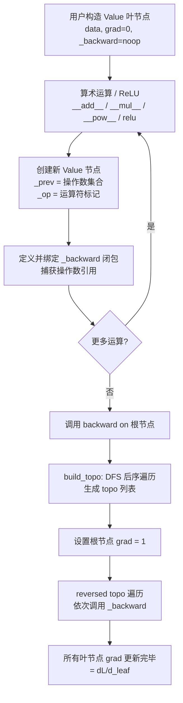
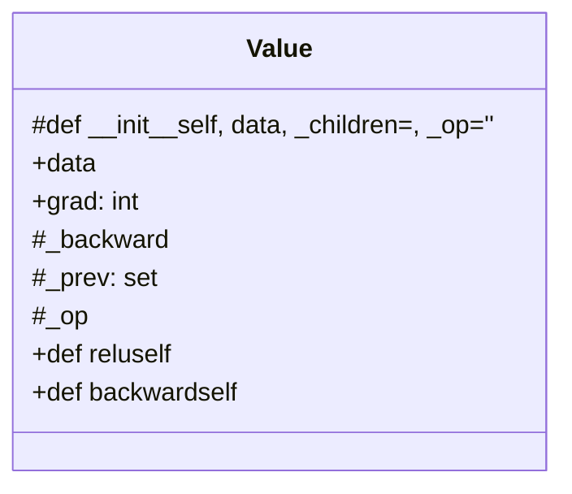
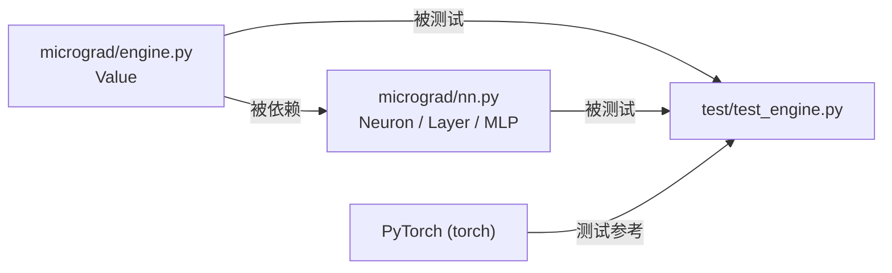
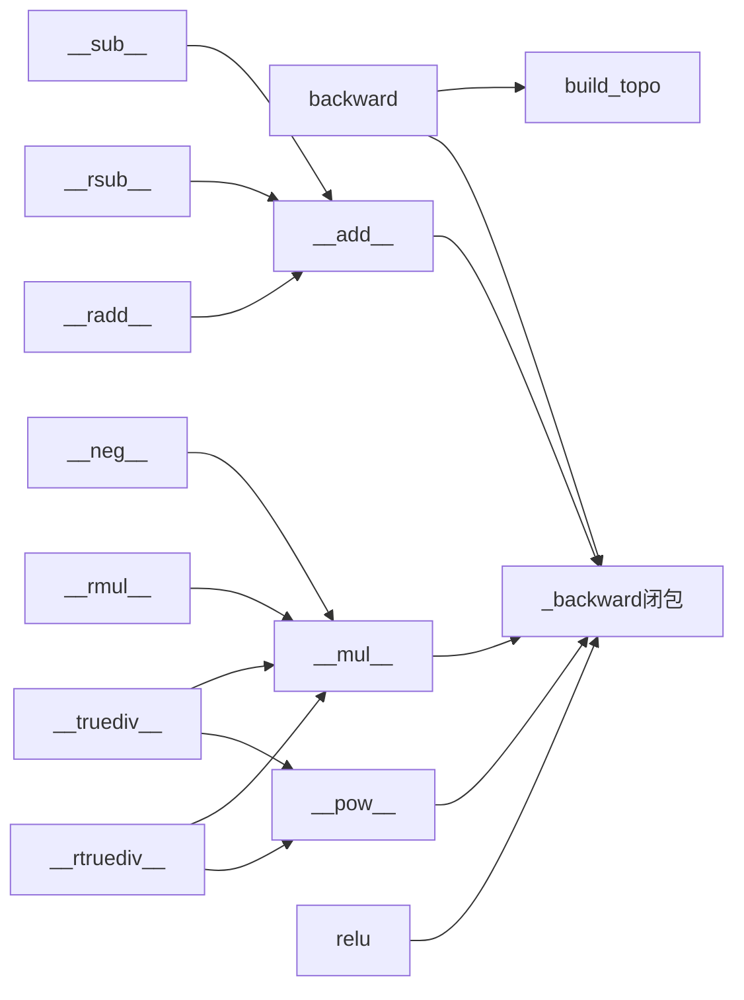

<a id="module-spec"></a>

# engine.py

<!-- cross-reference-index: auto generatedAt=2026-04-30T07:57:06.444Z same=0 cross=0 -->

## 相关 Spec

当前模块暂无可自动归档的相关 Spec 链接。


## 1. 意图

这个模块将标量数值包装为**可微分计算节点**，使得任意由加减乘除、幂运算和 ReLU 组成的表达式都能自动计算梯度，从而支撑神经网络的反向传播训练。

1. **构建动态计算图（DAG）**：每次算术运算都在 `__add__`、`__mul__`、`__pow__`、`relu` 中创建新的 `Value` 节点，并通过 `_prev`（子节点集合）和 `_op`（操作符标记）记录计算历史——定义于 `engine.py:Value.__init__`
2. **延迟绑定反向传播函数**：每个运算符重载方法内部定义 `_backward` 闭包，捕获操作数引用，在运算时绑定链式法则（chain rule）计算逻辑——定义于 `engine.py:__add__`、`__mul__`、`__pow__`、`relu`
3. **全图梯度反向传播**：`backward()` 通过 DFS 拓扑排序整个 DAG，然后按逆拓扑序依次调用每个节点的 `_backward`，将梯度从输出节点向输入节点累积——定义于 `engine.py:Value.backward`
4. **完整算术运算符生态**：通过 Python 魔术方法（`__neg__`、`__radd__`、`__rsub__`、`__rmul__`、`__truediv__`、`__rtruediv__`）将 Python 原生运算符与 `Value` 节点的运算统一——定义于 `engine.py:Value` 第 76–94 行
5. **调试与可视化支持**：`_op` 字段记录产生该节点的操作符，供外部 `graphviz` 可视化工具（如 `trace_graph.ipynb` 中的 `draw_dot`）渲染计算图时使用

---

## 2. 业务逻辑

**阶段 1 — 节点初始化**（`__init__()` in `engine.py:4-10`）：接收标量 `data`（`float` 或 `int`），初始化 `grad=0`，`_backward=lambda: None`（空操作），`_prev=set(_children)`（接收父算子传入的子节点元组转集合），`_op=''`（叶节点无操作符）。叶节点调用时 `_children` 和 `_op` 均取默认值，形成 DAG 的叶子。

**阶段 2 — 前向运算 / 图构建**（`__add__`、`__mul__`、`__pow__` in `engine.py:12-47`）：每次二元运算都执行三步：① 若操作数非 `Value` 则自动提升（`Value(other)`）；② 计算标量结果并创建新 `Value` 节点，将当前操作数作为 `_children` 传入；③ 定义 `_backward` 闭包并赋给 `out._backward`——闭包通过 **`+=`（梯度累积）** 而非赋值实现链式法则，避免多路输出（一个节点被多个上层节点使用）时梯度被覆盖。加法梯度：两操作数各继承上游梯度（`∂out/∂self = 1`）；乘法梯度：交叉乘（`∂out/∂self = other.data`）；幂运算梯度：`other * self.data**(other-1)`。

**阶段 3 — ReLU 激活**（`relu()` in `engine.py:49-55`）：若 `self.data < 0` 输出 `0`，否则透传 `self.data`，操作符标记为 `'ReLU'`。其 `_backward` 闭包实现阶梯函数导数：`(out.data > 0) * out.grad`，即输入为正时梯度透传，为负时梯度截断为 0。这是 `__pow__` 无法表达的非多项式激活，需独立实现。

**阶段 4 — 反向传播**（`backward()` in `engine.py:57-71`）：
- **步骤 4a — 拓扑排序**：内部嵌套函数 `build_topo(v)` 执行 DFS，借助 `visited` 集合去重，将节点按**后序（post-order）**追加到 `topo` 列表，最终 `topo` 中父节点排在子节点之后。
- **步骤 4b — 梯度反传**：设置根节点 `self.grad = 1`（$\frac{\partial L}{\partial L} = 1$），然后以 `reversed(topo)` 遍历（即从根到叶），依次调用每个节点的 `_backward()`，通过 `+=` 累积梯度，最终所有叶节点的 `grad` 存储 $\frac{\partial L}{\partial \text{leaf}}$。

**阶段 5 — 算术语法糖（反向运算符）**（`engine.py:73-94`）：Python 在左操作数不支持该运算时调用右操作数的 `__radd__`/`__rmul__`/`__rsub__`/`__rtruediv__`，这些方法全部委托给已实现的正向运算符（如 `__radd__` 委托 `self + other`），使得 `3.0 + Value(1.0)` 等混合运算透明支持。`__neg__`、`__sub__`、`__truediv__` 则分别通过 `self * -1`、`self + (-other)`、`self * other**-1` 转化为已有原语，**不引入新的 `_backward` 逻辑**，保持代码最小化。



```mermaid
sequenceDiagram
    participant 用户
    participant Value as Value 节点
    participant 闭包 as _backward 闭包

    用户->>Value: a = Value(-4.0)
    用户->>Value: b = Value(2.0)
    用户->>Value: c = a + b  →  __add__
    Value->>Value: 创建 out, 绑定 _backward 到 out
    用户->>Value: g.backward()
    Value->>Value: build_topo(g) → topo=[a,b,...,g]
    loop reversed(topo)
        Value->>闭包: v._backward()
        闭包->>Value: self.grad += ...; other.grad += ...
    end
    用户->>Value: a.grad, b.grad (读取结果)
```

| 子系统 | 文件 | 功能 |
|--------|------|------|
| 前向运算核 | `engine.py:12-55` | 算术运算 + ReLU，构建 DAG 并绑定反向闭包 |
| 拓扑排序器 | `engine.py:59-67` | DFS 后序遍历，建立反传顺序 |
| 梯度反传器 | `engine.py:68-70` | 按逆拓扑序累积梯度 |
| 语法糖层 | `engine.py:73-94` | 反向运算符 + 派生运算符，委托给核心原语 |

---

## 3. 接口定义

| 名称 | 类型 | 签名 | 说明 |
|------|------|------|------|
| `Value` | class | `Value(data, _children=(), _op='')` | 核心可微分标量节点，`data` 为标量值，`_children` 为产生该节点的操作数元组，`_op` 为操作符字符串（仅调试用）。叶节点直接调用，中间节点由运算符方法内部创建 |
| `Value.__add__` | method | `(self, other) -> Value` | 实现 `self + other`；若 `other` 非 `Value` 自动提升；梯度：两端均 `+= out.grad` |
| `Value.__mul__` | method | `(self, other) -> Value` | 实现 `self * other`；梯度：交叉乘法则 |
| `Value.__pow__` | method | `(self, other: int \| float) -> Value` | 实现 `self ** other`；仅支持数值幂（assert 保证）；梯度：幂函数导数 |
| `Value.relu` | method | `(self) -> Value` | ReLU 激活：`max(0, self.data)`；梯度：阶梯函数，正值透传，非正截断 |
| `Value.backward` | method | `(self) -> None` | 从当前节点触发全图反向传播；设根节点 `grad=1` 后按逆拓扑序累积梯度至所有叶节点 |
| `Value.__neg__` | method | `(self) -> Value` | 取负：委托 `self * -1` |
| `Value.__radd__` | method | `(self, other) -> Value` | `other + self`（Python 右加）；委托 `self + other` |
| `Value.__sub__` | method | `(self, other) -> Value` | `self - other`；委托 `self + (-other)` |
| `Value.__rsub__` | method | `(self, other) -> Value` | `other - self`；委托 `other + (-self)` |
| `Value.__rmul__` | method | `(self, other) -> Value` | `other * self`；委托 `self * other` |
| `Value.__truediv__` | method | `(self, other) -> Value` | `self / other`；委托 `self * other**-1` |
| `Value.__rtruediv__` | method | `(self, other) -> Value` | `other / self`；委托 `other * self**-1` |
| `Value.__repr__` | method | `(self) -> str` | 返回 `"Value(data=..., grad=...)"` 字符串，供调试输出 |

---

---

### 完整接口参考（AST 精确提取）

### engine.py

| 名称 | 类型 | 签名 | 成员数 |
|------|------|------|--------|
| `Value` | class | `class Value` | 8 |

**Value 成员**

| 成员 | 类型 | 签名 | 可见性 |
|------|------|------|--------|
| `__init__` | method | `def __init__(self, data, _children=(), _op='')` | protected |
| `data` | property | `data` | public |
| `grad` | property | `grad: int` | public |
| `_backward` | property | `_backward` | protected |
| `_prev` | property | `_prev: set` | protected |
| `_op` | property | `_op` | protected |
| `relu` | method | `def relu(self)` | public |
| `backward` | method | `def backward(self)` | public |

### 模块类图




## 4. 数据结构

```python
class Value:
    data: float | int        # 该节点存储的标量前向值
    grad: int                # 该节点对应的梯度（默认 0，backward 后填充）
    _backward: Callable      # 反传函数，默认 lambda: None，运算时被替换为闭包
    _prev: set[Value]        # 直接前驱节点集合（生成该节点的操作数）
    _op: str                 # 产生该节点的操作符（如 '+'、'*'、'ReLU'），空串表示叶节点
```

| 字段 | 类型 | 说明 |
|------|------|------|
| `data` | `float \| int` | 前向传播的标量值，由构造函数或运算结果写入 |
| `grad` | `int`（实际运行时为 `float`）[推断: 初始化为整数 0，但 backward 后会被 float 累积覆盖] | 损失对该节点的梯度，`backward()` 调用前为 0 |
| `_backward` | `Callable[[], None]` | 闭包，封装链式法则计算，操作符方法创建时绑定；叶节点为空操作 |
| `_prev` | `set[Value]` | DAG 的入边集合，用于拓扑排序；叶节点为空集 |
| `_op` | `str` | 操作符标记，空串=叶节点，`'+'`/`'*'`/`'**N'`/`'ReLU'` 为中间节点 |

---

---

### 完整字段定义（AST 精确提取）

#### `Value` (class) — engine.py

**字段**

| 字段名 | 类型/签名 | 可见性 |
|--------|-----------|--------|
| `data` | `data` | public |
| `grad` | `grad: int` | public |
| `_backward` | `_backward` | protected |
| `_prev` | `_prev: set` | protected |
| `_op` | `_op` | protected |

**方法**

| 方法名 | 签名 | 可见性 |
|--------|------|--------|
| `__init__` | `def __init__(self, data, _children=(), _op='')` | protected |
| `relu` | `def relu(self)` | public |
| `backward` | `def backward(self)` | public |

## 5. 约束条件

| 约束 | 值 | 说明 |
|------|-----|------|
| 幂运算操作数类型 | `int \| float` | `__pow__` 中 `assert isinstance(other, (int, float))`，传入 `Value` 会引发 `AssertionError` |
| 标量精度 | Python `float`（IEEE 754 双精度）| 所有运算均为标量，无向量化，精度上限由 Python float 决定 |
| 梯度初始值 | `grad = 0`（整型）| 初始化为整数 0，backward 后实际存储 float；类型注解 `grad: int` 不准确 [推断: 原作者未加类型注解细化] |
| DAG 无环假设 | 隐式 | `build_topo` 依赖 `visited` 去重，但不检测环路；若构造含环图会导致无限递归 |
| `backward()` 从单根调用 | 惯例约束 | 应在最终输出（损失）节点调用，若在中间节点调用则仅传播该子图，语义正确但不覆盖全图 |

---

## 6. 边界条件

- **`other` 为非 `Value` 类型的常量**：`__add__`、`__mul__` 中通过 `isinstance` 检测并自动提升为 `Value(other)`，支持 `Value + 3.0` 等混合运算；`__pow__` 则使用 `assert` 拒绝非数值类型
- **多次使用同一节点（菱形图）**：同一 `Value` 节点作为多个运算的操作数时，其 `grad` 会被多次 `+=` 累积，正确实现了多路梯度求和（`∂L/∂x = Σ ∂L/∂y_i * ∂y_i/∂x`）；这是用 `+=` 而非 `=` 的核心原因
- **未调用 `backward()` 时读取 `grad`**：`grad` 默认为 `0`，不会报错，但语义上无意义——使用者容易误认为梯度已计算
- **在非根节点调用 `backward()`**：`build_topo` 仅遍历调用节点的子图，其余部分不传播；`self.grad = 1` 设置了局部根，语义上等价于对该子表达式求导
- **重复调用 `backward()`**：`grad` 通过 `+=` 累积，重复调用会导致梯度叠加而非重置——需用户手动归零 `grad`（框架不提供 `zero_grad` 方法）[推断: 参照 PyTorch 行为，重复调用是已知设计陷阱]
- **`relu` 的边界值 `data == 0`**：条件为 `0 if self.data < 0 else self.data`，`data=0` 时输出 `0`（处于非激活侧），`_backward` 中 `(out.data > 0)` 为 `False`，梯度为 `0`（subgradient 选择为 0）

---

## 7. 技术债务

| 项目 | 严重程度 | 描述 |
|------|----------|------|
| `grad` 类型注解不准确 | 低 | 成员注解为 `grad: int` 但实际运行后存储 `float`，误导静态类型检查器 |
| 无 `zero_grad()` 方法 | 中 | 重复调用 `backward()` 会累积梯度，用户需手动清零；神经网络训练循环中极易出错 |
| `build_topo` 使用递归 DFS | 中 | 对深层网络（表达式链极长时）会触发 Python 默认递归栈限制（`sys.setrecursionlimit` 默认 1000），不适合非常深的网络 |
| `__pow__` 仅支持数值幂 | 低 | `assert` 限制了 `Value ** Value` 的使用场景，无法表达 `e^x`（需通过 `exp` 实现）；目前没有 `exp` / `log` 等超越函数 |
| 无梯度检查工具 | 低 | 缺乏内置数值梯度验证（finite difference check），用户需依赖外部 PyTorch 对比（测试即如此实现）|
| `_prev` 使用 `set` 丢失顺序 | 低 | `set` 无序，`build_topo` 的 DFS 顺序不确定（但不影响最终梯度正确性，因为所有路径都会被遍历） |

---

## 8. 测试覆盖

**已覆盖（`test/test_engine.py`，共 2 个测试）**：

- **`test_sanity_check`**：验证基本前向计算结果及 `backward()` 后关键叶节点梯度值，与 PyTorch 参考实现对比（使用 `torch.Tensor` + `torch.autograd`）；覆盖 `__add__`、`__mul__`、`__pow__`、`relu`、`backward` 的基本路径
- **`test_more_ops`**：覆盖更多算术组合，包括 `__sub__`、`__neg__`、`__truediv__`、`__radd__`、`__rsub__`、`__rmul__`、`__rtruediv__` 等语法糖路径，以及多步复合表达式的梯度正确性

**未覆盖的关键路径**：

- **菱形图（同一节点被多次引用）的梯度累积**：`test_sanity_check` 已部分覆盖（`c += c + 1` 等），但未专门验证极端菱形场景下 `+=` 的累积正确性
- **`backward()` 重复调用导致梯度叠加**：无测试覆盖此陷阱行为，容易成为用户 bug
- **非根节点调用 `backward()`**：未测试语义边界
- **深层递归栈溢出**：无压力测试（极深表达式链）
- **`__repr__` 输出格式**：未做断言测试
- **`Value(非数值)` 作为 `data` 传入**：构造函数无类型检查，未测试错误路径

---

## 9. 依赖关系

**外部依赖**：`engine.py` **无任何 import 语句**，是完全自包含的纯 Python 模块，零外部依赖。

**内部依赖**：`engine.py` 作为 `micrograd` 包的核心，被以下模块依赖：

- `micrograd/nn.py`：神经网络层（`Neuron`、`Layer`、`MLP`）使用 `Value` 作为参数和激活函数载体
- `test/test_engine.py`：测试文件 `from micrograd.engine import Value`



**模块内部依赖结构**（`Value` 类内部调用关系）：



---

## 附录：文件清单

| 文件 | 行数 | 主要用途 |
|------|------|----------|
| `engine.py` | 95 | 导出 Value |


<!-- baseline-skeleton: {"filePath":"micrograd/engine.py","language":"python","loc":95,"exports":[{"name":"Value","kind":"class","signature":"class Value","jsDoc":"stores a single scalar value and its gradient","isDefault":false,"startLine":2,"endLine":94,"members":[{"name":"__init__","kind":"method","signature":"def __init__(self, data, _children=(), _op='')","jsDoc":null,"visibility":"protected","isStatic":false},{"name":"data","kind":"property","signature":"data","jsDoc":null,"visibility":"public","isStatic":false},{"name":"grad","kind":"property","signature":"grad: int","jsDoc":null,"visibility":"public","isStatic":false},{"name":"_backward","kind":"property","signature":"_backward","jsDoc":null,"visibility":"protected","isStatic":false},{"name":"_prev","kind":"property","signature":"_prev: set","jsDoc":null,"visibility":"protected","isStatic":false},{"name":"_op","kind":"property","signature":"_op","jsDoc":null,"visibility":"protected","isStatic":false},{"name":"relu","kind":"method","signature":"def relu(self)","jsDoc":null,"visibility":"public","isStatic":false},{"name":"backward","kind":"method","signature":"def backward(self)","jsDoc":null,"visibility":"public","isStatic":false}]}],"imports":[],"hash":"95f19fa3734458d868e067d770f0773027763a2f654900bfbc1df8c5413acf84","analyzedAt":"2026-04-30T07:54:21.730Z","parserUsed":"tree-sitter"} -->
