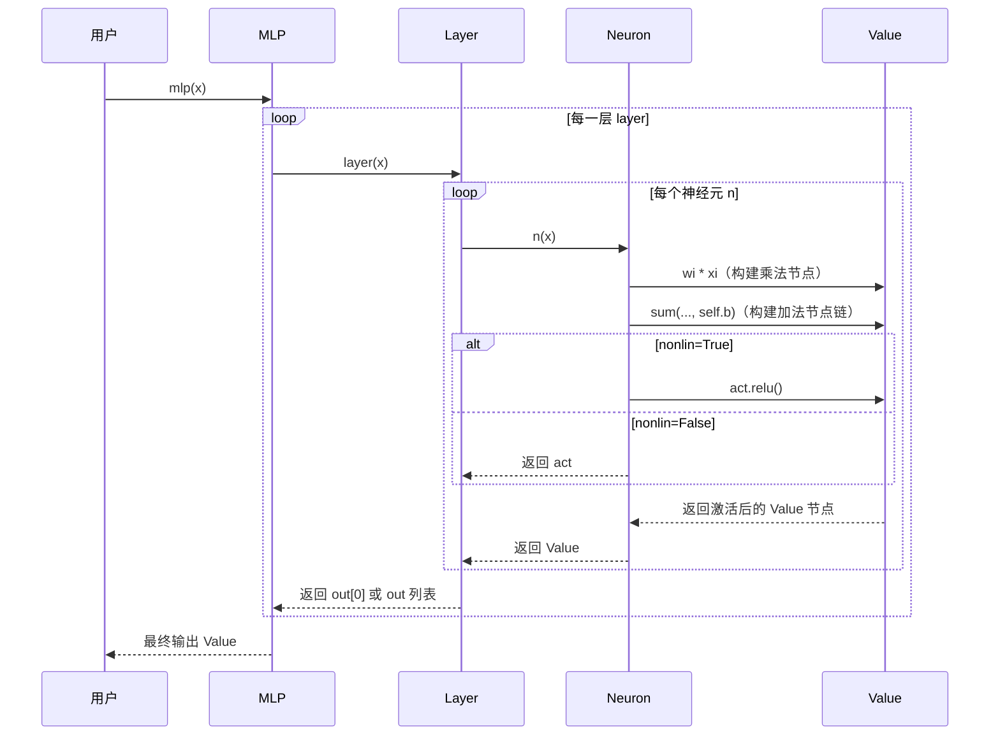
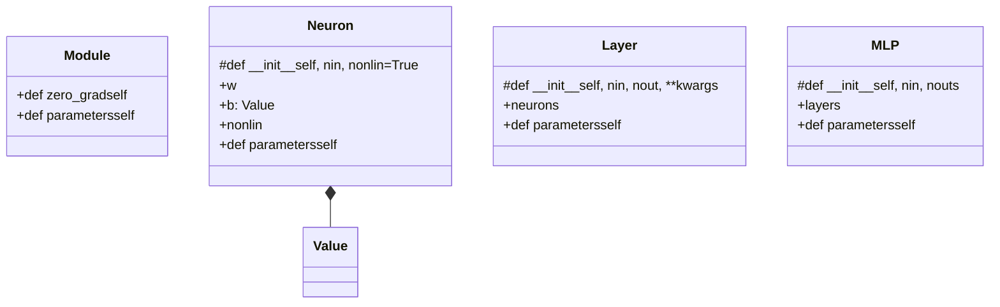
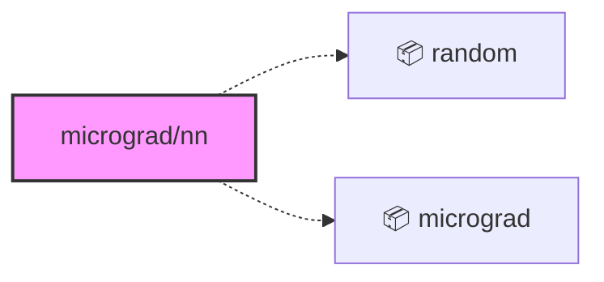
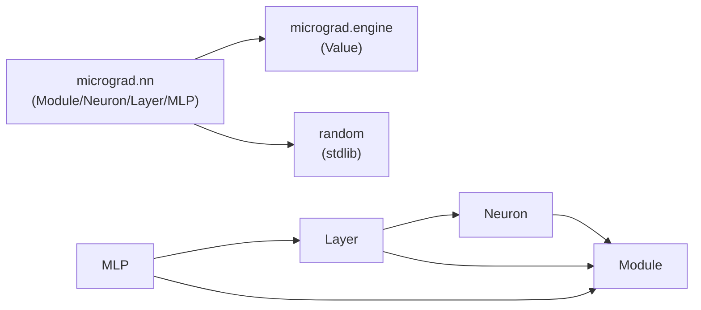

<a id="module-spec"></a>

# nn.py

<!-- cross-reference-index: auto generatedAt=2026-04-30T07:57:06.444Z same=0 cross=1 -->

## 相关 Spec

### 跨模块关联

- [micrograd/engine.py](engine.spec.md#module-spec) - 出站 1，入站 0；示例：micrograd/nn.py -> micrograd/engine.py


## 1. 意图

这个模块将标量自动微分引擎（`Value`）转化为可组合的神经网络构建块，使训练者能够通过 PyTorch 风格的 API 定义、前向传播并反向传播多层感知机。

1. **提供神经网络基类**：`Module`（`nn.py:4-11`）定义 `zero_grad()` / `parameters()` 两个通用接口，所有网络组件均继承此基类，统一参数管理契约。
2. **实现标量级神经元**：`Neuron`（`nn.py:13-28`）封装单个神经元的线性变换 + 可选 ReLU 激活，权重由 `random.uniform(-1,1)` 初始化，所有运算均以 `Value` 节点形式记录到 DAG 中。
3. **组合神经元为层**：`Layer`（`nn.py:30-43`）持有 `nout` 个同构 `Neuron` 实例，并在 `nout==1` 时自动解包输出为标量而非列表。
4. **构建多层感知机**：`MLP`（`nn.py:45-60`）接受输入维度 `nin` 和隐藏/输出层规格 `nouts`，自动决定除最后一层外均启用非线性激活，形成完整的端到端前向传播通道。
5. **参数聚合与梯度归零**：通过 `parameters()` 递归扁平化暴露全部可训练 `Value` 节点；`zero_grad()` 在每轮优化前将所有节点的 `.grad` 清零，防止梯度累积污染。

---

## 2. 业务逻辑

这个模块将标量 `Value` 节点组织成层次化神经网络，前向传播在 DAG 上动态构建计算图，反向传播则由 `Value.backward()` 完成。

```mermaid
flowchart TD
    A[用户调用 MLP.__call__\nx: List[float]] --> B[Layer.__call__\n遍历所有 layers]
    B --> C[Neuron.__call__\n对当前层每个 Neuron 执行]
    C --> D[线性加权求和\nact = sum wi*xi + b]
    D --> E{nonlin?}
    E -- True --> F[act.relu()\nReLU 激活]
    E -- False --> G[直接返回 act\n线性输出]
    F --> H[Layer 收集所有 Neuron 输出]
    G --> H
    H --> I{len(out)==1?}
    I -- True --> J[解包为标量 Value\n而非 List]
    I -- False --> K[返回 List[Value]]
    J --> L[下一层输入 x 更新]
    K --> L
    L --> M{还有更多层?}
    M -- Yes --> B
    M -- No --> N[最终输出 Value 或 List[Value]]
```

**阶段 1 — 参数初始化**（`Neuron.__init__()` in `nn.py:16-18`）：构造函数接受 `nin`（输入维度，int）和 `nonlin`（bool，默认 `True`），使用列表推导式创建 `nin` 个 `Value(random.uniform(-1,1))` 权重节点存入 `self.w`，偏置 `self.b = Value(0)` 固定初始化为零。每个 `Value` 在构造时已加入计算 DAG，`_prev` 为空集（叶节点）。特殊处理：`nonlin=False` 时表示线性神经元（通常用于最后一层回归/分类输出头）。

**阶段 2 — 单神经元前向传播**（`Neuron.__call__()` in `nn.py:21-23`）：输入 `x: List[float | Value]`，通过 `zip(self.w, x)` 将权重与输入一一配对，用生成器表达式 `wi*xi` 构建乘法节点，再以 `self.b` 为初始值累加（`sum(..., self.b)`），确保偏置节点进入 DAG。累加结果 `act: Value` 若 `nonlin=True` 则调用 `act.relu()`，否则直接返回 `act`。关键：整个求和过程在 `Value.__mul__` / `Value.__add__` 上动态建图，反向传播路径在此时确定。

**阶段 3 — 层级前向传播**（`Layer.__call__()` in `nn.py:36-38`）：输入 `x: List` 传给层内每个 `Neuron`，得到 `out: List[Value]`。若 `len(out)==1` 则返回 `out[0]`（标量 `Value`），否则返回完整列表。这种解包行为使单神经元层在链式调用时透明传递标量，避免下游需要额外解包；多神经元层则将输出列表作为下一层的输入 `x`。

**阶段 4 — MLP 构建与层序组合**（`MLP.__init__()` + `MLP.__call__()` in `nn.py:46-56`）：`__init__` 将 `nin` 与 `nouts` 合并为尺寸序列 `sz = [nin] + nouts`，然后通过 `Layer(sz[i], sz[i+1], nonlin=i!=len(nouts)-1)` 构建每一层——除最后一层（`nonlin=False`，线性输出）外均启用 ReLU。`__call__` 用 `for layer in self.layers: x = layer(x)` 顺序传播，每层输出覆盖 `x` 作为下一层输入，最终返回 `Value`（最后一层单神经元）或 `List[Value]`（多输出）。

**阶段 5 — 参数聚合与梯度管理**（`parameters()` / `zero_grad()` in `nn.py:4-11, 25, 40, 55`）：`MLP.parameters()` 通过两层列表推导扁平化：先遍历层，再遍历层内神经元参数，返回全部 `Value` 叶节点的扁平列表。`Module.zero_grad()` 遍历 `self.parameters()` 将每个节点的 `.grad` 置零，对应 PyTorch 的 `optimizer.zero_grad()`，必须在每次 `loss.backward()` 前调用以避免梯度累积。



| 子系统 | 文件 | 功能 |
|--------|------|------|
| `Module` | `nn.py:4-11` | 基类：`zero_grad` / `parameters` 接口契约 |
| `Neuron` | `nn.py:13-28` | 标量神经元：线性变换 + 可选 ReLU |
| `Layer` | `nn.py:30-43` | 平行神经元组：层级前向传播 |
| `MLP` | `nn.py:45-60` | 多层堆叠：构建完整前向通道 |
| `Value` | `micrograd/engine.py` | 标量 autograd 节点，承载 `.data`、`.grad`、`.backward()` |

---

## 3. 接口定义

| 名称 | 类型 | 签名 | 说明 |
|------|------|------|------|
| `Module` | class | `class Module` | 所有网络组件的抽象基类，定义参数管理接口；不应直接实例化 |
| `Module.zero_grad` | method | `def zero_grad(self)` | 遍历 `self.parameters()` 将每个 `Value` 节点的 `.grad` 重置为 `0`，在每轮优化步骤前调用 |
| `Module.parameters` | method | `def parameters(self) -> list` | 默认返回空列表；子类必须覆盖以返回自身持有的全部可训练 `Value` 节点 |
| `Neuron` | class | `class Neuron(Module)` | 单标量神经元，持有 `nin` 个权重和 1 个偏置，支持 ReLU 或线性激活 |
| `Neuron.__call__` | method | `def __call__(self, x)` | 接受长度为 `nin` 的输入列表，返回加权求和后激活的单个 `Value` 节点 |
| `Neuron.parameters` | method | `def parameters(self) -> list` | 返回 `self.w + [self.b]`，即该神经元全部 `nin+1` 个可训练参数 |
| `Layer` | class | `class Layer(Module)` | 由 `nout` 个同构 `Neuron` 组成的一层，将输入向量映射到输出向量 |
| `Layer.__call__` | method | `def __call__(self, x)` | 对每个 `Neuron` 调用 `n(x)`，若仅一个输出则自动解包为标量 `Value`，否则返回 `List[Value]` |
| `Layer.parameters` | method | `def parameters(self) -> list` | 扁平化返回层内所有神经元的参数，`[p for n in self.neurons for p in n.parameters()]` |
| `MLP` | class | `class MLP(Module)` | 多层感知机，按 `[nin] + nouts` 构建多个 `Layer`，最后一层为线性层，其余为 ReLU 层 |
| `MLP.__call__` | method | `def __call__(self, x)` | 顺序执行所有层的前向传播，返回最终层的输出 `Value` 或 `List[Value]` |
| `MLP.parameters` | method | `def parameters(self) -> list` | 扁平化返回整个网络所有层所有神经元的全部参数，供优化器遍历更新 |

---

---

### 完整接口参考（AST 精确提取）

### nn.py

| 名称 | 类型 | 签名 | 成员数 |
|------|------|------|--------|
| `Module` | class | `class Module` | 2 |
| `Neuron` | class | `class Neuron(Module)` | 5 |
| `Layer` | class | `class Layer(Module)` | 3 |
| `MLP` | class | `class MLP(Module)` | 3 |

**Module 成员**

| 成员 | 类型 | 签名 | 可见性 |
|------|------|------|--------|
| `zero_grad` | method | `def zero_grad(self)` | public |
| `parameters` | method | `def parameters(self)` | public |

**Neuron 成员**

| 成员 | 类型 | 签名 | 可见性 |
|------|------|------|--------|
| `__init__` | method | `def __init__(self, nin, nonlin=True)` | protected |
| `w` | property | `w` | public |
| `b` | property | `b: Value` | public |
| `nonlin` | property | `nonlin` | public |
| `parameters` | method | `def parameters(self)` | public |

**Layer 成员**

| 成员 | 类型 | 签名 | 可见性 |
|------|------|------|--------|
| `__init__` | method | `def __init__(self, nin, nout, **kwargs)` | protected |
| `neurons` | property | `neurons` | public |
| `parameters` | method | `def parameters(self)` | public |

**MLP 成员**

| 成员 | 类型 | 签名 | 可见性 |
|------|------|------|--------|
| `__init__` | method | `def __init__(self, nin, nouts)` | protected |
| `layers` | property | `layers` | public |
| `parameters` | method | `def parameters(self)` | public |

### 模块类图



### 依赖关系图




## 4. 数据结构

```python
# 核心类层次结构
class Module:
    # 无实例字段；接口类

class Neuron(Module):
    w: List[Value]    # 长度 nin，权重向量，每个元素为 Value 叶节点
    b: Value          # 偏置标量，初始化为 Value(0)
    nonlin: bool      # True=ReLU激活，False=线性输出

class Layer(Module):
    neurons: List[Neuron]   # 长度 nout，并行神经元

class MLP(Module):
    layers: List[Layer]     # 长度 len(nouts)，顺序层列表
```

| 字段 | 类型 | 说明 |
|------|------|------|
| `Neuron.w` | `List[Value]` | 权重列表，长度等于输入维度 `nin`；以 `random.uniform(-1,1)` 初始化 |
| `Neuron.b` | `Value` | 偏置，初始化为 `0`；是 DAG 中的叶节点 |
| `Neuron.nonlin` | `bool` | 激活函数选择标志，`True` 使用 `relu()`，`False` 直接线性输出 |
| `Layer.neurons` | `List[Neuron]` | 层内所有神经元，长度为 `nout`；接受相同输入并行计算 |
| `MLP.layers` | `List[Layer]` | 网络所有层，按前向传播顺序排列；最后一层强制 `nonlin=False` |

---

---

### 完整字段定义（AST 精确提取）

#### `Module` (class) — nn.py

**方法**

| 方法名 | 签名 | 可见性 |
|--------|------|--------|
| `zero_grad` | `def zero_grad(self)` | public |
| `parameters` | `def parameters(self)` | public |

#### `Neuron` (class) — nn.py

**字段**

| 字段名 | 类型/签名 | 可见性 |
|--------|-----------|--------|
| `w` | `w` | public |
| `b` | `b: Value` | public |
| `nonlin` | `nonlin` | public |

**方法**

| 方法名 | 签名 | 可见性 |
|--------|------|--------|
| `__init__` | `def __init__(self, nin, nonlin=True)` | protected |
| `parameters` | `def parameters(self)` | public |

#### `Layer` (class) — nn.py

**字段**

| 字段名 | 类型/签名 | 可见性 |
|--------|-----------|--------|
| `neurons` | `neurons` | public |

**方法**

| 方法名 | 签名 | 可见性 |
|--------|------|--------|
| `__init__` | `def __init__(self, nin, nout, **kwargs)` | protected |
| `parameters` | `def parameters(self)` | public |

#### `MLP` (class) — nn.py

**字段**

| 字段名 | 类型/签名 | 可见性 |
|--------|-----------|--------|
| `layers` | `layers` | public |

**方法**

| 方法名 | 签名 | 可见性 |
|--------|------|--------|
| `__init__` | `def __init__(self, nin, nouts)` | protected |
| `parameters` | `def parameters(self)` | public |

## 5. 约束条件

| 约束 | 值 | 说明 |
|------|-----|------|
| 权重初始化范围 | `[-1, 1)` | `random.uniform(-1,1)`，均匀分布，硬编码在 `Neuron.__init__` |
| 偏置初始值 | `0` | `Value(0)`，所有 Neuron 共享同一初始化策略，不可配置 |
| 最后一层激活 | `nonlin=False` | `MLP.__init__` 硬编码 `i!=len(nouts)-1`，最后一层必为线性输出 |
| 操作数据类型 | 标量（scalar） | `Value` 引擎仅支持标量运算，不支持向量/矩阵批量计算 |
| `Layer.__call__` 解包逻辑 | `nout==1` | 当层只有 1 个神经元时，输出解包为 `Value` 而非 `[Value]`；隐含与下游层的接口约定 |

---

## 6. 边界条件

- **空输入 `x=[]`**：`Neuron.__call__` 中 `zip(self.w, x)` 生成空序列，`sum((), self.b)` 返回 `self.b`，神经元输出等于偏置值。[推断: 基于 Python sum 语义，但未经单测明确验证]
- **`nin=0` 构建 Neuron**：`self.w = []`，前向传播退化为纯偏置，`parameters()` 仅返回 `[self.b]`。功能上合法但语义无实际意义。
- **`nouts=[]` 构建 MLP**：`sz = [nin]`，`len(nouts)=0`，`layers=[]`，`MLP.__call__` 直接返回原始输入 `x` 未经任何变换。[推断: Python for 循环空序列行为，代码无显式 guard]
- **`Layer` 单神经元解包**：当 `nout=1` 时 `out[0]` 返回标量 `Value`，若下游 `Layer` 期望 `List` 输入则会在 `zip(self.w, x)` 中报错，因为 `Value` 不可直接迭代。[不明确: 调用方是否必须保证 `nout>1` 或额外处理单输出场景]
- **梯度未清零时重复 `backward()`**：`Module.zero_grad()` 未被自动调用，用户若忘记调用则梯度会累积。这是设计意图（仿 PyTorch），但对新用户是陷阱。
- **`nonlin` 关键字参数透传**：`Layer.__init__` 使用 `**kwargs` 将 `nonlin` 传递给 `Neuron`；若 `kwargs` 中包含 `Neuron.__init__` 不支持的字段，则抛出 `TypeError`。

---

## 7. 技术债务

| 项目 | 严重程度 | 描述 |
|------|---------|------|
| 无批量（batch）支持 | 高 | 整个引擎基于标量 `Value`，训练时必须逐样本循环，无法利用向量化加速；训练大数据集效率极低 |
| 权重初始化不可配置 | 低 | `random.uniform(-1,1)` 硬编码，无法切换 Xavier / He 等初始化策略 |
| `Layer` 解包行为隐式 | 中 | `nout==1` 时自动解包为标量，与 `nout>1` 的列表输出接口不一致，增加下游调用者的类型判断负担 |
| 缺少激活函数扩展点 | 中 | 目前只支持 ReLU（`nonlin=True`）或无激活（`nonlin=False`），无法传入 tanh、sigmoid 等其他激活函数 |
| 无正则化 / Dropout 支持 | 低 | 作为教学用途可接受，但若需要泛化能力需自行在损失函数中添加 L2 正则项 |
| 随机种子不固定 | 低 | `random.uniform` 依赖全局随机状态，无法通过参数固定实验的可复现性 |

---

## 8. 测试覆盖

**现有测试文件**：`test/test_engine.py`（2 个测试函数：`test_sanity_check`、`test_more_ops`）

现有测试仅覆盖 **`micrograd.engine`（`Value`）层**的算术运算和梯度计算正确性，以 PyTorch 作为参考基准进行数值对比验证。**`micrograd.nn` 模块（本文件）当前零测试覆盖**。

**建议补充的测试用例**：

| 测试场景 | 目标类/方法 | 验证要点 |
|---------|------------|---------|
| 单神经元前向传播 | `Neuron.__call__` | 输出 `Value.data` 等于 `sum(wi*xi)+b` 的手算值；ReLU 截断负值 |
| 单神经元反向传播 | `Neuron.__call__` + `Value.backward` | 权重梯度与 PyTorch `nn.Linear` 一致（可复用 `test_engine.py` 的对比策略） |
| `zero_grad` 清零验证 | `Module.zero_grad` | 调用前梯度非零，调用后所有 `Value.grad==0` |
| `parameters()` 数量 | `Neuron/Layer/MLP` | `Neuron(3).parameters()` 长度为 4；`MLP(2,[3,1]).parameters()` 长度为 `3*3+3*1+1+1=13` |
| Layer 解包行为 | `Layer.__call__` | `nout=1` 时返回 `Value`；`nout=3` 时返回 `List[Value]` 长度为 3 |
| MLP 端到端训练 | `MLP` | 在简单数据集上多步 SGD 后 loss 单调下降 |
| 空层边界 | `MLP.__init__` | `MLP(2,[])` 不抛异常，`__call__` 返回原始输入 |

---

## 9. 依赖关系

**内部依赖**：
- `micrograd.engine.Value`：本模块所有运算的基本单元，权重、偏置、前向传播中间值均为 `Value` 实例

**外部依赖**：
- `random`（Python 标准库）：仅用于 `random.uniform(-1,1)` 权重初始化



---

## 附录：文件清单

| 文件 | 行数 | 主要用途 |
|------|------|----------|
| `nn.py` | 61 | 导出 Module, Neuron, Layer, MLP |


<!-- baseline-skeleton: {"filePath":"micrograd/nn.py","language":"python","loc":61,"exports":[{"name":"Module","kind":"class","signature":"class Module","jsDoc":null,"isDefault":false,"startLine":4,"endLine":11,"members":[{"name":"zero_grad","kind":"method","signature":"def zero_grad(self)","jsDoc":null,"visibility":"public","isStatic":false},{"name":"parameters","kind":"method","signature":"def parameters(self)","jsDoc":null,"visibility":"public","isStatic":false}]},{"name":"Neuron","kind":"class","signature":"class Neuron(Module)","jsDoc":null,"isDefault":false,"startLine":13,"endLine":28,"members":[{"name":"__init__","kind":"method","signature":"def __init__(self, nin, nonlin=True)","jsDoc":null,"visibility":"protected","isStatic":false},{"name":"w","kind":"property","signature":"w","jsDoc":null,"visibility":"public","isStatic":false},{"name":"b","kind":"property","signature":"b: Value","jsDoc":null,"visibility":"public","isStatic":false},{"name":"nonlin","kind":"property","signature":"nonlin","jsDoc":null,"visibility":"public","isStatic":false},{"name":"parameters","kind":"method","signature":"def parameters(self)","jsDoc":null,"visibility":"public","isStatic":false}]},{"name":"Layer","kind":"class","signature":"class Layer(Module)","jsDoc":null,"isDefault":false,"startLine":30,"endLine":43,"members":[{"name":"__init__","kind":"method","signature":"def __init__(self, nin, nout, **kwargs)","jsDoc":null,"visibility":"protected","isStatic":false},{"name":"neurons","kind":"property","signature":"neurons","jsDoc":null,"visibility":"public","isStatic":false},{"name":"parameters","kind":"method","signature":"def parameters(self)","jsDoc":null,"visibility":"public","isStatic":false}]},{"name":"MLP","kind":"class","signature":"class MLP(Module)","jsDoc":null,"isDefault":false,"startLine":45,"endLine":60,"members":[{"name":"__init__","kind":"method","signature":"def __init__(self, nin, nouts)","jsDoc":null,"visibility":"protected","isStatic":false},{"name":"layers","kind":"property","signature":"layers","jsDoc":null,"visibility":"public","isStatic":false},{"name":"parameters","kind":"method","signature":"def parameters(self)","jsDoc":null,"visibility":"public","isStatic":false}]}],"imports":[{"moduleSpecifier":"random","isRelative":false,"resolvedPath":null,"isTypeOnly":false},{"moduleSpecifier":"micrograd.engine","isRelative":false,"resolvedPath":null,"namedImports":["micrograd.engine","Value"],"isTypeOnly":false}],"hash":"f54453501abc4fd38ae724a8b378d6a5d23bfdd0a49c77e619b95f86ad16594d","analyzedAt":"2026-04-30T07:54:21.731Z","parserUsed":"tree-sitter"} -->
