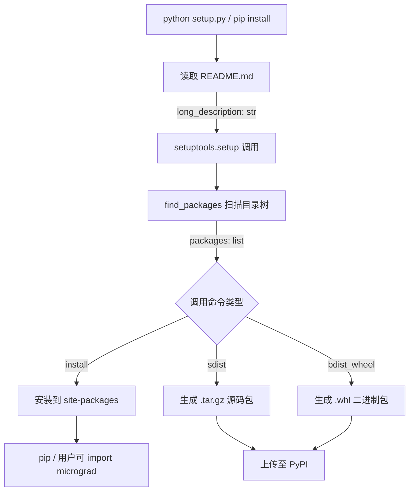
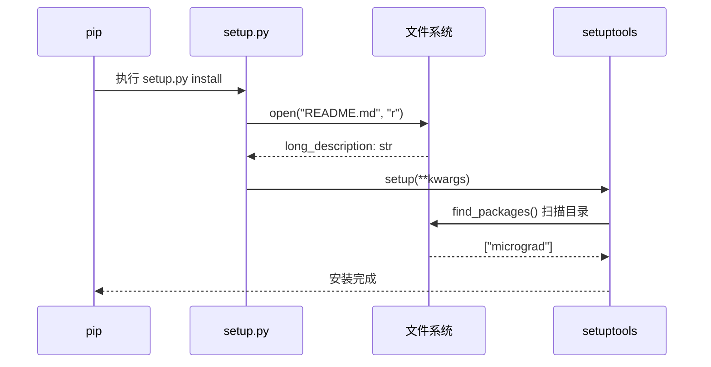
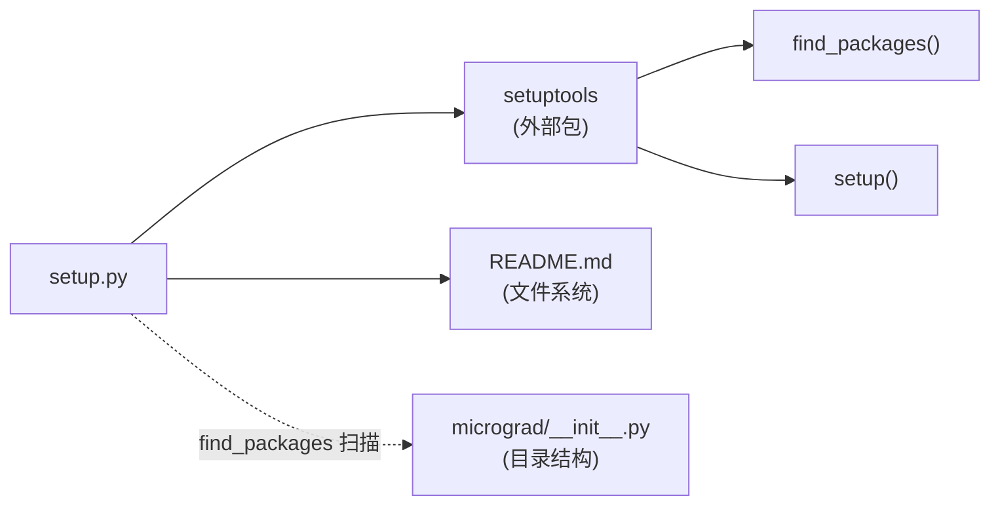

<a id="module-spec"></a>

# setup.py

<!-- cross-reference-index: auto generatedAt=2026-04-30T07:57:06.444Z same=0 cross=0 -->

## 相关 Spec

当前模块暂无可自动归档的相关 Spec 链接。


## 1. 意图

这个模块将 `micrograd` 项目的元数据与文件结构转化为标准 Python 包分发配置，使 `pip install micrograd` 能够从 PyPI 或本地源码正确安装该库。

1. **声明包的发布元数据**（名称、版本、作者、描述、URL），为 PyPI 上传和 `pip install` 提供必要信息。通过 `setuptools.setup()` in `setup.py` 实现。
2. **自动发现子包**：调用 `setuptools.find_packages()` 扫描目录树，自动将 `micrograd/` 及其子包纳入安装清单，无需手动枚举。
3. **嵌入 README 作为 PyPI 长描述**：运行时读取 `README.md` 并以 `text/markdown` 格式传递给 PyPI，使项目主页渲染 Markdown 内容。
4. **约束运行时环境**：声明 `python_requires='>=3.6'`，在安装阶段拒绝不兼容的 Python 版本。
5. **声明分类器（classifiers）**：向 PyPI 传递语言、许可证、平台元信息，支持搜索过滤。

本模块在系统中处于**构建/分发基础设施层**，不含业务逻辑；它是 `pip install`、`python setup.py sdist/bdist_wheel` 等工具链的入口点。

---

## 2. 业务逻辑

这个模块将 `setup.py` 的两个顺序执行阶段串联为一个完整的包注册管线：首先从文件系统获取长描述文本，然后将所有元数据提交给 `setuptools` 注册。

**阶段 1 — README 读取**（`open()` + `fh.read()` in `setup.py`，第 3-4 行）：
以只读模式打开 `README.md`（相对路径，依赖运行时工作目录为项目根目录），读取全部内容赋值给 `long_description`。输入为文件系统路径字符串，输出为 UTF-8 字符串（取决于系统默认编码）。无显式编码参数，若系统 locale 非 UTF-8 且 README 含非 ASCII 字符，可能抛出 `UnicodeDecodeError`。该字符串将直接传递给 PyPI，渲染为项目主页 Markdown 内容。

**阶段 2 — 包注册**（`setuptools.setup()` in `setup.py`，第 6-21 行）：
接收所有关键字参数，内部执行三个核心动作：(a) `find_packages()` 扫描当前目录树，发现含 `__init__.py` 的目录，自动构建 `packages` 列表；(b) 将 `classifiers` 列表、`python_requires` 字符串等约束元数据写入 egg-info 或 dist-info；(c) 根据调用命令（`install`、`sdist`、`bdist_wheel` 等）执行对应的构建/安装子命令。输出为安装到 site-packages 的包文件或 dist/ 目录下的分发包。





**关键子系统：**

| 子系统 | 文件 | 功能 |
|--------|------|------|
| `setuptools.setup` | 外部包 `setuptools` | 接收元数据并驱动构建/安装流程 |
| `setuptools.find_packages` | 外部包 `setuptools` | 自动发现 Python 子包目录 |
| `README.md` | 项目根目录 | 提供 PyPI 长描述 Markdown 内容 |

---

## 3. 接口定义

`setup.py` 是一个**可执行脚本**，而非可导入模块——它不导出任何 Python 公开符号。模块级别无函数定义、类定义或 `__all__`。唯一的公开行为是作为命令行入口点被 `pip` 或 `python setup.py <cmd>` 调用。

| 名称 | 类型 | 签名 | 说明 |
|------|------|------|------|
| `long_description` | 模块级变量 | `str` | 从 README.md 读取的 Markdown 内容，作为 PyPI 长描述传入 `setup()`，不对外导出 |
| *(无公开导出符号)* | — | — | 本文件设计为脚本执行，非模块导入；`setuptools.setup()` 的所有参数均为内联字面量 |

> [推断: 按照 Python 包分发惯例，`setup.py` 从不被 `import`；其接口是命令行参数（`install`、`sdist`、`bdist_wheel` 等），由 `setuptools` 解析 `sys.argv` 实现]

---

### 依赖关系图


## 4. 数据结构

本文件无自定义类型定义。核心数据以 `setuptools.setup()` 关键字参数字典的形式隐式存在：

```python
# setup() 调用的等效参数字典（从源码提取）
setup_kwargs = {
    "name": "micrograd",                          # str
    "version": "0.1.0",                           # str, SemVer 格式
    "author": "Andrej Karpathy",                  # str
    "author_email": "andrej.karpathy@gmail.com",  # str
    "description": str,          # 单行简短描述
    "long_description": str,     # README.md 全文（运行时读取）
    "long_description_content_type": "text/markdown",  # str, MIME 类型
    "url": "https://github.com/karpathy/micrograd",    # str
    "packages": list,            # find_packages() 返回值
    "classifiers": list[str],    # PyPI 分类器列表
    "python_requires": ">=3.6",  # str, PEP 440 版本约束
}
```

**关键字段说明：**

| 字段 | 类型 | 说明 |
|------|------|------|
| `name` | `str` | PyPI 包名，用于 `pip install micrograd` 中的标识符 |
| `version` | `str` | 当前发布版本 `0.1.0`，遵循 SemVer；更新需手动修改此文件 |
| `packages` | `list[str]` | 由 `find_packages()` 动态生成，包含 `["micrograd"]` 及任何子包 |
| `classifiers` | `list[str]` | PyPI 标准分类标签，声明语言、许可证、平台兼容性 |
| `python_requires` | `str` | PEP 440 约束表达式，`pip` 安装时强制校验 |
| `long_description` | `str` | 运行时从文件系统读取，非硬编码；内容为 README.md Markdown |

---

## 5. 约束条件

| 约束 | 值 | 说明 |
|------|----|----- |
| Python 版本下限 | `>= 3.6` | 由 `python_requires` 声明；`pip` 安装时自动校验，不满足则拒绝安装 |
| 包版本号 | `0.1.0` | 硬编码在源文件第 8 行；无自动版本管理（如 `setuptools_scm`） |
| 许可证 | MIT | 通过 classifiers 声明；与仓库 LICENSE 文件须一致 |
| README 路径 | `README.md`（相对路径） | 依赖执行时工作目录为项目根目录；不支持从其他目录调用 |
| 包名 | `micrograd` | PyPI 唯一标识符；已注册则后续发布须保持一致 |
| 内容类型 | `text/markdown` | PyPI 渲染 long_description 的 MIME 声明；与实际 README 格式须匹配 |

---

## 6. 边界条件

- **`README.md` 文件缺失**：`open("README.md", "r")` 抛出 `FileNotFoundError`，整个 `setup.py` 执行中断，无降级路径。典型发生场景：在非项目根目录执行 `pip install -e .` 或 `python setup.py`。
- **`README.md` 编码问题**：`open()` 未指定 `encoding='utf-8'`，依赖系统默认编码。若 README 含非 ASCII 字符（如中文）且系统 locale 为非 UTF-8（如 Windows CP936），可能触发 `UnicodeDecodeError`。
- **`find_packages()` 发现意外目录**：若项目根目录下存在含 `__init__.py` 的非目标目录（如测试辅助包），会被错误纳入安装清单。当前无 `exclude` 参数过滤。
- **版本号与 Git tag 不一致**：版本 `0.1.0` 为硬编码，无与 Git tag 的联动机制，手动发布时可能遗忘同步，导致 PyPI 版本与代码库 tag 偏差。
- **`setuptools` 未安装**：`import setuptools` 失败会导致整个脚本崩溃；现代 Python 环境通常预装，但在极简 Docker 镜像中可能缺失。
- **重复发布同版本**：PyPI 不允许覆盖已发布的同名同版本包；未更新版本号直接 `twine upload` 会被 PyPI 拒绝，但 `setup.py` 本身不做此检查。

---

## 7. 技术债务

| 项目 | 严重程度 | 描述 |
|------|---------|------|
| 使用传统 `setup.py` 而非 `pyproject.toml` | 中 | PEP 517/518（2018）引入了 `pyproject.toml` + `build` 的现代标准；`setup.py` 作为构建脚本已被标记为 legacy，`pip` 未来版本可能改变对它的支持方式 |
| 版本号硬编码 | 中 | `version="0.1.0"` 硬编码在源文件中，没有使用 `setuptools_scm` 或 `bumpversion` 等工具从 Git tag 自动导出，手动维护易出错 |
| `open()` 缺少 `encoding` 参数 | 低 | `open("README.md", "r")` 未指定 `encoding='utf-8'`，跨平台一致性存在风险，PEP 597 建议总是显式指定编码 |
| `find_packages()` 无 `exclude` 参数 | 低 | 未排除 `test`、`tests` 等目录，若测试目录含 `__init__.py` 会被误打包进发布包，增大发行体积 |
| 无 `install_requires` 声明 | 低 | `setup()` 未声明运行时依赖（`micrograd` 本身仅依赖标准库，故当前影响为零；但若未来新增依赖忘记同步此处，用户安装后会遇到 `ImportError`）[推断: 当前无第三方运行时依赖，仅测试依赖 PyTorch，但 `tests_require` 也未声明] |

---

## 8. 测试覆盖

`setup.py` 本身是构建配置脚本，无直接单元测试覆盖。项目的实际测试集中在引擎逻辑上：

**已有测试文件：**

- `test/test_engine.py`：包含 2 个测试函数
  - `test_sanity_check`：[推断: 验证基本前向传播与反向传播的正确性，对比 PyTorch 参考值]
  - `test_more_ops`：[推断: 覆盖更多运算符组合的梯度计算，如 `**`、`relu`、`/` 等]

**setup.py 的测试策略建议：**

| 测试场景 | 建议覆盖方式 | 当前状态 |
|---------|------------|---------|
| `find_packages()` 正确发现 `micrograd` | 在 CI 中执行 `python setup.py --version` 验证不报错 | 未覆盖 |
| README.md 可读且非空 | 集成测试检查文件存在且非空 | 未覆盖 |
| `python_requires` 约束正确 | tox 多版本矩阵测试 | 未覆盖 |
| 包可正确安装并 import | CI 中执行 `pip install -e . && python -c "import micrograd"` | 未覆盖（常见于 CI publish 步骤） |

核心业务逻辑（`micrograd.engine.Value` 的自动微分）在 `test/test_engine.py` 中有 2 个测试覆盖，但 `setup.py` 的构建基础设施层无专项测试，属于正常的行业惯例——通常通过 CI/CD 流程中的实际 `pip install` 验证。

---

## 9. 依赖关系

**外部依赖：**

| 依赖 | 类型 | 说明 |
|------|------|------|
| `setuptools` | 构建时依赖 | 提供 `setup()`、`find_packages()` 等核心构建 API；现代 Python 通常预装 |

**内部依赖：**

`setup.py` 不导入项目内任何模块。它通过 `find_packages()` 间接依赖目录结构——要求 `micrograd/__init__.py` 存在。

**运行时读取的文件：**

- `README.md`（项目根目录，非 Python 导入，文件系统读取）



**被依赖关系：**

`setup.py` 是构建工具链的**叶节点入口**，不被项目内任何其他 Python 模块导入；它仅被 `pip`、`python setup.py <cmd>`、`twine` 等外部工具调用。

---

## 附录：文件清单

| 文件 | 行数 | 主要用途 |
|------|------|----------|
| `setup.py` | 23 | 内部模块 |


<!-- baseline-skeleton: {"filePath":"setup.py","language":"python","loc":23,"exports":[],"imports":[{"moduleSpecifier":"setuptools","isRelative":false,"resolvedPath":null,"isTypeOnly":false}],"hash":"80c7a5b4ff6977aaca18f0e534561900d60c3ff093600d1f46ee5af0ef129c0f","analyzedAt":"2026-04-30T07:55:45.139Z","parserUsed":"tree-sitter"} -->
