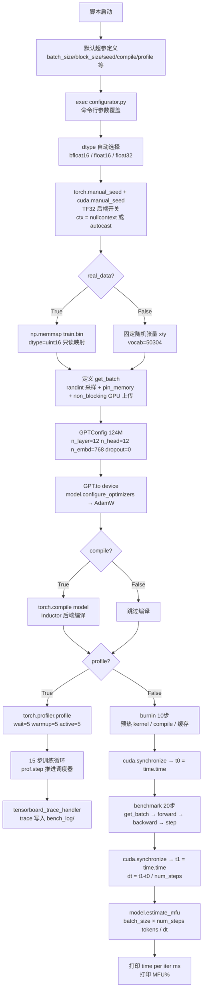
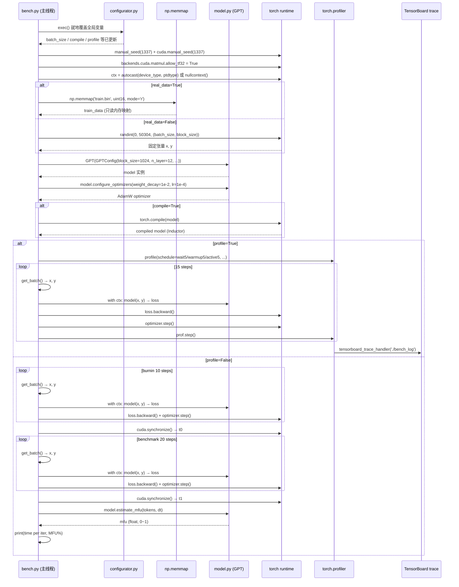
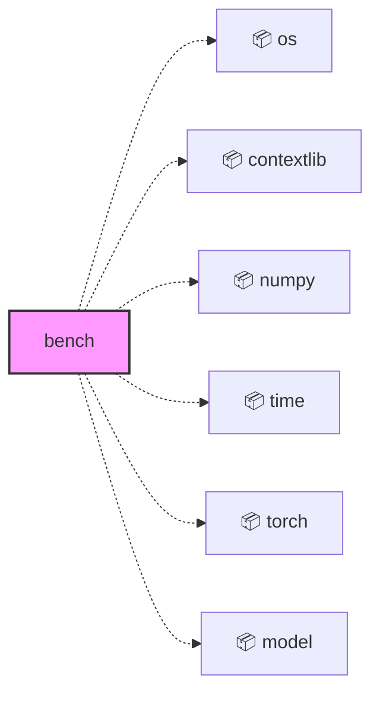
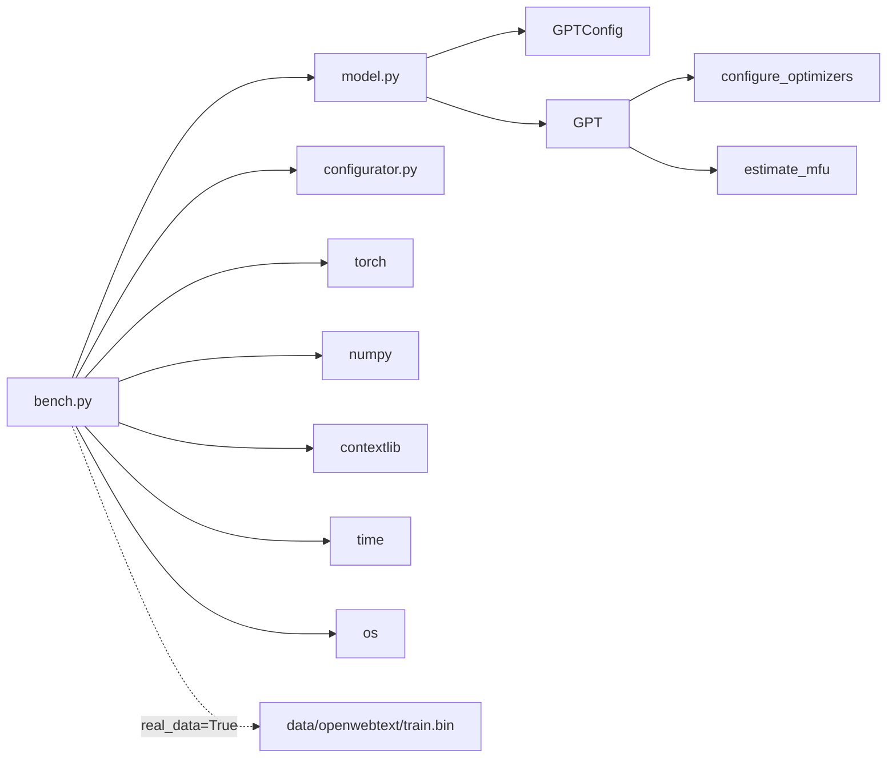

<a id="module-spec"></a>

# bench.py

<!-- cross-reference-index: auto generatedAt=2026-04-30T08:18:16.352Z same=0 cross=1 -->

## 相关 Spec

### 跨模块关联

- [model.py](model.spec.md#module-spec) - 出站 1，入站 0；示例：bench.py -> model.py


## 1. 意图

这个模块将 GPT 模型的前向+反向传播循环转化为可量化的吞吐量基准数据，使工程师能够在正式训练前快速评估硬件利用率（MFU）和每步延迟。

核心职责：

1. **硬件环境初始化**：根据当前设备能力自动选择 dtype（`bfloat16`/`float16`）并配置 TF32、混合精度上下文（`contextlib.nullcontext` 或 `torch.amp.autocast`）
2. **批数据供给**：通过 `get_batch()` 从 OpenWebText `train.bin` memmap 文件随机采样，或退化为固定随机张量以消除 I/O 噪声干扰
3. **模型实例化与编译**：使用 `GPTConfig` + `GPT` 构建标准 GPT-2 规模模型，并可选 `torch.compile` 加速
4. **双模式基准执行**：支持 PyTorch Profiler 深度剖析（wait/warmup/active 三阶段）或简单的两段式（burnin + benchmark）秒级基准
5. **MFU 计算与输出**：调用 `model.estimate_mfu()` 将实测时间换算为模型算力利用率百分比，提供可对比的性能指标

---

## 2. 业务逻辑

这个脚本将 GPT 训练循环的一次完整执行路径转化为可重复测量的性能数据，是 `train.py` 的精简对照组，核心目标是以最少代码量、最低干扰地量化 GPU 吞吐上限。

---

**阶段 1 — 全局配置加载**（`exec(open('configurator.py').read())` in `bench.py`）

脚本顶部以 Python 赋值语句直接定义全部默认超参：`batch_size=12`、`block_size=1024`、`bias=False`、`real_data=True`、`seed=1337`、`device='cuda'`、`compile=True`、`profile=False`。这些变量均为模块作用域全局变量，不封装在任何函数或类中，方便 `configurator.py` 通过 `exec` 直接覆写。随后 `exec(open('configurator.py').read())` 读取并执行 `configurator.py` 的源代码，该脚本解析 `sys.argv` 中形如 `--key=value` 的参数并就地赋值至调用方作用域，从而实现无需 `argparse` 的轻量级命令行覆盖机制。`dtype` 字段在加载后立即派生：`torch.cuda.is_available() and torch.cuda.is_bf16_supported()` 为真时选 `'bfloat16'`，否则退回 `'float16'`，完全跳过 `float32` 以最大化混合精度收益；`ptdtype` 字典随后将字符串映射为 `torch.dtype` 枚举，供 autocast 使用。`profile` 标志在此阶段确定，决定后续走 Profiler 分支（阶段 5a）还是简单计时分支（阶段 5b），两条路径在结构上互斥。

---

**阶段 2 — 随机种子与硬件上下文初始化**（模块顶层代码 in `bench.py`）

输入为阶段 1 确定的 `seed`、`device`、`dtype`、`ptdtype`；输出为可复用的上下文管理器 `ctx` 和一组全局 PyTorch 后端开关。`torch.manual_seed(seed)` + `torch.cuda.manual_seed(seed)` 双重固定随机状态，使不同运行的权重初始化、数据采样完全可复现，确保多次跑分结果可比对。`torch.backends.cuda.matmul.allow_tf32 = True` 与 `torch.backends.cudnn.allow_tf32 = True` 开启 Ampere+ 架构的 TF32 模式，以少量精度换取约 2× 矩阵乘法吞吐。`ctx` 的构造是本阶段最关键的设计决策：`device_type` 从 `device` 字符串中提取（含 `'cuda'` 则为 `'cuda'`，否则 `'cpu'`），若为 CPU 则 `ctx = nullcontext()`（零开销占位符），若为 GPU 则 `ctx = torch.amp.autocast(device_type=device_type, dtype=ptdtype)`；后续所有前向传播均以 `with ctx:` 包裹，实现了条件混合精度的统一接口，不需要在训练循环内部写 `if/else`。该设计直接复用了 `train.py` 中相同的 `ctx` 约定，保证基准行为与训练行为高度一致。

---

**阶段 3 — 数据加载初始化**（`get_batch()` in `bench.py`）

输入：`real_data` 标志、`device`、`batch_size`、`block_size`；输出：可调用的 `get_batch(split)` 函数，返回 `(x: Tensor[B, T, int64], y: Tensor[B, T, int64])`，两个张量均已就位于 `device`。当 `real_data=True` 时，以 `np.memmap('data/openwebtext/train.bin', dtype=np.uint16, mode='r')` 只读内存映射方式打开原始 token 序列，完全跳过文件全量加载以节约内存；`get_batch()` 每次调用 `torch.randint(len(data) - block_size, (batch_size,))` 生成 `batch_size` 个随机起始偏移 `ix`，通过列表推导切片 `data[i:i+block_size]`（输入 `x`）和 `data[i+1:i+1+block_size]`（目标 `y`），`np.stack` 组装后 `torch.from_numpy` 转换，最后 `pin_memory().to(device, non_blocking=True)` 实现 CPU→GPU 的异步 DMA 传输，将数据搬运与前向计算重叠，最小化数据加载对计时的干扰。当 `real_data=False` 时，`x` 和 `y` 在初始化阶段一次性以 `torch.randint(0, 50304, (batch_size, block_size))` 生成并锁定，`get_batch()` 退化为返回同一对固定张量的 lambda，vocab 上界 `50304` 与 GPT-2 tokenizer 对齐（`50257` 取整至 64 的倍数），该分支彻底消除数据加载 I/O 噪声，用于隔离纯计算性能。函数签名接收 `split` 参数但刻意忽略，代码注释 `# note ignore split` 已明确说明这是有意为之——基准场景不区分 train/val，始终使用训练数据。

---

**阶段 4 — 模型与优化器构建**（`GPTConfig`、`GPT`、`model.configure_optimizers()` in `model.py`；`torch.compile` in `bench.py`）

输入：阶段 1 确定的模型超参（`block_size=1024`、`n_layer=12`、`n_head=12`、`n_embd=768`、`dropout=0`、`bias=False`）；输出：就位于 `device` 的 `model: GPT`（可能已编译）和 `optimizer: AdamW`。`GPTConfig` 以 dataclass 封装全部静态超参，`bias=False` 可通过 `configurator.py` 覆盖；`dropout=0` 强制关闭正则化，保证前向传播完全确定性且消除 dropout 的随机开销，对基准测速至关重要。`model.to(device)` 后调用 `model.configure_optimizers(weight_decay=1e-2, learning_rate=1e-4, betas=(0.9, 0.95), device_type=device_type)`，该方法内部将参数按 `requires_grad + ndim >= 2` 分为 decay/no-decay 两组，分别施加权重衰减，返回标准 `torch.optim.AdamW` 实例；基准场景不关注收敛，优化器配置仅是为了让反向传播路径完整，模拟真实训练的完整计算图。若 `compile=True`，调用 `torch.compile(model)` 触发 PyTorch Inductor 后端编译，生成融合 CUDA kernel；首次运行编译耗时数十秒，正常落入 burnin 阶段消化，对最终 MFU 读数无影响，但控制台会打印 `Compiling model...` 提示。`model.eval()` 在此阶段**未被调用**——脚本保持训练模式（`model.train()`），因为基准目标是测量包含反向传播在内的完整训练步骤吞吐，而非推理吞吐。

---

**阶段 5a — PyTorch Profiler 基准模式**（`torch.profiler.profile` in `bench.py`）

输入：`profile=True` 时激活，使用 `schedule(wait=5, warmup=5, active=5)`；输出：`./bench_log/` 目录下的 TensorBoard-compatible Chrome trace JSON 文件，包含 CPU/CUDA 事件时间线和 FLOPs 统计。三段式调度的语义为：`wait` 阶段（5步）profiler 完全静默，让 compile、CUDA graph 捕获、内核缓存完成初始化；`warmup` 阶段（5步）profiler 启动但不记录，进一步稳定热路径；`active` 阶段（5步）开始收集完整的算子级耗时。`with_stack=False` 禁止 Python 调用栈采样以减少观测者效应，`profile_memory=False` 跳过内存分配跟踪；`record_shapes=True` 保留张量形状信息，用于 TensorBoard 中的 FLOPs 分析。每步训练循环（`get_batch → with ctx: model(x,y) → backward → optimizer.step`）结束后调用 `prof.step()` 推进调度器，`active` 阶段结束后 profiler 自动通过 `on_trace_ready=tensorboard_trace_handler('./bench_log')` 落盘；若 `bench_log` 目录不存在，`tensorboard_trace_handler` 会自动创建 [推断: 基于 PyTorch 文档行为]。该模式适合定位具体算子瓶颈（如 attention kernel vs linear），而非仅获得一个 MFU 数字。

---

**阶段 5b — 简单计时基准模式**（两段 `for` 循环 in `bench.py`）

输入：`profile=False` 时激活，使用固定步数 `num_steps=10`（burnin）和 `num_steps=20`（计时）；输出：控制台打印 `time per iteration: X ms | mfu: Y%`。执行分为两段：第一段 10 步为 burnin，调用完整训练步骤（`get_batch → with ctx: logits, loss = model(x, y) → loss.backward() → optimizer.step()`）但不计时，目的是预热 CUDA kernel、触发 JIT 编译（若使用 `torch.compile`）、填充 NCCL 通信缓存（若多卡）；第二段 20 步开始前调用 `torch.cuda.synchronize()` 取精确 `t0 = time.time()`，循环结束后再次 `torch.cuda.synchronize()` 确保所有 GPU 异步操作完成后才取 `t1`，`dt = (t1 - t0) / num_steps` 得到单步平均耗时。随后调用 `model.estimate_mfu(batch_size * 1 * num_steps, dt)`——注意第一参数是"总 token 数除以步数"等效的 flops 基数，该方法内部用 GPT-2 的理论 FLOP/token 计算峰值算力利用率，公式为 `actual_flops / theoretical_peak_flops`，结果以百分比形式打印。`optimizer.zero_grad(set_to_none=True)` 优先于 `zero_grad(False)` 使用，将梯度张量彻底释放而非清零，进一步降低内存带宽压力，使计时结果更接近真实训练峰值。

---





| 子系统 | 文件 | 功能 |
|--------|------|------|
| `get_batch` | `bench.py` | 从 memmap 随机采样 token 序列，异步 DMA 上传 GPU；`real_data=False` 时退化为固定张量 lambda |
| `GPTConfig` | `model.py` | 模型超参 dataclass，承载 `block_size/n_layer/n_head/n_embd/dropout/bias` |
| `GPT.__call__` | `model.py` | 完整 Transformer 前向传播，返回 `(logits, loss)` |
| `GPT.configure_optimizers` | `model.py` | 按 `ndim>=2` 分 decay/no-decay 组，返回 AdamW |
| `GPT.estimate_mfu` | `model.py` | 将实测步长时间和 token 数转换为 MFU 百分比 |
| `configurator.py` | `configurator.py` | 解析 `sys.argv` `--key=value` 并以 `exec` 方式覆盖调用方全局变量 |
| `torch.profiler.profile` | PyTorch 内置 | 三段式 schedule 收集算子级 CPU/CUDA 时间线和 FLOPs |
| `torch.amp.autocast` | PyTorch 内置 | 前向传播混合精度上下文，由 `ctx` 变量统一封装 |

## 3. 接口定义

`bench.py` 是顶层脚本，无模块级导出符号（不定义可被 `import` 的公开 API）。所有逻辑在模块执行时直接运行。

| 名称 | 类型 | 签名 | 说明 |
|------|------|------|------|
| `get_batch` | `function` | `(split: str) -> tuple[Tensor, Tensor]` | 当 `real_data=True` 时从 memmap 随机采 `batch_size` 条序列；当 `real_data=False` 时返回固定全局张量 `(x, y)`。`split` 参数在脚本内被忽略（注释明确说明） |
| `gptconf` | `GPTConfig` | `GPTConfig(block_size, n_layer, n_head, n_embd, dropout, bias)` | 脚本内构造的模型配置实例，固定 GPT-2 124M 规模，`dropout=0` 以保证确定性 |
| `model` | `GPT` | — | 模型实例，在 `torch.compile` 后可能被替换为编译后的包装对象 |
| `optimizer` | `torch.optim.AdamW` | — | 由 `model.configure_optimizers` 返回，含权重衰减分组 |
| `ctx` | `ContextManager` | — | CPU 时为 `nullcontext()`，GPU 时为 `torch.amp.autocast`；通过 `with ctx:` 统一包裹前向传播 |

---

### 依赖关系图




## 4. 数据结构

```python
# 批数据张量（由 get_batch 返回）
x: torch.Tensor  # shape: (batch_size, block_size), dtype=torch.int64, device=device
y: torch.Tensor  # shape: (batch_size, block_size), dtype=torch.int64, device=device

# memmap 原始数据
train_data: np.memmap  # dtype=np.uint16, mode='r', shape=(N,)

# GPT 配置（来自 model.py）
gptconf = GPTConfig(
    block_size=1024,
    n_layer=12,
    n_head=12,
    n_embd=768,
    dropout=0,
    bias=False,  # 可通过 configurator 覆盖
)
```

| 字段 | 类型 | 说明 |
|------|------|------|
| `batch_size` | `int` | 每批样本数，默认 12 |
| `block_size` | `int` | 上下文窗口长度（token 数），默认 1024 |
| `dtype` | `str` | 字符串标识 `'bfloat16'/'float16'/'float32'`，用于 autocast |
| `ptdtype` | `torch.dtype` | 由 `dtype` 字符串映射的 PyTorch dtype 枚举 |
| `ctx` | `ContextManager` | 前向传播混合精度上下文 |
| `device_type` | `str` | `'cuda'` 或 `'cpu'`，从 `device` 字符串派生 |
| `mfu` | `float` | [推断: 来自 `estimate_mfu` 返回值] 模型算力利用率，范围 (0, 1) |

---

## 5. 约束条件

| 约束 | 值 | 说明 |
|------|-----|------|
| `batch_size` | `12` | 默认批大小，适配单 GPU 显存 |
| `block_size` | `1024` | 上下文长度，与 GPT-2 标准配置一致 |
| `n_layer` | `12` | Transformer 层数，GPT-2 124M 规模 |
| `n_head` | `12` | 注意力头数 |
| `n_embd` | `768` | 嵌入维度 |
| `dropout` | `0` | 强制关闭 dropout 以保证确定性和性能 |
| `seed` | `1337` | 固定随机种子 |
| `weight_decay` | `1e-2` | AdamW 权重衰减系数 |
| `learning_rate` | `1e-4` | AdamW 学习率（基准场景不关注收敛，仅测吞吐） |
| Profiler wait/warmup/active | `5/5/5` | 共 15 步，active 阶段收集数据 |
| burnin steps | `10` | 简单基准第一段，用于预热 |
| benchmark steps | `20` | 简单基准第二段，正式计时 |
| vocab_size（隐含） | `50304` | `real_data=False` 时随机张量上界，与 GPT-2 tokenizer 对齐 |

---

## 6. 边界条件

- **`real_data=True` 但 `train.bin` 不存在**: `np.memmap` 抛出 `FileNotFoundError`，脚本直接崩溃。无降级处理，需用户预先运行 `data/openwebtext/prepare.py`
- **CUDA 不可用时 `device='cuda'`**: `model.to(device)` 会抛出 RuntimeError；`torch.cuda.synchronize()` 同样会失败。脚本不做自动 fallback，需用户显式设 `--device=cpu`
- **`compile=True` 首次运行**: `torch.compile` 的编译时间（数十秒）会落入 burnin 的 10 步内，对最终 MFU 结果无影响，但控制台会打印 `Compiling model...` 提示
- **`profile=True` 时 `bench_log` 目录不存在**: `tensorboard_trace_handler` 会自动创建目录，[推断: 基于 PyTorch 文档行为]
- **`get_batch` 中 `split` 参数**: 函数签名接收 `split` 但实际忽略，始终使用 `train_data`；代码注释 `# note ignore split` 已明确说明这是有意为之
- **`real_data=False` 分支**: `x, y` 在批次间保持不变，消除数据加载 I/O 噪声，但也意味着模型始终处理相同输入，梯度可能退化——对基准计时无影响，但不代表真实训练行为
- **BF16 支持检测**: `torch.cuda.is_available() and torch.cuda.is_bf16_supported()` 在 CPU 模式下永远为 False，强制退回 `float16`；在 CPU 上运行 `float16` 可能引发性能警告

---

## 7. 技术债务

| 项目 | 严重程度 | 描述 |
|------|----------|------|
| `exec(open('configurator.py').read())` | 中 | 动态执行外部文件是全局变量污染和安全隐患的来源；更健壮的方案是 `argparse` 或 `hydra` |
| `get_batch` 忽略 `split` 参数 | 低 | 函数签名具有误导性，应将参数移除或重命名为 `_` 以明确意图 |
| `data_dir` 硬编码 `'openwebtext'` | 中 | `dataset = 'openwebtext'` 被硬编码，无法通过 configurator 切换数据集，与 `train.py` 的灵活性不对称 |
| 无 `--no_compile` 友好提示 | 低 | CPU 模式下 `torch.compile` 依然尝试执行，用户需手动传 `--compile=False` |
| Profiler trace 路径硬编码 `'./bench_log'` | 低 | 不可通过配置覆盖，多次运行会追加到同一目录，可能产生混淆 |
| 无最终 loss 汇总统计 | 低 | 每步打印 loss 但不计算均值/方差，无法量化收敛稳定性；对纯吞吐基准影响有限 |

---

## 8. 测试覆盖

**当前状态**：`bench.py` 是顶层脚本，仓库中无对应的直接单元测试文件（[推断: 基于脚本文件的性质，通常不被单元测试框架覆盖]）。

**建议测试用例**：

1. **`get_batch` 输出形状验证**：断言返回 `(batch_size, block_size)` 的 `int64` 张量，`y` 相比 `x` 偏移 1 位
2. **`real_data=False` 固定张量行为**：多次调用 `get_batch` 返回相同引用（`x is y_same`）
3. **dtype 自动选择逻辑**：mock `torch.cuda.is_available` 和 `torch.cuda.is_bf16_supported`，验证三种 dtype 路径
4. **`ctx` 上下文类型验证**：CPU 时为 `nullcontext`，GPU 时为 `torch.amp.autocast`
5. **Profiler 分支步数验证**：mock profiler，验证 `wait+warmup+active=15` 步被执行
6. **burnin/benchmark 两段式计时**：stub `time.time`，验证 MFU 仅在 `stage==1` 时输出
7. **`torch.compile` 跳过路径**：设 `compile=False`，验证模型类型不被 `OptimizedModule` 包装

**覆盖策略**：由于脚本依赖 CUDA 硬件和真实数据文件，建议用 `pytest` + `unittest.mock` 注入 stub，在 CI CPU-only 环境下测试配置逻辑和数据加载路径；MFU 数值正确性测试依赖 `model.estimate_mfu` 的独立单测。

---

## 9. 依赖关系

**外部依赖（Python packages）**：

| 包 | 用途 |
|----|------|
| `torch` | 张量计算、CUDA 管理、autocast、profiler、compile |
| `numpy` | memmap 文件读取，`np.uint16` → `np.int64` 类型转换 |
| `contextlib.nullcontext` | CPU 模式下的空上下文管理器 |
| `time` | 简单基准的墙钟计时 |
| `os` | 路径拼接（`os.path.join`） |

**内部依赖**：

| 模块 | 符号 | 说明 |
|------|------|------|
| `model.py` | `GPTConfig` | 模型超参数据类 |
| `model.py` | `GPT` | Transformer 模型实现，含 `configure_optimizers`、`estimate_mfu` |
| `configurator.py` | （动态 exec） | 命令行参数解析，就地覆盖模块全局变量 |
| `data/openwebtext/train.bin` | （文件依赖） | 预处理的 token 二进制文件，仅 `real_data=True` 时需要 |



---

## 附录：文件清单

| 文件 | 行数 | 主要用途 |
|------|------|----------|
| `bench.py` | 118 | 内部模块 |


<!-- baseline-skeleton: {"filePath":"bench.py","language":"python","loc":118,"exports":[],"imports":[{"moduleSpecifier":"os","isRelative":false,"resolvedPath":null,"isTypeOnly":false},{"moduleSpecifier":"contextlib","isRelative":false,"resolvedPath":null,"namedImports":["contextlib","nullcontext"],"isTypeOnly":false},{"moduleSpecifier":"numpy","isRelative":false,"resolvedPath":null,"isTypeOnly":false},{"moduleSpecifier":"time","isRelative":false,"resolvedPath":null,"isTypeOnly":false},{"moduleSpecifier":"torch","isRelative":false,"resolvedPath":null,"isTypeOnly":false},{"moduleSpecifier":"model","isRelative":false,"resolvedPath":null,"namedImports":["model","GPTConfig","GPT"],"isTypeOnly":false}],"moduleDoc":"A much shorter version of train.py for benchmarking","hash":"984f54a60df9d1aa844e7e0aef10000e7090a00109d13e43587ccb077ef340bb","analyzedAt":"2026-04-30T07:58:54.396Z","parserUsed":"tree-sitter"} -->
