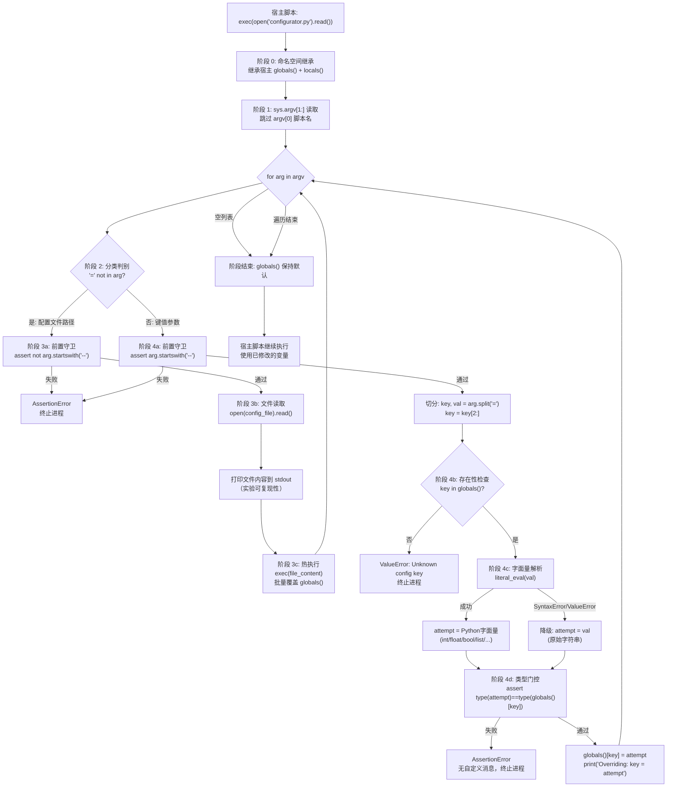
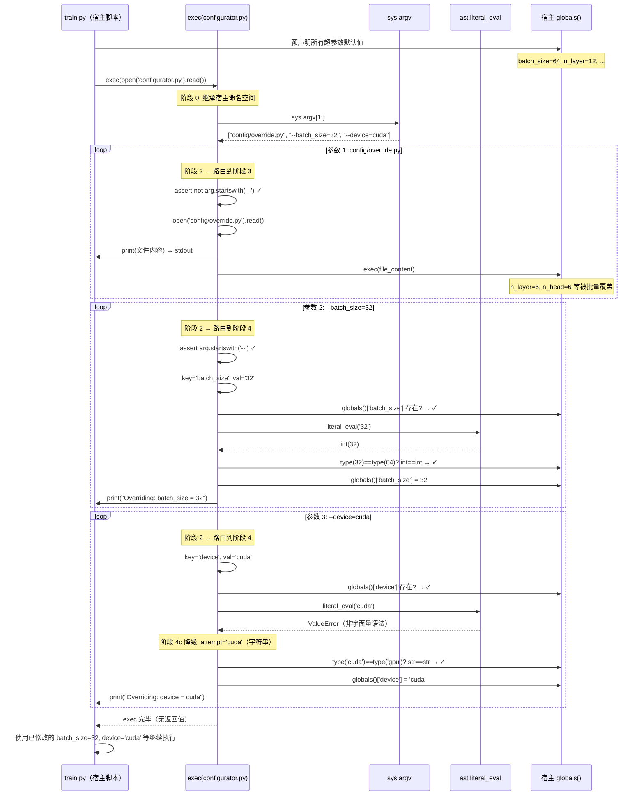
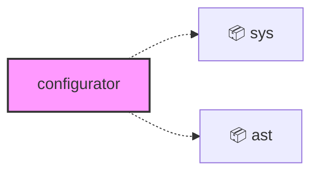
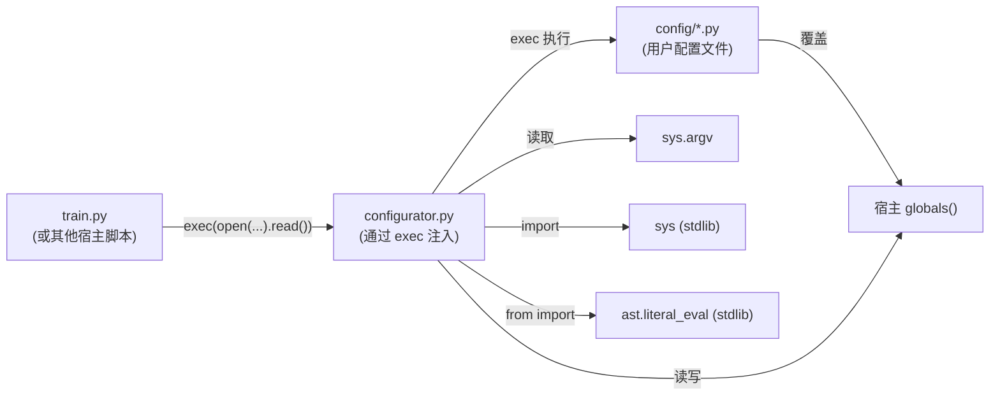

<a id="module-spec"></a>

# configurator.py

<!-- cross-reference-index: auto generatedAt=2026-04-30T08:18:16.352Z same=0 cross=0 -->

## 相关 Spec

当前模块暂无可自动归档的相关 Spec 链接。


## 1. 意图

这个模块将命令行参数（配置文件路径 + `--key=value` 键值对）转化为对调用方全局命名空间的就地覆盖，使 `train.py` 等训练脚本能够在不引入任何配置框架的情况下灵活调整超参数。

1. **命令行参数路由**：遍历 `sys.argv[1:]`，按"是否含 `=`"将参数分发到两条处理路径（配置文件 vs 键值覆盖）
2. **配置文件热执行**：以 `exec()` 方式就地运行用户指定的 Python 配置文件，使其变量定义直接生效于调用方作用域
3. **类型安全的键值覆盖**：使用 `ast.literal_eval` 将字符串值解析为 Python 字面量，并强制类型与现有全局变量一致，拒绝类型不匹配的覆盖
4. **全局命名空间代理**：通过调用方的 `globals()` 直接读写其变量，无需任何中间配置对象或 `config.` 前缀
5. **自文档化覆盖**：每次覆盖（无论文件还是键值）都以 `print()` 输出变更内容，便于训练日志追溯

该模块在系统中的定位是**极简配置注入层**，通过 `exec(open('configurator.py').read())` 被宿主脚本嵌入执行，刻意避免成为独立的 Python 模块，从而让所有配置变量直接存活于宿主的全局作用域而非子命名空间。

---

## 2. 业务逻辑

这个模块将 `sys.argv` 的原始字符串序列转化为对宿主脚本全局命名空间的精准外科手术，使训练脚本能在零框架依赖、零模块导入负担的条件下接受任意超参数覆盖。整个管线共五个处理阶段，每个阶段都有明确的守卫条件和降级策略。

---

**阶段 0 — exec 注入与命名空间继承**（`exec(open('configurator.py').read())` in `train.py`）：`configurator.py` 本身不是一个 Python 模块，不通过 `import` 加载，而是由宿主脚本（如 `train.py`）以 `exec(open('configurator.py').read())` 的形式在**宿主自身的全局+局部作用域**内运行。输入为宿主在执行此语句时的完整 `globals()` 字典（包含所有已声明的超参数默认值，如 `batch_size=64`、`learning_rate=6e-4` 等）；输出为同一字典被原地修改后的状态。核心机制：`exec()` 不创建新的命名空间隔离层，`configurator.py` 内的所有赋值操作直接落在宿主的 `globals()` 上，这意味着 configurator 可以不加任何显式参数传递就读写宿主的任意变量。特殊处理：该设计刻意绕开了 `argparse` / `click` 等配置框架，代价是失去类型声明、帮助文档和补全支持；优势是宿主脚本无需预先声明 CLI 接口，超参数变量名即接口名。[推断: 这是设计者"宁可简单、不要框架"的显式权衡]

**阶段 1 — sys.argv 读取与遍历初始化**（主循环，`configurator.py` L18）：进入 `for arg in sys.argv[1:]` 循环，输入为原始命令行参数列表（`list[str]`），跳过 `sys.argv[0]`（脚本名本身）。核心算法：① 取 `sys.argv` 的切片 `[1:]`，排除脚本路径；② 按顺序对每个 `arg` 执行后续阶段；③ 循环结束后宿主 `globals()` 已完全更新，函数体隐式返回（无显式 `return`）。特殊处理：**参数顺序有语义**——若配置文件参数（阶段 2）出现在键值参数（阶段 3）之后，配置文件内的赋值会覆盖已经写入的键值，导致命令行参数失效；[推断: 约定配置文件参数应排在键值参数之前，但代码本身不强制]。当 `sys.argv[1:]` 为空列表时，循环零次执行，宿主 `globals()` 保持默认值，属于正常退出路径。

**阶段 2 — 参数类型判别与路由分支**（`if '=' not in arg` in `configurator.py` L19）：每次迭代的第一步是以 `'=' not in arg` 作为二元判别器，将参数路由到两条完全不同的处理路径。输入：单个 `str` 类型的 arg；输出：路由决策（布尔值，决定进入阶段 3 还是阶段 4）。核心算法：单一字符串包含检测，时间复杂度 O(n)（n 为参数字符串长度），实现极简。特殊处理：该判别器以 `=` 是否存在为**唯一**分类依据，而非字符串前缀——这意味着一个不含 `=` 的参数总是被视为配置文件路径，即使它以 `--` 开头也只会触发断言失败而非类型解析。两条路径均在入口处有 `assert` 前置守卫（阶段 3 和阶段 4 各自一个），违反守卫即抛出 `AssertionError` 并终止整个训练进程。

**阶段 3 — 配置文件路径处理与热执行**（`if '=' not in arg` 分支，`configurator.py` L20-25）：处理不含 `=` 的参数，将其解释为 Python 配置文件路径（如 `config/train_shakespeare_char.py`）。输入：`str` 类型的文件路径；输出：宿主 `globals()` 被批量修改（覆盖配置文件中所有赋值语句涉及的变量）。核心算法三步：① `assert not arg.startswith('--')` 前置守卫，确保文件路径格式合法；② `open(config_file).read()` 读取文件内容并以 `print()` 输出到 stdout，**保证实验可复现性**（日志中记录完整配置内容）；③ `exec(open(config_file).read())` 在宿主命名空间中执行文件，文件内所有顶层赋值（如 `n_layer = 6`）直接写入 `globals()`。特殊处理：配置文件可以是任意合法的 Python 文件，不仅限于赋值语句——可包含条件逻辑、函数调用乃至 `import`，这赋予了极大的表达能力，也带来了命名空间污染风险；文件内容被打印两次（一次 `print(f.read())`，一次 `exec(open(config_file).read())`），即文件被打开两次，存在极小的竞争窗口（[不明确: 是否有意为之]）。若文件不存在，`FileNotFoundError` 直接抛出，无自定义错误消息。

**阶段 4 — 键值参数解析、类型推断与门控写入**（`else` 分支，`configurator.py` L26-37）：处理含 `=` 的参数（如 `--batch_size=32`），分四个子步骤完成从字符串到类型安全赋值的全过程。

**阶段 4a — 前置守卫与键名提取**（`configurator.py` L27-29）：`assert arg.startswith('--')` 确保 `--key=value` 格式；随后 `key, val = arg.split('=')` 切分字符串，`key = key[2:]` 去掉 `--` 前缀。输入：`str`（形如 `--batch_size=32`）；输出：`(key: str, val: str)` 元组（形如 `('batch_size', '32')`）。**已知缺陷**：`str.split('=')` 不限制分割次数，当 `val` 本身含 `=`（如 Base64 字符串、URL 查询参数、`--query=a=b`）时，解包赋值 `key, val = ...` 会抛 `ValueError: too many values to unpack`；正确写法应为 `arg.split('=', 1)`。[技术债]

**阶段 4b — 合法性校验与存在性检查**（`configurator.py` L30）：`if key in globals()` 检查键名是否在宿主已定义的变量集合中。若不存在，执行 `else` 分支抛出 `ValueError(f"Unknown config key: {key}")`——这是代码中唯一一处提供**友好错误消息**的异常路径，明确告知用户哪个键名无法识别。输入：`key: str`；输出：布尔门控，通过则进入类型解析，否则立即终止。特殊处理：该检查使用 `in globals()`（字典 key 查找，O(1)），比 `hasattr` 更直接但语义也更宽——`globals()` 包含所有宿主顶层名称（含 `import` 的模块名），若键名恰好与某个导入模块同名可能导致意外匹配。[推断: 设计者假设合法配置键名不会与模块名冲突]

**阶段 4c — 字面量解析与优雅降级**（`configurator.py` L31-35）：`ast.literal_eval(val)` 尝试将字符串解析为 Python 字面量。输入：`val: str`；输出：`attempt: Any`（可能是 `int`、`float`、`bool`、`str`、`list`、`tuple`、`dict` 等任意字面量类型）。核心算法：① 调用 `ast.literal_eval(val)`，安全地将字符串解析为 Python 值（不执行任意代码，仅支持字面量语法）；② 若抛出 `SyntaxError` 或 `ValueError`（如 `val` 为普通字符串 `"cuda"` 而非带引号的 `'"cuda"'`），则进入 `except` 分支，将 `attempt` 直接赋为原始字符串 `val`。特殊处理：`True`/`False` 可被 `literal_eval` 正确识别（Python 大小写敏感），但 `true`/`false`（小写，JSON 风格）会解析失败并降级为字符串，随后在阶段 4d 触发类型断言失败——这是一个对用户不友好的陷阱。[技术债] 数字字符串（`"32"`）会被解析为 `int`；浮点数（`"6e-4"`）会被解析为 `float`；嵌套结构（`"[1,2,3]"`）会被解析为 `list`，均符合预期。

**阶段 4d — 类型门控与最终写入**（`configurator.py` L35-37）：最后一道安全门：`assert type(attempt) == type(globals()[key])` 强制要求解析结果的类型与宿主变量的类型**精确一致**（用 `==` 而非 `isinstance`，不接受子类关系）。输入：`attempt: Any` 与 `globals()[key]: Any`；输出：宿主 `globals()[key]` 被原地覆盖为 `attempt`，并打印 `f"Overriding: {key} = {attempt}"` 确认日志。核心算法：① 类型相等性检查（`type(x) == type(y)`）；② 通过后执行 `globals()[key] = attempt`。特殊处理：使用严格 `type()` 相等而非 `isinstance()` 带来两个后果——① `int` 和 `bool` 不可互换（Python 中 `bool` 是 `int` 的子类，但 `type(True) != type(1)`）；② 宿主变量若为 `None`（`var = None`），则 `type(None)` 仅匹配 `NoneType`，任何非 `None` 的覆盖值都会触发断言失败，导致 `None` 默认值变量实际上无法通过命令行覆盖。[边界条件] 断言失败时无自定义错误消息，用户只能看到 Python 默认的 `AssertionError` 堆栈，难以诊断具体原因。

---





| 子系统 | 文件位置 | 功能 |
|--------|----------|------|
| exec 注入触发器 | `train.py`（宿主侧） | 以宿主命名空间为上下文启动 configurator 逻辑 |
| 参数读取器 | `configurator.py` L18 | 从 `sys.argv[1:]` 获取原始参数序列 |
| 类型判别路由器 | `configurator.py` L19 | 以 `=` 存在性为唯一分类依据路由两条处理路径 |
| 文件执行器 | `configurator.py` L20-25 | `open()+exec()` 热加载配置文件，批量覆盖 globals |
| 键名提取器 | `configurator.py` L27-29 | `split('=')` + `[2:]` 切分参数，带前置格式守卫 |
| 合法性校验器 | `configurator.py` L30 | `key in globals()` O(1) 存在性检查，不存在抛 `ValueError` |
| 字面量解析器 | `configurator.py` L31-35 | `ast.literal_eval` 安全解析 + `str` 降级策略 |
| 类型门控写入器 | `configurator.py` L35-37 | `type()` 严格相等检查 + `globals()[key]` 原地写入 |

## 3. 接口定义

`configurator.py` **不是一个 Python 模块**，而是通过 `exec()` 注入宿主脚本的代码片段，因此没有可导出的公开符号、函数或类。它不定义任何函数或类，所有逻辑均以顶层语句的形式存在于模块作用域，在 `exec()` 时立即执行。

| 名称 | 类型 | 签名 | 说明 |
|------|------|------|------|
| （无可导出符号） | — | — | 该文件通过 `exec()` 执行而非 `import`，所有副作用发生在宿主的命名空间中，不暴露任何模块级接口 |

**隐式契约**：宿主脚本在执行 `exec(open('configurator.py').read())` 时，必须已在其 `globals()` 中定义好所有合法的配置键（如 `batch_size`、`learning_rate` 等），否则 `--key=value` 形式的参数将触发 `ValueError`。[推断: 这是设计上的前提约束，要求宿主脚本在 `exec` 之前先声明所有默认超参数]

---

### 依赖关系图




## 4. 数据结构

`configurator.py` 不定义任何自定义类型或数据结构，但其运行逻辑隐式依赖以下数据表示：

```python
# 宿主脚本期望的配置变量示例（由 train.py 定义，非 configurator.py 定义）
# [推断: 基于代码中 globals() 读写机制及 nanoGPT README]
batch_size: int = 12
learning_rate: float = 6e-4
n_layer: int = 12
n_head: int = 12
n_embd: int = 768
dropout: float = 0.0
device: str = 'cuda'
compile: bool = True
```

| 字段 | 类型 | 说明 |
|------|------|------|
| `sys.argv[1:]` | `list[str]` | 原始输入：配置文件路径或 `--key=value` 字符串列表 |
| `config_file` | `str` | 局部变量：当前处理的配置文件路径 |
| `key` | `str` | 去掉 `--` 前缀后的配置键名 |
| `val` | `str` | `=` 右侧的原始字符串值 |
| `attempt` | `Any` | `literal_eval` 解析结果，或降级后的原始字符串 |
| `globals()[key]` | `Any` | 宿主脚本中被覆盖的目标变量（类型由宿主决定） |

---

## 5. 约束条件

| 约束 | 值 | 说明 |
|------|----|------|
| 配置文件参数格式 | 不含 `=`，不以 `--` 开头 | 违反 `assert not arg.startswith('--')` 抛 `AssertionError` |
| 键值参数格式 | 必须以 `--` 开头，必须含 `=` | 违反 `assert arg.startswith('--')` 抛 `AssertionError` |
| 类型一致性 | `type(new_val) == type(existing_val)` | 精确类型匹配（非继承关系），用 `==` 而非 `isinstance` |
| key 已存在性 | key 必须在宿主 `globals()` 中存在 | 否则抛 `ValueError("Unknown config key: {key}")` |
| 值解析方式 | `ast.literal_eval` 优先，失败则降级为 `str` | 仅支持 Python 字面量语法（数字、字符串、布尔、列表、元组、字典） |
| 参数顺序 | 配置文件参数应在键值参数之前 | [推断: 文件 `exec()` 会覆盖 globals，后续键值覆盖才能在正确基础上操作；顺序错误可能导致静默的语义错误] |
| `split('=')` 行为 | `arg.split('=')` 不限分割次数 | 若 val 本身含 `=`（如 Base64），会产生超过2个元素，赋值 `key, val = ...` 将抛 `ValueError` [技术债] |

---

## 6. 边界条件

- **场景：val 含多个 `=` 号**（如 `--query=a=b`）：`key, val = arg.split('=')` 触发 `ValueError: too many values to unpack`，无友好错误消息。应改为 `arg.split('=', 1)` [技术债]

- **场景：配置文件不存在**：`open(config_file)` 抛 `FileNotFoundError`，无自定义处理，堆栈直接暴露给用户

- **场景：配置文件含语法错误**：`exec()` 抛 `SyntaxError`，无捕获；错误信息来自 Python 解释器本身，但 filename 可能显示为 `<string>` 而非实际文件路径

- **场景：宿主变量类型为 `NoneType`（`var = None`）**：`type(None) == NoneType`，传入任何非 None 值都会触发类型断言失败，导致 None 默认值的变量无法通过命令行覆盖 [推断: 这是设计缺陷]

- **场景：bool 类型覆盖**：`literal_eval('True')` → `True`（Python bool），`type(True) == bool` 正确匹配；但 `literal_eval('true')` 抛 `ValueError` 导致降级为字符串 `'true'`，字符串 vs bool 类型不匹配，断言失败

- **场景：exec() 的作用域穿透**：配置文件中的代码在宿主的全局+局部作用域执行，可以读写任意宿主变量，包括非配置变量（如 `import` 的模块），存在意外污染风险

- **场景：并发/多进程调用**：`globals()` 非线程安全；在多进程训练中若多个进程共享同一 Python 解释器并发调用，存在竞争条件（[不明确: nanoGPT 的多进程实现是否规避了此场景]）

- **场景：空 argv**：`sys.argv[1:]` 为空列表，循环不执行，宿主 globals 保持默认值，正常退出

---

## 7. 技术债务

| 项目 | 严重程度 | 描述 |
|------|----------|------|
| `arg.split('=')` 不限次数分割 | 高 | val 含 `=` 时解包失败；应改为 `arg.split('=', 1)` |
| `type() ==` 精确匹配 | 中 | 不支持子类型（如 `bool` 是 `int` 的子类，`--lr=1` 会覆盖 float 型 lr 为 int 1 而非 1.0）；应改为 `isinstance` 或允许数值类型宽化 |
| `exec()` 安全隐患 | 中 | 配置文件内容未经沙箱隔离，任意代码均可执行；在受信任的研究环境可接受，但不适合生产部署 |
| `None` 类型变量无法覆盖 | 中 | 宿主中声明为 `None` 的变量（如 `resume_from = None`）无法通过命令行传入非 None 值，因为类型断言必然失败 |
| 无 `--help` / 参数发现机制 | 低 | 用户无法通过 `--help` 了解有哪些合法 key；错误信息 `"Unknown config key"` 不提示合法 key 列表 |
| `assert` 用于用户输入校验 | 低 | `python -O`（优化模式）下 `assert` 被跳过，所有格式校验失效；应改用显式 `if/raise` |
| 文件内容打印与执行耦合 | 低 | 打印和执行是两次 `open()`（代码中实际只有一次，但逻辑上先 read 打印再 exec 打印，文件被 open 两次 [不明确: 实际代码先 `with open(f) as f: print(f.read())` 再 `exec(open(config_file).read())`，是两次打开]；应缓存内容避免重复 IO |

---

## 8. 测试覆盖

由于 `configurator.py` 通过 `exec()` 执行而非 `import`，常规单元测试框架需要特殊适配。建议的测试策略：

**建议测试用例：**

| 测试用例 | 类型 | 覆盖目标 |
|----------|------|----------|
| `--batch_size=32` 覆盖 int 变量 | 正路径 | `literal_eval` 解析 + 类型匹配 + globals 写入 |
| `--learning_rate=6e-4` 覆盖 float | 正路径 | 科学计数法字面量解析 |
| `--device=cpu` 覆盖 str 变量 | 正路径 | 字符串值直接写入（无需降级） |
| `--compile=False` 覆盖 bool | 正路径 | bool 字面量解析 |
| `config/override.py` 配置文件执行 | 正路径 | exec 热加载 + globals 批量覆盖 |
| `--unknown_key=1` | 错误路径 | `ValueError` 抛出 |
| `--batch_size=hello`（类型不匹配） | 错误路径 | AssertionError（str vs int） |
| `--query=a=b`（val 含 `=`） | 错误路径 | 当前行为：解包 ValueError（已知 bug） |
| `config/nonexistent.py` | 错误路径 | FileNotFoundError |
| `---triple_dash=1` | 错误路径 | 格式断言 AssertionError |

**测试适配方案（推断）：**

```python
import sys
# 在测试中模拟 exec 调用
def run_configurator(argv, initial_globals):
    sys.argv = ['train.py'] + argv
    ns = dict(initial_globals)
    exec(open('configurator.py').read(), ns)
    return ns
```

当前 nanoGPT 仓库中无已知专门针对 `configurator.py` 的测试文件 [推断: 基于仓库结构，该文件被视为"不需要测试的胶水代码"，这本身是一种技术债务]。

---

## 9. 依赖关系

**外部依赖：**

| 模块 | 来源 | 用途 |
|------|------|------|
| `sys` | Python 标准库 | 读取 `sys.argv` |
| `ast.literal_eval` | Python 标准库 `ast` 模块 | 安全解析字符串为 Python 字面量 |

**内部依赖（隐式运行时依赖）：**

| 依赖方 | 依赖内容 | 方向 |
|--------|----------|------|
| `train.py` | `exec(open('configurator.py').read())` 主调用者 | `train.py` → `configurator.py` |
| 用户配置文件（如 `config/train_shakespeare_char.py`）| 被 `exec()` 执行 | `configurator.py` → 配置文件 |
| 宿主的 `globals()` | 读写训练超参数 | `configurator.py` ↔ 宿主命名空间 |



---

## 附录：文件清单

| 文件 | 行数 | 主要用途 |
|------|------|----------|
| `configurator.py` | 48 | 内部模块 |


<!-- baseline-skeleton: {"filePath":"configurator.py","language":"python","loc":48,"exports":[],"imports":[{"moduleSpecifier":"sys","isRelative":false,"resolvedPath":null,"isTypeOnly":false},{"moduleSpecifier":"ast","isRelative":false,"resolvedPath":null,"namedImports":["ast","literal_eval"],"isTypeOnly":false}],"moduleDoc":"Poor Man's Configurator. Probably a terrible idea. Example usage:","hash":"5cc23aca26b4ab3c0d9e5f82740f4781f9444f42718c15abcee70d93c5aabe8f","analyzedAt":"2026-04-30T08:02:04.552Z","parserUsed":"tree-sitter"} -->
