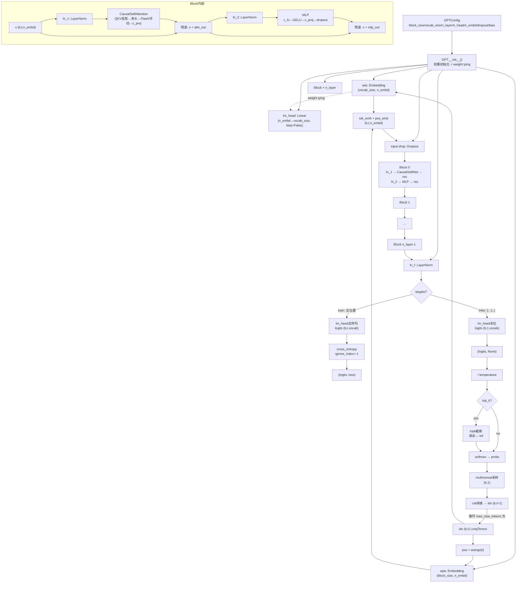
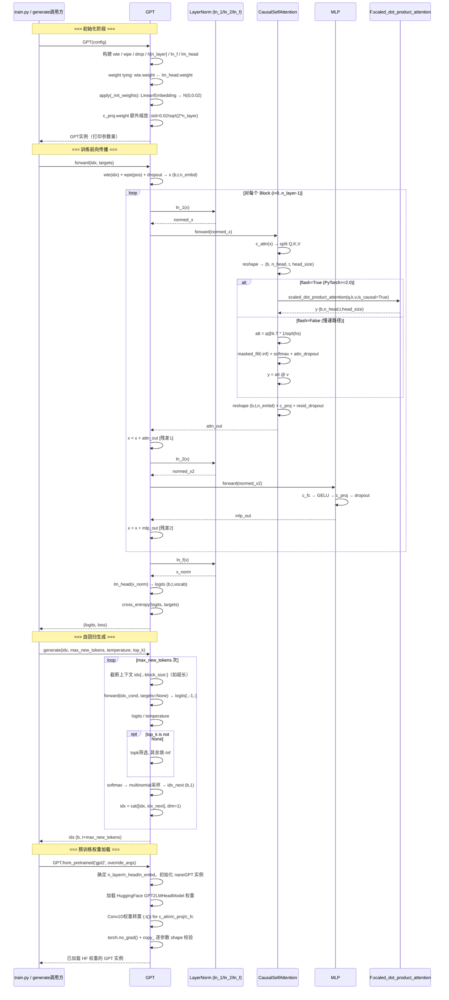
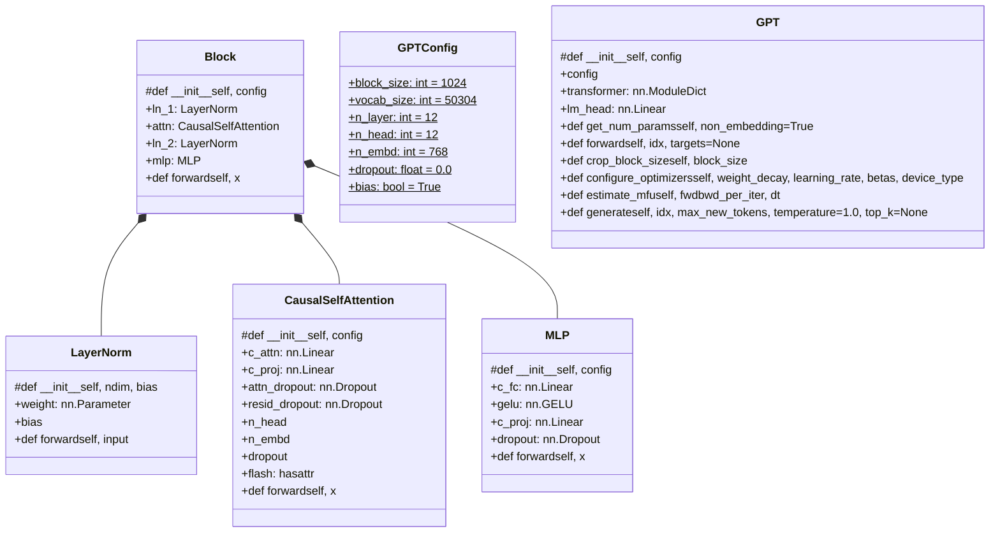
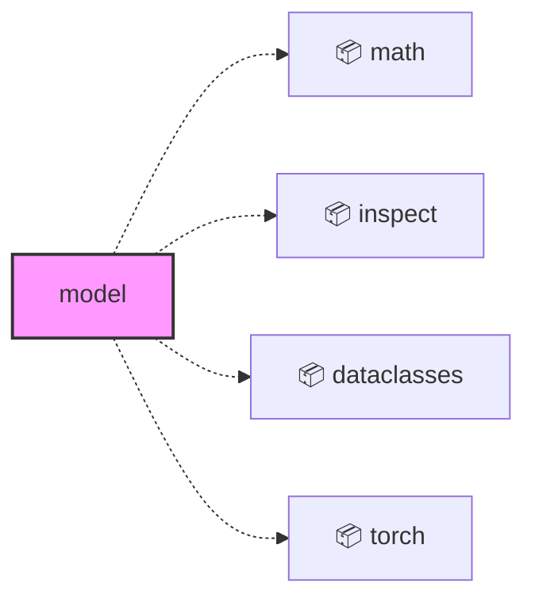
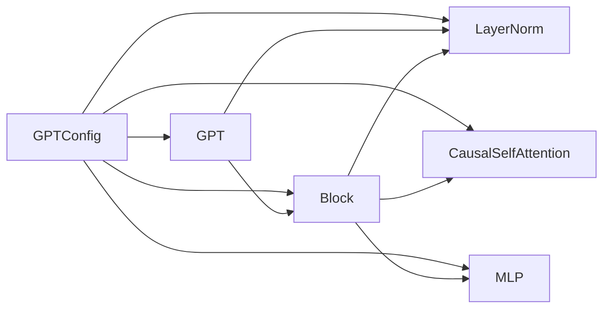
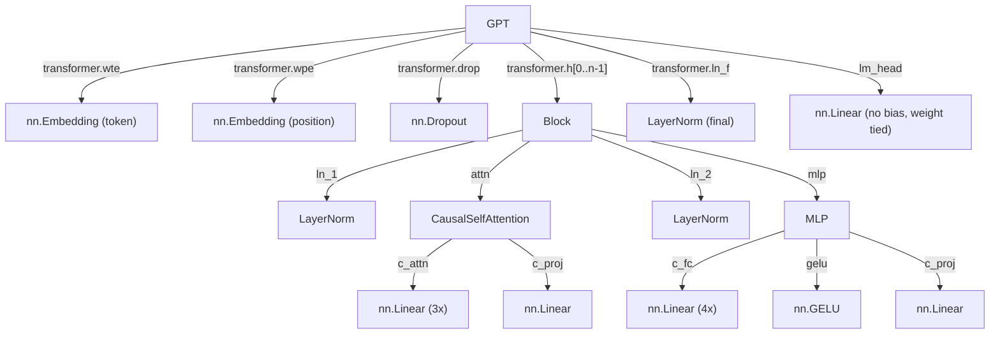

<a id="module-spec"></a>

# model.py

<!-- cross-reference-index: auto generatedAt=2026-04-30T08:18:16.352Z same=0 cross=3 -->

## 相关 Spec

### 跨模块关联

- [bench.py](bench.spec.md#module-spec) - 出站 0，入站 1；示例：bench.py -> model.py
- [sample.py](sample.spec.md#module-spec) - 出站 0，入站 1；示例：sample.py -> model.py
- [train.py](train.spec.md#module-spec) - 出站 0，入站 1；示例：train.py -> model.py


## 1. 意图

这个模块将 token 索引序列转化为词表概率分布，使训练脚本能够以极简代码完整复现 GPT-2 风格的自回归语言模型（从前向传播、预训练权重加载到自回归采样，全部在同一文件内闭环）。

核心职责：
1. **模型结构定义**：在 `model.py:118` 的 `GPT.__init__()` 中构建完整 Transformer 堆栈，包含 token/position 嵌入、`n_layer` 个 `Block`、最终 LayerNorm 和语言模型头
2. **前向传播与损失计算**：`GPT.forward()` 同时承担训练（计算交叉熵损失）和推断（仅解码最后位置 logits）两种模式
3. **预训练权重加载**：`GPT.from_pretrained()` 从 HuggingFace GPT2LMHeadModel 加载权重，处理 Conv1D→Linear 的转置对齐
4. **优化器配置**：`GPT.configure_optimizers()` 按参数维度分离 weight decay 组，并在 CUDA 下启用 fused AdamW
5. **自回归文本生成**：`GPT.generate()` 实现带 temperature 缩放和 top-k 过滤的 autoregressive 解码循环
6. **性能监控**：`GPT.estimate_mfu()` 以 A100 bfloat16 峰值 TFLOPS 为参照单位估算模型算力利用率

---

## 2. 业务逻辑

**阶段 1 — 模型初始化与权重体系**（`GPT.__init__()` in `model.py:118`）

接受 `GPTConfig` 数据类作为唯一入参，按严格的构造顺序将整个 GPT 语言模型的骨架搭建完毕。第一步在 `nn.ModuleDict` 中注册五个子模块键：`wte`（`nn.Embedding(vocab_size, n_embd)`，token 嵌入）、`wpe`（`nn.Embedding(block_size, n_embd)`，绝对位置嵌入）、`drop`（输入 Dropout）、`h`（`nn.ModuleList` 含 `n_layer` 个 `Block`）、`ln_f`（最终 LayerNorm）。第二步执行 **weight tying**：`self.transformer.wte.weight = self.lm_head.weight`，使 token 嵌入矩阵与输出投影矩阵共享同一张量，对 GPT-2 Small 节约约 38.6M 参数。第三步调用 `self.apply(self._init_weights)` 遍历所有子模块：`nn.Linear.weight` 用 N(0, 0.02) 初始化，偏置清零；`nn.Embedding.weight` 同样用 N(0, 0.02) 初始化。第四步对所有参数名以 `c_proj.weight` 结尾的张量施加额外缩放初始化，std 降低至 `0.02 / sqrt(2 * n_layer)`——这遵循 GPT-2 论文的"层深缩放"惯例，防止 `n_layer` 个残差分支累加后方差呈线性增长。初始化完成后立即打印参数总量（调用 `get_num_params()`），为后续训练提供可观测基准。

**阶段 2 — 参数量统计**（`GPT.get_num_params()` in `model.py:155`）

输入：`non_embedding: bool = True`；输出：`int`，模型参数总数。通过 `sum(p.numel() for p in self.parameters())` 遍历所有参数张量获取粗计数。当 `non_embedding=True` 时，减去 `transformer.wpe.weight.numel()`（位置嵌入参数量 `block_size × n_embd`），以反映"模型本体"参数——位置嵌入在大上下文窗口下占比显著，去除后更接近文献中通常引用的参数量。**注意**：此处刻意不减去 `wte.weight`，因为 weight tying 使其实际被 `lm_head` 复用，是计算参数之一；若同时减去会导致误差。此方法既用于初始化日志打印，也可供外部训练脚本动态调用。

**阶段 3 — Layer Normalization 组件**（`LayerNorm.forward()` in `model.py:24`）

`LayerNorm` 是对 `nn.Module` 的薄封装，解决 PyTorch 原生 `nn.LayerNorm` 不支持 `bias=False` 的局限性。初始化时：`self.weight = nn.Parameter(torch.ones(ndim))`（scale 参数，始终存在），`self.bias` 仅在 `bias=True` 时初始化为 `nn.Parameter(torch.zeros(ndim))`，否则保持 `None`。`forward(input: Tensor) -> Tensor` 调用 `F.layer_norm(input, self.weight.shape, self.weight, self.bias, 1e-5)`，直接传入可能为 `None` 的 bias——PyTorch 的函数式 API 接受 `None` bias，而模块 API 不支持此操作。epsilon 硬编码为 `1e-5`，不可通过配置覆盖。该组件在整个模型中有五个实例：`Block.ln_1`、`Block.ln_2`（各 `n_layer` 对）以及最终的 `transformer.ln_f`；`bias` 参数均跟随 `GPTConfig.bias` 统一控制。

**阶段 4 — 嵌入融合**（`GPT.forward()` in `model.py:180`）

输入：`idx` 形状 `(b, t)` 的 `LongTensor`（token 索引）。第一步执行前置断言 `assert t <= self.config.block_size`，超出直接抛 `AssertionError`（不自动截断，调用方负责）。第二步在与 `idx` 相同的设备上生成位置索引 `pos = torch.arange(0, t, dtype=torch.long, device=device)` 形状为 `(t,)`。第三步分别通过 `transformer.wte(idx)` 和 `transformer.wpe(pos)` 得到 token 嵌入 `tok_emb: (b, t, n_embd)` 和位置嵌入 `pos_emb: (t, n_embd)`；PyTorch 广播机制将位置嵌入自动扩展到 batch 维度。第四步执行逐元素相加 `x = tok_emb + pos_emb` 后经 `transformer.drop(x)` 施加输入 Dropout（训练时 `dropout > 0`，推断时自动失效）。融合后的 `x: (b, t, n_embd)` 进入 Block 堆栈。

**阶段 5 — Transformer Block 堆栈（Pre-LN 架构）**（`Block.forward()` in `model.py:100`）

`Block` 实现 Pre-LayerNorm（Pre-LN）变体的 Transformer 块，与原始论文的 Post-LN 相比在深层网络中训练更稳定。核心前向逻辑仅两行：`x = x + self.attn(self.ln_1(x))`（自注意力子层加残差）和 `x = x + self.mlp(self.ln_2(x))`（前馈子层加残差），两者均先归一化再计算。`n_layer`（默认 12）个 Block 在 `GPT.forward()` 的 for 循环中串行执行，每层的输出 `(b, t, n_embd)` 直接作为下一层的输入。残差连接保证梯度在层深上的畅通传播；Pre-LN 结构消除了在 Post-LN 中常见的"最后几层梯度爆炸"问题。Block 内部持有 `ln_1, attn, ln_2, mlp` 四个子模块，全部从 `config` 初始化，参数量约为 `12 * n_embd^2`（每层）。

**阶段 6 — 因果多头自注意力**（`CausalSelfAttention.forward()` in `model.py:57`）

输入：`x: (b, t, n_embd)`；输出：`(b, t, n_embd)`。

**初始化阶段**：`__init__` 中将 Q、K、V 投影合并为单一 `c_attn: nn.Linear(n_embd, 3*n_embd)`，减少矩阵乘法次数；`c_proj: nn.Linear(n_embd, n_embd)` 用于输出投影。关键探测：`self.flash = hasattr(torch.nn.functional, 'scaled_dot_product_attention')`，在 PyTorch < 2.0 时 `flash=False` 并注册因果 mask buffer `self.bias: (1, 1, block_size, block_size)`（下三角全 1 矩阵），同时打印 WARNING。

**forward 阶段**：第一步通过 `c_attn(x)` 一次性得到 `(b, t, 3*n_embd)` 后按 `n_embd` 切分为 Q、K、V 各 `(b, t, n_embd)`；第二步 reshape 并转置为 `(b, n_head, t, head_size)`（`head_size = n_embd // n_head`）。第三步走两条注意力路径之一：

- **Flash Attention 路径**（`self.flash=True`）：调用 `F.scaled_dot_product_attention(q, k, v, attn_mask=None, dropout_p=..., is_causal=True)`，由 CUDA kernel 内部融合 mask 填充、softmax、dropout 为单个算子，内存效率和计算效率均大幅提升；训练时传入 `self.dropout` 作为 `dropout_p`，推断时为 0。
- **慢速注意力路径**（`self.flash=False`）：手动计算注意力得分 `att = (q @ k.transpose(-2, -1)) * (1.0 / math.sqrt(k.size(-1)))`；用 `bias[:,:,:T,:T] == 0` 位置填充 `-inf` 实现因果屏蔽；经 `F.softmax(dim=-1)` 归一化后施加 `attn_dropout`；最后 `att @ v` 得到注意力输出。

第四步将多头输出 transpose 回 `(b, t, n_head, head_size)` 并 `.contiguous().view(b, t, n_embd)` 重组；第五步经 `c_proj` 输出投影后施加 `resid_dropout` 返回。

**阶段 7 — 前馈网络（MLP）**（`MLP.forward()` in `model.py:88`）

输入/输出均为 `(b, t, n_embd)`。MLP 是每个 Block 的"计算主力"，通过内部 4 倍维度扩展提供非线性表达能力。四阶段管线依次为：① `c_fc: nn.Linear(n_embd, 4*n_embd)` 升维投影，将每个 token 的 768 维特征扩展至 3072 维；② `gelu: nn.GELU()` 激活函数（PyTorch 默认 `approximate='none'`，即精确 GELU，非 OpenAI 论文中的 tanh 近似版），引入非线性；③ `c_proj: nn.Linear(4*n_embd, n_embd)` 降维投影还原维度，此层权重接受额外的残差缩放初始化（std = `0.02/sqrt(2*n_layer)`）；④ `dropout: nn.Dropout(config.dropout)` 正则化。相比 ReLU，GELU 的平滑性使梯度在接近零区域不完全截断，有利于信息流动。整个 MLP 参数量约为 `8 * n_embd^2`，是注意力模块的两倍。

**阶段 8 — 输出投影与损失计算**（`GPT.forward()` 后半段 in `model.py:200`）

Transformer 堆栈输出 `x: (b, t, n_embd)` 后，首先经 `transformer.ln_f`（最终 LayerNorm）归一化，再通过 `lm_head: nn.Linear(n_embd, vocab_size, bias=False)` 投影至词表维度。`lm_head` 无偏置且权重与 `wte.weight` 共享（weight tying）。**训练模式**（`targets is not None`）：对全序列所有位置计算完整 logits `(b, t, vocab_size)`，调用 `F.cross_entropy(logits.view(-1, vocab_size), targets.view(-1), ignore_index=-1)` 计算标量损失，`ignore_index=-1` 用于跳过 padding token；返回 `(logits, loss)`。**推断模式**（`targets is None`）：关键优化——通过 `x[:, [-1], :]`（列表索引而非标量索引 `x[:, -1, :]`）只取序列最后一个时间步，保留三维形状 `(b, 1, n_embd)`，避免计算无用位置的 logits，节省 `(T-1)/T` 的 lm_head 计算量；返回 `(logits, None)`。

**阶段 9 — 自回归生成采样**（`GPT.generate()` in `model.py:300`）

输入：条件序列 `idx: (b, t)` LongTensor、`max_new_tokens: int`、`temperature: float = 1.0`、`top_k: Optional[int] = None`；输出：`(b, t + max_new_tokens)` LongTensor。

生成循环每轮执行六步：① **上下文截断**：若 `idx.size(1) > block_size`，取 `idx[:, -block_size:]` 作为模型输入（原始 idx 继续 cat 增长，不截断最终输出）；② **前向推断**：调用 `self(idx_cond)` 取 logits，再切片 `logits[:, -1, :]` 得当前步预测分布 `(b, vocab_size)`；③ **温度缩放**：`logits = logits / temperature`（temperature < 1.0 使分布更集中趋向贪心，temperature > 1.0 增加随机性；趋向 0 退化为 argmax；注意未做数值保护，极小 temperature 可能引发 NaN）；④ **Top-K 截断**（可选）：若 `top_k is not None`，用 `torch.topk` 取前 k 个值，其余位置填充 `-float('Inf')` 后再接 softmax；⑤ **概率采样**：`F.softmax(logits, dim=-1)` 归一化为概率分布，`torch.multinomial(probs, num_samples=1)` 采样单个 token `(b, 1)`；⑥ **序列拼接**：`torch.cat([idx, idx_next], dim=1)` 将新 token 追加到序列末尾，进入下一轮迭代。整个生成过程建议在 `torch.no_grad()` 上下文中运行以节省内存（generate 自身未内置 no_grad）。

**阶段 10 — 上下文长度裁剪**（`GPT.crop_block_size()` in `model.py:220`）

输入：新的 `block_size: int`；无返回值（就地修改模型状态）。此方法允许用户从大 block_size 的预训练 checkpoint 加载后，将模型调整至更小的上下文窗口以节省显存或匹配训练数据。执行步骤：① 断言 `block_size <= self.config.block_size`（只能缩小，不能放大）；② 更新 `self.config.block_size`；③ 截断 `transformer.wpe.weight`：`self.transformer.wpe.weight = nn.Parameter(self.transformer.wpe.weight[:block_size])`；④ 遍历所有 Block，若该 Block 的 `CausalSelfAttention` 有注册 `bias` buffer（即 `self.flash=False` 的慢速路径），同步截断至 `[:, :, :block_size, :block_size]`。此操作在 Flash Attention 可用时只需处理 wpe，因快速路径不使用 mask buffer。

**阶段 11 — 预训练权重加载**（`GPT.from_pretrained()` in `model.py:225`）

类方法，`model_type ∈ {'gpt2', 'gpt2-medium', 'gpt2-large', 'gpt2-xl'}` 分别对应 125M/350M/774M/1558M 参数规模。第一步按 model_type 确定 `n_layer/n_head/n_embd` 组合（如 gpt2: 12/12/768），强制设置 `vocab_size=50257, block_size=1024, bias=True`，用户的 `override_args` 仅允许含 `'dropout'` 键（断言强制），其他超参数无法通过此接口覆盖。第二步从头初始化 nanoGPT 模型实例并统计参数量。第三步加载 HuggingFace `GPT2LMHeadModel` 权重字典，过滤掉 `.attn.masked_bias` 和 `.attn.bias` 等非权重 buffer。第四步进行 **Conv1D 到 Linear 的转置适配**：HuggingFace GPT-2 使用自定义 `Conv1D` 层，其权重存储形状为 `(in_features, out_features)` 而非 PyTorch `nn.Linear` 的 `(out_features, in_features)`；需对 `c_attn.weight`、`c_proj.weight`、`c_fc.weight`、`c_proj.weight`（MLP）执行 `.t()`（转置）后再 copy。第五步使用 `torch.no_grad()` 上下文逐一 `copy_` 参数，进行严格的 shape 断言验证。整个过程不依赖本地缓存自动管理，由 HuggingFace `transformers` 库处理 checkpoint 下载与缓存。

**阶段 12 — 分组 Weight Decay 优化器配置**（`GPT.configure_optimizers()` in `model.py:275`）

输入：`weight_decay, learning_rate, betas, device_type`；输出：`torch.optim.AdamW` 实例。参数分组逻辑：遍历所有命名参数（`self.named_parameters()`），按张量维度拆分为两组：`dim >= 2` 的参数（权重矩阵 `nn.Linear.weight`、`nn.Embedding.weight`）施加 `weight_decay`；`dim < 2` 的参数（所有偏置 `bias`、`LayerNorm.weight` 和 `LayerNorm.bias`）设置 `weight_decay=0.0`。这一策略来自 GPT-2 论文与 Chinchilla 实践：归一化层的 scale/shift 参数和偏置不应被正则化收缩。分组完成后，通过 `inspect.signature(torch.optim.AdamW).parameters` 检测 `fused` 参数是否存在（PyTorch >= 2.0 提供 fused AdamW 实现），在 `device_type == 'cuda'` 时启用 `fused=True`——fused AdamW 将参数更新的多个操作融合为单 CUDA kernel，显著提升大模型训练吞吐量。最终用 `[decay_group, no_decay_group]` 构造 `torch.optim.AdamW`。

**阶段 13 — 模型利用率估算**（`GPT.estimate_mfu()` in `model.py:295`）

输入：`fwdbwd_per_iter: int`（每次迭代的前向+后向次数，通常为 1）、`dt: float`（单次迭代的墙钟时间，单位秒）；输出：`float`，MFU（Model FLOPs Utilization）。计算公式来自 PaLM 论文：每次前向传播的理论 FLOPs 约为 `6 * N * T`（`N` = 参数量，`T` = 序列长度），再乘以 `fwdbwd_per_iter`（考虑反向传播）；实际 FLOP/s = `FLOPs / dt`；MFU = 实际 FLOP/s / 硬编码的 A100 bfloat16 峰值算力 `312e12 TFLOPS`。此方法提供"硬件效率"的粗略但直观的指标——MFU 0.4~0.6 对于中等规模模型属于合理范围。硬编码的 A100 参考算力意味着在其他 GPU 上计算的 MFU 数值仅供相对对比，不代表真实硬件利用率。

---





## 3. 接口定义

| 名称 | 类型 | 签名 | 说明 |
|------|------|------|------|
| `LayerNorm` | class | `LayerNorm(ndim: int, bias: bool)` | 扩展 `nn.Module`，提供可选偏置的 Layer Normalization；`bias=False` 时内部 `self.bias` 为 `None`，在 `forward()` 中传给 `F.layer_norm` |
| `LayerNorm.forward` | method | `forward(input: Tensor) -> Tensor` | 调用 `F.layer_norm` 并传入 `self.weight` 和可能为 `None` 的 `self.bias`，epsilon 固定为 `1e-5` |
| `CausalSelfAttention` | class | `CausalSelfAttention(config: GPTConfig)` | 多头因果自注意力模块；初始化时检测 `scaled_dot_product_attention` 可用性，旧 PyTorch 版本注册因果 mask buffer |
| `CausalSelfAttention.forward` | method | `forward(x: Tensor) -> Tensor` | 输入 `(B, T, C)` → 输出 `(B, T, C)`；内部 QKV 一体投影后分割，Flash 或手动两路 |
| `MLP` | class | `MLP(config: GPTConfig)` | 4x 扩展的前馈网络，GELU 激活，含 Dropout 正则化 |
| `MLP.forward` | method | `forward(x: Tensor) -> Tensor` | 输入/输出均为 `(B, T, n_embd)`；4步管线：`c_fc → gelu → c_proj → dropout` |
| `Block` | class | `Block(config: GPTConfig)` | Pre-LayerNorm Transformer block，内部持有 `ln_1, attn, ln_2, mlp` 四个子模块 |
| `Block.forward` | method | `forward(x: Tensor) -> Tensor` | 执行 `x = x + attn(ln_1(x))` 后 `x = x + mlp(ln_2(x))`，形状保持不变 |
| `GPTConfig` | dataclass | `GPTConfig(block_size, vocab_size, n_layer, n_head, n_embd, dropout, bias)` | 所有字段有默认值，可直接用关键字参数覆盖；是传入 `GPT.__init__` 的唯一配置来源 |
| `GPT` | class | `GPT(config: GPTConfig)` | 顶层模型类；初始化时打印参数量，应用分层权重初始化，执行 weight tying |
| `GPT.get_num_params` | method | `get_num_params(non_embedding: bool = True) -> int` | 统计参数量；`non_embedding=True` 时减去 `wpe` 参数（`wte` 因 weight tying 不减）|
| `GPT.forward` | method | `forward(idx: LongTensor, targets: Optional[LongTensor] = None) -> Tuple[Tensor, Optional[Tensor]]` | 返回 `(logits, loss)`；训练时 loss 为交叉熵，推断时为 `None` |
| `GPT.crop_block_size` | method | `crop_block_size(block_size: int) -> None` | 就地截断 `wpe.weight` 和各 Block 的 causal mask buffer，用于加载大模型后降低上下文长度 |
| `GPT.from_pretrained` | classmethod | `from_pretrained(cls, model_type: str, override_args: Optional[dict] = None) -> GPT` | 从 HuggingFace 加载 GPT-2 系列权重；`override_args` 只允许 `dropout` 键 |
| `GPT.configure_optimizers` | method | `configure_optimizers(weight_decay: float, learning_rate: float, betas: Tuple, device_type: str) -> torch.optim.AdamW` | 分组 weight decay，CUDA 下启用 fused AdamW |
| `GPT.estimate_mfu` | method | `estimate_mfu(fwdbwd_per_iter: int, dt: float) -> float` | 以 A100 bfloat16 312 TFLOPS 为参照，返回浮点利用率（0~1）|
| `GPT.generate` | method | `generate(idx: LongTensor, max_new_tokens: int, temperature: float = 1.0, top_k: Optional[int] = None) -> LongTensor` | 自回归采样，返回拼接后的完整 token 序列 `(b, t + max_new_tokens)` |

---

---

### 完整接口参考（AST 精确提取）

### model.py

| 名称 | 类型 | 签名 | 成员数 |
|------|------|------|--------|
| `LayerNorm` | class | `class LayerNorm(nn.Module)` | 4 |
| `CausalSelfAttention` | class | `class CausalSelfAttention(nn.Module)` | 10 |
| `MLP` | class | `class MLP(nn.Module)` | 6 |
| `Block` | class | `class Block(nn.Module)` | 6 |
| `GPTConfig` | class | `class GPTConfig` | 7 |
| `GPT` | class | `class GPT(nn.Module)` | 11 |

**LayerNorm 成员**

| 成员 | 类型 | 签名 | 可见性 |
|------|------|------|--------|
| `__init__` | method | `def __init__(self, ndim, bias)` | protected |
| `weight` | property | `weight: nn.Parameter` | public |
| `bias` | property | `bias` | public |
| `forward` | method | `def forward(self, input)` | public |

**CausalSelfAttention 成员**

| 成员 | 类型 | 签名 | 可见性 |
|------|------|------|--------|
| `__init__` | method | `def __init__(self, config)` | protected |
| `c_attn` | property | `c_attn: nn.Linear` | public |
| `c_proj` | property | `c_proj: nn.Linear` | public |
| `attn_dropout` | property | `attn_dropout: nn.Dropout` | public |
| `resid_dropout` | property | `resid_dropout: nn.Dropout` | public |
| `n_head` | property | `n_head` | public |
| `n_embd` | property | `n_embd` | public |
| `dropout` | property | `dropout` | public |
| `flash` | property | `flash: hasattr` | public |
| `forward` | method | `def forward(self, x)` | public |

**MLP 成员**

| 成员 | 类型 | 签名 | 可见性 |
|------|------|------|--------|
| `__init__` | method | `def __init__(self, config)` | protected |
| `c_fc` | property | `c_fc: nn.Linear` | public |
| `gelu` | property | `gelu: nn.GELU` | public |
| `c_proj` | property | `c_proj: nn.Linear` | public |
| `dropout` | property | `dropout: nn.Dropout` | public |
| `forward` | method | `def forward(self, x)` | public |

**Block 成员**

| 成员 | 类型 | 签名 | 可见性 |
|------|------|------|--------|
| `__init__` | method | `def __init__(self, config)` | protected |
| `ln_1` | property | `ln_1: LayerNorm` | public |
| `attn` | property | `attn: CausalSelfAttention` | public |
| `ln_2` | property | `ln_2: LayerNorm` | public |
| `mlp` | property | `mlp: MLP` | public |
| `forward` | method | `def forward(self, x)` | public |

**GPTConfig 成员**

| 成员 | 类型 | 签名 | 可见性 |
|------|------|------|--------|
| `block_size` | property | `block_size: int = 1024` | public |
| `vocab_size` | property | `vocab_size: int = 50304` | public |
| `n_layer` | property | `n_layer: int = 12` | public |
| `n_head` | property | `n_head: int = 12` | public |
| `n_embd` | property | `n_embd: int = 768` | public |
| `dropout` | property | `dropout: float = 0.0` | public |
| `bias` | property | `bias: bool = True` | public |

**GPT 成员**

| 成员 | 类型 | 签名 | 可见性 |
|------|------|------|--------|
| `__init__` | method | `def __init__(self, config)` | protected |
| `config` | property | `config` | public |
| `transformer` | property | `transformer: nn.ModuleDict` | public |
| `lm_head` | property | `lm_head: nn.Linear` | public |
| `get_num_params` | method | `def get_num_params(self, non_embedding=True)` | public |
| `forward` | method | `def forward(self, idx, targets=None)` | public |
| `crop_block_size` | method | `def crop_block_size(self, block_size)` | public |
| `from_pretrained` | classmethod | `def from_pretrained(cls, model_type, override_args=None)` | public |
| `configure_optimizers` | method | `def configure_optimizers(self, weight_decay, learning_rate, betas, device_type)` | public |
| `estimate_mfu` | method | `def estimate_mfu(self, fwdbwd_per_iter, dt)` | public |
| `generate` | method | `def generate(self, idx, max_new_tokens, temperature=1.0, top_k=None)` | public |

### 模块类图



### 依赖关系图




## 4. 数据结构

```python
@dataclass
class GPTConfig:
    block_size: int   = 1024    # 最大序列长度（上下文窗口）
    vocab_size: int   = 50304   # 词表大小（50257 向上对齐至 64 的倍数）
    n_layer:    int   = 12      # Transformer Block 层数
    n_head:     int   = 12      # 多头注意力头数
    n_embd:     int   = 768     # 嵌入维度
    dropout:    float = 0.0     # Dropout 比率（推断时自动关闭）
    bias:       bool  = True    # Linear 和 LayerNorm 是否使用偏置
```

| 字段 | 类型 | 说明 |
|------|------|------|
| `block_size` | `int` | 决定 `wpe` 嵌入矩阵大小和因果 mask buffer 大小；`crop_block_size` 可就地缩减 |
| `vocab_size` | `int` | 填充至 64 的倍数（50304）以提升 CUDA 矩阵乘法效率 |
| `n_layer` | `int` | 影响残差投影初始化 std（`0.02/sqrt(2*n_layer)`） |
| `n_head` | `int` | 必须整除 `n_embd`，在 `CausalSelfAttention.__init__` 断言检查 |
| `n_embd` | `int` | 所有层的统一隐藏维度，MLP 内部扩展至 `4*n_embd` |
| `dropout` | `float` | 在 `attn_dropout`、`resid_dropout`、输入 `drop`、MLP `dropout` 中共用同一值 |
| `bias` | `bool` | `False` 时去除所有 Linear 和 LayerNorm 的 bias，速度更快精度略好 |

**GPT 内部 `transformer` ModuleDict 结构**：

| 键 | 类型 | 形状 | 说明 |
|----|------|------|------|
| `wte` | `nn.Embedding` | `(vocab_size, n_embd)` | Token 嵌入，权重与 `lm_head` 共享 |
| `wpe` | `nn.Embedding` | `(block_size, n_embd)` | 绝对位置嵌入 |
| `drop` | `nn.Dropout` | — | 输入嵌入 Dropout |
| `h` | `nn.ModuleList` | `n_layer × Block` | Transformer Block 列表 |
| `ln_f` | `LayerNorm` | `(n_embd,)` | 最终 LayerNorm，在 lm_head 前应用 |

---

---

### 完整字段定义（AST 精确提取）

#### `LayerNorm` (class) — model.py

**字段**

| 字段名 | 类型/签名 | 可见性 |
|--------|-----------|--------|
| `weight` | `weight: nn.Parameter` | public |
| `bias` | `bias` | public |

**方法**

| 方法名 | 签名 | 可见性 |
|--------|------|--------|
| `__init__` | `def __init__(self, ndim, bias)` | protected |
| `forward` | `def forward(self, input)` | public |

#### `CausalSelfAttention` (class) — model.py

**字段**

| 字段名 | 类型/签名 | 可见性 |
|--------|-----------|--------|
| `c_attn` | `c_attn: nn.Linear` | public |
| `c_proj` | `c_proj: nn.Linear` | public |
| `attn_dropout` | `attn_dropout: nn.Dropout` | public |
| `resid_dropout` | `resid_dropout: nn.Dropout` | public |
| `n_head` | `n_head` | public |
| `n_embd` | `n_embd` | public |
| `dropout` | `dropout` | public |
| `flash` | `flash: hasattr` | public |

**方法**

| 方法名 | 签名 | 可见性 |
|--------|------|--------|
| `__init__` | `def __init__(self, config)` | protected |
| `forward` | `def forward(self, x)` | public |

#### `MLP` (class) — model.py

**字段**

| 字段名 | 类型/签名 | 可见性 |
|--------|-----------|--------|
| `c_fc` | `c_fc: nn.Linear` | public |
| `gelu` | `gelu: nn.GELU` | public |
| `c_proj` | `c_proj: nn.Linear` | public |
| `dropout` | `dropout: nn.Dropout` | public |

**方法**

| 方法名 | 签名 | 可见性 |
|--------|------|--------|
| `__init__` | `def __init__(self, config)` | protected |
| `forward` | `def forward(self, x)` | public |

#### `Block` (class) — model.py

**字段**

| 字段名 | 类型/签名 | 可见性 |
|--------|-----------|--------|
| `ln_1` | `ln_1: LayerNorm` | public |
| `attn` | `attn: CausalSelfAttention` | public |
| `ln_2` | `ln_2: LayerNorm` | public |
| `mlp` | `mlp: MLP` | public |

**方法**

| 方法名 | 签名 | 可见性 |
|--------|------|--------|
| `__init__` | `def __init__(self, config)` | protected |
| `forward` | `def forward(self, x)` | public |

#### `GPTConfig` (class) — model.py

**字段**

| 字段名 | 类型/签名 | 可见性 |
|--------|-----------|--------|
| `block_size` | `block_size: int = 1024` | public |
| `vocab_size` | `vocab_size: int = 50304` | public |
| `n_layer` | `n_layer: int = 12` | public |
| `n_head` | `n_head: int = 12` | public |
| `n_embd` | `n_embd: int = 768` | public |
| `dropout` | `dropout: float = 0.0` | public |
| `bias` | `bias: bool = True` | public |

#### `GPT` (class) — model.py

**字段**

| 字段名 | 类型/签名 | 可见性 |
|--------|-----------|--------|
| `config` | `config` | public |
| `transformer` | `transformer: nn.ModuleDict` | public |
| `lm_head` | `lm_head: nn.Linear` | public |

**方法**

| 方法名 | 签名 | 可见性 |
|--------|------|--------|
| `__init__` | `def __init__(self, config)` | protected |
| `get_num_params` | `def get_num_params(self, non_embedding=True)` | public |
| `forward` | `def forward(self, idx, targets=None)` | public |
| `crop_block_size` | `def crop_block_size(self, block_size)` | public |
| `from_pretrained` | `def from_pretrained(cls, model_type, override_args=None)` | public |
| `configure_optimizers` | `def configure_optimizers(self, weight_decay, learning_rate, betas, device_type)` | public |
| `estimate_mfu` | `def estimate_mfu(self, fwdbwd_per_iter, dt)` | public |
| `generate` | `def generate(self, idx, max_new_tokens, temperature=1.0, top_k=None)` | public |

## 5. 约束条件

| 约束 | 值 | 说明 |
|------|----|------|
| LayerNorm epsilon | `1e-5` | 硬编码在 `LayerNorm.forward()` 中，不可配置 |
| 默认 block_size | `1024` | `GPTConfig` 默认值；HuggingFace 加载时强制为 1024 |
| 默认 vocab_size | `50304` | GPT-2 原始 50257 向上对齐至 64 的倍数 |
| HuggingFace 加载 vocab_size | `50257` | `from_pretrained` 强制覆盖为 50257，忽略 config 默认值 |
| 权重初始化 std | `0.02` | 所有 `nn.Linear.weight` 和 `nn.Embedding.weight` |
| 残差投影缩放 std | `0.02 / sqrt(2 * n_layer)` | 仅对 `c_proj.weight` 应用，防止深层残差方差爆炸 |
| MFU 参考峰值算力 | `312e12` TFLOPS | A100 bfloat16 峰值，`estimate_mfu` 硬编码 |
| Flash Attention 要求 | PyTorch >= 2.0 | 通过 `hasattr(F, 'scaled_dot_product_attention')` 检测 |
| override_args 允许键 | 仅 `'dropout'` | `from_pretrained` 断言强制，其他超参数不可覆盖 |
| `crop_block_size` 方向 | 只能缩小 | `assert block_size <= self.config.block_size`，不可放大 |

---

## 6. 边界条件

- **`t > block_size`**：`GPT.forward()` 中执行 `assert t <= self.config.block_size`，直接抛出 `AssertionError`，不做自动截断
- **`generate()` 上下文溢出**：生成循环中若 `idx.size(1) > block_size`，自动截取 `idx[:, -block_size:]` 作为上下文输入，原始 idx 继续增长
- **`targets=None` 推断模式**：`loss` 返回 `None`；lm_head 仅在 `x[:, [-1], :]`（用列表保持维度）上计算，节省 `(T-1)/T` 的计算量
- **`bias=False` 配置**：`LayerNorm.forward` 传入 `bias=None` 给 `F.layer_norm`，PyTorch 原生不支持此参数形式，故用自定义类解决
- **Flash Attention 不可用**：注册 `(1, 1, block_size, block_size)` 的下三角 mask buffer，手动实现因果 mask 填充 `-inf`；会打印 WARNING 提示
- **`top_k=None`**：generate 中跳过 top-k 过滤，直接对全词表 softmax 采样
- **`temperature → 0`**：logits 除以极小值趋于 ±∞，softmax 后退化为 argmax（贪心解码）；未做数值保护 [推断：可能导致 NaN，建议调用方保证 temperature > 0]
- **非 CUDA 设备**：`configure_optimizers` 检测 `device_type == 'cuda'` 后才启用 fused AdamW；CPU/MPS 使用标准 AdamW
- **`get_num_params(non_embedding=True)`**：减去 `wpe.weight` 参数量，但**不减** `wte.weight`，因 weight tying 使 `wte` 参数实际被 `lm_head` 复用
- **weight tying + `torch.compile()`**：代码注释中标记此组合会产生 `UserWarning: functional_call was passed multiple values for tied weights`，目前标注为 TODO 待调查

---

## 7. 技术债务

| 项目 | 严重程度 | 描述 |
|------|----------|------|
| weight tying + compile() 警告 | 低 | `__init__` 中有 TODO 注释，运行时产生 UserWarning 但暂时无害；torch.compile 对绑定权重的处理存在边界行为 |
| `estimate_mfu` 硬编码 A100 TFLOPS | 低 | `312e12` 硬编码，无法反映 H100/RTX4090 等其他 GPU 的真实峰值算力，不同硬件下 MFU 数值无可比性 |
| `from_pretrained` 只允许 `dropout` 覆盖 | 中 | 断言 `all(k == 'dropout' for k in override_args)` 过于严格；若需以不同 `n_head`/`n_embd` 加载截断权重时无法通过 API 实现 |
| 惰性导入 `transformers` | 低 | `from transformers import GPT2LMHeadModel` 在 `from_pretrained` 函数体内执行，未在顶层导入；依赖在模块级不可见，工具链静态分析无法检测缺失 |
| 手动慢速注意力路径维护成本 | 低 | Flash Attention 已是生产标准，慢速路径仅为向后兼容 PyTorch < 2.0，但仍需维护两条代码路径和 mask buffer |
| `forward()` 中 `loss = None` 分支 | 低 | 推断路径下 `loss` 变量从未赋值，靠逻辑保证返回 `None`，类型注解缺失；严格类型检查工具（mypy）会报告 `possibly unbound` |
| `generate()` temperature 无下界保护 | 中 | `temperature=0` 或负值会导致 logits 出现 ±∞，softmax 可能产生 NaN；调用方需自行保证 `temperature > 0` |
| 固定 `vocab_size=50304` 与加载时 `50257` 不一致 | 低 | config 默认 50304 但 `from_pretrained` 强制改为 50257；模型从头训练与加载预训练时 vocab 维度不同，混用时需注意 |

---

## 8. 测试覆盖

当前代码库中 `model.py` 无对应测试文件（基于提供的代码结构未发现 `test_model.py` 或类似文件）。建议测试用例如下：

**单元测试（各子模块）**：
- `LayerNorm`：验证 `bias=True` 和 `bias=False` 两种模式下输出形状与均值/方差归一化正确性
- `CausalSelfAttention`：验证 Flash/手动两条路径输出在相同随机种子下数值等价；验证因果性（上三角位置的注意力权重为 0）
- `MLP`：验证输入输出形状为 `(b, t, n_embd)`，中间扩展至 4x
- `Block`：验证残差连接不改变形状；验证 Pre-LN 的计算顺序

**集成测试（GPT 全量）**：
- `forward()` 训练模式：任意 `(b, t)` 输入 + targets，loss 为标量且为正
- `forward()` 推断模式：loss 为 None，logits 形状为 `(b, 1, vocab_size)`
- `forward()` 序列长度溢出：`t > block_size` 时断言触发
- `get_num_params()`：GPT-2 124M 配置下非嵌入参数量接近 124M（约 85M + wpe 参数量）
- `crop_block_size()`：裁剪后 forward 传入更小序列不报错；尝试放大抛出 AssertionError
- `configure_optimizers()`：decay/no-decay 参数分组正确（biases 不衰减，权重衰减）
- `estimate_mfu()`：验证 GPT-2 124M 在合理 dt 下 MFU 在 0~1 范围内

**参数化测试**：
- 用 `GPTConfig(n_layer=2, n_head=2, n_embd=64, block_size=32, vocab_size=256)` 小模型跑所有路径，节约测试时间
- `generate()` 覆盖：`temperature=1.0/top_k=None`、`temperature=0.7/top_k=40`、上下文超出 `block_size` 后自动截断

---

## 9. 依赖关系

**外部依赖**：

| 包 | 引入方式 | 用途 |
|----|----------|------|
| `torch` | `import torch` | 张量操作、参数、优化器 |
| `torch.nn` | `import torch.nn as nn` | `Module`、`Linear`、`Embedding`、`Dropout`、`GELU`、`Parameter` |
| `torch.nn.functional` | `from torch.nn import functional as F` | `layer_norm`、`scaled_dot_product_attention`、`softmax`、`cross_entropy` |
| `math` | `import math` | `math.sqrt`（注意力缩放、初始化 std） |
| `inspect` | `import inspect` | 运行时检测 `AdamW` 是否支持 `fused` 参数 |
| `dataclasses.dataclass` | `from dataclasses import dataclass` | `GPTConfig` 数据类装饰器 |
| `transformers` | 惰性导入（`from_pretrained` 内部） | `GPT2LMHeadModel` 加载 HuggingFace 预训练权重 |

**内部模块间依赖**：



**组合关系（运行时实例持有）**：



---

## 附录：文件清单

| 文件 | 行数 | 主要用途 |
|------|------|----------|
| `model.py` | 331 | 导出 LayerNorm, CausalSelfAttention, MLP, Block, GPTConfig, GPT |


<!-- baseline-skeleton: {"filePath":"model.py","language":"python","loc":331,"exports":[{"name":"LayerNorm","kind":"class","signature":"class LayerNorm(nn.Module)","jsDoc":"LayerNorm but with an optional bias. PyTorch doesn't support simply bias=False","isDefault":false,"startLine":18,"endLine":27,"members":[{"name":"__init__","kind":"method","signature":"def __init__(self, ndim, bias)","jsDoc":null,"visibility":"protected","isStatic":false},{"name":"weight","kind":"property","signature":"weight: nn.Parameter","jsDoc":null,"visibility":"public","isStatic":false},{"name":"bias","kind":"property","signature":"bias","jsDoc":null,"visibility":"public","isStatic":false},{"name":"forward","kind":"method","signature":"def forward(self, input)","jsDoc":null,"visibility":"public","isStatic":false}]},{"name":"CausalSelfAttention","kind":"class","signature":"class CausalSelfAttention(nn.Module)","jsDoc":null,"isDefault":false,"startLine":29,"endLine":76,"members":[{"name":"__init__","kind":"method","signature":"def __init__(self, config)","jsDoc":null,"visibility":"protected","isStatic":false},{"name":"c_attn","kind":"property","signature":"c_attn: nn.Linear","jsDoc":null,"visibility":"public","isStatic":false},{"name":"c_proj","kind":"property","signature":"c_proj: nn.Linear","jsDoc":null,"visibility":"public","isStatic":false},{"name":"attn_dropout","kind":"property","signature":"attn_dropout: nn.Dropout","jsDoc":null,"visibility":"public","isStatic":false},{"name":"resid_dropout","kind":"property","signature":"resid_dropout: nn.Dropout","jsDoc":null,"visibility":"public","isStatic":false},{"name":"n_head","kind":"property","signature":"n_head","jsDoc":null,"visibility":"public","isStatic":false},{"name":"n_embd","kind":"property","signature":"n_embd","jsDoc":null,"visibility":"public","isStatic":false},{"name":"dropout","kind":"property","signature":"dropout","jsDoc":null,"visibility":"public","isStatic":false},{"name":"flash","kind":"property","signature":"flash: hasattr","jsDoc":null,"visibility":"public","isStatic":false},{"name":"forward","kind":"method","signature":"def forward(self, x)","jsDoc":null,"visibility":"public","isStatic":false}]},{"name":"MLP","kind":"class","signature":"class MLP(nn.Module)","jsDoc":null,"isDefault":false,"startLine":78,"endLine":92,"members":[{"name":"__init__","kind":"method","signature":"def __init__(self, config)","jsDoc":null,"visibility":"protected","isStatic":false},{"name":"c_fc","kind":"property","signature":"c_fc: nn.Linear","jsDoc":null,"visibility":"public","isStatic":false},{"name":"gelu","kind":"property","signature":"gelu: nn.GELU","jsDoc":null,"visibility":"public","isStatic":false},{"name":"c_proj","kind":"property","signature":"c_proj: nn.Linear","jsDoc":null,"visibility":"public","isStatic":false},{"name":"dropout","kind":"property","signature":"dropout: nn.Dropout","jsDoc":null,"visibility":"public","isStatic":false},{"name":"forward","kind":"method","signature":"def forward(self, x)","jsDoc":null,"visibility":"public","isStatic":false}]},{"name":"Block","kind":"class","signature":"class Block(nn.Module)","jsDoc":null,"isDefault":false,"startLine":94,"endLine":106,"members":[{"name":"__init__","kind":"method","signature":"def __init__(self, config)","jsDoc":null,"visibility":"protected","isStatic":false},{"name":"ln_1","kind":"property","signature":"ln_1: LayerNorm","jsDoc":null,"visibility":"public","isStatic":false},{"name":"attn","kind":"property","signature":"attn: CausalSelfAttention","jsDoc":null,"visibility":"public","isStatic":false},{"name":"ln_2","kind":"property","signature":"ln_2: LayerNorm","jsDoc":null,"visibility":"public","isStatic":false},{"name":"mlp","kind":"property","signature":"mlp: MLP","jsDoc":null,"visibility":"public","isStatic":false},{"name":"forward","kind":"method","signature":"def forward(self, x)","jsDoc":null,"visibility":"public","isStatic":false}]},{"name":"GPTConfig","kind":"class","signature":"class GPTConfig","jsDoc":null,"isDefault":false,"startLine":108,"endLine":116,"members":[{"name":"block_size","kind":"property","signature":"block_size: int = 1024","jsDoc":null,"visibility":"public","isStatic":true},{"name":"vocab_size","kind":"property","signature":"vocab_size: int = 50304","jsDoc":null,"visibility":"public","isStatic":true},{"name":"n_layer","kind":"property","signature":"n_layer: int = 12","jsDoc":null,"visibility":"public","isStatic":true},{"name":"n_head","kind":"property","signature":"n_head: int = 12","jsDoc":null,"visibility":"public","isStatic":true},{"name":"n_embd","kind":"property","signature":"n_embd: int = 768","jsDoc":null,"visibility":"public","isStatic":true},{"name":"dropout","kind":"property","signature":"dropout: float = 0.0","jsDoc":null,"visibility":"public","isStatic":true},{"name":"bias","kind":"property","signature":"bias: bool = True","jsDoc":null,"visibility":"public","isStatic":true}]},{"name":"GPT","kind":"class","signature":"class GPT(nn.Module)","jsDoc":null,"isDefault":false,"startLine":118,"endLine":330,"members":[{"name":"__init__","kind":"method","signature":"def __init__(self, config)","jsDoc":null,"visibility":"protected","isStatic":false},{"name":"config","kind":"property","signature":"config","jsDoc":null,"visibility":"public","isStatic":false},{"name":"transformer","kind":"property","signature":"transformer: nn.ModuleDict","jsDoc":null,"visibility":"public","isStatic":false},{"name":"lm_head","kind":"property","signature":"lm_head: nn.Linear","jsDoc":null,"visibility":"public","isStatic":false},{"name":"get_num_params","kind":"method","signature":"def get_num_params(self, non_embedding=True)","jsDoc":"Return the number of parameters in the model.","visibility":"public","isStatic":false},{"name":"forward","kind":"method","signature":"def forward(self, idx, targets=None)","jsDoc":null,"visibility":"public","isStatic":false},{"name":"crop_block_size","kind":"method","signature":"def crop_block_size(self, block_size)","jsDoc":null,"visibility":"public","isStatic":false},{"name":"from_pretrained","kind":"classmethod","signature":"def from_pretrained(cls, model_type, override_args=None)","jsDoc":null,"visibility":"public","isStatic":false},{"name":"configure_optimizers","kind":"method","signature":"def configure_optimizers(self, weight_decay, learning_rate, betas, device_type)","jsDoc":null,"visibility":"public","isStatic":false},{"name":"estimate_mfu","kind":"method","signature":"def estimate_mfu(self, fwdbwd_per_iter, dt)","jsDoc":"estimate model flops utilization (MFU) in units of A100 bfloat16 peak FLOPS","visibility":"public","isStatic":false},{"name":"generate","kind":"method","signature":"def generate(self, idx, max_new_tokens, temperature=1.0, top_k=None)","jsDoc":"Take a conditioning sequence of indices idx (LongTensor of shape (b,t)) and complete","visibility":"public","isStatic":false}]}],"imports":[{"moduleSpecifier":"math","isRelative":false,"resolvedPath":null,"isTypeOnly":false},{"moduleSpecifier":"inspect","isRelative":false,"resolvedPath":null,"isTypeOnly":false},{"moduleSpecifier":"dataclasses","isRelative":false,"resolvedPath":null,"namedImports":["dataclasses","dataclass"],"isTypeOnly":false},{"moduleSpecifier":"torch","isRelative":false,"resolvedPath":null,"isTypeOnly":false},{"moduleSpecifier":"torch.nn","isRelative":false,"resolvedPath":null,"isTypeOnly":false},{"moduleSpecifier":"torch.nn","isRelative":false,"resolvedPath":null,"namedImports":["torch.nn","functional"],"isTypeOnly":false}],"moduleDoc":"Full definition of a GPT Language Model, all of it in this single file.","hash":"7c01703240dbec5d554527dc666e35b3df8391d0b117fddc07afcf325a21d11c","analyzedAt":"2026-04-30T08:05:23.070Z","parserUsed":"tree-sitter"} -->
