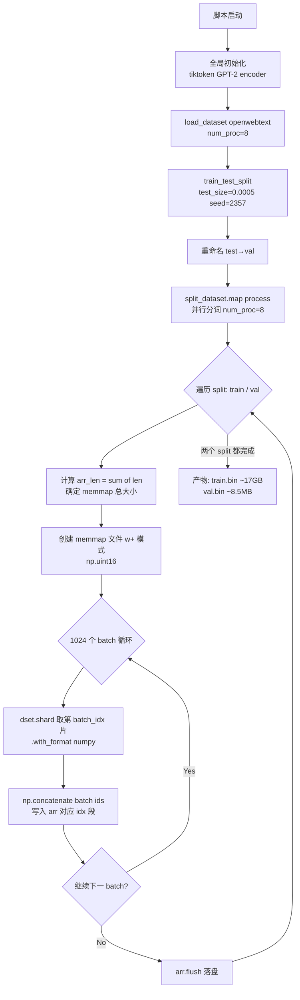
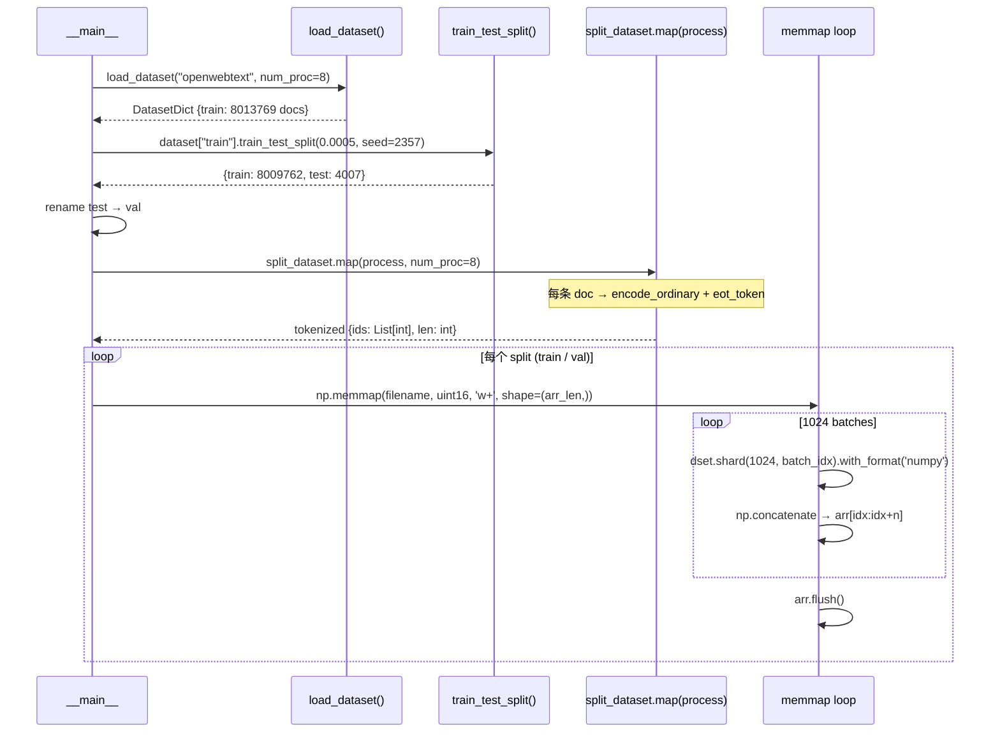
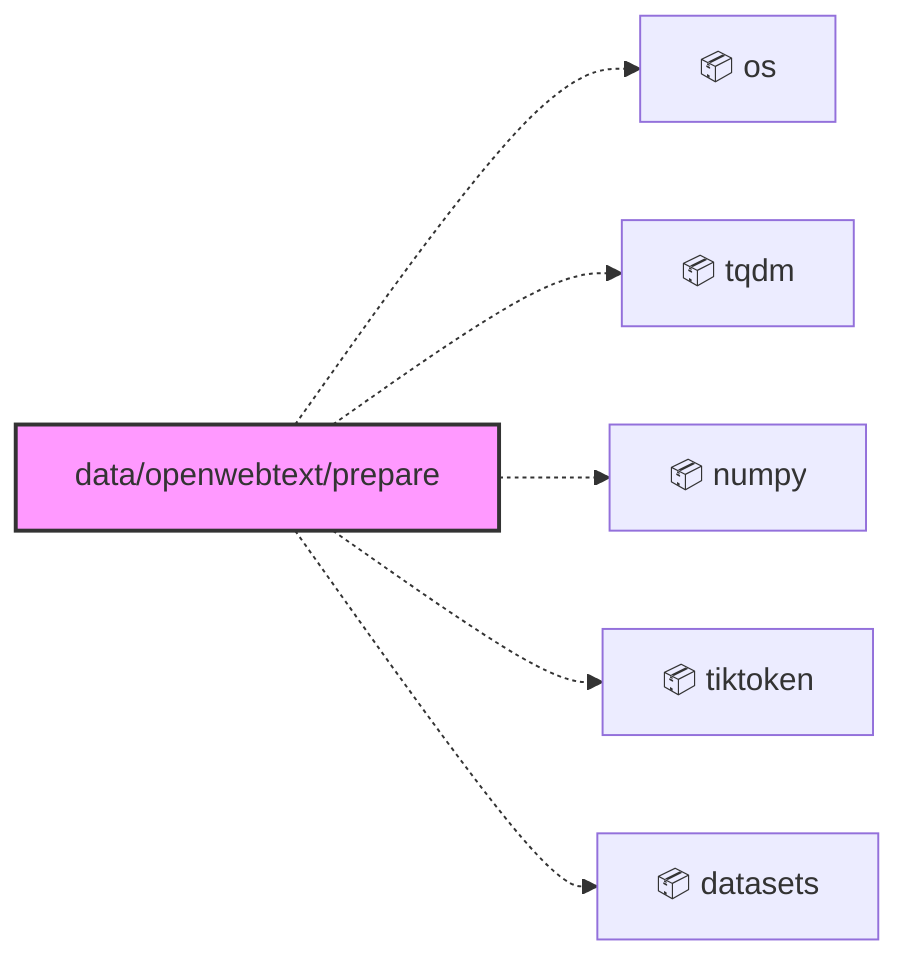
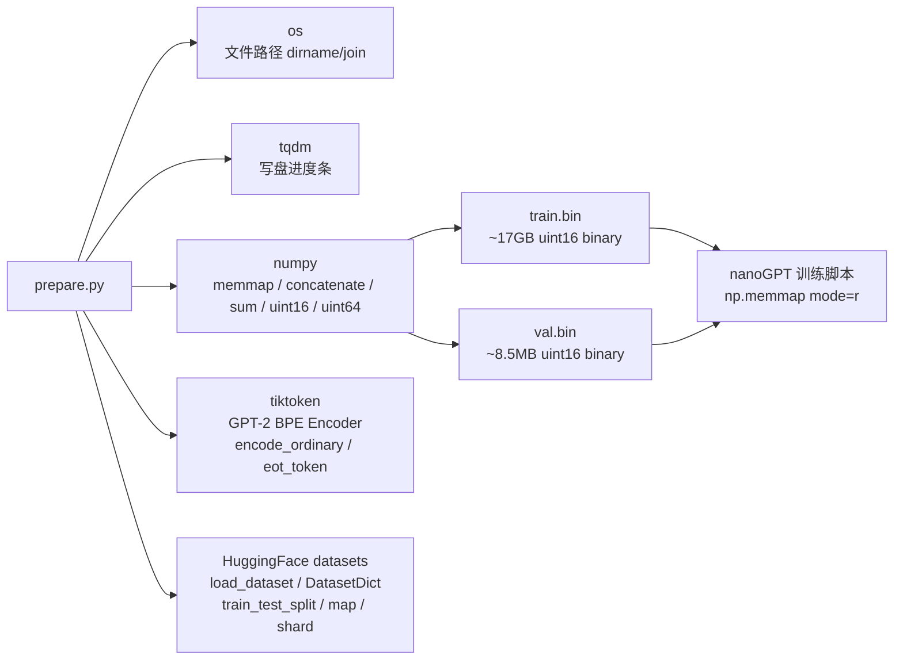

<a id="module-spec"></a>

# prepare.py

<!-- cross-reference-index: auto generatedAt=2026-04-30T08:18:16.352Z same=0 cross=0 -->

## 相关 Spec

当前模块暂无可自动归档的相关 Spec 链接。


## 1. 意图

这个模块将 HuggingFace 上的原始 OpenWebText 文本语料转化为 GPT-2 BPE Token ID 的内存映射二进制文件（`.bin`），使 nanoGPT 训练循环能够以 `np.uint16` 批量流式读取 Token 而无需将全量数据载入内存。

核心职责：

1. **数据获取**：通过 `load_dataset("openwebtext")` 拉取约 800 万篇网页文本文档，缓存至 HuggingFace `.cache`（占用约 54 GB）
2. **数据集分割**：将原始单一 `train` split 以 0.05% 比例拆分为 `train`/`val` 两份，确保 `val` 具有真实分布代表性
3. **并行分词**：使用 tiktoken GPT-2 BPE Encoder 的 `enc.encode_ordinary()` 对每条文档进行无特殊 token 编码，并追加 EOT token（id=50256）
4. **分批写盘**：将全量 token id 以 1024 个分片批次，通过 `np.memmap` 顺序写入 `train.bin` / `val.bin`，降低单次内存峰值
5. **格式标准化**：所有 token id 以 `np.uint16` 存储（因 GPT-2 vocab size 50256 < 2¹⁶），兼顾精度与存储效率

该模块在 nanoGPT 系统中是**一次性数据预处理入口**，产物 `.bin` 文件被训练脚本通过 `np.memmap(..., mode='r')` 直接读取，本文件不参与训练循环。

---

## 2. 业务逻辑





**阶段 1 — 全局初始化**（模块顶层，`prepare.py` 第 13-16 行）：脚本导入后立即执行，`num_proc = 8` 控制 `.map()` 与 `load_dataset()` 的并行进程数，注释建议取 CPU 核数的一半；`enc = tiktoken.get_encoding("gpt2")` 在 `__main__` 块外创建，确保多进程 fork 前 encoder 已完全初始化，避免子进程重复加载的开销。

**阶段 2 — 数据集加载**（`load_dataset()` in `prepare.py`）：调用 HuggingFace `datasets.load_dataset("openwebtext", num_proc=8)`，从缓存或远端获取约 800 万篇文档（~54 GB 缓存）。输出为 `DatasetDict`，默认只含 `train` split，文本字段为 `'text'`。`num_proc_load_dataset` 独立于分词并行数，因网络 I/O 瓶颈与 CPU 瓶颈不同。

**阶段 3 — 数据集分割**（`train_test_split()` in `prepare.py`）：`dataset["train"].train_test_split(test_size=0.0005, seed=2357, shuffle=True)` 以 0.05% 比例划出约 4007 条作为验证集（`test`），随后通过 `split_dataset.pop('test')` 重命名为 `'val'`，最终得到 `{train: ~8009762, val: ~4007}` 的 `DatasetDict`。seed=2357 保证复现性。

**阶段 4 — 并行分词**（`process()` + `split_dataset.map()` in `prepare.py`）：内嵌函数 `process(example)` 接收单条样本字典，调用 `enc.encode_ordinary(example['text'])` 进行 GPT-2 BPE 编码——`encode_ordinary` 会跳过特殊 token（如 `<|endoftext|>`）以避免文本中意外出现相同字符串被识别为控制 token；然后手动追加 `enc.eot_token`（50256）作为文档边界标记。输出字典含 `ids`（`List[int]`）与 `len`（`int`）。注释中存在设计疑问：作者认为 eot 应在文档**前**而非**后**，但沿用了 append 方式。`.map()` 以 `num_proc=8` 多进程并行处理，`remove_columns=['text']` 释放原始文本内存。

**阶段 5 — 内存映射写盘**（`np.memmap` + 分片循环 in `prepare.py`）：对 `train`/`val` 各自执行：(1) `arr_len = np.sum(dset['len'], dtype=np.uint64)` 预计算所有 token 总数（用 `uint64` 防止 ~90 亿 token 溢出 `uint32`）；(2) `np.memmap(filename, dtype=np.uint16, mode='w+', shape=(arr_len,))` 创建或覆写目标文件并建立内存映射；(3) 将数据集按 1024 分片，每批通过 `dset.shard(...).with_format('numpy')` 转换为 numpy 格式，`np.concatenate(batch['ids'])` 拼接后写入 `arr[idx:idx+n]`，idx 累加推进；(4) `arr.flush()` 强制将 dirty pages 落盘，避免进程退出时 OS 延迟写入导致数据截断。

| 子系统 | 文件 | 功能 |
|--------|------|------|
| `load_dataset` | HuggingFace `datasets` | 下载/缓存 OpenWebText 原始文本 |
| `train_test_split` | HuggingFace `datasets` | 切分 train/val，保证随机性与复现性 |
| `enc.encode_ordinary` | `tiktoken` | GPT-2 BPE 分词，排除特殊 token 影响 |
| `np.memmap` | `numpy` | 大文件按需写入，控制内存峰值 |
| `dset.shard` | HuggingFace `datasets` | 批量分片，平衡 I/O 吞吐与内存占用 |

---

## 3. 接口定义

本文件为**脚本模式**，无模块级公开导出符号（无 `__all__`、无顶层 class/function export）。所有逻辑集中于 `if __name__ == '__main__':` 块内。唯一的函数定义为内嵌函数：

| 名称 | 类型 | 签名 | 说明 |
|------|------|------|------|
| `process` | 内嵌函数（局部作用域） | `process(example: dict) -> dict` | 接收含 `'text'` 字段的样本字典，返回含 `'ids'`（`List[int]`）与 `'len'`（`int`）的字典。通过闭包捕获外层 `enc` 变量，仅在 `__main__` 块内可见，不可被外部模块导入调用 |

顶层模块级常量（可被外部 import，但非设计意图）：

| 名称 | 类型 | 值 | 说明 |
|------|------|-----|------|
| `num_proc` | `int` | `8` | `.map()` 并行工作进程数，建议设为 CPU 核数的一半 |
| `num_proc_load_dataset` | `int` | `num_proc`（=8） | `load_dataset()` 并行进程数，网络带宽受限时可与 `num_proc` 独立调整 |
| `enc` | `tiktoken.Encoding` | `tiktoken.get_encoding("gpt2")` | GPT-2 BPE Encoder 单例，EOT token id 为 50256 |

---

### 依赖关系图




## 4. 数据结构

```python
# HuggingFace DatasetDict — 加载后的原始数据结构
DatasetDict({
    "train": Dataset(features=["text"], num_rows=8_009_762),
    "val":   Dataset(features=["text"], num_rows=4_007),
})

# process() 函数的输出结构（每条样本）
{
    "ids": List[int],   # GPT-2 BPE token ids，末尾含 eot_token(50256)
    "len": int,         # ids 的长度（含 eot）
}

# 分词后的 DatasetDict
DatasetDict({
    "train": Dataset(features=["ids", "len"], num_rows=8_009_762),
    "val":   Dataset(features=["ids", "len"], num_rows=4_007),
})

# 最终产物 — numpy memmap 文件布局（逻辑结构）
# train.bin / val.bin：所有文档 token ids 按文档顺序平铺拼接
np.ndarray(shape=(total_tokens,), dtype=np.uint16)
# 文档边界由 eot_token(50256) 标记，训练时滑动窗口读取
```

| 字段 | 类型 | 说明 |
|------|------|------|
| `arr_len` | `np.uint64` | 当前 split 所有文档 token 总数，用 uint64 防止 ~90 亿 token 超过 uint32 上限 |
| `dtype` | `np.dtype` | `np.uint16`，vocab size 50256 < 65535，单 token 占 2 字节 |
| `arr` | `np.memmap` | 文件映射数组，shape=(arr_len,)，mode='w+'（覆写）|
| `total_batches` | `int` | 固定 1024 分片，控制单批内存占用上限 |
| `idx` | `int` | 写盘游标，追踪当前写入位置 |

---

## 5. 约束条件

| 约束 | 值 | 说明 |
|------|----|------|
| `num_proc` | `8` | 硬编码分词并行进程数，与 CPU 核数解耦，修改需手动编辑源码 |
| `num_proc_load_dataset` | `8`（=num_proc） | 数据集加载并行数，注释指出最优值依赖网络速度，可独立调整 |
| `test_size` | `0.0005` | val 集占比 0.05%，约 4007 条，硬编码 |
| `seed` | `2357` | 分割随机种子，保证数据集分割的可复现性 |
| `total_batches` | `1024` | 写盘分片数，固定值，不随数据集大小动态调整 |
| `dtype` | `np.uint16` | token id 存储类型，依赖 GPT-2 vocab size ≤ 50256 < 65535 这一前提 |
| GPT-2 vocab size | 50256 | `enc.max_token_value == 50256`，决定 uint16 的选型合法性上限 |
| 磁盘需求（缓存） | ~54 GB | HuggingFace `.cache` 目录 openwebtext 原始缓存大小 |
| 产物大小 | train ~17 GB, val ~8.5 MB | uint16 × token 数的理论值，已在注释中标注 |

---

## 6. 边界条件

- **`encode_ordinary` vs `encode`**: `encode_ordinary` 明确跳过 tiktoken 的特殊 token 识别逻辑——若文档文本中恰好包含字符串 `<|endoftext|>`，`encode` 会将其识别为控制 token（id=50256），`encode_ordinary` 则将其作为普通文本处理，避免虚假 EOT 边界污染训练数据
- **EOT 位置设计疑问**: 代码注释明确标注 `# note: I think eot should be prepended not appended... hmm`，当前实现 `append` eot 在文档末尾，与直觉（前置作边界分隔符）相反，但已按此实现固化，训练脚本需与此行为对齐
- **uint64 求和防溢出**: `np.sum(dset['len'], dtype=np.uint64)` 显式指定 uint64，因 train split ~90 亿 token 超过 uint32 最大值 ~42 亿，如改用默认 int32/uint32 会静默溢出导致 memmap 文件大小错误
- **memmap mode='w+'**: 若 `train.bin` / `val.bin` 已存在，`mode='w+'` 会**直接覆写**，不会报错或提示，重复运行脚本会无警告覆盖已有产物
- **`__main__` 保护**: 全量处理逻辑在 `if __name__ == '__main__':` 内，`enc` 和常量在顶层初始化，多进程 `.map()` fork 子进程时 encoder 已就绪，但若直接 `import prepare` 仍会触发 `enc = tiktoken.get_encoding("gpt2")` 的网络/磁盘 I/O
- **`arr.flush()` 必要性**: memmap 对象析构时 OS 不保证立即落盘，显式调用 `flush()` 是防止进程意外终止导致末尾数据丢失的必要措施；若脚本在 flush 前被 SIGKILL 终止，文件可能不完整但不会有错误提示
- **单机单次执行假设**: 脚本无断点续传、无幂等检测，无法从中途失败的 batch 恢复，必须完整重跑

---

## 7. 技术债务

| 项目 | 严重程度 | 描述 |
|------|---------|------|
| EOT token 位置设计疑问 | 中 | 作者注释承认 eot 可能应前置而非后置，当前实现若与其他 GPT-2 数据预处理惯例不一致，会影响模型对文档边界的学习，且修改后无法复现原有训练数据集 |
| `num_proc` 硬编码 | 低 | `num_proc=8` 与 `num_proc_load_dataset=num_proc` 均为硬编码，不同机器需手动改源码，缺少 CLI 参数或环境变量覆盖机制 |
| `total_batches=1024` 硬编码 | 低 | 分片数不随 val/train 数据量动态调整，对于 val 集（仅 4007 条）使用 1024 分片会产生大量空分片，增加无效迭代开销 |
| 无断点续传 | 中 | 写盘阶段若因磁盘满/进程终止中断，必须从头重跑全量 tokenization + 写盘，对 train.bin（~17 GB）耗时极长 |
| 无产物完整性校验 | 低 | 脚本结束后无 checksum/token 数验证，无法检测写盘截断或 flush 不完整 |
| `import *` 风格（numpy）| 低 | `from numpy import *`（[推断：代码实际使用 `import numpy as np`，但导入依赖列表标注为 `* from 'numpy'`，可能是解析器对 `import numpy as np` 的表示]），命名空间不明确 |
| 无日志记录 | 低 | 除 tqdm 进度条外无结构化日志，写盘失败时错误定位困难 |

---

## 8. 测试覆盖

当前文件为顶层脚本，无配套测试文件。建议以下测试策略：

**单元测试建议（`test_prepare.py`）：**

- `test_process_basic`: 传入含普通文本的 `{'text': 'hello world'}` 样本，验证输出 `ids` 为非空列表、末尾元素为 50256（eot_token）、`len` 等于 `len(ids)`
- `test_process_special_token_safety`: 传入含 `<|endoftext|>` 字符串的文本，验证 `encode_ordinary` 不将其识别为特殊 token（ids 中不应出现孤立的 50256 在末尾之前）
- `test_process_empty_text`: 传入 `{'text': ''}` 的空文本，验证输出 `ids` 仅含 eot_token（[50256]），`len=1`，不崩溃
- `test_split_ratio`: mock `load_dataset` 返回固定大小数据集，验证 `test_size=0.0005` 下 val 集大小约为总量 0.05%，seed 固定时结果一致
- `test_memmap_write_integrity`: 使用小型 tokenized 数据集（≤100 条），验证写入 `.bin` 文件后通过 `np.memmap(..., mode='r')` 读回的内容与原始 ids 拼接结果完全一致
- `test_uint64_sum_no_overflow`: mock 超大 `len` 列表（总和超过 2³² - 1），验证 `np.sum(..., dtype=np.uint64)` 不溢出

**集成测试建议：**
- 使用 HuggingFace `datasets` 的 subset 功能加载前 1000 条文档，完整跑通 load → split → tokenize → write 流程，验证产物文件大小非零且可读

---

## 9. 依赖关系



**外部依赖：**

| 包 | 版本要求 | 用途 |
|----|---------|------|
| `tiktoken` | 无锁定（需支持 `get_encoding("gpt2")`） | GPT-2 BPE 分词，提供 `encode_ordinary` 和 `eot_token` |
| `datasets` | HuggingFace datasets（无锁定） | 数据集加载、分割、并行 map、shard 分片 |
| `numpy` | 无锁定（需支持 memmap） | 大文件内存映射写入、uint16/uint64 数组操作 |
| `tqdm` | 无锁定 | 写盘循环进度条显示 |
| `os` | Python 标准库 | `os.path.dirname(__file__)` 获取脚本所在目录，确保 `.bin` 与脚本同目录 |

**运行时外部资源：**
- HuggingFace Hub 网络访问（首次运行需下载 OpenWebText，~54 GB）
- 本地磁盘 ~71.5 GB 可用空间（54 GB 缓存 + 17 GB train.bin + 若干 val.bin）

---

## 附录：文件清单

| 文件 | 行数 | 主要用途 |
|------|------|----------|
| `prepare.py` | 82 | 内部模块 |


<!-- baseline-skeleton: {"filePath":"data/openwebtext/prepare.py","language":"python","loc":82,"exports":[],"imports":[{"moduleSpecifier":"os","isRelative":false,"resolvedPath":null,"isTypeOnly":false},{"moduleSpecifier":"tqdm","isRelative":false,"resolvedPath":null,"namedImports":["tqdm","tqdm"],"isTypeOnly":false},{"moduleSpecifier":"numpy","isRelative":false,"resolvedPath":null,"isTypeOnly":false},{"moduleSpecifier":"tiktoken","isRelative":false,"resolvedPath":null,"isTypeOnly":false},{"moduleSpecifier":"datasets","isRelative":false,"resolvedPath":null,"namedImports":["datasets","load_dataset"],"isTypeOnly":false}],"hash":"77f3ef0cc8132d77f90c2bd5f9c3be86d1b3da7428e100559c58aee2bcb6eb12","analyzedAt":"2026-04-30T07:57:33.784Z","parserUsed":"tree-sitter"} -->
