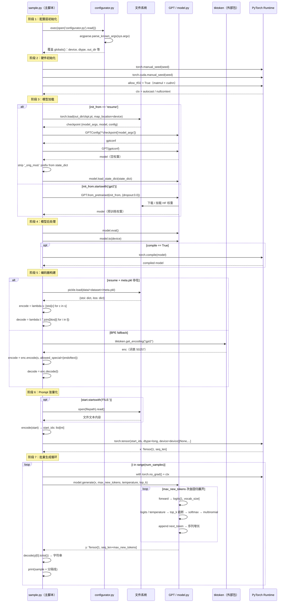
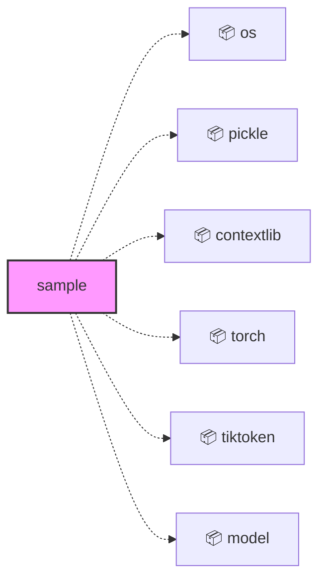
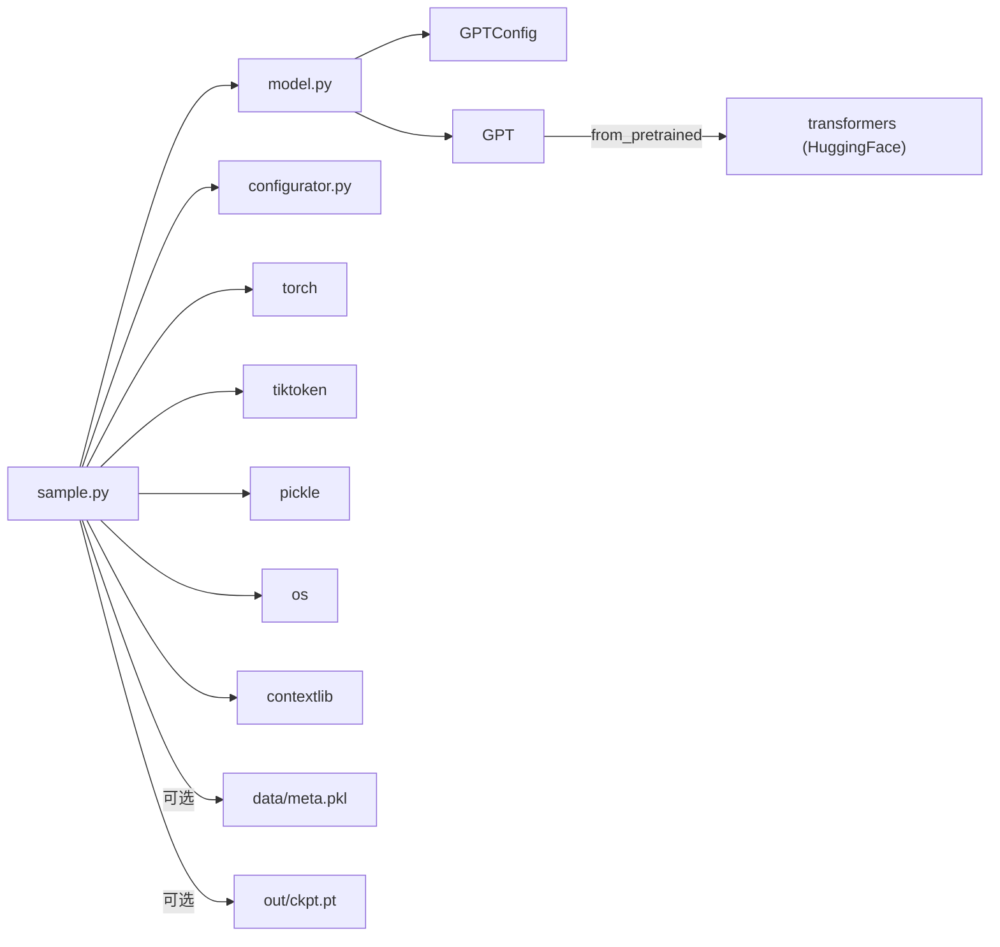

<a id="module-spec"></a>

# sample.py

<!-- cross-reference-index: auto generatedAt=2026-04-30T08:18:16.352Z same=0 cross=1 -->

## 相关 Spec

### 跨模块关联

- [model.py](model.spec.md#module-spec) - 出站 1，入站 0；示例：sample.py -> model.py


## 1. 意图

这个模块将已训练好的 GPT checkpoint（或 OpenAI GPT-2 预训练权重）转化为可交互的文本采样器，使用户能够通过命令行参数控制生成行为、在自定义编码方案和 GPT-2 BPE 之间自动切换，并批量输出多条生成文本。

核心职责：

1. **配置覆盖入口**：通过 `exec(open('configurator.py').read())` 动态将命令行参数注入脚本全局命名空间，实现零代码修改的参数调优（`configurator.py`）
2. **双路模型加载**：根据 `init_from` 区分从本地 checkpoint（`ckpt.pt`）恢复或从 OpenAI GPT-2 变体（`gpt2`/`gpt2-xl` 等）加载预训练权重（`model.py` 的 `GPT.from_pretrained`）
3. **自动编码器选择**：优先使用 checkpoint 对应数据集的 `meta.pkl`（字符级编码），回退到 tiktoken BPE（`gpt2` 编码），保证 prompt 编解码方式与训练时一致
4. **精度自适应推理**：根据硬件能力（CUDA bfloat16 支持检测）自动选择 `bfloat16`/`float16`/`float32`，使用 `torch.amp.autocast` 包裹推理上下文
5. **批量文本生成**：在 `torch.no_grad()` 上下文中循环调用 `model.generate()`，对每条样本解码并打印，支持温度采样与 top-k 截断

---

## 2. 业务逻辑

**阶段 1 — 配置声明与命令行覆盖**（`exec` in `sample.py:14`）

脚本以声明式风格在顶部将所有超参数定义为全局变量，充当"默认配置层"：`init_from='resume'`、`out_dir='out'`、`start='\n'`、`num_samples=10`、`max_new_tokens=500`、`temperature=0.8`、`top_k=200`、`seed=1337`、`device='cuda'`、`dtype`（自动检测）、`compile=False`。输入为 Python 源文件中的字面值，输出为运行时全局命名空间中的变量集合。核心机制是 `exec(open('configurator.py').read())`——将 `configurator.py` 在当前 `globals()` 上下文中执行，该文件内部通过 `argparse` 遍历 `sys.argv`，对 `globals()` 中已存在的同名变量按正确类型强转并覆盖赋值。这一模式的关键特性是"零 import"的配置注入：`sample.py` 无需显式声明 `argparse` 依赖，所有命令行参数（如 `--out_dir=out-shakespeare-char --device=cpu --num_samples=3`）均可透明传入，覆盖对应全局变量，不影响代码主体逻辑。特殊处理：`dtype` 的默认值在声明时就已完成自动检测——`'bfloat16' if torch.cuda.is_available() and torch.cuda.is_bf16_supported() else 'float16'`，命令行覆盖可强制指定 `'float32'`。

**阶段 2 — 硬件环境与精度上下文初始化**（`torch.manual_seed` / `torch.amp.autocast` in `sample.py:20-30`）

配置加载完成后，脚本立即固化运行环境。输入为 `seed`（int）、`device`（str）、`dtype`（str），输出为 `ctx`（`contextlib.AbstractContextManager`）和 `ptdtype`（`torch.dtype`）。核心流程分三步：① 双重随机种子固化：`torch.manual_seed(seed)` 覆盖 CPU RNG，`torch.cuda.manual_seed(seed)` 覆盖当前 CUDA 设备 RNG，确保多次运行以相同 `seed` 可复现相同 token 序列；② TF32 加速开关：同时设置 `torch.backends.cuda.matmul.allow_tf32=True` 和 `torch.backends.cudnn.allow_tf32=True`，在 Ampere+ 架构 GPU 上以少量精度损失换取约 3× 矩阵乘法加速；③ 精度上下文构建：`device_type = 'cuda' if 'cuda' in device else 'cpu'`，CPU 路径下 `ctx = nullcontext()`（no-op 上下文管理器），CUDA 路径下 `ctx = torch.amp.autocast(device_type='cuda', dtype=ptdtype)`，在 `with ctx` 块内所有 float 运算自动降精度为 `bfloat16/float16`，降低显存占用并提升吞吐。特殊处理：`ptdtype` 字典映射 `{'float32': torch.float32, 'bfloat16': torch.bfloat16, 'float16': torch.float16}[dtype]`，若 dtype 传入非法字符串，此处抛 `KeyError` 而非友好错误。

**阶段 3a — 从 Checkpoint 恢复模型**（`torch.load` / `GPT.load_state_dict` in `sample.py:33-48`）

当 `init_from == 'resume'` 时执行此路径。输入为文件路径字符串 `<out_dir>/ckpt.pt`，输出为已初始化权重的 `GPT` 实例。核心流程：① 使用 `torch.load(ckpt_path, map_location=device)` 将 checkpoint dict 直接加载到目标设备，避免先加载到 CPU 再迁移的中间内存峰值；② 从 `checkpoint['model_args']` 展开关键字参数构建 `GPTConfig(block_size, vocab_size, n_layer, n_head, n_embd, dropout, bias)`，并以该配置实例化空 `GPT(gptconf)` 对象；③ **前缀清理（`_orig_mod.` strip）**：遍历 `state_dict.items()` 快照，对所有以 `'_orig_mod.'` 开头的键执行 `pop` + 重新插入（去前缀），此前缀由 `torch.compile()` 在保存时自动加入，不清理则 `load_state_dict` 因键名不匹配抛 `RuntimeError`；④ 调用 `model.load_state_dict(state_dict)` 完成权重填充，`strict=True`（默认），确保无遗漏/多余权重。特殊处理：checkpoint 中的 `config` 子字典保留训练超参用于后续 `meta.pkl` 路径推断，而 `model_args` 只含模型结构超参（非训练超参），二者职责分离。

**阶段 3b — 从预训练权重加载 GPT-2**（`GPT.from_pretrained` in `sample.py:49-51`）

当 `init_from` 以 `'gpt2'` 开头（合法值：`'gpt2'`、`'gpt2-medium'`、`'gpt2-large'`、`'gpt2-xl'`）时执行此路径。输入为模型标识符字符串和覆盖参数字典，输出为已加载 Hugging Face 权重的 `GPT` 实例。调用 `GPT.from_pretrained(init_from, override_args=dict(dropout=0.0))` 完成全部工作：该 classmethod 内部通过 `transformers` 库下载对应模型权重，将 Hugging Face 格式的 state dict 键名转换为 nanoGPT 格式，并按照 `override_args` 将 `dropout` 强制置零（推理阶段不需要 dropout 正则化）。此路径无需 `meta.pkl` 也无需本地 checkpoint，适合直接对话 GPT-2 原始模型。[推断：键名映射逻辑在 `model.py` 内部处理，此处脚本无法看到细节，但接口约定通过 `override_args` 支持有限的超参覆盖]

**阶段 4 — 模型后处理与编译优化**（`model.eval` / `torch.compile` in `sample.py:53-56`）

无论走哪条加载路径，模型均经历统一的后处理。输入为内存中的 `GPT` 实例，输出为推理就绪的 `model` 对象。流程：① `model.eval()` 关闭 `Dropout` 层（推理时必须，训练时 `model.train()` 才开启）并告知 `BatchNorm` 使用推断统计而非运行统计；② `model.to(device)` 将所有参数和缓冲区迁移到目标设备（CUDA/CPU/MPS），此调用在参数精度保持 `float32` 的情况下完成设备迁移，后续 `autocast` 在 forward 时动态降精度；③ 若 `compile=True`，调用 `torch.compile(model)`（PyTorch 2.0+），将计算图编译为优化的 kernel，可加速推理约 20-40%，但首次调用有热身延迟。特殊处理：`compile` 默认 `False`，因为对于少量生成请求编译开销不合算；但若 `num_samples` 数量大，compile 摊销后有收益。

**阶段 5 — 编码器策略选择与构建**（`pickle.load` / `tiktoken.get_encoding` in `sample.py:58-73`）

此阶段根据数据集类型动态构建 `encode`/`decode` 闭包对，是训练-推理一致性的关键保障。输入为 `init_from`、`checkpoint['config']`（可能缺失）、文件系统中的 `meta.pkl`，输出为统一签名的两个闭包 `encode: Callable[[str], list[int]]` 和 `decode: Callable[[list[int]], str]`。**字符级路径**：条件 `init_from == 'resume' and 'config' in checkpoint and 'dataset' in checkpoint['config']` 全部满足时，构造路径 `data/<dataset>/meta.pkl`，通过 `os.path.exists` 检查后用 `pickle.load` 反序列化，取 `stoi`（字符→整数字典）和 `itos`（整数→字符字典）；`encode = lambda s: [stoi[c] for c in s]` 逐字符映射，`decode = lambda l: ''.join([itos[i] for i in l])` 逐 id 反映射，词表大小由训练集字符种类决定（Shakespeare 约 65 个字符）。**BPE 路径（tiktoken fallback）**：上述任一条件不满足时，回退到 `tiktoken.get_encoding("gpt2")`；`encode` 封装 `enc.encode(s, allowed_special={"<|endoftext|>"})` 以正确处理 EOS token（不加 `allowed_special` tiktoken 会对该特殊 token 抛异常）；`decode` 封装 `enc.decode(l)`，词表大小固定为 50257。[推断：两条路径接口完全统一，后续生成循环无需感知编码器类型，实现了对上层逻辑的透明解耦]

**阶段 6 — Prompt 预处理与张量化**（`encode()` / `torch.tensor` in `sample.py:75-80`）

此阶段将人类可读的 prompt 字符串转换为模型可消费的输入张量。输入为 `start`（str），输出为形状 `(1, seq_len)` 的 `torch.Tensor`（dtype=long，在 `device` 上）。核心逻辑：① 文件 prompt 支持——若 `start` 以 `'FILE:'` 前缀开头，截取后缀作为文件路径，以 UTF-8 读取全文内容赋回 `start`，允许传入长文档、代码文件等复杂 prompt；② 调用 `encode(start)` 得到整数列表 `start_ids`，长度取决于编码器（字符级为字符数，BPE 为子词片段数）；③ 转换为张量：`torch.tensor(start_ids, dtype=torch.long, device=device)` 创建 1D 张量，再通过 `[None, ...]`（等价 `unsqueeze(0)`）添加 batch 维度，得 `x` 形状 `(1, seq_len)`；④ 同一 `x` 被所有 `num_samples` 次生成共享——每次 `model.generate` 调用都从完全相同的初始状态出发，差异仅来自 temperature 采样的随机性。特殊处理：batch size 硬编码为 1，不支持一次并行生成多条 prompt 不同的样本；若需要不同 prompt 批量推理，需在外层修改。

**阶段 7 — 自回归生成循环**（`model.generate` in `sample.py:82-88`）

核心生成阶段，在双重上下文管理器保护下执行 `num_samples` 次独立采样。输入为初始 prompt 张量 `x: Tensor[1, seq_len]`，输出为每条样本的文本字符串（打印到 stdout）。双重上下文：`torch.no_grad()` 禁止梯度计算（推理不需要，节省约 2× 内存）；`ctx`（`autocast` 或 `nullcontext`）控制 forward 中的计算精度。每次循环调用 `model.generate(x, max_new_tokens, temperature=temperature, top_k=top_k)`——该方法（定义于 `model.py`）内部自回归展开：对当前序列取末尾最多 `block_size` 个 token 作为 context window 输入，forward 得 logits，取最后一个时间步，除以 `temperature` 缩放（temperature<1 使分布更尖锐、更确定，temperature>1 更平坦、更随机），若 `top_k` 不为 None 则将排名在 `top_k` 之后的 logit 设为 `-inf`（有效概率清零），softmax 后 multinomial 采样得下一 token，append 到序列；重复 `max_new_tokens` 次，返回形状 `(1, seq_len + max_new_tokens)` 的完整序列张量。解码：`y[0].tolist()` 将 batch 维剥离并转为 Python list，传入 `decode()` 还原字符串，打印输出后紧跟固定分隔行 `'---------------'`。特殊处理：生成结果**包含原始 prompt 部分**（`y` 从 `x` 起始），解码输出中能看到 prompt 回显；若需只输出新生成内容，需手动截取 `y[0][seq_len:]`（当前脚本不做此截取）。

---

```mermaid
flowchart TD
    A[脚本启动] --> B[声明默认超参数\ninit_from / start / temperature / top_k 等]
    B --> C[exec configurator.py\n命令行参数覆盖全局 globals]
    C --> D[torch.manual_seed + cuda.manual_seed\n固化随机性]
    D --> E[启用 TF32 matmul/cudnn 加速\n构建精度上下文 ctx]
    E --> F{init_from 分支}

    F -->|resume| G[torch.load ckpt.pt\nmap_location=device]
    G --> H[GPTConfig from model_args\n实例化空 GPT]
    H --> I[遍历 state_dict\n去除 _orig_mod. 前缀]
    I --> J[model.load_state_dict\nstrict=True]

    F -->|gpt2*| K[GPT.from_pretrained\ndropout=0.0 override]

    J --> L[model.eval + model.to device]
    K --> L

    L -->|compile=True| M[torch.compile model\nPyTorch 2.0 图优化]
    L -->|compile=False| N[跳过编译]
    M --> O
    N --> O

    O{编码器选择} -->|resume + dataset + meta.pkl 存在| P[pickle.load meta.pkl\n取 stoi itos]
    O -->|否则 fallback| Q[tiktoken.get_encoding gpt2\nallowed_special endoftext]
    P --> R[构建字符级 encode/decode 闭包]
    Q --> S[构建 BPE encode/decode 闭包]

    R --> T
    S --> T

    T[处理 start prompt] -->|FILE: 前缀| U[读取文件内容\nUTF-8]
    T -->|普通字符串| V[直接使用]
    U --> W[encode start → start_ids list[int]]
    V --> W
    W --> X[torch.tensor long + unsqueeze 0\nx shape: 1 x seq_len]

    X --> Y[循环 num_samples 次]
    Y --> Z[torch.no_grad + ctx autocast\n双重上下文]
    Z --> AA[model.generate x max_new_tokens\ntemperature top_k]
    AA --> AB[y shape: 1 x seq_len+max_new_tokens]
    AB --> AC[y 0 .tolist 剥离 batch 维\ndecode → 字符串]
    AC --> AD[print 输出 + 分隔线]
    AD -->|未完成| Y
    AD -->|完成| AE[脚本正常退出]
```



**关键子系统汇总：**

| 子系统 | 文件 | 核心职责 |
|--------|------|---------|
| `configurator` | `configurator.py` | `argparse` 解析 `sys.argv`，通过 `globals()` 注入覆盖调用方变量，零显式 import 依赖 |
| `GPT` | `model.py` | Transformer 模型类，含 `generate()` 自回归采样、`from_pretrained()` HF 权重加载 |
| `GPTConfig` | `model.py` | 模型结构超参 dataclass（`block_size, vocab_size, n_layer, n_head, n_embd, dropout, bias`） |
| `autocast ctx` | `torch.amp` | 推理精度上下文，CUDA 路径自动降精度为 bfloat16/float16，CPU 路径 no-op |
| `tiktoken enc` | `tiktoken`（外部包） | OpenAI BPE 分词器，固定 `"gpt2"` 编码方案，词表 50257 |
| `meta.pkl` | `data/<dataset>/` | 字符级数据集的 `stoi`/`itos` 映射，pickle 序列化，由 `prepare.py` 生成 |

## 3. 接口定义

`sample.py` 是一个纯脚本文件，**不定义任何函数、类或模块级公共符号**，没有 `__all__`，不作为可导入模块使用。以下为脚本级别的关键变量（配置接口）及调用的外部接口：

| 名称 | 类型 | 签名/值 | 说明 |
|------|------|---------|------|
| `init_from` | `str` | `'resume'` | 控制模型来源：`'resume'` 从 checkpoint 恢复，`'gpt2'`/`'gpt2-medium'`/`'gpt2-large'`/`'gpt2-xl'` 加载预训练 |
| `out_dir` | `str` | `'out'` | checkpoint 目录，仅 `init_from == 'resume'` 时生效 |
| `start` | `str` | `'\n'` | 生成起始 prompt；前缀 `'FILE:'` 触发从文件读取 |
| `num_samples` | `int` | `10` | 生成样本条数 |
| `max_new_tokens` | `int` | `500` | 每条样本最大新增 token 数 |
| `temperature` | `float` | `0.8` | 采样温度，`< 1.0` 更保守，`> 1.0` 更随机 |
| `top_k` | `int` | `200` | 保留 logit 最高的 k 个 token，其余概率清零 |
| `seed` | `int` | `1337` | 全局随机种子（CPU + CUDA） |
| `device` | `str` | `'cuda'` | PyTorch 设备标识符 |
| `dtype` | `str` | `'bfloat16'` 或 `'float16'` | 自动检测：CUDA + bfloat16 支持则用 `bfloat16`，否则 `float16` |
| `compile` | `bool` | `False` | 是否启用 `torch.compile()` |
| `encode` | `Callable[[str], list[int]]` | 闭包 | 运行时构建，字符级或 BPE，统一接口 |
| `decode` | `Callable[[list[int]], str]` | 闭包 | 运行时构建，与 encode 对应 |
| `GPT.generate` | method | `generate(idx, max_new_tokens, temperature, top_k)` | 在 `model.py` 中定义，自回归生成序列 |
| `GPT.from_pretrained` | classmethod | `from_pretrained(model_type, override_args)` | 加载 OpenAI GPT-2 预训练权重 |

---

### 依赖关系图




## 4. 数据结构

```python
# checkpoint 字典结构（从 ckpt.pt 加载）
checkpoint = {
    'model_args': dict,       # 传给 GPTConfig 的关键字参数
    'model': dict,            # state_dict，键名可能含 '_orig_mod.' 前缀
    'config': {
        'dataset': str,       # 训练时使用的数据集名称（可能缺失）
        # ... 其他训练超参
    }
}

# meta.pkl 结构（字符级数据集）
meta = {
    'stoi': dict[str, int],   # char → token id 映射
    'itos': dict[int, str],   # token id → char 映射
}

# GPTConfig（来自 model.py）
@dataclass
class GPTConfig:
    block_size: int
    vocab_size: int
    n_layer: int
    n_head: int
    n_embd: int
    dropout: float
    bias: bool
```

关键字段：

| 字段 | 类型 | 说明 |
|------|------|------|
| `checkpoint['model_args']` | `dict` | 重建 `GPTConfig` 所需的所有超参，必须与训练时一致 |
| `checkpoint['model']` | `dict[str, Tensor]` | 模型权重 state dict，可能含 `torch.compile` 引入的前缀 |
| `meta['stoi']` | `dict[str, int]` | 字符级编码表，训练集决定词表大小 |
| `x` | `Tensor[1, seq_len]` | 编码后的 prompt，形状固定含 batch 维，dtype=long |
| `y` | `Tensor[1, seq_len+max_new_tokens]` | 生成结果，含原始 prompt 部分 |
| `ptdtype` | `torch.dtype` | 运行时精度类型，由 `dtype` 字符串映射 |

---

## 5. 约束条件

| 约束 | 值 | 说明 |
|------|-----|------|
| 默认随机种子 | `1337` | `torch.manual_seed` + `torch.cuda.manual_seed`，可通过 `--seed` 覆盖 |
| 默认采样温度 | `0.8` | `< 1.0` 降低随机性，官方注释建议范围 |
| 默认 top_k | `200` | 截断长尾低概率 token，`None` 则不截断 |
| 默认 max_new_tokens | `500` | 每条样本生成 token 上限（不包含 prompt 长度） |
| 默认 num_samples | `10` | 固定 10 次独立生成 |
| 默认 dtype | `bfloat16`（CUDA） / `float16` | 运行时检测，CPU 设备不进入 autocast（`nullcontext`） |
| `unwanted_prefix` | `'_orig_mod.'` | `torch.compile` 保存的 state dict 键名前缀，硬编码字符串 |
| checkpoint 路径 | `<out_dir>/ckpt.pt` | `os.path.join(out_dir, 'ckpt.pt')`，固定文件名 |
| meta.pkl 路径 | `data/<dataset>/meta.pkl` | 固定目录结构，相对于脚本执行目录 |
| tiktoken 编码方案 | `"gpt2"` | 硬编码，不支持其他 tokenizer（如 cl100k_base） |
| prompt batch 大小 | `1` | `x = tensor[None, ...]`，不支持批量并行生成多条 |

---

## 6. 边界条件

- **`init_from` 未知值**：脚本没有 `else` 分支处理既不是 `'resume'` 也不以 `'gpt2'` 开头的值（如 `'gpt2neo'`），`model` 变量将未定义，后续 `model.eval()` 抛 `NameError`。[推断：设计假设用户只传合法值，无防御校验]
- **`_orig_mod.` 前缀清理**：用 `list(state_dict.items())` 快照后原地 pop/set，避免遍历时修改 dict 的问题；但若 checkpoint 来自非 compile 训练，前缀不存在则循环为空操作，不影响正确性
- **checkpoint 缺少 `config` 或 `dataset` 字段**：用 `'config' in checkpoint and 'dataset' in checkpoint['config']` 双重守卫，老版本 checkpoint 静默回退到 tiktoken，不报错
- **`meta.pkl` 中字符不在 `stoi`**：`encode = lambda s: [stoi[c] for c in s]` 若 prompt 含训练集外字符，抛 `KeyError`，无容错处理
- **CPU 设备下 dtype 选择**：`dtype` 默认逻辑只检测 CUDA，CPU 运行时 `ptdtype` 仍可能被设为 `bfloat16`，但 `ctx = nullcontext()` 不启用 autocast，实际 forward 使用模型参数精度而非 `ptdtype`，行为与预期一致
- **`FILE:` prompt 文件不存在**：直接抛 `FileNotFoundError`，无友好错误提示
- **`torch.compile` 与 `init_from='resume'`**：先完成 state dict 加载再 compile，顺序正确；但 compile 设为 `True` 且保存了 compile 后的 checkpoint 时，`_orig_mod.` 前缀清理逻辑必须在 load 之前生效（已正确实现）
- **内存不足（CUDA OOM）**：无显存检查，直接抛 CUDA 异常，无 batch 分片降级路径

---

## 7. 技术债务

| 项目 | 严重程度 | 描述 |
|------|----------|------|
| `exec(open('configurator.py').read())` | 高 | 动态执行外部文件修改调用方全局命名空间，安全性差、可测试性低，无法静态分析参数列表；TODO 注释已提及但未改进 |
| 编码器扩展性 | 中 | hardcode `tiktoken.get_encoding("gpt2")`，无法适配 GPT-2 之外的 tokenizer（如 Llama、Mistral），注释中有 `# TODO want to make this more general` |
| 无函数封装 | 中 | 整个脚本是顶层语句序列，无法被单元测试、无法作为库调用、无法复用各阶段逻辑 |
| `batch_size=1` 硬限制 | 中 | 每次生成只处理单条 prompt，`num_samples` 循环串行执行，GPU 利用率低；可改为批量并行生成 |
| state dict 前缀清理逻辑 | 低 | `unwanted_prefix = '_orig_mod.'` 硬编码，若 PyTorch 未来改变 compile 后的键名格式则静默失效 |
| dtype 自动检测不完整 | 低 | 未检测 `float16` 是否在当前设备支持，在部分旧 GPU 上 `float16` 可能有精度问题，直接回退而不警告 |
| 无生成进度指示 | 低 | `num_samples=10` 时用户需等待无进度反馈，长 `max_new_tokens` 下体验差 |

---

## 8. 测试覆盖

`sample.py` 是纯脚本，nanoGPT 项目**未包含对应的测试文件**（[推断：项目整体无正式测试套件，依赖手动运行验证]）。建议测试策略：

**单元测试建议**（若重构为函数后可测）：
- `test_state_dict_prefix_cleanup`：构造含 `_orig_mod.` 前缀的 state dict，验证清理逻辑正确去除前缀
- `test_encoder_fallback`：mock `os.path.exists` 返回 False，验证回退到 tiktoken 路径
- `test_file_prompt_loading`：创建临时文件，验证 `FILE:` 前缀正确读取内容
- `test_dtype_selection`：mock `torch.cuda.is_available()` 返回 True/False，验证 `ptdtype` 选择逻辑

**集成测试建议**：
- 使用极小 GPT 模型（n_layer=1, n_embd=64）和 mock checkpoint，端到端运行 sample.py，验证输出 `num_samples` 条文本且以 `'---------------'` 分隔
- `init_from='gpt2'` 路径：需网络访问，建议在 CI 中 skip 或 mock `GPT.from_pretrained`

**当前覆盖率**：`0%`（无测试文件），所有验证依赖手动执行。

---

## 9. 依赖关系

**内部依赖**：

| 模块 | 用途 |
|------|------|
| `model.py`（`GPT`, `GPTConfig`） | 模型定义与推理，`generate()` 方法核心依赖 |
| `configurator.py` | 命令行参数覆盖，通过 `exec` 动态加载 |
| `data/<dataset>/meta.pkl` | 字符级编码词表，训练时生成，运行时可选加载 |
| `<out_dir>/ckpt.pt` | 训练好的模型 checkpoint，`init_from='resume'` 时必需 |

**外部依赖**：

| 包 | 用途 |
|-----|------|
| `torch` | 张量运算、模型加载、autocast 精度上下文、随机种子 |
| `tiktoken` | OpenAI BPE 分词器，默认编码方案 |
| `pickle` | 加载字符级词表 `meta.pkl` |
| `os` | 路径拼接（`os.path.join`, `os.path.exists`） |
| `contextlib.nullcontext` | CPU 设备下的空上下文管理器，替代 autocast |



---

## 附录：文件清单

| 文件 | 行数 | 主要用途 |
|------|------|----------|
| `sample.py` | 90 | 内部模块 |


<!-- baseline-skeleton: {"filePath":"sample.py","language":"python","loc":90,"exports":[],"imports":[{"moduleSpecifier":"os","isRelative":false,"resolvedPath":null,"isTypeOnly":false},{"moduleSpecifier":"pickle","isRelative":false,"resolvedPath":null,"isTypeOnly":false},{"moduleSpecifier":"contextlib","isRelative":false,"resolvedPath":null,"namedImports":["contextlib","nullcontext"],"isTypeOnly":false},{"moduleSpecifier":"torch","isRelative":false,"resolvedPath":null,"isTypeOnly":false},{"moduleSpecifier":"tiktoken","isRelative":false,"resolvedPath":null,"isTypeOnly":false},{"moduleSpecifier":"model","isRelative":false,"resolvedPath":null,"namedImports":["model","GPTConfig","GPT"],"isTypeOnly":false}],"moduleDoc":"Sample from a trained model","hash":"1c4bb3716ec55395be2e6ad136693614b0b38de9defda889041efe2057a0c1f1","analyzedAt":"2026-04-30T08:10:39.186Z","parserUsed":"tree-sitter"} -->
