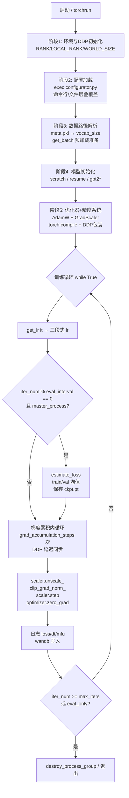
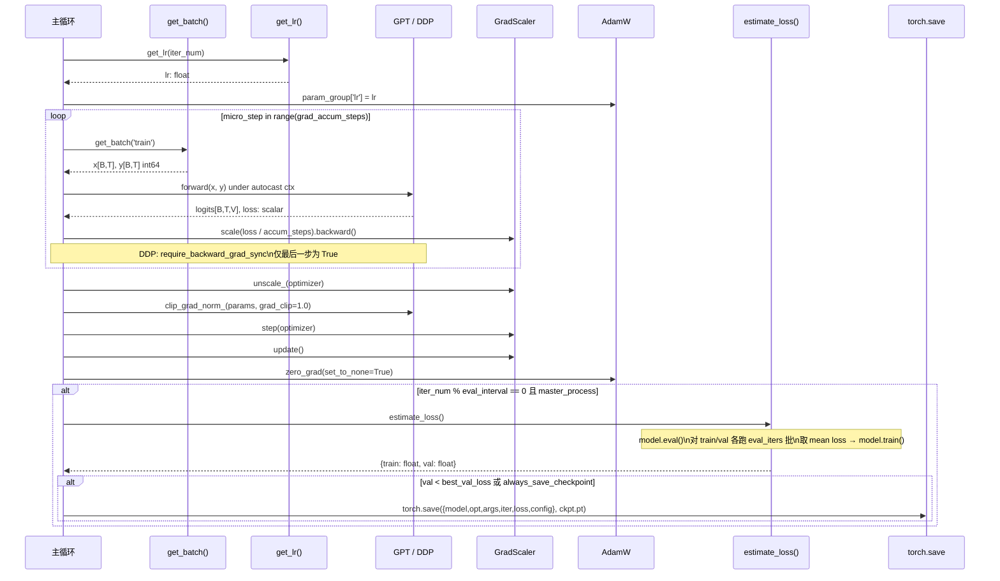
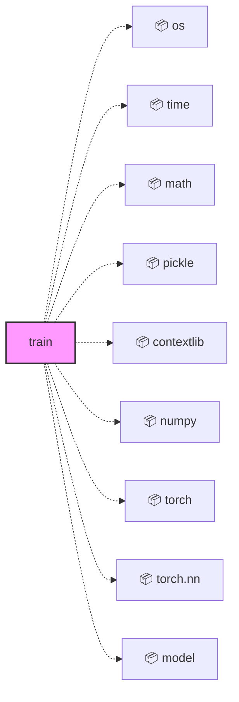
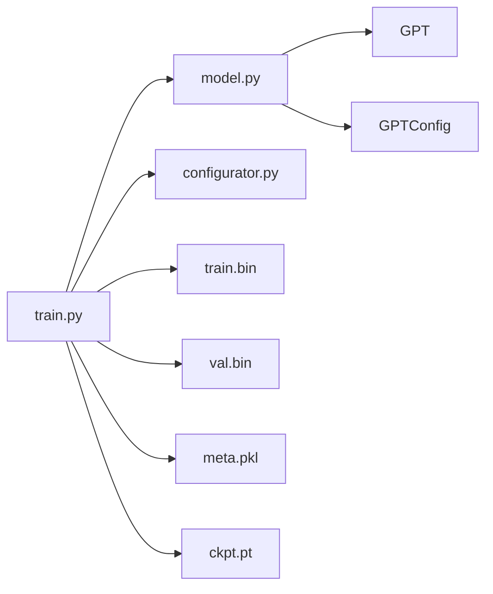

<a id="module-spec"></a>

# train.py

<!-- cross-reference-index: auto generatedAt=2026-04-30T08:18:16.352Z same=0 cross=1 -->

## 相关 Spec

### 跨模块关联

- [model.py](model.spec.md#module-spec) - 出站 1，入站 0；示例：train.py -> model.py


## 1. 意图

这个模块将原始 token 序列（`.bin` 格式的内存映射文件）转化为经过充分训练的 GPT 权重检查点，使研究者和工程师能够在单卡调试模式或多节点 DDP 集群上端到端复现 GPT-2 级别的语言模型训练。

核心职责：

1. **环境自适应初始化**（`train.py:49-77`）：自动检测 `RANK` 环境变量决定是否启用 DDP，按设备类型选择 `bfloat16`/`float16`/`float32`，构建 `torch.amp.autocast` 上下文管理器 `ctx`
2. **三路模型初始化**（`train.py:155-210`）：支持 `scratch`（随机初始化）、`resume`（从检查点续训）、`gpt2*`（从 OpenAI 预训练权重迁移学习）三条路径，通过 `GPT.from_pretrained()` 加载 HuggingFace 权重
3. **高效小批量数据供给**（`get_batch()` in `train.py:116-131`）：以 `np.memmap` 随机采样 token 窗口，避免全量数据加载
4. **梯度累积训练循环**（`train.py:257-310`）：通过 `gradient_accumulation_steps` 模拟大批量，配合 `GradScaler` 实现 fp16 混合精度训练
5. **余弦衰减学习率调度**（`get_lr()` in `train.py:231-242`）：线性热身 + 余弦衰减 + 最小学习率钳位，与 Chinchilla scaling law 对齐

---

## 2. 业务逻辑

`train.py` 将原始配置参数、token 二进制数据流以及（可选的）预训练权重，转化为持久化的 `ckpt.pt` 检查点与训练日志，使后续的采样推理或增量微调成为可能。整个管线共分 7 个阶段，以下逐阶详述。



---

**阶段 1 — 环境检测与 DDP 进程组初始化**（`train.py:49-77`）

脚本入口处通过 `os.environ.get('RANK', -1)` 判断当前是否处于 `torchrun` 多进程上下文：若 `RANK != -1`，则执行 `init_process_group(backend='nccl')`，从环境变量中解析 `ddp_rank`（全局排名）、`ddp_local_rank`（节点内 GPU 编号）与 `ddp_world_size`（总进程数），并调用 `torch.cuda.set_device(ddp_local_rank)` 将当前进程绑定到对应 GPU；非 DDP 时上述变量均退化为单进程默认值（rank=0, world=1）。进程角色区分由 `master_process = (ddp_rank == 0)` 决定：只有 master 负责打印日志、写检查点、发起 wandb；非 master 进程在这些分支上静默。随机种子设为 `torch.manual_seed(1337 + seed_offset)`，其中 `seed_offset = ddp_rank`，确保每张卡读取的随机批次互不重叠（若各卡种子相同会导致数据冗余，降低有效批量多样性）。混合精度上下文 `ctx` 在此阶段构建：CPU 设备使用 `nullcontext()`（占位无操作），CUDA 使用 `torch.amp.autocast(device_type='cuda', dtype=ptdtype)`；`ptdtype` 根据 `dtype` 字符串映射到 `torch.bfloat16`、`torch.float16` 或 `torch.float32`，其中 bfloat16 仅在 `torch.cuda.is_bf16_supported()` 时优先选用。

---

**阶段 2 — 超参配置加载与命令行覆盖**（`train.py:38-47`）

配置系统采用"全局变量 + exec 动态覆盖"的设计：脚本顶部以内联方式声明所有超参数（`batch_size`、`learning_rate`、`max_iters` 等共约 40 个），并通过列表推导 `config_keys = [k for k, v in globals().items() if not k.startswith('_') and isinstance(v, (int, float, bool, str))]` 采集这些变量的名称快照，用于事后对比覆盖效果。`exec(open('configurator.py').read())` 动态执行 `configurator.py`，该脚本负责解析 `sys.argv`：如果参数是 `.py` 文件路径，则先 `exec` 该配置文件（如 `config/train_shakespeare_char.py`）将文件中的赋值语句应用到当前作用域；随后将 `--key=value` 形式的命令行参数逐一解析为 Python 字面值并覆盖同名全局变量。两次覆盖完成后，重新采集 `{k: globals()[k] for k in config_keys}` 存为 `config` 字典，写入检查点和 wandb 以便复现实验。这种 exec 机制极其灵活（无需 argparse 声明所有参数），但代价是引入任意代码执行风险（详见技术债务）；`master_process` 在此处还执行 `os.makedirs(out_dir, exist_ok=True)` 创建输出目录，其余进程跳过（避免并发 mkdir 竞争）。

---

**阶段 3 — 数据路径解析与批次采样准备**（`get_batch()` in `train.py:116-131`，路径推断 `train.py:109-115`）

数据路径由 `data_dir = os.path.join('data', dataset)` 确定，`dataset` 默认为 `'openwebtext'`，可通过命令行覆盖。若 `data_dir/meta.pkl` 存在，则用 `pickle.load` 读取 `meta['vocab_size']` 作为 `meta_vocab_size`，供后续 `scratch` 初始化使用；若不存在，`meta_vocab_size = None`，打印警告后降级为 GPT-2 默认词表大小 `50304`（该值由 `50257` 向上取整到 64 的最小倍数，矩阵维度对齐可提升 GPU 矩阵乘法效率）。`get_batch(split: str) -> (torch.Tensor, torch.Tensor)` 在每次调用时重建 `np.memmap` 对象（而非缓存复用），原因是 numpy memmap 在长期持有时存在内存泄漏（代码注释引用了 GitHub issue）；`split='train'` 加载 `train.bin`，否则加载 `val.bin`，文件格式均为 `uint16` 紧凑存储的 token id 序列。采样逻辑：`ix = torch.randint(len(data) - block_size, (batch_size,))` 随机生成 `batch_size` 个合法起始偏移，`x = stack([from_numpy(data[i:i+block_size].astype(int64)) for i in ix])`，`y` 则偏移一位（`data[i+1:i+1+block_size]`），构成语言模型的 next-token 预测标签对，输出形状均为 `[batch_size, block_size]`，dtype 为 `torch.int64`。设备搬移时，CUDA 路径调用 `x.pin_memory().to(device, non_blocking=True)` 将 CPU 张量锁页后异步传输，GPU 计算流水线可与数据搬移重叠；CPU 路径直接同步 `.to(device)`。

---

**阶段 4 — 模型初始化（三路分支）**（`GPT`, `GPTConfig` in `model.py`；`train.py:140-210`）

初始化时先构建 `model_args` 字典（键为 `n_layer, n_head, n_embd, block_size, bias, vocab_size`），无论走哪条路径都以此字典作为检查点存储凭据，保证结构参数可从 `ckpt.pt` 完整还原。

- **`scratch` 路径**：直接实例化 `GPTConfig(**model_args)` 并传入 `GPT(gptconf)`，`vocab_size` 优先使用 `meta_vocab_size`，若为 `None` 则使用 `50304`；模型权重随机初始化（Xavier/kaiming 由 `model.py` 内部处理），是全量预训练场景的起点。
- **`resume` 路径**：`torch.load(os.path.join(out_dir, 'ckpt.pt'), map_location=device)` 加载检查点，强制用检查点中的 `model_args` 覆盖命令行传入的同名参数（防止用户误改结构参数导致形状不匹配），但 `dropout` 等行为参数允许命令行覆盖（常见于微调降低正则）。加载 `state_dict` 前需修复 `_orig_mod.` 前缀问题：`torch.compile` 在某些 PyTorch 版本中会在 `state_dict` 键名加该前缀，通过 `{k.removeprefix('_orig_mod.'):v for k,v in state_dict.items()}` 统一剥离（代码注释坦言"honestly no idea how to fix this properly"）；同时恢复 `iter_num` 和 `best_val_loss` 以续训。
- **`gpt2*` 路径**：调用 `GPT.from_pretrained(init_from, override_args={'dropout': dropout})`，从 HuggingFace Hub 加载对应规格的 GPT-2 权重（`gpt2`=124M、`gpt2-medium`=345M、`gpt2-large`=774M、`gpt2-xl`=1558M），并允许覆盖 `dropout` 以调节正则强度。

所有路径初始化完成后，可选执行 `model.crop_block_size(block_size)` 将上下文窗口缩短至命令行指定值（只允许减小，内部断言 `block_size <= model.config.block_size`）；最后将模型搬移到目标设备 `.to(device)`。

---

**阶段 5 — 优化器构建、精度系统配置与编译包装**（`train.py:212-235`）

`optimizer = model.configure_optimizers(weight_decay, learning_rate, (beta1, beta2), device_type)` 在 `model.py` 内部将参数分为两组：2D 以上参数（权重矩阵）加 `weight_decay=1e-1`，1D 参数（bias、LayerNorm scale/shift）不加 weight_decay（与 GPT-3 论文实践一致）；若 `resume`，还从检查点恢复 `optimizer.state_dict()` 以延续动量状态，避免热身阶段重复震荡。混合精度 `GradScaler` 仅在 `dtype='float16'` 时以 `enabled=True` 初始化，其他精度（bfloat16、float32）传入 `enabled=False` 使其退化为透明 no-op，不影响损失量级。`torch.compile(model)` 在 `compile=True` 时调用，基于 `torch.inductor` 生成融合 CUDA kernel，首次调用耗时约 60-120 秒进行追踪编译，之后迭代速度可提升 15-30%；为保证后续 `state_dict` 保存不受编译层影响，通过 `raw_model = model.module if ddp else model` 保留对原始 `GPT` 实例的引用（DDP 时 `.module` 解包，compile 时引用不变）。DDP 包装 `DistributedDataParallel(model, device_ids=[ddp_local_rank])` 在最后执行，确保编译发生在 DDP 之前（先 compile 后 DDP，而不是反过来），避免部分版本的 PyTorch 中 compile+DDP 顺序错误导致的梯度同步异常。

---

**阶段 6 — 训练主循环（梯度累积 + 流水线并行 + 混合精度反向）**（`train.py:257-310`）

主循环 `while True` 以 `iter_num` 为步计数器。每轮迭代起始调用 `get_lr(iter_num)` 计算当前步的学习率（见阶段 6 附属函数详述），并赋值给 `param_group['lr']`（手动调度，不使用 scheduler 对象）。梯度累积内循环遍历 `gradient_accumulation_steps`（默认 40 = 5 × 8，DDP 时已除以 `world_size`）个 micro step，每步调用 `get_batch('train')` 取一个 `[batch_size, block_size]` 批次，在 `ctx`（autocast）作用域内执行 `model(x, y)` 获取 `loss`，再调用 `scaler.scale(loss / gradient_accumulation_steps).backward()`——除以累积步数保证梯度等价于对整个大批量取均值。DDP 模式下，`model.require_backward_grad_sync = (micro_step == gradient_accumulation_steps - 1)` 仅在最后一个 micro step 置为 `True`，前面的步骤关闭梯度全局通信，大幅减少 all-reduce 开销。数据预取通过在内循环中提前调用 `get_batch` 并缓存到 `(X, Y)` 变量实现，CPU IO 与 GPU 前向流水线部分重叠。内循环结束后依次执行：`scaler.unscale_(optimizer)` 将梯度还原到 float32 量级 → `clip_grad_norm_(model.parameters(), grad_clip)` 将全局梯度范数裁剪到 `grad_clip=1.0`（防止梯度爆炸，0.0 表示禁用）→ `scaler.step(optimizer)` 执行 AdamW 更新（若梯度含 NaN/Inf 则自动跳过并缩减 scale）→ `scaler.update()` 调整 scale 系数 → `optimizer.zero_grad(set_to_none=True)` 将梯度置为 `None`（节省显存，等效于全零但无需分配）。每 `log_interval` 步打印迭代编号、损失、耗时（毫秒/iter）和 MFU（Model FLOP Utilization，`estimate_mfu` 用理论峰值 FLOP 与实测吞吐对比得到利用率百分比，前 5 步热身后才统计，以 EMA 系数 0.9 平滑）；`wandb_log=True` 时同步写入 wandb run。

**附属函数 `get_lr(it: int) -> float`**（`train.py:231-242`）：实现三段式学习率调度策略——①线性热身段：`it < warmup_iters` 时返回 `learning_rate * (it+1) / (warmup_iters+1)`，从接近零线性爬升到峰值；②余弦衰减段：`warmup_iters <= it <= lr_decay_iters` 时计算 `decay_ratio = (it - warmup_iters) / (lr_decay_iters - warmup_iters)`，再由 `coeff = 0.5 * (1 + cos(π * decay_ratio))` 生成 0→1 的余弦插值系数，最终返回 `min_lr + coeff * (learning_rate - min_lr)`；③常数段：`it > lr_decay_iters` 时直接返回 `min_lr`（默认 `6e-5`，约为峰值的 1/10）；内含 `assert 0 <= decay_ratio <= 1` 边界保护。

---

**阶段 7 — 周期性评估与检查点持久化**（`estimate_loss()` in `train.py:215-228`；检查点写入 `train.py:245-258`）

每隔 `eval_interval`（默认 2000）步且当前进程为 `master_process` 时，触发评估与保存流程。`estimate_loss()` 以 `@torch.no_grad()` 装饰（推理阶段不需要计算图），隐式依赖全局 `model`、`ctx`、`eval_iters`：先将模型切换到 `model.eval()`（关闭 Dropout/BatchNorm 随机性），对 `['train', 'val']` 各循环 `eval_iters`（默认 200）个批次，每批在 `ctx` 下执行前向取 `loss`，累积到 `losses[k]`，最终对 `eval_iters` 维度取 `mean()` 后存入 `out[split]`；函数返回前恢复 `model.train()` 模式。评估完成后，若 `losses['val'] < best_val_loss`（val 损失有改善）或 `always_save_checkpoint=True`（强制保存）且 `iter_num > 0`（跳过第 0 步的空模型），则调用 `torch.save(checkpoint, os.path.join(out_dir, 'ckpt.pt'))`，检查点内容包括 `raw_model.state_dict()`（解包 DDP/compile 后的裸权重）、`optimizer.state_dict()`、`model_args`（结构参数，用于恢复 `GPTConfig`）、`iter_num`、`best_val_loss`（更新后的最佳值）、`config`（完整超参快照）；此处始终覆盖同名文件（无版本轮换），磁盘上只保留最新最优模型。`wandb_log=True` 时同步记录 `train/loss`、`val/loss`、`lr`、`mfu` 四个指标。



关键子系统：

| 子系统 | 文件 | 功能 |
|--------|------|------|
| `GPT` / `GPTConfig` | `model.py` | Transformer 前向计算、`configure_optimizers`（分组 weight decay）、`estimate_mfu`（FLOP 利用率）、`from_pretrained`（HuggingFace 加载）、`crop_block_size`（上下文裁剪） |
| `configurator.py` | `configurator.py` | 解析 `sys.argv`，支持 `.py` 配置文件与 `--key=value` 命令行两级覆盖，修改当前进程全局命名空间 |
| `DistributedDataParallel` | `torch.nn.parallel` | 多 GPU 梯度同步，`require_backward_grad_sync` 控制 all-reduce 触发时机，减少中间 micro step 的通信开销 |
| `GradScaler` | `torch.cuda.amp` | fp16 梯度缩放防溢出，NaN/Inf 时自动跳过 optimizer step 并降低 scale 系数，bfloat16/float32 时退化为 no-op |
| `np.memmap` | `numpy` | 内存映射大 `.bin` 文件实现零拷贝随机访问，每次 `get_batch` 调用重建对象规避 numpy memmap 内存泄漏 issue |
| `torch.compile` | `torch` | PyTorch 2.0+ 基于 `inductor` 后端的 JIT kernel 融合，首次调用编译开销约 1-2 分钟，后续迭代速度提升约 15-30% |

## 3. 接口定义

| 名称 | 类型 | 签名 | 说明 |
|------|------|------|------|
| `get_batch` | function | `def get_batch(split)` | 接收字符串 `'train'` 或 `'val'`，从对应 `.bin` 文件中随机采样一个 `[batch_size, block_size]` 的 token 批次，返回 `(x, y)` 两个 `torch.Tensor`（int64），已搬移到目标设备；CUDA 使用异步 pin_memory 传输 |
| `estimate_loss` | function（`@torch.no_grad()`） | `def estimate_loss()` | 无参数，隐式依赖全局 `model`、`ctx`、`eval_iters`；将模型切换至 eval 模式，对 train/val 各采样 `eval_iters` 批次取均值，返回 `dict[str, float]`（键为 `'train'` 和 `'val'`）；执行结束后恢复 `model.train()` |
| `get_lr` | function | `def get_lr(it)` | 接收当前迭代步 `it`（int），根据三段式策略返回当前学习率（float）：线性热身段（`it < warmup_iters`）、余弦衰减段（`warmup_iters <= it <= lr_decay_iters`）、常数最小值段（`it > lr_decay_iters`）；隐式依赖全局 `learning_rate`、`min_lr`、`warmup_iters`、`lr_decay_iters` |

---

---

### 完整接口参考（AST 精确提取）

### train.py

| 名称 | 类型 | 签名 | 成员数 |
|------|------|------|--------|
| `get_batch` | function | `def get_batch(split)` | - |
| `estimate_loss` | function | `def estimate_loss()` | - |
| `get_lr` | function | `def get_lr(it)` | - |

### 依赖关系图




## 4. 数据结构

模型检查点（`ckpt.pt`）的序列化结构：

```python
checkpoint = {
    'model':       dict,          # raw_model.state_dict()
    'optimizer':   dict,          # optimizer.state_dict()
    'model_args':  dict,          # n_layer, n_head, n_embd, block_size, bias, vocab_size
    'iter_num':    int,           # 已完成的训练步数
    'best_val_loss': float,       # 历史最佳验证损失
    'config':      dict,          # 完整超参快照（config_keys 采集）
}
```

关键全局配置变量（训练超参数）：

| 字段 | 类型 | 说明 |
|------|------|------|
| `block_size` | int | 上下文窗口大小，默认 1024；只能裁剪不能扩展 |
| `batch_size` | int | 单次前向的 micro-batch 大小，默认 12 |
| `gradient_accumulation_steps` | int | 梯度累积步数，默认 40（5*8），DDP 时自动除以 world_size |
| `learning_rate` | float | 峰值学习率，默认 6e-4 |
| `min_lr` | float | 余弦衰减下界，默认 6e-5（约 learning_rate/10） |
| `warmup_iters` | int | 线性热身步数，默认 2000 |
| `lr_decay_iters` | int | 余弦衰减终止步，默认 600000 |
| `eval_iters` | int | 评估时平均的批次数，默认 200 |
| `eval_interval` | int | 每隔多少步评估一次，默认 2000 |
| `dtype` | str | 混合精度类型，自动检测 bfloat16 支持 |
| `init_from` | str | `'scratch'`/`'resume'`/`'gpt2'`/`'gpt2-medium'` 等 |
| `tokens_per_iter` | int | 每步实际处理 token 数（派生值，打印用）|

---

## 5. 约束条件

| 约束 | 值 | 说明 |
|------|-----|------|
| 随机种子 | `1337 + seed_offset` | 保证 DDP 各进程种子不同，master 为 1337 |
| 默认 vocab_size | `50304` | meta.pkl 不存在时使用；50257 向上取整到 64 倍数，优化矩阵乘法 |
| `gradient_accumulation_steps % ddp_world_size == 0` | 强制断言 | DDP 下必须整除，否则 `assert` 抛出 |
| `0 <= decay_ratio <= 1` | 强制断言 | 余弦衰减系数范围检查，`train.py:239` |
| `grad_clip` | 默认 `1.0` | 0.0 表示禁用梯度裁剪 |
| `beta1`, `beta2` | `0.9`, `0.95` | AdamW 动量系数（GPT-3 论文推荐值） |
| `weight_decay` | `1e-1` | 仅对 2D 以上参数应用（由 GPT.configure_optimizers 内部实现） |
| `block_size` 只减不增 | — | `model.crop_block_size()` 只接受 `≤ model.config.block_size` 的值 |
| tf32 开启 | 两项均为 True | `allow_tf32` 对 matmul 和 cudnn 均开启，在 Ampere GPU 提升吞吐 |
| DDP backend | `'nccl'` | 默认 NCCL；Infiniband 不可用时需前置 `NCCL_IB_DISABLE=1` |

---

## 6. 边界条件

- **`split` 非法值**：`get_batch` 的 `else` 分支覆盖所有非 `'train'` 输入，均视为 `'val'`；无显式报错，[推断: 设计上仅预期两个合法值，非法输入静默使用 val 数据]
- **`meta.pkl` 不存在**：`meta_vocab_size = None`，`scratch` 模式降级为 GPT-2 默认词表 50304，打印警告但不中断
- **`_orig_mod.` 前缀问题**（`train.py:181-184`）：`torch.compile` 有时在 state_dict 键名加前缀，通过 `str.startswith` 遍历修复；代码注释明确标注"honestly no idea how"，属已知未解之谜
- **`eval_only=True`**：`iter_num == 0` 时触发 `break`，仅执行一次评估后立即退出，不进行任何训练
- **`always_save_checkpoint=True`**：即使 val loss 未改善也保存（但跳过 `iter_num == 0` 的首次评估）；`iter_num > 0` 判断防止首步写入空模型
- **DDP 梯度同步时机**：`model.require_backward_grad_sync` 仅在最后一个 micro step 为 `True`，避免中间步骤触发昂贵的 all-reduce
- **fp16 溢出**：`GradScaler` 在 loss 为 NaN/Inf 时自动跳过 optimizer step 并缩减 scale 系数；`dtype != 'float16'` 时 `enabled=False`，GradScaler 变 no-op
- **`block_size` 裁剪越界**：若命令行传入的 `block_size` 大于模型内置值，`crop_block_size` 将抛出异常（由 `model.py` 内部校验）
- **wandb 可选导入**：`wandb` 在 `wandb_log=True` 时才 `import`，避免未安装时崩溃

---

## 7. 技术债务

| 项目 | 严重程度 | 描述 |
|------|----------|------|
| `exec(open('configurator.py').read())` | 高 | 动态执行任意代码，存在路径遍历和代码注入风险；难以静态分析和 IDE 支持；覆盖全局变量的副作用不透明 |
| 全局变量作为隐式函数参数 | 中 | `estimate_loss()`、`get_lr()` 依赖 `model`、`ctx`、`eval_iters`、`learning_rate` 等全局状态，无法独立单元测试，DI 重构代价高 |
| `_orig_mod.` state_dict 前缀 | 中 | `torch.compile` 偶发性添加前缀，修复代码注释承认不清楚根因；根本原因未解决，未来 PyTorch 版本变更可能失效 |
| `np.memmap` 每批重建 | 低 | 为规避 numpy 内存泄漏 workaround，每次调用 `get_batch` 重新打开文件句柄；numpy 修复后可简化为单次初始化 |
| 无类型注解 | 低 | 全文无 PEP 484 类型提示，大型项目维护困难；函数签名语义需通过注释理解 |
| 学习率调度器耦合全局变量 | 低 | `get_lr` 的三个阈值（`warmup_iters`、`lr_decay_iters`、`min_lr`）完全依赖全局，换成类封装可提升可测性 |
| 无结构化日志 | 低 | 训练日志通过 `print` 输出到 stdout，格式不统一；大规模集群下日志收集困难 |

---

## 8. 测试覆盖

当前项目（nanoGPT）**没有专门的测试文件**（`tests/` 目录不存在）；train.py 本身是脚本形态，所有逻辑耦合全局状态，无法直接 `import` 并单元测试。

建议测试策略：

**单元测试（需先重构解耦全局依赖）：**
- `get_batch` 单测：mock `np.memmap`，验证返回 tensor shape `[batch_size, block_size]`、dtype `int64`、x/y 偏移量差 1
- `get_batch` CUDA 路径：验证 `pin_memory()` 被调用（`device_type='cuda'`），CPU 路径无 pin
- `estimate_loss` 单测：mock `model` 的 `eval()`/`train()` 方法，验证 `model.eval()` 先于 `model()` 调用，且函数返回后 `model.train()` 已被调用
- `get_lr` 参数化测试：覆盖三段边界值——`it=0`（返回 `learning_rate/warmup_iters`），`it=warmup_iters-1`（接近峰值），`it=warmup_iters`（余弦起点），`it=lr_decay_iters`（余弦终点，返回 `min_lr`），`it=lr_decay_iters+1`（钳位 `min_lr`）
- `decay_ratio` 断言：验证 `it` 在合法范围内不抛，在非法范围（如 `it < warmup_iters` 但进入衰减分支）应触发 assert

**集成测试（端到端冒烟）：**
- 以 `max_iters=10, eval_interval=5, batch_size=2, block_size=32` 跑 Shakespeare char 数据集，验证检查点文件生成、loss 下降、resume 后 iter_num 正确恢复
- DDP 2 进程冒烟：用 `torchrun --nproc_per_node=2` 跑同样 10 步，比较与单进程 loss 曲线的相对误差

---

## 9. 依赖关系

**内部依赖：**



**外部依赖（Python 包）：**

| 包 | 用途 |
|----|------|
| `torch` | 核心张量计算、自动微分、AMP、DDP |
| `torch.nn.parallel.DistributedDataParallel` | 多 GPU 梯度同步 |
| `torch.distributed` | 进程组初始化/销毁 |
| `numpy` | memmap 内存映射文件读取 |
| `math` | `math.cos`、`math.pi`（余弦衰减计算） |
| `os` | 路径拼接、环境变量读取、目录创建 |
| `time` | 迭代耗时统计（`time.time()`） |
| `pickle` | 反序列化 `meta.pkl` 词表信息 |
| `contextlib.nullcontext` | CPU 设备的空上下文管理器替代 autocast |
| `wandb`（可选） | 实验追踪与可视化，`wandb_log=True` 时动态 import |

---

## 附录：文件清单

| 文件 | 行数 | 主要用途 |
|------|------|----------|
| `train.py` | 337 | 导出 get_batch, estimate_loss, get_lr |


<!-- baseline-skeleton: {"filePath":"train.py","language":"python","loc":337,"exports":[{"name":"get_batch","kind":"function","signature":"def get_batch(split)","jsDoc":null,"isDefault":false,"startLine":116,"endLine":131},{"name":"estimate_loss","kind":"function","signature":"def estimate_loss()","jsDoc":null,"isDefault":false,"startLine":215,"endLine":228},{"name":"get_lr","kind":"function","signature":"def get_lr(it)","jsDoc":null,"isDefault":false,"startLine":231,"endLine":242}],"imports":[{"moduleSpecifier":"os","isRelative":false,"resolvedPath":null,"isTypeOnly":false},{"moduleSpecifier":"time","isRelative":false,"resolvedPath":null,"isTypeOnly":false},{"moduleSpecifier":"math","isRelative":false,"resolvedPath":null,"isTypeOnly":false},{"moduleSpecifier":"pickle","isRelative":false,"resolvedPath":null,"isTypeOnly":false},{"moduleSpecifier":"contextlib","isRelative":false,"resolvedPath":null,"namedImports":["contextlib","nullcontext"],"isTypeOnly":false},{"moduleSpecifier":"numpy","isRelative":false,"resolvedPath":null,"isTypeOnly":false},{"moduleSpecifier":"torch","isRelative":false,"resolvedPath":null,"isTypeOnly":false},{"moduleSpecifier":"torch.nn.parallel","isRelative":false,"resolvedPath":null,"namedImports":["torch.nn.parallel","DistributedDataParallel"],"isTypeOnly":false},{"moduleSpecifier":"torch.distributed","isRelative":false,"resolvedPath":null,"namedImports":["torch.distributed","init_process_group","destroy_process_group"],"isTypeOnly":false},{"moduleSpecifier":"model","isRelative":false,"resolvedPath":null,"namedImports":["model","GPTConfig","GPT"],"isTypeOnly":false}],"moduleDoc":"This training script can be run both on a single gpu in debug mode,","hash":"413bd97b40bb400a2a0d01230e2946f056c263ebac1b7281c2367d964a123085","analyzedAt":"2026-04-30T08:14:13.543Z","parserUsed":"tree-sitter"} -->
