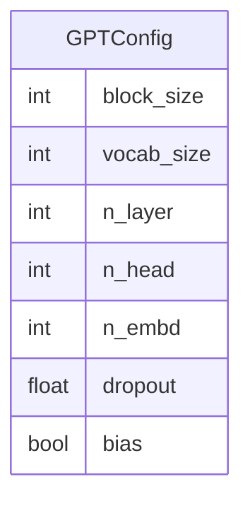

# 数据模型文档

## 概览

| 指标 | 值 |
|------|-----|
| 模型总数 | 1 |
| 字段总数 | 7 |
| python 模型数 | 1 |
| dataclass 数量 | 1 |

---

## Python 数据模型

### GPTConfig

**文件**: `model.py`
**类型**: dataclass

| 字段名 | 类型 | 可选 | 默认值 | 描述 |
|--------|------|------|--------|------|
| `block_size` | `int` | 否 | `1024` | — |
| `vocab_size` | `int` | 否 | `50304` | — |
| `n_layer` | `int` | 否 | `12` | — |
| `n_head` | `int` | 否 | `12` | — |
| `n_embd` | `int` | 否 | `768` | — |
| `dropout` | `float` | 否 | `0.0` | — |
| `bias` | `bool` | 否 | `True` | — |

## 实体关系图

