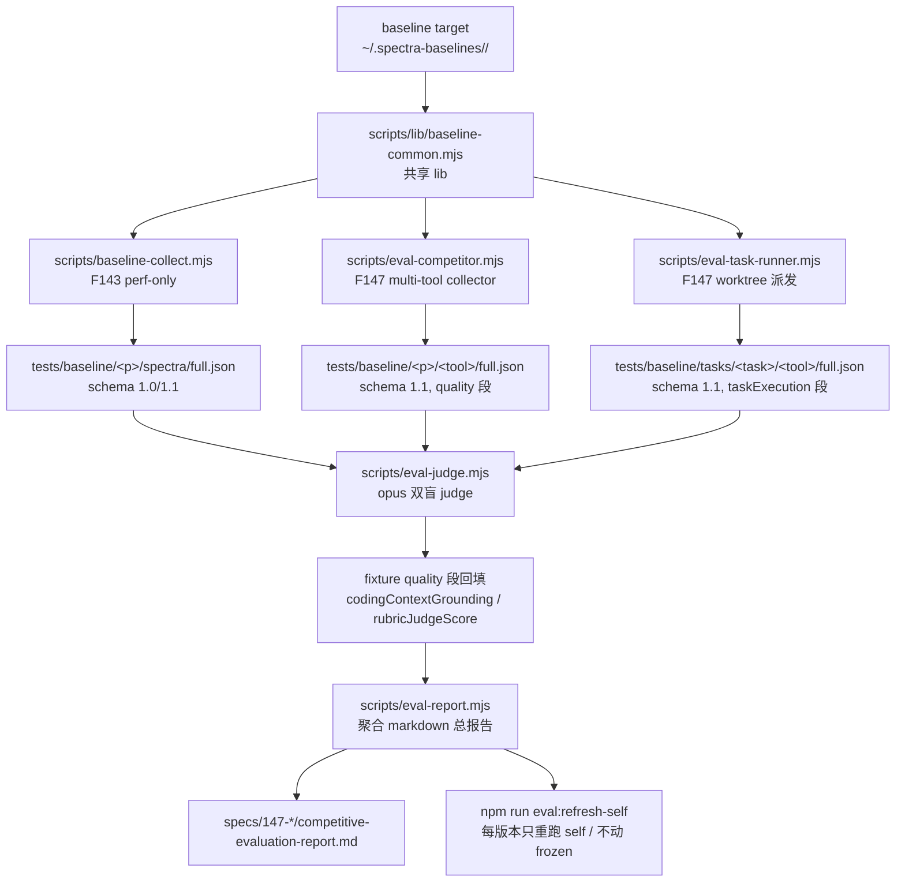

# Feature 147 — Implementation Plan

**Branch**: `feature/147-competitor-evaluation-platform`  
**Date**: 2026-04-30  
**Spec**: [spec.md](./spec.md)（455 行，spec §9 决策已锁定）  
**Mode**: feature（Spec-Driven Development，6 Phase）

---

## 0. Summary

Feature 147 在 F143 baseline 基础设施之上新增**质量维度 + 竞品对比**两个能力轴：

```
F143 (perf-only baseline)
   ↓ 复用 collector / fixture / workspace 持久化
F147 = F143 + quality 维度 + 多 tool 真实实现 + worktree 任务派发 + LLM-as-judge
```

**6 Phase 顺序交付**（按用户决策"先 Spectra 后 Spec Driver"）：

- Phase 0：feasibility spike（验证 worktree 派发可行）+ competitive-landscape.md（≥10 竞品）+ schema 1.1 设计（1-1.5 day）
- Phase 1：scripts/eval-competitor.mjs（Spectra collector：spectra/graphify/aider-repomap/cody）+ F143 fixture 升级 1.0 → 1.1（1.5-2 day）
- Phase 2：scripts/eval-judge.mjs（opus 双盲）+ Spectra spec-quality + grounding 评估（1.5 day）
- Phase 3：scripts/eval-task-runner.mjs（worktree 派发）+ 6 个真实任务集 + 工具 driver（2-3 day）
- Phase 4：Spec Driver 维度实跑（4 工具 × 6 任务 = 24 worktree runs）+ judge（1.5-2 day）
- Phase 5：competitive-evaluation-report.md + eval:refresh-self + release gate 文档（1 day）

**预期总成本**：$120 首次 / $40 每版本（用户授权）  
**预期总耗时**：8.5-11 day

---

## 1. Technical Context

| 项 | 取值 |
|----|------|
| Language/Version | Node.js 20.x ESM `.mjs`（与 F143 collector 风格一致） |
| Primary Dependencies | 仅复用现有 `node:*` + 调用现有 spectra CLI（不新增 npm 依赖）；可选小依赖：`p-limit`（已有）控制并发 worktree |
| LLM Models | sonnet 4.6（baseline / 任务执行）+ opus 4.7（双盲 judge） |
| Storage | `tests/baseline/` fixture（schema 1.1）+ `~/.spectra-baselines/` workspace（与 F143 共享） + `~/.spec-driver-bench-worktrees/` task worktrees |
| Testing | vitest 单测覆盖 collector / judge / task-runner 解析逻辑（不调真实 LLM；用 mock fixture） |
| Target Platform | macOS / Linux（与 F143 一致；Windows 不支持） |
| Project Type | single（不是 web/mobile） |
| Performance Goals | eval-competitor 自身开销 < 5%；judge 单次调用 < 30 s |
| Constraints | 总成本 $120（SC-008）；judge cost / inter-rater 按 fixture 数线性放大 |
| Scale/Scope | 3 项目 × 4 Spectra 工具 = 12 fixture（C 维度）；6 任务 × 4 spec-driver 工具 = 24 task-execution fixture；总 ~40 fixture |

---

## 2. Codebase Reality Check

| 现有文件 | LOC | 角色 | 本 Feature 关系 |
|----------|-----|------|----------------|
| `scripts/baseline-collect.mjs` | ~750（F143）| spectra perf collector | **重构**：抽出公共 lib（`scripts/lib/baseline-common.mjs`），eval-competitor 复用 fixture 写入 / workspace 准备 / parse* 函数 |
| `scripts/baseline-diff.mjs` | ~270（F143）| diff 工具 | **微改**：升级 schema 1.0/1.1 跨比兼容（W7） |
| `tests/unit/baseline-{collect,diff}.test.ts` | 43 单测（F143）| collector/diff 单测 | **复用**：新增 eval-{competitor,judge,task-runner}.test.ts |
| `tests/baseline/{micrograd,nanoGPT,self-dogfood}/spectra/full.json` | 3 fixture（F143，schema 1.0）| 已有 perf baseline | **重生**：Phase 1 升级到 1.1（首次 cost ~$13）|
| `src/mcp/server.ts` | 已有 | spectra MCP server，仅注册 tool 不暴露 spec resource | **不动**（spec C1 决策：grounding 改 CLI prompt injection，不依赖 MCP 改造）|
| `package.json` | 已有 | npm scripts | **+5 行**：`eval:competitor` / `eval:judge` / `eval:task-runner` / `eval:refresh-self` / `eval:report` |
| `.gitignore` | 已有 | git 忽略 | **+1 行**：`~/.spec-driver-bench-worktrees/`（实际在家目录，不入仓库；只是约定）|
| `CLAUDE.local.md`（父仓库 gitignored） | 已有（F143 加了 baseline 章节）| 本地运行指南 | **+章节**：Feature 147 评估平台运行指南 + Release gate B 文档约束 |

**前置 cleanup 评估**：F143 collector 当前是 monolithic 750 行单文件，直接扩展为 multi-tool 会增长到 1500+ 行，难维护。**Phase 1 必须先做 cleanup**：抽出 `scripts/lib/baseline-common.mjs` 共享 lib（fixture 写入 / workspace 持久化 / parse* / spawnSync 包装 / time stderr 解析），baseline-collect.mjs 和 eval-competitor.mjs 都基于此 lib。

---

## 3. Impact Assessment

| 维度 | 评估 |
|------|------|
| 直接修改文件数 | 核心：5-7（baseline-collect 重构 / 新 eval-{competitor,judge,task-runner}.mjs / lib/baseline-common.mjs / 单测 / package.json）+ 报告 5 份（plan/tasks/landscape/competitive-evaluation-report/verification）+ fixture ~40 个 JSON |
| 间接受影响文件 | F143 fixture（升级 1.0 → 1.1，但 tests/baseline 已 gitignored 部分；本身 fixture commit 在 master）|
| 跨包影响 | 0（仅 scripts/ + tests/baseline/，不跨 src/ 或 plugins/） |
| 数据迁移 | schema 1.0 → 1.1（minor add，向后兼容；首次跑时强制重生 F143 fixture）|
| API/契约变更 | 0（不改 spectra CLI 接口；不改 plugins/spec-driver agent prompt）|
| **风险等级** | **MEDIUM**（worktree 派发是新机制，feasibility 未验证；judge 偏差是 dynamic 风险；超预算风险）|

**MEDIUM 风险结论**：本 plan 主动分 6 Phase 交付，每 Phase 独立 commit，超预算 / feasibility 失败时可回滚到上一 Phase。

---

## 4. Constitution Check

| 原则 | 适用 | 评估 | 说明 |
|------|------|------|------|
| I. 双语文档规范 | 是 | ✅ PASS | 所有文档中文 + 英文标识符 |
| II. Spec-Driven Development | 是 | ✅ PASS | 通过 spec-driver-feature 流程执行 |
| III. YAGNI | 是 | ✅ PASS | 不新增 npm 依赖；评分 rubric 直接 prompt-coding 不引入 ML 框架 |
| IV. 测试覆盖 | 是 | ✅ PASS | collector / judge / task-runner 各配单测（mock fixture）|
| V. 提交前验证 | 是 | ✅ PASS | 计划中每 Phase commit 跑 `npx vitest run` + `npm run build` + `npm run repo:check` |

**无 VIOLATION**，进入 Phase 0。

---

## 5. Architecture

### 5.1 数据流（合并 F143 + F147）



### 5.2 模块边界

| 模块 | 职责 | 不做 |
|------|------|------|
| `scripts/lib/baseline-common.mjs` | fixture schema 1.1 type / workspace 持久化 / parseTargetFiles / parseBatchSummary / parseGraph / parseLlmCalls / parseTimeStderr / spawnSync 包装 / cost 估算 | 不调 LLM；不知道具体 tool 是什么 |
| `scripts/baseline-collect.mjs` | F143 spectra perf collector（schema 1.0/1.1 兼容）| 不评估质量；不跑竞品 |
| `scripts/eval-competitor.mjs` | spectra/graphify/aider-repomap/cody 多 tool dispatch；产 schema 1.1 fixture（含 quality 段的 specStructure / graphSanity / crossLinks 静态分析）| 不调 judge；不跑 task-runner |
| `scripts/eval-task-runner.mjs` | 接受 task spec + tool；创建 worktree（`~/.spec-driver-bench-worktrees/<task>/<tool>/`）；启动 spec-driver / SuperPowers / GStack / control 跑 task；监测产物 + cleanup | 不调 judge；不写 spectra 类 collector |
| `scripts/eval-judge.mjs` | 接受 fixture（或 fixture + golden）；anonymize（去 tool 名 / commit author / 文件特征）；调用 opus rubric 评分；inter-rater check（2 次跑）；reverse-map 写回 quality 段 | 不调 sonnet（生成）；不修改 task-runner 产物 |
| `scripts/eval-report.mjs` | 聚合所有 fixture 数据生成 markdown 总报告（spectra vs Graphify/Aider 对比表 + spec-driver vs SuperPowers/GStack 对比表）| 不调 LLM；不重跑 fixture |

### 5.3 fixture schema 1.1 完整定义

见 [spec.md §2.1.D](./spec.md)。关键字段：
- `meta.tool`（spectra | graphify | aider-repomap | cody | superpowers | gstack | spec-driver | control）
- `meta.pinnedAt / staleAfterDate`（竞品冷冻）
- `quality.specStructure / graphSanity / crossLinks / codingContextGrounding`
- `taskExecution.taskId / executionMode / primaryOracle / rubricJudgeScore`

### 5.4 Worktree 派发协议

```
~/.spec-driver-bench-worktrees/
├── <task-id>/                     # 如 T1-micrograd-relu
│   ├── spec-driver/               # branch: eval-bench/T1-micrograd-relu/spec-driver
│   ├── superpowers/               # branch: eval-bench/T1-micrograd-relu/superpowers
│   ├── gstack/                    # branch: eval-bench/T1-micrograd-relu/gstack
│   └── control/                   # branch: eval-bench/T1-micrograd-relu/control
│       └── （每个 worktree 是 baseline target 的 git clone + 工具 plugin/skills 加载）
```

eval-task-runner 流程：
1. 准备 worktree（已存在 reuse）+ checkout target commit + 加载工具配置
2. 启动 `claude` CLI 子进程，传入 task prompt + 工具的 plugin-dir / skills-dir
3. 监测产物（worktree 内 git log / files changed）+ wall time + tokens
4. 跑主 oracle（unit-test / AST diff / regression curve / stop-condition）
5. 写 fixture，标 cleanup 状态

### 5.5 LLM-as-judge anonymization 协议（Codex C4）

```
原 fixture                               anonymize after
─────────────────                       ─────────────────
meta.tool: "spec-driver"             →   meta.tool: "<TOOL_A>"
worktree path: ".../spec-driver/"    →   worktree path: ".../<DIR_A>/"
commit author: "Claude Opus 4.7"     →   commit author: "<AUTHOR>"
file: "specs/NNN-*"                  →   file: "<DOC_K>/spec.md"
trailer: "Co-Authored-By: ..."       →   （删除）
```

`anonymize-fixture()` 输入 fixture → 输出"匿名 fixture + reverse-map"；judge 跑完用 reverse-map 恢复 → 写回 quality 段。

---

## 6. Project Structure

### 6.1 本 Feature 文档

```
specs/147-competitor-evaluation-platform/
├── spec.md                                           # 已存在（455 行）
├── plan.md                                           # 本文件
├── tasks.md                                          # 下一阶段产出
├── research/
│   └── competitive-landscape.md                      # Phase 0 产出（≥ 10 竞品调研）
├── competitive-evaluation-report.md                  # Phase 5 产出（聚合所有 fixture 数据）
└── verification/
    └── verification-report.md                        # Phase 5 末产出
```

### 6.2 源代码 + fixture 布局

```
scripts/
├── lib/
│   └── baseline-common.mjs                           # 新建（~400 行，从 baseline-collect 抽出）
├── baseline-collect.mjs                              # 重构（~400 行，瘦身后基于 lib）
├── baseline-diff.mjs                                 # 微改（schema 1.1 兼容）
├── eval-competitor.mjs                               # 新建（~500 行，multi-tool dispatch）
├── eval-judge.mjs                                    # 新建（~350 行，opus + anonymize）
├── eval-task-runner.mjs                              # 新建（~500 行，worktree 派发）
└── eval-report.mjs                                   # 新建（~250 行，markdown 聚合）

tests/
├── baseline/
│   ├── micrograd/
│   │   ├── spectra/full.json                         # F143 已有，Phase 1 升级 1.1
│   │   ├── graphify/full.json                        # 新（Phase 1 冷冻）
│   │   └── aider-repomap/full.json                   # 新（Phase 1 冷冻）
│   ├── nanoGPT/<同上>
│   ├── self-dogfood/<同上>
│   └── tasks/                                        # 新（Phase 4）
│       ├── T1-micrograd-relu/
│       │   ├── spec-driver/full.json
│       │   ├── superpowers/full.json
│       │   ├── gstack/full.json
│       │   └── control/full.json
│       └── T2-nanoGPT-lr-scheduler/<同上>
│       └── ... T3-T6
└── unit/
    ├── baseline-collect.test.ts                      # F143 已有
    ├── baseline-diff.test.ts                         # F143 已有
    ├── eval-competitor.test.ts                       # 新（~150 行）
    ├── eval-judge.test.ts                            # 新（~120 行，含 anonymize 单测）
    └── eval-task-runner.test.ts                      # 新（~150 行）

# Workspace（持久 git clone + worktree 派发）
~/.spectra-baselines/                                 # F143 已建（micrograd / nanoGPT 持久 clone）
├── micrograd/
├── nanoGPT/
└── self-dogfood-output/

~/.spec-driver-bench-worktrees/                       # F147 新建
├── T1-micrograd-relu/{spec-driver,superpowers,gstack,control}/
└── ...
```

---

## 7. 决策日志（D1-D5）

### D1: 真实任务集最终敲定

**Decision**：6 个任务（spec §2.1.B 表），每任务含完整 fixture 数据：
- 输入 fixture：`specs/147-*/research/task-fixtures/<task-id>.json`（描述 / 起始 commit / 期望 oracle / 必跑 test 命令）
- expected diff outline：仅必含特征（如 T1 必含"def relu(self) → returns Value"），不强制完整代码

**Rationale**：每任务必有可机械验证主 oracle（test 全过 / AST 含某 marker）；rubric judge 仅作 secondary。

**Phase 3 第一步任务**：写 6 个任务的 fixture 数据 + golden patch outline（约 1 day 准备时间）。

### D2: 工具 driver 实现

**Decision**：基于 Phase 0 feasibility spike 结果二选一：
- 路径 A（非交互式可行）：每个工具一个 driver 函数，统一 spawn `claude --print --plugin-dir <path>` 接口
- 路径 B（非交互式不可行）：feasibility spike 失败的工具改 user-assisted（用户在 claude session 内手动跑，eval-task-runner 监测产物 + log）

Phase 0 必须给出明确决策，否则 Phase 3-4 阻塞。

### D3: LLM-as-judge prompt 设计

**Decision**：Phase 2 第一步在 micrograd 上做 prompt 调试：
- 每维度独立 rubric（spec quality / task quality / commit history quality 各一个）
- 1-10 分制，每分对应明确描述（rubric anchor）
- inter-rater check：同 fixture 跑 2 次（不同 random seed），diff > 1 分时 surface
- 双盲：anonymize 后再发给 opus

### D4: 竞品 commit pin 策略

**Decision**：每个竞品 fixture 在 `meta.upstreamVersion / meta.pinnedAt` 记录：
- SuperPowers：pin 到 `obra/superpowers` 创建本 Feature 时的最新 release tag（Phase 0 锁定）
- GStack：pin 到 `garrytan/gstack` v1.15（spec 已记录）
- Graphify / Aider repomap：pin 到 latest stable commit（Phase 0 锁定）
- staleAfterDate：默认 +6 个月

### D5: Reproducibility 策略

**Decision**：本 Feature **不强制** reproducibility gate（与 F143 不同）：
- task-execution 维度受 LLM 非确定性影响，wall / cost 差异可达 ±20-30%，强制 < 5% 不现实
- 改为：每个 task fixture 跑 1 次（成本受限），但每次 judge 跑 2 次（inter-rater check）
- 如未来需要更严格的 task baseline，可加 `--multiple-runs N` flag（不在本 Feature scope）

---

## 8. 不适用的子产物

| 子产物 | 状态 | 原因 |
|--------|------|------|
| research/research-synthesis.md | 部分代替 | spec 阶段已用 perplexity 做了基础调研；Phase 0 的 competitive-landscape.md 是 deep dive 版本 |
| data-model.md | 不适用 | schema 已在 spec §2.1.D 完整定义 |
| contracts/ | 不适用 | 无外部 API/合约；fixture JSON schema 是内部约定 |
| quickstart.md | 不适用 | CLAUDE.local.md 已有运行指南 |

---

## 9. Complexity Tracking

| 决策点 | 偏离简单方案 | 偏离理由 |
|--------|-------------|---------|
| 抽出 scripts/lib/baseline-common.mjs（Phase 1 第一步）| 增加文件数 | F143 collector 单文件 750 行，扩展到多 tool 会到 1500+ 行难维护；提前抽 lib 避免后期重构 |
| 双盲 judge anonymization | 增加 judge 复杂度 | self-preservation bias 风险高（Codex C4），不双盲数据可信度归零 |
| Inter-rater check（每 fixture 2 次 judge）| 成本 +30-50% | LLM-as-judge 单次输出方差大；2 次 diff > 1 分时人工裁决，否则取平均 |
| Phase 0 必含 feasibility spike | 多 1-3 hours | 不验证 worktree 派发可行就直接 implement 是赌博；spike 失败的话整个 Spec Driver 维度（Phase 3-4）需要降级 |
| schema 1.0 → 1.1 minor bump 而非 2.0 major | 字段 add 不破坏老消费者 | F143 fixture 已 ship 到 master，breaking change 影响下游 perf regression 比较 |
| 不强制 task-execution reproducibility | 与 F143 不一致 | LLM 任务非确定性 ≥ 20% 差异是常态，强制 < 5% 不可行 |

---

## 10. 后续阶段流程

### 10.1 阶段执行守卫

| 阶段 | 守卫 | 通过条件 |
|------|------|---------|
| tasks | 按本 plan 的 Phase 0-5 拆任务，每 phase 独立 commit | tasks.md 列出全部 task，每个挂 phase 标签 |
| Phase 0 | feasibility spike 必须 PASS 才能进 Phase 1（SC-010 至少 1 工具 × 1 任务跑通）| 跑通的 log + commit |
| Phase 1 | F143 fixture 升级 1.1 + Spectra 类 2 个竞品（Graphify + Aider）冷冻 fixture 入库 | `npm run baseline:collect -- --verify-artifacts --schema 1.1` PASS |
| Phase 2 | spec-quality + grounding 评估实跑 + judge inter-rater 通过 | quality 段所有字段非 null + interRaterDelta < 1 |
| Phase 3 | task-runner skeleton + 任务集 fixture 准备 + 至少 1 个工具 + 1 个任务跑通端到端 | T1 × spec-driver fixture 落地 |
| Phase 4 | Spec Driver 维度全跑 + judge | 24 task fixture 落地（如降级则少）+ judge inter-rater 通过 |
| Phase 5 | competitive-evaluation-report.md + eval:refresh-self + release gate B 文档 | SC-001~010 全 PASS |
| verification | vitest run + npm run build + npm run repo:check 全绿 | 零失败 |
| push | rebase master + 等用户授权 | 用户明确授权 |

### 10.2 SC-009 Release gate B 实现（文档软约束）

`docs/release-gate.md`（新建）描述：
- 触发条件：PR diff 包含 `src/{generator,batch,panoramic,graph}/**` 或 `plugins/spec-driver/{agents,scripts,contracts}/**`
- 必须做：`npm run eval:refresh-self`
- PR 描述附 diff report
- code-reviewer 在 PR review 时检查上述附件存在

PR 模板（`.github/pull_request_template.md`）加 checkbox：
- [ ] 触及 spectra/spec-driver 核心代码（如是，已附 eval:refresh-self diff report）

### 10.3 累计成本守卫

每 Phase commit 时 collector 输出 `<phase>-cumulative-cost.txt`：
- 累计 < $80：normal
- 累计 ∈ [$80, $120]：surface 给用户决策是否继续
- 累计 > $120：强制暂停

---

## 11. 风险与缓解（spec §6 之外的 implement 阶段补充）

| 风险 | 等级 | 缓解 |
|------|------|------|
| Phase 0 feasibility spike 发现 worktree 派发不可行 | 中 | 触发降级路径（user-assisted / 二元对比），spec 已设计 |
| F143 fixture 重生 cost ~$13 + 后续每次 cost $40 累计超 $120 预算 | 中 | 累计成本守卫（§10.3）+ 必要时按需 surface |
| Graphify / Aider repomap 输出格式与 spectra 完全不同（无法直接对比 graph topology）| 高 | Phase 0 的 landscape 必须明确"对比维度"——不强求 graph 格式相同，只对比"是否能正确反映 import/call 关系"（用 oracle: 解析源码 import + 检查是否在产物中体现）|
| inter-rater 不通过率高（每 fixture 2 次 judge diff > 1 分超过 50%）| 中 | rubric prompt 调试期（Phase 2 第一步）跑多轮验证；如 > 50% 触发 rubric 再迭代 |
| worktree 派发污染本地 disk（24 个 worktree × 各项目 git clone）| 低 | cleanup=on-success 默认 + Phase 5 收尾时跑 `git worktree prune` |

---

*Plan 由主线程（Opus 4.7）基于 spec.md + Codex 12 项审查应用 + F143 复用经验生成。2026-04-30。*
