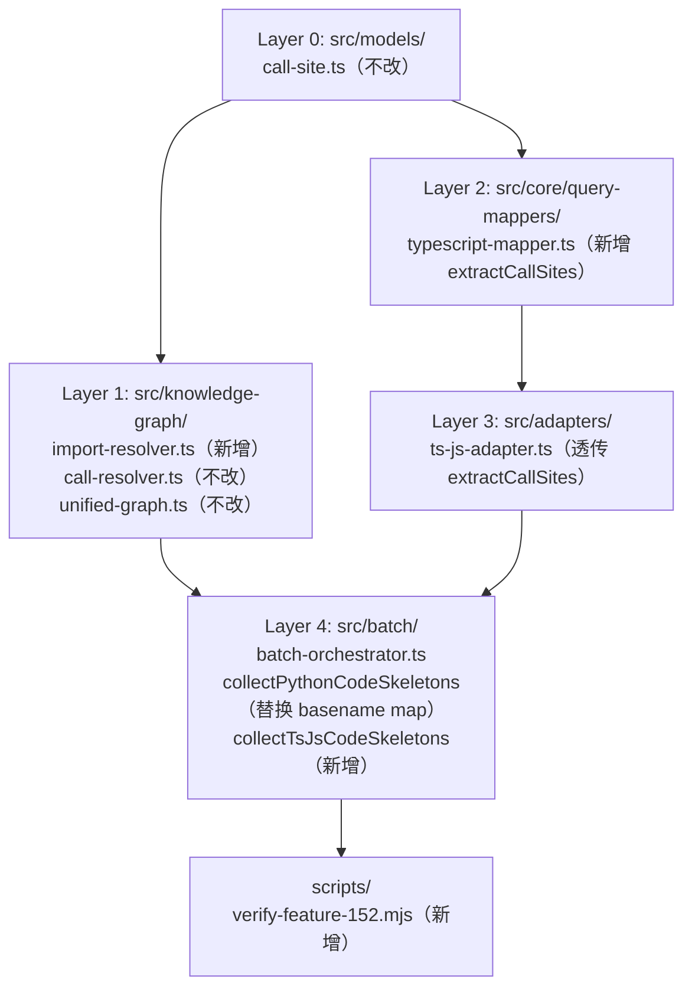

# 实施计划：TypeScript callSites + 通用 Import Path 智能解析

**分支**: `152-ts-callsites-import-resolver` | **日期**: 2026-05-08 | **Spec**: [spec.md](./spec.md)
**输入**: `specs/152-ts-callsites-import-resolver/spec.md`（V3，659 行，Codex 对抗审查通过）

---

## 摘要

Feature 152 在 Feature 151 建立的 UnifiedGraph + call-resolver 框架之上，补齐两个已知短板：

1. **TypeScript callSites 抽取**：在 `TypeScriptMapper` 中实现 `extractCallSites`（镜像 `PythonMapper`），并通过方案 B 在 `TsJsLanguageAdapter.analyzeFile` 中透传 flag（ts-morph 主路径处理 exports/imports，tree-sitter 额外路径补 callSites，merge 后输出）。
2. **import path 智能解析**：新增 `src/knowledge-graph/import-resolver.ts`，替换 `collectPythonCodeSkeletons` 的 basename map 算法，并为 `collectTsJsCodeSkeletons`（新增）提供跨模块边解析基础。

技术选型：沿用现有 tree-sitter-typescript + `TreeSitterAnalyzer` + `TypeScriptMapper` 架构，零新增 npm 依赖，纯静态分析，无状态机/并发控制。

---

## 技术上下文

**语言/版本**: TypeScript 5.x，Node.js 20.x
**主要依赖**: `web-tree-sitter`（已注册 TypeScript grammar）、`ts-morph`（TS 主路径，不改）、`fs/promises`（Node.js 内置，import-resolver 用）
**存储**: 不涉及持久化
**测试**: `vitest`（现有 3155 单测），新增 ≥ 14 条
**目标平台**: Node.js 20.x，Linux/macOS（Apple Silicon M1+/Intel i7+）
**性能目标**: TS callSites 双路径增量成本 ≤ 5s（hono 295 .ts 文件，SC-006）
**约束**: 零新 npm 依赖；`extractCallSites=false` 时与当前行为完全一致（FR-5.2）；`dunder` calleeKind 不产出（CL-08）
**规模**: 影响 5 个模块（新增 1 个，修改 4 个）

---

## Codebase Reality Check

| 目标文件 | LOC | 公开接口数 | 已知 debt |
|---------|-----|-----------|----------|
| `src/core/query-mappers/typescript-mapper.ts` | 803 | 3（extractExports / extractImports / extractParseErrors） | 无 TODO/FIXME；`extractCallSites` 接口方法已在 base-mapper.ts 声明但未实现 |
| `src/adapters/ts-js-adapter.ts` | ~110 | 4（analyzeFile / analyzeFallback / buildDependencyGraph / getTerminology） | 无；`analyzeFile` 当前完全委托 ts-morph，未走 TreeSitterAnalyzer |
| `src/batch/batch-orchestrator.ts`（L1995-2048） | ~2100 total；目标区段 54 | 1（collectPythonCodeSkeletons，package-private） | Codex P1 C-1 注释标注 basename map 为临时算法；L2005-2040 是待替换区段 |
| `src/knowledge-graph/import-resolver.ts` | 新增（0） | 3（resolvePythonImport / resolveTsJsImport / findNearestTsConfig） | N/A |
| `scripts/verify-feature-152.mjs` | 新增（0） | CLI 脚本 | N/A |

**前置清理规则评估**：
- `typescript-mapper.ts`：803 LOC，新增 `extractCallSites` 约 120 行 → 超过 LOC > 500 且新增 > 50 行阈值。无关联 TODO/FIXME，无重复逻辑 → 不需要独立 cleanup task，但实现时须保持现有辅助函数不变，仅在类尾追加方法。
- `batch-orchestrator.ts`：文件超 2000 行，但目标改动区段仅 54 行（L2029-2048 basename map 替换），不触发 cleanup 规则。
- 结论：**无需前置 cleanup task**，直接进入功能实现阶段。

---

## Impact Assessment

**影响文件统计**：

| 类型 | 文件 |
|------|------|
| 直接新增 | `src/knowledge-graph/import-resolver.ts`，`scripts/verify-feature-152.mjs`，`tests/unit/typescript-mapper-callsite.test.ts`，`tests/unit/knowledge-graph/import-resolver.test.ts` |
| 直接修改 | `src/core/query-mappers/typescript-mapper.ts`，`src/adapters/ts-js-adapter.ts`，`src/batch/batch-orchestrator.ts` |
| 间接受影响（调用方/下游验证） | `src/knowledge-graph/call-resolver.ts`（不改，接收 resolvedPath 变更后 importIndex 更准确）、`scripts/graph-accuracy.mjs`（不改，复用 `--language ts` 路径） |

**跨包影响**：
- `src/knowledge-graph/`（新增模块）← `src/batch/`（调用方）← `src/adapters/`（间接）
- 横跨 `src/knowledge-graph`、`src/core/query-mappers`、`src/adapters`、`src/batch`、`scripts/` 5 个顶层目录（均在 `src/` 边界内，`scripts/` 独立工具层不计入跨包）

**数据迁移**: 不涉及 schema 变更（CallSite schema 不改，ImportReference.resolvedPath 字段已存在，仅从 null 改为有效值）

**API/契约变更**:
- `TsJsLanguageAdapter.analyzeFile` 签名不变（`AnalyzeFileOptions` 接口已有 `extractCallSites` 字段占位，内部实现补全）
- `TypeScriptMapper.extractCallSites` 是新增方法，现有调用方无影响
- `collectPythonCodeSkeletons` 内部实现替换，函数签名不变

**风险等级**: **MEDIUM**
- 影响文件数 7（< 10，不触发 HIGH）
- 无真正的跨包边界（均在 `src/` 内部层级）
- 无数据迁移
- 无公共 API 契约变更（adapters 接口签名不变）

**MEDIUM 不需强制分阶段**，但已按"最小可验证批次"自然分为 P0-P6（见第 8 节）。

---

## Constitution Check

| 原则 | 适用性 | 评估 | 说明 |
|------|--------|------|------|
| I. 双语文档规范 | 适用 | PASS | plan.md 中文散文 + 英文代码标识符；实现时代码注释使用中文 |
| II. Spec-Driven Development | 适用 | PASS | 走完整 spec → plan → tasks → implement → verify 流程 |
| III. YAGNI / 奥卡姆剃刀 | 适用 | PASS | import-resolver 仅实现 Python pkg路径 / TS 相对路径 / TS tsconfig paths；不支持 Webpack alias / Jest moduleNameMapper / pnpm workspace（CL-04 明确） |
| IV. 诚实标注不确定性 | 适用 | PASS | tsx dialect 运行时检测路径在 spec EC-1 已标 `[推断]`，实现时验证 |
| V. AST 精确性优先 | 适用 | PASS | callSites 由 tree-sitter AST 静态抽取，不使用 LLM 推断；exports/imports 仍由 ts-morph 主导 |
| VI. 混合分析流水线 | 适用 | PASS | 三阶段：预处理（tree-sitter AST scan）→ 上下文组装（callSites merge）→ 下游生成（call-resolver） |
| VII. 只读安全性 | 适用 | PASS | import-resolver 是纯函数，collectTsJsCodeSkeletons 只读源文件，不写入目标代码 |
| VIII. 纯 Node.js 生态 | 适用 | PASS | 零新 npm 依赖（CL-01）；文件系统访问用 Node.js 内置 `fs/promises` |
| IX–XIV（spec-driver 原则） | 不适用 | N/A | 本 Feature 属于 spectra plugin，不涉及 spec-driver 编排 |

**结论**: 全部适用原则 PASS，无 VIOLATION，无需豁免论证。

---

## 项目结构

### 制品文件（本 Feature）

```text
specs/152-ts-callsites-import-resolver/
├── spec.md          # 已完成（V3，Codex 对抗审查通过）
├── plan.md          # 本文件
└── tasks.md         # 下一阶段生成（/spec-driver.tasks）
```

### 源代码布局（变更范围）

```text
src/
├── knowledge-graph/
│   ├── import-resolver.ts        # [新增] Python + TS import 路径解析
│   ├── call-resolver.ts          # [不改] Stage 1-4 已实现
│   └── unified-graph.ts          # [不改] schema 不变
├── core/
│   ├── query-mappers/
│   │   ├── typescript-mapper.ts  # [修改] 新增 extractCallSites 方法
│   │   ├── python-mapper.ts      # [不改] 参考实现
│   │   └── base-mapper.ts        # [不改] 接口已声明 extractCallSites?
│   └── tree-sitter-analyzer.ts   # [不改] TypeScriptMapper 已注册
├── adapters/
│   └── ts-js-adapter.ts          # [修改] analyzeFile 透传 extractCallSites
└── batch/
    └── batch-orchestrator.ts     # [修改] collectPythonCodeSkeletons 替换 + collectTsJsCodeSkeletons 新增

tests/
├── unit/
│   ├── typescript-mapper-callsite.test.ts    # [新增] ≥ 10 用例
│   └── knowledge-graph/
│       └── import-resolver.test.ts           # [新增] ≥ 10 用例

scripts/
└── verify-feature-152.mjs        # [新增] 独立验证脚本
```

**结构决策**: 单项目结构（Option 1），所有改动在 `src/` 内部四层分布（knowledge-graph L1 / query-mappers L2 / adapters L3 / batch L4），与 Feature 151 建立的 DAG 保持一致。

---

## 架构

### 1. 架构决策：方案 B — 双路径 merge

`TsJsLanguageAdapter.analyzeFile` 的 callSites 补充采用**方案 B**（spec §6 决议）：

- `extractCallSites=false`（默认）：完全走 ts-morph 单路径，行为与 master HEAD 完全一致，零性能影响。
- `extractCallSites=true`：ts-morph 完成 exports/imports 分析后，**额外**调用 `TreeSitterAnalyzer.analyze(filePath, 'typescript', { extractCallSites: true })`，取其 `callSites` 字段 merge 到结果。

**双路径污染隔离（EC-11）**：tree-sitter 路径返回的 `exports` / `imports` 字段在 merge 时 MUST discard，仅保留 `callSites`。`CodeSkeleton.exports` 和 `CodeSkeleton.imports` 始终来自 ts-morph 主路径。

```
analyzeFile(extractCallSites=true)
  │
  ├─► ts-morph analyzeFileInternal()   → { exports, imports, ... }
  │                                               ↓
  └─► TreeSitterAnalyzer.analyze()     → { callSites }
                                                  ↓
                              merge: { ...tsMorphResult, callSites: tsCallSites }
```

### 2. 模块层级 DAG



**关键依赖约束**：
- `import-resolver.ts` 不依赖 L2/L3/L4 中任何模块（纯函数，可独立测试，P0 阶段交付）
- `TypeScriptMapper.extractCallSites` 依赖 tree-sitter 原语（L0 `CallSite` schema），不依赖 `import-resolver`
- `collectTsJsCodeSkeletons` 同时依赖 L3（adapter）和 L1（import-resolver）

### 3. 接口契约（详细类型签名）

#### 3.1 import-resolver.ts

```typescript
// src/knowledge-graph/import-resolver.ts

export interface ResolveResult {
  /**
   * 解析后的目标文件路径，相对于 projectRoot 的 POSIX 相对路径。
   * 未命中（external / unresolved）时为 null。
   */
  resolvedPath: string | null;
  kind:
    | 'module'           // Python: pkg.engine → pkg/engine.py
    | 'package-init'     // Python: from pkg import X → pkg/__init__.py
    | 'relative-sibling' // Python: 相对 import（含祖先包 from .. import）
    | 'relative'         // TS: ./engine、../utils
    | 'paths-alias'      // TS: tsconfig.compilerOptions.paths 命中
    | 'absolute'         // TS: baseUrl 解析或磁盘绝对路径
    | 'external'         // 明确外部包（npm / Python stdlib）
    | 'unresolved';      // 解析失败/文件不存在/越过 projectRoot
}

export interface TsConfigResolutionContext {
  /** tsconfig.json 所在目录的绝对路径 */
  configDir: string;
  /**
   * baseUrl 配置。
   * - 用户未配置 baseUrl → 传 null（跳过 baseUrl 解析）
   * - 用户配置了 baseUrl → 传相对 configDir 的字符串（如 "."、"src"）
   */
  baseUrl: string | null;
  /** paths 映射（含 wildcard），key/value 保留原始 tsconfig 字符串 */
  paths: Map<string, string[]>;
}

/**
 * 解析 Python import 路径。
 * @param moduleSpec - import 说明符（如 "micrograd.engine"、".nn"）
 * @param callerFile  - 调用方文件的绝对路径
 * @param projectRoot - 项目根目录绝对路径
 * @returns ResolveResult（resolvedPath 为相对 projectRoot 的 POSIX 路径）
 */
export function resolvePythonImport(
  moduleSpec: string,
  callerFile: string,
  projectRoot: string,
): ResolveResult;

/**
 * 解析 TypeScript/JavaScript import 路径。
 * @param moduleSpec      - import 说明符（如 "./engine"、"~/utils"、"express"）
 * @param callerFile      - 调用方文件的绝对路径
 * @param projectRoot     - 项目根目录绝对路径
 * @param tsConfigContext - tsconfig 解析上下文（null 时仅走相对路径）
 * @returns ResolveResult
 */
export function resolveTsJsImport(
  moduleSpec: string,
  callerFile: string,
  projectRoot: string,
  tsConfigContext?: TsConfigResolutionContext | null,
): ResolveResult;

/**
 * 从 filePath 向上查找最近的 tsconfig.json。
 * @param filePath    - 起始文件的绝对路径
 * @param projectRoot - 不超过此目录，超过则返回 null
 * @returns { configDir, rawConfig } 或 null
 */
export function findNearestTsConfig(
  filePath: string,
  projectRoot: string,
): { configDir: string; rawConfig: Record<string, unknown> } | null;
```

#### 3.2 TypeScriptMapper.extractCallSites

```typescript
// src/core/query-mappers/typescript-mapper.ts（新增方法）

import type { CallSite } from '../../models/call-site.js';

// 类内新增：
extractCallSites(tree: Parser.Tree, source: string): CallSite[];
```

#### 3.3 TsJsLanguageAdapter.analyzeFile（透传扩展）

```typescript
// src/adapters/ts-js-adapter.ts（修改实现，签名不变）

// AnalyzeFileOptions 已有 extractCallSites?: boolean 字段，本 Feature 补全实现：
async analyzeFile(
  filePath: string,
  options?: AnalyzeFileOptions,  // extractCallSites=true 时触发双路径
): Promise<CodeSkeleton>;
```

#### 3.4 collectTsJsCodeSkeletons（新增）

```typescript
// src/batch/batch-orchestrator.ts（新增函数，与 collectPythonCodeSkeletons 对称）

async function collectTsJsCodeSkeletons(
  projectRoot: string,
  options?: { extractCallSites?: boolean },
): Promise<Map<string, CodeSkeleton>>;
```

### 4. tree-sitter walker 算法：TypeScriptMapper.extractCallSites

#### 4.1 总体结构

```
extractCallSites(tree, source):
  if source.length > CALLSITES_MAX_FILE_BYTES: return []   // size guard
  out: CallSite[] = []
  callerContextStack: string[] = []
  walk(tree.rootNode, callerContextStack, out)
  return out

walk(node, ctxStack, out):
  // 入栈：进入 scope 定义节点时推入 callerContext
  pushedCtx = false
  if node.type in SCOPE_DEFINING_TYPES:
    ctx = deriveCallerContext(node)
    if ctx:
      ctxStack.push(ctx)
      pushedCtx = true

  // 核心分发
  switch node.type:
    case 'call_expression':
      handleCallExpression(node, currentCtx(ctxStack), out)
      // 注意：dynamic import 也是 call_expression，需在内部判断
    case 'new_expression':
      handleNewExpression(node, currentCtx(ctxStack), out)
    case 'decorator':
      handleDecorator(node, currentCtx(ctxStack), out)
    case 'tagged_template_expression':
      handleTaggedTemplate(node, currentCtx(ctxStack), out)

  // 递归遍历子节点
  for child in node.children:
    walk(child, ctxStack, out)

  // 出栈
  if pushedCtx: ctxStack.pop()
```

#### 4.2 SCOPE_DEFINING_TYPES 与 callerContext 推导

```
SCOPE_DEFINING_TYPES = {
  'function_declaration',       // function foo() {}
  'function',                   // const f = function() {}
  'arrow_function',             // const f = () => {}
  'method_definition',          // class Foo { bar() {} }
}

deriveCallerContext(node) -> string | null:
  switch node.type:
    case 'function_declaration':
      return fieldText(node, 'name') ?? `<fn:${node.startPosition.row + 1}:${node.startPosition.column}>`
    case 'method_definition':
      name = fieldText(node, 'name')
      // 向上找 class_declaration 获取类名
      className = findAncestorClassName(node)
      if className and name: return `${className}.${name}`
      return name ?? null
    case 'arrow_function', 'function':
      // 尝试找到 variable_declarator 的名称
      parent = node.parent
      if parent?.type == 'variable_declarator':
        return fieldText(parent, 'name') ?? null
      // C-4 修复：匿名 arrow/function 也必须入栈 callerContext，否则嵌套 callback 内的
      // 调用会错误归属外层 class method（参考 ts-call-extractor.mjs Phase 4D round 2 修订）
      // 用 <arrow:line:col> 唯一化，避免同行嵌套两个 arrow 碰撞
      kind = node.type == 'arrow_function' ? 'arrow' : 'fn'
      return `<${kind}:${node.startPosition.row + 1}:${node.startPosition.column}>`
```

#### 4.3 7 种调用形态分流规则

```
handleCallExpression(node, callerCtx, out):
  funcNode = node.childForFieldName('function')
  if !funcNode: return

  // dynamic import: `import('./engine')`
  // C-8 修复：mkCallSite **不**接受 dynamicReason 参数（CallSite schema 仅 6 字段）
  // 动态调用语义通过 calleeName='import' + calleeKind='unresolved' 已可由 resolver 推断
  if funcNode.type == 'import':
    out.push(mkCallSite('import', 'unresolved', node, callerCtx))
    return

  // W-2 修复：super() 自调用（构造器内 super() 调用父类构造器）
  if funcNode.type == 'super':
    out.push(mkCallSite('super', 'super', node, callerCtx))
    return

  // eval / Function — dynamic call → unresolved（C-8 修复：无 dynamicReason 元数据）
  if funcNode.type == 'identifier' and funcNode.text in DYNAMIC_CALL_NAMES:
    out.push(mkCallSite(funcNode.text, 'unresolved', node, callerCtx))
    return

  // 普通 identifier 调用: foo()
  if funcNode.type == 'identifier':
    out.push(mkCallSite(funcNode.text, 'free', node, callerCtx))
    return

  // member_expression: obj.method() / Class.method()
  if funcNode.type == 'member_expression':
    // C-3 修复：检测链式 import().then() 模式，避免双计数
    // 模式：call_expression > member_expression > object=call_expression(import)
    objectNode = funcNode.childForFieldName('object')
    if objectNode?.type == 'call_expression':
      innerFunc = objectNode.childForFieldName('function')
      if innerFunc?.type == 'import':
        // 外层 .then(cb) 跳过 — 内层 import() 由递归子节点访问时由本函数 dynamic import 分支产出
        return
    handleMemberCall(funcNode, node, callerCtx, out)
    return

  // optional_chain: obj?.method()
  if funcNode.type == 'call_expression' or contains optional_chain:
    // 递归处理，提取 member_expression
    innerMember = extractInnerMember(funcNode)
    if innerMember: handleMemberCall(innerMember, node, callerCtx, out)
    return

handleMemberCall(memberNode, callNode, callerCtx, out):
  object = memberNode.childForFieldName('object')
  property = memberNode.childForFieldName('property')
  if !property: return
  calleeName = property.text
  qualifier = object?.text ?? ''

  // this.method() → member（无 qualifier）
  if qualifier == 'this':
    out.push(mkCallSite(calleeName, 'member', callNode, callerCtx))
    return

  // super.method() → super
  if qualifier == 'super':
    out.push(mkCallSite(calleeName, 'super', callNode, callerCtx))
    return

  // Class.method()（首字母大写）→ member + qualifier
  if qualifier and /^[A-Z]/.test(qualifier):
    out.push(mkCallSite(calleeName, 'member', callNode, callerCtx, qualifier))
    return

  // mod.fn()（首字母小写）→ cross-module + qualifier（与 PythonMapper L943-953 严格对齐）
  if qualifier:
    out.push(mkCallSite(calleeName, 'cross-module', callNode, callerCtx, qualifier))
    return

  // 无 qualifier → cross-module（兜底）
  out.push(mkCallSite(calleeName, 'cross-module', callNode, callerCtx))

handleNewExpression(node, callerCtx, out):
  // C-8 修复：不污染 CallSite schema（无 viaNew 字段）
  // new Foo() → free，calleeName = 'Foo'（FR-1.3）
  // SC-008 验证 new Foo() 与 class Foo 连通，**不**通过 mapper 元数据，而是通过：
  //   1. truth-set（ts-call-extractor.mjs）输出的 kind="constructor" 条目
  //   2. graph 层在 verify script 中按 line/file 关联到 mapper 输出的 callSite
  constructor = node.childForFieldName('constructor')

  // W-2 修复：dynamic constructor（new Function('code')）→ unresolved
  // C-8 修复：mkCallSite 不接受 dynamicReason 参数
  if constructor?.type == 'identifier' and constructor.text == 'Function':
    out.push(mkCallSite('Function', 'unresolved', node, callerCtx))
    return  // 防止 fall through 到下面的 free 分支

  if constructor?.type == 'identifier':
    out.push(mkCallSite(constructor.text, 'free', node, callerCtx))
  else if constructor?.type == 'member_expression':
    // new Foo.Sub() — 罕见但合法（如 new express.Router()）
    handleMemberCall(constructor, node, callerCtx, out)

handleDecorator(node, callerCtx, out):
  // 仅带参 decorator 产出 callSite（@Foo() 形态）
  // W-3 修复：找到 callExpression 后产出 callSite，**返回标记跳过子节点递归**
  // 否则 walker 会在内层 call_expression 子节点再次产出 free/member callSite，导致双计数
  callExpr = findChild(node, 'call_expression')
  if callExpr:
    funcNode = callExpr.childForFieldName('function')
    calleeName = funcNode?.type == 'identifier' ? funcNode.text :
                 funcNode?.type == 'member_expression' ?
                   (funcNode.childForFieldName('property')?.text ?? 'unknown') :
                 'unknown'
    out.push(mkCallSite(calleeName, 'decorator', callExpr, callerCtx))
    // 标记：walker 在 decorator 节点完成后，**不**再递归 callExpr 子节点
    return { skipSubtree: callExpr }
  // bare @Foo → 不产出 callSite（与 Python CL-04 对齐）

// 配合 walker 修订：walker 收到 handleDecorator 返回的 skipSubtree 时，
// 在递归子节点循环中跳过该子树。

handleTaggedTemplate(node, callerCtx, out):
  tag = node.childForFieldName('tag')
  if !tag: return
  if tag.type == 'identifier':
    out.push(mkCallSite(tag.text, 'free', node, callerCtx))
  else if tag.type == 'member_expression':
    handleMemberCall(tag, node, callerCtx, out)

DYNAMIC_CALL_NAMES = { 'eval', 'Function' }
CALLSITES_MAX_FILE_BYTES = 1_000_000  // 1MB，与 PythonMapper 对齐
```

#### 4.4 大文件 size guard 与 .tsx 方言支持

- `source.length > CALLSITES_MAX_FILE_BYTES`（1MB）→ 直接返回空数组，记录 parseError
- `.tsx` 文件：优先尝试 `tsx` dialect（`tree-sitter-typescript` 支持）；若 dialect 不可用则走 parse-error 路径，返回空 `callSites: []`，不阻塞其他文件（EC-1）

### 5. import-resolver 算法

#### 5.1 resolvePythonImport 算法

```
PYTHON_BUILTINS = Set(['os', 'sys', 're', 'io', 'json', 'math', 'time', 'datetime',
  'collections', 'itertools', 'functools', 'pathlib', 'typing', 'abc', 'copy',
  'string', 'struct', 'socket', 'threading', 'subprocess', 'logging', 'unittest',
  'hashlib', 'base64', 'random', 'operator', 'contextlib', 'weakref', 'inspect',
  'ast', 'dis', 'gc', 'importlib', 'types', 'enum', 'dataclasses', 'warnings',
  'traceback', 'pprint', 'heapq', 'bisect', 'array', 'queue', 'shutil', 'glob',
  'fnmatch', 'tempfile', 'pickle', 'csv', 'html', 'http', 'urllib', 'email',
  'xml', 'sqlite3', 'zlib', 'gzip', 'tarfile', 'zipfile', 'argparse', 'textwrap',
  'decimal', 'fractions', 'statistics', 'cmath', 'secrets', 'uuid', 'platform',
  'signal', 'mmap', 'concurrent', 'asyncio', 'select', 'ssl', 'configparser',
  'tomllib', 'gettext', 'locale', 'curses', 'readline', 'rlcompleter'])

resolvePythonImport(moduleSpec, callerFile, projectRoot):
  // 相对 import 判断（前导 `.` 个数）
  level = countLeadingDots(moduleSpec)  // from . import X → 1, from .. import X → 2
  stripped = moduleSpec.lstrip('.')     // 去掉前导点

  if level > 0:
    // PEP 328: 上溯 (level-1) 级
    baseDir = callerFile.dirname
    for _ in range(level - 1):
      baseDir = baseDir.parent
      // C-5 修复：用 path.relative 检查越界，不用字符串比较
      if !isInsideProjectRoot(baseDir, projectRoot):
        return { resolvedPath: null, kind: 'unresolved' }

    if stripped == '':
      // C-1 修复：`from . import nn` 形态：moduleSpec="." 时 stripped 为空，
      // **resolver 仅返回 __init__.py 表示包级 import**；调用方（collect 层）必须把
      // namedImports 拆解为单独的 resolver 调用：对每个 X 调用 resolver({moduleSpec=".X"})
      // 例：`from . import nn, utils` → collect 层拆为 2 次 resolver 调用：
      //   resolvePythonImport(".nn", callerFile, projectRoot) → returns "<dir>/nn.py"
      //   resolvePythonImport(".utils", callerFile, projectRoot) → returns "<dir>/utils.py"
      candidate = path.join(baseDir, '__init__.py')
      if fs.existsSync(candidate):
        return { resolvedPath: toPosix(path.relative(projectRoot, candidate)), kind: 'relative-sibling' }
      return { resolvedPath: null, kind: 'unresolved' }

    // `from .submodule import X` 或 `from ..pkg import X`
    parts = stripped.split('.')
    candidate1 = path.join(baseDir, ...parts) + '.py'
    candidate2 = path.join(baseDir, ...parts, '__init__.py')
    for candidate in [candidate1, candidate2]:
      if fs.existsSync(candidate):
        return { resolvedPath: toPosix(path.relative(projectRoot, candidate)), kind: 'relative-sibling' }
    return { resolvedPath: null, kind: 'unresolved' }

  // 绝对 import（无前导点）
  topModule = moduleSpec.split('.')[0]

  // Python stdlib 内置模块
  if PYTHON_BUILTINS.has(topModule):
    return { resolvedPath: null, kind: 'external' }

  // dotted path → 文件路径
  parts = moduleSpec.split('.')
  candidate1 = path.join(projectRoot, ...parts) + '.py'           // pkg/engine.py
  candidate2 = path.join(projectRoot, ...parts, '__init__.py')    // pkg/engine/__init__.py
  for candidate in [candidate1, candidate2]:
    if fs.existsSync(candidate):
      kind = candidate.endsWith('__init__.py') ? 'package-init' : 'module'
      // W-5 修复 V3：Python absolute import 命中分支也必须 POSIX 化（与 TS 路径一致）
      return { resolvedPath: toPosix(path.relative(projectRoot, candidate)), kind }

  return { resolvedPath: null, kind: 'unresolved' }
```

#### 5.2 resolveTsJsImport 算法

```
TS_EXTENSIONS = ['.ts', '.tsx', '.js', '.jsx']
TS_INDEX_SUFFIXES = TS_EXTENSIONS.map(ext => `/index${ext}`)

// W-5 修复：所有 ResolveResult.resolvedPath 输出必须 POSIX 化（cross-platform 一致）
function toPosix(p):
  return p.split(path.sep).join('/')

// W-1 修复：相对路径解析时若指向 .json / .d.ts → 视为 external（不入 callSites graph）
function isNonSourceTarget(absPath):
  return absPath.endsWith('.json') or absPath.endsWith('.d.ts')

resolveTsJsImport(moduleSpec, callerFile, projectRoot, tsConfigContext):
  // 磁盘绝对路径（罕见）
  if moduleSpec.startsWith('/'):
    for ext in TS_EXTENSIONS:
      candidate = moduleSpec + ext
      if fs.existsSync(candidate):
        return { resolvedPath: toPosix(path.relative(projectRoot, candidate)), kind: 'absolute' }
    return { resolvedPath: null, kind: 'unresolved' }

  // 相对路径
  if moduleSpec.startsWith('./') or moduleSpec.startsWith('../'):
    // W-1 修复 V3：在尝试源文件扩展名候补**之前**，先检查 moduleSpec 自身是否带 .json / .d.ts 后缀
    // 这覆盖 `import data from './config.json'` / `import type { X } from './types.d.ts'` 形态
    base = path.resolve(path.dirname(callerFile), moduleSpec)
    if isNonSourceTarget(moduleSpec):
      // moduleSpec 已显式带 .json / .d.ts 扩展名 — 视为外部目标，不入 callSites graph
      return { resolvedPath: null, kind: 'external' }
    for ext in TS_EXTENSIONS:
      if fs.existsSync(base + ext):
        return { resolvedPath: toPosix(path.relative(projectRoot, base + ext)), kind: 'relative' }
    for suffix in TS_INDEX_SUFFIXES:
      if fs.existsSync(base + suffix):
        return { resolvedPath: toPosix(path.relative(projectRoot, base + suffix)), kind: 'relative' }
    // 候补失败但 moduleSpec 是 .json / .d.ts 形态 — 回退检查（双保险）
    if isNonSourceTarget(base):
      return { resolvedPath: null, kind: 'external' }
    return { resolvedPath: null, kind: 'unresolved' }

  // 非相对路径：先尝试 paths alias，再 baseUrl，再判定 external
  if tsConfigContext:
    // paths wildcard 匹配
    for [pattern, replacements] in tsConfigContext.paths:
      if matches(moduleSpec, pattern):
        tail = extractTail(moduleSpec, pattern)  // wildcard 截断后的尾缀
        for replacement in replacements:
          resolved = replacement.replace('*', tail)  // 替换 wildcard
          absBase = path.resolve(tsConfigContext.configDir, tsConfigContext.baseUrl ?? '.', resolved)
          for ext in TS_EXTENSIONS:
            if fs.existsSync(absBase + ext):
              return { resolvedPath: toPosix(path.relative(projectRoot, absBase + ext)), kind: 'paths-alias' }
          for suffix in TS_INDEX_SUFFIXES:
            if fs.existsSync(absBase + suffix):
              return { resolvedPath: toPosix(path.relative(projectRoot, absBase + suffix)), kind: 'paths-alias' }

    // baseUrl 解析（仅 baseUrl != null 时）
    if tsConfigContext.baseUrl != null:
      absBase = path.resolve(tsConfigContext.configDir, tsConfigContext.baseUrl, moduleSpec)
      for ext in TS_EXTENSIONS:
        if fs.existsSync(absBase + ext):
          return { resolvedPath: toPosix(path.relative(projectRoot, absBase + ext)), kind: 'absolute' }
      for suffix in TS_INDEX_SUFFIXES:
        if fs.existsSync(absBase + suffix):
          return { resolvedPath: toPosix(path.relative(projectRoot, absBase + suffix)), kind: 'absolute' }

  // C-2 修复：区分 alias-like（unresolved）与 bare npm package（external）
  // alias-like 前缀（用户配置 paths 别名常用前缀）：~/, @/（非 scoped）, #/, $/
  // 检测规则：
  //   1. 以 ~/ / #/ / $/ 开头 → alias-like → unresolved（无 paths 命中说明配置缺失）
  //   2. @/foo（非 scoped 风格）→ alias-like → unresolved
  //   3. 否则按 npm 包名规则判定：
  //      - bare 包名（如 'express'）或 scoped 包（如 '@org/lib'，含 / 但首段以 @ 开头）→ external
  //      - 其他含 / 但首段不是合法 npm 包名 → unresolved
  ALIAS_PREFIXES = ['~/', '#/', '$/']
  if ALIAS_PREFIXES.some(p => moduleSpec.startsWith(p)):
    return { resolvedPath: null, kind: 'unresolved' }
  if moduleSpec.startsWith('@/'):  // 非 scoped @/foo 风格的 alias
    return { resolvedPath: null, kind: 'unresolved' }
  // 合法 npm 包：bare（'express'）/ scoped（'@org/lib'）
  firstSeg = moduleSpec.split('/')[0]
  isScoped = firstSeg.startsWith('@')
  if isScoped:
    // scoped 包形如 '@org/lib' — 至少需要含 '/' 一次且首段 '@' 后非空
    return { resolvedPath: null, kind: 'external' }
  // bare npm 包名规则：[a-z0-9][a-z0-9-_.]*（不含路径分隔）
  if /^[a-z0-9][a-z0-9-_.]*$/.test(firstSeg):
    return { resolvedPath: null, kind: 'external' }
  // 含 '/' 但首段不是合法 npm 包名 → 视为 alias-like 配置缺失
  return { resolvedPath: null, kind: 'unresolved' }
```

#### 5.3 findNearestTsConfig 算法

```
findNearestTsConfig(filePath, projectRoot):
  dir = path.dirname(filePath)
  // C-5 修复：用 path.relative 检查是否仍在 projectRoot 内，不用字典序字符串比较
  while isInsideProjectRoot(dir, projectRoot) or dir == projectRoot:
    candidate = path.join(dir, 'tsconfig.json')
    if fs.existsSync(candidate):
      rawConfig = JSON.parse(fs.readFileSync(candidate, 'utf8'))
      return { configDir: dir, rawConfig }
    parent = path.dirname(dir)
    if parent == dir: break  // 到达文件系统根
    if parent == projectRoot or !isInsideProjectRoot(parent, projectRoot):
      // 检查 projectRoot 自身是否含 tsconfig.json（边界情况）
      candidateAtRoot = path.join(projectRoot, 'tsconfig.json')
      if fs.existsSync(candidateAtRoot):
        rawConfig = JSON.parse(fs.readFileSync(candidateAtRoot, 'utf8'))
        return { configDir: projectRoot, rawConfig }
      break
    dir = parent
  return null

// 辅助函数：用 path.relative 判断 candidate 是否严格在 projectRoot 子树内（C-5 + N-2 修复）
//
// N-2 修复：`rel.startsWith('..')` 不安全，反例 candidate=`/repo/..cache/a.ts`，
// path.relative('/repo', '/repo/..cache/a.ts') = '..cache/a.ts'，会被误判为越界
// 正确判断：rel 必须**逐 path component**检查，第一段为 '..' 才算越界
function isInsideProjectRoot(candidate, projectRoot):
  rel = path.relative(projectRoot, candidate)
  if rel.length == 0:
    return false  // candidate == projectRoot，**不**算"在子树内"（projectRoot 自身边界）
  if path.isAbsolute(rel):
    return false  // 跨盘符（Windows）
  firstSeg = rel.split(path.sep)[0]
  if firstSeg == '..':
    return false  // 第一段是 '..' → 越界
  // 注意：rel='..cache/a.ts' 时 firstSeg='..cache'，不为 '..'，正确判定为子树内
  return true
```

### 6. 测试策略

#### 6.1 单测覆盖表（≥ 14 条）

**tests/unit/typescript-mapper-callsite.test.ts**（≥ 10 条）：

| # | 场景 | 期望 calleeKind |
|---|------|----------------|
| 1 | `foo()` 顶层 identifier 调用 | `free` |
| 2 | `this.method()` 类方法内 | `member`，无 qualifier |
| 3 | `Class.method()`（大写首字母） | `member`，qualifier="Class" |
| 4 | `mod.fn()`（小写首字母） | `cross-module`，qualifier="mod" |
| 5 | `obj?.method()` optional chain | 按首字母大小写分流（`cross-module` / `member`） |
| 6 | `() => foo()` 箭头函数内调用 | `free`，callerContext=箭头函数名 |
| 7 | `class Foo { bar() { baz() } }` 类方法内 | `free`，callerContext="Foo.bar" |
| 8 | `import('./engine')` 动态 import | `unresolved`，calleeName="import" |
| 9 | `super.method()` | `super` |
| 10 | `@Decorator()` 带参 decorator | `decorator` |
| 11 | bare `@Decorator`（不带括号） | 不产出 callSite |
| 12 | `new Foo()` 构造调用 | `free`，calleeName="Foo"（FR-1.3） |
| 13 | `tag\`template\`` tagged template | `free`（tag 为 identifier） / `member`（tag 为 member） |
| 14 | `eval('code')` 动态求值 | `unresolved`，calleeName="eval" |
| 15 | `.tsx` 文件 JSX fixture：`<Foo />` | callSites 中不含 Foo 的 callSite（EC-9 scope-out） |

**tests/unit/knowledge-graph/import-resolver.test.ts**（≥ 10 条）：

| # | 场景 | 期望 kind |
|---|------|----------|
| 1 | Python `from micrograd.engine import Value` | `module`，resolvedPath="micrograd/engine.py" |
| 2 | Python `from . import nn`（相对 import） | `relative-sibling` |
| 3 | Python `from .. import X`（祖先包） | `relative-sibling` |
| 4 | Python 越过 projectRoot | `unresolved` |
| 5 | Python `import os`（stdlib 内置） | `external`，resolvedPath=null |
| 6 | Python 同名 basename 冲突（`a/utils.py` vs `b/utils.py`） | 各自正确定位 |
| 7 | TS `./engine` 相对路径 | `relative`，resolvedPath="src/engine.ts" |
| 8 | TS tsconfig paths wildcard `~/*` → `src/*` | `paths-alias` |
| 9 | TS baseUrl 纯绝对路径（无 paths） | `absolute` |
| 10 | TS `express` 外部包 | `external`，resolvedPath=null |
| 11 | TS tsconfig.json 不存在，处理别名路径 | `unresolved`，不崩溃（FR-3.3） |
| 12 | monorepo nearest-config 选择（findNearestTsConfig） | 返回最近的 tsconfig 所在目录 |

#### 6.2 集成测试

- `collectPythonCodeSkeletons` 替换后，micrograd `from micrograd.engine import Value` 的 `imports[].resolvedPath` 命中正确路径（绝对路径，与 codeSkeletons Map key 同形态）
- `collectTsJsCodeSkeletons` 跑 self-dogfood：callSites 非空，`imports[].resolvedPath` 不全为 null
- `ts-js-adapter.analyzeFile(extractCallSites=true)` 后：`CodeSkeleton.exports` 来自 ts-morph（含类型信息），`callSites` 来自 tree-sitter，不交叉污染（EC-11）

#### 6.3 FR/EC ↔ 单测映射

| 需求 | 覆盖单测 |
|------|----------|
| FR-1.2 全部 6 种 calleeKind（TS extractor） | 单测 #1-15（typescript-mapper） |
| FR-1.3 new Foo() → free | 单测 #12 |
| FR-1.5 callerContext 条件必填 | 单测 #7（assert callerContext="Foo.bar"） |
| FR-2.3 from .. import X | 单测 #3 |
| FR-2.3 越过 projectRoot | 单测 #4 |
| FR-3.1.1 TsConfigResolutionContext | 单测 #8（paths）、#9（baseUrl） |
| FR-3.5 nearest-config | 单测 #12 |
| FR-4.3 basename 冲突消除 | 单测 #6 |
| EC-1 .tsx grammar | 单测 #15（tsx fixture） |
| EC-3 单点相对 import | 单测 #2 |
| EC-9 JSX scope-out | 单测 #15 |
| EC-10 path 形态对齐 | 集成测验（path.isAbsolute 断言） |
| EC-11 双路径唯一性 | 集成测验（exports 来源断言） |
| EC-12 baseUrl 纯绝对路径 | 单测 #9 |

### 7. verify-feature-152.mjs 设计

#### 7.1 命令行接口

```
node scripts/verify-feature-152.mjs [options]

Options:
  --target <path>       目标项目根目录（必选，可多次指定）
  --repeats <n>         precision/recall 重复次数（默认 3，用于中位数）
  --metric <name>       仅测单项指标（fill-rate|ts-precision-recall|python-resolution|perf|all）
  --out <path>          输出 JSON 路径（默认 stdout）
  --help                显示帮助
```

#### 7.2 输出 JSON 结构

```typescript
interface VerifyResult {
  // SC-001：TS callSites 填充率
  fillRate: number;                  // 0.0-1.0
  fillRateFilesWithCallSites: number;
  fillRateTruthFiles: number;

  // SC-002：precision/recall（N=3 中位数）
  precisionMedian: number;
  recallMedian: number;
  precisionRuns: number[];
  recallRuns: number[];

  // SC-003：Python import 解析正确率
  pythonResolutionRate: number;      // 两项目均值
  pythonResolutionDetails: { target: string; rate: number }[];

  // SC-006：性能
  perf: {
    nodeVersion: string;
    platform: string;
    cpuCount: number;
    baselineMs: number;              // extractCallSites=false
    enableMs: number;                // extractCallSites=true
    deltaMs: number;                 // 增量成本
  };

  // SC-008：new Foo() 与 class Foo graph-level 连通率
  sc008Rate: number;
  sc008Hits: number;
  sc008Total: number;
}
```

#### 7.3 执行架构（复用 verify-feature-151.mjs）

```
for each target:
  1. collectTsJsCodeSkeletons(target, extractCallSites=true)
  2. collectPythonCodeSkeletons(target)
  3. buildUnifiedGraph(codeSkeletons)
  4. 写出 graph.json 到 tmpDir

  5. SC-001: 比对 graph.json edges (calls) 与 ts-call-extractor.mjs truth set
  6. SC-002: for i in 1..repeats:
       node scripts/graph-accuracy.mjs --language ts --source <target> --graph graph.json
     取 precision/recall 中位数
  7. SC-003: 扫描 .py imports，统计 resolvedPath 非 null 比例
  8. SC-006: 分别计时 baseline/enable 两次 collectTsJsCodeSkeletons
  9. SC-008: graph-spot-check（localClassNames 交叉）

output: VerifyResult JSON
```

### 8. 实施 Phase 划分

| Phase | 内容 | 依赖 | 验证方式 |
|-------|------|------|---------|
| **P0** | `src/knowledge-graph/import-resolver.ts` + 单测 `import-resolver.test.ts` | 无（纯函数） | `npx vitest run import-resolver`；`npm run build` 零错误 |
| **P1** | `TypeScriptMapper.extractCallSites` + 单测 `typescript-mapper-callsite.test.ts` | P0（idle，不直接依赖） | `npx vitest run typescript-mapper-callsite`；build 零错误 |
| **P2** | `TsJsLanguageAdapter.analyzeFile` 透传 flag（方案 B 双路径 merge） | P1（TypeScriptMapper 已实现） | 集成测验：`analyzeFile(path, {extractCallSites: true})` 返回非空 callSites；EC-11 export 来源断言 |
| **P3** | `collectPythonCodeSkeletons` 替换 basename map → `resolvePythonImport` | P0（import-resolver 已实现） | 集成测验：micrograd `from micrograd.engine import Value` resolvedPath 命中；`npx vitest run` 全量 |
| **P4** | 新增 `collectTsJsCodeSkeletons`（依赖 P2 adapter + P0 import-resolver） | P2 + P0 | 集成测验：self-dogfood callSites 非空；imports[].resolvedPath 非全 null |
| **P5** | 新增 `scripts/verify-feature-152.mjs` | P3 + P4 | `node scripts/verify-feature-152.mjs --help` exit 0；`--target ./src` 完整输出 JSON |
| **P6** | 跑 baseline + 评估 SC-001 ~ SC-008 | P5 | `node scripts/verify-feature-152.mjs --target ./src --target ~/.spectra-baselines/hono --target ~/.spectra-baselines/micrograd`；对照阈值（precision ≥ 70%，recall ≥ 30%，pythonResolutionRate ≥ 80%，fillRate ≥ 95%，deltaMs ≤ 5000）|

**每个 Phase 提交前**：`npx vitest run`（全量）+ `npm run build`（零错误）+ `npm run lint`（零错误）。

**Phase 间切割**：每个 Phase 以独立 commit 交付，commit 前跑 Codex 对抗审查（per CLAUDE.local.md 约定）。

### 9. 风险与缓解

| # | 风险 | 概率 | 影响 | 缓解方案 |
|---|------|------|------|---------|
| R-1 | tree-sitter-typescript tsx dialect 不可用（EC-1） | 低（常见版本已支持） | medium（.tsx 文件 callSites 为空） | 运行时检测 dialect 可用性，不可用时走 parse-error 路径，记录 parseErrors，不抛异常 |
| R-2 | 双路径性能超 5s 阈值（SC-006） | 低-中（hono 295 文件，tree-sitter parse 较快） | medium（需优化） | extractCallSites 默认 false（CL-05），仅 panoramic 模式触发；P6 超阈时优先考虑 parse tree 缓存复用（TD-4） |
| R-3 | importIndex resolvedPath 路径形态与 codeSkeletons Map key 不一致（EC-10） | 中（实现时容易遗漏） | high（call-resolver cross-module edge 全部失效） | collect 函数内显式 path.resolve 转绝对路径；EC-10 集成单测 path.isAbsolute 断言 |
| R-4 | tsconfig paths wildcard 实现复杂（多 candidates 顺序不对） | 中 | medium（paths-alias 解析错误） | 单测覆盖精确 key + wildcard key + 多 candidates 三种形态（单测 #8） |
| R-5 | Python `from .. import X` 祖先包越界（EC-4 / FR-2.3） | 低 | low（返回 unresolved，不崩溃） | 单测 #4 明确越界返回 unresolved；while 循环 guard `dir >= projectRoot` |

### 10. 验证策略

按 verification_policy.required_commands（CLAUDE.md）顺序执行：

```bash
# 1. 类型检查
npm run build

# 2. 全量单测（现有 3155 + 新增 ≥ 14）
npx vitest run

# 3. Lint
npm run lint

# 4. 集成验证（self-dogfood）
node scripts/verify-feature-152.mjs --target ./src

# 5. 集成验证（hono + micrograd）
node scripts/verify-feature-152.mjs \
  --target ~/.spectra-baselines/hono/src \
  --target ~/.spectra-baselines/micrograd \
  --repeats 3

# 6. Python 路径回归保护（FR-8.4，**N-3 修复 V3**：byte-level 严格比对，与 T-034 一致）
# 6a. 在 master HEAD 切工作树跑一次：
git worktree add /tmp/master-baseline master
(cd /tmp/master-baseline && npm install && npm run build && \
  node scripts/graph-accuracy.mjs --language python --source ~/.spectra-baselines/micrograd > /tmp/python-master.json)
# 6b. 在本 Feature 工作树跑一次：
node scripts/graph-accuracy.mjs --language python --source ~/.spectra-baselines/micrograd > /tmp/python-feature152.json
# 6c. byte-level diff 必须返回 0：
diff /tmp/python-master.json /tmp/python-feature152.json
# 6d. 清理：
git worktree remove /tmp/master-baseline

# 7. 仓库一致性检查
npm run repo:check
```

**验收判定**：
- `npm run build`：零 TypeScript 错误
- `npx vitest run`：≥ 3169 条全 pass（3155 + 14 新增），零失败
- `npm run lint`：零错误
- SC-001 fillRate ≥ 95%
- SC-002 precision ≥ 70%，recall ≥ 30%（hono + self-dogfood 各 N=3 中位数）
- SC-003 pythonResolutionRate ≥ 80%（micrograd + nanoGPT 均值）
- SC-006 deltaMs ≤ 5000（hono 295 文件，标准笔记本硬件）
- SC-008 ≥ 80%（本仓库 export class 的 new 调用 graph 连通率）

---

## Complexity Tracking

| 决策 | 复杂度偏离原因 | 更简单方案被拒理由 |
|------|--------------|----------------|
| 方案 B（双路径 merge） | 两次 parse 同一文件（ts-morph + tree-sitter） | 方案 A（整体切换 tree-sitter）需重写 ts-morph 路径全部调用方，风险面更大；方案 B 是最小侵入 |
| `findNearestTsConfig` 辅助函数 | 调用方需要 nearest-config 逻辑（FR-3.5） | 直接传 projectRoot 下的 tsconfig.json 无法处理 monorepo 多 tsconfig 场景；nearest-config 是 YAGNI 最小实现 |
| N=3 中位数 | SC-002 防御 Map 迭代顺序差异 | N=1 无法区分偶然波动；算法 deterministic，N=3 已足够（与 Feature 151 验收模式一致） |

**总体复杂度**: MEDIUM（spec §12 一致）。组件 3（import-resolver、TypeScriptMapper.extractCallSites 方法、verify 脚本）、接口 4（resolvePythonImport、resolveTsJsImport、extractCallSites、analyzeFile 实现扩展）、跨模块耦合 4 个（knowledge-graph / query-mappers / adapters / batch-orchestrator），无状态机/并发/数据迁移，单次 implement phase 可交付。
