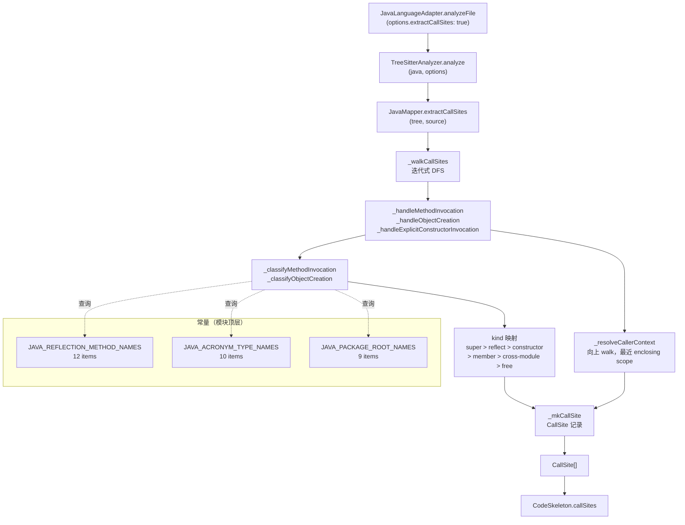

# 技术规划：Java callSites 抽取

## Summary

本计划实现 `JavaMapper.extractCallSites`，在现有 Java LanguageAdapter 链路中补全
callSites 抽取能力，使 Java 项目可在 UnifiedGraph 中建立调用边。

核心架构决策：**TS 端重新实现分类逻辑，不复用 `.mjs` 文件**（理由见下文），但语义
严格对齐 `scripts/lib/java-call-extractor.mjs`，常量集合保持同源校验。

功能需求（FR-001 ～ FR-013）和成功标准（SC-001 ～ SC-005）见 `spec.md`，本文不重复，
重点阐述"怎么实现"。

---

## Technical Context

| 维度 | 值 |
|------|----|
| 语言/运行时 | TypeScript 5.x + Node.js 20.x |
| tree-sitter binding | `web-tree-sitter`（同步 WASM，已初始化）|
| 调用链路 | `JavaMapper.extractCallSites` → `TreeSitterAnalyzer.analyze` → `JavaLanguageAdapter.analyzeFile` |
| 参考实现 | `scripts/lib/java-call-extractor.mjs`（823 行，ES module，完整 kind 映射与 walk 逻辑）|
| 测试框架 | vitest（已有完整套件）|
| 新增依赖 | 零（tree-sitter Java grammar + CallSiteSchema 均已存在）|

---

## Codebase Reality Check

| 文件 | LOC | 公开接口数 | 已知 debt |
|------|-----|-----------|-----------|
| `src/core/query-mappers/java-mapper.ts` | 481 | 3（`extractExports`/`extractImports`/`extractParseErrors`）| 无 TODO/FIXME；无超长函数；无重复逻辑 |
| `src/adapters/java-adapter.ts` | 92 | 5（`analyzeFile`/`analyzeFallback`/`getTerminology`/`getTestPatterns`/`extractComments`）| 无；`analyzeFile` 未透传 `extractCallSites`（本次修复点）|
| `src/core/query-mappers/__tests__/java-mapper.test.ts` | 不存在（新建）| — | — |
| `scripts/verify-feature-154.mjs` | 不存在（新建）| — | — |

前置清理规则评估：
- `java-mapper.ts` 481 行，新增 ~600 行后 > 500 行但新增 > 50 行 → **需观察是否拆分**。
  结论：`extractCallSites` 及其内部辅助函数作为独立逻辑块，使用 `// ====` 注释分隔区
  在同一文件中组织，不强制拆分（遵循 `python-mapper.ts` 的同文件模式，1093 行）。无前置
  cleanup task 触发（未达到 debt 阈值）。

---

## Impact Assessment

| 维度 | 值 |
|------|----|
| 直接修改文件 | 3（`java-mapper.ts`、`java-adapter.ts`、`scripts/lib/java-call-extractor.mjs` 仅顶部加 `export` 三常量）|
| 新增文件 | 2（`java-mapper.test.ts`、`verify-feature-154.mjs`）|
| 间接受影响文件 | 0（`TreeSitterAnalyzer` 已支持 `mapper.extractCallSites` 鸭子调用，无需改动）|
| 跨包影响 | 否（仅 `src/core/query-mappers/`、`src/adapters/`、`scripts/`）|
| 数据迁移 | 否（`CallSiteSchema` 不扩展）|
| API/契约变更 | 否（`CalleeKindSchema` 7 个值不变）|
| **风险等级** | **LOW**（改动文件 < 10，无跨包，无 schema 变更）|

---

## Architecture Decision: TS 重实现 vs 导入 .mjs

### 选项对比

| 方案 | 优点 | 缺点 |
|------|------|------|
| **方案 A：TS 重实现，语义对齐** | 同步执行符合 mapper 接口约定；类型安全；无跨模块格式依赖；独立测试 | 需维护两份分类逻辑（`_classifyMethodInvocation` TS 版 vs `.mjs` 版）|
| 方案 B：在 mapper 中 `import` java-call-extractor.mjs | DRY，逻辑零重复 | `.mjs` 用 `web-tree-sitter` 异步 + `loadTreeSitterGrammar`（重新初始化 parser），mapper 收到的是已初始化的同步 tree；两者 parser 类型不同；`.mjs` 返回 `TruthCall`（truth-set 格式）而非 `CallSite`（schema 格式），需额外转换；在 TS 编译产物中 dynamic import `.mjs` 路径不稳定 |

**选定方案 A**，理由：
1. `JavaMapper.extractCallSites(tree, source)` 接收**已解析好的** `Parser.Tree`，`java-call-extractor.mjs` 内部自行调用 `loadTreeSitterGrammar` + `parser.parse(source)` ——两者的输入契约不同，无法直接复用。
2. `.mjs` 使用异步 API，mapper 接口是同步的，混用会导致调用链出现隐式 Promise（破坏 `TreeSitterAnalyzer` 的同步流程）。
3. TS 版可通过 vitest 直接单测，`.mjs` 版无此便利。
4. 两侧逻辑分离符合"mapper 只关心已解析好的 tree，extractor 关心 IO + parse"的职责分离原则。

**同源性保证（按 spec FR-011 修订后明确允许）**：

`scripts/lib/java-call-extractor.mjs` 当前的常量 `REFLECTION_METHOD_NAMES` / `JAVA_ACRONYM_TYPE_NAMES` / `JAVA_PACKAGE_ROOT_NAMES` 是模块内部 `const`，未导出。本 Feature 在 spec FR-011 中显式开了一个**最小例外**：仅在 `scripts/lib/java-call-extractor.mjs` 顶部增加 `export` 关键字导出这三个常量集合（不改集合内容、不改函数行为）。

执行手段：
1. 在 `java-mapper.ts` 模块顶层声明 TS 版常量集合 `JAVA_REFLECTION_METHOD_NAMES` / `JAVA_ACRONYM_TYPE_NAMES` / `JAVA_PACKAGE_ROOT_NAMES`
2. 在 `java-mapper.test.ts` 中通过 `import { REFLECTION_METHOD_NAMES, JAVA_ACRONYM_TYPE_NAMES, JAVA_PACKAGE_ROOT_NAMES } from '../../../scripts/lib/java-call-extractor.mjs'` 导入 extractor 侧常量
3. 编写专门 `describe('constant homology')` 测试块，每个常量做 `expect(new Set([...mapperConst])).toEqual(new Set([...extractorConst]))` 集合相等断言
4. 该测试块归入仓库 `vitest run` 全集，每次 CI 跑必须 pass — repo:check 和 release:check 都依赖 vitest 全集，因此同源性自动校验

替代弱方案（不采纳）：仅在代码注释中保留两侧对照表 — 没有 build-time 强制，extractor 侧扩展时不会触发测试失败，违反 Codex review WARNING J 反馈。

---

## 关键文件改动清单

### 1. `src/core/query-mappers/java-mapper.ts`（新增 ~580 行）

新增区块（紧接现有 `_collectErrors` 方法之后）：

```
// ============================================================
// 常量 — callSites 抽取（语义与 scripts/lib/java-call-extractor.mjs 对齐）
// ============================================================
const CALLSITES_MAX_FILE_BYTES = 1_048_576;  // 1 MB
const JAVA_REFLECTION_METHOD_NAMES = new Set([...]);      // 12 项
const JAVA_ACRONYM_TYPE_NAMES = new Set([...]);           // 10 项
const JAVA_PACKAGE_ROOT_NAMES = new Set([...]);           // 9 项

// ============================================================
// JavaMapper（新增 extractCallSites + 内部辅助）
// ============================================================
```

新增的公开方法与内部辅助函数：

| 函数签名 | 行数估算 | 说明 |
|---------|---------|------|
| `extractCallSites(tree, source): CallSite[]` | ~20 行 | 入口，大文件兜底 + 调用 `_walkCallSites` |
| `private _walkCallSites(root, out): void` | ~55 行 | 迭代式 DFS（栈结构），处理 ERROR/MISSING 跳过 |
| `private _handleMethodInvocation(node, out): void` | ~40 行 | 分类 + phantom 检查 + 推入 `out` |
| `private _handleObjectCreation(node, out): void` | ~35 行 | 构造器分类 + phantom 检查 |
| `private _handleExplicitConstructorInvocation(node, out): void` | ~25 行 | `super()`/`this()` 处理 |
| `private _classifyMethodInvocation(node): {calleeName, calleeKind, calleeQualifier}` | ~80 行 | kind 映射核心逻辑 |
| `private _classifyObjectCreation(node): {calleeName, calleeKind, calleeQualifier}` | ~50 行 | new ClassName() 分类 |
| `private _resolveCallerContext(node): string` | ~60 行 | 向上 walk，最近 enclosing scope |
| `private _findEnclosingTypeName(node): string` | ~35 行 | 从 class_body 向上找类名 |
| `private _isPhantomCall(node, kind): boolean` | ~30 行 | phantom 防护 |
| `private _isJavaTypeName(text): boolean` | ~15 行 | PascalCase + acronym 白名单 |
| `private _fieldAccessTerminalIsType(node): boolean` | ~20 行 | FQN 末段判断 |
| `private _fieldAccessSegments(node): string[] \| null` | ~25 行 | FQN 链拆分 |
| `private _looksLikePackageQualifiedType(node): boolean` | ~15 行 | 包路径形态检测 |
| `private _normalizeJavaTypeName(name): string` | ~8 行 | 取 `.` 末段 |
| `private _stripTypeArgs(text): string` | ~8 行 | 剥离泛型参数 |
| `private _mkCallSite(...): CallSite` | ~15 行 | 构造 CallSite 记录 |

**行数估算合计**：约 580 行（保守）。最终文件约 1060 行，与 `python-mapper.ts` 体量相当，不触发拆分。

### 2. `src/adapters/java-adapter.ts`（修改 1 行 + 注释）

```typescript
// 修改前
return analyzer.analyze(filePath, 'java', {
  includePrivate: options?.includePrivate,
});

// 修改后
return analyzer.analyze(filePath, 'java', {
  includePrivate: options?.includePrivate,
  // Feature 154 — 透传 extractCallSites flag（与 python-adapter.ts:54 对齐）
  extractCallSites: options?.extractCallSites,
});
```

改动：1 行新增 + 1 行注释，总计 +2 行。

### 3. `src/core/query-mappers/__tests__/java-mapper.test.ts`（新建，~420 行）

文件**不存在**（已确认），本次新建。覆盖 8 个测试场景 × 最少 1 个 case 共 ≥ 7 个 test，详见测试矩阵章节。

### 4. `scripts/verify-feature-154.mjs`（新建，~260 行）

独立端到端验收脚本，详见 Verify 脚本设计章节。

---

## 接口契约

### `JavaMapper.extractCallSites` 签名

```typescript
// 新增到 QueryMapper interface（已有可选实现，鸭子调用）
extractCallSites(tree: Parser.Tree, source: string): CallSite[]
```

入参：
- `tree`：`web-tree-sitter` 同步解析完成的 `Parser.Tree`（已由 `TreeSitterAnalyzer` 初始化）
- `source`：原始 Java 源码字符串（用于 `source.length` 大文件检测）

返回：`CallSite[]`（符合 `CallSiteSchema`），大文件时返回 `[]`。

### 内部辅助函数命名约定

所有辅助函数使用 `_` 前缀作为 `private` 方法，名称与 `python-mapper.ts` 的命名惯例对齐：

```typescript
private _walkCallSites(root: Parser.SyntaxNode, out: CallSite[]): void
private _handleMethodInvocation(node: Parser.SyntaxNode, out: CallSite[]): void
private _handleObjectCreation(node: Parser.SyntaxNode, out: CallSite[]): void
private _handleExplicitConstructorInvocation(node: Parser.SyntaxNode, out: CallSite[]): void
private _classifyMethodInvocation(node: Parser.SyntaxNode): ClassifyResult
private _classifyObjectCreation(node: Parser.SyntaxNode): ClassifyResult
private _resolveCallerContext(node: Parser.SyntaxNode): string
private _findEnclosingTypeName(node: Parser.SyntaxNode | null): string
private _isPhantomCall(node: Parser.SyntaxNode, kind: PhantomKind): boolean
private _isJavaTypeName(text: string): boolean
private _fieldAccessTerminalIsType(node: Parser.SyntaxNode): boolean
private _fieldAccessSegments(node: Parser.SyntaxNode): string[] | null
private _looksLikePackageQualifiedType(node: Parser.SyntaxNode): boolean
private _normalizeJavaTypeName(name: string): string
private _stripTypeArgs(text: string): string
private _mkCallSite(calleeName, kind, line, col, callerCtx?, qualifier?): CallSite
```

辅助类型（文件内部，不 export）：

```typescript
type ClassifyResult = {
  calleeName: string;
  calleeKind: CalleeKind;
  calleeQualifier?: string;
};
type PhantomKind = 'method-invocation' | 'object-creation' | 'explicit-constructor';
```

### 常量位置

模块顶层 `const`（`JavaMapper` class 定义之前），3 个常量与 `.mjs` 版同名对应：

```typescript
const CALLSITES_MAX_FILE_BYTES = 1_048_576;
const JAVA_REFLECTION_METHOD_NAMES: ReadonlySet<string> = new Set([...12 items...]);
const JAVA_ACRONYM_TYPE_NAMES: ReadonlySet<string> = new Set([...10 items...]);
const JAVA_PACKAGE_ROOT_NAMES: ReadonlySet<string> = new Set([...9 items...]);
```

---

## kind 映射：精确实施细节

### 优先级 dispatch 逻辑（`_classifyMethodInvocation`）

```
function _classifyMethodInvocation(node):
  nameNode = node.childForFieldName('name')
  if !nameNode → return { calleeName: '<unknown>', calleeKind: 'unresolved' }
  calleeName = nameNode.text

  objectNode = node.childForFieldName('object')

  // 优先级 1：super.method()（object.type === 'super'）
  // 注：super() / this() 是 explicit_constructor_invocation，不进 _classifyMethodInvocation；
  //     由 _handleExplicitConstructorInvocation 单独处理（节点类型分流，无优先级冲突）
  if objectNode?.type === 'super':
    return { calleeName, calleeKind: 'super' }

  // 优先级 2：反射方法名（short-circuit，先于 receiver 类型检查）
  if JAVA_REFLECTION_METHOD_NAMES.has(calleeName):
    return { calleeName, calleeKind: 'unresolved' }

  // 优先级 3：this.method() — Codex P1 CRITICAL E 修订
  // tree-sitter Java grammar 把 `this` 解析为独立 node type 'this'（不是 'identifier'），
  // 必须在 identifier 分支之前显式判断
  if objectNode?.type === 'this':
    return { calleeName, calleeKind: 'member', calleeQualifier: undefined }

  // 优先级 4/5：有 receiver → 判断 static vs instance
  if objectNode:
    // type_identifier（List, Map 等）或 scoped_type_identifier（java.util.List）
    if objectNode.type === 'type_identifier' || objectNode.type === 'scoped_type_identifier':
      qualifier = _normalizeJavaTypeName(objectNode.text)
      return { calleeName, calleeKind: 'member', calleeQualifier: qualifier }

    // identifier receiver
    if objectNode.type === 'identifier':
      if _isJavaTypeName(objectNode.text):
        // PascalCase / acronym 白名单 → static member
        return { calleeName, calleeKind: 'member', calleeQualifier: objectNode.text }
      else:
        // lowercase instance variable
        return { calleeName, calleeKind: 'cross-module', calleeQualifier: objectNode.text }

    // field_access（Outer.Inner.method / com.foo.Bar.baz）
    if objectNode.type === 'field_access':
      if _fieldAccessTerminalIsType(objectNode):
        segs = _fieldAccessSegments(objectNode)
        qualifier = segs ? segs[segs.length - 1] : _normalizeJavaTypeName(objectNode.text)
        return { calleeName, calleeKind: 'member', calleeQualifier: qualifier }
      else:
        // 末段非类型 → instance method on chained call expression
        return { calleeName, calleeKind: 'cross-module', calleeQualifier: undefined }

    // 其它 receiver（method_invocation 链 / array_access 等）→ cross-module，无 qualifier
    return { calleeName, calleeKind: 'cross-module', calleeQualifier: undefined }

  // 无 receiver（裸调用，含 static import 展开的 free function）：统一归 'member' + qualifier=undefined
  // 与 truth-set extractor (kind=method) 一致；本 Feature 不输出 'free'（详见 spec FR-003 deferred 决策）
  return { calleeName, calleeKind: 'member', calleeQualifier: undefined }
```

**关于 `free` 的最终决策**（已落 spec v0.2 修订）：spec FR-003 已显式取消 `free` 分支，统一归 `member` + `qualifier=undefined`。Codex spec adversarial review CRITICAL A 已记录权衡；后续若需精确区分 "caller 类内 method" vs "static import free function"，应在 call-resolver 层基于 `imports` 中的 static import 信息处理，不在 mapper 阶段。

---

## callerContext 栈维护策略

**选择：向上 walk（与 `java-call-extractor.mjs` 一致）**，而非 `_walkCallSites` 向下传递显式 stack。

理由：
1. `_walkCallSites` 使用**迭代式 DFS**（手工栈）处理节点，在迭代 pop 时维护"当前 callerContext"的显式上下文栈需要记录进入/退出事件，会显著复杂化迭代 DFS 逻辑（需在入栈时同时入 context 栈，出栈时出 context 栈，且需区分"进入"节点还是"退出"标记）。
2. `_resolveJavaCaller` 在 `.mjs` 中通过 `node.parent` 向上遍历，逻辑简洁，每次调用 O(depth)（通常 < 20 层）。
3. HikariCP 最大文件约 800 LOC，嵌套深度有限，向上 walk 无性能问题。
4. 与 truth-set extractor 保持完全一致的语义，有助于 precision/recall 对齐。

实施：`_resolveCallerContext(node)` 方法从调用点节点开始 `while (cursor.parent)` 向上，匹配 `method_declaration` / `constructor_declaration` / `compact_constructor_declaration` / `lambda_expression` 的处理逻辑与 `_resolveJavaCaller` 完全对应，但输出仅为 `callerContext` 字符串（不含 relPath 前缀，spec FR-008 格式）。

---

## 风险点与应对

### 风险 1：tree-sitter Java grammar field name 与预期不符

**描述**：`method_invocation` 的 receiver 字段在 tree-sitter-java grammar 中命名为 `object`，但不同版本 grammar 可能存在差异（如 `receiver` / `target`）。`object_creation_expression` 的类型字段命名为 `type`，容易与 TypeScript 关键字冲突（但这是 `.childForFieldName('type')`，无实际冲突）。

**应对**：
- 在 `_classifyMethodInvocation` 中，`childForFieldName` 返回 null 时优雅降级（返回 `unresolved`）。
- 单测使用**真实** tree-sitter Java grammar 解析 Java 代码片段（不 mock），确保字段名正确。
- 可参考 `java-call-extractor.mjs` 的 `_getField` 防御写法。

### 风险 2：HikariCP recall ≥ 30% 是否可达（Codex P1 WARNING D 数据修订）

**实测基线数据**（在 `~/.spectra-baselines/HikariCP/src/main` 上跑 `extractJavaCallSites`）：
- 总 truthCalls：~2025 条
- 有调用的文件：39 个
- lambda caller 条目：45
- unresolved（反射）条目：39
- method reference (`::`) 出现：25 处（双侧排除）
- 最大单文件：`HikariConfig.java` 约 1262 LOC（约 50 KB，远低于 1 MB 门槛但非 plan 早期估算的 800 LOC）

**recall 风险分类**（基于实测）：
1. **method reference (`::`)**：truth-set 不抽，mapper 不抽 → 对 SC-002 中性
2. **反射调用**：truth-set 输出 `caller=...,callee=forName/invoke/...,kind=unresolved`，mapper 同样输出 callerContext + calleeName + unresolved。label-only 比对使用 `(file, callerLabel, calleeName)`，反射部分**可命中**（calleeName 来自反射方法名，callerLabel 来自 enclosing scope）
3. **链式调用**（`pool.getConnection().prepareStatement(sql)`）：嵌套 `method_invocation`，外层 receiver 是内层 method_invocation，归 `cross-module` qualifier=undefined。truth-set 行为一致，命中
4. **lambda/stream chained API**：lambda 内部调用 callerContext = `<lambda:行:列>`，truth-set 同格式，对齐后命中
5. **真正的 recall 风险**：
   - `callerContext` 格式与 truth-set 不对齐（如 method/constructor/compact_constructor 命名漂移）
   - `this.method()` 误归 `cross-module`（Codex CRITICAL E 已修复）
   - 嵌套 class 多层路径输出（已在 spec FR-008 + plan _resolveCallerContext 限制为最近一层）

**评估**：recall ≥ 30% 风险 **MEDIUM**（非 LOW）。verify 脚本必须包含 debug 模式输出最差 recall 文件，让 implement 阶段能定位 callerLabel 不对齐问题。

### 风险 3：大文件性能（Codex P1 WARNING D 数据修订）

HikariCP 最大单文件 `HikariConfig.java` 约 1262 LOC（约 50 KB），距 1 MB 门槛仍有 20 倍空间，不触发大文件兜底。迭代式 DFS 避免大文件递归爆栈。**新增测试要求**：测试矩阵中加 `HikariConfig.java` 风格的大型文件（手工构造 1500 LOC 的合成 fixture）边界单测，覆盖 `_walkCallSites` 在该规模下的完整性。

### 风险 4：tree-sitter parse 异常兜底

`TreeSitterAnalyzer.analyze` 已在外层有 try-catch，但 `JavaMapper.extractCallSites` 内部若发生意外异常（如 grammar 节点 API 变更），应在 `extractCallSites` 入口处捕获并返回空数组 + warn 日志，避免影响 `CodeSkeleton` 其他字段的返回。

---

## Architecture Diagram



---

## Verify 脚本设计（`scripts/verify-feature-154.mjs`）

### 入参

```
node scripts/verify-feature-154.mjs \
  --target ~/.spectra-baselines/HikariCP/src/main \
  [--out ./verify-154-result.json] \
  [--repeats 3]          # 默认 3，N=3 中位数
```

### 执行流程

```
1. 参数解析 + build 检查
   ├─ 验证 dist/adapters/java-adapter.js 存在
   └─ 验证 --target 目录存在

2. bootstrapRuntime（初始化 tree-sitter WASM）

3. 收集 truth-set（运行时重生成，不读缓存）
   └─ import scripts/lib/java-call-extractor.mjs
   └─ extractJavaCallSites({ sourceRoot: target })
   └─ 构建 truthIndex: Map<file, Set<"callerLabel|calleeName">>
   └─ truthFilesWithCalls = 有至少 1 条 truthCall 的文件集合

4. N 次重复测量（默认 3 次）
   for (let i = 0; i < repeats; i++):
     ├─ 扫描 target/**/*.java 文件
     ├─ new JavaLanguageAdapter()
     ├─ for each file:
     │    sk = await adapter.analyzeFile(file, { extractCallSites: true })
     │    callSites = sk.callSites ?? []
     ├─ 计算 fillRate:
     │    分子 = callSites.length > 0 的文件 ∩ truthFilesWithCalls
     │    分母 = truthFilesWithCalls.size
     │    fillRate = 分子 / 分母
     ├─ 计算 precision / recall（label-only 三元组）:
     │    mapperTuples = Set<"relFile|callerContext|calleeName">
     │    truthTuples  = Set<"relFile|callerLabel|calleeName">（从 truthIndex 展开）
     │    precision = |mapperTuples ∩ truthTuples| / |mapperTuples|
     │    recall    = |mapperTuples ∩ truthTuples| / |truthTuples|
     └─ 记录 {fillRate, precision, recall}

5. 计算中位数（median over N runs）

6. 输出 JSON 汇总
   {
     target, repeats, runsRaw: [...],
     median: { fillRate, precision, recall },
     thresholds: { fillRate: 0.95, precision: 0.70, recall: 0.30 },
     pass: boolean
   }
   写入 --out（若指定）；同时 console.log

7. exit code
   pass → process.exit(0)
   fail → process.exit(1)
```

### 与 `verify-feature-151.mjs` 的差异

| 维度 | verify-151 | verify-154 |
|------|-----------|-----------|
| 语言 | Python | Java |
| 目标产物 | `buildUnifiedGraph`（调用边） | `JavaMapper.extractCallSites`（mapper 直接输出）|
| truth-set 来源 | graph-accuracy.mjs（无独立 extractor）| `java-call-extractor.mjs`（运行时重生成）|
| 比对 metric | fill-rate + graph precision/recall | fill-rate + label-only mapper precision/recall |
| UnifiedGraph 依赖 | 是（`dist/knowledge-graph/index.js`）| 否（直接用 adapter 输出）|
| truth-set 格式转换 | 无 | 需将 `caller: "relPath:label"` 拆分为 `callerLabel` |

### callerLabel 归一化算法（Codex P1 WARNING B 修订）

truth-set extractor 输出 `caller: "${relPath}:..."`，可能形态：

| extractor caller 输出 | 期望 callerLabel |
|----------------------|------------------|
| `"src/main/HikariPool.java:HikariPool.getConnection"` | `"HikariPool.getConnection"` |
| `"src/main/HikariPool.java:HikariPool.<init>"` | `"HikariPool.<init>"` |
| `"src/main/HikariPool.java:<lambda:42:18>"` | `"<lambda:42:18>"` |
| `"src/main/HikariPool.java:<top-level>"` | `"<top-level>"` |
| `"src/main/HikariPool.java:<anon-class>.run"` | `"<anon-class>.run"` |

实施伪代码（verify 脚本中）：

```js
function extractCallerLabel(extractorCaller, file) {
  // 优先精确匹配 "${file}:" 前缀（避免 callerLabel 内含 ':' 时被错误拆分，如 lambda）
  const filePrefix = file + ':';
  if (extractorCaller.startsWith(filePrefix)) {
    return extractorCaller.slice(filePrefix.length);
  }
  // 兜底：取首个 ':' 之后（理论上 file 来自 truth-set 的 file 字段，不应进入此分支）
  const colonIdx = extractorCaller.indexOf(':');
  return colonIdx >= 0 ? extractorCaller.slice(colonIdx + 1) : extractorCaller;
}
```

注：`_resolveJavaCaller` 在嵌套 lambda 内部 method 调用时会从最近 lambda 立即返回（参见 `java-call-extractor.mjs:557` 嵌套优先策略），不会产生 `relPath:Outer.method:Inner.<lambda...>` 这种链式格式。`extractCallerLabel` 不必处理多层嵌套。

### Verify 核心算法的可测性（Codex P1 WARNING H 修订）

`extractCallerLabel` / `median` / `evaluateMatch` 等纯函数 MUST 单独 export，让 `scripts/__tests__/verify-feature-154.test.ts` 或同位置 unit test 覆盖：

- `extractCallerLabel` 5 形态正确性（method/init/lambda/top-level/anon-class）
- `median` 偶数 / 奇数 / 单元素 / 空数组边界
- `evaluateMatch(mapperTuple, truthIndex)` 命中 / 未命中

verify 脚本主流程（IO + 业务串联）不强制覆盖单测，但每个纯函数都必须可独立调用。

### debug 模式

在计算 precision/recall 后，若 `recall < 0.30`，额外输出 debug 信息：
```
[debug] 最差 recall 文件（callerContext miss 最多）：
  file: HikariPool.java, truthTuples: 45, mapperHits: 8
  miss 示例（前 5）：
    HikariPool.<init> | addConnectionListener
    HikariPool.getConnection | getConnection
    ...
```

这让 implement 阶段可快速定位哪个 callerContext 或 calleeName 提取有问题。

---

## 测试矩阵（SC-003 规划）

8 个场景 × ≥ 1 test case = ≥ 8 个 test，满足 SC-003 ≥ 7 的要求。

| # | 场景 | Java 代码片段摘要 | 断言目标 |
|---|------|-----------------|---------|
| 1 | 实例 method call | `obj.method()` | `calleeKind: 'cross-module'`, `calleeQualifier: 'obj'`, `calleeName: 'method'` |
| 2 | method overloading（label-only）| `connect(url)` + `connect(props)` 同名两个方法，调用点 `connect(url)` | 输出恰好 1 条 `calleeName: 'connect'`，不重复 |
| 3 | static / PascalCase Class.method | `List.of()` / `Collections.sort()` | `calleeKind: 'member'`, `calleeQualifier: 'List'` |
| 4 | interface default method 与 enclosing interface callerContext | interface `Closeable { default void close() { helper(); } }` | `callerContext: 'Closeable.close'` |
| 5 | lambda 内部调用与嵌套优先 | `list.forEach(x -> x.doSomething())` | lambda 内 `doSomething` 的 `callerContext` 包含 `<lambda:` |
| 6 | 反射调用 | `Class.forName(...)` / `clazz.getDeclaredConstructor()` | `calleeKind: 'unresolved'`, `calleeName: 'forName'` |
| 7 | callerContext：record compact constructor + nested class | record `Point { Point { validate(); } }` + nested class method | `callerContext: 'Point.<init>'` / `'Inner.method'` |
| 8 | generic method invocation | `List.<String>of()` / `ClassName.<T>create()` | `calleeName: 'of'`，忽略 type arguments；`calleeKind: 'member'` |

**MUST 边界测试**（Codex P1 WARNING G 提升为强制要求，对应 spec MUST-级 FR）：

| # | 场景 | 对应 FR | 断言目标 |
|---|------|---------|---------|
| 9 | 大文件兜底 | FR-006 MUST | 构造 source.length > 1_048_576 输入 → `extractCallSites` 返回 `[]` |
| 10 | phantom call（ERROR 节点跳过子树）| FR-007 MUST | 拼装含 syntax error 的 Java 片段，断言 ERROR 子树内调用未抽，但 ERROR 外的真实调用照抽 |
| 11 | super() / this() explicit constructor | FR-001 MUST + FR-003 super 行 | `calleeKind: 'super'` + `calleeName: 'super'`/`'this'` |
| 12 | 匿名类内部 method 调用 | FR-008 MUST | `callerContext: '<anon-class>.{methodName}'` |
| 13 | this.method() 调用（Codex P1 CRITICAL E）| FR-003 this 行 | `calleeKind: 'member'` + `calleeQualifier: undefined`，**不能**误归 cross-module |

总计 8 主场景 + 5 MUST 边界 = 13 测试 case，全部强制覆盖；SC-003 ≥ 7 是数量下限，本 plan 实施时不允许低于 13。

**常量同源测试**（独立 describe 块）：
- `expect(new Set(JAVA_REFLECTION_METHOD_NAMES)).toEqual(new Set(REFLECTION_METHOD_NAMES))` (mapper TS vs extractor mjs)
- `expect(new Set(JAVA_ACRONYM_TYPE_NAMES)).toEqual(new Set(JAVA_ACRONYM_TYPE_NAMES_FROM_MJS))`
- `expect(new Set(JAVA_PACKAGE_ROOT_NAMES)).toEqual(new Set(JAVA_PACKAGE_ROOT_NAMES_FROM_MJS))`

**Verify 核心算法单测**（Codex P1 WARNING H）：
- `extractCallerLabel` 5 形态正确性
- `median` 偶数 / 奇数 / 单元素 / 空数组边界
- `evaluateMatch` 命中 / 未命中

---

## 任务分解原则（Codex P1 WARNING C 修订：顺序增量验收，非独立）

拆分为 **5 个顺序增量验收 task**，每个 task 在前序 task 通过后增量验证：

**T-1（基础骨架 + 常量声明 + extractor export）** — 无前置依赖
- 修改 `scripts/lib/java-call-extractor.mjs` 顶部加 `export` 三常量（仅修改 export 语法，不动集合内容）
- `java-mapper.ts` 模块顶层声明 TS 版常量集合（与 extractor 同名同源）+ `extractCallSites` 入口骨架（仅大文件兜底 + 调 `_walkCallSites`，walker 暂返回空）
- `java-adapter.ts` 透传 `extractCallSites` flag
- 增量验收：(a) `npx vitest run` 全集零失败；(b) `npm run build` 类型检查零错误；(c) 新建 `java-mapper.test.ts` 中的"常量同源"`describe` 块通过；(d) `analyzeFile({ extractCallSites: true })` 单测返回 `callSites: []`

**T-2（kind 映射核心 — `_classifyMethodInvocation` / `_classifyObjectCreation` / `_handleExplicitConstructorInvocation` + 辅助函数）** — 依赖 T-1 完成
- 实现 receiver 类型探测辅助：`_isJavaTypeName` / `_fieldAccessTerminalIsType` / `_fieldAccessSegments` / `_looksLikePackageQualifiedType` / `_normalizeJavaTypeName` / `_stripTypeArgs`
- 实现 3 个 classify 方法（实例 / 静态 / 构造器 / 反射 / super / this 优先级 dispatch）
- **不包含** `_walkCallSites` / `_resolveCallerContext`（T-3 实现）
- 增量验收：测试矩阵场景 1/2/3/6/8 + MUST 11（super/this constructor）+ MUST 13（this.method() vs cross-module）通过；其他场景因缺少 walker 暂时跳过

**T-3（walk + callerContext + phantom 防护）** — 依赖 T-2 完成
- 实现 `_walkCallSites`（迭代式 DFS）、`_resolveCallerContext`、`_findEnclosingTypeName`、`_isPhantomCall`、`_mkCallSite`
- 接通 `extractCallSites` 完整链路
- 增量验收：测试矩阵全部 13 个 case 通过；`vitest run` 全集零失败

**T-4（verify 脚本 — 纯函数 + 主流程）** — 依赖 T-3 完成
- 抽出可测纯函数：`extractCallerLabel` / `median` / `evaluateMatch`
- 写主流程：bootstrapRuntime + 收 truth-set + N 次重测 + 输出 JSON
- 写 `scripts/__tests__/verify-feature-154.test.ts` 覆盖 3 个纯函数（Codex WARNING H）
- 增量验收：3 个纯函数单测通过；脚本能运行（dry-run 模式不强制达标）

**T-5（HikariCP E2E 验证 + SC 达标）** — 依赖 T-4 完成
- 在 `~/.spectra-baselines/HikariCP/src/main` 上跑 `verify-feature-154.mjs --target ... --repeats 3`
- 检查输出 JSON：fillRate ≥ 0.95（分母为 truth-set 真实有调用文件，~39 个）、precision ≥ 0.70、recall ≥ 0.30
- 若未达标 → 启用 debug 模式定位 callerLabel 不对齐 / kind 误判等问题，迭代修复
- 增量验收：脚本 exit code 0；`vitest run` 全集仍零失败；记录 verification report

**注**：T-1 ~ T-5 严格顺序依赖，前序 task 失败时后续不启动。"独立验收"特指**每个 task 自身的增量验收门**，不是 INVEST 意义上的 fully independent。

---

## Complexity Tracking

记录偏离最简方案的决策及理由：

| 决策 | 最简方案 | 实际选择 | 偏离理由 |
|------|---------|---------|---------|
| callerContext 维护 | 传递 string 参数，不向上 walk | 向上 walk `node.parent` | 与 truth-set extractor 严格对齐；迭代 DFS 传递参数需引入"退出标记"节点复杂度更高 |
| 迭代式 DFS vs 递归 | 直接递归（代码更简洁）| 迭代式（手工栈） | 与 `.mjs` 参考实现一致；避免大文件递归爆栈（防御性设计）|
| 常量位置 | class static field | 模块顶层 const | 与 `.mjs` 常量位置对应，便于测试文件直接 import 进行集合相等断言 |
| FQN 三层判定 | 只判断首字母大写 | `_isJavaTypeName` + `_fieldAccessTerminalIsType` + `_looksLikePackageQualifiedType` | 复用 `.mjs` 经 4 轮 Codex review 打磨的逻辑，避免重蹈常量误判等已知 bug |
| `free` kind 实现（Codex CRITICAL A 修订）| 实现 import static 检测后输出 free | 不输出 free，统一归 member | spec FR-003 已显式 deferred；truth-set 同样不区分；mapper 阶段无可靠 caller class member 索引；后续 resolver 可在 imports 信息上做 disambiguation |
| extractor 改动（Codex CRITICAL F 修订）| 仅注释保留同源对照（弱）| `java-call-extractor.mjs` 顶部加 `export` 三常量（强同源测试）| FR-011 已显式开放最小例外；让 vitest 全集校验 extractor / mapper 常量集合相等，CI 自动失败 |
| 文件拆分时机（Codex INFO I 修订）| 当前不拆 | 当前不拆，但加触发条件 | 当 `java-mapper.ts` 超过约 1200 行 OR 引入 call-resolver Java 适配逻辑 OR 后续 Feature 加新 callSite 模式 → 抽 `java-callsite-classifier.ts` + `java-caller-context.ts`，由后续 Feature 触发，不在 154 范围 |

---

## Constitution Check（Codex P1 WARNING H 修订：基于真实 `.specify/memory/constitution.md`）

参考 `.specify/memory/constitution.md`（v2.2.0）核心原则评估：

| 原则 | 评估 | 说明 |
|------|------|------|
| I. 双语文档规范 | PASS | plan.md / spec.md 中文正文 + 英文代码标识符；commit message 中文 |
| II. Spec-Driven Development | PASS | 通过 `/spec-driver:spec-driver-story` 流程驱动，spec → plan → tasks → implement → verify 顺序 |
| III. YAGNI / 奥卡姆剃刀 | PASS | 不扩展 CalleeKindSchema；不引入新模块；CRITICAL A 已主动取消 free 分支避免实现复杂度 |
| 不引入 spec 范围外功能 | PASS | 严格按 FR-001～FR-013；FR-011 已显式允许 extractor 仅顶部加 export |
| 不修改 spec 限定文件之外的源码 | PASS | 仅改 `java-mapper.ts` + `java-adapter.ts` + `java-call-extractor.mjs`（FR-011 显式开放最小例外）|
| 新增功能须包含对应单测 | PASS | `java-mapper.test.ts` 13 case + 常量同源块 + `verify-feature-154.test.ts` 3 纯函数 |
| 提交前 `vitest run` + `npm run build` 零失败 | PASS（计划）| 每个 T-1~T-5 task 通过后再继续；CI 强制 |
| 提交前 Codex 对抗审查（CLAUDE.local.md 约定）| PASS（计划）| 已在 spec / plan 阶段执行；tasks / implement / verify 阶段同样会跑 |
| 模型选择策略（生产代码 Opus / 测试 Sonnet）| PASS（计划）| spec-driver.config.yaml 默认或 implement preset=quality-first 升 Opus |
