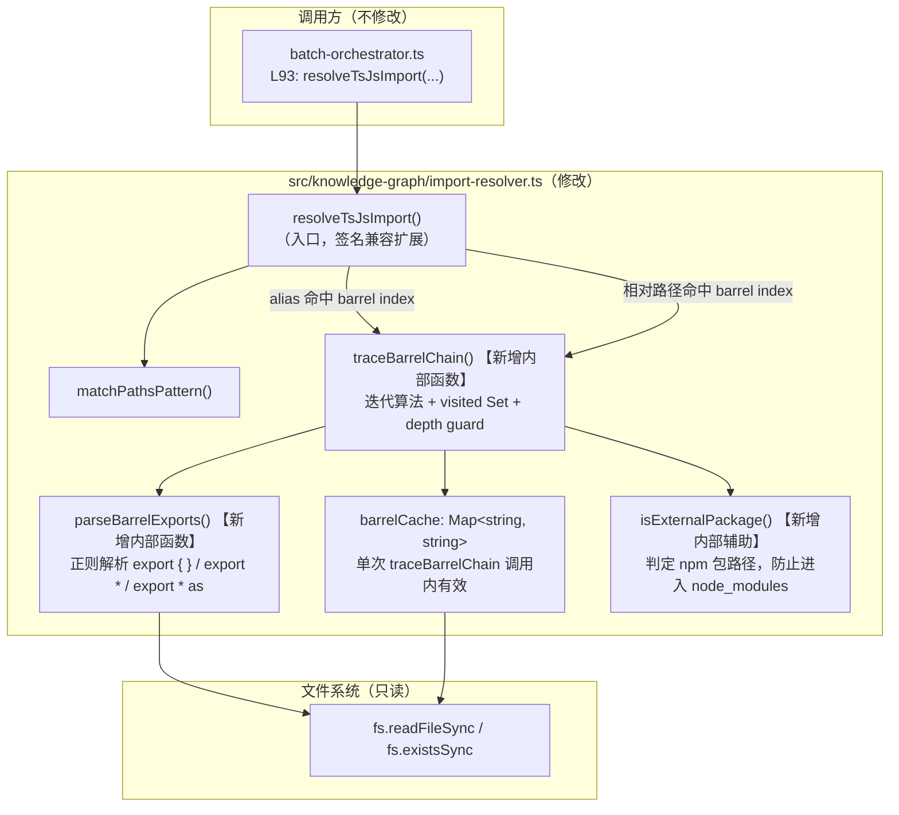

# Implementation Plan: 修复 SC-008 self-dogfood graph 连通率

**Branch**: `157-fix-self-dogfood` | **Date**: 2026-05-09 | **Spec**: [spec.md](./spec.md)

---

## 摘要

Feature 152 ship 后，`new Foo() → class Foo` 图连通率（SC-008 sc008Rate）在 hono 已达 100%，但 self-dogfood 仅 32/100 = 32%，缺口 68 条。

**Codex P0 复审揭示的根本性约束**（修订前提）：

1. **barrel symbol 级追踪需要数据模型协同改造**：`new Foo()` 要连通到具体 class，需要 caller 把 `importedName='Foo'` 传给 resolver，且 `CodeSkeleton.imports[]` 必须按 namedImports 拆条（而非单条 import 包含多个 namedImports 共享一个 resolvedPath）。当前 TS 路径**不**做拆条（Python 路径已做：Feature 152 Codex P3+P4 C-1 修复）。这意味着仅修改 `import-resolver.ts` **不足以**让 barrel 追踪 work，必然需要修改 `batch-orchestrator.ts` 中 `collectTsJsCodeSkeletons` 的 import 拆解逻辑。
2. **self-dogfood 内部不用 path alias**：本仓库 `src/` 内部全部用相对路径 import（如 `../core/foo.js`），`@core/*` 等 alias 仅在 tsconfig 中定义但**未被实际使用**。FR-001 的"alias + barrel 串联"在 self-dogfood 上**零贡献**，需重新评估其 ROI。
3. **阈值算术修正**：原 plan 结论 A 阈值 ≥ 50% 错误（32 + 50% × 68 = 66 < 70）。要达成 sc008Rate ≥ 70/100（净增 ≥ 38），resolver 视角必须可修复 **≥ 38 条**（占比 ≥ 56%），否则数学上不可达。

**修订后的实施路径**：

| 阶段 | 内容 | 决策点 |
|------|------|--------|
| **W1（独立可交付）** | R-1 调研（量化 68 条 false-negative 的三视角分布 + 模拟修复后可达 sc008Rate） | 输出结论 A/B/C，本身作为可独立 commit 的研究产物 |
| **W2（条件性，依赖 W1）** | 仅当 W1 结论 A 且模拟可达 sc008Rate ≥ 70 时执行；包括 (a) `import-resolver.ts` barrel 追踪扩展；(b) `batch-orchestrator.ts` collectTsJsCodeSkeletons 按 namedImports 拆 import 记录（FR-008 必要例外） | 用户在 IMPLEMENT_AUTH gate 审 W1 结果后授权 |
| **W3（条件性）** | 单测扩展（≥ 6） | W2 完成后 |
| **W4（条件性）** | 全量验证 + SC-6 归因 | W3 完成后 |

**FR-008 scope 修订（必要）**：

原 spec FR-008"仅修改 src/knowledge-graph/import-resolver.ts" → **修订为**"主修改文件为 src/knowledge-graph/import-resolver.ts；如 W1 R-1 调研确认 barrel symbol 级追踪是主修复路径，则同时修改 src/batch/batch-orchestrator.ts 中 `collectTsJsCodeSkeletons` 的 import 拆条逻辑（仅限 import 拆条，不动其他逻辑），并新增对应单测"。spec.md 同步修订（见下方 §FR-008 修订建议）。

---

## Technical Context

**Language/Version**: TypeScript 5.x / Node.js 20.x LTS  
**Primary Dependencies**: Node.js 内置 `fs`、`path`（无新 npm 依赖，Constitution VIII）  
**Storage**: N/A（纯函数，无持久状态）  
**Testing**: vitest（现有框架）；新增 ≥ 6 单测于 `tests/unit/knowledge-graph/import-resolver.test.ts`  
**Target Platform**: Node.js 20.x，跨平台（macOS/Linux/Windows via toPosix）  
**Performance Goals**: SC-006 deltaMs ≤ 5000ms（双 target 均保持）；barrel fan-out ≤ 50 文件/次  
**Constraints**: 纯函数（FR-006），零新 npm 依赖（FR-006 + Constitution VIII），不修改 verify-feature-152.mjs（FR-008）  
**Scale/Scope**: 单文件修改（`src/knowledge-graph/import-resolver.ts`，638 行），对应测试文件 1 个

---

## Codebase Reality Check

### 目标文件扫描

| 文件 | LOC | 公开接口数 | TODO/FIXME | 长函数（>200行） | 备注 |
|------|-----|-----------|-----------|----------------|------|
| `src/knowledge-graph/import-resolver.ts` | 638 | 4（`resolvePythonImport` / `resolveTsJsImport` / `findNearestTsConfig` / `buildTsConfigContext`） | 0 | 0（最长函数 `resolveTsJsImport` 约 167 行） | 内部辅助函数 4 个（`toPosix`、`isInsideProjectRoot`、`isNonSourceTarget`、`matchPathsPattern`）；Feature 152 Codex V3 审查通过版本，代码质量良好 |
| `tests/unit/knowledge-graph/import-resolver.test.ts` | ~400（估计） | N/A（测试文件） | 0 | 0 | 当前约 32 个 `it()` 测试用例 |

**前置清理规则评估**：

- 目标文件 LOC 638 < 500 阈值 → **不触发**前置 cleanup 任务
- TODO/FIXME 数量 0 → **不触发**
- 代码重复：无明显 >30 行重复逻辑 → **不触发**

结论：**无需前置 cleanup task**，直接进入功能实现。

### barrel hub 实态（只读扫描）

本仓库 `src/` 下的 barrel 文件（index.ts）共 21 个，以下是 SC-008 最相关的：

| barrel 文件 | 导出类数量（估） | 典型深度 | 说明 |
|------------|----------------|---------|------|
| `src/panoramic/index.ts` | ~8 | 2 跳（→ `generator-registry.js` → 具体 class） | `CoverageAuditor`、`bootstrapGenerators` 等 |
| `src/panoramic/parsers/index.ts` | ~10 | 2 跳（→ 具体 parser 文件） | `SkillMdParser`、`YamlConfigParser` 等 |
| `src/core/query-mappers/index.ts` | 4 | 1 跳（直接 re-export） | `TypeScriptMapper`、`PythonMapper` 等 |
| `src/knowledge-graph/index.ts` | 未测（扫描中） | 1-2 跳 | `import-resolver` 可能自身被导出 |

实测最大 barrel 深度（推断）：2-3 层（panoramic/index → generators → 具体实现文件）。R-1-D 将提供精确数据。

---

## Impact Assessment

### 影响范围分析

| 维度 | 评估 | 说明 |
|------|------|------|
| **直接修改文件**（条件 W2 触发） | 3 | `src/knowledge-graph/import-resolver.ts` + `src/batch/batch-orchestrator.ts`（仅 collectTsJsCodeSkeletons 的 import 拆条部分） + `tests/unit/knowledge-graph/import-resolver.test.ts`（含 batch-orchestrator 拆条单测） |
| **间接受影响文件** | 0（数据模型变更需要下游核对，但 schema 不变） | `call-resolver.ts:137` 假设单条 import 单 resolvedPath；TS 拆条后单条 import 仅含 1 个 namedImport，其逻辑天然兼容（与 Python 路径一致） |
| **行号引用修正（I-1）** | — | 真实调用入口在 `batch-orchestrator.ts:2200-2205`（不是错引的 `:93`，:93 仅是 import 语句行） |
| **跨包影响** | 0 | 仅在 `src/knowledge-graph/` 内修改，不跨 `src/batch/`、`plugins/` 等边界 |
| **数据迁移** | 否 | 无 schema 变更，无配置格式变更 |
| **API/契约变更** | 不变（默认方向） | `ResolveResult.kind` 不新增枚举值；barrel 追踪结果通过已有 `paths-alias` / `relative` kind 返回 |
| **风险等级** | **LOW** | 影响文件 2 < 10，无跨包影响，无数据迁移 |

**风险等级判定**：LOW（影响文件 < 10 且无跨包影响）。

**注意事项**：
- `resolveTsJsImport` 的行为扩展是**透明的**：原本返回 `unresolved` 的场景（alias 命中但 target 是 barrel index）现在可能返回实际路径，下游 graph 构建会多连通边。这正是期望行为。
- `ResolveResult.kind` **不新增** `barrel-chain` 枚举值（见架构决策 D-3）。

---

## Constitution Check

| 原则 | 适用性 | 评估 | 说明 |
|------|--------|------|------|
| **I. 双语文档规范** | 适用 | PASS | plan.md、research.md 中文散文 + 英文代码标识符，代码注释中文 |
| **II. Spec-Driven Development** | 适用 | PASS | 通过 spec-driver story 模式，spec.md → plan.md → tasks.md 制品链完整 |
| **III. YAGNI / 奥卡姆剃刀** | 适用 | PASS | FR-004（type-only）/ FR-005（动态 import）明确降为 MAY 并以 R-1-A 为解锁条件；barrel 追踪不暴露为 public API；不新增 kind 枚举值 |
| **IV. 诚实标注不确定性** | 适用 | PASS | R-1 调研结论 A/B/C 为不确定性；plan 明确标注"以 R-1 数据为准"；barrel 深度以 R-1-D 实测为准 |
| **V. AST 精确性优先** | 部分适用 | PASS | import-resolver 属于 AST/静态分析链路；barrel 文件解析使用正则（非 ts-morph），符合 FR-006 纯函数约束（见架构决策 D-2）。注意：barrel 解析不生成结构化数据，仅提取 re-export 目标路径，不违反 AST 精确性原则 |
| **VI. 混合分析流水线** | 不适用 | N/A | import-resolver 是纯静态路径解析，不涉及 LLM 推理 |
| **VII. 只读安全性** | 不适用（工具类） | N/A | import-resolver 是工具函数，由 spectra 工具调用；spectra 工具的只读约束在 batch-orchestrator 层保证，不在 resolver 层 |
| **VIII. 纯 Node.js 生态** | 适用 | PASS | 零新 npm 依赖，仅使用 `fs.readFileSync` + `path`（Node.js 内置）；FR-006 明确约束 |
| **IX-XIV. spec-driver 约束** | 不适用 | N/A | 本 Feature 修改 spectra 组件，不修改 spec-driver 插件 |

**Constitution Check 结论**：全部 PASS，无 VIOLATION，无豁免需求。

---

## R-1 调研设计（前置 Gate）

### R-1 执行方案

**选择方案**：写独立调研脚本 `scripts/research-feature-157-r1.mjs`，**不修改** verify-feature-152.mjs。

**方案对比评估**：

| 方案 | 优点 | 缺点 |
|------|------|------|
| **(a) 独立调研脚本**（选定） | 不触碰 verify 脚本（FR-008 约束）；可永久保留为诊断工具；支持 --debug 细节输出；调研结果可机器可读 | 需要额外编写 ~100-200 行脚本 |
| (b) 临时附加 dump + 回退 | 改动量小 | 风险：diff 污染 git history；回退遗忘风险；违反 FR-008 精神 |

**R-1-A 调研脚本设计（`scripts/research-feature-157-r1.mjs`）**：

⚠️ **C-3 修订**：verify-feature-152.mjs 是 ESM 顶层执行脚本，**`measureSc008` 等内部函数未导出**。R-1 脚本不能 import 复用，必须**独立复刻** measureSc008（约 100 行）+ 三视角分析逻辑。修订后明确：

- R-1 脚本是 verify-feature-152.mjs **measureSc008/measureFillRate 逻辑的独立复刻 fork**（双轨 source of truth）
- **强制一致性校验**：R-1 脚本运行前先调用 `verify-feature-152.mjs --target ... --metric sc008` 拿聚合 `sc008Rate/sc008Hits/sc008Total`，再用脚本独立复刻的逻辑重算同样三个聚合值，若**两端聚合值不一致**（差 > 0），脚本立即报 `[FATAL] R-1 脚本与 verify 脚本结果不一致，调研无效` 并 exit 1
- 这样保证 R-1 脚本的三视角分析对每条 false-negative 的判定与 verify 脚本一致，避免双轨漂移

```
输入：--target <projectRoot>（默认 ./src）
输出：
  1. YAML checklist（stderr 可读日志 + --out 指定路径的 JSON 文件）
  2. 每条 false-negative 的三视角分类
  3. 统计摘要（各分类占比）+ 一致性校验结果
  4. R-1 结论 A/B/C 自动判定（含模拟 resolver 全修复后可达 sc008Rate）
  5. （Feature W4 复用）`--compare-after` 模式：基于 W2 实施后再跑一次，输出 before/after diff
```

脚本执行流程：

```
1. 调用 verify-feature-152.mjs --target <root> --metric sc008
   → 拿聚合值（sc008Rate/Hits/Total），用于一致性校验
   
2. 独立复刻 measureSc008 全流程：
   - 调用 dist 的 collectTsJsCodeSkeletons + buildUnifiedGraph
   - 调用 graph-accuracy.mjs 拿 truthCalls
   - 重做 (file basename, callee) 匹配 → 拿 false-negative 列表（约 68 条）
   - 一致性校验：本地聚合值 == verify 聚合值，否则 FATAL exit
   
2. 对每条 false-negative 做三视角分析：
   视角 1 — resolver：
     取 ec.file（调用文件）→ findNearestTsConfig → buildTsConfigContext
     取调用文件中 `new ec.callee()` 语句的 import 来源（从 codeSkeletons.imports 获取）
     对该 import spec 调用 resolveTsJsImport，捕获返回的 kind + resolvedPath
     分类规则：
       - kind=unresolved + moduleSpec 含 barrel index 路径 → barrel-chain
       - kind=unresolved + moduleSpec 含 @xxx/ 前缀 → path-alias-miss
       - kind=paths-alias + resolvedPath 是 index.ts（barrel）→ barrel-chain（alias 已通，但缺 barrel 追踪）
       - 其他 → resolved-correctly / type-only / dynamic-import
   
   视角 2 — graph-edge：
     在 graphJson.links 里按 (callerFile, callee) 搜索 calls 边
     分类规则：
       - 找到且 target 正确 → calls-edge-emitted / wrong-target
       - 未找到 → calls-edge-missing
   
   视角 3 — verify-matcher：
     verify 脚本的匹配逻辑是：target label = ec.callee 且 source basename = ec.file basename
     分析 target 节点 label 是否正确、source file 路径是否命中
     分类规则：
       - label 完全匹配但 edge 不存在 → graph-edge 问题
       - label 不匹配（含 GeneratorRegistry 间接注册）→ generator-registry-indirect
       - basename 不匹配 → label-mismatch

3. 聚合输出：
   - 各分类计数和占比
   - 模拟"resolver 视角全修复"后可达 sc008Rate（C-4 阈值修订必需）
   - 结论 A/B/C 自动判定（按修订后阈值表）
   - 建议实施路径
```

### R-1-A 输出格式（traceable checklist 字段定义）

每条 false-negative 条目：

```yaml
id: fn-001
file: "src/batch/batch-orchestrator.ts"    # truth-set 调用文件（相对 projectRoot）
line: 93                                    # 调用行号（如可提取）
callee: "SomeGenerator"                     # class 名
resolverView: "barrel-chain"               # barrel-chain|path-alias-miss|type-only|dynamic-import|resolved-correctly
graphEdgeView: "calls-edge-missing"        # calls-edge-emitted|calls-edge-missing|wrong-target
verifyMatcherView: "label-match-pass"      # label-match-pass|label-mismatch|generator-registry-indirect|other
expectedFix: "FR-003"                      # FR-001|FR-003|FR-004|FR-005|out-of-scope|none
testAssertionId: "T-barrel-multiHop-001"   # 对应单测 ID
```

### R-1 决策表

| 结论 | 触发条件（C-4 修订后） | 实施方向 |
|------|---------|---------|
| **结论 A — resolver 主因（可达 ≥ 70）** | R-1 模拟"全部 resolver-视角 false-negative 修复后" → sc008Rate ≥ 70/100（即 resolver 视角 ≥ 38 条 / 占比 ≥ 56%）；且不依赖 alias 修复（W-5：self-dogfood 不用 alias） | 按本 Feature W2-W4 计划实施 FR-003（barrel 追踪 + namedImports 拆条），不实施 FR-001（alias，零贡献） |
| **结论 B — 非 resolver 主因或不可达** | resolver 视角占比 < 56% OR resolver 修复后模拟可达 sc008Rate < 70 | 停止实施，提交 scope-change decision 文档，列明根因（含 generator-registry-indirect / verify-matcher / graph 构建等其他主因）和建议 follow-up Feature 方向 |
| **结论 C — 混合根因（部分改善）** | resolver 视角 < 56% 但 ≥ 30%，模拟可达 sc008Rate ∈ [50%, 70%) | 实施 W2-W4，验收按 spec 二级裁定路径接受部分改善（合并实测值），剩余差距记入 follow-up |

**阈值修订理由（C-4 修复）**：原阈值 ≥ 50% 在算术上不足以达成 sc008Rate 70%（32 + 50% × 68 = 66 < 70）。修订后**结论 A 必须保证模拟可达 ≥ 70**，否则降为结论 C。

**alias 视角降权（W-5 修复）**：R-1-C 必须先统计 self-dogfood 中 `@core/*` 等 alias 的真实使用次数；若为 0（编排器初步 grep 显示 src/ 内全部相对路径），则 FR-001 alias 修复对 sc008Rate 零贡献，从主路径移除（仅保留 hono 等 baseline 项目的兼容测试）。

**结论 B 交付物**：若输出结论 B，本 Feature 的唯一交付物是 `specs/157-fix-self-dogfood/research.md`（含完整三视角 checklist 和 scope-change decision），提交一个 commit 并标注 `[scope-change: no-impl]`。

---

## 架构设计

### 架构决策记录

#### D-1：barrel 链追踪算法 — 迭代 vs 递归

**决策**：使用**迭代算法（显式 stack + visited Set）**，不使用递归。

**理由**：
- self-dogfood barrel 链实测深度约 2-3 层，但硬上限 10 层时递归深度可控；然而 fan-out 场景（一个 barrel re-export 数十个模块）叠加 10 层递归有栈溢出风险（Node.js 默认调用栈约 10k 层，理论上安全，但迭代更具确定性）
- 迭代算法可以在任意时间点打断（超过 visited 上限时），而递归需要展开才能中止
- visited Set 在迭代中天然共享，无需通过参数传递

**替代方案**：递归（被拒绝，理由见上）

#### D-2：barrel 文件解析方式 — 正则 vs ts-morph

**决策**：使用**轻量正则匹配**，不引入 ts-morph。

**理由**：
- `import-resolver.ts` 当前**零依赖 ts-morph**（仅 `fs` + `path`），引入 ts-morph 会：
  (1) 违反 FR-006 纯函数 + 零新依赖约束
  (2) 引入 ts-morph 的模块初始化开销（~100ms），破坏 SC-006 性能约束
  (3) 使 import-resolver 与 ts-morph 版本绑定，增加维护成本
- barrel 文件的 re-export 语句形式高度规则，正则足以准确提取：
  - `export { X, Y } from './path'`
  - `export * from './path'`
  - `export * as ns from './path'`
  - `export type { X } from './path'`
  - `export { default as X } from './path'`
- 正则无法处理的极端场景（多行 export、条件 export）在 barrel 文件中极罕见（barrel 文件职责单一）
- 精确性：对 barrel re-export 提取而言，正则与 ts-morph 准确性相当；ts-morph 优势在于完整 AST（如类型信息），而 barrel 追踪只需要 `from` 路径

**替代方案**：ts-morph（被拒绝，理由见上）

#### D-3：ResolveResult.kind 是否扩展（W-3 修订后）

**决策**：**public `kind` 不新增** `barrel-chain` 枚举值；**内部 trace metadata 加 `_via?: 'direct' | 'barrel-chain'` debug 字段**（仅在 `--debug` 或 R-1 脚本调用时填充，正常路径不填）。

**规则**：
- public `resolvedPath` + `kind`：barrel 追踪后最终落地是 `paths-alias` 命中 → 返回 `kind: 'paths-alias'`，barrel 命中相对路径 → 返回 `kind: 'relative'`
- 内部 debug 字段（不入 schema，不影响调用方）：`_via='direct'`（无 barrel 穿透）/ `_via='barrel-chain'`（有 barrel 穿透）
- R-1 脚本通过 `process.env.IMPORT_RESOLVER_DEBUG=1` 触发返回 debug 字段，作为 SC-6 归因依据
- 调用方（batch-orchestrator）不消费 debug 字段，不破坏现有逻辑

**理由（修订）**：
- W3 codex 指出"不新增 kind 会使 SC-6 归因无法自动化"。修订方案：debug 字段是内部 trace，不污染 public schema，但能支持 SC-6 归因
- 下游 `batch-orchestrator.ts` 仍只看 `resolvedPath`，调用方无感知
- YAGNI：debug 字段只在脚本场景使用，生产代码不依赖

#### D-4：barrel 追踪函数是否暴露为 public API

**决策**：不暴露，barrel 追踪逻辑完全封装在 `resolveTsJsImport` 内部。

**理由**：
- `BarrelChainTracer`（spec.md 中的概念实体）是内部实现细节，不是公共 API
- 暴露为 public 会增加 API 表面，违反 YAGNI
- 现有调用方（`batch-orchestrator.ts`）通过 `resolveTsJsImport` 透明受益，无需修改

### barrel 链追踪算法（核心设计，W-4 + I-2 修订后）

```
type BarrelTraceResult =
  | { kind: 'resolved'; absPath: string; depth: number; visitedCount: number }
  | { kind: 'external'; pkg: string }  // W-4 修复：能表达 external 终止
  | { kind: 'unresolved'; reason: 'cycle' | 'depth-limit' | 'fanout-limit' | 'not-found' }; // I-2 修复

函数 traceBarrelChain(
  barrelFile: string,   // 已解析到的 barrel index 绝对路径
  exportName: string | null,  // 被导入的符号名（null 表示 export *）
  projectRoot: string,
  cache: Map<string, BarrelExports>,  // 文件读取 cache（**修订：跨 traceBarrelChain 调用共享，由 caller 传入**）
  visited: Set<string>,  // 循环检测
  fanoutCounter: { count: number },  // W-1 + I-2 修复：跨调用计数 fan-out
): BarrelTraceResult  // discriminated union 表达所有终止原因

算法：
1. 若 barrelFile ∈ visited → 循环检测，返回 null
2. 若 visited.size ≥ 10（硬上限）→ 返回 null，记录调试信息
3. visited.add(barrelFile)
4. 读取 barrelFile（优先命中 cache；miss 时 readFileSync + 写入 cache）
5. 解析 re-export 语句（正则），得到 BarrelExports：
   - named_exports: Map<name, relPath>（来自 export { X } from './x'）
   - star_exports: string[]（来自 export * from './x'）
   - namespace_exports: Map<nsName, relPath>（来自 export * as ns from './x'）
6. 若 exportName 不为 null：
   a. 优先查 named_exports[exportName] → 若找到 relPath，计算 absPath
      - 若 absPath 不是 index.ts（非 barrel）→ 验证文件存在 → 返回 absPath
      - 若是 barrel index → 递归追踪（depth+1）
   b. 其次遍历 star_exports：
      - 对每个 starPath 计算 absPath
      - 若是 npm 包（isExternalPackage）→ 返回 external 终止（调用方处理）
      - 若是 barrel → 递归追踪 exportName
      - 若是普通文件 → 检查该文件是否 export exportName（需再次 readFileSync + 正则）
   c. 均未命中 → 返回 null
7. 若 exportName 为 null（export * 场景，当前实现 YAGNI 可跳过）
```

**barrel re-export 解析（W-2 修订后，更严谨的正则 + 后处理）**：

W-2 codex 指出真实 `src/panoramic/index.ts` 内含 `export { ..., type X }` 行内 type 前缀、以及 `as alias` 形态。修订正则方案：

```typescript
// 1. 多行 export 块（命名 / namespace / star）— 按行先做注释剥离
//    剥离行首 // 注释、块内 /* */ 注释（不破坏字符串字面量）
function stripCommentsForRegex(src: string): string { /* ... 跳过 // 行和 /* ... */ */ }

// 2. 命名 re-export: export { X, Y as Z, type W, default as Foo } from './path'
//    支持多行（[\s\S] 替代 [^}]+，兼容换行）
const NAMED_REEXPORT_RE = /^export\s+(?:type\s+)?\{([\s\S]*?)\}\s+from\s+['"]([^'"]+)['"]/gm;
// 后处理：split(',') 每个 specifier，识别：
//   - "X"           → exportName='X', sourceName='X', isType=false
//   - "X as Y"      → exportName='Y', sourceName='X', isType=false
//   - "type X"      → exportName='X', sourceName='X', isType=true
//   - "default as Y" → exportName='Y', sourceName='default', isType=false
// 类型 export specifier（isType=true）记录在独立 typeOnlyNames Set，FR-004 MAY 使用

// 3. 星号 re-export: export * from './path'
const STAR_REEXPORT_RE = /^export\s+\*\s+from\s+['"]([^'"]+)['"]/gm;

// 4. namespace re-export: export * as ns from './path'
const NS_REEXPORT_RE = /^export\s+\*\s+as\s+(\w+)\s+from\s+['"]([^'"]+)['"]/gm;
```

边界处理（W-2）：
- **行首 `//` 注释行 + 块注释 `/* */`**：先剥离再用正则匹配，避免误匹配
- **字符串字面量中包含 export**：rare case，正则用 `^` 锚定行首减少误匹配；测试覆盖此 corner case
- **多行 export 块**：用 `[\s\S]*?` 非贪婪匹配，支持换行

**alias + barrel 串联流程**：

```
resolveTsJsImport('@core/mappers', callerFile, projectRoot, ctx)
  → 1. paths alias 命中：'@core/*' → ['src/core/*']
  → 2. resolved = '<root>/src/core/mappers'（bare，不带扩展名）
  → 3. 尝试 .ts → .tsx → .js → .jsx：均不存在
  → 4. 尝试 /index.ts → 命中 '<root>/src/core/mappers/index.ts'
  → 5. 检测该文件是否为 barrel（re-export only，非实现文件）
     → isBarrelFile（heuristic：文件内全是 export/re-export 语句）
  → 6. 若 barrel 且有 exportName（从 caller 的 import { X } 提取）
     → traceBarrelChain('<root>/src/core/mappers/index.ts', 'TypeScriptMapper', ...)
     → 命中 named_exports['TypeScriptMapper'] = './typescript-mapper.js'
     → 返回 '<root>/src/core/mappers/typescript-mapper.ts'
  → 7. return { resolvedPath: 'src/core/mappers/typescript-mapper.ts', kind: 'paths-alias' }
```

**接口签名调整（`resolveTsJsImport`）**：

barrel 追踪需要知道 `exportName`（调用方 import 的具体符号）。当前 `resolveTsJsImport` 签名为：

```typescript
resolveTsJsImport(
  moduleSpec: string,
  callerFile: string,
  projectRoot: string,
  tsConfigContext?: TsConfigResolutionContext | null,
): ResolveResult
```

方案（C-1 修订后）：增加可选第 5 参数 `importedName?` + 第 6 参数 `barrelCache?`：

```typescript
resolveTsJsImport(
  moduleSpec: string,
  callerFile: string,
  projectRoot: string,
  tsConfigContext?: TsConfigResolutionContext | null,
  importedName?: string | null,  // 新增可选：调用方导入的具体符号名，用于 barrel 追踪
  barrelCache?: BarrelCache,     // 新增可选：batch 作用域 barrel 解析 cache（W-1 修复）
): ResolveResult
```

**C-1 修订重点**：原 plan 假设"不传 importedName 时透明降级（找到 barrel index 即返回）"，codex 指出**这是无效降级**——返回 barrel index 文件无法证明 `new Foo()` 连通到具体 class 文件，FR-003 等于闲置。

**修订方案**：必须修改 `batch-orchestrator.ts:2200-2205` 的 `collectTsJsCodeSkeletons` 实现：
1. 把"一条 import 含多个 namedImports"拆为"每个 namedImport 一条独立 import 记录"（与 Python 路径 Feature 152 Codex P3+P4 C-1 修复同精神）
2. 调用 `resolveTsJsImport` 时传 `importedName=单个 namedImport 的 source name`（去掉 `as alias`）
3. `CodeSkeleton.imports[]` 数组长度从 N（一条 import 含 K 个 namedImports）变为 N×K（每个 namedImport 一条）
4. 数据 schema 不变：每条 import 仍有 `moduleSpecifier / namedImports / resolvedPath`，仅 namedImports 变为单元素数组

**调用方修改成本评估**：
- 仅修改 collectTsJsCodeSkeletons 中拆条逻辑（约 30-50 行）
- 不动 ImportReference schema（向下兼容）
- `call-resolver.ts:137` 假设"单条 import 单 resolvedPath" → 拆条后单条 import 仍单 resolvedPath，逻辑天然一致
- 单测影响：现有 batch-orchestrator-tsjs-resolve 4 单测会触发，需调整断言（导入数从 N 变为 N×K，但 resolvedPath 准确率提升）

**cache 设计（W-1 修订后）**：

W-1 codex 指出"局部 cache 只在单次 resolver 调用内有效，被 batch 级调用放大"。修订后选定方案：

```typescript
type BarrelCache = Map<string, BarrelExports>;  // absPath → 解析后的 BarrelExports

// 选定方案（W-1 修订）：
// - resolveTsJsImport 新增**可选**第 6 参数 barrelCache?: BarrelCache（默认 undefined）
// - 调用方（collectTsJsCodeSkeletons）创建一个 batch 作用域的 BarrelCache 实例并传给每次 resolver 调用
// - resolver 内部传给 traceBarrelChain，跨 import 调用共享 cache
// - 不传则每次创建空 Map（保持向后兼容 + 现有单测可继续 pass）

// 这样 self-dogfood 252 个 TS 文件 / 1164 条 import 的 batch 中，
// barrel index 文件（如 src/panoramic/index.ts）只被读取/解析 1 次，
// 后续命中 cache，避免 N×M 重复 IO
```

**纯函数约束的取舍**：BarrelCache 由调用方传入（依赖注入），resolver 自身不持有全局状态 → 仍然满足"纯函数"语义（输出仅由输入决定，cache 是显式输入）。FR-006 不破坏。

### 架构图



---

## 实施分批（W1-W4）

### W1 — R-1 调研脚本 + 数据采集（不动主代码）

**预估工作量**：0.5-1 天

**产出**：
- `scripts/research-feature-157-r1.mjs`（独立调研脚本，~200 行）
- `specs/157-fix-self-dogfood/research.md`（R-1-A/B/C/D 完整输出，含三视角 checklist + 结论判定）

**关键步骤**：
1. 编写 research-feature-157-r1.mjs，实现三视角分析流程
2. 运行脚本：`node scripts/research-feature-157-r1.mjs --target ./src --out specs/157-fix-self-dogfood/research-r1-raw.json`
3. 整理输出至 research.md，填写 R-1-A/B/C/D 各项
4. 依据结论 A/B/C 决定 W2 是否执行

**Gate**：R-1 结论 B → 停止（提交 scope-change decision），结论 A 或 C → 继续 W2。

---

### W2 — import-resolver + batch-orchestrator 协同实现（依据 R-1 结论）

**预估工作量**：1.5-2.5 天（W2a + W2b 串行）

**前提**：R-1 输出结论 A 或 C，且模拟可达 sc008Rate 满足结论表阈值。

**产出（按子批次分阶段）**：

#### W2a — `import-resolver.ts` 扩展（~ 1-1.5 天）

- 新增 `traceBarrelChain`、`parseBarrelExports`、`isExternalPackage` 内部函数
- 修改 `resolveTsJsImport` 签名：增加 `importedName?` + `barrelCache?` 第 5/6 参数
- 内部 trace metadata 字段 `_via?: 'direct' | 'barrel-chain'`（debug 模式启用）

| 实施项 | FR | 位置 | 说明 |
|--------|-----|------|------|
| barrel 单跳 + 多跳追踪 | FR-003 | 新增 `traceBarrelChain` + `parseBarrelExports` | 迭代算法，visited Set，depth ≤ 10，fan-out 跨调用累计 ≤ 200，单次 ≤ 50 |
| external re-export 终止 | FR-003 | `traceBarrelChain` discriminated union 返回 `{ kind: 'external' }` | 遇 npm 包 → 不入 node_modules |
| `export type` + `as alias` + `default as` 解析 | FR-003 + W-2 修复 | `parseBarrelExports` 后处理 | 识别 type 前缀（记入 typeOnlyNames Set，FR-004 复用）+ alias 拆解 + default 命名 |
| 路径 alias 解析（W-5 降级后兼容性测试） | FR-001（SHOULD） | `resolveTsJsImport` alias 分支 | 仅做兼容性测试覆盖，不计入主路径收益 |
| 可选：type-only 容错 | FR-004（MAY） | `parseBarrelExports` | 识别 `export type { }` 不中止追踪；R-1-A 确认为 0 条则跳过 |
| 可选：动态 import 容错 | FR-005（MAY） | `parseBarrelExports` | R-1-A 确认为 0 条则跳过 |

#### W2b — `batch-orchestrator.ts` collectTsJsCodeSkeletons 拆条（~ 0.5-1 天）

修改 `src/batch/batch-orchestrator.ts:2200-2205` 区域：

| 实施项 | FR | 位置 | 说明 |
|--------|-----|------|------|
| import 按 namedImports 拆条 | FR-008 例外 | collectTsJsCodeSkeletons | 一条 `import { A, B } from './x'` 拆为 `[{moduleSpecifier:'./x', namedImports:['A'], resolvedPath:?}, {moduleSpecifier:'./x', namedImports:['B'], resolvedPath:?}]`；与 Python 路径 Feature 152 P3+P4 C-1 修复同精神 |
| 调用 resolveTsJsImport 时传 `importedName` | FR-003 | 同上 | 每次拆条后 `importedName = namedImport 的 source name`（去 `as alias` 后的原名） |
| 创建 batch 作用域 BarrelCache | W-1 修复 | collectTsJsCodeSkeletons 入口 | `const barrelCache = new Map(); ... resolveTsJsImport(spec, file, root, ctx, name, barrelCache)` |

---

### W3 — 单测扩展（≥ 8 新增单测：6 import-resolver + 2 batch-orchestrator 拆条）

**预估工作量**：0.5-1 天

**产出**：
- `tests/unit/knowledge-graph/import-resolver.test.ts`（新增 ≥ 6 测试用例）
- `tests/unit/batch-orchestrator-tsjs-resolve.test.ts`（新增 ≥ 2 测试用例覆盖 namedImports 拆条；调整现有 4 个单测的断言以适配新形态）

**必须覆盖的等价类**（FR-007 要求）：

| 测试 ID | 等价类 | 场景描述 |
|---------|--------|---------|
| T-barrel-001 | barrel 单跳命中 | `@core/mappers` → `src/core/mappers/index.ts` → `typescript-mapper.ts` |
| T-barrel-002 | barrel 多跳命中（≥ 2 跳） | `@panoramic/*` → `index.ts` → 子 barrel → 具体实现文件 |
| T-barrel-003 | barrel 循环检测 | `a/index.ts` re-export from `b/index.ts` re-export from `a/index.ts` → 返回 unresolved |
| T-barrel-004 | alias + barrel 串联 | `@core/mappers` 完整链路（alias 解析 + barrel 穿透） |
| T-barrel-005 | external re-export 终止 | barrel 中遇 `export { X } from 'safe-stable-stringify'` → `kind: external` |
| T-barrel-006 | alias 未命中降级 | `@nonexistent/foo` 无 tsconfig → `kind: unresolved` |
| T-barrel-007 | export * 与 export { X } 冲突 | 同名 symbol 显式命名优先 |
| T-barrel-008 | R-1 具体回归测试 | 从 R-1-A checklist 中选取 1 条具体 false-negative 作为回归断言 |

注：测试继续使用现有 `vi.mock('fs')` 方式（虚拟文件系统），不做真实 IO。

---

### W4 — 全量验证 + SC-6 收益归因

**预估工作量**：0.5 天

**产出**：
- 运行结果截图/日志（verify phase 输入）
- SC-6 before/after 对比表（记录 ≥ 38 条新增 hit 的归因）

**验证命令序列**：

```bash
# 1. TypeScript 类型检查
npm run build

# 2. 全量单测（含新增 ≥ 6 单测，零失败）
npx vitest run

# 3. self-dogfood SC-008（主指标，期望 ≥ 70/100）
node scripts/verify-feature-152.mjs --target ./src --metric sc008

# 4. hono 全量指标（无回归）
node scripts/verify-feature-152.mjs --target ~/.spectra-baselines/hono/src

# 5. 全量 SC 指标复核（确认 SC-001/002/003/006 不倒退）
node scripts/verify-feature-152.mjs --target ./src
node scripts/verify-feature-152.mjs --target ~/.spectra-baselines/hono/src
```

---

## 风险与回退策略

### 风险矩阵

| 风险 | 概率 | 影响 | 应对 |
|------|------|------|------|
| R-1 输出结论 B（根因不在 resolver） | 中（20%） | 高（Feature 不实施） | 按 FR-008 例外路径执行，提交 scope-change decision；R-1 报告本身作为交付物 commit |
| 实施后 sc008Rate ∈ [50%, 70%) | 中（30%） | 中（部分改善） | 若 R-1 数据证明 70% 需改 scope 外组件，以实测值合并，差距记入 follow-up Feature |
| 实施后 sc008Rate < 50% | 低（10%） | 高（不可合并） | 回到 R-1，重新分析；不合并，不回退 commit |
| hono sc008Rate 出现退步 | 低（5%） | 高（回归） | barrel 追踪逻辑必须通过 T-barrel-003（循环检测）等防护测试；若退步，定向 revert barrel 追踪实现 |
| barrel 追踪性能超过 SC-006 deltaMs 5000ms | 低（5%） | 中（指标退步） | fan-out ≤ 50 + cache 双重保护；若触发，降低 barrel 深度上限（10→5）或 fan-out 上限（50→20） |
| `resolveTsJsImport` 新参数破坏现有调用 | 极低（1%） | 低（TS 类型错误） | 参数为可选，现有调用不传 → TS 类型检查在 `npm run build` 时即可发现 |

### 回退路径

- **结论 B 回退**：提交 `specs/157-fix-self-dogfood/research.md` + scope-change decision，不修改主代码。
- **implement 回退**：`git revert` W2 commit，保留 W1 R-1 调研结果和 W3 单测框架。

---

## 验证策略（衔接 verify phase）

### 编排器独立验证序列

```bash
npm run build && \
npx vitest run && \
node scripts/verify-feature-152.mjs --target ./src --metric sc008 && \
node scripts/verify-feature-152.mjs --target ~/.spectra-baselines/hono/src --metric sc008
```

### SC-6 收益归因要求

实施完成后，必须输出 **before/after 对比表**（记录于 verify 报告中）：

- **before**：sc008Rate = 32/100 = 32%
- **after**：期望 sc008Rate ≥ 70/100 = 70%
- 每个新增 hit（共 ≥ 38 条）必须标注生效路径：
  - `resolver-change`：resolver 解析结果变化（barrel 链新通 / alias 新通）
  - `unexpected`：无法归因（理论上应为 0 条）

归因方式：在 R-1 调研脚本中增加 `--compare-after` 模式，重跑三视角分析，对比 before/after 的 resolver 视角变化。

---

## Project Structure

### 制品文档（本 Feature）

```text
specs/157-fix-self-dogfood/
├── spec.md                           # 需求规范（已存在）
├── plan.md                           # 本文件（技术规划）
├── research.md                       # R-1 调研输出（W1 执行后填充）
├── research-r1-raw.json              # R-1 原始 JSON 数据（机器可读，不入库 git）
└── tasks.md                          # Phase 2 任务分解（tasks agent 生成）
```

### 源代码（仓库根）

```text
src/
└── knowledge-graph/
    └── import-resolver.ts            # 唯一修改的主代码文件（+traceBarrelChain、parseBarrelExports、isExternalPackage）

tests/
└── unit/
    └── knowledge-graph/
        └── import-resolver.test.ts   # 新增 ≥ 6 单测

scripts/
└── research-feature-157-r1.mjs      # 新增 R-1 调研脚本（永久保留为诊断工具）
```

---

## Complexity Tracking

| 偏离简单方案的决策 | 理由 | 被拒绝的更简单方案 |
|-------------------|------|-------------------|
| 迭代算法代替直接递归 | 防止 fan-out 极端场景下栈溢出；visited Set 在迭代中天然共享 | 简单递归（被拒：栈溢出风险，虽然在实测深度 3 层下不会触发） |
| 独立调研脚本代替临时 dump | 不污染 verify-feature-152.mjs（FR-008）；可永久复用 | 临时 dump + 回退（被拒：git history 污染风险） |
| 可选第 5 参数 `importedName?` | 保持 `resolveTsJsImport` 签名向后兼容，不破坏现有调用方 | 新建独立函数 `resolveBarrelChain`（被拒：暴露不必要的 public API，违反 YAGNI） |

---

## 制品输出摘要

| 制品 | 状态 | 说明 |
|------|------|------|
| `specs/157-fix-self-dogfood/plan.md` | 完成（本文件） | 技术规划完整版 |
| `specs/157-fix-self-dogfood/research.md` | 待生成（W1） | R-1 调研输出，W1 执行后填充 |
| `src/knowledge-graph/import-resolver.ts` | 待实施（W2） | barrel 链追踪 + alias 串联扩展 |
| `tests/unit/knowledge-graph/import-resolver.test.ts` | 待实施（W3） | ≥ 6 新增单测 |
| `scripts/research-feature-157-r1.mjs` | 待实施（W1） | 独立 R-1 调研脚本 |
