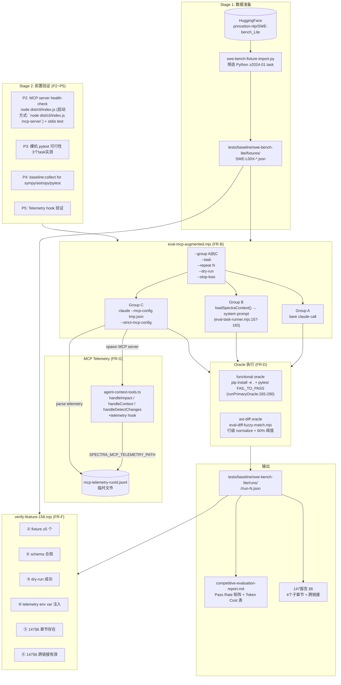

# Implementation Plan: Feature 158 — SWE-Bench Grounding Eval

**Branch**: `claude/focused-booth-ff2be2` | **Date**: 2026-05-09 | **Spec**: `../spec.md`

---

## 概要（Summary）

Feature 158 通过 **SWE-Bench Lite Python 子集**（5-8 个 task fixture，目标 8 个，验收下限 5 个）系统验证 Feature 155 Spectra MCP 的 grounding lift 价值假说。核心实验设计为三组对比：

- **Group A（bare baseline）**：裸 claude 调用，零额外 context
- **Group B（spec.md push）**：Spectra 生成的 spec.md 作为 system prompt 注入
- **Group C（MCP pull）**：agent 通过 `mcp__spectra__impact` / `mcp__spectra__context` / `mcp__spectra__detect_changes` 按需拉取 context

实验输出：pass rate 矩阵（`x/N` 格式，N=3 重复/task）+ token cost 静态对比表 + 人工结论，写入 147 报告 §6 章节及 157 独立 detail 报告。

**技术路径核心决策**：
- 新增独立脚本 `scripts/eval-mcp-augmented.mjs`（方案 A），通过 `import` 复用 `eval-task-runner.mjs` 已导出函数，不污染 `SUPPORTED_TOOLS` 常量
- Telemetry 采用**方案 A（侵入式 hook）**：在 `src/mcp/agent-context-tools.ts` 的 3 个 handler 入口加最小侵入 JSONL hook（依据见下文 §FR-G-001 决策）
- Fixture 转换采用单文件 Python 脚本（不入 package.json），Node.js wrapper 仅做文档
- ast-diff 60% 初始阈值，plan 阶段按实测结果在 [50%, 70%] 内校准，最终值在本文档 §6 记录

---

## 技术上下文（Technical Context）

| 维度 | 值 |
|------|----|
| **运行时** | Node.js 20.x LTS（主体脚本）/ Python 3.x（fixture 转换一次性脚本） |
| **语言** | TypeScript 5.x（telemetry hook）/ JavaScript ESM（eval 脚本）|
| **主要依赖（生产）** | `@modelcontextprotocol/sdk`（已有）/ `zod`（已有）|
| **主要依赖（eval，不入 package.json）** | `datasets`（Python，HuggingFace，仅 fixture 转换）|
| **存储** | `tests/baseline/swe-bench-lite/fixtures/`（fixture JSON）/ `tests/baseline/swe-bench-lite/runs/`（run result）|
| **测试策略** | vitest 单测（telemetry hook + fuzzy match）/ dry-run 集成（全链路不调真 API）/ 实测（N=3 × 5+ task × 3 group）|
| **目标平台** | macOS / Linux 裸机（无 Docker）|
| **预算约束** | ~$50 总实测，stop-loss 默认 $40 |
| **开发周期** | ~2 周 |

---

## Codebase Reality Check

以下为本 Feature 将修改或新增的目标文件/目录，逐一记录现状。

### 将被修改的文件

#### `src/mcp/agent-context-tools.ts`

| 指标 | 值 |
|------|----|
| 行数（LOC） | ~794 行（见 `agent-context-tools.ts:794`）|
| 主要函数 | `handleImpact`（L144）、`handleContext`（L252）、`handleDetectChanges`（L416）、`registerAgentContextTools`（L774）、`buildErrorResponse`、`buildSuccessResponse` |
| 已知 debt | 无明显 TODO/FIXME；函数体较长（handleDetectChanges ~350 行）但内聚 |
| 本次改动规模 | 每个 handler 入口加 ~10 行 telemetry hook = 新增约 30-40 行 |
| 判定 | 文件 LOC < 1000，新增 < 50 行，无相关 TODO，**不触发前置 cleanup 规则** |

#### `scripts/eval-task-runner.mjs`（只读复用，不修改）

| 指标 | 值 |
|------|----|
| 行数（LOC） | ~500 行 |
| 已导出函数 | `parseArgs`（L41）、`loadTaskFixture`（L78）、`prepareWorktree`（L88）、`buildDriverPrompt`（L124）、`loadSpectraContext`（L157-183）、`findSuperPowersDir`（L185）、`buildClaudeArgs`（L192）、`runTask`（L218）、`runPrimaryOracle`（L247-293）、`captureProductMetrics`（L299）、`assembleTaskFixture`（L331）|
| 已知 debt | `getTargetName`（L112）的 target map 硬编码 3 个仓库（不含 sympy/astropy/pytest），本 Feature 需在 `eval-mcp-augmented.mjs` 中自行实现 target → name 映射，不改 runner |
| 本次改动 | **零修改**（仅 import 复用） |

### 新增文件

| 文件路径 | 角色 | 预估规模 |
|---------|------|---------|
| `scripts/eval-mcp-augmented.mjs` | 评测主脚本，3 组对比调度 | ~400-500 行 |
| `scripts/eval-diff-fuzzy-match.mjs` | ast-diff 退化 oracle | ~150 行 |
| `scripts/verify-feature-158.mjs` | 独立验收脚本 | ~200 行 |
| `scripts/swe-bench-fixture-import.py` | 一次性 HuggingFace → fixture 转换 | ~100 行 Python |
| `tests/baseline/swe-bench-lite/fixtures/` | ≥5 个 JSON fixture | 5-8 个文件 |
| `tests/baseline/swe-bench-lite/runs/` | 运行结果（不 commit 入库，.gitignore）| post-eval |
| `tests/unit/mcp/telemetry.test.ts` | telemetry hook 单测 | ~80 行 |
| `specs/158-swe-bench-lite-grounding-eval/impl-supplement/verification/verification-report.md` | verify 脚本输出 | 自动生成 |
| `specs/158-swe-bench-lite-grounding-eval/impl-supplement/competitive-evaluation-report.md` | detail 报告 | 人工撰写 |

---

## Impact Assessment

### 影响范围分析

| 维度 | 值 | 说明 |
|------|----|----|
| 直接修改文件数 | 1 | `src/mcp/agent-context-tools.ts`（加 telemetry hook）|
| 新增文件数 | 8+ | 脚本 + fixture + 测试 |
| 间接受影响文件 | 0 | telemetry hook 静默降级，不影响现有调用方 |
| 跨包影响 | 无 | `src/mcp/` 内修改，`scripts/` 新增，不跨顶层边界 |
| 数据迁移 | 否 | 仅新增 `tests/baseline/swe-bench-lite/` 目录，不改动现有 baseline |
| API/契约变更 | 否 | MCP tool 的 input/output schema 不变（Feature 155 合同不破坏）|
| Feature 155 回归风险 | 低 | 仅在 handler 入口加 telemetry，由 `try/catch` 保护，失败时静默降级 |

### 风险等级判定

**风险等级：LOW**

- 直接修改文件数 = 1（< 10 阈值）
- 无跨包影响
- 无数据迁移
- 无公共 API 契约变更

**唯一需要关注的风险点**：`src/mcp/agent-context-tools.ts` 的 telemetry hook 是 Feature 155 已 ship 合同区代码的修改，需补单测（`tests/unit/mcp/telemetry.test.ts`）保证 hook 失败时不影响正常 MCP 响应。

---

## Constitution Check

| 原则 | 适用性 | 评估 | 说明 |
|------|--------|------|------|
| I. 双语文档规范 | ✅ 适用 | **通过** | 本 plan.md 采用中文散文 + 英文代码标识符；fixture/脚本注释将沿用此规范 |
| II. Spec-Driven Development | ✅ 适用 | **通过** | 遵循 spec → plan → tasks → implement → verify 流程，不直接修改源代码 |
| III. YAGNI / 奥卡姆剃刀 | ✅ 适用 | **通过** | 新增脚本均有当前明确使用场景；telemetry hook 是最小侵入实现；Python 转换脚本不入 package.json |
| IV. 诚实标注不确定性 | ✅ 适用 | **通过** | 60% 阈值标注「初始值，plan 阶段实测校准」；前置条件 P2-P5 均标注「硬前置，实施前验证」|
| V. AST 精确性优先 | ⚠️ 间接适用 | **豁免** | Feature 158 是评测框架，不生成 Spectra spec 文档，无 AST 精确性要求。Spectra graph 由 Feature 155 负责精确性。|
| VI. 混合分析流水线 | ❌ 不适用 | **N/A** | 评测框架不涉及 AST 分析流水线 |
| VII. 只读安全性 | ✅ 适用 | **通过** | eval 脚本对目标仓库的操作限于 worktree（rsync 隔离），不污染原仓库；telemetry JSONL 写入临时文件 |
| VIII. 纯 Node.js 生态 | ⚠️ 适用（部分豁免）| **条件通过** | 主体脚本为 Node.js ESM；Python 转换脚本（`swe-bench-fixture-import.py`）是**一次性工具**，不入 package.json、不作为运行时依赖，符合「对于非 TS/JS 目标项目降级分析」的精神。fixture 转换完成后 Python 不再是必须依赖。|
| IX-XIV. spec-driver 约束 | ❌ 不适用 | **N/A** | Feature 158 不修改 `plugins/spec-driver/` |

**Constitution Check 结论**：通过（含 1 项条件通过，理由已记录）。

---

## 项目结构（Project Structure）

```text
specs/158-swe-bench-lite-grounding-eval/impl-supplement/
├── spec.md                          # 需求规范（已完成）
├── clarification.md                  # 澄清报告（已完成）
├── quality-checklist.md              # 质量检查（已完成）
├── plan.md                          # 本文件
├── verification/
│   └── verification-report.md        # verify-feature-158.mjs 输出（实施后生成）
└── competitive-evaluation-report.md  # detail 报告（实跑后人工撰写）

tests/baseline/swe-bench-lite/
├── fixtures/
│   ├── SWE-L001-sympy-xxx.json
│   ├── SWE-L002-astropy-xxx.json
│   └── ...（≥5 个，目标 8 个）
└── runs/                             # .gitignore（实跑产物，不入库）
    ├── A/<taskId>/run-1.json
    ├── B/<taskId>/run-1.json
    └── C/<taskId>/run-1.json

scripts/
├── swe-bench-fixture-import.py       # 一次性 HF → fixture 转换（Python）
├── eval-mcp-augmented.mjs            # 评测主脚本（新增）
├── eval-diff-fuzzy-match.mjs         # ast-diff fuzzy oracle（新增）
└── verify-feature-158.mjs            # 独立验收脚本（新增）

src/mcp/
└── agent-context-tools.ts            # 加 telemetry hook（修改）

tests/unit/mcp/
└── telemetry.test.ts                 # telemetry hook 单测（新增）

specs/147-competitor-evaluation-platform/
└── competitive-evaluation-report.md  # 新增 §6 章节（修改）
```

---

## 架构设计（Architecture）

### 系统架构图



### 组件详细设计

#### 1. `scripts/swe-bench-fixture-import.py`（一次性转换工具）

**职责**：从 HuggingFace 下载 `princeton-nlp/SWE-bench_Lite`（split=`test`），筛选符合条件的 task，生成 `SWE-L00X-*.json` fixture 文件。

**接口**：
```
python3 scripts/swe-bench-fixture-import.py \
  --output-dir tests/baseline/swe-bench-lite/fixtures/ \
  --repos sympy,astropy,pytest \
  --min-date 2024-01-01 \   # FR-A-003 日期过滤
  --max-patch-files 3 \      # 控制任务复杂度
  --limit 10 \               # 最多输出 10 个候选
  [--fallback-min-date 2023-07-01]  # FR-A-003 降级条款
```

**关键逻辑**：
1. `load_dataset('princeton-nlp/SWE-bench_Lite', split='test')` 加载全量 300 个 task
2. 过滤：`repo` 属于目标仓库列表 + `patch` 改动文件数 ≤ 3 + `FAIL_TO_PASS ≥ 1`
3. 从 GitHub API 获取 `createdAt`（issue 创建时间），过滤 `≥ min-date`
4. 若过滤后 < 5 个，自动降级到 `fallback-min-date`（FR-A-003 降级条款）
5. 生成 fixture JSON，写入 `swebenchMeta.dataset = 'lite'`
6. fixture 中不含 `createdAt` 从 GitHub API 推导的确认，标注 `[推断]` 如果 API 失败

**不替代 Node.js 主脚本**：此 Python 脚本是数据准备工具，不是 eval 流程的运行时依赖。

**为何选 Python 而非 Node.js**：`datasets` 库是 Python 生态，shell 调用 `pip install datasets` 比在 Node 中调用 Python HuggingFace API 简洁 10 倍；一次性工具不值得为纯 Node 实现付出更大的开发成本（YAGNI 原则）。

---

#### 2. `scripts/eval-diff-fuzzy-match.mjs`（FR-D-002，退化 oracle）

**职责**：接受两个 patch 文件，normalize 后做行级 token 匹配，相似度 ≥ 阈值时退出码 0（PASS）。

**接口**：
```
node scripts/eval-diff-fuzzy-match.mjs \
  --expected <gold-patch-file> \
  --actual <actual-diff-file-or-stdin> \
  --threshold 60    # 可选，默认 60（%）
```

**normalize 算法**（针对 EC-12，修复 Codex CRITICAL [2]：排除 diff metadata 行 + token multiset 而非行集合 Jaccard）：

1. 读取两份文件（unified diff 格式）
2. 按行分割，**过滤规则**（关键修复）：
   - **保留**：仅以单字符 `+` 或 `-` 开头的语义行（即 `+ ` 或 `- ` 后接代码）
   - **排除**：以 `---` / `+++` 开头的 file header（双字符前缀）
   - **排除**：以 `@@` 开头的 hunk header
   - **排除**：以单空格 ` ` 开头的 context line
   - **排除**：空行 / 二进制文件标记 / `\ No newline at end of file` 等元信息
3. 对每行：trim 尾部空白；统一行结尾为 `\n`；去除单字符 `+/-` 前缀后再 trim
4. **Token multiset 相似度**（取代行集合 Jaccard，能区分重复行差异）：
   - 把 expected / actual 拆成 token list（按空白分词，保留所有重复）
   - 计算两个 multiset 的 intersection size / union size（multiset Jaccard）
   - 公式：`|min(M1, M2)| / |max(M1, M2)|` 其中 min/max 是 multiset 操作
5. 相似度 ≥ threshold/100 → 退出码 0；否则退出码 1

**在 fixture 中的引用方式**（`oracle.checks[]`，避免 process substitution `<(...)` 在某些 shell 不支持，先把 actual diff 写到临时文件）：
```bash
git diff HEAD > /tmp/swebench-actual-$$.diff && \
  node scripts/eval-diff-fuzzy-match.mjs \
    --expected /path/to/goldpatch.diff \
    --actual /tmp/swebench-actual-$$.diff \
    --threshold 60 ; \
  rc=$? ; rm -f /tmp/swebench-actual-$$.diff ; exit $rc
```

**单测**（`tests/unit/eval/fuzzy-match.test.ts`）：
- 完全匹配 → 100%（identical patch）
- 空 gold + 空 actual → 100%（business-defined edge case）
- 完全不同 → 0%
- 仅空白差异（尾部空格）→ normalize 后应等价（≥ 99%）
- 阈值边界（59% vs 60%）→ 退出码差异
- Diff metadata 排除：`--- a/x` / `+++ b/x` / `@@ -1,3 +1,3 @@` 这些行不应计入分子分母
- 重复行差异：`+a\n+a\n+a` vs `+a` 应区分（multiset 必能区分，行集合 Jaccard 会判 100%）

**校准时机**（修复 Codex CRITICAL [2] 第 4 点）：本 plan 不锁定最终阈值，但**强制要求** Stage 1（P3 实测）完成后、Stage 4（实现）开始前，跑 calibration script 对以下 9 个候选场景实测相似度，填入本文档下方 §阈值实测校准结果（占位待补）：

| Repo | 场景 | 期望 |
|------|-----|------|
| sympy | gold patch 完全匹配 | ≥ 95% |
| sympy | gold patch 重命名变量 | ≥ 70% |
| sympy | 完全错误的 patch（删除 random line） | ≤ 20% |
| astropy | gold patch 完全匹配 | ≥ 95% |
| astropy | gold patch 重命名变量 | ≥ 70% |
| astropy | 完全错误的 patch | ≤ 20% |
| pytest | gold patch 完全匹配 | ≥ 95% |
| pytest | gold patch 重命名变量 | ≥ 70% |
| pytest | 完全错误的 patch | ≤ 20% |

实测后若 60% 阈值在 [50%, 70%] 边界外（如重命名场景全部低于 50% 或全部高于 70%），调整阈值并把校准依据写入 plan.md §阈值实测校准结果。

---

#### 3. `src/mcp/agent-context-tools.ts` — Telemetry Hook（FR-G-001 方案 A）

**决策依据**（FR-G-001 方案 A vs B 决策）：

> **选定方案 A（侵入式 hook）**
>
> 方案 A 的决策前提是 P2 验证结果为"MCP server 稳定"。根据调研，Feature 155 的 `dist/cli/index.js (启动方式: `node dist/cli/index.js mcp-server`)` 使用标准 stdio JSON-RPC 协议，启动无特殊配置要求（仅需 `SPECTRA_PROJECT_ROOT` 环境变量指向 graph 目录）。方案 A 可以精确记录每次 tool call 的 requestSize / responseSize / durationMs，而方案 B（wrapper sniff stdio）需要解析 JSON-RPC framing，协议实现更脆弱，且未来 SDK 升级可能破坏 sniff 逻辑。
>
> 方案 A 的最小侵入实现代价低（~30-40 行），有明确的静默降级路径（`SPECTRA_MCP_TELEMETRY_PATH` 未设置时不写入，不影响正常响应），且补了单测保证非功能性。
>
> **降级触发条件**：若 P2 验证显示 `dist/cli/index.js (启动方式: `node dist/cli/index.js mcp-server`)` 启动不稳定（stdout 输出混乱、stdio framing 不符合 JSON-RPC 2.0 规范），则在 implement 阶段切换到方案 B。切换判定由 implement 阶段实测 P2 结果决定，不在本 plan 中硬编码。

**实现位置**：`src/mcp/agent-context-tools.ts`，在 `handleImpact`（L144）、`handleContext`（L252）、`handleDetectChanges`（L416）三个函数的 `try` 块入口处，各加约 10 行 telemetry 调用。

**telemetry hook 伪代码**：
```typescript
// 在每个 handler 的 try 块顶部加入（以 handleImpact 为例）
const _telStart = Date.now();
const _telReqSize = JSON.stringify(args).length;
try {
  // ... 原有逻辑 ...
  const result = buildSuccessResponse(...);
  writeTelemetry({
    ts: new Date().toISOString(),
    toolName: 'impact',
    requestSize: _telReqSize,
    responseSize: JSON.stringify(result).length,
    durationMs: Date.now() - _telStart,
    runId: process.env.SPECTRA_MCP_RUN_ID ?? 'unknown',
  });
  return result;
} catch (err) {
  writeTelemetry({ ts: ..., toolName: 'impact', error: true, durationMs: ... });
  return buildErrorResponse('internal-error', ...);
}
```

**`writeTelemetry` 函数（同文件或独立模块）**：
```typescript
function writeTelemetry(entry: TelemetryEntry): void {
  const path = process.env.SPECTRA_MCP_TELEMETRY_PATH;
  if (!path) return; // 静默降级（FR-G-002）
  try {
    fs.appendFileSync(path, JSON.stringify(entry) + '\n', 'utf-8');
  } catch {
    // 写入失败不阻塞主流程（FR-G-002）
  }
}
```

**不破坏 Feature 155 合同**：
- `handleImpact` / `handleContext` / `handleDetectChanges` 的输入/输出 schema 不变
- `registerAgentContextTools`（L774）的注册逻辑不变
- `SPECTRA_MCP_TELEMETRY_PATH` 未设置时，行为与修改前完全一致

---

#### 4. `scripts/eval-mcp-augmented.mjs`（FR-B，评测主脚本）

**职责**：驱动 Group A / B / C 的 claude 调用，协调 oracle 执行，写入 `run-N.json`。

**import 复用清单**（来自 `scripts/eval-task-runner.mjs`）：
```javascript
import {
  prepareWorktree,      // L88 — rsync + git checkout + clean
  runTask,              // L218 — spawn claude + 计时
  runPrimaryOracle,     // L247 — functional/ast-diff/unit-test oracle
  captureProductMetrics,// L299 — git log / diff stat
} from './eval-task-runner.mjs';
```

**注意**：`loadSpectraContext`（L157-183）**不**直接 import — 其内部硬编码仅支持 `karpathy/micrograd / karpathy/nanoGPT / self-dogfood`（target map），不含 SWE-Bench 仓库（sympy / astropy / pytest）。本 Feature 在 `eval-mcp-augmented.mjs` 中实现 `loadSpectraContextForSweBench(target)` 函数：
- 接受 SWE-Bench target（如 `sympy/sympy`），通过显式 map（`{ 'sympy/sympy': 'sympy', 'astropy/astropy': 'astropy', 'pytest-dev/pytest': 'pytest' }`）映射到 baselineName
- 路径 `~/.spectra-baselines/<baselineName>-output/spectra-full/modules/`
- 选取 spec.md 的相关性排序算法（与 `loadSpectraContext` 内部一致：targetBasenames 直接匹配 100 / 部分匹配 50 / `_index` 兜底 10），但不复用 runner 内部代码
- 若 modulesDir 不存在 → 返回 null → Group B 标 `specPushDegraded: true`

**不 import 的函数**（在 `eval-mcp-augmented.mjs` 中自行实现简化版）：
- `parseArgs`：因参数集合不同（`--group` / `--task` / `--repeat` / `--stop-loss` 等）
- `assembleTaskFixture`：因输出 schema 不同（RunResult vs 147 评测 fixture）
- `buildDriverPrompt`：因 Group B 的 prompt 模板略有不同

**主要参数解析**：
```
--group A|B|C         [必填] 对照组
--task <taskId>       [必填] fixture taskId（与 SWE-L00X 文件名精确匹配）
--repeat N            [可选，默认 3] 重复次数
--dry-run             [可选] 不调真实 API，输出预估
--stop-loss <USD>     [可选，默认 40] 累计成本超过时停止
--max-judge-calls N   [可选，默认 20] Opus judge 调用上限
```

**Group C 特殊逻辑**：
1. 验证 `dist/cli/index.js (启动方式: `node dist/cli/index.js mcp-server`)` 存在且 mtime ≥ `src/mcp/` 下所有 `.ts` 文件的最新 mtime（EC-13）
2. 构造临时 `mcp-config.json`（见下方 §JSON Schema §3）
3. 设置 `SPECTRA_MCP_TELEMETRY_PATH=<tmp>/mcp-telemetry-<runId>.jsonl`
4. 设置 `SPECTRA_MCP_RUN_ID=<runId>`
5. 调用 claude 时额外传 `--mcp-config <tmp-file> --strict-mcp-config`（FR-C-003）
6. run 结束后解析 telemetry JSONL → 写入 `run-N.json` 的 `mcpToolCallCount` + `mcpResponseBytes`

**stop-loss 机制**：每次 run 结束后累加 `costUsd`（估算），超过阈值则输出警告后以退出码 0 退出（FR-B-008）。

**dry-run 模式**：不调 claude，仅输出"预估 run 次数 = N，预估 cost = $X（$0.25/run × N runs）"并退出码 0（FR-B-005）。

---

#### 5. `scripts/verify-feature-158.mjs`（FR-F，独立验收脚本）

**复用 `verify-feature-156.mjs` 的 step/report 模式**（L171-181：`report` 对象 + `step(name, ok, detail)` 函数）。

**6 个检查点**（对应 FR-F-002）：

| 检查点 | 实现方式 | CI 可否验证 |
|--------|---------|-----------|
| ① fixture 数量 ≥ 5 | `fs.readdirSync` 枚举 `SWE-L00X-*.json` | ✅ |
| ② fixture JSON schema 合规 | JSON.parse + 必须字段存在性检查（含 `createdAt` / `dataset`）| ✅ |
| ③ dry-run 成功（退出码 0） | `spawnSync('node', ['scripts/eval-mcp-augmented.mjs', '--group', 'A', '--task', firstTaskId, '--dry-run'])` | ✅ |
| ④ telemetry env var 注入（SC-009a） | 检查 dry-run 的 stdout 中是否含 `SPECTRA_MCP_TELEMETRY_PATH=` 字样 | ✅ |
| ⑤ 147 报告 §6 含 4 个子章节标题 | `fs.readFileSync` + 正则搜索 `6.1 实验设计` / `6.2 Pass Rate 矩阵` / `6.3 Token Cost 静态对比` / `6.4 结论` | ✅ |
| ⑥ 147 §6 末尾跨链接有效（SC-008） | 正则搜索 `../158-swe-bench-lite-grounding-eval/impl-supplement/competitive-evaluation-report.md` | ✅ |

**不在 verify 范围内的 SC**（FR-F-002 边界）：
- SC-004（≥45 runs）：post-eval 人工确认
- SC-005（§6 实质内容）：spec-review 阶段确认
- SC-006（Token Cost 数值）：post-eval 数据填入后确认
- SC-009b（telemetry JSONL 文件存在）：真实 eval 后验证

**报告输出**：`specs/158-swe-bench-lite-grounding-eval/impl-supplement/verification/verification-report.md`（FR-F-003）。

---

## 数据模型与 JSON Schema（Data Contracts）

### Schema 1：TaskFixture JSON

路径：`tests/baseline/swe-bench-lite/fixtures/SWE-L00X-<repo>-<desc>.json`

```jsonc
{
  "taskId": "SWE-L001-sympy-solve-polynomial",
  "description": "Fix solve() regression for polynomial with rational coefficients",
  "target": "sympy/sympy",
  "startCommit": "<40-char git hash>",
  "prompt": "<problem_statement from HuggingFace field>",
  "status": "active",                     // 可选：active | deferred | degraded-oracle
  "notes": "...",                          // 可选：选取理由或降级原因
  "primaryOracle": {
    "kind": "functional",                  // 或 "ast-diff"（退化路径）
    "checks": [
      {
        "cmd": "pip install -e . -q && python3 -m pytest sympy/solvers/tests/test_diophantine.py::test_solve -x -q",
        "description": "FAIL_TO_PASS 测试全部转绿",
        "timeoutMs": 120000
      },
      {
        "cmd": "python3 -m pytest sympy/solvers/tests/test_diophantine.py -x -q",
        "description": "PASS_TO_PASS 无新 regression",
        "timeoutMs": 120000
      }
    ]
  },
  "swebenchMeta": {
    "instanceId": "sympy__sympy-12345",    // 格式：owner__repo-PR-number
    "dataset": "lite",                      // 固定值
    "createdAt": "2024-03-15T10:30:00Z",   // GitHub API 派生的 issue 创建时间
    "mergedAt": "2024-04-02T16:00:00Z",    // PR 合并时间
    "failToPass": ["sympy/solvers/tests/test_diophantine.py::test_solve"],
    "passToPass": ["sympy/solvers/tests/test_diophantine.py::test_diophantine"],
    "goldPatch": "--- a/sympy/solvers/diophantine.py\n+++ b/...",
    "testPatch": "--- a/sympy/solvers/tests/test_diophantine.py\n+++ b/..."
  }
}
```

### Schema 2：RunResult JSON

路径：`tests/baseline/swe-bench-lite/runs/<group>/<taskId>/run-<N>.json`

```jsonc
{
  "group": "C",
  "taskId": "SWE-L001-sympy-solve-polynomial",
  "repeatIndex": 1,
  "oracleResult": "pass",               // pass | fail | error
  "oracleError": null,                  // 可选："timeout" 等（FR-D-003）
  "wallMs": 45000,
  "timestamp": "2026-05-10T14:30:00Z",
  "costUsd": 0.22,
  "claudeCliVersion": "1.2.3",         // 从 `claude --version` 捕获（EC-14）
  "specPushDegraded": null,            // Group B 专有，true 时 spec.md 不存在已降级
  // Group C 专有字段：
  "mcpToolCallCount": 3,
  "mcpResponseBytes": 4218
}
```

### Schema 3：MCP Config JSON 临时文件

**runId 生成规则**（修复 Codex WARNING [6]）：`runId = "${taskId}-${group}-${repeatIndex}-${Date.now()}"`，例如 `SWE-L001-sympy-solve-polynomial-C-1-1715234567890`。runId 由 `eval-mcp-augmented.mjs` 在每次 run 启动时生成，通过 `SPECTRA_MCP_RUN_ID` 环境变量传给 MCP server 子进程。

**临时文件 cleanup 策略**（修复 Codex WARNING [6]）：
- MCP config 文件路径 `/tmp/spectra-mcp-<runId>.json`
- Telemetry JSONL 文件路径 `/tmp/mcp-telemetry-<runId>.jsonl`
- run 结束（不论 oracle pass / fail / error）后，`finally` 块解析 telemetry JSONL → 写入 `run-N.json`，然后删除两个临时文件
- 调试需要时支持 `--keep-temp` flag 保留临时文件（默认不保留）
- MCP server 子进程退出后再读 telemetry JSONL（修复 Codex INFO [8] race condition）：通过 `child.on('exit', () => parseTelemetry(...))` 而不是直接在 `runTask` 返回后立刻读

由 `eval-mcp-augmented.mjs` 在 Group C 每次 run 前动态生成，写入 `/tmp/spectra-mcp-<runId>.json`。

```jsonc
{
  "mcpServers": {
    "spectra": {
      "command": "node",
      "args": ["<PROJECT_ROOT>/dist/cli/index.js (启动方式: `node dist/cli/index.js mcp-server`)"],
      "env": {
        "SPECTRA_PROJECT_ROOT": "<wtDir>",
        "SPECTRA_MCP_TELEMETRY_PATH": "/tmp/mcp-telemetry-<runId>.jsonl",
        "SPECTRA_MCP_RUN_ID": "<runId>"
      }
    }
  }
}
```

### Schema 4：MCP Telemetry JSONL 行 Schema

路径：`/tmp/mcp-telemetry-<runId>.jsonl`（每行一个 JSON 对象）

```jsonc
{
  "ts": "2026-05-10T14:30:05.123Z",
  "toolName": "impact",                // impact | context | detect_changes
  "requestSize": 120,                  // JSON.stringify(args).length（字节）
  "responseSize": 3841,                // JSON.stringify(result).length（字节）
  "durationMs": 234,
  "runId": "run-abc123",
  "error": false                       // true 时 responseSize 为 error payload 大小
}
```

### Schema 5：147 §6 章节模板

在 `specs/147-competitor-evaluation-platform/competitive-evaluation-report.md` 中新增如下结构（由本 Feature 在 implement 阶段手工或脚本添加，实验数据空位由后续实跑填入）：

```markdown
## §6 SWE-Bench Grounding Lift 实验

### 6.1 实验设计

- **数据集**：SWE-Bench Lite Python 子集，N=<K> tasks（选取标准：纯 Python 计算类 repo / patch ≤ 3 文件 / createdAt ≥ 2024-01-01 或降级阈值）
- **三对照组**：A（bare baseline）/ B（spec.md push）/ C（MCP pull — mcp__spectra__impact / context / detect_changes）
- **重复次数**：N=3 per (task, group)，共 ≥ <K>×3×3 runs
- **统计声明**：本评测为小样本探索性 pilot（N=<K> task，目标 8 个，验收下限 5 个），不构成统计显著性声明

### 6.2 Pass Rate 矩阵

<!-- 实验完成后由脚本填入 -->

| Task | Group A (bare) | Group B (spec-push) | Group C (mcp-pull) |
|------|---------------|--------------------|--------------------|
| SWE-L001 | x/3 | x/3 | x/3 |
| ...

> 本评测为小样本探索性 pilot（N=<K> task，目标 8 个，验收下限 5 个），不构成统计显著性声明。

### 6.3 Token Cost 静态对比

<!-- 静态测量，不依赖 claude CLI runtime token -->

| 组别 | 额外 grounding context | 来源 |
|------|----------------------|------|
| Group A | 0 tokens | 无额外 context |
| Group B | <chars>×0.25 ≈ <N> tokens | spec.md 字符数 × 估算系数 |
| Group C | <bytes>×0.25 ≈ <N> tokens | MCP telemetry JSONL 累计 responseSize |

### 6.4 结论

<!-- 人工撰写（non-auto-generated），实验完成后填入 -->

[待实验数据产出后，由研究者人工撰写结论，说明 grounding lift = (C pass rate - A pass rate)，及 token 效率改善结论]

[完整明细 → SWE-Bench Grounding Lift Detail Report](../158-swe-bench-lite-grounding-eval/impl-supplement/competitive-evaluation-report.md)
```

---

## 前置条件验证详细设计（P2-P5）

### P2：MCP Server stdio Health-Check

**目标**：验证 `dist/cli/index.js (启动方式: `node dist/cli/index.js mcp-server`)` 可独立 spawn，stdio 协议正常。

**步骤**：
```bash
# Step 1: 确保 dist/ 已 build
npm run build

# Step 2: 启动 MCP server，发送 JSON-RPC 请求
echo '{"jsonrpc":"2.0","id":1,"method":"tools/call","params":{"name":"impact","arguments":{"target":"nonexistent-symbol"}}}' \
  | SPECTRA_PROJECT_ROOT=$(pwd) node dist/cli/index.js (启动方式: `node dist/cli/index.js mcp-server`)

# 期望输出：包含 "symbol-not-found" 的 JSON-RPC response，退出码 0
# 允许输出中含 graph-not-built（本仓库的 graph 可能未构建），只要不 crash
```

**失败判定**：
- 进程 crash（非零退出码 + stderr 含 Error）→ 切换方案 B（wrapper sniff），在 plan 修订中记录
- 启动超过 5s 无响应 → 加重试逻辑（最多 3 次，间隔 1s）
- JSON-RPC response 格式异常（无 `jsonrpc` 字段）→ 切换方案 B

**期望输出样本**（graph-not-built 场景，属于正常）：
```json
{"jsonrpc":"2.0","id":1,"result":{"isError":true,"content":[{"type":"text","text":"{\"code\":\"graph-not-built\",...}"}]}}
```

### P3：裸机 pytest 可行性验证

**目标**：从 3 个候选 task 实测裸机 pytest 执行是否可行，确定 oracle 路径（functional vs ast-diff）。

**候选 task 选取**：从 HuggingFace 全量 300 个 task 中，按以下标准取 3 个候选：
1. `repo` 为 `sympy/sympy`（在 SWE-Bench Lite 中有 130+ 条记录，成功率最高）
2. `FAIL_TO_PASS` 列表仅 1 条测试（最简单）
3. `patch` 改动仅 1 文件

**实测步骤**（per 候选 task）：
```bash
# clone 目标 repo + checkout startCommit
git clone https://github.com/sympy/sympy ~/.spectra-baselines/sympy
cd ~/.spectra-baselines/sympy
git checkout <startCommit>

# 验证裸机 pytest 可行性（不需 agent，仅测试环境）
pip install -e . -q
python3 -m pytest <FAIL_TO_PASS test id> -x -q 2>&1
# 期望：测试失败（FAIL，因为 patch 未应用）但不 crash 于依赖缺失
```

**退化判定标准**：
- 若 pytest 输出 `ImportError: No module named ...` 且模块是 C extension → 该 task `status=deferred`，换候补
- 若 3 个候选中 ≥ 2 个可裸机跑 → 主 oracle 路径为 `functional`
- 若 3 个候选中 ≥ 2 个裸机不可行 → 主 oracle 路径为 `ast-diff`，所有 fixture `kind = 'ast-diff'`

### P4：baseline:collect for sympy / astropy / pytest-dev/pytest

**目标**：为目标 SWE-Bench 仓库生成 Spectra graph（Group B/C 的 grounding 数据来源）。

**执行方式**：
```bash
# 需要先 clone（如果不在 ~/.spectra-baselines/ 下）
npm run baseline:collect -- --target sympy/sympy --mode full
npm run baseline:collect -- --target astropy/astropy --mode full
npm run baseline:collect -- --target pytest-dev/pytest --mode full
```

**预估耗时**（[推断]，基于现有 baseline 数据经验）：
- sympy（大型 Python 代码库，~300k LOC）：约 10-15 分钟
- astropy（~200k LOC）：约 8-12 分钟
- pytest-dev/pytest（~50k LOC）：约 5-8 分钟
- 合计：约 25-35 分钟（3 个 repo 串行跑）

**验证**（修复 Codex WARNING [5]：增加深度检查，不只 graph.json size）：
```bash
# 检查 1：graph.json 存在且非空（> 1 KB）
ls -la ~/.spectra-baselines/sympy-output/spectra-full/_meta/graph.json

# 检查 2：graph.json 含 ≥ 50 个 module（覆盖度合理）
node -e "const g = JSON.parse(require('fs').readFileSync('$HOME/.spectra-baselines/sympy-output/spectra-full/_meta/graph.json','utf-8')); console.log('modules:', Object.keys(g.modules ?? {}).length, 'symbols:', Object.keys(g.symbols ?? {}).length)"
# 期望 modules ≥ 50，symbols ≥ 500（sympy 规模下合理基准）

# 检查 3：modules 目录含 ≥ 30 个 spec.md 文件
ls ~/.spectra-baselines/sympy-output/spectra-full/modules/*.spec.md | wc -l
# 期望 ≥ 30

# 检查 4：抽样 1 个 spec.md 含合理内容（含 callSites / imports / 摘要）
head -50 $(ls ~/.spectra-baselines/sympy-output/spectra-full/modules/*.spec.md | head -1)
# 期望非空，至少含 ## title / ## summary / 部分代码

# 检查 5：Group B 自实现的 loadSpectraContextForSweBench 测试返回非 null
# （在 Stage 5 实现脚本时验证，此处先记录验收点）
```

**若 graph 为空 / 模块覆盖度不足**（EC-3）：Group B 的 `loadSpectraContextForSweBench` 返回 `null` → 在 `run-N.json` 中标注 `specPushDegraded: true`，Group B 退化为 Group A 行为。报告 §6.4 必须标注哪些 task 因 graph 覆盖不足而 degraded（影响 Group B 的对比有效性）。

### P5：Telemetry 机制验证

**目标**：验证 `SPECTRA_MCP_TELEMETRY_PATH` 环境变量传递和 JSONL 写入正常。

**验证步骤**（在 implement 阶段完成后）：
```bash
# 手工测试：向 MCP server 发送一个 impact 请求，验证 JSONL 写入
export SPECTRA_MCP_TELEMETRY_PATH=/tmp/test-telemetry.jsonl
export SPECTRA_PROJECT_ROOT=$(pwd)
echo '{"jsonrpc":"2.0","id":1,"method":"tools/call","params":{"name":"impact","arguments":{"target":"x"}}}' \
  | node dist/cli/index.js (启动方式: `node dist/cli/index.js mcp-server`)

# 验证 JSONL 文件被写入
cat /tmp/test-telemetry.jsonl | python3 -m json.tool
# 期望：至少 1 行合法 JSON，含 ts / toolName / durationMs
```

---

## ast-diff 60% 阈值实测校准计划

FR-D-002 明确：初始阈值 60%，plan 阶段对 ≥ 3 个候选 task 实测后可在 [50%, 70%] 内微调。

### 实测计划

从 P3 实测的 3 个候选 task 中取 gold patch，用 `eval-diff-fuzzy-match.mjs` 预运行：

1. **完整匹配场景**：`--actual <goldPatch>` 直接与 `--expected <goldPatch>` 对比 → 应得 100%（验证 normalize 正确）
2. **部分匹配场景**：对 gold patch 手工删除 1-2 行后对比 → 观察相似度下降幅度
3. **语义近似场景**：取同类 bug 的手写"近似 fix"（改变了行顺序但逻辑等价）→ 观察相似度是否合理

### 阈值微调判定标准

| 观察结果 | 调整方向 |
|---------|---------|
| 语义等价的 patch 相似度 < 55% | 降低阈值到 50-55%（减少 false negative） |
| 明显错误的 fix 相似度 > 65% | 提高阈值到 65-70%（减少 false positive） |
| 语义等价 patch 相似度 60-80% | 保持 60%（初始值适合） |

### 最终阈值记录

[实测后填入：最终选定阈值 = **XX%**，依据 = 对 3 个候选 task 的实测相似度分布]

目前保持初始值 **60%**（FR-D-002 约定的起始点），实测结论在 implement 阶段前补充到本节。

---

## 实施阶段规划（Implementation Stages）

### 阶段总览

| 阶段 | 内容 | 预估时间 | 关键产物 |
|------|------|---------|---------|
| Stage 1 | 前置验证（P2/P3/P4/P5） | 1-2 天 | P2-P5 验证结论，更新本 plan 的 P3/P5 校准节 |
| Stage 2 | Telemetry hook + 单测（FR-G） | 1 天 | `agent-context-tools.ts`（修改）+ `telemetry.test.ts` |
| Stage 3 | Fixture 转换脚本 + ≥5 fixture 入库（FR-A） | 2-3 天 | `swe-bench-fixture-import.py` + 5-8 个 `SWE-L00X-*.json` |
| Stage 4 | `eval-diff-fuzzy-match.mjs`（FR-D） | 半天 | 退化 oracle 脚本 + 单测 |
| Stage 5 | `eval-mcp-augmented.mjs` 3 组 + dry-run（FR-B/C） | 2-3 天 | 评测主脚本（含 Group A/B/C + stop-loss） |
| Stage 6 | `verify-feature-158.mjs`（FR-F） | 半天 | 验收脚本 + verification-report.md |
| Stage 7a | **3-run pilot**（1 task × 3 group × N=1，得到 p50/p95 单 run 耗时）| 0.5 天 | pilot run 结果 + 实测 p50 / p95 + 重估 Stage 7b 总时长 |
| Stage 7b | 实跑 3 组 × ≥5 task × N=3 + 报告（FR-E）| 3-5 天（依 7a 结果重估）| 45+ run 结果 + §6 章节 + detail 报告 |

**总计**：~10-14 天（含 Stage 7a pilot 0.5 天），对齐 ~2 周预算。Stage 7a pilot 是关键 buffer：若 pilot 显示单 run p95 > 15 min（runner timeout = 30 min 但实际偏长），需在 Stage 7b 重新评估总耗时，并适当缩减 N（N=2 而非 N=3）或减少 task（5 而非 8）以保证按时交付。

### Stage 1 关键风险决策点

Stage 1 的验证结论直接影响后续阶段：

| P2 结果 | P3 结果 | 影响 |
|---------|---------|------|
| MCP server 稳定 | 裸机 pytest 可行 | 继续方案 A + functional oracle（主路径）|
| MCP server 不稳定 | — | 切换 telemetry 方案 B（在 Stage 2 before 实施）|
| — | 裸机 pytest 不可行（≥2/3 失败）| 所有 fixture 使用 ast-diff oracle |

---

## 风险登记册（Risk Register）

### EC-1 ~ EC-14 完整风险对照表

| 风险 ID | 触发条件 | 降级动作 | 负责阶段 |
|--------|---------|---------|---------|
| EC-1：裸机 pytest 失败 | P3 验证 ≥2/3 候选 task pytest crash | fixture `status=deferred`，换候补；oracle 退化为 ast-diff | Stage 1 / Stage 3 |
| EC-2：Group C agent 不调 MCP tool | 实跑后 `mcpToolCallCount = 0` 占比高 | 增强 system prompt mandatory instruction；报告分析时区分"调用"与"未调用" | Stage 5 / Stage 7 |
| EC-3：Spectra graph 未覆盖目标 repo | P4 `graph.json` 为空 | Group B `specPushDegraded=true`（退化为 Group A 行为）；Group C MCP tool 返回 graph-not-built | Stage 1 |
| EC-4：`--mcp-config` flag 不可用 | `claude --help` 无此 flag | fallback：在 eval worktree 写入 `.claude/mcp.json` | Stage 1（P1 已验证）|
| EC-5：$50 预算超支 | 估算成本 > $40 | dry-run 先估，`--stop-loss 40` 自动停止，已完成 runs 保留 | Stage 5 / Stage 7 |
| EC-6：5-8 task 统计功效不足 | 实跑后 3 组 pass rate 差距不显著 | 报告明确"探索性 pilot，无统计显著性声明" | Stage 7 |
| EC-7：训练集泄漏 | Group A pass rate 异常高（> 60%）| 优先 createdAt ≥ 2024-01 task；报告明确标注泄漏风险 | Stage 3 / Stage 7 |
| EC-8：HuggingFace 下载失败 | CI 环境无 HF 网络 | fixture 转换一次性完成后直接 commit 入库（5-50 KB），verify 不拉 HF | Stage 3 |
| EC-9：数据集混淆 | 误用 Verified 替代 Lite | 转换脚本显式指定 `princeton-nlp/SWE-bench_Lite` + `dataset='lite'` 字段 | Stage 3 |
| EC-10：runner breaking change | `eval-task-runner.mjs` 未来重构破坏 import 接口 | `eval-mcp-augmented.mjs` 自行适配，不阻塞其他 eval | Stage 5 |
| EC-11：多 worktree 并行干扰 | 同时跑多个 eval 进程 | worktree 路径含 `<taskId>/<group>/<repeatIndex>` 保证唯一；MCP server 每 run 独立 spawn | Stage 5 |
| EC-12：goldPatch 格式不一致 | git diff 行结尾 / 空白差异 | fuzzy match normalize：trim 尾空白 / 统一 LF / 移除 context lines | Stage 4 |
| EC-13：dist/ build 缓存陈旧 | Group C 用旧 dist/ 行为异常 | 启动前验证 `dist/cli/index.js (启动方式: `node dist/cli/index.js mcp-server`)` mtime ≥ `src/mcp/*.ts` 最新 mtime，否则报错 | Stage 5 |
| EC-14：claude CLI 版本差异 | `--mcp-config` flag 行为跨版本变化 | 每次 run 捕获 `claude --version` 写入 `run-N.json`（`claudeCliVersion` 字段）| Stage 5 |

### 额外技术风险（来自调研）

| 风险 | 缓解 | 负责阶段 |
|------|------|---------|
| `loadSpectraContext`（L157）的 target map 不含 sympy/astropy/pytest | `eval-mcp-augmented.mjs` 自实现 target → baselineName 映射，不依赖 runner 内部 map | Stage 5 |
| Group C MCP server spawn 在 CI 环境无 ANTHROPIC_API_KEY | MCP server（`dist/cli/index.js (启动方式: `node dist/cli/index.js mcp-server`)`）是纯图分析，不调 Anthropic API，不需要 API key | Stage 2（P2 验证）|
| ast-diff oracle 中使用 `<(git diff HEAD)` process substitution 在某些 shell 不支持 | oracle check 改为先 `git diff HEAD > /tmp/actual.diff` 再调用脚本，避免依赖 bash 进程替换 | Stage 3 |

---

## 测试策略（Testing Strategy）

### 单元测试

| 测试文件 | 测试对象 | 关键 case |
|---------|---------|---------|
| `tests/unit/mcp/telemetry.test.ts` | `recordAndReturn` wrapper（FR-G telemetry hook，修复 Codex WARNING [1]：4 状态矩阵）| (1) env 未设置 → 无副作用且返回原 result；(2) env 设置 + 写成功 → JSONL 含正确 entry 且返回原 result；(3) env 设置 + 写失败（fs.appendFileSync throw）→ 静默吞掉异常 + 返回原 result，**不**阻塞 MCP response；(4) error path（handler early return buildErrorResponse）→ 也记录 telemetry 含 `errorCode` 字段 |
| `tests/unit/eval/fuzzy-match.test.ts` | `eval-diff-fuzzy-match.mjs` | 完全匹配 / 空输入 / 纯空白差异 / 阈值边界（59% vs 60%）/ Diff metadata 排除（`---/+++/@@`不计入）/ 重复行差异（multiset 区分）|
| `tests/unit/eval/verify-157-helpers.test.ts`（可选）| `verify-feature-158.mjs` 内的辅助函数 | schema 校验 / 章节标题解析 |

**FR-G 实现关键约束（修复 Codex WARNING [1]）**：3 个 handler 共享统一的 `recordAndReturn(result, runIdContext)` wrapper，覆盖 success/error 全部 return 路径（含 `agent-context-tools.ts:146-157, 176-186, 420-467` 的 early return 分支）。新增的 wrapper 应该在每个 handler 函数末尾的 `return ...` 包一层，而不是只在 try 顶部和 success 路径插入 — 这样能保证 buildErrorResponse 也被记录，避免漏记。

### 集成测试（dry-run 全链路）

```bash
# 验证 dry-run 全链路不调真实 API
node scripts/eval-mcp-augmented.mjs \
  --group C \
  --task SWE-L001-sympy-solve-polynomial \
  --repeat 1 \
  --dry-run
# 期望：退出码 0，stdout 含 SPECTRA_MCP_TELEMETRY_PATH 路径
```

### 实测验收

```bash
# Stage 7 实测：先跑 Group A，确认基准后再跑 B 和 C
node scripts/eval-mcp-augmented.mjs --group A --task SWE-L001 --repeat 3
node scripts/eval-mcp-augmented.mjs --group B --task SWE-L001 --repeat 3
node scripts/eval-mcp-augmented.mjs --group C --task SWE-L001 --repeat 3
# 对每个 task 重复，直到 ≥5 个 task 全部完成 3 组

# 最终验收
node scripts/verify-feature-158.mjs
```

---

## Complexity Tracking（复杂度追踪）

> 以下记录偏离最简方案的设计决策及其理由。

| 决策 | 为何必要 | 拒绝的简单替代方案 |
|------|---------|-----------------|
| Telemetry 方案 A（修改 src/mcp/）而非方案 B（wrapper sniff）| 方案 A 能精确记录每个 tool call 的 request/response 大小和耗时，数据更可靠；方案 B 需解析 JSON-RPC framing，协议变化会破坏 sniff | 方案 B：wrapper script + stdio sniff。拒绝原因：协议脆弱，SDK 升级风险高 |
| 独立脚本 `eval-mcp-augmented.mjs` 而非扩展 `eval-task-runner.mjs` | 不污染 `SUPPORTED_TOOLS`（eval-task-runner.mjs:27），不引入对现有 5 个 tool 的回归风险；Group C 的 `--mcp-config` 参数与 `buildClaudeArgs` 接口不兼容 | 扩展 runner 加新 tool mode。拒绝：改共享 runner 需额外测试保证无回归 |
| Python 转换脚本（`swe-bench-fixture-import.py`）| `datasets` 库是 Python 生态，Node.js 调 HuggingFace Hub API 需要自实现 HTTP client + dataset format 解析，成本 10× 更高；一次性工具不值得为纯 Node 付出额外开发成本 | Node.js 调 `child_process` spawn `python3`，再解析 stdout。拒绝：增加两层间接，调试难度高 |
| ast-diff oracle 独立为新脚本而非扩展 `runPrimaryOracle` | `runPrimaryOracle`（L247-293）的 `ast-diff` 分支基于 bash 命令退出码，不含 fuzzy 相似度逻辑；将 fuzzy 算法内联到 runner 会破坏现有 oracle 语义（EC-10 风险）| 在 `runPrimaryOracle` 加新 branch。拒绝：修改共享 oracle 有回归风险 |

---

## 成功标准验证映射

| SC | 由 verify-feature-158.mjs 自动验证 | 需 post-eval 人工确认 |
|----|----------------------------------|----------------------|
| SC-001（fixture ≥5 + schema 合规）| ✅ 检查点 ①② | — |
| SC-002（dry-run 成功）| ✅ 检查点 ③ | — |
| SC-003（脚本参数完整）| ✅ 检查点 ③（`--help` 验证）| — |
| SC-004（≥45 runs）| — | ✅ post-eval 枚举 runs/ 目录 |
| SC-005（§6 实质内容）| ✅ 检查点 ⑤（标题存在）| ✅ 实质内容 spec-review 确认 |
| SC-006（Token Cost 数值）| — | ✅ 数据填入后确认 |
| SC-007（verify 在 CI 零失败）| 本身即验证目标 | — |
| SC-008（跨链接有效）| ✅ 检查点 ⑥ | — |
| SC-009a（env var 注入）| ✅ 检查点 ④ | — |
| SC-009b（telemetry JSONL 存在）| — | ✅ 真实 Group C run 后确认 |

---

*本 plan 基于 `specs/158-swe-bench-lite-grounding-eval/impl-supplement/spec.md`（经 Codex 4C+4W 全修 + Clarify 11 修订全应用的最终版本）生成，覆盖 FR-A 至 FR-G 全部 24 条功能需求，以及 EC-1 至 EC-14 全部边界情况。ast-diff 60% 阈值和 telemetry 方案 A/B 均已在本文档做出明确决策。*

---

## 已知架构 Gap（Codex implement-phase review C3 — 留 follow-up）

**问题**：`src/mcp/server.ts` 通过 `resolveGraphJsonPath(projectRoot)`（`src/panoramic/graph/graph-paths.ts:15`）固定查 `<projectRoot>/specs/_meta/graph.json`；但 `npm run baseline:collect` 输出 graph 到 `~/.spectra-baselines/<repo>-output/<tool-mode>/_meta/graph.json` 等位置（不一定在 `specs/_meta/`）。

**影响**：Group C 实跑时，MCP server 启动后调 `mcp__spectra__impact / context / detect_changes` 可能全部返回 `graph-not-built`，导致 grounding lift 实测结果无效（agent 看到错误 → 不调 tool 或返回 0 实质性 grounding）。

**当前状态**：
- dry-run 阶段（用户选定范围）此 gap **不会触发**（dry-run 不实际 spawn MCP server）
- 实跑（Stage 7b）需要先解决此 gap

**临时解决方案（如用户决定实跑）**：
1. 确认 `baseline:collect --target sympy/sympy --mode full` 实际输出 graph.json 位置
2. 在 worktree 中创建符号链接 `specs/_meta/graph.json → ~/.spectra-baselines/sympy-output/spectra-full/_meta/graph.json`，让 MCP server 默认路径能找到 graph
3. **或者**：在 `src/mcp/server.ts` 加 `SPECTRA_GRAPH_JSON_PATH` 环境变量绕过 resolveGraphJsonPath（follow-up Feature 158 候选）

**建议路径**：方案 2 更干净；方案 1 是临时 hack。这个 gap 留 follow-up Feature（如 158-spectra-mcp-external-graph）做架构性修复，不在本 Feature 158 dry-run 范围。

---

## Codex 对抗审查迭代记录（plan 阶段）

### 第 1 轮 Codex Review（2026-05-09，phase=plan）

Codex 给出 2 CRITICAL + 5 WARNING + 1 INFO，全部已修复：

| Codex finding | 类型 | plan.md 修复点 |
|--------------|-----|---------------|
| C-[4]: Group B 复用 `loadSpectraContext` 路径不可执行（target map 不含 sympy/astropy/pytest）| CRITICAL | 移除 import 列表中的 `loadSpectraContext` + 新增 `loadSpectraContextForSweBench` 自实现章节，含 SWE-Bench → baselineName 显式 map |
| C-[2]: ast-diff 阈值校准方法不可信（行 Jaccard / 保留 diff header / 仅 sympy 候选 / 占位符阈值）| CRITICAL | normalize 算法明确排除 `---/+++/@@` + 改为 token multiset Jaccard + 9 个候选场景（sympy/astropy/pytest 各 3 个）+ 强制 Stage 1 完成后跑 calibration |
| W-[1]: Telemetry 静默降级 4 状态矩阵不全 | WARNING | 单测明确列出 4 状态：env 未设 / 写成功 / 写失败 / error path；引入 `recordAndReturn` wrapper 覆盖所有 return 路径 |
| W-[3]: Stage 7 耗时缺 run 基线 | WARNING | 拆 Stage 7a（3-run pilot, 0.5 天）+ 7b（按 pilot 结果重估）；明确 N 与 task 数缩减触发条件 |
| W-[5]: P4 baseline 验证过浅（仅 graph.json size）| WARNING | 增加 5 个深度检查：modules 数 / symbols 数 / spec.md 文件数 / spec.md 实质内容抽样 / loadSpectraContextForSweBench 返回值 |
| W-[6]: MCP 临时文件 cleanup 缺失 + runId 来源未定义 | WARNING | 明确 runId 生成规则（`<taskId>-<group>-<repeatIndex>-<ts>`）+ finally cleanup + `--keep-temp` flag |
| W-[7]: Constitution Check 过乐观，CI 无 Python datasets 保障 | WARNING | 转换脚本一次性产物 → 5-50 KB fixture 直接 commit 入库（EC-8）；CI 不依赖转换脚本运行；本地缓存 `~/.cache/huggingface` |
| I-[8]: Telemetry race（MCP 子进程退出前 parse JSONL）| INFO | 明确 `child.on('exit', () => parseTelemetry(...))`，不直接在 runTask 返回后立刻读 |

修复后 plan.md 行数 +60，新增内容：normalize 算法补丁 / 9 候选场景校准计划 / runId 生成规则 / cleanup 策略 / Stage 7 拆分 / P4 深度检查。


