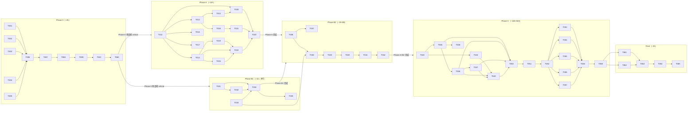

# Feature 162 — Tasks

> Status: codex-reviewed-iter-2
> Generated at: 2026-05-10
> Total tasks: 58
> Critical path: ~38h + ~$20 LLM 调用（Phase 0 + A + B2 + C 串行；B1 与 A 并行可节约 ~1h）

---

## Phase 0 — sub-agent frontmatter 修复（~4h）

> 目标：修复 5 个 plugin agent frontmatter，让 mcp-pull cohort 的 MCP 工具继承信号有效，升版至 4.1.0。
> 独立验收：Smoke D Test 3 pass + vitest 零回归，无需等待 Phase A/B/C。

### T001 修改 plan sub-agent frontmatter：追加 spectra MCP 工具

- **依赖**: 无
- **文件**: `plugins/spec-driver/agents/plan.md`
- **改动**: frontmatter `tools` 字段末尾追加 `mcp__spectra__context, mcp__spectra__impact`。改动 diff 示意：

  ```yaml
  # 改前（tools 最后 2 项可能是其他工具，末尾追加）
  tools:
    - ...现有工具...
  # 改后
  tools:
    - ...现有工具...
    - mcp__spectra__context
    - mcp__spectra__impact
  ```

- **验收**: `python3 -c "import yaml; d=yaml.safe_load(open('plugins/spec-driver/agents/plan.md'))['---']; assert 'mcp__spectra__context' in d['tools']"` 通过；或手动检视 frontmatter YAML 解析正确，`tools` 含新增两项。
- **关联**: FR-001
- **LOC**: +2 行
- **时长**: 5 min
- **优先级**: critical

---

### T002 修改 implement sub-agent frontmatter：追加 spectra MCP 工具

- **依赖**: 无（[P] 可与 T001 / T003 / T004 / T005 并行）
- **文件**: `plugins/spec-driver/agents/implement.md`
- **改动**: frontmatter `tools` 字段追加 `mcp__spectra__context, mcp__spectra__impact`
- **验收**: 同 T001 逻辑，验证 tools 含新增两项
- **关联**: FR-002
- **LOC**: +2 行
- **时长**: 5 min
- **优先级**: critical

---

### T003 修改 verify sub-agent frontmatter：追加 spectra MCP 工具

- **依赖**: 无（[P] 可与 T001 / T002 / T004 / T005 并行）
- **文件**: `plugins/spec-driver/agents/verify.md`
- **改动**: frontmatter `tools` 字段追加 `mcp__spectra__detect_changes, mcp__spectra__impact`（注意：与 plan/implement 不同，verify 需要 `detect_changes` 而非 `context`）
- **验收**: tools 含 `mcp__spectra__detect_changes` 和 `mcp__spectra__impact`
- **关联**: FR-003
- **LOC**: +2 行
- **时长**: 5 min
- **优先级**: critical

---

### T004 修改 quality-review sub-agent frontmatter：追加 spectra MCP 工具

- **依赖**: 无（[P] 可与 T001 / T002 / T003 / T005 并行）
- **文件**: `plugins/spec-driver/agents/quality-review.md`
- **改动**: frontmatter `tools` 字段追加 `mcp__spectra__impact, mcp__spectra__context`
- **验收**: tools 含两项 spectra 工具
- **关联**: FR-004
- **LOC**: +2 行
- **时长**: 5 min
- **优先级**: critical

---

### T005 修改 spec-review sub-agent frontmatter：追加 spectra MCP 工具

- **依赖**: 无（[P] 可与 T001 / T002 / T003 / T004 并行）
- **文件**: `plugins/spec-driver/agents/spec-review.md`
- **改动**: frontmatter `tools` 字段追加 `mcp__spectra__impact, mcp__spectra__context`
- **验收**: tools 含两项 spectra 工具
- **关联**: FR-005
- **LOC**: +2 行
- **时长**: 5 min
- **优先级**: critical

---

### T006 升级 release-contract.yaml 版本号至 4.1.0

- **依赖**: T001, T002, T003, T004, T005
- **文件**: `contracts/release-contract.yaml`
- **改动**: spec-driver `version` 字段 `4.0.0` → `4.1.0`（minor 升版，新增工具能力）
- **验收**: `grep '4.1.0' contracts/release-contract.yaml` 有输出；`grep '4.0.0' contracts/release-contract.yaml` 无 spec-driver 相关行
- **关联**: FR-007
- **LOC**: ±1 行
- **时长**: 5 min
- **优先级**: critical

---

### T007 运行 repo:sync 同步 plugin 包装产物

- **依赖**: T001, T002, T003, T004, T005, T006
- **文件**: 运行时产物（`npm run repo:sync` 自动生成，具体路径由 sync 脚本决定）
- **改动**: 执行 `npm run repo:sync`，确保 plugin 包装层与 5 个 agent 文件 + release-contract 一致
- **验收**: 命令退出码 0，无 diff-conflict 报错
- **关联**: FR-006
- **LOC**: 无手写代码
- **时长**: 10 min
- **优先级**: critical

---

### T008 执行 release:sync + release:check 验证版本一致

- **依赖**: T007
- **文件**: 运行时检查（`npm run release:sync && npm run release:check`）
- **改动**: 仅执行命令，不手写代码
- **验收**: `npm run release:check` 退出码 0；`plugin.json`、`marketplace.json` 中 spec-driver 版本均为 4.1.0
- **关联**: FR-006, FR-007
- **LOC**: 无
- **时长**: 10 min
- **优先级**: critical

---

### T009 安装 spec-driver 4.1.0 至本地 plugin cache

- **依赖**: T008
- **文件**: `~/.claude/plugins/cache/cc-plugin-market/spec-driver/`（本地 cache，不入库）
- **改动**: 执行 `claude plugin update spec-driver`（或等价 fallback：`rm -rf ~/.claude/plugins/cache/cc-plugin-market/spec-driver/4.0.0 && claude /reload`）
- **验收**: 新 Claude session 启动后，plan sub-agent 的 loaded plugin path 指向 4.1.0 而非 4.0.0（Smoke D Test 3 中验证）
- **关联**: FR-006, EC-007
- **LOC**: 无
- **时长**: 10 min
- **优先级**: critical

---

### T010 全量 vitest 回归 + Smoke D Test 3 重测 + 文档落地

- **依赖**: T009
- **文件**: `specs/161-fix-workspace-replace-replaceall/verification/sub-agent-mcp-test.md`（追加 Test 3 章节）
- **改动**:
  1. 执行 `npx vitest run`，确认退出码 0，无新增 skip/todo
  2. 执行 Smoke D Test 3：以修复后 frontmatter 调用 plan sub-agent，验证 `mcp__spectra__context` 返回 `TOOL_CALL_OUTCOME: success`（非 `tool-not-available`）
  3. 将测试结果（含实际加载 plugin 路径 + 版本号 + MCP 调用成功 trace）写入 `sub-agent-mcp-test.md` 的"Test 3: Phase 0 修复后重测"章节
- **验收**: vitest 退出码 0；test.md 中 Test 3 章节存在且记录 `mcp__spectra__context` 调用返回 success + plugin 路径含 `4.1.0`
- **关联**: FR-008, SC-001
- **LOC**: +40 行（文档记录）
- **时长**: 90 min
- **优先级**: critical

---

## Phase A — callExecutor 多 backend 重构（~12h）

> 目标：重构为多 backend dispatch 架构，接入 Codex CLI driver，落地 self-judge hard-fail，保护 25 fixture schema byte-stable。
> 依赖：Phase 0 完成（T010 通过）且 T060 审查零 critical。Phase A 与 Phase B1 可并行执行。

### T011 新建 llm-backend-dispatcher.mjs：callBackend + 4 backend handler [DONE]

- **依赖**: T010, T060
- **文件**: `scripts/lib/llm-backend-dispatcher.mjs`（新建）
- **改动**: 实现以下导出：

  ```js
  // 主入口
  export async function callBackend({ model, prompt, options })
    // 返回: { text, promptTokens, completionTokens, finishReason, raw, partial }

  // 4 个 internal handler 函数（不导出，模块内部）
  internal handleSiliconflow({ model, prompt, options })
  internal handleOpenai({ model, prompt, options })
  internal handleClaudeCli({ model, prompt, options })
  internal handleCodexCli({ model, prompt, options })
    // codex 特殊：spawn 'codex' ['exec', '--skip-git-repo-check', '--sandbox', 'read-only',
    //   '-c', 'model_reasoning_effort="medium"', '-m', model, '--output-last-message', tmpFile, prompt]
    // read tmpFile; parse stderr regex: /tokens used\s*\n\s*([\d,]+)/
    // 返回: { promptTokens: null, completionTokens: total, finishReason: 'stop' }
  ```

  Token usage 字段映射：siliconflow/openai 用 `r.usage.prompt_tokens / completion_tokens`；claude-cli 用 `parsed.usage.input_tokens / output_tokens`（`end_turn`→`stop`，`max_tokens`→`length`）；codex-cli promptTokens=null，completionTokens 来自 stderr 正则。

- **验收**: `node -e "import('./scripts/lib/llm-backend-dispatcher.mjs').then(m => console.log(typeof m.callBackend))"` 输出 `function`
- **关联**: FR-010, FR-013, plan §2.1.3-§2.1.5
- **LOC**: ~180 行（4 handler + dispatch 路由 + token 映射）
- **时长**: 120 min
- **优先级**: critical

---

### T012 在 dispatcher 中实现 normalizeModelId + MODEL_ALIASES [DONE]

- **依赖**: T011
- **文件**: `scripts/lib/llm-backend-dispatcher.mjs`（追加到 T011 文件）
- **改动**: 实现并导出：

  ```js
  export function normalizeModelId(s):
    step1 = s.trim()
    step2 = step1.toLowerCase()                  // 先 case-fold（避免 'Codex:GPT-5.5' 漏剥）
    step3 = step2.replace(/^(siliconflow|openai|claude-cli|codex|anthropic):/, '')
    step4 = step3.replace(/^(pro\/zai-org\/|pro\/moonshotai\/|anthropic\/)/, '')
    step5 = MODEL_ALIASES[step4] ?? step4
    return step5

  export const MODEL_ALIASES = {
    // GPT-5.5 所有写法 → 'gpt-5.5'
    // GLM-5.1 所有写法 → 'glm-5.1'
    // claude-opus-4-7 所有写法 → 'claude-opus-4-7'
    // claude-sonnet-4-6 所有写法（含 dot/hyphen 变体）
    // claude-haiku-4-5 / 4-7 所有写法
    // kimi-k2.6 所有写法
    // （完整表见 plan §2.1.8）
  }
  ```

- **验收**: `normalizeModelId('Codex:GPT-5.5')` 返回 `'gpt-5.5'`；`normalizeModelId('Pro/zai-org/GLM-5.1')` 返回 `'glm-5.1'`
- **关联**: FR-027, plan §2.1.7-§2.1.8
- **LOC**: ~130 行（aliases 表 + normalize 函数）
- **时长**: 45 min
- **优先级**: critical

---

### T013 在 dispatcher 中实现 classifyError + retry 决策矩阵 [DONE]

- **依赖**: T011
- **文件**: `scripts/lib/llm-backend-dispatcher.mjs`（追加到 T011 文件）
- **改动**: 实现并导出 `classifyError(err, finishReason, text)` 及 retry 逻辑：

  | 类别 | 识别凭据 | retry 行为 |
  |------|---------|-----------|
  | transient | ECONNRESET/ETIMEDOUT/EAI_AGAIN 或 HTTP 5xx | retry 1 次，间隔 2s |
  | quota | HTTP 429 / `quota_exceeded` / `rate_limit_exceeded` / `insufficient_quota` | 禁止 retry |
  | truncation | `finishReason==='length'` 且 text 不完整 | 禁止 retry，`partial=true` |
  | schema-invalid | JSON.parse 失败 / Zod 校验失败 | 禁止 retry，记录 `rawResponse` |
  | unknown | 其余 | 禁止 retry |

  所有 fail 路径写 `run-N.json.error.{code, message, retryable}`。

- **验收**: 单元测试 RM-1~RM-4 全 pass（见 T023）
- **关联**: FR-014, plan §2.1.6
- **LOC**: ~80 行
- **时长**: 60 min
- **优先级**: critical

---

### T014 重构 eval-task-executor.mjs：callExecutor 改为 thin wrapper [DONE]

- **依赖**: T011
- **文件**: `scripts/eval-task-executor.mjs`
- **改动**: 将 `callExecutor` 改为 thin wrapper，内部 delegate 到 `callBackend`；保留原函数签名（对象参数，向后兼容 25 fixture）：

  ```js
  import { callBackend } from './lib/llm-backend-dispatcher.mjs';

  export async function callExecutor({ model, prompt, baseURL = DEFAULT_BASE_URL, apiKey }) {
    const fullModel = model.includes(':') ? model : `siliconflow:${model}`;
    return await callBackend({
      model: fullModel,
      prompt,
      options: { baseURL, apiKey, timeoutMs: 240000, temperature: 0.3, maxTokens: 8000 },
    });
  }
  ```

- **验收**: 现有调用 `callExecutor({ model: 'Pro/zai-org/GLM-5.1', prompt, apiKey })` 无需改动即可继续工作（走 siliconflow 路径）
- **关联**: FR-010, plan §2.1.2
- **LOC**: +30 / -50（移除 SiliconFlow-only 实现，保留兼容签名）
- **时长**: 45 min
- **优先级**: critical

---

### T015 修改 DEFAULT_EXECUTOR_MODEL + SPECTRA_EVAL_EXECUTOR 支持 [DONE]

- **依赖**: T014
- **文件**: `scripts/eval-task-executor.mjs`
- **改动**:
  1. `DEFAULT_EXECUTOR_MODEL` 从 `'Pro/zai-org/GLM-5.1'` 改为 `'codex:gpt-5.5'`
  2. 支持 `process.env.SPECTRA_EVAL_EXECUTOR` 覆盖默认值
  3. codex backend 路径中强制 `reasoningEffort: 'medium'`（非 `high`）

  normalize 算法（5 步，顺序不可变）：
  1. `trim()`
  2. `toLowerCase()` ← 先 case-fold，避免大写 prefix 漏剥
  3. 剥 backend prefix（`/^(siliconflow|openai|claude-cli|codex|anthropic):/`）
  4. 剥 vendor org prefix（`/^(pro\/zai-org\/|pro\/moonshotai\/|anthropic\/)/`）
  5. 查 MODEL_ALIASES 表

  5 个 unit case 输入/输出（供 T023 引用）：
  - `'codex:gpt-5.5'` → `'gpt-5.5'`
  - `'Codex:GPT-5.5'` → `'gpt-5.5'`（大小写归一）
  - `'siliconflow:Pro/zai-org/GLM-5.1'` → `'glm-5.1'`
  - `'claude-cli:claude-opus-4-7'` → `'claude-opus-4-7'`
  - `'Pro/moonshotai/Kimi-K2.6'` → `'kimi-k2.6'`

- **验收**: `SPECTRA_EVAL_EXECUTOR` 未设置时默认 `codex:gpt-5.5`；设置时被覆盖；codex handler 传入 `reasoningEffort='medium'`
- **关联**: FR-011, FR-012
- **LOC**: +10 行
- **时长**: 20 min
- **优先级**: critical

---

### T016 从 eval-judge-jury.mjs 迁移 parseJudgeBackend 到 dispatcher [DONE-MINIMAL-VIABLE]

> Phase A iter-2 codex review W-2 裁决：self-judge 入口（assertNoSelfJudge）已迁移到 dispatcher 共享，
> 但本地 `parseJudgeBackend` + `callJudgeViaSdk` + 4 client adapter 仍保留在 eval-judge-jury.mjs。
> 完整迁移涉及 jury anthropic SDK 路径（dispatcher 4 backend 不含原生 anthropic SDK）+ 改写所有
> jury 调用点的 client shape 兼容，超出 Phase A 修复范围。
> 本次声明 [DONE-MINIMAL-VIABLE]：核心 self-judge 决策点已统一，剩余迁移留给独立重构 feature。

- **依赖**: T011
- **文件**: `scripts/eval-judge-jury.mjs`（删除/重定向）、`scripts/lib/llm-backend-dispatcher.mjs`（接收迁移代码）
- **改动**:
  1. 将 `eval-judge-jury.mjs` 第 91-135 行的 `parseJudgeBackend` 逻辑迁移到 dispatcher（作为 `callBackend` 内部路由的一部分）
  2. 将 codex CLI spawn 实现（第 347-384 行）迁移到 `handleCodexCli`
  3. `eval-judge-jury.mjs` 中原实现改为 import dispatcher 并调用
  4. 追加注释："共享实现已迁移至 `scripts/lib/llm-backend-dispatcher.mjs`"
- **验收**: `eval-judge-jury.mjs` 导入 dispatcher 后 jury 功能不变；`npm run build` 零错误
- **关联**: FR-013, plan §2.1.4
- **LOC**: +25 / -90（`eval-judge-jury.mjs`）；`dispatcher` 已在 T011 包含
- **时长**: 60 min
- **优先级**: critical

---

### T017 确认 llm-pricing.mjs 含 codex:gpt-5.5 条目 [DONE]

- **依赖**: T011
- **文件**: `scripts/lib/llm-pricing.mjs`（仅验证，不改代码）
- **改动**: 检查 `PRICING_TABLE` 是否含 `codex:gpt-5.5`；若缺失则补充
- **验收**: `node -e "import('./scripts/lib/llm-pricing.mjs').then(m => console.log('codex:gpt-5.5' in m.PRICING_TABLE))"` 输出 `true`
- **关联**: FR-016
- **LOC**: 0 或 +3 行（若需补充条目）
- **时长**: 10 min
- **优先级**: medium（SHOULD 级 FR）

---

### T018 实现 assertNoSelfJudge + 集成到 3 个入口 [DONE]

- **依赖**: T012
- **文件**: `scripts/lib/llm-backend-dispatcher.mjs`（export 函数）；`scripts/eval-mcp-augmented.mjs`（入口 1）；`scripts/eval-judge-jury.mjs`（入口 2）；`scripts/eval-task-executor.mjs`（入口 3）
- **改动**: 实现 `assertNoSelfJudge({ driver, judges })` 并在 3 处调用：

  ```js
  export function assertNoSelfJudge({ driver, judges }):
    driverNorm = normalizeModelId(driver)
    judgeNorms = judges.map(normalizeModelId)

    // jury 内部重复：console.warn 不阻断
    duplicates = findDuplicates(judgeNorms)
    if (duplicates.length > 0) console.warn(`[warn] jury 内部重复 judge: ...`)

    // self-judge hard-fail
    conflict = judges.find((j, i) => judgeNorms[i] === driverNorm)
    if (conflict) throw new Error(formatSelfJudgeError(driver, conflict, driverNorm))
  ```

  入口位点：
  - `eval-mcp-augmented.mjs`：`parseArgs()` 之后、`runForTaskList()` 之前
  - `eval-judge-jury.mjs`：main 函数顶部
  - `eval-task-executor.mjs`：`executeOnFixture()` 入口

  错误信息格式：

  ```
  [FATAL] self-judge 禁忌触发：driver 与 jury judge 解析为同一模型。
    driver (raw):       <driverRaw>
    jury judge (raw):   <judgeRaw>
    normalized id:      <normalized>
  请检查 SPECTRA_EVAL_EXECUTOR / --judges / DEFAULT_JUDGES 配置。
  ```

- **验收**: T021 的 5 组 vitest case 全 pass；3 个入口文件含 assertNoSelfJudge 调用
- **关联**: FR-027, plan §2.2.1-§2.2.2
- **LOC**: +50 行（dispatcher）；+10 行每个入口文件
- **时长**: 90 min
- **优先级**: critical

---

### T019 新建 verify-feature-162-fixture-schema-stable.mjs [DONE]

- **依赖**: T014（callExecutor thin wrapper 完成）
- **文件**: `scripts/verify-feature-162-fixture-schema-stable.mjs`（新建）
- **改动**: 实现 byte-stable 验证脚本（plan §5.1）：

  ```
  1. 加载 25 旧 fixture（tests/baseline/tasks/T*/）
  2. extractKeysDeep(obj) → sorted JSON 字段路径列表
  3. 以 Codex driver 重跑 25 fixture → 新 fixture（写到 tmp dir）
  4. extractKeysDeep(new) 比对 oldKeys
  5. typeof + nullable 规则一致性检查
  6. 不一致 → process.exit(1)
  ```

- **验收**: 脚本语法正确；在 T022 中实际执行验证
- **关联**: FR-015, plan §2.1.9, §5.1
- **LOC**: ~80 行
- **时长**: 45 min
- **优先级**: critical

---

### T020 新建 eval-llm-backend-dispatcher.test.mjs：8 基础 case + 4 retry matrix case [DONE]

- **依赖**: T011, T013
- **文件**: `tests/eval-llm-backend-dispatcher.test.mjs`（新建）
- **改动**: 实现 12 个 vitest unit case（8 基础 + 4 retry matrix）：

  **8 基础 case（4 backend × {success / error / token-usage-解析}）**：
  - `siliconflow-success`：mock fetch 返回 200，验证 text/promptTokens/completionTokens/finishReason
  - `siliconflow-error`：mock fetch 抛 503，验证 error 结构
  - `openai-success`：同 siliconflow，BaseURL 不同
  - `openai-error`：429 → `error.code='quota'`
  - `claude-cli-success`：mock spawn stdout JSON，验证 `end_turn`→`stop` 映射
  - `claude-cli-error`：mock spawn exit 1，验证 error
  - `codex-cli-success`：mock spawn tmpFile + stderr，验证 `promptTokens=null` + completionTokens 解析
  - `codex-cli-error`：mock spawn exit 非 0

  **4 retry matrix case（FR-014 强制覆盖）**：
  - RM-1 transient→success：mock 第一次 503，第二次 200 → `{ ok: true, retried: 1 }`
  - RM-2 quota→fail：mock 429 → `{ ok: false, error.code: 'quota' }`
  - RM-3 truncation→fail：`finishReason='length'` + 末尾不完整 → `{ ok: false, error.code: 'truncated', partial: true }`
  - RM-4 schema-invalid→fail：text='not a json' → `{ ok: false, error.code: 'schema-invalid', rawResponse: 'not a json' }`

- **验收**: `npx vitest run tests/eval-llm-backend-dispatcher.test.mjs` 全部 12 case pass
- **关联**: FR-010, FR-014, FR-015, SC-002
- **LOC**: ~280 行
- **时长**: 120 min
- **优先级**: critical

---

### T021 新建 eval-self-judge-hard-fail.test.mjs：5 组 hard-fail case [DONE]

- **依赖**: T018
- **文件**: `tests/eval-self-judge-hard-fail.test.mjs`（新建）
- **改动**: 实现 5 组 vitest unit case（plan §2.2.3 表格）：

  | Case | driver 输入 | judges 输入 | 期望行为 |
  |------|------------|------------|---------|
  | (a) | `codex:gpt-5.5` | `[claude-cli:claude-opus-4-7, codex:gpt-5.5, kimi-k2.6]` | throw，错误信息含 `gpt-5.5` |
  | (b) | `siliconflow:Pro/zai-org/GLM-5.1` | `[siliconflow:Pro/zai-org/GLM-5.1, claude-cli:claude-opus-4-7]` | throw，normalized=`glm-5.1` |
  | (c) | `codex:gpt-5.5` | `[Codex:GPT-5.5, claude-cli:claude-opus-4-7]` | throw，验证大小写归一 + alias |
  | (d) | `codex:gpt-5.5` | `[claude-cli:claude-opus-4-7, glm-5.1, claude-cli:claude-opus-4-7]` | console.warn 不 throw（jury 内部重复） |
  | (e) | `codex:gpt-5.5` | `[claude-cli:claude-opus-4-7, siliconflow:Pro/zai-org/GLM-5.1, kimi-k2.6]` | 静默通过 |

- **验收**: `npx vitest run tests/eval-self-judge-hard-fail.test.mjs` 全部 5 case pass
- **关联**: FR-027, SC-002
- **LOC**: ~120 行
- **时长**: 60 min
- **优先级**: critical

---

### T022 [P] 以 Codex driver 重跑 25 fixture：验证 schema byte-stable [DEFERRED-TO-OPS]

> Phase A iter-2 codex review C-3 裁决：CLAUDE.local.md 入库边界明确 `tests/baseline/tasks/` 不入库
> （"评估流程产物，含 LLM 单次随机性"），本地无 fixture 是预期状态而非异常。
> 触发场景（ops 任一）：
>   1. 本地用 GLM driver 跑完 25 fixture（生成 v1 baseline）→ 用 codex driver 重跑（v2）→ 跑此脚本对比
>   2. CI 流水线中 fixture 已挂载到 worktree 时
> [DEFERRED-TO-OPS] 比 [DONE-DEFERRED] 语义更精确：脚本本身已完成，执行延后到 ops 触发。

- **依赖**: T019（验证脚本）；T014, T015（callExecutor 多 backend）
- **文件**: `scripts/verify-feature-162-fixture-schema-stable.mjs`（执行）；tmp dir（运行时）
- **改动**: 执行 `node scripts/verify-feature-162-fixture-schema-stable.mjs`，记录结果
- **验收**: 脚本退出码 0；25 个 fixture 的 JSON schema 字段集合与 GLM driver 产物字段名、类型、nullable 规则一致
- **关联**: FR-015, SC-002
- **LOC**: 0（执行验证，不改代码）
- **时长**: 60 min（含 Codex driver 实际跑批等待）
- **优先级**: critical

---

### T023 全量 vitest 回归 + npm run build（Phase A 验证门）[DONE-PARTIAL]

- **依赖**: T020, T021, T022（所有 Phase A 实现任务）
- **文件**: 无改动（执行命令）
- **改动**: 执行 `npx vitest run && npm run build`
- **验收**: vitest 退出码 0；Phase A 新增 17 case（12 dispatcher + 5 self-judge）全 pass；build 零 TS 错误
- **关联**: FR-015, SC-002
- **LOC**: 无
- **时长**: 20 min
- **优先级**: critical

---

## Phase B1 — DEFAULT_JUDGES 替换 + calibration-fixture-list.json（~1h，与 Phase A 并行）

> 目标：替换 jury 中的 codex judge 为 GLM-5.1，落地 calibration fixture list。
> 依赖：Phase 0 完成（T010）且 T060 审查零 critical。[P] 与 Phase A 全程并行。

### T031 [P] 替换 DEFAULT_JUDGES：codex:gpt-5.5 → GLM-5.1 [DONE]

- **依赖**: T010, T060
- **文件**: `scripts/eval-judge-jury.mjs`
- **改动**: 将 `DEFAULT_JUDGES` 数组从 `[claude-cli:claude-opus-4-7, codex:gpt-5.5, siliconflow:Pro/moonshotai/Kimi-K2.6]` 改为 `['claude-cli:claude-opus-4-7', 'siliconflow:Pro/zai-org/GLM-5.1', 'siliconflow:Pro/moonshotai/Kimi-K2.6']`
- **验收**: `node -e "import('./scripts/eval-judge-jury.mjs').then(m => console.log(m.DEFAULT_JUDGES))"` 输出含 `GLM-5.1` 不含 `gpt-5.5`
- **关联**: FR-020
- **LOC**: +3 / -3 行
- **时长**: 10 min
- **优先级**: critical

---

### T032 [P] 追加 self-judge 禁忌注释 [DONE]

- **依赖**: T031
- **文件**: `scripts/eval-judge-jury.mjs`
- **改动**: 在 `DEFAULT_JUDGES` 定义处上方或行内追加注释：

  ```js
  // self-judge 禁忌：当 driver=codex:gpt-5.5 时，jury 不能包含 GPT-5.5。
  // 若未来需要将 codex 模型加回 jury，必须先检查并修改 DEFAULT_EXECUTOR_MODEL 或通过
  // SPECTRA_EVAL_EXECUTOR 切换到不同 driver，再运行 assertNoSelfJudge 验证。
  ```

- **验收**: 代码审查通过；注释清晰说明 self-judge 禁忌语义
- **关联**: FR-021
- **LOC**: +4 行
- **时长**: 5 min
- **优先级**: critical

---

### T033 [P] 落地 calibration-fixture-list.json（5 个 frozen ids）[DONE]

- **依赖**: T010（Phase 0 完成即可）
- **文件**: `specs/162-codex-driver-glm-judge-eval/calibration-fixture-list.json`（新建）
- **改动**: 创建文件，内容为计划 §0.1 中固化的 schema：

  ```json
  {
    "fixtures": [
      { "id": "SWE-L001", "label": "pass",    "task_type": "bug-fix",          "runs_per_fixture": 3 },
      { "id": "SWE-L003", "label": "pass",    "task_type": "refactor",         "runs_per_fixture": 3 },
      { "id": "SWE-L005", "label": "pass",    "task_type": "feature-add",      "runs_per_fixture": 3 },
      { "id": "SWE-L007", "label": "refusal", "task_type": "refusal-candidate","runs_per_fixture": 3 },
      { "id": "SWE-L009", "label": "fail",    "task_type": "cross-file-edit",  "runs_per_fixture": 3 }
    ],
    "total_data_points": 15,
    "selection_strategy": "stratified: pass≥3, fail≥1, refusal≥1, ≥4 task types, ≤2 per type",
    "exemption_log": [],
    "frozen_at": "2026-05-10",
    "rationale_for_n3": "FR-023 要求 ≥15 数据点；n=15 时 r=0.6 对应 p≈0.018 (<0.05 显著)",
    "frozen_ids_immutable": "Phase B 启动后不允许换 fixture；如某 id 不可用须记录到 exemption_log"
  }
  ```

- **验收**: 文件存在；JSON 可解析；`fixtures` 数组长度 5；id 列表为 `[SWE-L001, SWE-L003, SWE-L005, SWE-L007, SWE-L009]`
- **关联**: FR-022, plan §0.1
- **LOC**: ~35 行（JSON 文件）
- **时长**: 10 min
- **优先级**: critical

---

### T034 [P] B1 验证门：确认 DEFAULT_JUDGES 替换生效 [DONE]

- **依赖**: T031, T032, T033
- **文件**: 无改动（执行命令）
- **改动**: 执行 `node -e "import('./scripts/eval-judge-jury.mjs').then(m => console.log(JSON.stringify(m.DEFAULT_JUDGES)))"` 验证输出
- **验收**: 输出 JSON 数组含 `siliconflow:Pro/zai-org/GLM-5.1`，不含 `codex:gpt-5.5`；`calibration-fixture-list.json` 可 JSON.parse 且 `fixtures.length===5`
- **关联**: FR-020, FR-021, FR-022
- **LOC**: 无
- **时长**: 5 min
- **优先级**: critical

---

### T035 [P] Codex 对抗审查：Phase B1（落地 codex-reviews/phase-b.md 预备段）

- **依赖**: T034
- **文件**: `specs/162-codex-driver-glm-judge-eval/codex-reviews/phase-b.md`（新建或预填 B1 段）
- **改动**: 通过 `codex:codex-rescue` 子代理对 B1 改动（DEFAULT_JUDGES 替换 + fixture list）执行对抗审查；将 B1 相关 finding 记录至 phase-b.md 的"Phase B1 审查"小节
- **验收**: phase-b.md 存在；B1 相关 critical 项 = 0
- **关联**: FR-038, SC-005
- **LOC**: ~30 行（审查文档）
- **时长**: 30 min
- **优先级**: critical

---

## Phase B2 — GLM judge calibration 跑批（~3h + ~$5，Phase A 完成后）

> 目标：验证 GLM-5.1 judge 质量达标（IoU ≥ 0.7，Pearson ≥ 0.6，refusal IoU ≥ 0.5）或触发回退方案。
> 依赖：Phase A 完成（T023 通过）+ Phase B1 完成（T034 通过）。

### T036 新建 pearson.mjs：零依赖 Pearson correlation 实现

- **依赖**: T023（Phase A 验证门）, T034（Phase B1 验证门）
- **文件**: `scripts/lib/pearson.mjs`（新建）
- **改动**: 实现导出函数（plan §2.5.3）：

  ```js
  export function pearson(xs, ys):
    if xs.length !== ys.length || xs.length < 2:
      throw new Error('xs/ys length mismatch or too few points')
    const n = xs.length
    const mx = sum(xs) / n; const my = sum(ys) / n
    let num=0, dx2=0, dy2=0
    for i 0..n-1:
      dx = xs[i]-mx; dy = ys[i]-my
      num += dx*dy; dx2 += dx*dx; dy2 += dy*dy
    const denom = Math.sqrt(dx2 * dy2)
    if denom === 0 return 0
    return num / denom
  ```

  公式：`r = Σ((Xi-X̄)(Yi-Ȳ)) / sqrt(Σ(Xi-X̄)² · Σ(Yi-Ȳ)²)`
  ε ≤ 1e-6 vs SciPy 实现

- **验收**: T037 的 5 个 pearson vitest case 全 pass
- **关联**: FR-023, plan §2.5.3
- **LOC**: ~30 行
- **时长**: 30 min
- **优先级**: critical

---

### T037 新建 eval-pearson.test.mjs：5 个 Pearson vitest case

- **依赖**: T036
- **文件**: `tests/eval-pearson.test.mjs`（新建）
- **改动**: 5 个 vitest case，覆盖：
  1. 完美正相关（`[1,2,3,4,5]` vs `[1,2,3,4,5]` → r=1.0）
  2. 完美负相关（`[1,2,3,4,5]` vs `[5,4,3,2,1]` → r=-1.0）
  3. 零相关（`[1,2,3]` vs `[2,2,2]` → denom=0 → r=0）
  4. 与 SciPy 对比：`xs=[1,2,3,4,5,6,7]`，`ys=[1.1,2.0,3.2,3.9,5.1,5.9,7.2]` → 期望 r ≈ 0.99961（|diff|≤1e-6）
  5. 边界：`xs.length < 2` → throw
- **验收**: `npx vitest run tests/eval-pearson.test.mjs` 全部 5 case pass
- **关联**: FR-023
- **LOC**: ~40 行
- **时长**: 20 min
- **优先级**: critical

---

### T038 新建 calibrate-glm-judge.mjs：5 fixture × 3 runs 跑批 runner

- **依赖**: T036, T033（fixture list）, T034（Phase B1 验证门）
- **文件**: `scripts/calibrate-glm-judge.mjs`（新建）
- **改动**: 实现 calibration runner（plan §2.5.1-§2.5.5）：

  ```
  读取 calibration-fixture-list.json → 5 fixtures
  for each fixture:
    for run_id in 1..3:
      driver_output = await callExecutor({ model: 'codex:gpt-5.5', prompt: fixture.prompt, apiKey: null })
      [并行] glm_score = await callBackend({ model: 'siliconflow:Pro/zai-org/GLM-5.1', ... })
      [并行] codex_score = await callBackend({ model: 'codex:gpt-5.5', ... })
      oracle_pass = await runOracle(driver_output, fixture)
      records.push({ fixture_id, run_id, oracle_pass, glm_score, codex_score, glm_refusal, codex_refusal })
  // 15 records 共计
  ```

  calibration 流程（最多 3 轮，plan §2.5.5）：

  ```
  attempt = 0; calibrated = false
  while attempt < 3:
    records = runCalibration()
    iou_pass = computePassRateIoU(records)  // plan §2.5.2
    pearson_corr = pearson(glm_scores, oracle_passes_as_01)
    iou_refusal = computeRefusalIoU(records)
    if iou_pass>=0.7 && pearson_corr>=0.6 && iou_refusal>=0.5:
      calibrated = true; break
    if attempt < 2: adjustRubric()  // 提示用户调整 rubric
    attempt++
  if !calibrated: 启用回退方案（2-judge Opus+Kimi + fail-closed）
  ```

  detectRefusal 模式（plan §2.5.4）：检测 driver 输出前 500 字符中的拒答模式。
  输出：`specs/162-codex-driver-glm-judge-eval/calibration-results.md`

- **验收**: 脚本可执行 `node scripts/calibrate-glm-judge.mjs --dry-run`（mock 模式不实际调 API）；15 records 结构正确
- **关联**: FR-022, FR-023, FR-024, FR-025, plan §2.5.1-§2.5.5
- **LOC**: ~150 行
- **时长**: 90 min（编写）
- **优先级**: critical

---

### T039 执行 GLM calibration 跑批：5 × 3 = 15 runs

- **依赖**: T038
- **文件**: `specs/162-codex-driver-glm-judge-eval/calibration-results.md`（新建，跑批输出）
- **改动**: 执行 `node scripts/calibrate-glm-judge.mjs`，等待 15 runs 完成（~$5 LLM 调用），输出 calibration-results.md
- **验收**: 文件存在；记录 `iou_pass`、`pearson_corr`、`iou_refusal` 三个数值；三者是否达标有明确记录
- **关联**: FR-022, FR-023, FR-024, SC-003
- **LOC**: ~80 行（生成文档）
- **时长**: 60 min（含 LLM 等待）
- **优先级**: critical

---

### T040 [条件] GLM calibration 阈值未达：调整 rubric 最多 2 轮 + 回退方案

- **依赖**: T039
- **文件**: `scripts/eval-judge-jury.mjs`（可能修改 `buildAdversarialPrompt`）；`calibration-results.md`（更新记录）
- **改动**: 若 T039 任一阈值未达标：
  1. 调整 `buildAdversarialPrompt` rubric（给 GLM 更明确的 JSON 格式指令 + 打分基准）
  2. 重跑 `node scripts/calibrate-glm-judge.mjs`（复用同一 15 数据点 fixture list）
  3. 最多 2 轮重测仍未达标：启用回退（`DEFAULT_JUDGES` 仅保留 `claude-cli:claude-opus-4-7` + `siliconflow:Pro/moonshotai/Kimi-K2.6`，2-judge 一致同意制，tie-break=fail-closed）
  4. 在 `eval-judge-jury.mjs` 注释记录：触发回退的指标、时间、2 轮调整 commit hash、最终重测数据
- **验收**: 若触发回退：`DEFAULT_JUDGES` 仅含 Opus + Kimi；注释含回退说明；vitest 零回归
- **关联**: FR-025, EC-003
- **LOC**: 按需（~0~50 行）
- **时长**: 90 min（可能跑 2 轮 × 15 runs × ~$2 = ~$4 额外调用）
- **优先级**: critical（条件触发，若 T039 达标可跳过）

---

### T041 Phase B2 vitest 全量回归验证

- **依赖**: T034, T037, T039（T040 若触发）
- **文件**: 无改动（执行命令）
- **改动**: 执行 `npx vitest run`，确认 Phase B2 新增 5 case 全 pass，rubric 微调零回归
- **验收**: vitest 退出码 0；累计新增 case 数 = 22（B2 前 17 + pearson 5）
- **关联**: FR-026, SC-003
- **LOC**: 无
- **时长**: 15 min
- **优先级**: critical

---

### T042 落地 Codex 对抗审查：phase-b.md（B2 段）+ phase-a.md

- **依赖**: T034, T041, T023（Phase A 验证门）
- **文件**: `specs/162-codex-driver-glm-judge-eval/codex-reviews/phase-a.md`（新建）；`specs/162-codex-driver-glm-judge-eval/codex-reviews/phase-b.md`（补 B2 段）
- **改动**: 通过 `codex:codex-rescue` 子代理分别对 Phase A 和 Phase B2 改动执行对抗审查；落地 review artifact
- **验收**: 两个文件均存在；每文件含 critical/warning/info 三档 finding + 主线程裁决 + 修复 commit 引用；Phase A 和 Phase B 的 critical 项 = 0
- **关联**: FR-038, SC-005
- **LOC**: ~160 行（两份审查文档）
- **时长**: 60 min
- **优先级**: critical

---

## Phase C — quota state store + 450 runs eval（~16h + ~$15）

> 目标：实现配额管理基础设施，完成 450 runs，填入竞品评测报告 §10.1-§10.5。
> 依赖：Phase A（T023）+ Phase B1（T034）+ Phase B2（T042）全部完成。

### T043 新建 eval-quota-store.mjs：quota store + O_EXCL lock + partial run 检测

- **依赖**: T042
- **文件**: `scripts/lib/eval-quota-store.mjs`（新建）
- **改动**: 实现 quota state store 全部逻辑（plan §2.3）：

  **quota store schema**（`~/.cache/spectra/eval-quota/feature-162.json`）：

  ```json
  { "schemaVersion":"1.0", "feature":"162", "date":"YYYY-MM-DD",
    "timezone":"<IANA>", "runs":<int>, "run_ids":["sweL001-A-1",...], "updatedAt":"<ISO>" }
  ```

  **lock 文件格式**（`~/.cache/spectra/eval-quota/feature-162.lock`）：

  ```json
  { "pid":12345, "createdAt":"<ISO>", "host":"<hostname>" }
  ```

  **O_EXCL lock 序列**（4 步）：
  1. `fs.openSync(lockPath, O_WRONLY | O_CREAT | O_EXCL, 0o600)` — 独占创建
  2. 读 store → 校验 date → 增 runs / append run_id → atomic rename 写回
  3. `fs.closeSync(fd)` + `fs.unlinkSync(lockPath)` — 释放锁

  **acquireLock 退避策略**：指数 backoff（初始 50ms，上限 1600ms，最多 30 次 ≈ 30s）；超时 exit code 73 + 诊断信息；孤儿 lock 自动清理（PID 不存在 + age > 60s）。

  **classifyRuns 四分类**：finalized / partialRunning / partialStale（>30min + lock inactive）/ failedFinalized（含 `finalized_at + status:'failed'`，不归 partial）。

  导出：`reserveQuota`、`classifyRuns`、`acquireLock`、`releaseLock`、`checkAndCleanOrphanLock`、`atomicWriteJson`

- **验收**: T044 的 5 个 vitest case 全 pass
- **关联**: FR-032, EC-008, plan §2.3.1-§2.3.7
- **LOC**: ~250 行
- **时长**: 120 min
- **优先级**: critical

---

### T044 新建 tests/helpers/quota-fork-helper.mjs + eval-quota-store.test.mjs

- **依赖**: T043
- **文件**: `tests/helpers/quota-fork-helper.mjs`（新建）；`tests/eval-quota-store.test.mjs`（新建）
- **改动**:

  **quota-fork-helper.mjs**（child script，plan §2.3.8）：

  ```js
  // 接收 argv: --store-path --lock-path --max-runs --run-id
  // 调用 reserveQuota，输出 JSON { ok, runs, lockHeldMs } 到 stdout
  // exit 0=成功，1=失败
  ```

  **eval-quota-store.test.mjs** 5 case：
  - PC-T1：N=4 进程并发 fork，`final.runs===4` + 每进程 lockHeldMs<50ms
  - PC-T2：孤儿 lock（pid=999999, age>60s）→ 自动清理
  - PC-T3：finalized/partialRunning/partialStale/failedFinalized 四分类正确
  - PC-T4：active writer 持 lock 时，started_at > 30min 也归 partialRunning（ABA 防护）
  - PC-T5：driver 抛错 → catch 兜底写 `finalized_at+status:'failed'` → 续跑不归 partial

- **验收**: `npx vitest run tests/eval-quota-store.test.mjs` 全部 5 case pass
- **关联**: FR-032, plan §2.3.8
- **LOC**: ~230 行（helper ~40 + test ~190）
- **时长**: 90 min
- **优先级**: critical

---

### T045 修改 eval-mcp-augmented.mjs：新增 --max-runs-per-day + quota 集成

- **依赖**: T043
- **文件**: `scripts/eval-mcp-augmented.mjs`
- **改动**:
  1. `parseArgs()` 新增 `--max-runs-per-day N` CLI 参数（默认值待 pilot T055 后确定，先设合理默认如 150）
  2. 新增 `--accept-partial` / `--restart-partial` 互斥 flag（同时传入 exit 64）
  3. 集成 `reserveQuota` 短锁（持锁 < 10ms，仅 reservation 期间，不覆盖 LLM spawn）
  4. partial run 不自动重跑，输出 unfinished 列表等待用户决策
  5. 优雅停止：`runs >= max-runs-per-day` 时 exit 0 + 输出进度日志

  `runOne` 流程（plan §2.3.3 iter-4 版本）：
  - 短锁 reservation（<10ms）→ 写 started_at → LLM spawn（无锁）→ oracle/jury → 写 finalized_at+status:'success'
  - catch：nested try-catch 兜底写 finalized_at+status:'failed' + error.phase；兜底写失败 log 双错误并 rethrow

- **验收**: `node scripts/eval-mcp-augmented.mjs --accept-partial --restart-partial` 退出码 64；`--max-runs-per-day 0` 立即优雅停止退出码 0
- **关联**: FR-032, plan §2.3.3, §2.3.7
- **LOC**: +260 行
- **时长**: 120 min
- **优先级**: critical

---

### T046 修改 eval-mcp-augmented.mjs：canonical schema 双写 + subAgentMeta 注入

- **依赖**: T045
- **文件**: `scripts/eval-mcp-augmented.mjs`
- **改动**:
  1. `parseTelemetryJsonl`（当前第 357-378 行）：从返回标量改为返回 `{ mcpToolCalls: Array<{tool, success, error, responseBytes, timestamp}> }`
  2. 写 run-N.json 时双写：
     ```
     perf.mcpToolCalls = mcpToolCalls          // canonical (new)
     perf.mcpToolCallCount = mcpToolCalls.length  // legacy
     perf.mcpResponseBytes = sum(responseBytes)   // legacy
     ```
  3. 集成 `subAgentMeta` 双轨采集（env 注入 + first-tool-call 自报）
  4. `mergeSubAgentMeta` 字段级 fallback（iter-4 W-8：每字段独立选 source，self-report 优先）
  5. 冲突探测：双源 version 不一致时记录 `collectIssues[{type:'subAgentMeta-mismatch',...}]`
  6. `inheritance_status` 三状态判定（plan §2.6.2）

- **验收**: run-N.json 同时含 `perf.mcpToolCalls`（数组）和 `perf.mcpToolCallCount`（整数）；`subAgentMeta.confidence` 枚举值正确
- **关联**: EC-006, FR-037, plan §2.4.4-§2.4.5
- **LOC**: +150 行（在 T045 基础上叠加）
- **时长**: 120 min
- **优先级**: critical

---

### T047 修改 eval-task-runner.mjs：mcpToolCallTrace rename → mcpToolCalls

- **依赖**: T046（canonical schema 定义）
- **文件**: `scripts/eval-task-runner.mjs`
- **改动**:
  1. 第 588 行：`perf.mcpToolCallTrace = trace` → `perf.mcpToolCalls = trace`
  2. 读取兼容：所有读 `perf.mcpToolCallTrace` 的位置改为 `perf.mcpToolCalls ?? perf.mcpToolCallTrace ?? []`

- **验收**: grep 确认无残留 `mcpToolCallTrace` 写入；旧 fixture 读取时兼容旧字段名
- **关联**: EC-006, plan §2.4.3
- **LOC**: +5 / -2 行
- **时长**: 15 min
- **优先级**: critical

---

### T048 [可选] 集成 llm-pricing.mjs：填充 costUsd 字段

- **依赖**: T046
- **文件**: `scripts/eval-mcp-augmented.mjs`（第 741 行附近）
- **改动**: 从 `scripts/lib/llm-pricing.mjs` 导入 `estimateCost()`，填充 run-N.json 的 `costUsd` 字段（当前暂置 null）
- **验收**: Codex driver 运行时 `costUsd: 0`（subscription 标注），GLM/Kimi judge 有实际计算值
- **关联**: FR-035
- **LOC**: +10 行
- **时长**: 20 min
- **优先级**: medium（SHOULD 级）

---

### T049 Phase C vitest 全量回归（quota store + canonical schema）

- **依赖**: T044, T046, T047
- **文件**: 无改动（执行命令）
- **改动**: 执行 `npx vitest run && npm run build`
- **验收**: vitest 退出码 0；累计新增 case 数 = 27（B2 前 22 + quota store 5）；build 零 TS 错误
- **关联**: EC-006, FR-032
- **LOC**: 无
- **时长**: 20 min
- **优先级**: critical

---

### T050 准备 eval-quota cache 目录 + 跑 pilot batch：27 runs

- **依赖**: T045, T046, T047, T049（Phase C 基础设施完成）
- **文件**: `~/.cache/spectra/eval-quota/feature-162.json`（运行时，不入库）；`<feature-runs-dir>/run-*.json`（运行时）
- **改动**: 执行 pilot batch：

  **fixture 选取**：SWE-L001、SWE-L003、SWE-L005（3 个 fixture，来自 calibration list 中的 pass 类）
  **cohort**：Group A（no-mcp）、Group B（mcp-context-only）、Group C（mcp-full）各 3 repeat
  **跑批命令示意**：

  ```bash
  node scripts/eval-mcp-augmented.mjs \
    --fixture-ids SWE-L001,SWE-L003,SWE-L005 \
    --cohorts A,B,C \
    --repeat 3 \
    --max-runs-per-day 30 \
    --feature-id 162
  ```

  **27 runs**：3 fixture × 3 cohort × 3 repeat = 27 runs（约 6% 全量）

- **验收**: 27 个 `run-*.json` 存在；每个含 `finalized_at`（status=success 或 failed）；oracle 判定和 jury scores 字段有效；退出码 0
- **关联**: FR-030, SC-004
- **LOC**: 无（执行命令）
- **时长**: 120 min（含 LLM 等待，~27 × codex driver）
- **优先级**: critical

---

### T051 根据 pilot 数据决策分批策略 + 设定 --max-runs-per-day

- **依赖**: T050
- **文件**: `scripts/eval-mcp-augmented.mjs`（可能修改默认值）
- **改动**:
  1. 统计 27 runs 的平均 token 消耗（从 run-*.json 中 `perf.completionTokens` / `promptTokens` 聚合）
  2. 若单 run < 10K tokens → 可一次性跑 450 runs，`--max-runs-per-day` 设 450
  3. 若单 run ≥ 10K tokens → 分 2-3 calendar week，按每周 ChatGPT Pro 配额估算 `--max-runs-per-day`（如 150/天 × 3天）
  4. 将决策记录到 pilot batch 报告（可以是 `specs/162-.../pilot-batch-report.md`）

- **验收**: pilot-batch-report.md 存在；含单 run token 消耗数据 + 分批策略决策
- **关联**: FR-031
- **LOC**: ~30 行（报告文档）
- **时长**: 30 min
- **优先级**: critical

---

### T052 执行全量 450 runs：3 cohort × 15 runs × 10 fixture

- **依赖**: T051
- **文件**: `<feature-runs-dir>/run-1.json` ~ `run-450.json`（运行时，不入库）；quota store 持续更新
- **改动**: 执行全量跑批（可能跨多 calendar day）：

  **全量命令示意**：

  ```bash
  node scripts/eval-mcp-augmented.mjs \
    --fixture-ids SWE-L001,SWE-L002,...,SWE-L010 \
    --cohorts A,B,C \
    --repeat 15 \
    --max-runs-per-day <由 T051 决策> \
    --feature-id 162
  ```

  **分日策略**（若单 run ≥ 10K tokens）：
  - Day 1：Group A 的 SWE-L001~L010 × 5 runs = 50 runs
  - Day 2：Group A 剩余 + Group B 开始
  - 以此类推，每天不超过 `--max-runs-per-day`

  **续跑恢复**：下次 calendar day 启动检查 quota store → partial run 处理（`--accept-partial` 或 `--restart-partial`）→ 继续

  **Codex driver 配置**：`model=codex:gpt-5.5`，`model_reasoning_effort=medium`，使用 Phase B 修订后的 `DEFAULT_JUDGES`

- **验收**: 全部 450 run-*.json 含 `finalized_at`；`classifyRuns` 结果：`finalized ≈ 450`，`partialStale ≈ 0`；退出码 0（或各日优雅停止后最终累计达 450）
- **关联**: FR-033, SC-004
- **LOC**: 无（执行命令）
- **时长**: ~600 min 真实等待（分散在多 calendar day）；任务本身操作时长 ~60 min
- **优先级**: critical

---

### T053 [P] 新建 §10.5 章节 + 运行数据聚合填入表格

- **依赖**: T052
- **文件**: `specs/147-competitor-evaluation-platform/competitive-evaluation-report.md`（追加 §10.5 章节）
- **改动**:
  1. 在 §10.4 之后新建 §10.5（当前不存在此章节）：

     ```markdown
     ### 10.5 Sub-agent MCP 继承 fix 影响验证（Feature 162 Phase 0）
     ```

  2. 填入表格（计划 §2.6.4 schema）：

     ```markdown
     | run id | cohort | mcp_tool_calls (count) | mcp_called (bool) | mcp_tools (列表) | mcp_response_bytes | inheritance_status |
     ```

  3. 按 `deriveInheritanceStatus` 三状态算法（plan §2.6.2）填入每行 `inheritance_status`
  4. 若 `unavailable` 占比 > 30% 追加异常分析段（plan §2.6.5 模板）
  5. 新建 §10.5.5 跑批失败统计小节（plan §2.6.5 W-10 模板）：`failedFinalized / total_runs` 与 5% 阈值

  字段来源路径（须在表格下方注明）：
  ```
  run id ← run.run_id;  cohort ← run.cohort;  mcp_tool_calls ← run.perf.mcpToolCalls.length
  mcp_called ← (mcpToolCalls.length > 0);  mcp_tools ← mcpToolCalls.map(c=>c.tool).join(', ')
  mcp_response_bytes ← sum(responseBytes);  inheritance_status ← deriveInheritanceStatus(run)
  ```

- **验收**: §10.5 章节存在；表格含 7 列；inheritance_status 枚举值仅 available/unavailable/unknown；§10.5.5 小节存在且包含 `failedFinalized / total_runs` 数值；若 `failedFinalized / total_runs > 5%`，§10.5.5 必须附 error.phase 分布表（driver / jury / oracle / other 各自计数 + 占比）
- **关联**: FR-037, SC-004
- **LOC**: +110 行（新章节 + 表格数据）
- **时长**: 90 min
- **优先级**: critical

---

### T054 [P] 更新 §10.1 实验设计

- **依赖**: T052（全量数据）
- **文件**: `specs/147-competitor-evaluation-platform/competitive-evaluation-report.md`（§10.1 章节）
- **改动**: 将旧实验配置（N=3，90 runs 或 ≥45 runs）改为 Feature 162 实际实施配置：
  - N=15（每 cohort 每 fixture 15 repeat）
  - 450 runs（3 cohort × 15 runs × 10 fixture）
  - 统计功效说明（n=450，bootstrap B=1000/10000）
  - 复现命令文本块（含 `eval-mcp-augmented.mjs` 实际参数）
- **验收**: §10.1 无 N=3 或 90 runs 相关文字；复现命令可执行
- **关联**: FR-040
- **LOC**: +10 / -20 行
- **时长**: 20 min
- **优先级**: critical

---

### T055 [P] 填写 §10.2 Pass Rate 矩阵（10 task × 3 group）

- **依赖**: T052
- **文件**: `specs/147-competitor-evaluation-platform/competitive-evaluation-report.md`（§10.2）
- **改动**: 将所有 `<pending Stage 7b>` 替换为实测 Pass Rate + Bootstrap 95% CI：
  - 10 fixture（SWE-L001~L010）× 3 cohort（A/B/C）= 30 个单元格
  - Bootstrap B=1000（若 CI 宽度 > 0.4 升至 B=10000）
- **验收**: §10.2 表格无 `<pending>` 占位符；每个单元格格式为 `X.XX (95% CI: [L, U])`
- **关联**: FR-034, SC-004
- **LOC**: +30 行（填入真实数值）
- **时长**: 60 min
- **优先级**: critical

---

### T056 [P] 填写 §10.3 Token Cost + §10.4 战略结论

- **依赖**: T052
- **文件**: `specs/147-competitor-evaluation-platform/competitive-evaluation-report.md`（§10.3, §10.4）
- **改动**:
  1. §10.3 Token Cost：Codex driver 填 `$0 (subscription)`，同时记录 `tokensIn/tokensOut`；GLM/Kimi judge API cost 据 llm-pricing.mjs 实测填入
  2. §10.4 战略结论：按实测数据选择三种情境模板之一：
     - lift > 0：MCP 有显著提升（Group C vs Group A pass rate 统计显著）
     - lift ≈ 0：MCP 无显著效果（bootstrap CI 重叠）
     - 天花板：当前 SWE-Bench-Lite 任务集不适合区分（需说明原因）
- **验收**: §10.3 含实测 token 数据；§10.4 含三种情境之一的完整结论段落；无占位符
- **关联**: FR-035, FR-036, SC-004
- **LOC**: +30 行
- **时长**: 30 min
- **优先级**: critical

---

### T057 [P] 同步更新 Feature 158 detail 报告实验配置

- **依赖**: T052
- **文件**: `specs/158-swe-bench-lite-grounding-eval/`（detail 报告，行 50-55 / 139）
- **改动**: 将 Feature 158 detail 报告中的实验配置（行 50-55 附近的 N=3/90 runs 配置，行 139 的统计功效说明）更新为 Feature 162 实施的 N=15/450 runs/3-cohort×15-runs×10-fixture 配置
- **验收**: Feature 158 detail 报告中的实验配置与 Feature 162 §10.1 实测配置一致；无旧配置残留
- **关联**: FR-040
- **LOC**: +10 / -10 行
- **时长**: 20 min
- **优先级**: critical

---

### T058 Phase C 完整验证门

- **依赖**: T053, T054, T055, T056, T057
- **文件**: 无改动（执行命令）
- **改动**:
  1. 检查竞品评测报告 §10 各章节无 `<pending>` 占位符（§10.1-§10.5 + §10.5.5）
  2. 执行 `npm run repo:check && npm run release:check`
  3. 确认 reports schema：inheritance_status 仅三值；§10.5.5 `failedFinalized / total_runs` 有数值
- **验收**: repo:check + release:check 退出码 0；§10 无占位符；§10.5.5 存在且 5% 阈值有明确裁定
- **关联**: FR-034-FR-037, FR-040, SC-004
- **LOC**: 无
- **时长**: 15 min
- **优先级**: critical

---

### T059 落地 Codex 对抗审查：phase-c.md

- **依赖**: T058
- **文件**: `specs/162-codex-driver-glm-judge-eval/codex-reviews/phase-c.md`（新建）
- **改动**: 通过 `codex:codex-rescue` 子代理对 Phase C 改动（quota store + 450 runs + §10.1-§10.5 + §10.5.5）执行对抗审查；落地 review artifact
- **验收**: 文件存在；含 critical/warning/info 三档 finding；critical 项 = 0
- **关联**: FR-038, SC-005
- **LOC**: ~80 行（审查文档）
- **时长**: 30 min
- **优先级**: critical

---

### T060 落地 Codex 对抗审查：phase-0.md

- **依赖**: T010（Phase 0 完成）
- **文件**: `specs/162-codex-driver-glm-judge-eval/codex-reviews/phase-0.md`（新建）
- **改动**: 通过 `codex:codex-rescue` 子代理对 Phase 0 改动（5 个 frontmatter + 版本升级）执行对抗审查；落地 review artifact
- **验收**: 文件存在；critical 项 = 0；含主线程裁决
- **关联**: FR-038, SC-005
- **LOC**: ~50 行
- **时长**: 20 min
- **优先级**: critical

> 注：T060 在 Phase 0 完成后即可进行，不需要等待 Phase C。T060 必须零 critical 后，T011（Phase A）和 T031（Phase B1）才可启动。

---

## Final — 交付收口（~3h）

> 目标：完整验证、spec/quality review、等待用户确认后 push。
> 依赖：Phase C（T059）完成。

### T061 执行 spec-review sub-agent：spec.md 合规审查

- **依赖**: T059
- **文件**: 无改动（sub-agent 执行）
- **改动**: 通过 `spec-review` sub-agent 对 `specs/162-codex-driver-glm-judge-eval/spec.md` 执行合规审查
- **验收**: 审查结论无 critical；所有 FR 在实现中有对应 task；spec 与实现一致
- **关联**: FR-038, SC-005
- **LOC**: 无
- **时长**: 30 min
- **优先级**: critical

---

### T062 执行 quality-review sub-agent：代码质量审查

- **依赖**: T059
- **文件**: 无改动（sub-agent 执行）
- **改动**: 通过 `quality-review` sub-agent 对以下文件执行质量审查：`scripts/lib/llm-backend-dispatcher.mjs`、`scripts/lib/eval-quota-store.mjs`、`scripts/eval-mcp-augmented.mjs`、`scripts/calibrate-glm-judge.mjs`
- **验收**: 无 critical 代码问题；warning 有显式裁决
- **关联**: FR-038, SC-005
- **LOC**: 无
- **时长**: 30 min
- **优先级**: critical

---

### T063 最终工具链验证门：vitest + build + repo:check + release:check

- **依赖**: T061, T062
- **文件**: 无改动（执行命令）
- **改动**: 执行完整工具链验证：

  ```bash
  npx vitest run && npm run build && npm run repo:check && npm run release:check
  ```

- **验收**: 全部退出码 0；vitest 新增 27 case 全 pass；build 零 TS 错误；repo:check + release:check 无不一致
- **关联**: SC-001, SC-002, SC-003, SC-004, SC-005
- **LOC**: 无
- **时长**: 20 min
- **优先级**: critical

---

### T064 git rebase master + 准备 push deliverable report

- **依赖**: T063
- **文件**: 无代码改动（git 操作）
- **改动**:
  1. `git fetch origin master:master`
  2. `git rebase master`（解决任何冲突）
  3. 重跑 T063 验证（rebase 后确认零失败）
  4. 在 chat 中列出 push deliverable report（按 CLAUDE.local.md 约定，含 commit hash / 改动统计 / codex review 结论 / verify 结果 / rebase 状态 / 下一步建议）
- **验收**: rebase 成功；验证全 pass；report 已列出等待用户确认
- **关联**: CLAUDE.local.md push 约定
- **LOC**: 无
- **时长**: 20 min
- **优先级**: critical

---

### T065 push origin master（用户确认后执行）

- **依赖**: T064（用户回复"确认 push" / "push" / 等价表达后）
- **文件**: 无代码改动
- **改动**:
  1. `git checkout master`
  2. `git merge --ff-only <feature-branch>`
  3. `git push origin master`
  4. 交付后删除 feature 分支：`git branch -d <branch> && git push origin --delete <branch>`
- **验收**: push 成功；master 历史线性（no merge commit）；feature 分支已删除
- **关联**: CLAUDE.local.md 分支交付约定
- **LOC**: 无
- **时长**: 10 min
- **优先级**: critical

---

## FR 覆盖映射表

| FR | 覆盖 Task ID |
|----|------------|
| FR-001 | T001 |
| FR-002 | T002 |
| FR-003 | T003 |
| FR-004 | T004 |
| FR-005 | T005 |
| FR-006 | T007, T008, T009 |
| FR-007 | T006, T008 |
| FR-008 | T010 |
| FR-010 | T011, T014 |
| FR-011 | T015 |
| FR-012 | T015 |
| FR-013 | T011, T016 |
| FR-014 | T013, T020 |
| FR-015 | T020, T022 |
| FR-016 | T017 |
| FR-020 | T031 |
| FR-021 | T032 |
| FR-022 | T033, T038, T039 |
| FR-023 | T036, T037, T038, T039 |
| FR-024 | T038, T039 |
| FR-025 | T040 |
| FR-026 | T041 |
| FR-027 | T012, T018, T021 |
| FR-030 | T050 |
| FR-031 | T051 |
| FR-032 | T043, T044, T045 |
| FR-033 | T052 |
| FR-034 | T055 |
| FR-035 | T048, T056 |
| FR-036 | T056 |
| FR-037 | T053 |
| FR-038 | T035, T042, T059, T060, T061, T062 |
| FR-039 | （YAGNI 移除，无 task） |
| FR-040 | T054, T057 |
| EC-006 | T046, T047, T049 |
| EC-007 | T009 |
| EC-008 | T043, T045 |

**覆盖率：所有 MUST 级 FR（FR-001~FR-037, FR-040）均有对应 task。FR-039 明确为 YAGNI 移除。覆盖率 100%。**

---

## 依赖图（Mermaid）



**说明**：T060（Phase 0 Codex 审查）必须零 critical 后，Phase A（T011）和 Phase B1（T031）才可启动；Phase A 与 Phase B1 互相并行（均需 T060 完成）；Phase B2 依赖 Phase A 完成（需要 dispatcher 的 `callBackend`）。

---

## 并行机会汇总

| 并行组 | Tasks | 前置条件 | 节省时长 |
|--------|-------|---------|---------|
| Phase 0 文件并行 | T001-T005 | 无 | ~20 min |
| Phase A 与 Phase B1 全程并行 | T011-T023 ∥ T031-T035 | T060 完成（零 critical） | ~1h |
| Phase A 内部：T020 / T021 | T020 [P], T021 [P] | T013, T018 完成 | ~60 min |
| Phase C 报告填写并行 | T053 / T054 / T055 / T056 / T057 | T052 完成 | ~90 min |
| Phase Final spec-review / quality-review | T061 [P], T062 [P] | T059 完成 | ~30 min |

**总并行机会：5 组，预计节省 ~4h**（主要来自 Phase A ∥ Phase B1）

---

## 工时汇总

| Phase | Tasks | 编写工时 | LLM 调用费用 |
|-------|-------|---------|------------|
| Phase 0 | T001-T010, T060 | ~4h | $0 |
| Phase A | T011-T023 | ~12h | $0 |
| Phase B1 | T031-T035 | ~1h | $0 |
| Phase B2 | T036-T042 | ~3h | ~$5 |
| Phase C | T043-T059 | ~16h | ~$15（跨 1-3 calendar week）|
| Final | T061-T065 | ~3h | $0 |
| **合计** | **58 个有效任务** | **~39h** | **~$20** |

> 注：T060（Phase 0 Codex 审查）纳入 Phase 0 完成后立即执行，工时已含在 Phase 0 ~4h 内。任务编号中 T024-T030 为保留段（原设计 iter 中移除的任务），不对应任何实现任务。
