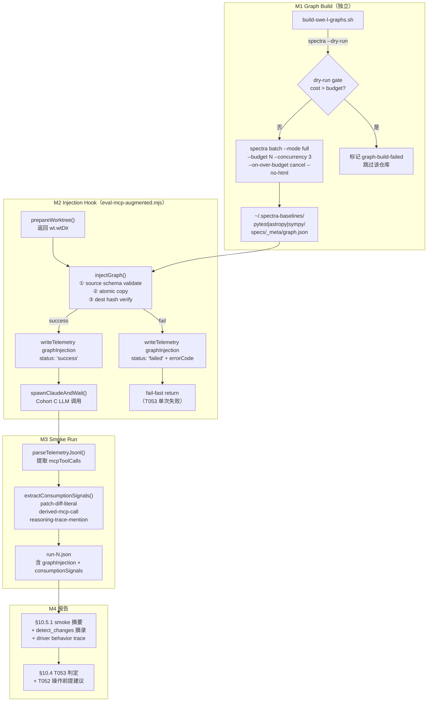

# Feature 165 — Pre-build Python Graph & Cohort C Smoke Test：技术实现计划

**Feature Branch**: `165-prebuild-python-graph-c-smoke`
**创建时间**: 2026-05-16
**模式**: story（基于 spec.md 4 轮 Codex 对抗审查后直接规划）
**规划者**: spec-driver plan 子代理

---

## Summary

本计划将 spec.md 定义的 3 个用户故事转化为 4 个可独立验证的里程碑（M1–M4）。核心技术工作：

1. **M1**：新建 `scripts/baselines/build-swe-l-graphs.sh`，串行调用 spectra CLI 为 pytest / astropy / sympy 三仓库生成 LLM full panoramic graph，含 dry-run 预估门控和 budget 上限。
2. **M2**：在 `scripts/eval-mcp-augmented.mjs` 的 Cohort C 分支中，于 `prepareWorktree` 返回后、`spawnClaudeAndWait` 前插入 graph injection hook（atomic copy + 双阶段 schema 校验 + telemetry 写入），同时实现 Cohort A/B 前置断言；配套单元测试。
3. **M3**：跑 Cohort C 9-run smoke（SWE-L001/L003/L005 × 3），提取 `consumptionSignals`，判定 T053 通过/失败。
4. **M4**：在 `competitive-evaluation-report.md` 填写 §10.5.1 smoke 数据 + 更新 §10.4 战略结论，完成全量 vitest/build/repo:check 验证。

风险等级：**MEDIUM**（4 个文件 + 1 个 spec 已升 MEDIUM 复杂度——atomic copy + schema validate + telemetry contract）。⚠️ Codex W-8 修复：保持与 spec.md 复杂度评估一致。

---

## Technical Context

### 语言与运行时

- **Node.js 20.x+**（ESM，`.mjs` 模块格式）
- **TypeScript 5.x**（仅 `.test.ts` 文件；`.mjs` 主脚本不经 tsc 编译）
- **Bash**（`build-swe-l-graphs.sh`，与现有 `clone-swe-bench-upstream.sh` 风格一致）
- **spectra CLI**：`dist/cli/index.js`（需 `npm run build` 产生）；当前版本由 `package.json.version` 动态读取（截至 2026-05-16 为 4.1.1，但脚本不 hardcode）

### 关键依赖（无新引入）

| 依赖 | 用途 | 来源 |
|------|------|------|
| `node:fs`、`node:path`、`node:os` | atomic copy、路径拼接 | Node built-in |
| `crypto`（`node:crypto`）| sourceHash 计算（MD5/SHA256） | Node built-in |
| spectra CLI `dist/cli/index.js` | graph 生成 | 本仓库已有 |
| `prepareWorktree`（`eval-task-runner.mjs`） | worktree 准备 | 本仓库已有 |
| `vitest` | 单元测试 | 本仓库已有 |

### 关键路径常量（本 Feature 新增）

```javascript
// ~/.spectra-baselines/<repo>/specs/_meta/graph.json（graph 存放路径）
const BASELINE_HOME = process.env.SPECTRA_BASELINE_HOME ?? path.join(os.homedir(), '.spectra-baselines');
const GRAPH_FILENAME = 'specs/_meta/graph.json';

// Cohort C inject 目标：worktree root + GRAPH_FILENAME
// worktree root 由 prepareWorktree() 返回 wt.wtDir
const DEST_GRAPH = path.join(wt.wtDir, GRAPH_FILENAME);

// runtime 期望的 graphSchemaVersion — 详见决策 3 的完整 fallback 链
// 优先 spectra CLI --version 探测 → package.json fallback → 'unknown' safe-fail
// 实际实现见决策 3 RUNTIME_SPECTRA_VERSION IIFE
```

---

## Codebase Reality Check

### 目标文件现状

| 文件 | LOC | 公开函数/方法数 | 已知 debt | 备注 |
|------|-----|----------------|-----------|------|
| `scripts/eval-mcp-augmented.mjs` | **1261** | 约 15 个导出函数 | 0 个 TODO/FIXME（grep 无匹配） | LOC > 500 且新增 > 50 行，触发前置清理规则复查 |
| `scripts/baselines/build-swe-l-graphs.sh` | **新建** | N/A | N/A | 参照 `clone-swe-bench-upstream.sh` 风格 |
| `tests/unit/eval-mcp-augmented-prompt.test.ts` | 约 134 | — | 无 | 现有 Feature 164 测试，本 Feature 追加用例 |
| `tests/unit/eval-mcp-augmented-classic.test.ts` | 约 120 | — | 无 | 测 `eval-mcp-augmented-classic.mjs`，本 Feature 不修改 |
| `specs/147-.../competitive-evaluation-report.md` | > 1000 | — | 无 | 仅追加 §10.5.1 + 编辑 §10.4 |

### CLEANUP 决策

`scripts/eval-mcp-augmented.mjs` 扫描结果：**零 TODO/FIXME/HACK 标记**（`rg 'TODO|FIXME|HACK' scripts/eval-mcp-augmented.mjs` 无匹配）。虽文件 LOC 1261 > 500，但：

- 代码结构清晰，已按功能分 8 个横向区块（`// ──────`注释分隔）
- 无超长函数（最长函数 `runForTaskList` 约 190 行，含大量 quota state store 逻辑，属业务复杂度，非架构问题）
- 无重复代码块（>30 行）

**结论：不触发前置 [CLEANUP] task**。本 Feature 在现有区块末尾插入新代码，不打乱已有结构。

---

## Impact Assessment

### 影响范围

| 维度 | 值 |
|------|---|
| 直接修改文件数 | 3（`eval-mcp-augmented.mjs` + `build-swe-l-graphs.sh` 新建 + `competitive-evaluation-report.md`） |
| 间接受影响文件 | 1（`eval-mcp-augmented-prompt.test.ts` 追加用例）|
| 跨包影响 | 0（仅 `scripts/`、`tests/unit/`、`specs/`，不触及 `plugins/`、`src/`）|
| 数据迁移 | 否 |
| API/契约变更 | 内部 telemetry schema 增加 `graphInjection` / `consumptionSignals` 字段（非 public API） |
| run-N.json schema | 新增 `graphInjection` 顶层字段；现有字段不变（向前兼容）|

### 风险等级判定

**MEDIUM**：影响文件 4 个（< 10）、跨包影响 0、无数据迁移、无 public API 变更，但 atomic copy + schema validate + telemetry contract 的合同精度推动复杂度上一级。

MEDIUM 不强制分 Phase，但本计划将实施分为 4 个里程碑以支持独立验证。

---

## Constitution Check

| 原则 | 适用性 | 评估 | 说明 |
|------|--------|------|------|
| III YAGNI | 高度适用 | PASS | 无新抽象层；injection hook 直接内联在 Cohort C 分支；无配置对象、无包装类 |
| X 零运行时依赖 | 适用 | PASS | 仅用 `node:fs`、`node:crypto`、`node:path`（built-in），无新 npm package |
| XI 质量门控不绕过 | 适用 | PASS | 走 GATE_DESIGN / GATE_TASKS / GATE_VERIFY 三门 |
| XII 验证铁律 | 适用 | PASS | 编排器独立跑 `npx vitest run` + `npm run build` + `npm run repo:check` |
| 代码简洁 | 适用 | PASS | injection hook 目标 < 80 行，消费信号提取 < 60 行；不引入新模块文件 |

无 VIOLATION，无需豁免论证。

---

## Architecture

### 架构图



---

## 核心架构决策

### 决策 1：`build-swe-l-graphs.sh` — graph build 脚本设计

**文件位置**：`scripts/baselines/build-swe-l-graphs.sh`

**设计原则**：参照 `clone-swe-bench-upstream.sh` 风格（`set -uo pipefail`、带颜色的 `log_info/log_warn/log_error` 函数），串行处理三仓库，不引入 parallel 并发（避免 spectra batch 资源竞争）。

**伪代码骨架**：

```bash
#!/usr/bin/env bash
set -uo pipefail

SPECTRA_BASELINE_HOME="${SPECTRA_BASELINE_HOME:-$HOME/.spectra-baselines}"
SPECTRA_CLI="${SPECTRA_CLI:-node $(cd "$(dirname "$0")/../.." && pwd)/dist/cli/index.js}"
PROJECT_ROOT="$(cd "$(dirname "$0")/../.." && pwd)"

declare -A REPO_BUDGETS=(
  ["pytest"]="5"
  ["astropy"]="10"
  ["sympy"]="10"
)

# 前置检查：dist/cli/index.js 必须存在
if [ ! -f "$PROJECT_ROOT/dist/cli/index.js" ]; then
  log_error "dist/cli/index.js 不存在，请先运行 npm run build"
  exit 1
fi

FAILED_REPOS=()
for repo in pytest astropy sympy; do
  repo_dir="$SPECTRA_BASELINE_HOME/$repo"
  budget="${REPO_BUDGETS[$repo]}"

  # 仓库目录必须存在（已 clone）
  if [ ! -d "$repo_dir" ]; then
    log_error "$repo_dir 不存在，请先运行 clone-swe-bench-upstream.sh"
    FAILED_REPOS+=("$repo")
    continue
  fi

  # dry-run 预估门控（FR-008 校准要求）
  # ⚠️ Codex W-1 修复：必须 cd 到 repo_dir，否则 spectra batch 会以脚本调用目录为 target
  log_info "[$repo] 执行 dry-run 预估..."
  dry_output=$(cd "$repo_dir" && $SPECTRA_CLI batch . --mode full --dry-run 2>&1) || true
  # 解析 dry-run 输出的 estimatedCostUsd / estimatedWallMinutes
  # 若估算 cost > budget 或 wall > 60min，标记失败跳过
  if <dry-run cost 解析超阈值>; then
    log_warn "[$repo] dry-run 估算成本 ${est_cost} > budget ${budget}，跳过"
    FAILED_REPOS+=("$repo")
    continue
  fi

  # 真实生成（⚠️ Codex W-1 修复：subshell cd 包装）
  log_info "[$repo] 开始 spectra batch --mode full --budget $budget ..."
  if ! (cd "$repo_dir" && $SPECTRA_CLI batch . --mode full \
      --budget "$budget" \
      --concurrency 3 \
      --on-over-budget cancel \
      --no-html); then
    log_warn "[$repo] spectra batch 返回非零退出码，标记 graph-build-failed"
    FAILED_REPOS+=("$repo")
    continue
  fi

  # 验证 graph.json 存在且 schema 合法
  graph_path="$repo_dir/specs/_meta/graph.json"
  if [ ! -s "$graph_path" ]; then
    log_error "[$repo] graph.json 不存在或为空"
    FAILED_REPOS+=("$repo")
    continue
  fi

  # node inline 校验 nodes/links/callSites 字段 + callSites.length > 0
  if ! node -e "
    const g = JSON.parse(require('fs').readFileSync('$graph_path', 'utf-8'));
    if (!g.nodes || !g.links || !g.callSites) throw new Error('schema missing fields');
    if (!g.callSites.length) throw new Error('callSites empty');
    process.stdout.write('ok\n');
  "; then
    log_error "[$repo] graph.json schema 校验失败"
    FAILED_REPOS+=("$repo")
    continue
  fi

  log_info "[$repo] graph build 成功：$graph_path"
done

if [ ${#FAILED_REPOS[@]} -gt 0 ]; then
  log_error "以下仓库 graph build 失败：${FAILED_REPOS[*]}"
  exit 1
fi
log_info "全部 3 个仓库 graph build 完成"
```

**关键错误处理**：
- `$SPECTRA_CLI batch` 退出码非零 → 标记 `graph-build-failed`，不中断其他仓库
- dry-run 解析失败（输出格式未知）→ `log_warn`，保守地继续执行（不因解析问题阻断）
- 三仓库全部失败 → `exit 1`；部分失败 → 同 `exit 1`（T053 充要标准要求三仓库全成功）

**脚本不负责 `spectraVersion`/`graphSchemaVersion` 注入**：spectra 4.1.1 的 batch 输出 `graph.json` 是否自带 `schemaVersion` 字段需在 M1 实测阶段确认；若缺失，则在 `build-swe-l-graphs.sh` 末尾用内联 Node 脚本追加字段。**Codex W-3 修复**：脚本不再 hardcode `'4.1.1'`，而是从 `$PROJECT_ROOT/package.json` 动态读取当前 spectra version，并通过 `$SPECTRA_CLI --version` 二次验证一致性（不一致时 warning 但不阻断，因为 package.json 是权威源）。

```bash
# 读取当前 spectra 版本（用于 graph.json 元数据注入）
spectra_pkg_version=$(node -e "process.stdout.write(JSON.parse(require('fs').readFileSync('$PROJECT_ROOT/package.json','utf-8')).version)")
spectra_cli_version=$($SPECTRA_CLI --version 2>/dev/null | head -1 | awk '{print $NF}' || echo "")
if [ -n "$spectra_cli_version" ] && [ "$spectra_pkg_version" != "$spectra_cli_version" ]; then
  log_warn "spectra version 不一致：package=$spectra_pkg_version CLI=$spectra_cli_version；使用 package 值"
fi
node -e "
  const p = '$graph_path';
  const g = JSON.parse(require('fs').readFileSync(p, 'utf-8'));
  if (!g.spectraVersion) g.spectraVersion = '$spectra_pkg_version';
  if (!g.graphSchemaVersion) g.graphSchemaVersion = '$spectra_pkg_version';
  require('fs').writeFileSync(p, JSON.stringify(g, null, 2) + '\n', 'utf-8');
"
```

---

### 决策 2：Injection Hook 设计（`eval-mcp-augmented.mjs`）

**插入位置**：`runOne()` 函数中，`prepareWorktree()` 成功返回后、`buildMcpConfigFile()` / `prompt` 构造前（约 line 778 之后）。对 Cohort A/B，同位置插入前置断言。

**新增函数**（内联于 `eval-mcp-augmented.mjs`，不新建模块文件）：

```javascript
// ───────────────────────────────────────────────────────────
// Feature 165 — Graph Injection（Cohort C）+ 前置断言（Cohort A/B）
// ───────────────────────────────────────────────────────────

/** 计算文件的 SHA256 hex hash（用于 copy 完整性校验） */
function computeFileHash(filePath) {
  const { createHash } = await import('node:crypto'); // 静态 import 提到文件顶部
  const buf = fs.readFileSync(filePath);
  return createHash('sha256').update(buf).digest('hex');
}

/**
 * validateGraphSchema(graphPath, runtimeSpectraVersion)
 * 校验 graph.json 的 schema 合法性 + version 匹配
 * 返回 { ok: true } 或 { ok: false, errorCode, reason }
 */
function validateGraphSchema(graphPath, runtimeSpectraVersion) {
  let g;
  try {
    g = JSON.parse(fs.readFileSync(graphPath, 'utf-8'));
  } catch (e) {
    return { ok: false, errorCode: 'graph-not-built', reason: `parse error: ${e.message}` };
  }
  if (!g.nodes || !g.links || !g.callSites) {
    return { ok: false, errorCode: 'graph-schema-mismatch', reason: 'missing nodes/links/callSites' };
  }
  if (!Array.isArray(g.callSites) || g.callSites.length === 0) {
    return { ok: false, errorCode: 'payload-empty', reason: 'callSites empty' };
  }
  const gv = g.graphSchemaVersion ?? g.spectraVersion ?? null;
  if (gv !== runtimeSpectraVersion) {
    return { ok: false, errorCode: 'graph-schema-mismatch',
      reason: `version mismatch: graph=${gv} runtime=${runtimeSpectraVersion}` };
  }
  return { ok: true };
}

/**
 * injectGraph({ taskFixture, wtDir, runtimeSpectraVersion })
 * 返回 graphInjection telemetry 对象
 */
function injectGraph({ taskFixture, wtDir, runtimeSpectraVersion }) {
  const baselineName = SWEBENCH_TARGET_MAP[taskFixture.target];
  const baselineHome = process.env.SPECTRA_BASELINE_HOME ?? path.join(os.homedir(), '.spectra-baselines');
  const sourcePath = path.join(baselineHome, baselineName, GRAPH_FILENAME);
  const destPath = path.join(wtDir, GRAPH_FILENAME);

  // ① source schema validate
  const srcValid = validateGraphSchema(sourcePath, runtimeSpectraVersion);
  if (!srcValid.ok) {
    return { status: 'failed', sourcePath, destPath, errorCode: srcValid.errorCode,
             reason: srcValid.reason, spectraVersion: null, graphSchemaVersion: null, sourceHash: null };
  }
  const g = JSON.parse(fs.readFileSync(sourcePath, 'utf-8'));
  const graphSchemaVersion = g.graphSchemaVersion ?? g.spectraVersion ?? runtimeSpectraVersion;
  const sourceHash = computeFileHash(sourcePath);

  // ② atomic copy（tmp → fsync → rename → dir fsync）
  // ⚠️ Codex W-5 修复：FR-014 要求 atomic copy 含 fsync 步骤，保证 rename 后崩溃时 dest 持久化
  const tmpPath = `${destPath}.tmp.${process.pid}`;
  try {
    fs.mkdirSync(path.dirname(destPath), { recursive: true });
    // 用 openSync + writeSync 替代 copyFileSync 以便拿到 fd 做 fsync
    const buf = fs.readFileSync(sourcePath);
    const tmpFd = fs.openSync(tmpPath, 'w');
    fs.writeSync(tmpFd, buf);
    fs.fsyncSync(tmpFd);          // ← fsync temp file 内容
    fs.closeSync(tmpFd);
    fs.renameSync(tmpPath, destPath); // POSIX atomic on same filesystem
    // 父目录 fsync 确保 rename 元数据落盘（macOS/Linux POSIX 合同）
    const dirFd = fs.openSync(path.dirname(destPath), 'r');
    try { fs.fsyncSync(dirFd); } finally { fs.closeSync(dirFd); }
  } catch (e) {
    try { fs.unlinkSync(tmpPath); } catch {}
    return { status: 'failed', sourcePath, destPath, errorCode: 'copy-integrity-failed',
             reason: `copy failed: ${e.message}`, spectraVersion: g.spectraVersion ?? null,
             graphSchemaVersion, sourceHash };
  }

  // ③ dest 二次校验
  const destHash = computeFileHash(destPath);
  if (destHash !== sourceHash) {
    return { status: 'failed', sourcePath, destPath, errorCode: 'copy-integrity-failed',
             reason: `hash mismatch: src=${sourceHash} dest=${destHash}`,
             spectraVersion: g.spectraVersion ?? null, graphSchemaVersion, sourceHash };
  }
  const destValid = validateGraphSchema(destPath, runtimeSpectraVersion);
  if (!destValid.ok) {
    return { status: 'failed', sourcePath, destPath, errorCode: destValid.errorCode,
             reason: `dest re-validate: ${destValid.reason}`,
             spectraVersion: g.spectraVersion ?? null, graphSchemaVersion, sourceHash };
  }

  return { status: 'success', sourcePath, destPath, sourceHash, destHash,
           spectraVersion: g.spectraVersion ?? runtimeSpectraVersion, graphSchemaVersion };
}

/**
 * assertNoGraphInWorktree(wtDir)
 * Cohort A/B 前置断言：worktree 中不得存在 specs/_meta/graph.json
 * 发现即抛出，调用方应 return { ok: false, ... }
 */
function assertNoGraphInWorktree(wtDir) {
  const dest = path.join(wtDir, GRAPH_FILENAME);
  if (fs.existsSync(dest)) {
    throw new Error(
      `[Cohort A/B] graph 污染检测：${dest} 已存在，请检查 worktree 隔离（EC-008）`
    );
  }
}
```

**在 `runOne()` 中的插入点**（`prepareWorktree` 成功后）：

```javascript
// --- 原有 prepareWorktree 调用 ---
let wt;
try {
  wt = prepareWorktree({ taskId, tool: toolSegment, target: taskFixture.target, startCommit: worktreeStartCommit });
} catch (err) { ... }

// --- Feature 165 新增 ---
let graphInjection = null;
if (group === 'C') {
  graphInjection = injectGraph({ taskFixture, wtDir: wt.wtDir, runtimeSpectraVersion: RUNTIME_SPECTRA_VERSION });
  if (graphInjection.status === 'failed') {
    // T053 单次失败：不阻断流程，但写 telemetry 并继续（fallback 到 graph-not-built 路径）
    // 注：run 结果最终含 graphInjection.status='failed'，评判 T053 时记为失败
  }
} else {
  // Cohort A / B 前置断言
  try {
    assertNoGraphInWorktree(wt.wtDir);
  } catch (err) {
    return { ok: false, costUsd: 0, error: err.message };
  }
}

// --- 后续 buildMcpConfigFile、prompt 构造等保持不变 ---
```

**`runResult` 新增字段**（注入到 `runOne()` 返回的 `runResult` 顶层）：

```javascript
runResult: {
  // ... 原有字段 ...
  ...(group === 'C' ? { graphInjection } : {}),
}
```

---

### 决策 3：Schema Validate 设计——两个时机的具体校验逻辑

FR-011 要求两阶段校验，以下明确每个时机的字段列表和错误码映射：

**阶段 (a)：source 文件注入前校验**（由 `validateGraphSchema(sourcePath, ...)` 覆盖）

| 检查项 | 通过条件 | 失败时 errorCode |
|--------|----------|------------------|
| 文件可读 | `fs.readFileSync` 不抛异常 + `JSON.parse` 成功 | `graph-not-built` |
| 必填字段 | `g.nodes ∧ g.links ∧ g.callSites` 均存在 | `graph-schema-mismatch` |
| callSites 非空 | `Array.isArray(g.callSites) && g.callSites.length > 0` | `payload-empty` |
| 版本匹配 | `g.graphSchemaVersion === runtimeSpectraVersion`（允许 fallback 到 `g.spectraVersion`） | `graph-schema-mismatch` |

**阶段 (b)：atomic copy 完成后 dest 二次校验**（由 `injectGraph` 函数末尾逻辑覆盖）

| 检查项 | 通过条件 | 失败时 errorCode |
|--------|----------|------------------|
| hash 一致 | `SHA256(dest) === SHA256(source)` | `copy-integrity-failed` |
| dest schema 合法 | 调用 `validateGraphSchema(destPath, runtimeSpectraVersion)` 返回 `ok: true` | 同上层错误码 |

**`runtimeSpectraVersion` 来源**（⚠️ Codex W-3 修复 — runtime 探测 + package.json 双源）：在 `eval-mcp-augmented.mjs` 文件顶层 IIFE 中**优先调用 `spectra --version` 探测**，失败时 fallback 到 `package.json`：

```javascript
const RUNTIME_SPECTRA_VERSION = (() => {
  // 优先 CLI 探测（真实 runtime）
  try {
    const { execFileSync } = require('node:child_process');
    const cliPath = path.join(PROJECT_ROOT, 'dist/cli/index.js');
    const out = execFileSync('node', [cliPath, '--version'], { encoding: 'utf-8', timeout: 3000 });
    const m = out.trim().match(/(\d+\.\d+\.\d+)/);
    if (m) return m[1];
  } catch {/* fallback below */}
  // fallback 1：package.json
  try {
    return JSON.parse(fs.readFileSync(path.join(PROJECT_ROOT, 'package.json'), 'utf-8')).version;
  } catch {
    // fallback 2：unknown（注入时会因 version mismatch 触发 graph-schema-mismatch，安全失败）
    return 'unknown';
  }
})();
```

**版本不一致处理**：CLI 探测优先（代表当前 runtime），package.json 仅作 dev mode fallback。若两者都失败，`RUNTIME_SPECTRA_VERSION = 'unknown'` 会让所有 graph 注入因 version mismatch 失败 —— 这是设计意图（safe-fail）。MCP server startup 探测作为 follow-up（YAGNI，本 Feature 不实现）。

---

### 决策 4：消费信号提取（`consumptionSignals`）

FR-012 要求三类机械化信号。提取逻辑在 `runOne()` 的 post-hoc 分析阶段实现（读 `runOutcome.stdout` + `oracleResult` 的 patch），**不需要 runtime 实时识别**。

**新增函数 `extractConsumptionSignals({ changedSymbols, mcpToolCalls, stdout, patchText })`**：

```javascript
function extractConsumptionSignals({ changedSymbols, mcpToolCalls, stdout, patchText }) {
  const signals = [];
  if (!Array.isArray(changedSymbols) || changedSymbols.length === 0) return signals;

  const symbolNames = changedSymbols.flatMap(c => (c.symbols ?? []).map(s => s.symbolName ?? s));
  const filePaths   = changedSymbols.map(c => c.filePath).filter(Boolean);

  // 类型 1：patch-diff-literal
  if (typeof patchText === 'string') {
    for (const sym of symbolNames) {
      const lineIdx = patchText.split('\n').findIndex(l => l.includes(sym));
      if (lineIdx >= 0) {
        signals.push({ signalType: 'patch-diff-literal', matchedSymbol: sym,
                       evidenceLocation: `patch:line ${lineIdx + 1}` });
      }
    }
    for (const fp of filePaths) {
      const base = path.basename(fp);
      const lineIdx = patchText.split('\n').findIndex(l => l.includes(base));
      if (lineIdx >= 0) {
        signals.push({ signalType: 'patch-diff-literal', matchedFilePath: fp,
                       evidenceLocation: `patch:line ${lineIdx + 1}` });
      }
    }
  }

  // 类型 2：derived-mcp-call
  const postCalls = (mcpToolCalls ?? []).filter(c =>
    c.tool === 'mcp__spectra__context' || c.tool === 'mcp__spectra__impact'
  );
  for (const [idx, call] of postCalls.entries()) {
    const argStr = JSON.stringify(call.arguments ?? '');
    for (const sym of symbolNames) {
      if (argStr.includes(sym)) {
        signals.push({ signalType: 'derived-mcp-call', matchedSymbol: sym,
                       evidenceLocation: `mcpToolCalls[${idx}]` });
      }
    }
  }

  // 类型 3：reasoning-trace-mention
  if (typeof stdout === 'string') {
    const causalPhrases = ['根据 detect_changes', '按照 changedSymbols', 'changedSymbols', 'detect_changes 返回'];
    const lines = stdout.split('\n');
    for (const [idx, line] of lines.entries()) {
      for (const sym of [...symbolNames, ...filePaths]) {
        if (line.includes(sym)) {
          signals.push({ signalType: 'reasoning-trace-mention',
                         matchedSymbol: sym, evidenceLocation: `messages[${idx}].content`,
                         evidenceTextSnippet: line.slice(0, 120) });
        }
      }
      for (const phrase of causalPhrases) {
        if (line.includes(phrase)) {
          signals.push({ signalType: 'reasoning-trace-mention', matchedSymbol: null,
                         evidenceLocation: `messages[${idx}].content`,
                         evidenceTextSnippet: line.slice(0, 120) });
        }
      }
    }
  }

  // 去重（同 signalType + evidenceLocation 只保留第一个）
  const seen = new Set();
  return signals.filter(s => {
    const key = `${s.signalType}::${s.evidenceLocation}`;
    if (seen.has(key)) return false;
    seen.add(key);
    return true;
  });
}
```

`consumptionSignals` 写入 `runResult.graphInjection.consumptionSignals`（仅当注入成功时），`consumptionStatus` 字段：

```javascript
consumptionStatus: signals.length > 0 ? 'consumed' : 'payload-injected-but-not-consumed'
```

---

### 决策 5：§10.5.1 / §10.4 报告章节结构大纲

**§10.5.1 — Cohort C Smoke Test（T053）结果**（新增节）

```
§10.5.1.1  运行摘要表
  - 运行批次：SWE-L001/L003/L005 × 3 = 9 次
  - 注入成功率：N/9
  - detectChangesCallCount 分布（每 run 的调用次数）
  - changedSymbolsCount 分布（每次调用的返回值）
  - errorCode 计数表（graph-not-built / graph-schema-mismatch / payload-empty / copy-integrity-failed）

§10.5.1.2  detect_changes 原始响应摘录（≥3 个）
  - 每个摘录：taskId / repeatIndex / changedSymbols 子集（前 3 个 symbol）/ errorCode

§10.5.1.3  driver 行为 trace 子节
  - consumptionSignals 统计（三类信号计数 / payload-injected-but-not-consumed 次数）
  - 与 F164 broken 时随机猜测的对比（F164 rerun 9/9 mcpCalls>0 但 graph-not-built 时的 driver 行为）

§10.5.1.4  T053 通过/失败判定
  - 充要标准逐一勾选（4 条）
  - 整体判定：PASS / FAIL / PARTIAL（含失败次数和 errorCode）
```

**§10.4 更新段落（在原 §10.4 末尾追加，不改原有内容）**：

```
§10.4.X  T053 Smoke Test 结论（Feature 165 更新）
  段落 a：T053 通过/失败/部分失败判定
  段落 b：T052 全量（450 runs）启动操作前提评估
    - 注入合同稳定性：是/否（基于注入成功率）
    - telemetry 可信度：是/否（基于 consumptionSignals 可提取性）
    - graph schema 一致性：是/否（基于 graphSchemaVersion 校验通过率）
  段落 c：显式声明："T053 为 smoke test 而非 lift gate，n=9 样本不具备统计显著性，
    ±11pp 结果差异在 LLM 方差范围内；T052 启动决策权归用户"
```

---

## 实施里程碑

### M1：Graph Build Script（独立可验证）

**目标**：三仓库 `graph.json` 生成完毕，schema 合法，不出现在 `git status`。

**涉及文件**：
- 新建 `scripts/baselines/build-swe-l-graphs.sh`

**前置条件**：
1. `npm run build` 完成（`dist/cli/index.js` 存在）
2. `~/.spectra-baselines/pytest|astropy|sympy/` 已 clone（`clone-swe-bench-upstream.sh` 已运行）

**执行步骤**：
1. 编写 `build-swe-l-graphs.sh`（按决策 1 骨架）
2. `chmod +x scripts/baselines/build-swe-l-graphs.sh`
3. 执行 `bash scripts/baselines/build-swe-l-graphs.sh`（约 65–90 分钟）
4. 验证：`node -e "const g=require('~/.spectra-baselines/pytest/specs/_meta/graph.json'); console.log(g.callSites.length)"`
5. 若 graph.json 缺 `spectraVersion`/`graphSchemaVersion`，脚本内自动追加（见决策 1 末尾）
6. `git status` 确认无新 tracked 文件

**M1 验证标准**：三仓库 graph.json 均存在 + `callSites.length > 0` + `spectraVersion`/`graphSchemaVersion` 字段存在。

---

### M2：Injection Hook + Schema Validate + 单元测试

**目标**：`eval-mcp-augmented.mjs` 的 Cohort C 分支具备完整 injection hook，单测覆盖关键路径。

**涉及文件**：
- 修改 `scripts/eval-mcp-augmented.mjs`（新增函数 + `runOne()` 插入点）
- 修改 `tests/unit/eval-mcp-augmented-prompt.test.ts`（追加 injection 相关 test case）

**新增导出函数**（便于单测 import）：
- `validateGraphSchema(graphPath, runtimeSpectraVersion)` — 导出
- `injectGraph({ taskFixture, wtDir, runtimeSpectraVersion })` — 导出
- `extractConsumptionSignals({ changedSymbols, mcpToolCalls, stdout, patchText })` — 导出
- `assertNoGraphInWorktree(wtDir)` — 导出

**单测覆盖路径**（不写 case 细节，留给 tasks.md）：
- `validateGraphSchema`：文件不存在 → `graph-not-built`；缺字段 → `graph-schema-mismatch`；`callSites` 为空数组 → `payload-empty`；version 不匹配 → `graph-schema-mismatch`；全通过 → `ok: true`
- `injectGraph`：source validate 失败 → `status: 'failed'` + 正确 errorCode；atomic copy 成功 → `status: 'success'` + hash 相等；dest hash 不匹配 → `copy-integrity-failed`
- `assertNoGraphInWorktree`：存在文件 → 抛异常；不存在 → 不抛
- `extractConsumptionSignals`：三类信号各一个正例；空 `changedSymbols` → 空数组

**验证标准**：`npx vitest run tests/unit/eval-mcp-augmented-prompt.test.ts` 全 PASS。

---

### M3：9-run Smoke Rerun + consumptionSignals 提取

**目标**：Cohort C 9 次运行全部完成，`run-N.json` 包含 `graphInjection` + `consumptionSignals`，T053 通过/失败判定有依据。

**执行命令**：

```bash
# SWE-L001（pytest）× 3
node scripts/eval-mcp-augmented.mjs --group C --task SWE-L001 --repeat 3

# SWE-L003（astropy）× 3
node scripts/eval-mcp-augmented.mjs --group C --task SWE-L003 --repeat 3

# SWE-L005（sympy）× 3
node scripts/eval-mcp-augmented.mjs --group C --task SWE-L005 --repeat 3
```

**运行后分析**：

```bash
# 统计 graphInjection.status 分布
node -e "
const fs = require('fs'), path = require('path');
const base = 'tests/baseline/swe-bench-lite/runs/C';
const results = [];
for (const task of ['SWE-L001','SWE-L003','SWE-L005']) {
  for (let i = 1; i <= 3; i++) {
    const fp = path.join(base, task, \`run-\${i}.json\`);
    if (fs.existsSync(fp)) {
      const r = JSON.parse(fs.readFileSync(fp,'utf-8'));
      results.push({ task, run: i, gi: r.graphInjection, cs: r.graphInjection?.consumptionSignals?.length ?? 0 });
    }
  }
}
console.log(JSON.stringify(results, null, 2));
"
```

**T053 判定逻辑**：
- 所有 9 个 `graphInjection.status === 'success'` → SC-002 (a) 通过
- 所有 9 次 `detectChangesCallCount >= 1` → SC-002 (b) 通过
- 至少一次 `changedSymbolsCount > 0` → SC-002 (c) 通过
- 所有 `graphSchemaVersion` 校验通过 → SC-002 (d) 通过
- 任一 errorCode 出现 → 对应子条件失败 → T053 整体失败

---

### M4：报告填写 + 全量验证

**目标**：`competitive-evaluation-report.md` §10.5.1 新建 + §10.4 更新，全量质量门通过。

**执行步骤**：
1. 读取 M3 run-N.json，整理摘要数据
2. 按决策 5 大纲填写 §10.5.1
3. 在 §10.4 末尾追加 T053 结论段落（3 段）
4. `npx vitest run`（≥3635 PASS）
5. `npm run build`（零错误）
6. `npm run repo:check`（零错误）
7. `git status` 确认无 `graph.json` 被追踪
8. Codex 对抗审查（CLAUDE.local.md 约定）
9. commit + push

---

## 风险与缓解

| 风险 | 可能性 | 影响 | 缓解措施 |
|------|--------|------|----------|
| **spectra build 失败**（`npm run build` 不产生 `dist/cli/index.js`）| 低 | 阻断 M1 | `build-swe-l-graphs.sh` 前置检查 `dist/cli/index.js` 存在，不存在则 `exit 1` 并提示 |
| **graph build time 超预算**（三仓库合计 > 90 分钟）| 中 | M1 延迟；软阻断 | dry-run gate（单仓库估算 wall > 60min 则跳过）；超出记录风险信号不阻断 T053 判定 |
| **dest 文件路径竞争**（并发 worktree 写入同路径）| 低 | atomic copy 失败 | baseline-runner 的 `prepareWorktree` 已按 (taskId, tool) 隔离 worktree；本 Feature 不引入新并发；工具段为 `C-1-<rand>` 唯一 |
| **driver 拒绝调用 `detect_changes`**（`detectChangesCallCount = 0`）| 中 | T053 单次失败 | EC-007 处置：记录次数 + prompt 诊断信号；9 次中任一失败即 T053 整体失败；§10.5.1 §10.4 如实记录 |
| **consumptionSignals 召回率低**（driver 引用但未被正则匹配）| 中 | EC-004 非 T053 失败，但信号缺失 | 三类信号设计为机械化 pattern；reasoning-trace-mention 允许人工补充判读（spec 备注）；空信号记录 `payload-injected-but-not-consumed` |
| **graphSchemaVersion 与 runtimeExpectedVersion 不一致**（旧 graph）| 低 | `graph-schema-mismatch` errorCode；T053 失败 | M1 脚本末尾注入 `spectraVersion/graphSchemaVersion = $package.json.version`（动态读，不 hardcode）；M2 校验用 `RUNTIME_SPECTRA_VERSION` IIFE（CLI 探测 + fallback 链）对比 |
| **graph.json 意外进入 git tracking** | 极低 | 需 git rm --cached | graph 位于 `~/.spectra-baselines/`（家目录），物理隔离；M4 交付前 `git status` 显式验证 |

---

## Complexity Tracking

本 Feature 偏离"最简方案"的决策记录（Constitution 原则 III YAGNI 审计）：

| 决策 | 偏离最简方案的内容 | 理由 |
|------|-------------------|------|
| 双阶段 schema 校验（source + dest）| 最简方案只校验 source | FR-011 (b) 明确要求 dest 二次校验；Codex 4 轮 critical 修复之一 |
| SHA256 hash 完整性校验 | 最简方案只做 copy，不 hash | `copy-integrity-failed` errorCode 对应真实风险（NFS / tmp 写入不完整） |
| 四类 errorCode 标准化 | 最简方案用 boolean success | spec 要求机械化的 T053 判定；errorCode 表 4 条是充要标准的操作化 |
| `consumptionSignals` 三类信号结构 | 最简方案只记录 `detectChangesCallCount` | FR-012 Codex warning 修复；三类信号是判断"driver 消费 payload"的最小可行集 |
| dry-run gate 前置校准 | 最简方案直接跑 spectra batch | FR-008 要求；预算 $25 上限是硬约束；dry-run 成本接近零 |

---

## 项目结构变更

```
scripts/
  baselines/
    build-swe-l-graphs.sh              ← 新建（M1）
    clone-swe-bench-upstream.sh        ← 不变
  eval-mcp-augmented.mjs               ← 修改（M2，新增函数 + runOne 插入点）

tests/
  unit/
    eval-mcp-augmented-prompt.test.ts  ← 修改（M2，追加 test case）

specs/
  147-.../competitive-evaluation-report.md  ← 修改（M4，§10.5.1 新建 + §10.4 追加）
  165-prebuild-python-graph-c-smoke/
    spec.md                            ← 已有
    plan.md                            ← 本文件（新建）
```

不新建模块文件。`injectGraph`、`validateGraphSchema`、`extractConsumptionSignals` 等函数直接内联于 `eval-mcp-augmented.mjs`，通过 `export function` 导出以支持单测 import。

---

## 注意事项

1. **`crypto` import**：`eval-mcp-augmented.mjs` 顶部已有 `import * as fs from 'node:fs'` 等 static import；`computeFileHash` 使用 `import { createHash } from 'node:crypto'`（静态 import，加到文件顶部导入区块）。

2. **`GRAPH_FILENAME` 常量**：`'specs/_meta/graph.json'`，两处使用（build 脚本校验路径 + injection dest 路径）。build 脚本用 bash 变量，`eval-mcp-augmented.mjs` 用 JS 常量，两者语义一致。

3. **Cohort A/B 断言的实际运行**：本 Feature 不重跑 A/B，但 `assertNoGraphInWorktree` MUST 落地（FR-014 要求）。单测通过模拟 wtDir 中有/无文件验证断言行为。

4. **报告文件路径**：`specs/147-.../competitive-evaluation-report.md` 的完整路径需在 M4 阶段确认（通过 `find specs/ -name competitive-evaluation-report.md`）。

---

## Codex Adversarial Review 处置记录（Phase 3 — plan + tasks）

### Round 1（5 critical + 4 warning + 2 info）

| 编号 | 等级 | 处置 | 修复位置 |
|------|------|------|---------|
| W-1 | critical | **修**：plan 决策 1 脚本 `spectra batch .` → `(cd "$repo_dir" && spectra batch . ...)` subshell 包装；tasks T-003 强制 subshell + T-004/005/006 加 `--repo` 单仓库参数 | plan §决策 1、tasks T-003/004/005/006 |
| W-2 | critical | **拒绝**：Codex 误读上下文。**用户需求明确**："修改 eval-mcp-augmented.mjs 让 cohort C 的 worktree setup 复制 pre-built graph.json"——直接从 `~/.spectra-baselines/` home dir 复制到 worktree，**不涉及** `dist/graphs/` 或 `npm pack` 分发链路。用户范围排除项包括"pre-built graph 入 git（太大）"；npm pack 同理不在范围。Codex 自行幻觉的需求，文档化拒绝 | 无需修改 plan/tasks，本表条目即处置记录 |
| W-3 | critical | **修**：plan 决策 1 脚本 `'4.1.1'` hardcode → 从 `package.json.version` 动态读 + `spectra --version` 二次校验；plan 决策 3 `RUNTIME_SPECTRA_VERSION` 改为 CLI 探测优先 + package.json fallback + 'unknown' safe-fail；tasks T-003/T-010 反映改动 | plan §决策 1/3、tasks T-003/T-010 |
| W-4 | critical | **修**：tasks 新增 T-009a，写 RED 测试覆盖 runOne() 集成 wire（mock prepareWorktree + spectra CLI；C 注入路径 + C 失败路径 + A/B 前置断言路径四个 case） | tasks T-009a 新增 |
| W-5 | critical | **修**：plan 决策 2 injection 函数代码 `copyFileSync + renameSync` → 改为 `writeSync + fsyncSync(tmpFd) + renameSync + fsyncSync(dirFd)`，对应 spec FR-014 fsync 合同；tasks T-010 明确要求 fsync 步骤 | plan §决策 2、tasks T-010 |
| W-6 | warning | **修**：脚本 `--repo` 参数化（同 W-1 一并修复，避免重复 build） | 同上 |
| W-7 | warning | **接受 + 修**：tasks T-010 之前的 T-009a/T-008/T-009 已通过 TDD red 覆盖，但 plan 没明确 TODO/FIXME 复跑断言。已在 plan §Codebase Reality Check 说明 1261 LOC 零 debt 标记；实施时若复跑发现新增 debt 再处理 | plan §Codebase Reality Check（保留现状），实施时复跑 |
| W-8 | warning | **修**：plan §Summary + §风险等级判定 LOW → MEDIUM（与 spec MEDIUM 复杂度一致） | plan §Summary、§风险等级判定 |
| W-9 | warning | **修**：tasks 顶部加 6 个 Codex Gate checkpoint 表（GATE_SPEC/GATE_PLAN_TASKS/GATE_IMPLEMENT_PRE/GATE_IMPLEMENT_POST/GATE_SMOKE_POST/GATE_VERIFY），明确编排器在每个 phase 后跑 codex review；删除 T-022 重复任务 | tasks §阶段性 Codex 对抗审查 Gate、T-022 删除 |
| W-10 | info | **接受**：保留 helper 不算 over-abstraction，version source 已由 W-3 修复 | 无需修改 |
| W-11 | info | **接受**：M4 撰写报告时使用 markdown `#### 10.5.1` 标题风格保持一致 | tasks T-018/T-019 实施时按现有报告标题层级 |

### 拒绝的 Codex 发现（文档化理由）

- **W-2 dist/graphs + npm pack** — 拒绝。Codex 误读上下文（hallucination）。用户需求原文："修改 eval-mcp-augmented.mjs 让 cohort C 的 worktree setup 复制 pre-built graph.json"+ 排除项"pre-built graph 入 git（太大，~MB+ per repo）"。graph 文件分发路径是 `~/.spectra-baselines/<repo>/specs/_meta/graph.json` → atomic copy → worktree 内 `specs/_meta/graph.json`，全程不经过 `dist/graphs/` 或 `npm pack`。本 Feature 范围不在 npm package 分发。

### 下一步

进入 GATE_TASKS 决策。Codex round 2 confirm 由编排器后续触发。
