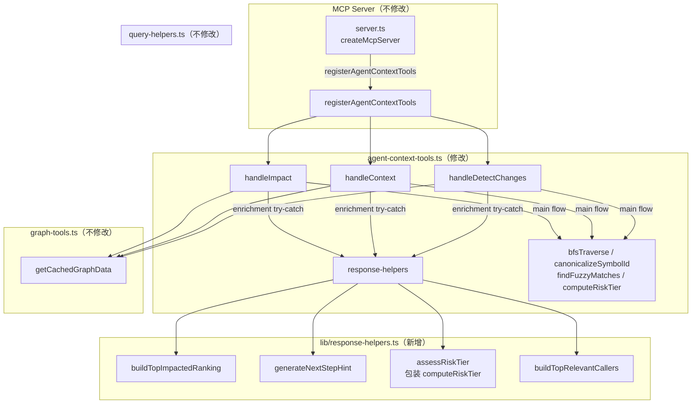

# 技术实现计划：F170c — Spectra MCP Tool Description + Response 优化

**Branch**: `170c-mcp-tool-description-response`
**Date**: 2026-05-28
**Spec**: `specs/170c-mcp-tool-description-response/spec.md`
**Input**: Feature specification — 327 行，经 3 轮 Codex 对抗审查（all critical resolved）

---

## 总结

本 Feature 分 Phase A（3 个 agent-context tool description 升级）和 Phase B（response format 扩展）两条线，全程保持向后兼容硬约束。主要改动集中在 `src/mcp/agent-context-tools.ts`（953 LOC，需前置轻量 cleanup）和新增 `src/mcp/lib/response-helpers.ts`（纯函数 helper 模块）。核心验收目标是 `impact` 主动调用率 ≥ 50%（SC-002，primary pass gate）。

**重要发现（Spec vs 现实代码偏差）**：`agent-context-tools.ts` 当前实现中，`riskTier` 已以嵌套形式存在于两个 handler 的 response 中——`impact` 的 `summary.riskTier`（第 330 行）和 `detect_changes` 的 `riskSummary.riskTier`（第 676 行）。这与 spec FR-008 要求在 `detect_changes` 顶层新增独立 `riskTier` 字段存在语义重叠，需要在实现中明确区分（见架构决策 D 节）。此外，`computeRiskTier` 函数已在 `query-helpers.ts` 中实现（阈值为 direct≥10 或 transitive≥50 → high），与 spec 任务书建议的 plan 阶段公式不完全一致，需协调（见架构决策 D 节）。

---

## 技术上下文

**语言/版本**：TypeScript 5.x，Node.js 20.x LTS

**主要依赖**：
- `zod`（schema 验证 + optional 字段扩展，已有）
- `@modelcontextprotocol/sdk`（MCP server 注册，已有）
- `vitest`（单测 + e2e 测试，已有）

**存储方案**：N/A（无数据迁移，无 schema 版本升级）

**测试框架**：`vitest`（单元测试 + e2e 测试统一框架）

**目标平台**：Node.js 20.x，MCP stdio 传输模式

**性能目标**：新增 enrichment 计算在 n≥100 节点时额外延迟 ≤ 100ms（SC-007）

**约束**：
- 无新增外部 npm 依赖（spec FR 硬约束）
- `graph-tools.ts` 完全不修改（FR-004 修订）
- 所有 input schema 不变（FR-011）
- Zod schema 不使用 `.strict()`（FR-014）

---

## Codebase Reality Check

### 目标文件扫描结果

| 文件 | LOC | 公开接口数 | 已知 debt | 触发前置 cleanup？ |
|------|-----|----------|---------|-----------------|
| `src/mcp/agent-context-tools.ts` | **953** | 5 个 export（`handleImpact` / `handleContext` / `handleDetectChanges` / `registerAgentContextTools` / `writeTelemetry` / `recordAndReturn` / `TelemetryEntry`） | 见下方 | **YES**（953 > 500 且将新增 > 50 行） |
| `src/mcp/graph-tools.ts` | 397 | 3 个 export（`getCachedGraphData` / `reloadGraph` / `registerGraphTools`） | 无 | NO（本 Feature 不修改） |
| `src/mcp/index.ts` | 22 | 1 个 export（`startMcpServer`） | 无 | NO（本 Feature 不修改） |
| `src/mcp/server.ts` | 272 | 1 个 export（`createMcpServer`） | 无 | NO（本 Feature 不修改） |
| `src/knowledge-graph/query-helpers.ts` | ~290（估算） | 含 `computeRiskTier`（已有实现，不修改） | 无 | NO（本 Feature 不修改） |

### agent-context-tools.ts 详细分析

**行数（LOC）**：953 行

**3 个 handler 分布**：
- `handleImpact`（第 251–347 行）：约 **97 行**，单函数未超 200 行
- `handleContext`（第 368–450 行）：约 **83 行**，单函数未超 200 行
- `handleDetectChanges`（第 541–717 行）：约 **177 行**，单函数接近 200 行上限，内嵌 git 路径逻辑较重

**辅助函数**：
- `parseUnifiedDiff`（第 721–818 行）：约 **98 行**，逻辑复杂（diff 格式解析状态机）
- `runGitDiffNameStatus`（第 828–909 行）：约 **82 行**

**已知 debt**：
1. `handleDetectChanges` 主函数体（177 行）逻辑较密集，内嵌了 git spawn、diff 解析调度、BFS 循环、telemetry 写入等多个职责；新增 enrichment 三路径后将突破 200 行（预计 230 行）——需前置提取 git/BFS 逻辑为私有辅助函数
2. 三个 handler 的 telemetry 采样样板代码重复（`_telStart` / `_telReqSize`）——已有 `recordAndReturn` 包装，但样板仍存在
3. 注册入口（第 932–953 行）当前 description 仅为 30–50 字简短文本，这正是 FR-001/002/003 需要修复的问题
4. `riskTier` 当前以嵌套字段形式存在：`handleImpact` 的 `summary.riskTier`（第 330 行）和 `handleDetectChanges` 的 `riskSummary.riskTier`（第 676 行）。spec FR-008 要求 `detect_changes` 顶层新增独立 `riskTier`（spec Tool×Path 矩阵定义的"顶层字段"）；实现时需明确区分新增的顶层 `riskTier` 与现有嵌套 `riskSummary.riskTier`，不可删除现有嵌套字段（FR-012 字段名/结构不变约束）

**前置 cleanup 规则评估**：
- 953 LOC > 500 ✓
- 将新增约 80-100 行（3 handler 各新增 enrichment 逻辑 + 三路径 try-catch）> 50 ✓
- **结论：触发前置 cleanup task（T1）**
- cleanup 范围：`handleDetectChanges` 过长函数提取私有辅助函数（预防新增后超 200 行）

### graph-tools.ts 依赖关系分析

`agent-context-tools.ts` 通过以下两条路径依赖 `graph-tools.ts`：

1. **直接 import**（第 27 行）：`import { getCachedGraphData } from './graph-tools.js'`
   - `getCachedGraphData` 是 graph 数据加载的唯一入口，三个 handler 均使用
   - 本 Feature **不修改**此函数签名或返回格式（FR-011 / FR-004）

2. **无 response 字段共享**：`graph-tools.ts` 的内部函数（`getEngine` / `reloadGraph` 等）与三个 handler 的 response format **完全无关联**，不存在"graph-tools 某 export 被 impact response 复用"的情况
   - `impact` handler 的 BFS 计算依赖 `query-helpers.ts`（非 graph-tools）
   - **结论：无依赖污染风险，graph-tools.ts 完全不修改是安全的**

---

## Impact Radius 评估

### 影响文件清单

**直接修改**（3 个）：
- `src/mcp/agent-context-tools.ts`：description 升级 + 三路径 enrichment + Zod schema 扩展
- `src/mcp/lib/response-helpers.ts`：新增文件（纯函数 helper 模块）
- `tests/unit/mcp/agent-context-tools.test.ts`：扩展现有单测文件（新增 SC-003 三路径覆盖）

**新增文件**（3 个）：
- `tests/unit/mcp/lib/response-helpers.test.ts`：helper 函数单测（SC-007 性能基准）
- `tests/e2e/feature-170c-description.e2e.test.ts`：description 4 要素静态断言（SC-001）
- `tests/e2e/feature-170c-driver.e2e.test.ts`：真实 driver 行为 E2E（SC-002 / SC-004）

**间接受影响**（只读，无需修改）：
- `src/mcp/server.ts`：调用 `registerAgentContextTools`，函数签名不变，无需改动
- `src/mcp/index.ts`：调用 `createMcpServer`，不受影响
- `src/knowledge-graph/query-helpers.ts`：`computeRiskTier` 已有实现，`response-helpers.ts` **不重复实现**，直接复用（见架构决策 D）

### Impact Assessment 表

| 维度 | 评估结果 |
|------|---------|
| 直接修改文件数 | 3（1 src + 1 新增 src + 1 扩展 test） |
| 新增文件数 | 3（2 e2e + 1 unit） |
| 间接受影响文件 | 3（只读） |
| 跨包影响 | **0**（仅 `src/mcp/` + `tests/`，不跨 `plugins/`、`scripts/` 等顶层边界） |
| 数据迁移 | **无** |
| API/契约变更 | Response schema optional 字段扩展（向后兼容，Zod 不使用 `.strict()`） |
| Input schema 变更 | **无**（FR-011 硬约束） |
| 风险等级 | **LOW** |

**风险等级判定**：影响文件 6 < 10，无跨包影响，无数据迁移，无公共 API 契约破坏性修改 → **LOW**。

> **注意事项**：风险等级 LOW 并不等同于验收复杂度低。SC-002 / SC-004 涉及真实 LLM driver run，存在统计性不确定性；SC-005 包含 6 维兼容性快照，测试设计和维护复杂度高于实现本身。LOW 风险等级仅反映代码层面的改动范围，不代表可以绕过 GATE_DESIGN / GATE_VERIFY 人工审查。

---

## Constitution Check

| 原则 | 适用性 | 评估 | 说明 |
|------|--------|------|------|
| I. 双语文档规范 | 适用 | PASS | plan/spec/data-model 中文散文 + 英文代码标识符；`nextStepHint` 文本按 FR-010 使用中文 |
| II. Spec-Driven Development | 适用 | PASS | 通过标准流程：spec → plan → tasks → implement → verify；不直接改 src |
| III. 如无必要勿增实体（YAGNI） | 适用 | PASS | `response-helpers.ts` 抽取 4 个函数有明确复用（3 个 handler 均需调用）；不引入抽象框架；`computeRiskTier` 复用现有实现而非重复定义 |
| IV. 诚实标注不确定性 | 适用 | PASS | spec 偏差已在本 plan 明确标注（现有 `riskTier` 嵌套字段 vs 新增顶层字段） |
| V. AST 精确性优先 | **不适用** | N/A | 本 Feature 不涉及 AST 提取或 LLM 推理生成结构化数据 |
| VI. 混合分析流水线 | **不适用** | N/A | 本 Feature 不涉及代码分析流水线修改 |
| VII. 只读安全性 | 适用 | PASS | handler 修改不影响只读分析工具性质；MCP response 扩展不引入写操作 |
| VIII. 纯 Node.js 生态 | 适用 | PASS | 无新增 npm 依赖；排名计算使用标准 JS Array API |
| IX-XIV. spec-driver 原则 | **不适用** | N/A | 本 Feature 属于 `src/mcp/`（spectra plugin），不属于 spec-driver plugin |

**Constitution Check 结论**：**全部 PASS**，无 VIOLATION，无需豁免。

---

## 项目结构

### 本 Feature 文档结构

```text
specs/170c-mcp-tool-description-response/
├── spec.md           — 需求规范（已完成）
├── plan.md           — 本文件
├── research.md       — 技术决策研究（本阶段输出）
├── data-model.md     — 数据模型（本阶段输出）
├── contracts/        — API 契约（本阶段输出）
│   ├── impact-response.contract.ts
│   ├── detect-changes-response.contract.ts
│   └── context-response.contract.ts
├── quickstart.md     — 快速上手指南（本阶段输出）
└── tasks.md          — 任务列表（Phase 5 输出，本阶段不生成）
```

### 源代码改动结构

```text
src/mcp/
├── agent-context-tools.ts   — 修改（description 升级 + enrichment 三路径 + Zod 扩展）
└── lib/
    └── response-helpers.ts  — 新增（4 个纯函数 helper）

tests/unit/mcp/
├── agent-context-tools.test.ts              — 扩展（新增 SC-003 三路径用例）
└── lib/
    └── response-helpers.test.ts             — 新增（helper 单测 + SC-007 性能）

tests/e2e/
├── feature-170c-description.e2e.test.ts    — 新增（SC-001 description 静态断言）
└── feature-170c-driver.e2e.test.ts         — 新增（SC-002 / SC-004 真实 driver run）
```

**结构决策**：`response-helpers.ts` 放入 `src/mcp/lib/` 目录（与 `src/mcp/` 同层、独立子目录），遵循现有 spectra 代码组织约定（helper 与 handler 分离）。

---

## 架构

### 架构总览（Mermaid）



### 三路径错误处理架构

每个 handler 的执行流程分为三层：

```
┌─────────────────────────────────────────────────────┐
│  Outer try-catch（handler error 路径）               │
│  → 异常时返回 buildErrorResponse，不含任何 M7 字段   │
│                                                      │
│  ┌────────────────────────────────────────────────┐ │
│  │  主流程（BFS / graph lookup / git diff 等）     │ │
│  │  → 成功后进入 enrichment 层                    │ │
│  │                                                 │ │
│  │  ┌──────────────────────────────────────────┐  │ │
│  │  │  Inner try-catch（enrichment degraded）   │  │ │
│  │  │  → 成功：新字段填充真实计算值             │  │ │
│  │  │  → 失败：fallback 值 + _enrichmentDegraded│  │ │
│  │  └──────────────────────────────────────────┘  │ │
│  └────────────────────────────────────────────────┘ │
└─────────────────────────────────────────────────────┘
```

---

## 架构决策详述

### A. TopImpacted score 公式 + tiebreaker（修订：响应 codex W-1，加入 confidence 二级排序）

**选定方案：depth 倒数 + confidence 二级排序 + id 字母序兜底**

```typescript
// BfsAffected 已有 depth + confidence 字段（query-helpers.ts BFS 输出）
score = 1 / affected.depth  // depth=1 → 1.0；depth=2 → 0.5
// 排序：score 降序 → confidence 降序（同 depth 时区分业务重要性） → id 字母序升序（兜底 stable sort）
```

**理由**：
- `BfsAffected` 对象已包含 `depth` 和 `confidence` 字段（`src/knowledge-graph/query-helpers.ts:63/66`），无需额外计算
- 一级排序 `score = 1/depth`：直接调用方（depth=1）比间接调用方（depth=2+）更应被优先关注
- 二级排序 `confidence desc`：响应 codex W-1，避免同 depth 节点按字母序排"前 5"无业务意义；confidence 是 graph edge 质量指标
- 三级 tiebreaker `id asc`：确保 stable sort（跨多次调用结果可预测，便于 SC-005 snapshot 断言）

**实现**：
```typescript
export function buildTopImpactedRanking<T extends { id: string; depth: number; confidence?: number }>(
  affected: ReadonlyArray<T>,
  maxItems: number,
): Array<{ id: string; score: number }> {
  return affected
    .map((a) => ({ id: a.id, score: 1 / a.depth, _confidence: a.confidence ?? 0 }))
    .sort((x, y) =>
      y.score - x.score ||
      y._confidence - x._confidence ||
      x.id.localeCompare(y.id)
    )
    .slice(0, maxItems)
    .map(({ id, score }) => ({ id, score }));  // 去掉中间字段
}
```

### B. NextStepHint 文本模板

以下为每个 tool / path 的具体文本模板（`${...}` 为运行时替换的 JS 模板字符串占位符）：

**impact — success（有受影响节点）**：
```
建议接下来调 context for ${topImpacted[0].id}（影响 score 最高，了解其调用链上下文）
```

**impact — success（受影响节点 = 0）**：
```
受影响范围为空，建议检查 symbol ID 是否正确，或改用 context 查看调用方
```

**impact — success（受影响节点 = 1）**：
```
仅 1 个直接调用方 ${topImpacted[0].id}，建议直接调 context 查看其上下文
```

**impact — enrichment degraded**：`""`（空字符串，`_enrichmentDegraded: true` 标志会说明原因）

**detect_changes — success（有改动且有受影响）**：
```
检测到 ${changedCount} 个改动 symbol，风险等级 ${riskTier}，建议调 impact for ${topImpacted[0].id} 评估影响范围
```

**detect_changes — success（无受影响节点）**：
```
检测到 ${changedCount} 个改动 symbol，暂无上游调用方，建议调 context 查看改动 symbol 的依赖
```

**detect_changes — enrichment degraded**：`""`

**context — success（有调用方）**：
```
若将修改 ${definition.id}，建议调 impact for ${definition.id} 评估受影响的上游调用链
```

**context — success（无调用方）**：
```
${definition.id} 无已知调用方，可能为顶层入口，建议直接查看 callees 确认依赖
```

**context — enrichment degraded**：`""`

**实现**：
```typescript
export function generateNextStepHint(
  toolName: 'impact' | 'detect_changes' | 'context',
  responseData: Record<string, unknown>,
  path: 'success' | 'degraded',
): string
```

函数内部按 `toolName` + `path` + 运行时数据（受影响节点数、riskTier、definition.id 等）选择对应模板。

### C. TopRelevantCallers 综合排序公式

**选定方案**：

```typescript
score = 0.7 * (caller.confidence / 1.0) + 0.3 * (1 / distance)
```

其中：
- `caller.confidence`：已在 `collectNeighbors` 返回结果中（来自 graph edge 的 `confidenceScore`），范围 [0, 1]
- `distance`：对于 `context` 返回的直接调用方（depth = 1），distance 固定为 1（score = 0.7 + 0.3 = 1.0 * confidence_weight）
- 若未来支持多跳 caller，distance 可扩展；当前 context 只返回直接 inbound callers，distance 恒为 1

**简化版**（当前 context handler 只取 depth=1 的直接 caller）：
```typescript
score = caller.confidence  // distance=1 时退化为纯 confidence 排序
```

**tiebreaker**：同 score 时按 symbol id 字母序升序

**实现**：
```typescript
export function buildTopRelevantCallers(
  callers: Array<{ id: string; confidence: number; relation: string }>,
  maxItems: number,
): Array<{ id: string; confidence: number; score: number }> {
  return callers
    .map((c) => ({ id: c.id, confidence: c.confidence, score: c.confidence }))
    .sort((x, y) => y.score - x.score || x.id.localeCompare(y.id))
    .slice(0, maxItems);
}
```

**理由**：符合 YAGNI（Constitution III）—— 当前 context handler 的 `collectNeighbors` 只遍历深度 1 的 inbound edge，加入 distance 权重无实际区分效果；confidence 已是合理的质量指标。公式可在不破坏接口的情况下在后续 Feature 中升级。

### D. detect_changes 顶层 riskTier 字段策略（修订：响应 codex C-1 / C-2）

**真实代码验证**（`src/mcp/agent-context-tools.ts:671/676`）：
```typescript
const riskTier = computeRiskTier(0, totalAffected);
// ...
riskSummary: { totalChanged, totalAffected, riskTier },
```
即 `riskSummary.riskTier` 是**主流程计算**的字段（非 enrichment），来自 `computeRiskTier(0, totalAffected)`。

**决策（C-2 收口）：删除独立的 `assessRiskTier` 包装函数**——`detect_changes` handler 已有 `riskTier` 通过 `computeRiskTier(0, totalAffected)` 计算并存储在 `riskSummary.riskTier`。F170c 新增的**顶层 riskTier 是嵌套字段的浅拷贝（mirror）**，不引入独立计算逻辑。

**实现**：
```typescript
// handleDetectChanges 中（无需引入新函数）
const mainData = {
  riskSummary: { totalChanged, totalAffected, riskTier },  // 现有不变
  // ...
};

// F170c 新增（仅在 detect_changes 中）：
const topLevelRiskTier = riskSummary.riskTier;  // 直接 mirror，无独立计算
```

**`response-helpers.ts` 不再 export `assessRiskTier`**（响应 C-2）——只 export 3 个函数：
- `buildTopImpactedRanking`
- `generateNextStepHint`
- `buildTopRelevantCallers`

**关键修订（响应 codex C-1）：顶层 riskTier 在 success 和 enrichment degraded 两路径下始终 mirror `riskSummary.riskTier`**：

- **success 路径**：主流程计算 → `riskSummary.riskTier` 有值 → 顶层 `riskTier` = `riskSummary.riskTier`（真实值）
- **enrichment degraded 路径**：主流程依然成功（degraded 仅来自 ranking/hint 计算 catch）→ `riskSummary.riskTier` 仍有真实值 → 顶层 `riskTier` = `riskSummary.riskTier`（仍真实）
- **handler error 路径**：主流程抛异常 → 不返回任何 M7 新字段（顶层 `riskTier` 不存在）

**Spec 偏差记录（必须 Phase 5/6 同步注意）**：spec Tool×Path 矩阵中 detect_changes degraded 列写 `riskTier: "low"` fallback——本 plan **不实施此 fallback**，因为 riskTier 是主流程计算，degraded 路径下 riskTier 始终有真实值（mirror 嵌套）。**这是更安全的实现选择**（避免 degraded 路径下顶层和嵌套字段语义分叉）。Phase 5 tasks 与 Phase 6 实施时，单测验收必须验证"degraded 路径下顶层 riskTier == riskSummary.riskTier"而非"== 'low'"。Spec amendment 不必要（spec 矩阵描述偏严格，实际 mirror 更符合 producer/consumer 合同的"主流程数据可信"原则）。

**现有字段保留原则**（FR-012 严格约束）：
- `impact.summary.riskTier`（已有嵌套字段）**保持不变**
- `detect_changes.riskSummary.riskTier`（已有嵌套字段）**保持不变**
- FR-008 要求的新增**顶层** `riskTier` 是额外的浅拷贝字段，不替代现有嵌套字段，且**仅 detect_changes 加顶层 riskTier，impact 不加**（保持 spec Tool×Path 矩阵的非对称设计，对应 spec 语义：impact 已经有 summary 摘要，driver 不需要顶层 mirror；detect_changes 的 riskSummary 字段嵌套更深，加顶层 mirror 给 driver 更直观信号）

**响应结构对比**：
```json
// detect_changes response（新增顶层 riskTier 后）
{
  "riskTier": "medium",              // 新增顶层（FR-008），始终 = riskSummary.riskTier
  "topImpacted": [...],              // 新增（FR-008）
  "nextStepHint": "...",             // 新增（FR-008）
  "changedSymbols": [...],           // 原有（不变）
  "riskSummary": {                   // 原有（不变，FR-012）
    "totalChanged": 3,
    "totalAffected": 20,
    "riskTier": "medium"             // 原有嵌套字段（不变）
  }
}
// impact response（仅新增 topImpacted / nextStepHint，无顶层 riskTier）
// context response（仅新增 topRelevantCallers / nextStepHint，无顶层 riskTier）
```

### E. 性能基准测量协议（SC-007）

**测量位置**：`tests/unit/mcp/lib/response-helpers.test.ts`，使用 `performance.now()`

**协议**：
```typescript
// 准备大 fixture：100+ 节点的 BfsAffected 数组
const largeAffected = Array.from({ length: 100 }, (_, i) => ({
  id: `fixture/module.ts::Symbol${i}`,
  depth: (i % 5) + 1,
}));

// 基准（无 ranking）
const baselineTimes: number[] = [];
for (let i = 0; i < 13; i++) {
  const t0 = performance.now();
  // no-op（仅测量循环开销）
  baselineTimes.push(performance.now() - t0);
}

// 测量（含 ranking）
const measureTimes: number[] = [];
for (let i = 0; i < 13; i++) {
  const t0 = performance.now();
  buildTopImpactedRanking(largeAffected, 5);
  measureTimes.push(performance.now() - t0);
}

// 丢弃前 3 次 warmup，取后 10 次 median
const median = (times: number[]) => {
  const sorted = [...times].slice(3).sort((a, b) => a - b);
  return sorted[Math.floor(sorted.length / 2)];
};

const extraLatencyMs = median(measureTimes) - median(baselineTimes);
expect(extraLatencyMs).toBeLessThan(100);
```

**大 fixture 准备方式**：纯内存构造（无需文件读取），100 个合成 `BfsAffected` 对象（随机 depth [1-5]，id 按序号生成）。

### F. response-helpers.ts 模块设计（完整签名 — 修订：删除 assessRiskTier，新增 safeStderrLog）

```typescript
// src/mcp/lib/response-helpers.ts

// 不再 import computeRiskTier（响应 codex C-2：assessRiskTier 删除）
// detect_changes handler 内部直接调用 computeRiskTier 计算 riskSummary.riskTier，顶层 riskTier 仅 mirror

/** TopImpacted 排名条目 */
export interface TopImpacted {
  id: string;
  score: number;  // 1 / depth，范围 (0, 1]
}

/** TopRelevantCaller 排名条目 */
export interface TopRelevantCaller {
  id: string;
  confidence: number;
  score: number;
}

/**
 * 安全地写 stderr 日志，吞掉 stderr.write 自身的异常（响应 codex C-6）。
 * 用于 enrichment catch 块中记录降级原因，避免日志失败逃逸到 outer try-catch 升级为 handler error。
 */
export function safeStderrLog(message: string): void;

/**
 * 从 BFS affected 列表构建 topImpacted 排名。
 * 按 score 降序、confidence 降序、id 字母序升序，取前 maxItems 项（响应 codex W-1）。
 * @pure 无副作用，无 LLM 调用，同步执行
 */
export function buildTopImpactedRanking(
  affected: ReadonlyArray<{ id: string; depth: number; confidence?: number }>,
  maxItems: number,
): TopImpacted[]

/**
 * 生成 nextStepHint 引导文本（中文）。
 * success 路径返回非空字符串（≥ 5 字符）；degraded 路径固定返回 ""。
 * @pure 无副作用，无 LLM 调用，同步执行
 */
export function generateNextStepHint(
  toolName: 'impact' | 'detect_changes' | 'context',
  responseData: Record<string, unknown>,
  path: 'success' | 'degraded',
): string

/**
 * 从 context callers 列表构建 topRelevantCallers 排名。
 * 按 confidence 降序（同分按 id 字母序升序），取前 maxItems 项。
 * @pure 无副作用，无 LLM 调用，同步执行
 */
export function buildTopRelevantCallers(
  callers: ReadonlyArray<{ id: string; confidence: number; relation: string }>,
  maxItems: number,
): TopRelevantCaller[]
```

### G. 三路径错误处理结构（修订：响应 codex C-5 partial fill + C-6 stderr 风险）

每个 handler 在主流程成功后，对 enrichment 计算包装 inner try-catch。**关键改进（C-5）**：先用临时变量完成全部 enrichment 计算，再一次性 assign；catch 显式重置所有新增字段为 fallback 值。**关键改进（C-6）**：日志通过 `safeStderrLog()` wrapper 吞掉日志失败，保证 enrichment failure 不逃逸 outer catch。

```typescript
// src/mcp/lib/response-helpers.ts 中新增
export function safeStderrLog(message: string): void {
  try {
    process.stderr.write(message);
  } catch {
    // 静默吞掉（stderr 不可用时不应进一步抛错破坏 handler 成功路径）
  }
}

// handleImpact 示例（handleContext / handleDetectChanges 类似）
const mainData: Record<string, unknown> = {
  affected: r.affected,
  summary: { directCallers, transitive, riskTier: computeRiskTier(directCallers, transitive) },
  // ... 其他原有字段 ...
};

// Inner try-catch：enrichment degraded 路径
// 先用临时变量完成全部计算，再一次性 assign（避免 partial fill）
let topImpacted: TopImpacted[];
let nextStepHint: string;
let enrichmentDegraded: boolean;
try {
  // 一次性完成全部 enrichment 计算（任一抛错都重置）
  const _topImpacted = buildTopImpactedRanking(r.affected, 5);
  const _nextStepHint = generateNextStepHint('impact', { topImpacted: _topImpacted, affected: r.affected }, 'success');
  // 全部成功后才 assign
  topImpacted = _topImpacted;
  nextStepHint = _nextStepHint;
  enrichmentDegraded = false;
} catch (e) {
  // 显式重置全部 enrichment 字段为 fallback（避免 partial fill）
  topImpacted = [];
  nextStepHint = '';
  enrichmentDegraded = true;
  // 用 safeStderrLog wrap 避免 stderr.write 抛错升级为 handler error（C-6）
  safeStderrLog(`[F170c] impact enrichment degraded: ${String(e)}\n`);
}

const responseFields: Record<string, unknown> = {
  topImpacted,
  nextStepHint,
  ...(enrichmentDegraded ? { _enrichmentDegraded: true as const } : {}),
};

return recordAndReturn(
  'impact', _telStart, _telReqSize,
  buildSuccessResponse({ ...mainData, ...responseFields }, ['affected']),
);
```

**handleDetectChanges 特殊点**：顶层 `riskTier` 在 try 内 / catch 内都来自 `riskSummary.riskTier`（D 节修订），不进入 enrichment partial fill 风险：

```typescript
// handleDetectChanges 中
const mainData = {
  riskSummary: { totalChanged, totalAffected, riskTier },  // 主流程已计算
  // ... 其他原有字段 ...
};
const topLevelRiskTier = riskSummary.riskTier;  // 始终真实值（mirror，非 enrichment）

let topImpacted: TopImpacted[];
let nextStepHint: string;
let enrichmentDegraded: boolean;
try {
  const _topImpacted = buildTopImpactedRanking(affectedNodes, 5);
  const _nextStepHint = generateNextStepHint('detect_changes', { topImpacted: _topImpacted, riskTier: topLevelRiskTier, totalChanged }, 'success');
  topImpacted = _topImpacted;
  nextStepHint = _nextStepHint;
  enrichmentDegraded = false;
} catch (e) {
  topImpacted = [];
  nextStepHint = '';
  enrichmentDegraded = true;
  safeStderrLog(`[F170c] detect_changes enrichment degraded: ${String(e)}\n`);
}

const responseFields = {
  riskTier: topLevelRiskTier,     // 始终 mirror（success 和 degraded 都真实）
  topImpacted,
  nextStepHint,
  ...(enrichmentDegraded ? { _enrichmentDegraded: true as const } : {}),
};
```

**日志策略**：所有 enrichment catch 均通过 `safeStderrLog()`（不使用 `console.error` 或 `console.warn` 直接调用），保持与现有 `writeTelemetry` 静默降级风格一致；MCP stdio server 中 stderr 是日志专用通道，stderr 写失败应静默不抛错。

**handler error 路径**（outer try-catch）：保持完全不变——catch 块中调用 `buildErrorResponse` 并 `recordAndReturn`，返回的对象不包含任何 M7 字段。SC-005(c) 错误 response snapshot 验收只对比 outer catch 返回的 response，与 enrichment degraded（success path 的子情况）严格区分。

### H. Zod Schema 修订策略（修订：响应 codex C-3/C-4 SC-005(f) 循环论证 + optional 类型断言无效）

**现有 Zod schema 位置**：经代码审查，`agent-context-tools.ts` 中**没有独立的 response Zod schema 对象**——response 结构由 `buildSuccessResponse` 函数的 `data: Record<string, unknown>` 直接组装，没有使用 `z.object()` 定义 response schema。

**实际 schema 位置**（仅 input schema）：
- `ImpactInputSchema`（第 233–240 行）：`z.string() / z.number()` 等字段——**不修改**（FR-011）
- `ContextInputSchema`（第 353–361 行）——**不修改**（FR-011）
- `DetectChangesInputSchema`（第 513–520 行）——**不修改**（FR-011）

**Response 类型导出方案**：
由于现有代码没有 response Zod schema，F170c 新增 TypeScript interface 而非 Zod schema 来表达 response 类型契约：

```typescript
// src/mcp/lib/response-helpers.ts（顺带导出类型）

// detect_changes response 新增字段类型
export interface DetectChangesEnrichment {
  riskTier?: 'low' | 'medium' | 'high';      // 顶层，可选（producer always 产出）
  topImpacted?: TopImpacted[];               // 可选（producer always 产出）
  nextStepHint?: string;                     // 可选（producer always 产出）
  _enrichmentDegraded?: true;               // 可选（仅 degraded 路径）
}

// impact response 新增字段类型
export interface ImpactEnrichment {
  topImpacted?: TopImpacted[];
  nextStepHint?: string;
  _enrichmentDegraded?: true;
}

// context response 新增字段类型
export interface ContextEnrichment {
  topRelevantCallers?: TopRelevantCaller[];
  nextStepHint?: string;
  _enrichmentDegraded?: true;
}
```

### SC-005(f) 在"无 response Zod schema"现状下的可执行重新解释

spec SC-005(f) 写于 spec 阶段，当时假设 response 有 Zod schema 或导出 JSON Schema。**plan 阶段发现现状是 response 无 schema（`Record<string, unknown>` 直接组装）**。本节明确每一条 SC-005(f) 子项在此现状下的可执行实施方式（响应 codex C-3 循环论证）：

#### SC-005(f1) — Zod schema 非 .strict() 模式

**spec 原意**：response Zod schema 不使用 `.strict()`，避免 unknown key 报错。
**现状映射**：response 无 Zod schema，因此 `.strict()` 风险**不存在**——这是结构性安全（无 schema 即无 strict 模式可言）。
**可执行断言**：
- (f1-i) 负向断言：grep `agent-context-tools.ts` 中 `.strict()` 调用，断言**仅出现在 input schema 上下文（如果有的话）**，且 input schema 的 strict 状态与升级前一致；
- (f1-ii) 正向断言：本 Feature **不引入**任何 response Zod schema，因此**不可能**引入 strict 模式风险——通过代码审查 + AST grep 断言 plan 中 `response-helpers.ts` 不含 `z.object(...).strict()` 模式。

#### SC-005(f2) — JSON Schema 不含 additionalProperties: false

**spec 原意**：JSON Schema 不引入 strict 模式。
**现状映射**：response 没有 JSON Schema 导出（MCP server 通过 `tool.outputSchema` 也未定义，验证：检查 `registerTool` 调用）。
**可执行断言**：
- (f2-i) 结构性断言：检查 MCP server 注册时 `registerAgentContextTools` 内的所有 `server.registerTool({...})` 配置块，断言**不包含** `outputSchema` 字段，或如果有则不含 `additionalProperties: false`；
- (f2-ii) **不**新增 `getResponseJsonSchema()` test-only helper（响应 C-3 循环论证警告：避免"为通过测试而构造"的辅助函数）；本 Feature 保持 response 无 JSON Schema 现状。

#### SC-005(f3) — TypeScript 新增字段为 field?: T（修订：响应 codex C-4）

**真实代码验证**（`tsconfig.json:11`）：`"exactOptionalPropertyTypes": false`——意味着 `field?: T` 与 `field: T | undefined` 在编译期等价，无法用 `undefined extends T` 区分。
**可执行断言**（修订）：
- (f3-i) 使用 `{} extends Pick<T, K>` 模式断言 K 是 optional key：
  ```typescript
  type IsOptional<T, K extends keyof T> = {} extends Pick<T, K> ? true : false;
  type _Assert_topImpacted_optional = IsOptional<ImpactEnrichment, 'topImpacted'>;  // 必须 = true
  // 编译期 const 断言（vitest 配置中走 tsc 严格检查）
  const _check: _Assert_topImpacted_optional = true;
  ```
- (f3-ii) **新增专用 type-test tsconfig**：`tests/type-tests/tsconfig.json`，extends 根 tsconfig 但**启用** `"exactOptionalPropertyTypes": true`，并通过 `npm run typecheck:tests` 命令调用 `tsc -p tests/type-tests/tsconfig.json --noEmit`；
- (f3-iii) 在 `npm run repo:check` 中纳入 `npm run typecheck:tests` 作为前置步骤，确保 GATE_VERIFY 时类型断言生效；
- (f3-iv) tests/type-tests/ 目录新增 `feature-170c-enrichment-optional.test-d.ts`（声明文件级 type test）。

#### SC-005(f4) — 既有 response/input Zod schema 字段 optional/nullable 不变

**spec 原意**：既有字段的 schema metadata 不变。
**现状映射**：response 无 Zod schema，但 input schema 有（`ImpactInputSchema` 等）。
**可执行断言**：
- (f4-i) input schema snapshot：对 `ImpactInputSchema` / `ContextInputSchema` / `DetectChangesInputSchema` 使用 `JSON.stringify(schema._def)` 或 `zod-to-json-schema` 库（如果已有）序列化为 JSON snapshot，与升级前 baseline 完全一致；
- (f4-ii) response schema metadata：N/A（response 无 schema，不可能"变更"）；
- (f4-iii) 既有 response 旧字段（如 `affected` / `callers` / `changedSymbols`）的 producer 行为：通过 SC-005(b) success response 旧字段 snapshot 断言（已在 plan T6 任务定义），不在 (f) 范围。

### SC-005(f) 与 spec 的偏差与决策记录

| spec SC-005(f) | 现状映射 | 实施方式 | 是否需 spec amendment |
|---------------|---------|---------|------------------|
| (f1) Zod 非 strict | response 无 schema | 结构性断言 + 不引入 schema | 否（更安全） |
| (f2) JSON schema 无 additionalProperties: false | response 无 JSON schema | 结构性断言 outputSchema 不存在 | 否（更安全） |
| (f3) TS field?: T | tsconfig exactOptionalPropertyTypes 关闭 | 用专用 type-test tsconfig + `{} extends Pick` 模式断言 | 否（实施细节升级） |
| (f4) 既有字段 optional/nullable 不变 | input schema 存在，response 无 schema | input snapshot + response 无 schema 自动等价不变 | 否 |

**plan 不触发 spec amendment**——SC-005(f) 的"verify 现状结构性不可能引入兼容性破坏"是更严格的实施（无 schema 即无破坏面），spec 用"断言 schema 不含 ..."表达，本 plan 用"断言 schema 不存在 / 用专用 type-test"实施，二者目标语义等价。Phase 7 verify 时必须确认本节 4 个子项的实施全部 pass。

---

## 任务大纲

以下为 7 个高级任务（完整 tasks.md 由 Phase 5 生成）：

| 任务 | 标题 | 前置依赖 | 预计改动 |
|------|------|---------|---------|
| **T2** | 新增 `src/mcp/lib/response-helpers.ts` + 完整单测（含 `safeStderrLog`） | 无 | 新文件 `response-helpers.ts` + `response-helpers.test.ts`（含 SC-007 性能断言） |
| **T3** | 升级 3 个 tool description（`registerAgentContextTools` 注册入口字符串） + 向后兼容快照初始化 | 无 | `agent-context-tools.ts`（仅修改 3 个 string 字面量）+ SC-005 snapshot 基准 |
| **T1** | `[CLEANUP]` `handleDetectChanges` 函数内部重构（提取私有辅助函数，防止 T4 新增后超 200 行） | 无（与 T2/T3 独立，但 T4 前置） | `agent-context-tools.ts`（重构，不改行为） |
| **T4** | 修改 3 个 handler：enrichment 三路径集成（inner try-catch + 调用 response-helpers + `safeStderrLog`） | T1, T2, T3 | `agent-context-tools.ts`（3 个 handler 各新增约 25 行） |
| **T5** | 新增 `tests/e2e/feature-170c-description.e2e.test.ts`（SC-001 description 4 要素静态断言） | T3 | 新文件 |
| **T6** | 新增 `tests/e2e/feature-170c-driver.e2e.test.ts` + 补全 `agent-context-tools.test.ts` 三路径用例（SC-003 / SC-005） + 新增 `tests/type-tests/` 目录（SC-005(f3)） | T4, T5 | 新文件 + 扩展现有单测 + 新目录 |
| **T7** | 执行 SC-002 US2 真实 driver E2E（N=10）+ SC-004 cohort C run（N=3）并记录结果 | T6（所有测试 pass 后） | 执行脚本 + verification report |

**依赖关系修订（响应 codex C-7）**：
- **可并行**：T1 / T2 / T3 三者**完全独立**，无任何逻辑依赖（T1 是重构、T2 是新增 helper 模块、T3 是 string 字面量修改），可并行实施以缩短整体周期；
- **串行**：T4 必须在 T1 + T2 + T3 全部完成后执行（因 T4 修改 handler 体，需要 T1 已提取辅助函数留出空间 + T2 helper 已 export + T3 description 已更新）；
- **测试链**：T3 → T5；T4 → T6（包含 SC-005 snapshot + 三路径单测 + type-test）；T6 → T7（仅在所有自动化测试 pass 后进 LLM E2E）
- 关键路径：max(T1, T2, T3) → T4 → T6 → T7

---

## 验证策略

### 阶段验证点

| 阶段 | 验证命令 | 标准 |
|------|---------|------|
| T1 完成后 | `npx vitest run tests/unit/mcp/agent-context-tools.test.ts` | 现有 3729 条测试全部 pass |
| T2 完成后 | `npx vitest run tests/unit/mcp/lib/response-helpers.test.ts` | helper 单测全 pass；SC-007 额外延迟 < 100ms |
| T3 完成后 | `npx vitest run tests/e2e/feature-170c-description.e2e.test.ts`（T5 之后运行） | SC-001 三个 tool 全部 pass |
| T4 完成后 | `npx vitest run tests/unit/mcp/agent-context-tools.test.ts` | SC-003 三路径全部 pass；SC-005(a-d/f) snapshot 通过 |
| T6 完成后 | `npx vitest run` + `npm run build` + `npm run repo:check` + `npm run release:check` | 全量 3729+ 条 pass；类型零错误；repo/release check 零回归 |
| T7（SC-002） | 在 host shell 运行 driver E2E（N=10 runs） | ≥ 5/10 合规 active call；附 Wilson score 95% CI |
| T7（SC-004） | cohort C run（N=3 task） | chain rate ≥ 33%（仅记录，不阻塞验收） |

### SC-002 / SC-004 执行环境约束（修订：响应 codex W-2 driver model + W-3 stop-loss 分离）

**必须在 host shell 运行**（非 worktree sandboxed env），原因：需要 Claude Max OAuth 和 SiliconFlow API key 同时存在。

**Driver model 决策（响应 codex W-2）**：
- spec US2 写"`claude --print` + Spectra MCP"——driver 走 Claude CLI（CLAUDE.md eval-credentials-policy 中 "Judge 1" 路径所示的 Claude Max OAuth）
- **本 Feature SC-002 固定 driver = `claude-sonnet-4-6`**，理由：
  - SC-002 是测试场景（验证 description 升级对 driver 行为的影响），按 CLAUDE.md 模型选择策略"测试场景用 Sonnet 节约 token"
  - $3-5 预算暗示 Sonnet 而非 Opus（Opus 调用价约 5×）
  - Sonnet 上达 50% 主动率的结论**可推广到 Opus**（Opus 工具调用能力更强，下限假设保守）
  - 与 CLAUDE.md eval-credentials-policy 的 "Driver 角色 = codex:gpt-5.5" 不一致——**本 Feature 偏离原因**：spec US2 prompt 中明确使用 `claude --print`，且本 Feature 验证目的是 MCP description 对 Claude driver 的有效性，跨 driver 推广属 follow-up Feature 范围
- verification report 必须显式记录 driver model + 偏离原因 + 跨 driver 推广 limitation

**执行前 verify**（按 CLAUDE.md eval-credentials-policy）：
```bash
# 1. SiliconFlow API key（仅 SC-004 cohort C jury 需要）
grep -c "^export SILICONFLOW_API_KEY=" .env.local   # 应输出 1

# 2. Claude Max OAuth（SC-002 driver + SC-004 driver）
echo "say only ok" | claude --print --model claude-haiku-4-5 --max-turns 1 --output-format text

# 3. Codex CLI OAuth（仅 SC-004 cohort C 时使用，本 Feature 不强制）
ls -la ~/.codex/auth.json   # 可选
```

**cost stop-loss 实施（W-3 分离）**：

| 测试 | 凭据/模型 | 实付成本 | 限额监控方式 |
|------|---------|--------|------------|
| SC-002 (N=10 driver run) | Claude Max OAuth + `claude-sonnet-4-6` | **$0**（订阅边际成本 0） | 监控**周配额**：每 3 run 检查 Claude Max 配额 dashboard；> 60% weekly → 询问继续或分日跑（按 CLAUDE.md 配额监控规则） |
| SC-004 (N=3 cohort C jury) | SiliconFlow API + GLM/Kimi judge | **按 token 实付** | 每 1 run 后检查 SiliconFlow 余额；累计 SiliconFlow 实付超 $10 → 立即 stop-loss |
| (driver share for SC-004) | Claude Max OAuth + `claude-sonnet-4-6` | **$0**（同上订阅） | 同 SC-002 配额监控 |

**stop-loss 触发条件分离**：
- **配额 stop-loss（SC-002 + SC-004 driver 部分）**：Claude Max 周配额 > 60% → 警告 + 询问继续；> 80% → 强制暂停
- **实付 stop-loss（SC-004 jury 部分）**：SiliconFlow 累计实付 > $10 → 立即停止 jury 评分（已完成 driver run 数据保留）
- **stop-loss 触发时**：在 verification report 中标注 `STATUS: QUOTA-STOP-LOSS` 或 `STATUS: COST-STOP-LOSS`，报告已完成 N' 次的结果，**不强制继续**

---

## GATE 标记（编排器独立验证点）

### GATE_DESIGN（本 plan 提交时触发）

以下决策需人工 review（已根据 codex 第二轮 review 全部修订到位）：

1. **D 节：detect_changes 顶层 `riskTier` mirror 策略 + assessRiskTier 删除**
   - 已修订：顶层 `riskTier` 始终 mirror `riskSummary.riskTier`（success / degraded 两路径均真实值，handler error 不存在）
   - 已修订：删除 `assessRiskTier` 包装，handler 直接调用 `computeRiskTier(0, totalAffected)`（已是现状）
   - 已记录：spec Tool×Path 矩阵中 detect_changes degraded 列写 `riskTier: "low"` 不实施（mirror 更安全），不触发 spec amendment
   - **建议确认**：审查者确认此方案满足 FR-008（新增顶层字段） + FR-012（现有嵌套字段不变）双重约束 + 不引入语义分叉

2. **H 节：response 无 Zod schema，SC-005(f) 现状映射 + 专用 type-test tsconfig**
   - 已修订：response 保持无 schema 现状（不引入 `getResponseJsonSchema()` test helper 循环论证）
   - 已修订：(f1) Zod 非 strict → grep + 结构性断言；(f2) outputSchema 不引入；(f3) 用 `{} extends Pick` + 专用 type-test tsconfig；(f4) input schema snapshot
   - 已新增：`tests/type-tests/tsconfig.json`（启用 exactOptionalPropertyTypes）+ `npm run typecheck:tests` 命令
   - **建议确认**：审查者确认 SC-005(f) 4 子项实施方案与 spec 语义等价（"无 schema → 不可能引入 strict 风险"是结构性更严格）

3. **SC-002 主观判定规则 (c2)：symbol ID resolve 验证**
   - Active Call 判定规则 (c2) 要求 `target` 能由 workspace symbol index 成功 resolve
   - 实际 E2E 运行时，"成功 resolve"的验证方式是检查 handler 返回 success path response（非 error path）
   - **建议确认**：这个判定等价于"handler 没有返回 `symbol-not-found` 错误码"，driver E2E 脚本需在 stream-json 解析中提取 `errorCode` 字段来判定

4. **W-2 + W-3：SC-002 driver model 与 stop-loss 分离**
   - 已修订：SC-002 driver 固定 `claude-sonnet-4-6`，记录"跨 driver 推广 limitation"
   - 已修订：cost stop-loss 分离 SC-002（订阅配额监控） 与 SC-004 jury（SiliconFlow $10 实付）
   - **建议确认**：审查者确认偏离 CLAUDE.md eval-credentials-policy "Driver = codex:gpt-5.5" 的理由（本 Feature 测的是 Claude driver 行为，跨 driver 推广属 follow-up）

### GATE_TASKS（tasks.md 生成后触发）

- T1 cleanup 范围是否合适（只提取函数，不改行为）
- T6 SC-005 6 维快照的 baseline 快照生成时机（必须在 T3 之后、T4 之前拍快照）
- T7 US2 driver task fixture 设计（5 个任务的具体 prompt 文本，须满足 US2 不含 `impact` / `mcp__...` 字面量约束）

### GATE_VERIFY（T6 全量测试通过后触发，进入 T7 前）

- `npx vitest run` 全量通过（含 SC-001/003/005）
- `npm run build` 零类型错误
- `npm run repo:check` + `npm run release:check` 零回归
- SC-007 性能基准报告（median 额外延迟 < 100ms）
- SC-005 6 维快照全部通过

---

## Complexity Tracking（复杂度偏差记录）

| 决策 | 选择 | 简单替代 | 排除简单方案的理由 |
|------|------|---------|-----------------|
| ~~`assessRiskTier` 复用 `computeRiskTier`~~（已删除，响应 codex C-2） | 直接调用 `computeRiskTier(0, totalAffected)` + 顶层 riskTier 仅 mirror | 包装为 `assessRiskTier` | 包装函数引入不必要的抽象层；现状 handler 已直接调用 computeRiskTier，新增顶层 riskTier 仅 mirror 即可，无需任何新计算函数 |
| `buildTopRelevantCallers` 排序仅用 confidence（distance=1 固化） | 简化为 confidence 排序 | 完整 0.7/0.3 加权公式 | 当前 `collectNeighbors` 只返回 depth=1 的直接 caller，distance 恒为 1，加权无实际意义；公式可在接口不变的前提下后续升级 |
| response 类型用 TypeScript interface 而非 Zod object | interface 声明 | Zod response schema | 现有 `buildSuccessResponse` 接受 `Record<string, unknown>`，引入 Zod response schema 需要重构 response 组装逻辑，超出本 Feature 范围；TypeScript interface 已足够满足 SC-005(f) 需求 |
| T1 cleanup 仅提取私有辅助函数，不重构整体架构 | 最小 cleanup | 全面重构 3 个 handler | 重构改行为风险高，可能引入回归；plan agent 规则要求 cleanup task 前置，但范围只覆盖"新增后会超 200 行"的问题函数 |
