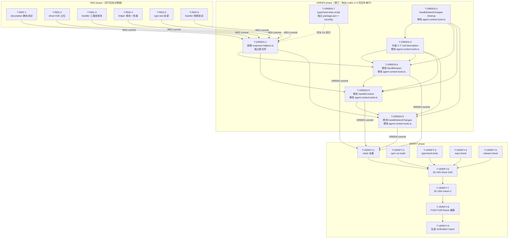

# 任务清单：F170c — Spectra MCP Tool Description + Response 优化

**Feature Branch**: `170c-mcp-tool-description-response`
**生成时间**: 2026-05-28
**依据**: `spec.md`（327 行，3 轮 Codex review）+ `plan.md`（862 行，1 轮 Codex review）
**状态**: 待实施

---

## 关键约束（实施前必读）

1. **每个 phase commit 前**必须跑 Codex 对抗审查（按 `CLAUDE.local.md`），再进入下一阶段
2. **TDD 严格顺序**：RED commit 必须在 GREEN commit 之前，不允许跳过 RED 直接实施
3. **RED commit message**：`test(170c): E2E test scaffolding — RED phase`
4. **GREEN commit message**：`feat(170c): tool description + response format upgrade — GREEN phase`
5. **REFACTOR commit message**（可选）：`refactor(170c): cleanup helper module + minor polish`
6. 所有 commit 必须含 `Co-Authored-By` trailer（`Co-Authored-By: Claude <noreply@anthropic.com>`）
7. **push 前**列 deliverable report 等用户确认（按 `CLAUDE.local.md` PUSH 约定）
8. `graph-tools.ts` 完全不修改（FR-004 硬约束）
9. 所有 input schema 不变（FR-011 硬约束）
10. Zod schema 不使用 `.strict()`（FR-014 硬约束）

---

## 依赖关系图



---

## Phase 1: RED（测试骨架 — 先写测试，全部 fail）

> **目标**：建立完整的测试骨架，跑 `npx vitest run` 确认全部 FAIL，证明测试存在且能检测实现缺失。
> **commit 后动作**：跑 Codex 对抗审查，再进入 GREEN phase。

### T-RED-1 — 新增 description 4 要素静态测试文件

- **依赖**：无
- **可并行**：[P]（与 T-RED-2 至 T-RED-6 完全独立）
- **预计时长**：30min

**改动文件**：
- 新增 `tests/e2e/feature-170c-description.e2e.test.ts`

**实施要点**：
- import `registerAgentContextTools`（或通过 MCP server 抽取已注册的 tool description）
- 对 `detect_changes` / `context` / `impact` 三个工具的 description 字符串执行静态断言
- **断言结构**（对应 SC-001 5 项硬约束）：
  - `(a)` description 长度 ∈ [100, 300]（`expect(desc.length).toBeGreaterThanOrEqual(100)`）
  - `(b)` 第一行长度 ≥ 10 字符（lead-in 存在性断言）
  - `(c)` 包含 `"Use this tool when"` 且枚举 ≥ 3 个 use-case 场景（可用换行数量断言）
  - `(d)` 包含 `"Example"` 段落
  - `(e)` 包含 `"Typical chained usage"` 段落，`impact` description 必含 `detect_changes → impact → context`
- 按工具维度独立报出哪个 description 哪个要素不达标（不用整体 pass/fail）
- 初始版本：直接断言当前 description 结构（当前 30-50 字，全部 fail 符合预期）

**验收标准**：
- 文件存在，`npx vitest run tests/e2e/feature-170c-description.e2e.test.ts` 报出 FAIL（非语法错误）
- 每个 tool 的每个要素各有独立 `it()` 断言（至少 3 × 5 = 15 个用例）
- 对应 SC-001 / FR-001 / FR-002 / FR-003 / FR-005

---

### T-RED-2 — 新增 driver E2E 占位文件

- **依赖**：无
- **可并行**：[P]
- **预计时长**：30min

**改动文件**：
- 新增 `tests/e2e/feature-170c-driver.e2e.test.ts`

**实施要点**：
- 为 SC-002（US2 driver active call N=10）和 SC-004（cohort C run N=3）建立测试文件骨架
- **初始版本**：所有 `it()` 用 `.skip` 标注，内含 TODO placeholder 和验证逻辑注释
- 文件中注释说明：
  - SC-002 判定规则 (a)-(d) 4 条全部
  - SC-004 Chained Call 合规规则 (a)-(d) 全部
  - driver model：`claude-sonnet-4-6`
  - stop-loss 触发条件
- 原因：这两个测试需要 host shell + Claude Max OAuth，不在自动 vitest 范围内，但文件需要存在以记录协议

**验收标准**：
- 文件存在，包含 `describe('SC-002', ...)` 和 `describe('SC-004', ...)` 结构
- 所有 `it()` 均带 `.skip`，`npx vitest run tests/e2e/feature-170c-driver.e2e.test.ts` 输出 0 failed / N skipped（不算 fail）
- 对应 SC-002 / SC-004 / US2 / US4

---

### T-RED-3 — 扩展 handler 三路径单测（9 个用例 + 字段矩阵断言）

- **依赖**：无
- **可并行**：[P]
- **预计时长**：1h

**改动文件**：
- 修改 `tests/unit/mcp/agent-context-tools.test.ts`

**实施要点**：
- 在现有测试文件末尾新增 `describe('F170c SC-003 三路径', ...)` 块
- 为 3 个 handler（`handleImpact` / `handleContext` / `handleDetectChanges`）× 3 路径（success / enrichment degraded / handler error）= **9 个 `it()` 用例**
- **success 路径断言**（对应 spec Tool×Path 矩阵）：
  - `impact`：`topImpacted` 长度 ≤ 5、首项 score 最高（降序）、`nextStepHint` 非空 ≥ 5 字符、`_enrichmentDegraded` 缺失
  - `detect_changes`：`riskTier` ∈ `['low','medium','high']` 且等于 `riskSummary.riskTier`（mirror 断言）、`topImpacted` ≤ 5、`nextStepHint` 非空 ≥ 5 字符、`riskSummary.riskTier` 仍存在（FR-012）
  - `context`：`topRelevantCallers` ≤ 3、`nextStepHint` 非空 ≥ 5 字符
- **enrichment degraded 路径断言**：`topImpacted: []`、`nextStepHint: ""`、`_enrichmentDegraded: true`，且原有旧字段完整；detect_changes 顶层 `riskTier` 仍等于 `riskSummary.riskTier`（不走 "low" fallback）
- **enrichment partial fill 失败注入断言**（响应 codex C-6，新增）：
  - `impact`：mock `buildTopImpactedRanking` 返回正常但 mock `generateNextStepHint` 抛错；断言 response 中 `topImpacted: []` 而非部分填充
  - `detect_changes`：mock ranking 正常 + hint 抛错；断言 `topImpacted: []` + `nextStepHint: ""` 全部 fallback + 顶层 riskTier 仍真实
  - `context`：mock ranking 正常 + hint 抛错；断言 `topRelevantCallers: []`、`nextStepHint: ""`
- **handler error 路径断言**（baseline 测试，非 RED 失败用例）：response 不含任何 M7 新字段（`topImpacted` / `nextStepHint` / `riskTier` / `topRelevantCallers` / `_enrichmentDegraded` 均不存在）。此 3 个用例在 RED 阶段**已经 pass**（因当前 handler 本就不返回新字段），是 baseline 不变性验证；GREEN 阶段必须保持 pass。

**RED 阶段精确 fail 用例划分（响应 codex C-3，修正"9 全 fail"假设）**：
- success 路径 × 3 handler = **3 用例** FAIL（GREEN 前新字段不存在）
- enrichment degraded 路径 × 3 handler = **3 用例** FAIL（GREEN 前 catch 不存在）
- partial fill 失败注入 × 3 handler = **3 用例** FAIL（同上）
- handler error 路径 × 3 handler = **3 用例** PASS（baseline 不变性，RED 阶段已成立）
- **共 12 用例**：9 FAIL + 3 PASS（baseline）

**验收标准**：
- 新增 12 个用例：9 用例 FAIL（success + degraded + partial fill）+ 3 用例 PASS（handler error baseline）
- 原有 3729 条测试仍 pass（未引入回归）
- 对应 SC-003 / SC-005(c) / FR-006 / FR-007 / FR-008 / FR-009 / FR-013

---

### T-RED-4 — 新增 response-helpers 单测文件（含 SC-007 性能断言）

- **依赖**：无
- **可并行**：[P]
- **预计时长**：1h

**改动文件**：
- 新增 `tests/unit/mcp/lib/response-helpers.test.ts`（如果 `tests/unit/mcp/lib/` 目录不存在则一并创建）

**实施要点**：
- `describe('buildTopImpactedRanking', ...)` 用例：
  - 空数组 → 返回 `[]`
  - 单节点 → 返回长度 1，score = 1/depth
  - 50 节点 → 返回长度 ≤ 5，首项 score 最高，同分按 confidence 降序、id 字母升序
  - maxItems = 5 截断验证
- `describe('generateNextStepHint', ...)` 用例（对应 plan B 节 9 个文本模板）：
  - `impact` × success（有节点 / 0 节点 / 1 节点）
  - `detect_changes` × success（有受影响 / 无受影响）
  - `context` × success（有调用方 / 无调用方）
  - 所有 degraded 路径返回 `""`
- `describe('buildTopRelevantCallers', ...)` 用例：
  - 空数组 → `[]`
  - 3+ caller → 返回 ≤ 3，按 confidence 降序
- `describe('safeStderrLog', ...)` 用例：
  - 正常调用不抛错
  - `process.stderr.write` mock 抛错时仍不抛出
- **SC-007 性能断言**（按 plan E 节协议）：
  - 构造 100 个合成 `BfsAffected` 对象（depth [1-5]，id 按序号生成）
  - warmup × 3 + measurement × 10，取 median
  - `expect(extraLatencyMs).toBeLessThan(100)`

**RED 阶段加载策略（响应 codex C-2，避免 import error 不算 RED）**：
- **不允许**测试文件因模块不存在导致整文件无法加载（这是 error 非 fail）
- 采用以下 stub 模式：
  - 先创建 `src/mcp/lib/response-helpers.ts` 占位文件，导出 4 个空 stub（参数签名正确，body 仅 `throw new Error('not implemented')`）
  - 这样测试文件可正常 import 并加载
  - 每个 `it()` 调用对应函数 → 抛 "not implemented" → 测试 fail 而非 error
  - GREEN T-GREEN-1 阶段实施真实逻辑

```typescript
// RED 阶段 src/mcp/lib/response-helpers.ts stub
export interface TopImpacted { id: string; score: number; }
export interface TopRelevantCaller { id: string; confidence: number; score: number; }
export function safeStderrLog(_msg: string): void { throw new Error('not implemented'); }
export function buildTopImpactedRanking(_a: ReadonlyArray<unknown>, _m: number): TopImpacted[] {
  throw new Error('not implemented');
}
export function generateNextStepHint(_t: string, _r: Record<string, unknown>, _p: string): string {
  throw new Error('not implemented');
}
export function buildTopRelevantCallers(_c: ReadonlyArray<unknown>, _m: number): TopRelevantCaller[] {
  throw new Error('not implemented');
}
```

**验收标准**：
- 文件存在，测试可加载（无 import error）；所有 `it()` 用例因调用 stub 函数抛 "not implemented" 而 FAIL（真实 assertion fail）
- 断言覆盖 4 个 export（`buildTopImpactedRanking` / `generateNextStepHint` / `buildTopRelevantCallers` / `safeStderrLog`）
- 对应 SC-007 / FR-015 / FR-016

---

### T-RED-5 — 新增 type-test 目录 + SC-005(f3) 类型测试文件

- **依赖**：无
- **可并行**：[P]
- **预计时长**：30min

**改动文件**：
- 新增 `tests/type-tests/tsconfig.json`
- 新增 `tests/type-tests/feature-170c-enrichment-optional.test-d.ts`

**实施要点**：

`tests/type-tests/tsconfig.json`（启用 `exactOptionalPropertyTypes`）：
```json
{
  "extends": "../../tsconfig.json",
  "compilerOptions": {
    "exactOptionalPropertyTypes": true,
    "noEmit": true
  },
  "include": ["./**/*.test-d.ts"]
}
```

`feature-170c-enrichment-optional.test-d.ts`（使用 `{} extends Pick<T, K>` 模式）：
```typescript
import type { ImpactEnrichment, DetectChangesEnrichment, ContextEnrichment, TopImpacted, TopRelevantCaller } from '../../src/mcp/lib/response-helpers.js';

// SC-005(f3)：断言新增字段为 field?: T（optional），而非 field: T | undefined
type IsOptional<T, K extends keyof T> = {} extends Pick<T, K> ? true : false;

// ImpactEnrichment 各字段
const _impact_topImpacted: IsOptional<ImpactEnrichment, 'topImpacted'> = true;
const _impact_nextStepHint: IsOptional<ImpactEnrichment, 'nextStepHint'> = true;
const _impact_degraded: IsOptional<ImpactEnrichment, '_enrichmentDegraded'> = true;

// DetectChangesEnrichment 各字段
const _dc_riskTier: IsOptional<DetectChangesEnrichment, 'riskTier'> = true;
const _dc_topImpacted: IsOptional<DetectChangesEnrichment, 'topImpacted'> = true;
const _dc_nextStepHint: IsOptional<DetectChangesEnrichment, 'nextStepHint'> = true;

// ContextEnrichment 各字段
const _ctx_callers: IsOptional<ContextEnrichment, 'topRelevantCallers'> = true;
const _ctx_nextStepHint: IsOptional<ContextEnrichment, 'nextStepHint'> = true;
```

- 初始版本：`response-helpers.ts` 不存在，`tsc -p tests/type-tests/tsconfig.json --noEmit` 报 import error → FAIL

**验收标准**：
- 两个文件存在
- 对应 SC-005(f3) / FR-014

---

### T-RED-6 — 新增 handler 快照测试（SC-005 (a)/(b)/(c)/(d)/(f1)/(f2)/(f4) 7 子项快照骨架）

- **依赖**：无
- **可并行**：[P]
- **预计时长**：1h

**改动文件**：
- 新增 `tests/unit/mcp/agent-context-tools-snapshots.test.ts`

**实施要点（响应 codex C-1：禁用 toMatchSnapshot + 禁用 .skip，统一用硬编码 toEqual / inline）**：
- `describe('SC-005(a) input schema snapshot', ...)` — 对 `ImpactInputSchema` / `ContextInputSchema` / `DetectChangesInputSchema` 序列化为 JSON 用 `toEqual()` 与**手写硬编码** baseline 比较（不用 `toMatchSnapshot` 避免自动生成稀释 RED）
- `describe('SC-005(b) success response 旧字段 snapshot', ...)` — 对每个 handler 的 success response 抽取旧字段用 `toEqual()` 与硬编码 baseline 比较
- `describe('SC-005(c) error response snapshot', ...)` — 对每个 handler 的 handler error response 整体用 `toEqual()` 与硬编码 baseline 比较（RED 阶段 baseline 已是当前真实 error response，会 PASS——这是 baseline 不变性验证，不需 FAIL）
- `describe('SC-005(d) strict parser regression fixture', ...)` — 构造一份 `z.object({ ...impactResponseOldFields }).strict()` fixture；断言 GREEN 后的 response 在 lenient mode（去掉 strict）下 `safeParse(response).success === true`，在 strict mode 下 `safeParse(response).success === false`（预期破坏，作为兼容性边界文档）
- `describe('SC-005(f1) Zod 非 strict 模式断言', ...)` — 用 fs.readFile + 文本断言（不是 grep CLI）确认 `agent-context-tools.ts` 中所有 `z.object(...)` 调用链不含 `.strict()`
- `describe('SC-005(f2) outputSchema 不含 additionalProperties: false', ...)` — 断言 `registerAgentContextTools` 内 `server.registerTool` 配置不含 `outputSchema` 字段
- `describe('SC-005(f4) input schema optional/nullable 不变', ...)` — 同 SC-005(a) 的 schema metadata 用 `toEqual()` 硬编码 baseline 比较
- 初始版本：**所有用例**写为完整 `toEqual()` 断言（baseline 直接 inline）。RED 阶段：(b) / (d) 因 GREEN 字段未到位会 FAIL；(a) / (c) / (f1) / (f2) / (f4) 因这些路径在 RED 阶段已成立会 PASS（baseline 不变性）
- **禁止 `.skip` 任何用例**（响应 codex C-1）；**禁止 `toMatchSnapshot()` 自动生成**

**RED 阶段精确 fail 用例划分**：
- (a) input schema baseline: PASS（baseline 即当前）
- (b) success response 旧字段 baseline: PASS（baseline 即当前 success response 旧字段集）
- (c) error response baseline: PASS（baseline 即当前 error response）
- (d) strict parser regression: FAIL（GREEN 前新字段不存在，strict mode 断言尚未引入；GREEN 后 lenient pass / strict fail）
- (f1) `.strict()` 缺席: PASS（当前确实不含）
- (f2) outputSchema 缺席: PASS（当前确实不含）
- (f4) input schema baseline: PASS（baseline 即当前）

**验收标准**：
- 文件存在，包含 7 个 `describe` 块（SC-005(a)/(b)/(c)/(d)/(f1)/(f2)/(f4) 七子项；SC-005(e) 在 T-VERIFY-8 用真实 fixture 执行，SC-005(f3) 在 T-RED-5 用专用 type-test tsconfig 执行）
- `npx vitest run tests/unit/mcp/agent-context-tools-snapshots.test.ts` 中 **1 个用例 FAIL（(d) strict parser regression）+ 6 个用例 PASS（baseline 不变性）**——**禁止 SKIP**
- 任一 baseline PASS 用例在 GREEN 后必须仍 PASS（不变性验证），(d) 在 GREEN 后从 FAIL 翻 PASS
- 对应 SC-005(a)-(d)/(f1)/(f2)/(f4) / FR-011 / FR-012 / FR-014

---

### RED phase 验收门控

在提交 RED commit 之前：
- [ ] 跑 `npx vitest run`，确认新增用例全部 FAIL（不是语法错误，是断言失败）
- [ ] 原有 3729 条测试仍 pass（RED 测试不破坏原有测试）
- [ ] 跑 Codex 对抗审查（重点：测试覆盖完整性、断言逻辑是否能真正检测实现缺失）
- [ ] commit：`test(170c): E2E test scaffolding — RED phase`

---

## Phase 2: GREEN（实现使测试通过）

> **目标**：实施 Phase A（description 升级）和 Phase B（response format 扩展），使 RED phase 所有测试 pass。
> **commit 后动作**：跑 Codex 对抗审查，再进入 VERIFY phase。

### T-GREEN-1 — 新增 `src/mcp/lib/response-helpers.ts`（纯函数 helper 模块）

- **依赖**：无（与 T-GREEN-2、T-GREEN-3 完全独立）
- **可并行**：[P]
- **预计时长**：1h

**改动文件**：
- 新增 `src/mcp/lib/response-helpers.ts`（如果 `src/mcp/lib/` 目录不存在则一并创建）

**实施要点**（按 plan F 节完整签名）：

1. **类型导出**：`TopImpacted` / `TopRelevantCaller` / `ImpactEnrichment` / `DetectChangesEnrichment` / `ContextEnrichment` interface（全部字段 optional，`_enrichmentDegraded?: true`）

2. **`safeStderrLog(message: string): void`**：
   ```typescript
   export function safeStderrLog(message: string): void {
     try { process.stderr.write(message); } catch { /* 静默吞掉 */ }
   }
   ```

3. **`buildTopImpactedRanking`**（按 plan A 节算法）：
   - 按 `score = 1 / depth` 降序 → `confidence` 降序 → `id` 字母升序
   - 取前 `maxItems`（= 5）项
   - 返回 `Array<{ id: string; score: number }>`（去掉 `_confidence` 内部字段）

4. **`generateNextStepHint`**（按 plan B 节 9 个文本模板）：
   - `toolName: 'impact' | 'detect_changes' | 'context'`
   - `responseData: Record<string, unknown>`
   - `path: 'success' | 'degraded'`
   - degraded 路径始终返回 `""`
   - success 路径按 toolName + 运行时数据选择模板

5. **`buildTopRelevantCallers`**（按 plan C 节简化公式）：
   - `score = caller.confidence`（distance=1 退化为纯 confidence 排序）
   - 按 score 降序 → id 字母升序
   - 取前 `maxItems`（= 3）项

**验收标准**：
- `npx vitest run tests/unit/mcp/lib/response-helpers.test.ts` 全部 pass（T-RED-4 的单测全部变绿）
- SC-007 性能断言：额外延迟 < 100ms
- 导出的 interface 全部字段为 `field?: T` 形式
- 对应 FR-015 / FR-016 / SC-007

---

### T-GREEN-2 — `handleDetectChanges` 前置 cleanup（提取私有辅助函数）

- **依赖**：无逻辑依赖
- **可并行**：⚠️ **不可与 T-GREEN-3/4/5/6 并行**（同文件 `agent-context-tools.ts` 修改会冲突）。可与 T-GREEN-1（新文件）+ T-GREEN-7（不同文件）并行
- **执行顺序**：建议在 T-GREEN-3 之前（cleanup 完成后再改 description 字符串）
- **预计时长**：1h

**改动文件**：
- 修改 `src/mcp/agent-context-tools.ts`（重构，不改行为）

**实施要点**（按 plan T1 cleanup 范围）：
- 目标：`handleDetectChanges`（当前 ~177 行）在 T-GREEN-6 新增 enrichment 后不超过 200 行
- 提取策略：将 `handleDetectChanges` 内部的 **git spawn + diff 解析调度**逻辑提取为私有辅助函数（如 `_runAndParseDiff(args)` 或类似命名）
- **严格约束**：
  - 不改变任何外部行为（函数签名、返回值、调用方式完全不变）
  - 不修改 `handleImpact` / `handleContext`（cleanup 范围仅限 `handleDetectChanges`）
  - 提取后 `handleDetectChanges` 函数体 ≤ 150 行（为 T-GREEN-6 预留 ~50 行空间）
- 提取后立即验证：`npx vitest run tests/unit/mcp/agent-context-tools.test.ts` 原有测试全部 pass

**验收标准**：
- `npx vitest run tests/unit/mcp/agent-context-tools.test.ts` 全部原有测试 pass（行为不变）
- `handleDetectChanges` 函数体 ≤ 150 行
- 新增私有辅助函数命名语义清晰（非 `_helper1` 等模糊命名）
- 对应 plan T1 cleanup 规则

---

### T-GREEN-3 — 升级 3 个 tool description（registerAgentContextTools 注册入口）

- **依赖**：T-GREEN-2 完成（避免同文件冲突）
- **可并行**：⚠️ **不可与 T-GREEN-2/4/5/6 并行**（同文件 `agent-context-tools.ts` 修改会冲突）。可与 T-GREEN-1 + T-GREEN-7 并行
- **执行顺序**：T-GREEN-2 → T-GREEN-3
- **预计时长**：1h

**改动文件**：
- 修改 `src/mcp/agent-context-tools.ts`（仅修改第 932-953 行附近 3 个 `server.tool` 调用的 description 字符串参数）

**实施要点**（按 plan B 节 4 要素模板 + SC-001 硬约束）：

每个 description 必须满足（对应 SC-001 5 项）：
- `(a)` 总长度 100-300 字符（英文字母）
- `(b)` 第一行为 lead-in 核心功能描述（≥ 10 字符）
- `(c)` 含 `"Use this tool when"` 段，列举 ≥ 3 个 use-case
- `(d)` 含 `"Example"` 段，含 input/output 示例
- `(e)` 含 `"Typical chained usage"` 段，`impact` 必含 `detect_changes → impact → context`

**注意**：description 文本使用英文（MCP tool description 面向 LLM driver，英文更通用；中文文档要求是文档注释层面，不影响 tool description 内容）。

修改位置（按 quickstart.md 指示）：
```
// 第 935 行附近：impact tool description
// 第 941 行附近：context tool description  
// 第 947 行附近：detect_changes tool description
```

**验收标准**：
- `npx vitest run tests/e2e/feature-170c-description.e2e.test.ts` 全部 pass（T-RED-1 的 15 个用例全部变绿）
- description 字符长度均在 [100, 300] 区间
- 对应 FR-001 / FR-002 / FR-003 / FR-005 / SC-001

---

### T-GREEN-4 — 修改 `handleImpact`（enrichment 三路径集成）

- **依赖**：T-GREEN-1（`response-helpers.ts` 已存在）、T-GREEN-2（cleanup 已完成）、T-GREEN-3（description 已升级）
- **可并行**：⚠️ **不可与 T-GREEN-5/6 并行**（都修改 `agent-context-tools.ts` 的不同 handler，但同文件 import 区域和 telemetry 公用区会冲突）
- **执行顺序**：T-GREEN-3 → T-GREEN-4 → T-GREEN-5 → T-GREEN-6（严格串行）
- **预计时长**：1h

**改动文件**：
- 修改 `src/mcp/agent-context-tools.ts`（`handleImpact` 函数段，第 251-347 行附近）

**实施要点**（按 plan G 节代码模式）：
1. import `buildTopImpactedRanking`, `generateNextStepHint`, `safeStderrLog`, `TopImpacted` from `./lib/response-helpers.js`
2. 在主流程成功后（`buildSuccessResponse` 调用之前）新增 inner try-catch：
   ```typescript
   let topImpacted: TopImpacted[];
   let nextStepHint: string;
   let enrichmentDegraded: boolean;
   try {
     const _topImpacted = buildTopImpactedRanking(r.affected, 5);
     const _nextStepHint = generateNextStepHint('impact', { topImpacted: _topImpacted, affected: r.affected }, 'success');
     topImpacted = _topImpacted;
     nextStepHint = _nextStepHint;
     enrichmentDegraded = false;
   } catch (e) {
     topImpacted = [];
     nextStepHint = '';
     enrichmentDegraded = true;
     safeStderrLog(`[F170c] impact enrichment degraded: ${String(e)}\n`);
   }
   ```
3. 将 `topImpacted`、`nextStepHint`、可选 `_enrichmentDegraded` 合入 response data
4. **handler error 路径（outer try-catch）保持不变**：catch 块不修改，error response 不含 M7 字段

**关键约束**：
- `handleImpact` response 不新增顶层 `riskTier`（仅 `detect_changes` 加，参见 plan D 节非对称设计）
- 函数体新增后不超过 200 行（当前 ~97 行，新增 ~25 行，余量充足）

**验收标准**：
- T-RED-3 中 `handleImpact` 的 3 个路径用例全部变绿
- T-RED-6 中 impact 相关快照通过
- 原有测试无回归
- 对应 FR-006 / FR-007 / FR-013 / SC-003

---

### T-GREEN-5 — 修改 `handleContext`（enrichment 三路径集成）

- **依赖**：T-GREEN-1、T-GREEN-2、T-GREEN-3、T-GREEN-4（同文件串行，避免 import / telemetry 区域冲突）
- **可并行**：⚠️ **不可与 T-GREEN-4/6 并行**（响应 codex C-4：同文件 import 区域和 helper 引用同步必须串行 commit）
- **预计时长**：1h

**改动文件**：
- 修改 `src/mcp/agent-context-tools.ts`（`handleContext` 函数段，第 368-450 行附近）

**实施要点**（按 plan G 节，context 变体）：
1. 在主流程成功后新增 inner try-catch
2. 使用 `buildTopRelevantCallers(callers, 3)` 计算 `topRelevantCallers`
3. 使用 `generateNextStepHint('context', { definition, callers }, 'success')` 计算 `nextStepHint`
4. enrichment degraded 路径：`topRelevantCallers: []`、`nextStepHint: ""`、`_enrichmentDegraded: true`
5. **`context` response 不新增 `riskTier` 或 `topImpacted`**（字段所有权约束，参见 data-model.md）

**验收标准**：
- T-RED-3 中 `handleContext` 的 3 个路径用例全部变绿
- 对应 FR-009 / FR-013 / SC-003

---

### T-GREEN-6 — 修改 `handleDetectChanges`（enrichment 三路径集成 + 顶层 riskTier mirror）

- **依赖**：T-GREEN-1、T-GREEN-2（cleanup 后函数体有余量）、T-GREEN-3、T-GREEN-4、T-GREEN-5（同文件串行）
- **可并行**：⚠️ **不可与 T-GREEN-4/5 并行**（响应 codex C-4：同文件串行）
- **预计时长**：1.5h（含顶层 riskTier mirror 实施 + spec 偏差注释）

**改动文件**：
- 修改 `src/mcp/agent-context-tools.ts`（`handleDetectChanges` 函数段，第 541-717 行附近，cleanup 后已缩短）

**实施要点**（按 plan D 节 + G 节 detect_changes 特殊点）：
1. 在主流程计算完 `riskSummary.riskTier` 之后，新增 `topLevelRiskTier = riskSummary.riskTier`（mirror，不独立计算）
2. inner try-catch 包裹 `buildTopImpactedRanking` + `generateNextStepHint` 计算
3. enrichment degraded 路径：
   - `topImpacted: []`、`nextStepHint: ""`、`_enrichmentDegraded: true`
   - `riskTier = topLevelRiskTier`（**不**用 "low" fallback，仍 mirror 真实值）
4. 合入 response：`riskTier: topLevelRiskTier, topImpacted, nextStepHint, ...(enrichmentDegraded ? { _enrichmentDegraded: true } : {})`
5. **现有字段保留**（FR-012）：`riskSummary.riskTier`（嵌套字段）完全不改，新增顶层 `riskTier` 是额外字段

**验收标准**：
- T-RED-3 中 `handleDetectChanges` 的 3 个路径用例全部变绿
- success 路径：顶层 `riskTier` === `riskSummary.riskTier`（非 "low" fallback）
- enrichment degraded 路径：顶层 `riskTier` 仍 === `riskSummary.riskTier`（mirror 真实值）
- `handleDetectChanges` 函数体不超过 200 行
- 对应 FR-008 / FR-013 / SC-003

---

### T-GREEN-7 — 新增 `npm run typecheck:tests` script + 纳入 `npm run repo:check`

- **依赖**：T-RED-5（type-test 目录已存在）
- **可并行**：[P]（可与 T-GREEN-1 同时做）
- **预计时长**：30min

**改动文件**：
- 修改 `package.json`（新增 `typecheck:tests` script）
- 修改 `package.json` 或 `scripts/repo-check.sh`（将 `typecheck:tests` 纳入 `repo:check` 调用链）

**实施要点**：
1. 在 `package.json` `scripts` 中新增：
   ```json
   "typecheck:tests": "tsc -p tests/type-tests/tsconfig.json --noEmit"
   ```
2. 在 `repo:check`（`npm run repo:check`）调用链中，前置执行 `npm run typecheck:tests`
   - 如果 `repo:check` 是 shell 脚本，在第一行增加 `npm run typecheck:tests`
   - 如果是 `package.json` 的 `&&` 链，前置加入
3. GREEN 完成后，`npm run typecheck:tests` 应通过（T-RED-5 的类型断言全部满足）

**验收标准**：
- `npm run typecheck:tests` 命令存在且在 GREEN 后可执行
- `npm run repo:check` 会调用 `typecheck:tests`
- 对应 SC-005(f3) / FR-014

---

### GREEN phase 验收门控

在提交 GREEN commit 之前：
- [ ] `npx vitest run` 全量测试全部 pass（含 T-RED-1/3/4/6 的新增用例）
- [ ] `npm run build` 零类型错误
- [ ] `npm run typecheck:tests` 零错误（SC-005(f3) type assertions 通过）
- [ ] `handleDetectChanges` 函数体 ≤ 200 行
- [ ] `src/mcp/graph-tools.ts` 未被修改（git diff 确认）
- [ ] 跑 Codex 对抗审查（重点：三路径逻辑正确性、字段所有权未被污染、enrichment degraded 路径的 partial fill 防御、safeStderrLog 有效性）
- [ ] commit：`feat(170c): tool description + response format upgrade — GREEN phase`

---

## Phase 3: REFACTOR（可选，仅当 GREEN 后有必要）

### T-REFACTOR-1 — helper 模块进一步优化（仅按需执行）

- **依赖**：GREEN phase 全部完成
- **触发条件**（按 plan Complexity Tracking）：GREEN 后发现以下任一情况
  - `response-helpers.ts` 单个函数超过 50 行
  - `generateNextStepHint` 内部 if-else 链过长，可用 map/strategy 模式简化
  - 测试文件存在冗余 mock 可提取为 fixture
- **预计时长**：30min（如触发）

**改动文件**：
- 可能修改 `src/mcp/lib/response-helpers.ts`
- 可能修改 `tests/unit/mcp/lib/response-helpers.test.ts`

**约束**：REFACTOR commit 不改变任何外部行为，全量测试在 REFACTOR 前后均 pass。

**验收标准**：`npx vitest run` 全量 pass，`npm run build` 零错误。

---

## Phase 4: VERIFY（所有 GREEN 后执行）

> **目标**：全面验证 SC-001 至 SC-007 通过，包括自动化测试和 host shell E2E。

### T-VERIFY-1 — 全量 vitest 测试

- **依赖**：GREEN phase commit 完成
- **预计时长**：5min

**执行命令**：
```bash
npx vitest run
```

**验收标准**：
- 全量测试（原有 3729 条 + F170c 新增约 40 条）100% pass，零 fail
- 对应 SC-006

---

### T-VERIFY-2 — TypeScript 类型检查

- **依赖**：T-VERIFY-1
- **可并行**：[P]（与 T-VERIFY-3/4/5 可并行）
- **预计时长**：2min

**执行命令**：
```bash
npm run build
```

**验收标准**：
- 零类型错误（`tsc` 零 diagnostic）
- 对应 SC-006

---

### T-VERIFY-3 — type-test 类型断言检查

- **依赖**：T-VERIFY-1
- **可并行**：[P]
- **预计时长**：2min

**执行命令**：
```bash
npm run typecheck:tests
```

**验收标准**：
- `tests/type-tests/feature-170c-enrichment-optional.test-d.ts` 中所有 `IsOptional` 断言通过
- 对应 SC-005(f3) / FR-014

---

### T-VERIFY-4 — repo:check 零回归

- **依赖**：T-VERIFY-1
- **可并行**：[P]
- **预计时长**：2min

**执行命令**：
```bash
npm run repo:check
```

**验收标准**：
- 零回归（含 `typecheck:tests` 作为子步骤）
- 对应 SC-006

---

### T-VERIFY-5 — release:check 零回归

- **依赖**：T-VERIFY-1
- **可并行**：[P]
- **预计时长**：2min

**执行命令**：
```bash
npm run release:check
```

**验收标准**：零回归（对应 SC-006）

---

### T-VERIFY-6 — SC-002 真实 driver E2E（N=10，host shell）

- **依赖**：T-VERIFY-1/2/3/4/5 全部通过
- **预计时长**：half-day（含配额确认 + 执行 + 分析）
- **执行环境**：**必须在 host shell 运行**（非 worktree sandboxed env）

**执行前 verify**：
```bash
# 1. Claude Max OAuth
echo "say only ok" | claude --print --model claude-haiku-4-5 --max-turns 1 --output-format text
# 期望: ok

# 2. 配额确认
# 检查 Claude Max 周配额 dashboard（< 60% 才继续）
```

**执行方式**：
- 在 `tests/e2e/feature-170c-driver.e2e.test.ts` 中去掉 `.skip` 并执行 SC-002 部分
- Driver model：`claude-sonnet-4-6`（固定，不使用 Opus 或 codex:gpt-5.5）
- N=10 runs（5 task × 2 repeat）
- task prompt 不含 `impact` / `mcp__plugin_spectra_spectra__impact` 字面字符串

**Active Call 判定**（每个 run 必须满足全部 4 条）：
- (a) source 字段 = `tool_use`
- (b) task prompt 不含 `impact` / `mcp__...impact` 字面量
- (c1) target 为非空 symbol ID、(c2) 能由 workspace index resolve、(c3) handler 返回 success path
- (d) 同一 run 内重复调用仅计 1 次

**配额监控**：每 3 run 检查一次 Claude Max 配额；> 60% weekly → 询问继续；> 80% → 强制暂停

**验收标准**：
- **Primary Pass Gate**：合规 run 数 ≥ 5/10（50%）
  - 未达 50% → Feature 验收不通过，必须返工 description 或 task fixture
  - 25%-50% → 记 `STATUS: DEGRADED — primary outcome not met`，附 Wilson 95% CI
- 报告附 Wilson score 95% 置信区间
- 对应 SC-002 / US2 / FR-001/002/003

---

### T-VERIFY-7 — SC-004 cohort C run（N=3 task，host shell）

- **依赖**：T-VERIFY-6
- **预计时长**：half-day（含 SiliconFlow 费用监控）
- **执行环境**：**必须在 host shell 运行**（非 worktree sandboxed env）；如与 T-VERIFY-6 跨日执行，**必须重新 verify Claude Max OAuth + SiliconFlow API key 两者**（响应 codex C-5）

**执行前 verify（强化版）**：
```bash
# 1. SiliconFlow API key（jury 评分需要 — 唯一实付来源）
grep -c "^export SILICONFLOW_API_KEY=" .env.local  # 应输出 1

# 2. Claude Max OAuth（driver 角色继续使用 claude-sonnet-4-6）
echo "say only ok" | claude --print --model claude-haiku-4-5 --max-turns 1 --output-format text
# 期望: ok

# 3. SiliconFlow 余额检查（防止预算超额）
# 查看 SiliconFlow dashboard 当前余额，确认能支撑 N=3 jury × 3 个 model 评分预算

# 4. 跨日执行确认（如 T-VERIFY-7 在 T-VERIFY-6 完成后另日执行）
# 重新跑前 3 步（OAuth + API key + 余额）；不依赖 T-VERIFY-6 时的环境状态
```

**执行方式**：
- 复用 F167 cohort C setup（SWE-Bench-Lite N=3 task）
- 解析 stream-json MCP call sequence，按 Chained Call 合规规则统计

**Chained Call 合规判定**（全部满足）：
- (a) stream-json 中存在 `(t_a, t_b)` 对：`t_a = detect_changes` 且 `t_b = impact 或 context`，且 `t_a < t_b`
- (b) 两个工具名不同
- (c) 同一 task 的 sub-conversation
- (d1) source = `tool_use`；(d2) prompt 不含 3 组工具字面量（`detect_changes` / `impact` / `context` 及其 `mcp__...` 形式）

**实付 stop-loss**：SiliconFlow 累计实付 > $10 → 立即停止，记 `STATUS: COST-STOP-LOSS`

**验收标准**：
- chain rate ≥ 33%（≥ 1/3 task 出现合规 chain）→ Secondary Pass Signal
- 未达 33% → 仅记 limitation，**不阻塞 Feature 验收**
- 对应 SC-004 / US4

---

### T-VERIFY-8 — F162-F169 cohort C eval fixture 兼容性重跑（SC-005(e)）

- **依赖**：T-VERIFY-7
- **预计时长**：1h（视 fixture 重跑耗时）

**执行方式**：
- 使用升级后工具版本重跑 1 个 F162-F169 既有 cohort C eval fixture（N=3 repeat）
- 使用 lenient parser 解析旧 response 格式，断言无格式兼容性错误
- 如发现使用 `z.strict()` 或 `additionalProperties: false` 的 fixture → 独立记录为兼容性破坏（不视为 Feature 失败，但需要记录）

**验收标准**：
- 旧 fixture 格式在 lenient mode 下解析通过，无报错
- 新增 optional 字段不影响旧 parser
- 对应 SC-005(e) / FR-012 / FR-014 / US4 scenario 2

---

### T-VERIFY-9 — 生成 verification report

- **依赖**：T-VERIFY-8
- **预计时长**：1h

**改动文件**：
- 新增 `specs/170c-mcp-tool-description-response/verification/verification-report.md`（如目录不存在则创建）

**报告必含内容**：
- SC-001：3 个 tool description 4 要素静态断言结果（按 tool 维度）
- SC-002：driver active call rate N/10（附 Wilson score 95% CI）；是否达 primary pass gate（50%）；driver model = `claude-sonnet-4-6` + 偏离 CLAUDE.md eval-credentials-policy 原因
- SC-003：3 handler × 3 路径 = 9 个单测结果
- SC-004：chain rate N/3（secondary，非阻塞）；stop-loss 触发/未触发
- SC-005：9 子项快照与验收全部结果（(a)/(b)/(c)/(d)/(e)/(f1)/(f2)/(f3)/(f4)；分布在 T-RED-6 / T-RED-5 / T-VERIFY-8 三个任务中）
- SC-006：vitest pass count / npm build / repo:check / release:check
- SC-007：性能基准 median 额外延迟（ms）
- cost 实际值（SiliconFlow 实付 + 说明 Claude Max 订阅边际 $0）
- stop-loss 触发/未触发状态
- 偏差记录：`riskTier` mirror 策略与 spec Tool×Path 矩阵偏差（plan D 节）；SC-002 driver 偏离 CLAUDE.md eval-credentials-policy 原因

**验收标准**：
- 报告文件存在，包含 SC-001 至 SC-007 全部结果
- 对应整体 Feature 验收

---

## FR 覆盖映射表

| FR | 描述摘要 | 对应 Task |
|----|---------|---------|
| FR-001 | `detect_changes` description 升级 4 要素 | T-GREEN-3, T-RED-1 |
| FR-002 | `context` description 升级 4 要素 | T-GREEN-3, T-RED-1 |
| FR-003 | `impact` description 升级 4 要素 + 链路 | T-GREEN-3, T-RED-1 |
| FR-004 | graph-tools 完全不修改 | 约束声明（无 task，验证：git diff） |
| FR-005 | description 使用自然语言（非 JSON schema 格式） | T-GREEN-3 |
| FR-006 | `impact` success path 产出 `topImpacted` | T-GREEN-4, T-RED-3 |
| FR-007 | `impact` success path 产出 `nextStepHint` | T-GREEN-4, T-RED-3 |
| FR-008 | `detect_changes` success path 产出 `riskTier` + `topImpacted` + `nextStepHint` | T-GREEN-6, T-RED-3 |
| FR-009 | `context` success path 产出 `topRelevantCallers` + `nextStepHint` | T-GREEN-5, T-RED-3 |
| FR-010 | `nextStepHint` 使用中文 | T-GREEN-1（`generateNextStepHint` 模板） |
| FR-011 | input schema 保持不变 | T-RED-6（SC-005(a) 快照），T-VERIFY-1 |
| FR-012 | response 原有字段完整保留 | T-RED-6（SC-005(b) 快照），T-RED-3（旧字段断言） |
| FR-013 | 三路径错误处理：success / enrichment degraded / handler error | T-GREEN-4/5/6, T-RED-3 |
| FR-014 | schema 兼容性：非 strict / optional 字段 / 既有字段 optional/nullable 不变 | T-RED-5, T-RED-6, T-GREEN-7, T-VERIFY-3 |
| FR-015 | `buildTopImpactedRanking` / `generateNextStepHint` 提取为共享函数 | T-GREEN-1 |
| FR-016 | 100+ 节点排名计算额外延迟 ≤ 100ms | T-RED-4（SC-007 性能断言），T-GREEN-1 |
| FR-017 | graph-tools 其他工具不在范围 | 约束声明（与 FR-004 同） |

**FR 覆盖率：100%**（FR-001 至 FR-016 全部有对应 Task）

---

## 任务汇总

| Task ID | 标题 | Phase | 依赖 | 可并行 | 预计时长 |
|---------|------|-------|------|--------|---------|
| T-RED-1 | description 静态测试文件 | RED | 无 | [P] | 30min |
| T-RED-2 | driver E2E 占位文件 | RED | 无 | [P] | 30min |
| T-RED-3 | handler 三路径单测扩展 | RED | 无 | [P] | 1h |
| T-RED-4 | helper 单测 + 性能断言 | RED | 无 | [P] | 1h |
| T-RED-5 | type-test 目录 + SC-005(f3) | RED | 无 | [P] | 30min |
| T-RED-6 | handler 快照测试骨架 | RED | 无 | [P] | 1h |
| T-GREEN-1 | 新增 response-helpers.ts | GREEN | 无 | [P]（独立新文件） | 1h |
| T-GREEN-2 | handleDetectChanges cleanup | GREEN | 无 | ❌（同文件串行） | 1h |
| T-GREEN-3 | 升级 3 个 tool description | GREEN | G2 | ❌（同文件串行） | 1h |
| T-GREEN-4 | 修改 handleImpact | GREEN | G1+G2+G3 | ❌（同文件串行） | 1h |
| T-GREEN-5 | 修改 handleContext | GREEN | G1+G2+G3+G4 | ❌（同文件串行） | 1h |
| T-GREEN-6 | 修改 handleDetectChanges | GREEN | G1+G2+G3+G4+G5 | ❌（同文件串行） | 1.5h |
| T-GREEN-7 | typecheck:tests script | GREEN | T-RED-5 | [P]（独立 package.json） | 30min |
| T-VERIFY-1 | vitest 全量 | VERIFY | GREEN | — | 5min |
| T-VERIFY-2 | npm run build | VERIFY | T-VERIFY-1 | [P] | 2min |
| T-VERIFY-3 | typecheck:tests | VERIFY | T-VERIFY-1 | [P] | 2min |
| T-VERIFY-4 | repo:check | VERIFY | T-VERIFY-1 | [P] | 2min |
| T-VERIFY-5 | release:check | VERIFY | T-VERIFY-1 | [P] | 2min |
| T-VERIFY-6 | SC-002 driver E2E（host） | VERIFY | V1-V5 | — | half-day |
| T-VERIFY-7 | SC-004 cohort C（host） | VERIFY | T-VERIFY-6 | — | half-day |
| T-VERIFY-8 | F162-F169 fixture 兼容性 | VERIFY | T-VERIFY-7 | — | 1h |
| T-VERIFY-9 | 生成 verification report | VERIFY | T-VERIFY-8 | — | 1h |

**总任务数**：22（6 RED + 7 GREEN + 1 可选 REFACTOR + 9 VERIFY）
**可并行任务（修订：响应 codex C-4）**：
- RED phase: 6 个全部可并行（不同文件）
- GREEN phase: T-GREEN-1 + T-GREEN-7 与 T-GREEN-2/3/4/5/6 链可并行；T-GREEN-2 → 3 → 4 → 5 → 6 必须**同文件串行**
- VERIFY phase: T-VERIFY-2/3/4/5 可并行

**关键路径**：max(T-RED-1..6) → RED commit → max(T-GREEN-1, T-GREEN-2 → 3 → 4 → 5 → 6, T-GREEN-7) → GREEN commit → T-VERIFY-1 → max(T-VERIFY-2..5) → T-VERIFY-6 → T-VERIFY-7 → T-VERIFY-8 → T-VERIFY-9

**并行化比例**：约 40%（修订后；GREEN 同文件串行降低了并行率）

---

## 工期预算汇总（响应 codex W-3）

| 阶段 | 串行时长（无并行） | 关键路径时长（并行优化） | Buffer |
|------|----------------|----------------------|--------|
| RED phase | 4.5h（6 个任务） | **1h**（全部 [P]，max = 1h） | + 30min（codex review） |
| GREEN phase | 7h（7 个任务） | **6h**（T-GREEN-1 与 T-GREEN-2..6 串行链并行；2→3→4→5→6 串行 = 5.5h，加 T-GREEN-1 = 1h、T-GREEN-7 = 30min） | + 1h（codex review） |
| VERIFY phase（自动化部分 V1-V5） | 13min | **5min**（V1 后 V2-V5 并行） | + 30min（quality-review codex） |
| VERIFY phase（host shell V6-V8） | 1.25 day（V6 half + V7 half + V8 1h） | 串行（无并行优化空间） | + half-day（stop-loss 触发后重跑） |
| VERIFY-9（report） | 1h | 1h | — |

**总工期估算**：
- **乐观（无 stop-loss + 无返工）**：1h RED + 6h GREEN + 5min + 1.25 day + 1h ≈ **2 day 工时（约 16h）**
- **现实（含 codex review buffer + 30% stop-loss 重跑概率）**：约 **3.5-4 day 工时**
- **悲观（stop-loss 触发 + Codex 提出新 critical 需要返工）**：约 **5-6 day**

**与 spec 预算对照**：
- spec 估算：~1 周工程（5-7 day）
- 现实路径与悲观路径都在 spec 预算内 ✓
- **如关键路径超 5 day**：需要审视是否触发 stop-loss 减小验收范围（如 SC-002 N=10 减小为 N=5）
