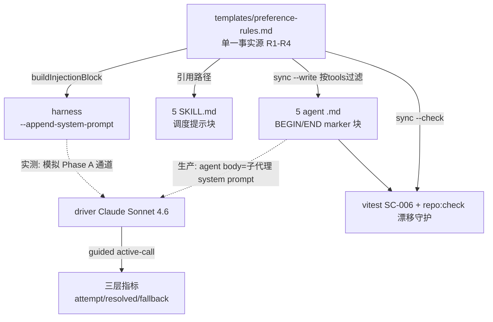

# Implementation Plan: Feature 170d — Driver Preference Shaping

**Feature 编号**: 170d | **模式**: spec-driver-feature | **状态**: Plan
**输入**: [spec.md](spec.md) | **基线 commit**: 8fa60b6

## Summary

在 prompt level 给 spec-driver 子代理 + 主编排器加「工具优先使用规则」引导，让 driver 在 caller-analysis / impact 评估类任务上优先调用 spectra MCP（`impact`/`context`/`detect_changes`）而非默认 Grep。引导文案以单一事实源 template 维护，按各 agent frontmatter `tools` 过滤渲染。通过改造 F170c SC-002 harness（`--append-system-prompt` 注入引导块）实测 guided active-call rate ≥ 50%。

**核心交付物**：(1) `templates/preference-rules.md` 单一事实源；(2) 5 个 agent 文件嵌入按 tools 过滤的规则块；(3) 5 个 SKILL.md 加调度提示块；(4) docs 章节；(5) F170d harness；(6) sandbox 静态测 + host-only e2e 占位。

## Technical Context

- **语言/版本**: TypeScript 5.x + Node.js 20.x（实际跑在 24.x）；测试 vitest
- **改动性质**: 以 prompt/文案 + 1 个 eval harness（.mjs）+ 静态校验测试为主，**0 个 src/ 业务逻辑改动**，**0 个新依赖**
- **测试策略**: sandbox 可跑的静态解析测（SC-001/005/006）+ harness 纯函数单测；host-only LLM 实测默认 `.skip`
- **凭据**: SC-002 仅需 Claude Max OAuth；SC-004 jury 需 SiliconFlow（NFR-001）

## Codebase Reality Check

| 目标文件 | LOC | 改动类型 | 新增行(估) | cleanup? |
|---------|-----|---------|----------|---------|
| agents/plan.md | 116 | 嵌入规则块(R1+R2+R3) | ~20 | 否 |
| agents/implement.md | 159 | 嵌入规则块(R1+R2+R3) | ~20 | 否 |
| agents/verify.md | 204 | 嵌入规则块(R1+R2+R4) | ~20 | 否 |
| agents/spec-review.md | 111 | 嵌入规则块(R1+R2+R3) | ~20 | 否 |
| agents/quality-review.md | 165 | 嵌入规则块(R1+R2+R3) | ~20 | 否 |
| skills/spec-driver-feature/SKILL.md | 336 | 加调度提示块 | ~12 | 否 |
| skills/spec-driver-story/SKILL.md | 566 | 加调度提示块 | ~12 | 否（仅 +12 行 <50） |
| skills/spec-driver-fix/SKILL.md | 457 | 加调度提示块 | ~12 | 否 |
| skills/spec-driver-refactor/SKILL.md | 250 | 加调度提示块 | ~12 | 否 |
| skills/spec-driver-implement/SKILL.md | 653 | 加调度提示块 | ~12 | 否（仅 +12 行 <50） |
| docs/spectra-mcp-integration.md | 129 | 加 §七 章节 | ~40 | 否 |
| scripts/feature-170c-sc002-driver-eval.mjs | 535 | **不动**（冻结，仅参考） | 0 | N/A |
| scripts/lib/driver-eval-core.mjs | 新增 | 抽取纯函数核心 | ~300 | N/A |

**前置清理规则判定**：无文件满足「LOC>500 且新增>50 行」（SKILL 大文件仅 +12 行）→ 无强制 cleanup task。

## Impact Assessment

- **直接修改**: 11 文件（5 agent + 5 SKILL + 1 doc）
- **新增**: 4 文件（template + harness + 2 个 test 文件）
- **跨包影响**: 仅 `plugins/spec-driver/` 内 + `scripts/` + `tests/`；不跨 `src/`
- **数据迁移**: 无
- **API/契约变更**: **不改** tool description / response format / frontmatter tools list（SC-008 硬约束）。新增 1 个 prompt 契约（preference-rules template anchor 格式）
- **风险等级**: **MEDIUM**（触点 15 个但均为文案；真实风险在 LLM 行为实测不可控 + 单一事实源漂移）
- **分阶段**: 非 HIGH，但按 TDD 强制 RED → GREEN → REFACTOR 三段

## 架构设计

### 决策 1：单一事实源 template + 生成式同步（响应 codex W-4）

**Decision**: 新增 `plugins/spec-driver/templates/preference-rules.md` 为 canonical source，用 anchor 注释标记 4 条规则与关键原则。各 agent 文件的规则块由**同步脚本生成**并用 marker 包裹，用 `--check` 模式做漂移检测（模仿仓库既有 `docs:sync:agents` 模式）。

**template 结构**：
```markdown
<!-- preference-rules:meta version=1 -->
## 工具优先使用规则（M7 F170d）

当面对以下类任务时，**优先调用 spectra MCP 工具而非 Read/Grep**：

| 任务关键词 | 优先工具 | 理由 |
|----------|---------|------|
<!-- preference-rules:R1 tool=impact -->
| "找 caller" / "谁调用了 X" / "caller analysis" | `mcp__plugin_spectra_spectra__impact` (direction=upstream) | 提供 transitive caller chain + confidence score，Grep 仅文本匹配无依赖深度 |
<!-- preference-rules:R2 tool=impact -->
| "评估改动影响" / "blast radius" / "影响面" | `mcp__plugin_spectra_spectra__impact` | 提供 BFS 受影响 symbol 列表 + summary |
<!-- preference-rules:R3 tool=context -->
| "找 callee" / "X 调用了什么" / "依赖什么" | `mcp__plugin_spectra_spectra__context` | 提供 symbol 360° 上下文 (definition + callers + callees + imports) |
<!-- preference-rules:R4 tool=detect_changes -->
| "git diff 影响" / "改了哪些 symbol" / "PR review 范围" | `mcp__plugin_spectra_spectra__detect_changes` | 从 diff 派生 changedSymbols + impact 链 |
<!-- /preference-rules:rows -->

### 关键原则
- **Grep 仍是 fallback**：当 Spectra MCP 工具返回 graph-not-built / 不可用时退回 Grep
- **不能省略调用**：不要因为"觉得 Grep 够用"跳过 MCP — 即使任务可以用 Grep 解决，MCP 提供的 transitive 数据更可信
- **chained 使用**：detect_changes → impact → context 是典型链路，按 nextStepHint 引导继续调用
- **不要 N+1**：单次 impact 调用即可拿到 BFS 全 list，不需要多次 Grep 累计
```

注：anchor 的 `tool=impact|context|detect_changes` 是**逻辑 key**（用于按 agent tools 过滤行）；行内的 fully-qualified 名一律用 **production namespace** `mcp__plugin_spectra_spectra__*`（与 agent frontmatter 一致，也与改造后 harness 命名一致——见决策 2，单一 namespace 全程通用，无需 namespace 重写）。

**同步脚本** `plugins/spec-driver/scripts/sync-preference-rules.mjs`（响应 codex C-2/W-1，定死锚点与 parser）：
- **插入锚点（定死）**：在 agent 文件 `## 角色` 段之后、下一个 `##` 标题（通常 `## 输入`）之前。若该 agent 无 `## 角色`，回退到 frontmatter 闭合 `---` 之后、首个 `##` 之前。块用 `<!-- BEGIN preference-rules (generated from templates/preference-rules.md; do not edit) -->` / `<!-- END preference-rules -->` 包裹。
- **两路写入逻辑**：(i) 首次——文件无 marker → 在锚点处插入；(ii) 更新——已有 marker → 仅替换 marker 内内容（锚点不再移动）。
- **frontmatter parser**：只解析 `tools:` 单行数组（正则提取 `mcp__plugin_spectra_spectra__\w+`），不引入 YAML 库；解析失败 → 报错退出（不静默）。
- **渲染**：表头固定 + 按该 agent tools 命中的 R 行（顺序 R1→R4）+ 关键原则全文。
- `--check`：重新生成预期块与磁盘逐字对比，drift → 非零退出（供 vitest SC-006 调用；repo:check 接入见下「风险与缓解」，作为可选 REFACTOR）。

**Rationale**: 真正单一事实源 + 漂移不可能（check 强制）；匹配仓库 source-of-truth 文化（docs:sync:agents）。脚本仅做文本注入 + 单行 frontmatter 解析，非业务逻辑，符合「0 src 改动」。per-agent 过滤逻辑写一次（脚本），test 直接调 `--check` 复用，避免把同样的解析逻辑在测试里再写一遍。

**Alternatives**: (a) 纯手写 5 block + vitest 校验（拒：违反单一事实源，且校验测仍需同样的 parser 逻辑，复杂度不减反增——codex W-1 评估后否决）；(b) 运行时模板引擎（拒：过度工程，prompt 是静态文件）。

### 决策 2：harness namespace 与 production 统一 + `--append-system-prompt` 注入引导块（响应 codex C-1/W-2）

**Decision (namespace 统一，修 C-1)**: 170d harness 的 `.mcp.json` server key 设为 **`plugin_spectra_spectra`**（而非 170c 的 `spectra`），使工具命名 = `mcp__plugin_spectra_spectra__*`，**与 production / agent frontmatter / template 完全一致**。`allowedTools` 相应改为 `mcp__plugin_spectra_spectra__impact,mcp__plugin_spectra_spectra__context,mcp__plugin_spectra_spectra__detect_changes,Read,Grep,Glob`。preflight 断言：注入块中的 fully-qualified tool ⊆ allowedTools（防漂移）。（170c parser regex `/^mcp__[a-z_]*spectra(?:_spectra)?__impact$/` 已兼容此命名。）

**Decision (注入)**:
- `buildInjectionBlock(agent='implement')`：从 template 读取，按 implement 的 tools（impact+context）渲染规则块（R1+R2+R3）+ 关键原则。默认注入为 system prompt（`claude --print --append-system-prompt "<block>"`）。
- preflight：跑前 `claude --version` 记录 + 探测 `--append-system-prompt` 接受性；不接受或块为空 → exit 2（FR-008/FR-015）。
- report 记录注入块 sha256 + 摘要（证明非裸 baseline，codex I-3）。

**实验范围声明（修 W-2，措辞精确）**: 本 harness 验证的是 **「引导块经 system-prompt 通道投递时是否生效」（guided active-call rate）**，即忠实模拟 Phase A 的 **system-prompt 投递通道**；它 **不模拟完整 agent body**（生产中 driver 看到的是整个 agent .md body）。因此 block-only pass 只证明引导块在 system prompt carrier 中有效，**不外推**「完整 agent body 共存其它 spec-driver 指令时也 pass」。完整 agent-body arm 列为可选 follow-up，**不作 primary gate**。

**为何选 implement 的渲染块**: implement 最常做"改动影响评估"，tools 含 impact/context，任务都是 impact 评估类，故 R1/R2 必在注入块中。`--agent <name>` 可切换以观察不同 agent 渲染块的效果。

**Alternatives**: (a) 注入整个 agent body（拒：confound，混入无关 spec-driver 指令，无法归因到引导块）；(b) prepend 到 task prompt（拒：污染 user prompt，且 Phase A 生产通道是 system prompt）；(c) 沿用 170c 的 `spectra` server key（拒：与 production namespace 不一致，注入块工具名不在 allowedTools，US2 数据失真——codex C-1）。可选 neutral system-prompt carrier 作 A/B follow-up。

### 决策 2.5：抽取 `scripts/lib/driver-eval-core.mjs` 共享核心（响应 codex W-3/W-4，不复制 535 行）

**Decision**: 不复制 170c harness。抽取**纯函数核心** `scripts/lib/driver-eval-core.mjs`，170d harness 作为**薄 wrapper** import 它。170c harness **保持冻结**（已 ship 制品，不重构，避免回归风险）；core 与 170c 的 parity 由一个可选 parity test 在 170c 基线 fixture 上校验。

core 导出（均为纯函数，无文件 I/O，可单测）：
- `TASKS` / `FORBIDDEN_LITERALS` / `validatePrompts(tasks)`
- `parseToolEvents(stdout)` → **通用** tool-event 模型（修 W-4）：按出现顺序返回所有 `tool_use`（name/input/id）+ `tool_result`（by id：isError/payload/code），不止 impact
- `computeMetrics(events)` → 三层指标 + Active Call 4 规则合规 + 每 run Grep 计数（全部从 events 推导）
- `wilsonCI(success, total)`
- `resolveTargetInGraph(nodeIds, target)` / `ensureGraph...`（setup 辅助）

170c 现状：`parseRun(stdout, taskPrompt)` 只抓 impact、返回 4 字段，**无法**推导 fallback/negative-control 指标（codex W-4 实证）→ 故 core 用更宽的 `parseToolEvents` + `computeMetrics` 两层模型替代，170d 用之。

**Rationale**: 新代码零重复（简洁之道/DRY）；170c 冻结不动（spec 稳定性）；事件模型一次做对，三层指标/negative-control/fallback 都有数据源。

**Alternatives**: (a) 复制 535 行（拒：DRY 违规，双边漂移——codex W-3）；(b) 重构 170c 也 import core（拒：触动已 ship 的 170c，需重验，超出本 feature 必要范围；列为可选后续）。

### 决策 3：三层指标 + negative-control + fallback 模拟（响应 codex W-2/W-3）

三层指标由 `computeMetrics(parseToolEvents(stdout))` 推导（见决策 2.5）：
- `impactAttemptRate`：出现 impact tool_use 的 run
- `impactResolvedSuccessRate`：impact + target resolve + success envelope（= SC-002 主指标，沿用 170c Active Call (c)）
- `fallbackAfterImpactFailureRate`：impact 失败后出现 Grep 的 run
- 每 run Grep 调用次数（反模式观察）

新增模式 flag：
- `--negative-control`：跑 3 个 non-caller-analysis task（纯文本搜索/格式化/文档查找），统计调 MCP 的 run（SC-009 软门禁 ≤1/3）
- `--simulate-graph-missing`：临时移走/不建 graph.json → 触发 graph-not-built，验证 driver 回退 Grep（SC-003）

### 决策 4：测试分层（RED 可在 sandbox 真实失败）

| 测试文件 | 覆盖 | 环境 | RED 行为 |
|---------|------|------|---------|
| `tests/unit/spec-driver/feature-170d-preference-rules.test.ts` | SC-001/005/006：解析 template + 5 agent + 5 SKILL，断言规则块存在/按 tools 过滤/与 template 一致/工具⊆tools | sandbox | Phase A/B 未做前**真实 fail** |
| `tests/unit/spec-driver/feature-170d-harness.test.ts` | harness 纯函数：buildInjectionBlock 过滤正确 / 三层指标从合成 stream-json 计算 / preflight 版本解析 / negative-control task 校验 | sandbox | harness 未导出函数前 fail |
| `tests/e2e/feature-170d-driver-preference.e2e.test.ts` | US2/US3/US4：`.skip` 占位（host shell 去 skip） | host-only | skip（不计入 RED） |

harness 需 `export` 纯函数（buildInjectionBlock / parseRun / computeMetrics / wilsonCI）供单测 import，main() 用 `import.meta` guard 仅 CLI 直跑时执行。

## Constitution Check

| 原则 | 适用性 | 评估 | 说明 |
|------|--------|------|------|
| 不超出 spec 范围 | 适用 | PASS | 严格按 FR-001~015；不动 description/response/tools list |
| 简洁之道 | 适用 | PASS | template 单一源消除 5+ 处重复；harness 复用 170c |
| 零基思维 | 适用 | PASS | sync 脚本职责单一（文本注入）；不在 src 叠 workaround |
| 类型安全 | 部分 | N/A | harness 是 .mjs（与 170c 一致）；测试 .ts 无 any |
| 提交前验证 | 适用 | PASS | GREEN/REFACTOR commit 前跑 vitest+build+repo:check |
| 测试同提交 | 适用 | PASS | RED 先行，测试与实现同 feature |

**无 VIOLATION**。

## Project Structure

```
plugins/spec-driver/
  templates/preference-rules.md          [新增] 单一事实源（R1-R4 anchor + 关键原则）
  scripts/sync-preference-rules.mjs       [新增] 生成(--write)+漂移检测(--check)
  agents/{plan,implement,verify,spec-review,quality-review}.md  [改] BEGIN/END marker 块
  skills/{feature,story,fix,refactor,implement}/SKILL.md         [改] 调度提示块
  docs/spectra-mcp-integration.md         [改] §七 Driver 偏好引导设计
scripts/lib/driver-eval-core.mjs                                 [新增] 共享纯函数核心
scripts/feature-170d-driver-preference.mjs                       [新增] harness（薄 wrapper）
tests/unit/spec-driver/feature-170d-preference-rules.test.ts     [新增] SC-001/005/006 静态测
tests/unit/spec-driver/feature-170d-harness.test.ts              [新增] core 纯函数单测
tests/e2e/feature-170d-driver-preference.e2e.test.ts             [新增] US2/US3/US4 host-only .skip
specs/170d-driver-preference-shaping/verification/
  verification-report.md                  [入库] 人工撰写结论
  sc-002-driver-eval-*.json               [不入库] raw run（.gitignore，见风险表 W-6）
```

## 架构图



## Complexity Tracking

| 偏离简单方案的决策 | 理由 |
|------------------|------|
| 引入 sync 脚本（非纯手写） | 可执行单一事实源；匹配仓库 docs:sync 模式；漂移 check 防回归。手写方案的校验测仍需同样 parser，复杂度不减（codex W-1 评估后保留脚本）|
| 抽 driver-eval-core 而非复制 170c | DRY；170c 冻结避免回归（codex W-3）|
| 只注入引导块而非整 agent body | 隔离实验自变量，delta 可归因（干净 A/B vs F170c）；范围声明为「system-prompt 投递通道」不外推完整 body（codex W-2）|
| harness server key 改 plugin_spectra_spectra | namespace 与 production 统一，注入块工具名 ∈ allowedTools（codex C-1）|
| 三层指标而非单一 rate | 区分"偏好已改但 target 失败"vs"完全没调"（codex W-2）|

## 风险与缓解

| 风险 | 缓解 |
|------|------|
| US2 实测仍 <50%（driver 偏好难改） | 三种 count-based 情景 + 降级方案 1/2/3；记 limitation 仍交付基础设施 |
| 单一事实源漂移 | sync --check 接入 vitest（SC-006）。**repo:check 接入点（修 codex W-5）**：在 `scripts/lib/repo-maintenance-core.mjs` 的 `validateRepository` 注册新 check id `preference-rules:agent-block-sync`，调用 `sync-preference-rules.mjs --check`，**不在 check-plugin-sync.sh（薄壳）里加业务逻辑**；列为可选 REFACTOR |
| harness `--append-system-prompt` 被吞/不支持 | preflight 探测 + exit 2 fail-fast（FR-015） |
| harness 工具 namespace 与 production 不一致 | .mcp.json server key = `plugin_spectra_spectra`；allowedTools 用 production 名；preflight 断言注入块工具 ⊆ allowedTools（修 codex C-1） |
| 引导块写死 target 污染规则(b) | template 不含任何具体 symbol；SC-006 校验无 `::` target 字面量 |
| **host 实测 raw JSON 入库噪声（修 codex W-6）** | `.gitignore` 加 `specs/*/verification/sc-002-driver-eval-*.json`；只 track 人工 `verification-report.md`（接受最终代表性单次 raw JSON 可选入库，与 170c 一致，但默认 ignore 迭代产物）|
| LLM 预算超支 | SC-002 走订阅边际$0；jury $2-5；触及 $15 等价或配额警戒 → 缩 N |

## 验收映射

plan → tasks 阶段将把以下拆为可测任务：RED（3 测试文件占位/失败）→ GREEN（template+sync+5 agent+5 SKILL+doc+harness，sandbox 测全绿）→ host 实测（US2 GREEN 后定）→ REFACTOR（可选抽取）。
