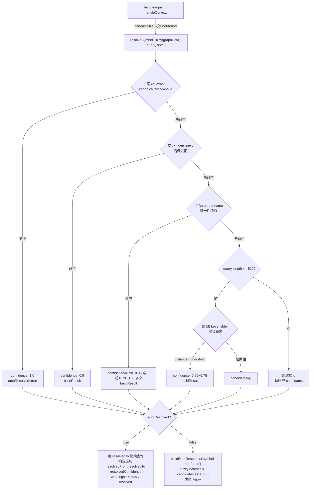

# Implementation Plan: Feature 174 — Symbol ID Fuzzy Match

**Branch**: `174-symbol-id-fuzzy-match` | **Date**: 2026-06-06 | **Spec**: [./spec.md](./spec.md)

---

## 摘要

将 `impact` / `context` handler 的 symbol-not-found 回退路径从旧版 `findFuzzyMatches`（返回 `string[]`）升级为新纯函数 `resolveSymbolFuzzy`（四层命中即停、高置信度自动 resolve、结构化 `SymbolCandidate` 返回）。目标：F165 cohort C 错误率从 1/9 降至 0/9，同时严格防止多义候选被误自动 resolve。

改动范围：2 个源文件（`query-helpers.ts` 新增纯函数 + 类型，`agent-context-tools.ts` handler 接线改造），1 个测试文件更新断言（C-102 / C-206），新增单元测试和 E2E 测试文件。无新外部依赖，无数据迁移，无 schema 变更。

---

## Technical Context

**Language/Version**: TypeScript 5.x / Node.js 20.x+
**Primary Dependencies**: 无新增（Levenshtein 从 `adr-evidence-verifier.ts` 提取为内部 helper，不引入 npm 包）
**Storage**: N/A（graphData 只读内存操作）
**Testing**: vitest；**更新现有** `tests/unit/knowledge-graph/query-helpers.test.ts`（已存在，含旧 `findFuzzyMatches` suite :97-121 + import :21 —— 新增 `resolveSymbolFuzzy` 分层用例，并随 REFACTOR 删除/替换旧 suite）+ **新增** `tests/e2e/symbol-fuzzy-match.e2e.test.ts`（US1~US4）；**更新** `tests/unit/mcp/agent-context-tools.test.ts`（C-102 / C-206 断言）
**Target Platform**: 与 spectra MCP server 同运行环境（Node.js LTS ≥ 20.x）
**Performance Goals**: 单次 resolve 耗时 < 10ms（graph ≤ 500 节点，Levenshtein O(m×n) 限 query ≤ 512 字符）
**Constraints**: graphData 只读；不引入外部依赖；handler 层 `autoResolveThreshold` floor ≥ 0.9

---

## Codebase Reality Check

### 目标文件现状

| 文件 | LOC | 主要公开接口数 | 已知 debt | 将新增代码量 |
|------|-----|---------------|-----------|------------|
| `src/knowledge-graph/query-helpers.ts` | 527 | 8（`canonicalizeSymbolId`, `findFuzzyMatches`, `bfsTraverse`, `getReverseAdjacency`, `clearReverseAdjacencyCache`, `resolveEdgeConfidence`, `moduleFileFromId`, `findNode`） | 无 TODO/FIXME；`findFuzzyMatches` 本次将被 `resolveSymbolFuzzy` 取代 | ~120 行（新增类型 + `resolveSymbolFuzzy` + 内部 `levenshtein` helper） |
| `src/mcp/agent-context-tools.ts` | ~600+ | 3 handler（`handleImpact`, `handleContext`, `handleDetectChanges`） | 无；handler 接线改动局限 not-found 分支 | ~30 行（两处 not-found 分支替换 + warnings 追加） |
| `tests/unit/mcp/agent-context-tools.test.ts` | ~450+ | — | C-102(:161) / C-206(:333) 弱断言需升级 | ~20 行（断言替换 + 新增 autoResolved 场景） |

**前置 cleanup 规则评估**：
- `query-helpers.ts` LOC 527 且将新增 ~120 行（合计 ~647 行），触发"LOC > 500 且新增 > 50 行"规则。
- 但 `findFuzzyMatches`（旧函数）将在 REFACTOR 步骤中被 `resolveSymbolFuzzy` 取代，文件净增量约 80~100 行（新增 120 行，删除旧函数约 30 行）。
- 无相关 TODO/FIXME、无代码重复。**结论：不新增独立 cleanup task**，而是在 REFACTOR 步骤内处理旧函数替换，保持文件规模合理。

---

## Impact Assessment

| 维度 | 评估 |
|------|------|
| 直接修改文件 | 2（`query-helpers.ts`，`agent-context-tools.ts`） |
| 间接受影响文件 | 1（`agent-context-tools.test.ts` 断言同步） |
| 测试文件 | 1 新建（`symbol-fuzzy-match.e2e.test.ts`）+ 1 已存在更新（`query-helpers.test.ts` 新增 resolveSymbolFuzzy describe block，REFACTOR 删旧 findFuzzyMatches suite）+ 1 已存在更新（`agent-context-tools.test.ts` C-102/C-206） |
| 跨包影响 | 无（修改和测试均在 `src/knowledge-graph/`、`src/mcp/`、`tests/` 内，不跨 `plugins/`） |
| 数据迁移 | 无 |
| API / 契约变更 | `fuzzyMatches` 字段类型 `string[]` → `Array<SymbolCandidate>`（breaking change，同 PR 内完成下游审计） |
| **风险等级** | **MEDIUM**（影响文件 < 10，无跨包影响，但有 breaking type change 需多文件同步） |

**MEDIUM 风险缓解策略**：严格执行"先类型定义 → 纯函数 → handler 接线 → 测试同步 → 全仓 grep 审计"的原子顺序，防止任何中间态类型不一致被单独提交。所有变更在单一 PR 内完成。

---

## Constitution Check

| 原则 | 适用性 | 评估 | 说明 |
|------|--------|------|------|
| I. 双语文档规范 | 适用 | PASS | plan.md 中文散文 + 英文标识符，代码注释将用中文 |
| II. Spec-Driven Development | 适用 | PASS | 走 spec → plan → tasks → implement → verify 完整流程 |
| III. YAGNI / 奥卡姆剃刀 | 适用 | PASS | 无新增抽象层；不保留"双字段并存"兼容模式（FR-013 Non-goal）；Levenshtein 复用现有实现，不引入新依赖 |
| IV. 诚实标注不确定性 | 适用 | PASS | Open Questions A/B/C 在 plan 中全部给出确定答案，无残留 [推断] |
| V. AST 精确性优先 | 不适用 | SKIP | 本 Feature 是运行时 symbol 解析，不涉及 AST 提取或 LLM 输出 |
| VI. 混合分析流水线 | 不适用 | SKIP | 不涉及 LLM 调用 |
| VII. 只读安全性 | 适用 | PASS | FR-008 强制 graphData 只读，plan 在每层算法设计中体现无副作用约束 |
| VIII. 纯 Node.js 生态 | 适用 | PASS | 无新外部依赖；Levenshtein 从已有私有实现提取，复用而非新增 |
| XIII. 向后兼容 | 适用 | 注意 | `fuzzyMatches: string[]` → `Array<SymbolCandidate>` 是 breaking change，通过 FR-007 下游审计清单和单 PR 同步完成缓解，无法完全规避但已最小化影响范围 |
| XIV. 可观测性与架构守护 | 适用 | PASS | 新函数行数合理；REFACTOR 步骤处理旧 `findFuzzyMatches` 防止僵尸代码 |

**无 VIOLATION**，计划有效。

---

## Open Questions 决策（A / B / C）

### A. partial-name 唯一性加权具体公式

**决策**：以下为完整的可实现打分公式。

**定义**：
- `symbolSeg(nodeId)` = `nodeId` 在最后一个 `::` 之后的部分（若无 `::` 则为 `nodeId` 本身）
- 匹配条件：`symbolSeg(nodeId).toLowerCase() === query.toLowerCase()` 或 `symbolSeg(nodeId).toLowerCase().endsWith('.' + query.toLowerCase())` 或 `symbolSeg(nodeId).toLowerCase() === query.toLowerCase()`（用于 bare 和 `Class.method` 两种形式）
- `isQualified(query)` = `query.includes('.')` 且 query 中 `.` 前后均有非空字符
- `matchCount` = graph 中满足上述匹配条件的节点数

**打分公式**：

```
// 唯一命中（matchCount === 1）
if (isQualified(query)) {
  confidence = 0.95   // qualified Class.method 唯一 → 更高确定性
} else {
  confidence = 0.90   // bare 单 token 唯一 → 刚好触发 autoResolve
}

// 多义命中（matchCount > 1）
// 排名 rank 从 0 开始（0 = 最高分候选）
confidence = Math.max(0.70, 0.85 - rank * (0.15 / (matchCount - 1)))
// 确保区间 [0.70, 0.85]，matchCount 越大递减越快
```

**验证**：
- 唯一 qualified `Value.__add__`（isQualified=true, matchCount=1）→ 0.95 ≥ 0.9，autoResolve ✓
- 唯一 bare `add`（isQualified=false, matchCount=1）→ 0.90 ≥ 0.9，autoResolve ✓
- 多义 `relu`（matchCount=2，rank=0）→ 0.85 < 0.9，不 autoResolve ✓
- 多义 `relu`（matchCount=2，rank=1）→ 0.70，不 autoResolve ✓
- 平票（同分）→ 多候选，autoResolved: false ✓

### B. E2E Fixture 来源与设计

**决策**：使用**合成 micrograd graph fixture**，直接在 E2E 测试文件内构造（inline 方式），不依赖外部文件。

**理由**：真实 baseline `full.json` schema 与 `GraphJSON`（`{nodes, links, metadata}`）不完全对齐，跨环境不稳定；inline 构造完全可控，fixture 内容与测试断言强绑定，维护成本低。

**Fixture 设计**（覆盖 9 个 cohort C 样本 + 4 种变体节点）：

```typescript
// 节点集（支撑 US1~US3 + 4 变体 + cohort C 9 个场景）
const MICROGRAD_NODES = [
  // cohort C 核心节点
  { id: 'micrograd/engine.py::Value',        kind: 'class',    label: 'Value' },
  { id: 'micrograd/engine.py::Value.__add__',kind: 'method',   label: '__add__' },
  { id: 'micrograd/engine.py::Value.__mul__',kind: 'method',   label: '__mul__' },
  { id: 'micrograd/engine.py::Value.__neg__',kind: 'method',   label: '__neg__' },
  { id: 'micrograd/engine.py::Value.backward',kind:'method',   label: 'backward' },
  { id: 'micrograd/engine.py::Value.relu',   kind: 'method',   label: 'relu' },
  // 用于"同名多 module"场景（relu 存在于 2 个模块）
  { id: 'micrograd/nn.py::Module.relu',      kind: 'method',   label: 'relu' },
  // 用于 path-suffix 测试
  { id: 'micrograd/nn.py::Linear',           kind: 'class',    label: 'Linear' },
  { id: 'micrograd/nn.py::ReLU',             kind: 'class',    label: 'ReLU' },
  // 模块节点（无 :: 分隔符）
  { id: 'micrograd/engine.py',               kind: 'module',   label: 'engine' },
  { id: 'micrograd/nn.py',                   kind: 'module',   label: 'nn' },
  // 额外节点支撑 15 次混合变体中剩余用例
  { id: 'micrograd/engine.py::Value.__pow__',kind: 'method',   label: '__pow__' },
  { id: 'micrograd/engine.py::Value.__repr__',kind:'method',   label: '__repr__' },
]
```

**测试文件放置路径**：`tests/e2e/symbol-fuzzy-match.e2e.test.ts`（遵循 `vitest.config.ts:106` 的 `tests/e2e/**/*.e2e.test.ts` include 规则）。

**15 次变体分配（SC-003 ≥ 12/15 top-1 命中；含 C-1 修复后预期全 15/15，留足余量）**：

| # | 变体类 | query | 命中层 | 期望 top-1 canonical id |
|---|---|---|---|---|
| i-1 | 只有方法名 | `Value.__add__` | partial-name(唯一 qualified 0.95) | `micrograd/engine.py::Value.__add__` |
| i-2 | 只有方法名 | `Value.relu` | partial-name(唯一 qualified 0.95) | `micrograd/engine.py::Value.relu` |
| i-3 | 只有方法名 | `backward` | partial-name(唯一 bare 0.90) | `micrograd/engine.py::Value.backward` |
| i-4 | 只有类名 | `Linear` | partial-name(唯一 bare 0.90) | `micrograd/nn.py::Linear` |
| ii-1 | 无 package 前缀 | `engine.py::Value` | path-suffix(0.9) | `micrograd/engine.py::Value` |
| ii-2 | 无 package 前缀 | `nn.py::Linear` | path-suffix(0.9) | `micrograd/nn.py::Linear` |
| ii-3 | 无 package 前缀 | `nn.py::ReLU` | path-suffix(0.9) | `micrograd/nn.py::ReLU` |
| iii-1 | 绝对路径 | `${projectRoot}/micrograd/engine.py::Value` | exact(1.0) | `micrograd/engine.py::Value` |
| iii-2 | 绝对路径 | `${projectRoot}/micrograd/engine.py::Value.__add__` | exact(1.0) | `micrograd/engine.py::Value.__add__` |
| iii-3 | 绝对路径 | `${projectRoot}/micrograd/nn.py::Linear` | exact(1.0) | `micrograd/nn.py::Linear` |
| iii-4 | 绝对路径 | `${projectRoot}/micrograd/nn.py::ReLU` | exact(1.0) | `micrograd/nn.py::ReLU` |
| iv-1 | typo 文件名 | `egnine.py::Value` | levenshtein(dist 2) | `micrograd/engine.py::Value` |
| iv-2 | typo 方法名 | `Valu.__add__` | levenshtein(dist 1) | `micrograd/engine.py::Value.__add__` |
| iv-3 | typo 文件名 | `enginee.py::Value` | levenshtein(dist 1) | `micrograd/engine.py::Value` |
| iv-4 | typo 文件名 | `nnn.py::Linear` | levenshtein(dist 1) | `micrograd/nn.py::Linear` |

> `${projectRoot}` 在 e2e 中用合成的固定路径（如 `/tmp/fuzzy-fixture`）并透传 `opts.projectRoot`，使 `canonicalizeSymbolId` 的绝对→相对归一化命中 exact 层。变体 iii 的 4 个 query 与 expected id 在测试中写死断言（W-2 收口）。

### C. Levenshtein 距离上限 + confidence 映射

**决策**：

**距离计算对象（⚠️ C-1 修复关键）**：不对完整 `node.id` 算距离，而是对每个 node 的**多种表示**取 levenshtein 最小值——表示集 = `{ node.id, symbolSeg, basename(file)::symbol, basename(module) }`（见 `nodeMatchReps` helper）。理由：完整 id 含 `micrograd/` 等 package 前缀，会把 typo query 的距离推到阈值之外，使所有 typo 变体落空。去前缀后对 `basename(file)::symbol` 比对，拼写错误距离回落到 1~2，可稳定命中。

**距离上限（纳入候选的条件）**：

```
// 对每种表示 rep：
maxLen = Math.max(query.length, rep.length)
threshold = Math.ceil(maxLen * 0.35)
// 仅当某表示的 distance <= 其 threshold 时纳入候选，取相对距离最小的表示
```

即相对编辑距离 ≤ 35%。验算见上方 `layerLevenshtein` 后的 4 变体表格：`egnine.py::Value` 对 `engine.py::Value` distance=2 ≤ threshold=6，稳定命中。

**distance → confidence 线性映射**（0.5 ~ 0.75）：

```
// distance 越小，confidence 越高；映射到 [0.5, 0.75]
confidence = 0.75 - (distance / threshold) * 0.25
// 边界保证：
//   distance = 0 时 confidence = 0.75（但此时应已被 exact/path-suffix 层命中）
//   distance = threshold 时 confidence = 0.50
// clamp 防止浮点误差越界：
confidence = Math.max(0.50, Math.min(0.75, confidence))
```

**排序**：层 d 内按 confidence 降序，取前 limit 个（handler 层 clamp 到 top-3）。

**query 长度 > 512 跳过层 d**（FR-010 已锁，实现 `if (query.length > 512) return layerABCResults`）。

---

## Project Structure

### 文档（本 Feature）

```text
specs/174-symbol-id-fuzzy-match/
├── spec.md
├── checklist.md
├── plan.md              ← 本文件
└── tasks.md             ← Phase 2 由 tasks 子代理生成
```

### 源代码修改（仓库根相对路径）

```text
src/knowledge-graph/
└── query-helpers.ts           [修改] 新增类型 + resolveSymbolFuzzy + 内部 levenshtein helper

src/mcp/
└── agent-context-tools.ts     [修改] handleImpact / handleContext not-found 分支接线改造

tests/unit/knowledge-graph/
└── query-helpers.test.ts      [修改-已存在] 新增 resolveSymbolFuzzy 四层 + 边界用例；REFACTOR 删除旧 findFuzzyMatches suite(:97-121)

tests/unit/mcp/
└── agent-context-tools.test.ts [修改] C-102(:161) / C-206(:333) 断言升级 + 新增 autoResolved 场景

tests/e2e/
└── symbol-fuzzy-match.e2e.test.ts [新建] US1~US4 E2E 测试（合成 micrograd fixture）
```

---

## Architecture

### 新增类型定义（位于 `query-helpers.ts`）

```typescript
/** fuzzy match 层次枚举 */
export type MatchKind = 'exact' | 'path-suffix' | 'partial-name' | 'levenshtein';

/** 单个 fuzzy match 候选结果 */
export interface SymbolCandidate {
  id: string;          // canonical symbol id
  confidence: number;  // 0~1，见各层规则
  matchKind: MatchKind;
}

/** resolveSymbolFuzzy 返回值 */
export interface FuzzyResolveResult {
  candidates: SymbolCandidate[];  // 按 confidence 降序，长度 ≤ opts.limit（默认 10）
  autoResolved: boolean;          // 唯一候选 + confidence >= autoResolveThreshold(0.9) 时为 true
}

/** resolveSymbolFuzzy 选项 */
export interface FuzzyResolveOptions {
  projectRoot?: string;          // 透传给 canonicalizeSymbolId
  limit?: number;                // 内部候选上限（默认 10，测试可设更大值）
  autoResolveThreshold?: number; // 自动 resolve 阈值（默认 0.9，不得低于 0.9）
}
```

### `resolveSymbolFuzzy` 算法伪代码

```typescript
export function resolveSymbolFuzzy(
  graphData: Readonly<GraphJSON>,
  query: string,
  opts: FuzzyResolveOptions = {},
): FuzzyResolveResult {
  const limit = opts.limit ?? 10;
  const threshold = Math.max(0.9, opts.autoResolveThreshold ?? 0.9); // floor 0.9

  // 前置：空 / 无效 query 提前返回
  if (!query || query.trim().length === 0 || CONTROL_CHAR_RE.test(query)) {
    return { candidates: [], autoResolved: false };
  }

  // 层 (a) exact
  const canon = canonicalizeSymbolId(query, graphData, { projectRoot: opts.projectRoot });
  if (canon.reason === 'ok' && canon.canonicalId !== null) {
    const candidate: SymbolCandidate = { id: canon.canonicalId, confidence: 1.0, matchKind: 'exact' };
    return { candidates: [candidate], autoResolved: true }; // exact 必然唯一且 1.0 >= 0.9
  }
  if (canon.reason === 'invalid') {
    return { candidates: [], autoResolved: false };
  }

  // 层 (b) path-suffix
  const pathSuffixCandidates = layerPathSuffix(graphData, query, limit);
  if (pathSuffixCandidates.length > 0) {
    const result = buildResult(pathSuffixCandidates, limit, threshold);
    return result;
  }

  // 层 (c) partial-name
  const partialNameCandidates = layerPartialName(graphData, query, limit);
  if (partialNameCandidates.length > 0) {
    const result = buildResult(partialNameCandidates, limit, threshold);
    return result;
  }

  // 层 (d) Levenshtein（query > 512 跳过）
  if (query.length <= 512) {
    const levCandidates = layerLevenshtein(graphData, query, limit);
    if (levCandidates.length > 0) {
      return buildResult(levCandidates, limit, threshold);
    }
  }

  return { candidates: [], autoResolved: false };
}

// buildResult：去重 → 按 confidence 降序 → 判定 autoResolved
function buildResult(
  raw: SymbolCandidate[],
  limit: number,
  threshold: number,
): FuzzyResolveResult {
  // 去重（同 id 保留最高 confidence）
  const deduped = deduplicateCandidates(raw);
  // 降序排序
  deduped.sort((a, b) => b.confidence - a.confidence);
  // ⚠️ C-3 修复：autoResolved 必须用**去重后 slice 之前**的 deduped.length 判唯一，
  // 不能用 slice(0,limit) 后的长度——否则 limit=1 会把多候选误判为唯一候选而误 autoResolve。
  const autoResolved =
    deduped.length === 1 && deduped[0]!.confidence >= threshold;
  // top-N（仅影响输出展示，不参与唯一性判定）
  const candidates = deduped.slice(0, limit);
  return { candidates, autoResolved };
}
```

### 层 (b) path-suffix 实现要点

```typescript
function layerPathSuffix(graphData, query, limit): SymbolCandidate[] {
  // ⚠️ C-2 修复：path-suffix 仅处理"带路径语义"的 query（含 '::' 或 '/'）。
  // bare 单 token（如 "Value" / "relu"）必须落到 partial-name 层，
  // 否则 query="Value" 可能误匹配某个 "*/Value" 文件/模块节点并以 0.9 抢先 autoResolve。
  if (!query.includes('::') && !query.includes('/')) {
    return [];
  }
  // query 形如 "engine.py::Value.relu" 或 "engine.py::Value"（无 package 前缀）
  // 匹配条件：nodeId 字面相等，或 nodeId 以 "/" + query 结尾（大小写不敏感）
  // confidence 锁定为精确常量 0.9（FR-003 边界规则）
  const lowerQuery = query.toLowerCase();
  const results: SymbolCandidate[] = [];
  for (const node of graphData.nodes) {
    const lowerId = node.id.toLowerCase();
    if (lowerId === lowerQuery || lowerId.endsWith('/' + lowerQuery)) {
      results.push({ id: node.id, confidence: 0.9, matchKind: 'path-suffix' });
    }
  }
  return results;
}
```

### 层 (c) partial-name 实现要点

```typescript
function layerPartialName(graphData, query, limit): SymbolCandidate[] {
  // symbolSeg = nodeId 在最后 '::' 之后的部分（或整个 nodeId 若无 '::'）
  // 匹配条件：symbolSeg 精确等于 query，或 symbolSeg 以 '.' + query 结尾
  // matchCount = 满足条件的节点总数
  // 打分公式：见 Open Question A 决策
  const lowerQuery = query.toLowerCase();
  const isQualified = query.includes('.');
  const matched: string[] = [];
  for (const node of graphData.nodes) {
    const seg = symbolSeg(node.id).toLowerCase();
    if (seg === lowerQuery || seg.endsWith('.' + lowerQuery)) {
      matched.push(node.id);
    }
  }
  const matchCount = matched.length;
  if (matchCount === 0) return [];
  return matched.map((id, rank) => {
    let confidence: number;
    if (matchCount === 1) {
      confidence = isQualified ? 0.95 : 0.90;
    } else {
      confidence = Math.max(0.70, 0.85 - rank * (0.15 / (matchCount - 1)));
    }
    return { id, confidence, matchKind: 'partial-name' as MatchKind };
  });
}
```

### 层 (d) Levenshtein 实现要点

```typescript
function layerLevenshtein(graphData, query, limit): SymbolCandidate[] {
  // 复用 adr-evidence-verifier.ts 的 levenshtein DP 实现（提取为 query-helpers.ts 内部函数）
  //
  // ⚠️ C-1 修复：绝不能只对完整 node.id 算距离。
  // typo query="egnine.py::Value"(16) vs node.id="micrograd/engine.py::Value"(26)：
  // 因 "micrograd/" 前缀差异 distance≈11 > threshold(ceil(26*0.35)=10) → 被排除，
  // 导致全部 4 个 typo 变体落空，SC-003 只能到 11/15（codex C-1）。
  // 解法：对每个 node 取**多种表示**的 levenshtein 最小值，再用该表示自身的 maxLen 定阈值。
  const lowerQuery = query.toLowerCase();
  const results: SymbolCandidate[] = [];
  for (const node of graphData.nodes) {
    // 候选表示集：完整 id / symbolSeg(仅 symbol) / basename(file)::symbol（去 package 前缀）/ basename(module id)
    const reps = nodeMatchReps(node.id); // 见下方 helper
    // 取所有表示中"相对距离 dist/threshold 最小且 <=1"者
    let bestRatio = Infinity;
    let bestConf = 0;
    for (const rep of reps) {
      const r = rep.toLowerCase();
      const threshold = Math.ceil(Math.max(lowerQuery.length, r.length) * 0.35);
      if (threshold === 0) continue;
      const dist = levenshtein(lowerQuery, r);
      if (dist > threshold) continue;           // 该表示超阈值，跳过
      const ratio = dist / threshold;
      if (ratio < bestRatio) {
        bestRatio = ratio;
        bestConf = Math.max(0.50, Math.min(0.75, 0.75 - ratio * 0.25));
      }
    }
    if (bestRatio !== Infinity) {
      results.push({ id: node.id, confidence: bestConf, matchKind: 'levenshtein' });
    }
  }
  results.sort((a, b) => b.confidence - a.confidence);
  return results.slice(0, limit);
}

// node.id → 用于 typo 比对的多种表示（取与 query 距离最小者）
function nodeMatchReps(nodeId: string): string[] {
  const reps = new Set<string>([nodeId]);
  const seg = symbolSeg(nodeId);              // '::' 之后的 symbol 段
  reps.add(seg);
  const filePart = moduleFileFromId(nodeId);  // '::'/'#' 之前的 file 段（或整个 id）
  const base = filePart.split('/').pop() ?? filePart; // basename(file)
  if (nodeId.includes('::')) {
    reps.add(base + '::' + seg);              // basename(file)::symbol，去 package 前缀
  } else {
    reps.add(base);                            // module/file 节点：basename
  }
  return [...reps];
}
```

**C-1 修复后 4 个 typo 变体距离验算**（确保 SC-003 可达 15/15，留足 ≥12 余量）：

| typo query | 最优表示 | distance | threshold | top-1 命中 |
|---|---|---|---|---|
| `egnine.py::Value` | `engine.py::Value`(basename::symbol) | 2 | ceil(16×0.35)=6 | ✓ engine.py::Value |
| `Valu.__add__` | `Value.__add__`(symbolSeg) | 1 | ceil(13×0.35)=5 | ✓ Value.__add__ |
| `enginee.py::Value` | `engine.py::Value` | 1 | 6 | ✓ engine.py::Value |
| `nnn.py::Linear` | `nn.py::Linear` | 1 | ceil(14×0.35)=5 | ✓ nn.py::Linear |

### 架构图



---

## Breaking Change 迁移顺序

**严格执行以下顺序，防止中间态类型不一致被提交**：

1. **步骤 1：类型定义**（`query-helpers.ts`）
   - 新增 `MatchKind`, `SymbolCandidate`, `FuzzyResolveResult`, `FuzzyResolveOptions` 类型
   - 提取内部 `levenshtein` 函数（从 `adr-evidence-verifier.ts` 复制 DP 实现）

2. **步骤 2：纯函数实现**（`query-helpers.ts`）
   - 实现 `layerPathSuffix`, `layerPartialName`, `layerLevenshtein`, `deduplicateCandidates`, `buildResult` 内部 helper
   - 实现 `resolveSymbolFuzzy` 主函数并 export
   - `findFuzzyMatches` 暂时保留（handler 仍在引用，REFACTOR 步骤删除）

3. **步骤 3：handler 接线**（`agent-context-tools.ts`）
   - 更新 import：新增 `resolveSymbolFuzzy`, `SymbolCandidate`, `FuzzyResolveResult`
   - `handleImpact` not-found 分支：`findFuzzyMatches(..., 5)` → `resolveSymbolFuzzy(...)` + 双分支（autoResolved true/false）
   - `handleContext` not-found 分支：同上改造；成功路径的 `data` 对象补充 `warnings` 数组初始化（context handler 目前无 warnings 字段，需在 buildSuccessResponse 前新增）
   - **context handler warnings 字段补充**：在 `const data: Record<string, unknown> = { definition }` 之后，添加 `const warnings: string[] = [];` 并在 `buildSuccessResponse` 前将 warnings 写入 `data['warnings']`（若为空则不写入，与 impact 一致）

4. **步骤 4：测试同步**（TDD RED → GREEN）
   - 更新 `agent-context-tools.test.ts` C-102(:161) / C-206(:333)：`Array.isArray(fuzzyMatches)` → 结构完整性断言（每项含 `id/confidence/matchKind`）
   - 新增 `autoResolved: true` 路径测试（handler 响应含 `resolvedFrom/resolvedTo/resolvedConfidence/warnings`）
   - 在**已存在的** `query-helpers.test.ts` 新增 `resolveSymbolFuzzy` describe block（R-001~R-018，含 C-1/C-2/C-3 回归用例 R-016~R-018）

5. **步骤 5：REFACTOR**（`query-helpers.ts` + 测试）
   - ⚠️ W-1：删除旧 `findFuzzyMatches` export 前，**同步删除/替换 `query-helpers.test.ts:97-121` 的 `findFuzzyMatches` suite 与 :21 import**，否则 vitest 编译失败
   - 删除旧 `findFuzzyMatches` export（确认全仓无残留引用后删除）
   - 同步删除 `agent-context-tools.ts` 中的 `findFuzzyMatches` import

6. **步骤 6：全仓 grep 审计**（FR-007）
   - `grep -rn "fuzzyMatches"` 确认无遗漏下游（测试、文档、eval、prompt）
   - `grep -rn "findFuzzyMatches"` 确认旧函数已全量替换
   - 检查 Feature 155 文档中 `fuzzyMatches: string[]` 描述是否需更新

---

## TDD 映射

### RED 阶段（先写测试，全部 FAIL）

**文件 1**：`tests/unit/knowledge-graph/query-helpers.test.ts`（**已存在，新增 describe block**；REFACTOR 阶段删除旧 findFuzzyMatches suite）

| 测试 ID | 覆盖目标 | 关键断言 |
|---------|---------|---------|
| R-001 | 层 (a) exact 命中 | `matchKind='exact'`, `confidence=1.0`, `autoResolved=true` |
| R-002 | 层 (b) path-suffix 唯一命中 | `matchKind='path-suffix'`, `confidence=0.9`, `autoResolved=true` |
| R-003 | 层 (b) path-suffix 多命中 | `autoResolved=false`, `candidates.length>=2` |
| R-004 | 层 (c) partial-name qualified 唯一 | `confidence=0.95`, `autoResolved=true` |
| R-005 | 层 (c) partial-name bare 唯一 | `confidence=0.90`, `autoResolved=true` |
| R-006 | 层 (c) partial-name 多义（2 节点） | `autoResolved=false`, `candidates[0].confidence<=0.85` |
| R-007 | 层 (d) Levenshtein typo 命中 | `matchKind='levenshtein'`, `confidence` 在 `[0.5, 0.75]` |
| R-008 | 层 (d) 超阈值不命中 | `candidates=[]` |
| R-009 | query > 512 跳过层 d | 仅返回前三层结果（可空） |
| R-010 | 空 query | `{candidates:[], autoResolved:false}` |
| R-011 | 控制字符 query | `{candidates:[], autoResolved:false}` |
| R-012 | 空 graph | `{candidates:[], autoResolved:false}` |
| R-013 | 平票场景（两候选等分） | `autoResolved=false` |
| R-014 | graphData 只读（冻结对象传入不抛异常） | 函数正常返回 |
| R-015 | autoResolveThreshold floor 保证 | 传 `autoResolveThreshold=0.5` 实际 floor 为 0.9 |
| R-016 | C-3：limit 不影响唯一性判定 | 构造 2 个 0.9 path-suffix 候选 + 传 `limit=1`，断言 `autoResolved=false`（用 deduped.length 判唯一，非 slice 后长度） |
| R-017 | C-2：bare 单 token 不走 path-suffix | 构造文件节点 `pkg/Value`，query=`Value` 唯一节点 `eng.py::Value`，断言命中 partial-name 而非 path-suffix |
| R-018 | C-1：typo 对 basename::symbol 命中 | `egnine.py::Value` → top-1 `micrograd/engine.py::Value`，断言 distance 走 basename 表示（confidence ∈ [0.5,0.75]） |

**文件 2**：更新 `tests/unit/mcp/agent-context-tools.test.ts`

| 测试 ID | 覆盖目标 | 关键断言 |
|---------|---------|---------|
| C-102（更新） | impact not-found → `fuzzyMatches: Array<SymbolCandidate>` | 每项含 `id/confidence/matchKind`，`length<=3` |
| C-206（更新） | context not-found → `fuzzyMatches: Array<SymbolCandidate>` | 同上 |
| C-110（新增） | impact autoResolved=true 路径 | 响应成功，含 `resolvedFrom/resolvedTo/resolvedConfidence`，`warnings` 含 `'fuzzy-resolved'` |
| C-209（新增） | context autoResolved=true 路径 | 同上，响应含 context 数据 |

**文件 3**：`tests/e2e/symbol-fuzzy-match.e2e.test.ts`（新建）

| 测试 ID | 对应 User Story | 关键断言 |
|---------|---------------|---------|
| E-US1-1 | US1 AS-1 | `Value.__add__` → `autoResolved=true`, `confidence>=0.9`, `matchKind='partial-name'` |
| E-US1-2 | US1 AS-2 | `handleContext` 响应含 `resolvedFrom/resolvedTo`, `warnings` 含 `'fuzzy-resolved'` |
| E-US1-3 | US1 AS-3 | `relu` 多义 → `autoResolved=false`, top-3 返回 |
| E-US2-1 | US2 AS-1 | `engine.py::Value.relu` path-suffix → `confidence=0.9`, `matchKind='path-suffix'` |
| E-US2-2 | US2 AS-2 | 绝对路径 exact → `confidence=1.0`, `matchKind='exact'` |
| E-US2-3 | US2 AS-3 | `egnine.py::Value` typo → `confidence` 在 `[0.5, 0.75]`, `matchKind='levenshtein'` |
| E-US2-4 | US2 SC-003 | 15 次混合变体，`candidates[0].id === 期望 id` 的次数 ≥ 12 |
| E-US3-1 | US3 AS-1 | cohort C 9 个 symbol via `handleContext`，symbol-not-found 错误数 = 0 |
| E-US3-2 | US3 AS-2 | 原失败样本，`warnings` 含 `'fuzzy-resolved'` |
| E-US4-1 | US4 AS-1 | `zzz_nonexistent::foo` → `autoResolved=false`, `candidates.length<=3` |
| E-US4-2 | US4 AS-2 | 同上经 `handleContext`，`fuzzyMatches: Array<{id,confidence,matchKind}>` |

### GREEN 阶段

按步骤 1~4 顺序实现，使所有 RED 测试转绿。

### REFACTOR 阶段

- 提取 `scoreCandidate`（共用的 confidence 计算逻辑）为独立辅助函数（若三层中存在明显重复）
- 统一路径归一化：`pathSuffix` 层和 `partialName` 层的大小写比较逻辑抽为 `normalizeForMatch(s: string): string`
- 删除旧 `findFuzzyMatches` 及其 import（步骤 5）
- 执行 FR-007 全仓 grep 审计（步骤 6）

---

## Complexity Tracking

| 偏离简单方案的决策 | 理由 | 被拒绝的简单方案 |
|-----------------|------|----------------|
| 四层命中即停（而非单一算法） | FR-002 明确要求；各层精度差异显著（1.0 vs 0.9 vs 0.7~0.95 vs 0.5~0.75），合并会导致 confidence 语义混乱 | 单一 token + Levenshtein 混合打分：无法保证 exact 命中 confidence=1.0 的不变量 |
| `fuzzyMatches` breaking change（而非双字段并存） | FR-007 / FR-013 已明确 Non-goal；并存兼容引入合约漂移风险，同 PR 成本可控 | 保留 `string[]` + 新增 `fuzzyCandidates` 结构化字段：双合同长期维护成本更高 |
| partial-name 唯一性加权区分 qualified/bare | qualified `Class.method` 歧义概率更低，confidence 更高（0.95 vs 0.90）；微小差异但语义精确 | 统一 0.90：牺牲 qualified 精度，但若场景无差异可退化为 0.90 统一（REFACTOR 可调） |

---

## 测试策略

### 覆盖率要求

- `resolveSymbolFuzzy` 及内部 helper 函数：分支覆盖率 ≥ 95%（SC-005）
- `handleImpact` / `handleContext` not-found 分支新代码：100% 覆盖（新增 C-110 / C-209）

### 边界用例（必须覆盖）

| 边界 | 测试文件 | 用例 ID |
|------|---------|--------|
| 空 graph（nodes=[]） | unit/query-helpers.test.ts | R-012 |
| query > 512 字符 | unit/query-helpers.test.ts | R-009 |
| 空字符串 | unit/query-helpers.test.ts | R-010 |
| 控制字符 query | unit/query-helpers.test.ts | R-011 |
| 平票（两候选等分） | unit/query-helpers.test.ts | R-013 |
| graphData 只读（Object.freeze） | unit/query-helpers.test.ts | R-014 |
| 同名多 module（autoResolved=false） | e2e/symbol-fuzzy-match.e2e.test.ts | E-US1-3 |
| autoResolveThreshold floor | unit/query-helpers.test.ts | R-015 |

### 回归保证

- `npx vitest run` 现有 3859 条零回归
- `npm run build` 类型检查零错误
- `npm run repo:check` 零警告
