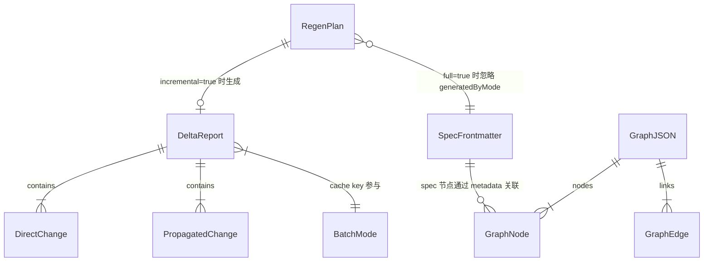

# 数据模型 — F175 Batch Incremental Wrapper

**生成于**: 2026-06-06（plan 阶段）

---

## 1. 核心实体关系

```
RegenPlan（输出）                   BatchMode（已有，不变）
├── incremental: boolean           └── 'full' | 'reading' | 'code-only'
├── full: boolean   ← full|force   RegenPlan 与 BatchMode 正交：
│                     合并后唯一真值    两者互不改写对方的默认值/枚举。
└── source: RegenPlanSource            但 BatchMode 参与 DeltaRegenerator 的 cache key。
（注：force 仅作输入别名，不作 RegenPlan 输出字段——已合并入 full）

DeltaReport（已有，扩展）
├── mode: 'incremental' | 'full'
├── directChanges: DirectChange[]
├── propagatedChanges: PropagatedChange[]
├── unchangedTargets: string[]
├── regenerateTargets: string[]    ← runBatch 决策的唯一 source of truth
├── totalTargets: number
└── fallbackReason?: string        ← 全量降级原因（首次运行/force/no-existing-specs）

GraphJSON（已有，归一化面扩展）
├── graph.generatedAt              ← byte-stable 比较时剥除（normalizeGraphForWrite）
├── graph.inputHash                ← 基于稳定化内容计算（不含时间戳）
├── nodes: GraphNode[]             ← 写盘前按 id 排序
├── links: GraphEdge[]             ← 写盘前按 source+target+relation 排序
└── hyperedges?: HyperedgeGroup[]  ← 若有，写盘前按 id 排序

SpecFrontmatter（已有）
├── generatedBy: string            ← 所有 spectra spec 都写（含 generate 单文件）→ ⚠️不可作 batch ownership 判定
├── generatedByMode: BatchMode     ← cache key 参与字段 + ★batch 专属 ownership 标记★（孤儿删除必要条件）
└── sourceKind: SpecSourceKind     ← 'canonical' | 'bundle_copy' | 'derived'
```

---

## 2. RegenPlan 类型定义

```typescript
// src/batch/regen-plan.ts

export type RegenPlanSource =
  | 'full'                // full 或 force（已合并）
  | 'incremental-explicit'// 显式 incremental=true（通常无需显式）
  | 'default';            // 未传任何参数 → 默认 incremental=true

// C-2 修订：扁平 3 字段输入。config 合并由各入口在自己现状位置完成
//（CLI 在 src/cli/commands/batch.ts，MCP 在 server.ts 用 `?? fileConfig.x`），
// 本函数只接收"合并后的有效值"，不做 cli/mcp/config 笛卡尔积。
export interface RegenPlanInput {
  incremental?: boolean;  // 已合并：--incremental / mcp.incremental / config.incremental
  full?: boolean;         // 已合并：--full / mcp.full（config 无 full 字段，用 force 表达）
  force?: boolean;        // 已合并：--force / mcp.force / config.force（--full 的等义别名）
}

export interface RegenPlan {
  incremental: boolean;     // true = 走 DeltaRegenerator
  full: boolean;            // true = 绕 DeltaRegenerator + 绕 checkpoint 全量重生成（full|force 合并真值）
  source: RegenPlanSource;
}
```

**解析规则**（在 resolveRegenPlan 内，输入已是各入口合并后的有效值）：
1. `full===true || force===true` → `{ incremental:false, full:true }`（全量，绕 DeltaRegenerator + 绕 checkpoint）
2. `incremental===false`（显式 opt-out，未给 full/force）→ `{ incremental:false, full:false }`（旧"仅看文件存在"兼容路径）
3. 其余（含全 undefined）→ `{ incremental:true, full:false }`（默认翻转 FR-001）

**config 不新增 `full` 字段**（C-2）：`ProjectConfig` 现有 `force`/`incremental` 已够——`--force` 即 `--full` 别名，config 用户用 `force: true` 表达全量。**本 Feature 不改 `project-config.ts` schema**。

**互斥语义**：`full=true` 优先，`incremental` 在 `full=true` 时自动置 `false`（走全量路径，不调 DeltaRegenerator）。

---

## 3. 新增 frontmatter ownership 元数据

批处理产物的 `*.spec.md` frontmatter 现有字段已足够判定 ownership，无需新增字段：

```yaml
# 现有 frontmatter 字段
generatedBy: "spectra-v4.x.x"     # ⚠️ 所有 spectra spec 都写 → 不可作 ownership 判定
generatedByMode: "full"           # ★ batch 专属：cache key + ownership 标记（删除必要条件）
sourceKind: "canonical"           # 'canonical' | 'bundle_copy' | 'derived'
```

需把 `generatedByMode` 纳入 `StoredModuleSpecSummary`（在 `src/panoramic/builders/doc-graph-builder.ts` 的 `extractStoredModuleSpecSummary`/`scanStoredModuleSpecs` 读取）。

**孤儿判定逻辑**（`SpecStore` 现有实现）：
- `sourceKind = 'canonical'` 且对应 `sourceTarget` 文件不存在 → 加入 `orphans` 集合
- `bundle_copy` / `derived` → 不做孤儿判定（源是另一个 spec，不是代码文件）

**ownership 删除边界（缺一不删）**：
- 必须：`orphan.generatedByMode != null`（batch 专属标记；**不可用 `generatedBy`**——它对 `spectra generate` 单文件产物也写入会误判）
- 必须：文件在 `modules/` 受管输出目录内（用 `path.relative(modulesDir, absPath)` 判定 `!rel.startsWith('..')` + `.spec.md` 后缀；**禁字符串 `startsWith` 防 `modules-old/` 目录穿越**）
- 必须：属于 `SpecStore.orphanSpecs()` 返回集合
- 禁止：无 `generatedByMode`、受管目录外、或 `sourceKind` 不明的文件

---

## 4. 实体关系图



---

## 5. 实体 → 接口映射

| 实体 | 接口/函数 | 文件 |
|------|----------|------|
| `RegenPlan` | `resolveRegenPlan(input): RegenPlan` | `src/batch/regen-plan.ts`（新建） |
| `RegenPlan.sourceTarget` | `resolveSourceTarget(group, conflicts, isRoot): string` | `src/batch/regen-plan.ts`（新建） |
| `DeltaReport` | `DeltaRegenerator.plan(options): Promise<DeltaReport>` | `src/batch/delta-regenerator.ts`（已有）|
| `GraphJSON` 归一化 | `normalizeGraphForWrite(graphJson, options?): void` | `src/panoramic/graph/graph-builder.ts`（扩展）|
| 孤儿识别 | `SpecStore.orphanSpecs(): StoredModuleSpecSummary[]` | `src/spec-store/spec-store.ts`（已有）|
| 孤儿删除 | 在 `batch-orchestrator.ts` 调用方实现 | `src/batch/batch-orchestrator.ts`（扩展）|
