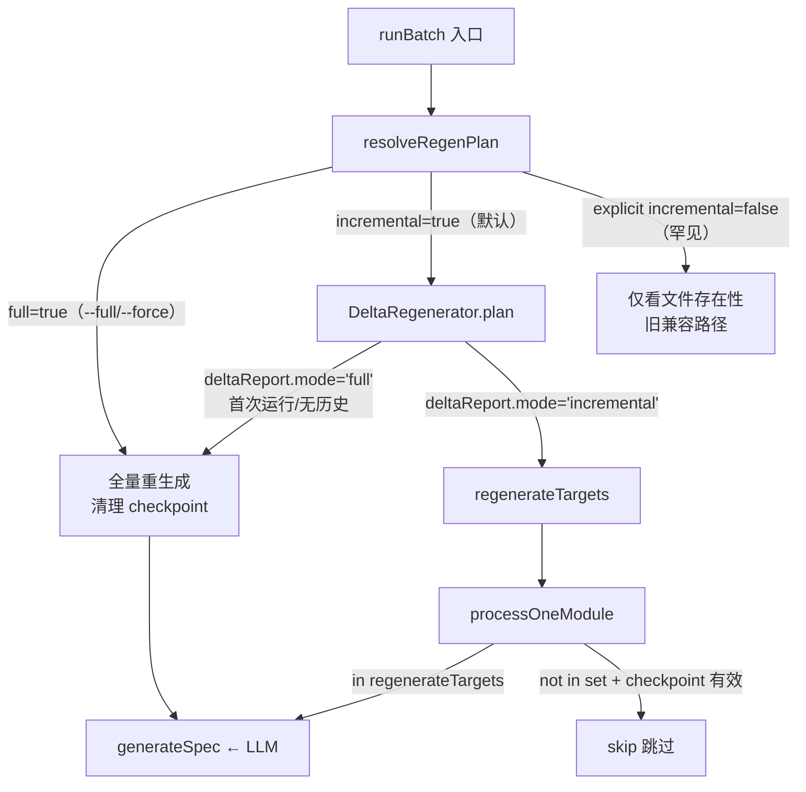
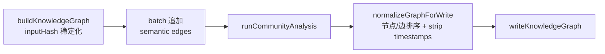

# Implementation Plan: F175 — Batch Incremental Wrapper

**Branch**: `175-batch-incremental-wrapper` | **Date**: 2026-06-06 | **Spec**: `spec.md`
**Input**: `specs/175-batch-incremental-wrapper/spec.md`（19 FR / 9 EC / 7 SC，双轮 Codex 审查通过，GATE_DESIGN 决议完成）

---

## Summary

Feature 175 做三件事：

**Task A — 默认翻转**：将 `runBatch` 的 `incremental` 选项默认值从 `false` 翻转为 `true`，使 `DeltaRegenerator`（skeleton-hash + BFS 传播）成为默认路径。三个入口（CLI `parse-args.ts`、MCP `server.ts`、`batch-orchestrator.ts`）的默认值通过新增的 `resolveRegenPlan` 统一解析函数归一化，消除漂移风险。

**Task B — regen 轴 CLI 语义清晰化**：新增 `--full` flag 作为显式全量逃生口，与 `--mode full`（质量维度）在措辞和语义上明确隔离。现有 `--force` 保留，`--full` 定义为 `--force` 的功能超集（regen 轴全量 + 绕 cache），`--force` 作为向后兼容别名保留。三入口语义一致。

**Task C — byte-stable 归一化**：在写盘边界（`writeKnowledgeGraph` 调用前）对 `graph.json` 执行统一归一化：(1) 剥除所有时间戳来源（顶层 `generatedAt` + 折叠进 `inputHash` 的嵌套时间戳），(2) 节点/边/超边按确定性 key 排序，(3) 归一化发生在 batch 追加 semantic edges 之后。

技术方案全部基于现有能力（`DeltaRegenerator`、`SpecStore`、`graph-builder.ts`）的接通与归一化，零新依赖引入。

---

## Technical Context

**语言/版本**: TypeScript 5.x + Node.js 20.x  
**主要依赖**: 零新引入（`ts-morph`、`crypto`、`fs`、`path` 均已存在）  
**存储**: 文件系统（`specs/` 输出目录、`_meta/graph.json`）  
**测试**: vitest（单测 + E2E，沿用 `tests/e2e/batch-pipeline.e2e.test.ts` 范式）  
**目标平台**: Node.js 20.x，macOS / Linux CI  
**性能目标（goal，非门禁）**: 改 1 文件 < 5 min，cache hit < 30 sec（在 ~250 模块中型 TS 项目）  
**门禁口径（SC-002）**: 无模块级 LLM 调用（`generateSpec` 调用次数 = 0）  
**范围/规模**: 6 个目标文件，新增约 300-400 LOC（含 `resolveRegenPlan`、`normalizeGraphForWrite`、E2E 测试）

---

## Codebase Reality Check

对每个将被修改的目标文件逐一扫描：

| 文件 | LOC | 公开接口数 | 已知 debt | 本次新增约 | 是否触发 [CLEANUP] |
|------|-----|-----------|----------|----------|-----------------|
| `src/batch/batch-orchestrator.ts` | 2095 | 8 个导出函数 | 无 TODO/FIXME；`runBatch` 函数本体超 1600 LOC（严重超长，属历史债，不在本 Feature 范围内修复） | ~100 LOC（checkpoint×regen 交互、`--full` 解析分支、孤儿删除调用） | **是**（LOC > 500 且新增 > 50 行 → 触发前置清理规则；但 `runBatch` 超长函数拆分风险极高，前置清理范围限定为：提取 `resolveRegenPlan` + `normalizeGraphForWrite` 两个纯函数，不拆 `runBatch` 主体）|
| `src/cli/utils/parse-args.ts` | 935 | 1 个导出函数（`parseArgs`） | 无标记；批量 flag 解析用 `argv.includes` 线性扫描，可读性一般 | ~30 LOC（`--full` flag 解析 + 帮助文案更新） | 否（新增 < 50 行，无相关 TODO）|
| `src/mcp/server.ts` | 255 | 1 个导出函数（`createMcpServer`） | 无标记 | ~10 LOC（`incremental` 默认值调整、新增 `full` 参数 schema） | 否 |
| `src/batch/delta-regenerator.ts` | 343 | 1 个导出类（`DeltaRegenerator`） | 无标记；target 口径使用 `group.dirPath` 需与 `batch-orchestrator.ts` 对齐 | ~20 LOC（target 口径归一化，提取共享 `resolveSourceTarget` 函数） | 否 |
| `src/panoramic/graph/graph-builder.ts` | 462 | 3 个导出函数 | 无标记；`buildKnowledgeGraph` 中 `inputHash` 时间戳问题是本 Feature 核心修复点 | ~50 LOC（`normalizeGraphForWrite` 函数 + 确定性排序） | 否（新增 < 50 行）|
| `src/spec-store/spec-store.ts` | 242 | 1 个导出类（`SpecStore`） | 无标记；`orphanSpecs()` 已实现孤儿识别，缺实际删除调用方 | ~20 LOC（新增 `deleteOrphanFiles` 辅助方法或在调用方处理） | 否 |

**前置清理结论**：`batch-orchestrator.ts` 满足 LOC > 500 且新增 > 50 行的条件，触发前置 `[CLEANUP]` task。清理范围严格限定为：
1. 从 `runBatch` 提取 `resolveRegenPlan`（纯函数，消除三处默认值漂移）
2. 从 `runBatch` 提取 `normalizeGraphForWrite`（纯函数，byte-stable 排序归一化）

这两个提取本是 REFACTOR 阶段的内容，提前到 CLEANUP task 执行，降低 GREEN 阶段主体实现的认知负担。

---

## Impact Assessment

| 维度 | 评估 |
|------|------|
| **直接修改文件** | 6 个目标文件 + 新增 E2E 测试文件 1 个 + 新增单测文件 2-3 个 |
| **间接受影响** | `src/cli/commands/batch.ts`（读取 CLI parse 结果传给 `runBatch`）、`scripts/baseline-collect.mjs`（需加 `--full` flag）、`scripts/eval-task-runner.mjs`（评估已走 `--mode code-only` 但不传 `incremental`，翻转后 cache 可能命中） |
| **跨包影响** | 跨 `src/cli/`、`src/batch/`、`src/panoramic/graph/`、`src/spec-store/`、`src/mcp/`、`scripts/` 六个顶层模块边界 |
| **数据迁移** | 无 schema 变更；`generatedByMode` frontmatter 字段已存在；孤儿删除为文件系统操作，无持久化 schema 变更 |
| **API/契约变更** | **是**：(1) MCP batch tool schema 新增 `full: boolean` 可选参数，`incremental` 默认值语义翻转（原 `undefined = false`，翻转后 `undefined = true`）；(2) CLI 新增 `--full` flag；(3) `runBatch` options 新增 `full?: boolean` 字段 |
| **风险等级** | **HIGH** |

**HIGH 风险判定依据**：
- 影响文件 > 20（直接 6 + 间接至少 4）
- 跨包影响 > 2（共 6 个顶层包边界）
- 修改公共 API 契约（MCP schema 语义变更：`incremental` 默认值翻转 + 新增 `full` 参数）
- **默认值翻转是破坏性行为**：所有未显式传 `incremental` 的现有调用方，翻转后行为静默改变（从"仅看文件是否存在"变为"skeleton-hash 增量决策"）

**HIGH 风险强制分阶段**：实现必须拆分为 3 个可独立验证的阶段。

---

## Constitution Check

| 原则 | 适用性 | 评估 | 说明 |
|------|--------|------|------|
| **I. 双语文档规范** | 适用 | PASS | plan/research/data-model 等制品全部使用中文散文 + 英文代码标识符 |
| **II. Spec-Driven Development** | 适用 | PASS | 本 Feature 通过完整的 spec → plan → tasks → implement 流程执行，不直接改源码 |
| **III. YAGNI / 奥卡姆剃刀** | 适用 | PASS | `resolveRegenPlan` 和 `normalizeGraphForWrite` 均有立即使用场景（消除三处漂移、byte-stable 验收），无过早抽象；task D（F156 snapshot 复用）已明确拆出，不纳入 |
| **IV. 诚实标注不确定性** | 适用 | PASS | 不确定项（`eval-task-runner.mjs` 影响面）在 plan 中明确标注 |
| **V. AST 精确性优先** | 部分适用 | PASS | 增量决策基于 skeleton-hash（AST 提取），不引入 LLM 猜测 |
| **VI. 混合分析流水线** | 适用 | PASS | 不改变现有三阶段流水线结构 |
| **VII. 只读安全性** | **需注意** | PASS with caveat | FR-017 孤儿删除属写操作，但作用于 `specs/` 输出目录（batch 生成产物），不作用于源代码；ownership 判定确保不误删用户手写文件。此为 spec 明确规定的合规写操作 |
| **VIII. 纯 Node.js 生态** | 适用 | PASS | 零新依赖，使用已有 `crypto`、`fs`、`path` |
| **XIII. 向后兼容** | **重点** | PASS with note | CLI `--force` 保留并作为 `--full` 别名；MCP `incremental` 参数名保留；config 文件 `incremental: false` 可显式 opt-out。**默认值翻转本身是有意的行为变更（spec 明确要求），不属于"破坏现有用户体验"，属于功能升级** |
| **XIV. 可观测性与架构守护** | 适用 | PASS | `resolveRegenPlan` 提取使三入口决策可追踪；孤儿删除记录日志 |

**Constitution Check 结论**：无 VIOLATION，无需豁免。原则 VII 的孤儿删除是 spec 明确规定、有 ownership 边界保护的合规写操作，不构成违规。

---

## Project Structure

```text
specs/175-batch-incremental-wrapper/
├── spec.md              # 需求规范（已完成）
├── plan.md              # 本文件
├── research.md          # 技术决策研究（本阶段产出）
├── data-model.md        # 数据模型（本阶段产出）
├── quickstart.md        # 快速上手指南（本阶段产出）
├── contracts/
│   ├── mcp-batch-schema.md     # MCP batch tool schema 变更契约
│   └── cli-flags-contract.md   # CLI flag 语义边界契约
└── tasks.md             # 任务清单（下阶段产出）
```

**源码改动文件**：

```text
src/
├── batch/
│   ├── batch-orchestrator.ts     # Task A/B/C 主改动：默认翻转 + --full + checkpoint 修复 + 孤儿删除调用
│   └── delta-regenerator.ts     # target 口径归一化（FR-019）
├── cli/
│   └── utils/
│       └── parse-args.ts        # --full flag 解析（Task B）
├── mcp/
│   └── server.ts                # incremental 默认翻转 + full 参数（Task A/B）
├── panoramic/
│   └── graph/
│       └── graph-builder.ts     # normalizeGraphForWrite + inputHash 稳定化（Task C）
└── spec-store/
    └── spec-store.ts            # 孤儿删除辅助（FR-017）

# 新增（CLEANUP + REFACTOR 阶段提取）
src/batch/regen-plan.ts          # resolveRegenPlan 纯函数（消除三处默认值漂移）

tests/
├── e2e/
│   └── feature-175-batch-incremental.e2e.test.ts   # 新增（FR-009/SC-007）
└── unit/
    ├── batch/
    │   ├── regen-plan.test.ts   # resolveRegenPlan 单测
    │   └── batch-orchestrator-incremental.test.ts  # 默认翻转 + mode×incremental 正交矩阵
    └── graph/
        └── graph-builder-normalize.test.ts         # byte-stable 归一化单测

scripts/
└── baseline-collect.mjs         # 加 --full flag（OQ-4 决议）
```

---

## Architecture

### resolveRegenPlan 设计（REFACTOR 核心）

**函数签名**（放置于新文件 `src/batch/regen-plan.ts`）—— **C-2 修订：扁平 3 字段输入，不做 cli/mcp/config 笛卡尔积**：

```typescript
/**
 * 已"按入口各自完成 config 合并后"的有效 regen 信号。
 * 三个字段均为 optional：undefined 表示"该入口未给出"，由 resolveRegenPlan 落默认。
 * 注意：config 合并不在本函数内做——CLI 在 `src/cli/commands/batch.ts` 合并（现状如此），
 * MCP 在 `server.ts` 用 `?? fileConfig.x` 合并（现状如此）。本函数只接收合并后的有效值。
 */
export interface RegenPlanInput {
  incremental?: boolean;  // 来自 --incremental / mcp.incremental / config.incremental（已合并）
  full?: boolean;         // 来自 --full / mcp.full（config 无此字段，见下）
  force?: boolean;        // 来自 --force / mcp.force / config.force（已合并，向后兼容别名）
}

export interface RegenPlan {
  /** 是否走增量路径（true = DeltaRegenerator 决策） */
  incremental: boolean;
  /** 是否强制全量（绕过所有 cache + checkpoint）。full 与 force 合并后的唯一真值 */
  full: boolean;
  /** 决策来源，用于日志追踪（force 已并入 full，不单列） */
  source: 'full' | 'incremental-explicit' | 'default';
}

/**
 * 统一解析 regen 计划（唯一默认值来源，消除三处漂移 FR-002）。
 * 规则（按优先级）：
 * 1. full===true || force===true → { incremental:false, full:true }（绕 DeltaRegenerator + 绕 checkpoint）
 * 2. incremental===false（显式 opt-out 但未给 full/force）→ { incremental:false, full:false }（旧"仅看文件存在"兼容路径）
 * 3. 其余（含全 undefined）→ { incremental:true, full:false }（默认翻转，FR-001）
 */
export function resolveRegenPlan(input: RegenPlanInput): RegenPlan;
```

**为何不加 config.full**：现有 `ProjectConfig`（`src/config/project-config.ts:13`，仅 `force`/`incremental`）**无需扩 schema**——因 `--force` 是 `--full` 的等义别名，config 用户用现有 `force: true` 即可表达"全量"。**本 Feature 不改 `project-config.ts` 的 schema/validator/merger**（C-2 修订：避免无谓扩面）。

**三入口接入方式（C-2 修订：合并在各入口现状位置，resolveRegenPlan 只收有效值）**：
- CLI：`parse-args.ts` 解析 `--full`/`--force`/`--incremental` flag 存在性 → `src/cli/commands/batch.ts`（现有 config 合并点 `:47`）合并 config 后调用 `resolveRegenPlan({ incremental, full, force })`，结果写入传给 `runBatch` 的 options
- MCP：`server.ts` 现有 `incremental ?? fileConfig.incremental`、`force ?? fileConfig.force` 合并后，连同新增 `full` 参数传入 `resolveRegenPlan({ incremental, full, force })`
- `runBatch`（`batch-orchestrator.ts`）：接收已解析的 `RegenPlan`（或在入口对未走 resolver 的直接调用方兜底调用一次 `resolveRegenPlan`），删除原 `:388` 的 `incremental = false` 硬编码——默认值唯一由 `resolveRegenPlan` 决定

**`--full` 与 `--force` 语义边界（OQ-1 决议落地）**：

| Flag | 语义 | 是否绕 DeltaRegenerator | 是否清 checkpoint |
|------|------|----------------------|-----------------|
| `--full` | regen 轴全量：重生成所有模块，绕过所有 cache | 是（`full=true` → `forceFullRegeneration=true`） | 是（FR-016）|
| `--force` | 向后兼容别名，与 `--full` 完全等效 | 是 | 是 |
| `--incremental` | 显式声明增量（默认即如此，通常不需要显式传） | 否（走 DeltaRegenerator） | 否 |
| 未传任何参数 | 默认增量 | 否 | 否 |

`--force` 原语义（"强制重新生成所有 spec"）与 `--full` 完全重叠，两者合并为 `full=true`；`--force` 作为别名保留，不废弃，以保证 `baseline-collect.mjs` 等外部脚本的向后兼容。

**W-1 可观测性取舍（已记录为可接受）**：现状 `--force + incremental` 会在 `deltaReport` 写 `fallbackReason='force-enabled'`（`batch-orchestrator.ts:470`）、checkpoint 写 `forceRegenerate` 标记（`:626`）。合并后 `--full`/`--force` 解析为 `incremental=false`（直接全量，不进 DeltaRegenerator），这些信号将不再产生。**取舍判定：可接受**——这些是内部诊断信号非契约；但为保留可观测性，GREEN 阶段 SHOULD 在 full 路径打一条等效日志（`[regen] full regeneration (source=--full|--force)`），使运行模式仍可从日志判读。

**`--help` 措辞区分**：

```
--full            全量重生成所有模块（regen 轴，绕过增量 cache）。
                  注：与 --mode full（文档完整度维度）无关。
--force           同 --full（向后兼容别名）
--mode <value>    spec 文档质量维度：full（默认，完整文档）|
                  reading（轻量）| code-only（纯 AST，无 LLM）
                  注：与 --full（regen 轴）正交，可同时指定。
```

### byte-stable 归一化方案（Task C）

**新增函数 `normalizeGraphForWrite`**（放置于 `graph-builder.ts` 或单独的 `graph-normalize.ts`）：

```typescript
/**
 * 写盘前归一化 GraphJSON，使全量与增量产物字节稳定。
 * 必须在 batch 追加 semantic edges 之后调用（batch-orchestrator.ts:1365-1367 之后）。
 *
 * 归一化面：
 * 1. 顶层 generatedAt → 固定为 epoch（"1970-01-01T00:00:00.000Z"）或从外部注入（测试可控）
 * 2. inputHash 的来源（docGraph.generatedAt / architectureIR.generatedAt）→
 *    在 buildKnowledgeGraph 调用前，将这两个时间戳归一化为空字符串后再计算 hash
 * 3. nodes 按 id 字典序排序（tie-breaker：id 唯一，无需二级 key）
 * 4. links 按 source + target + relation 三元组字典序排序
 * 5. hyperedges（若有）按 id 字典序排序
 *
 * @param graphJson 已追加所有边（含 semantic edges）的 GraphJSON（in-place 修改）
 * @param options.generatedAt 可注入确定性时间戳（生产环境不传，写盘时仍保留原始值但节点/边排序稳定）
 */
export function normalizeGraphForWrite(
  graphJson: GraphJSON,
  options?: { stripTimestamps?: boolean }
): void;
```

**归一化调用位置**（`batch-orchestrator.ts`，在社区分析后、`writeKnowledgeGraph` 前）：

```typescript
// 社区分析完成后写盘（graphJson 已含 degree metadata）
// F175：写盘前归一化（byte-stable，FR-006/FR-007）
normalizeGraphForWrite(graphJson);
const graphWrittenPath = writeKnowledgeGraph(graphJson, resolvedOutputDir);
```

**inputHash 稳定化**（`graph-builder.ts:412-425`）—— **C-1 修订：必须保留内容敏感性，禁止用 count 替代**：

`inputHash` 的契约（`graph-types.ts:172`）是"输入内容 hash（SHA-256 前 16 位）"，用于 graph cache 失效判定。**绝不能**把它退化成 `nodeCount:edgeCount`——两个内容不同但 node/edge 数相同的 docGraph 会撞 hash → 静默返回 stale cache（C-1）。

正确做法：**剥时间戳 + 保留内容 SHA-256** 两者并行：

```typescript
// 修改前（时间戳漂移，导致 inputHash 每次都变 → byte-stable 失败）：
if (dg.generatedAt) hashParts.push(dg.generatedAt);
if (ir.generatedAt) hashParts.push(ir.generatedAt);

// 修改后（去掉 generatedAt 后对"内容"做稳定 SHA-256，既稳定又保留内容敏感性）：
// canonicalize：深拷贝并剥除 generatedAt 等非确定性字段，再 JSON.stringify（key 有序）
const dgCanonical = stripVolatileFields(dg);   // 去 generatedAt（及其它每次必变字段），保留 nodes/edges 全部内容
const irCanonical = stripVolatileFields(ir);
if (dg) hashParts.push(`docGraph:${sha256(stableStringify(dgCanonical))}`);
if (ir) hashParts.push(`architectureIR:${sha256(stableStringify(irCanonical))}`);
```

- `stripVolatileFields`：仅移除每次运行必变的时间戳类字段（`generatedAt` 等），**保留全部语义内容**
- `stableStringify`：key 有序序列化，保证同内容同字符串（复用现有工具或新增 helper）
- 这样 byte-stable（FR-006）与 cache 内容敏感性同时满足；tasks 阶段须有单测：内容变 → inputHash 变；仅时间戳变 → inputHash 不变

**byte-stable 验收口径**（OQ-3 已锁定方案 A）：严格 deepEqual（剥 `generatedAt` + 归一化排序后 JSON 完全一致）。

### checkpoint × regen 交互修复（FR-016）

**现状问题**：`completedPaths.has(moduleName)` 在 `processOneModule` 的最顶部（`:711`），先于 regen 决策 + target 计算（`:713`）执行，导致 `--full` 时 checkpoint 命中可绕过全量语义。

**修复方案（C-3 修订：full/force 在 checkpoint *加载时* 清空 state，而非运行时"忽略"；target 计算移到 checkpoint 判定之前）**：

**(1) checkpoint 加载阶段（`:612-637`）**——full/force 时丢弃旧 completed state，避免脏 state 在中途崩溃后被 resume 复用：

```typescript
// F175 FR-016：full/force 启动时清空已加载的 checkpoint completed set
// （不能仅在 processOneModule 里"忽略"——否则旧 completedModules 会保留到 :1717 才清，
//  期间崩溃 resume 会用脏 set 跳过应重跑的模块）
if (regenPlan.full) {
  completedPaths.clear();           // 清空内存 set
  // 同时使磁盘 checkpoint 的 completed 失效（重写为空或标记 full-run）
}
```

**(2) `processOneModule` 内**——先算 target，再做 checkpoint 判定，且增量分支用 delta 命中使 checkpoint 失效：

```typescript
async function processOneModule(moduleName: string): Promise<void> {
  const group = moduleGroups.get(moduleName);
  if (!group) return;

  // 先计算 moduleSourceTarget（原 :713 之后的逻辑前移到 checkpoint 判定之前）
  const moduleSourceTarget = resolveSourceTarget(group, conflictingDirPaths, isRoot);

  // checkpoint 判定：full 已在加载时清空 set，故此处 completedPaths 必为干净
  if (completedPaths.has(moduleName)) {
    // 增量 resume：checkpoint 命中但本轮 delta 要求重生成 → 失效，继续重跑
    const mustRegen = regenPlan.incremental && regenerateTargets.has(moduleSourceTarget);
    if (!mustRegen) return;  // 真正的 cache hit / 全量已清空场景到不了这里
  }
  // ... rest of logic（复用已算好的 moduleSourceTarget）
}
```

要点：full 路径下 `completedPaths` 在加载时已 `clear()`，故 `completedPaths.has` 永远 false → 全部重跑（FR-016/SC-005）；增量 resume 下 delta 命中的模块即便 checkpoint 标记 completed 也会重跑（修复"已完成但其后又变更"）。

### 孤儿 spec 删除（FR-017 / EC-009）

**调用位置**：在 `batch-orchestrator.ts` 完成所有模块处理后、构建 `SpecStore` 时：

```typescript
const specStore = new SpecStore({ currentSpecs, storedSpecs, projectRoot, toProjectPath });
// F175 FR-017/EC-009：删除孤儿 spec —— ownership 边界：generatedByMode 存在为删除的【必要条件】
if (incremental || regenPlan.full) {
  const orphans = specStore.orphanSpecs();
  for (const orphan of orphans) {
    // C-4 修订：必须是 batch 自身生成的产物才删（generatedByMode 专属，非 generatedBy）
    if (orphan.generatedByMode == null) continue;            // 无 generatedByMode → 跳过（防误删手写 / 单文件 generate 产物）
    const absPath = path.join(resolvedRoot, orphan.outputPath);
    if (!isInManagedOutputDir(absPath, modulesDir)) continue; // 受管 modules/ 目录外 → 跳过（C3：path.relative 判定）
    logger.info(`[orphan-cleanup] 删除孤儿 spec: ${orphan.outputPath}`);
    fs.rmSync(absPath, { force: true });
  }
}
// isInManagedOutputDir：用 path.relative 防目录穿越（禁 startsWith）
// const rel = path.relative(modulesDir, path.resolve(absPath));
// return !rel.startsWith('..') && !path.isAbsolute(rel) && absPath.endsWith('.spec.md');
```

**Ownership 边界判定（C-4 修订：纠正与代码相反的论证）**：

经核查代码，原 plan 的论证**与实现相反**——`getDefaultSourceKind(undefined)` 返回 `'canonical'`（`spec-identity.ts:21`），`SpecStore` 会把 sourceTarget 缺失（源文件已删）的 spec 加入 orphan 集合（`spec-store.ts:118`），而 `scanStoredModuleSpecs`（`doc-graph-builder.ts:400`）**不读取 `generatedBy`**。因此**无生成元数据的手写 spec 不会被自动排除，反而可能被删**。

修复（必要条件，缺一不删）：
1. **`generatedByMode` 必须存在**（C2 修订：**不是 `generatedBy`**）：`generateFrontmatter`（`src/generator/frontmatter.ts:93-98`）对所有 spectra 生成的 spec（含 `spectra generate` 单文件）都写 `generatedBy`，故 `generatedBy != null` 会把单文件产物也误判为 batch 产物。**batch 专属标记是 `generatedByMode`**（runBatch 写入 `batch-orchestrator.ts:792-794`）。把 `generatedByMode` 纳入 `StoredModuleSpecSummary`（在 `src/panoramic/builders/doc-graph-builder.ts` 的 `extractStoredModuleSpecSummary`/`scanStoredModuleSpecs` 读取——**注意该类型与函数在 doc-graph-builder.ts，非 spec-store.ts**），`isBatchGenerated(orphan) = orphan.generatedByMode != null`。
2. **位于受管 `modules/` 输出目录内**（C3 修订：用 `path.relative` 防目录穿越，禁字符串 `startsWith`）：`const rel = path.relative(modulesDir, path.resolve(absPath)); !rel.startsWith('..') && !path.isAbsolute(rel) && absPath.endsWith('.spec.md')`，`modulesDir` 取自 `src/panoramic/output-filenames.ts:49-52`。
3. 旧版本 batch 产物可能缺 `generatedByMode`——宁可少删（保留旧孤儿）也不误删；byte-stable 文件集收敛口径（SC-003/FR-017）相应说明"仅收敛带 `generatedByMode` 的 batch 产物"，旧无元数据孤儿作为已知残差（用户手动清理或后续 Feature 迁移补元数据）。

### target 口径归一化（FR-019）

**共享函数 `resolveSourceTarget`**（提取到 `src/batch/regen-plan.ts` 或 `src/batch/delta-utils.ts`）：

```typescript
/**
 * 统一计算模块的 sourceTarget 路径。
 * DeltaRegenerator（collectCurrentSnapshots）和 runBatch（processOneModule）
 * 必须使用同一逻辑，消除 target 口径错位（FR-019）。
 */
export function resolveSourceTarget(
  group: ModuleGroup,
  conflictingDirPaths: Set<string>,
  isRoot: boolean,
): string;
```

### TDD 分阶段映射

#### Phase 0：前置 [CLEANUP]（仅新增函数定义 + 单测，**不插入调用点、不改产物**）

**W-2 修订**：Phase 0 只做"结构提取"，**绝不插入任何调用点**（插入 `normalizeGraphForWrite` 调用会立即改变 graph.json 产物结构，那不是"行为不变"）。Phase 0 仅：
- 新增 `src/batch/regen-plan.ts`：定义 `resolveRegenPlan`（默认值此时实现为**保持 `incremental=false`** 以维持行为不变）+ `resolveSourceTarget` 纯函数 + 单测
- 新增 `normalizeGraphForWrite` 函数定义（在 `graph-builder.ts` 或新 `graph-normalize.ts`）+ 单测，并从 `src/panoramic/graph/index.ts` 导出（当前只导出 3 个函数，见 I-1）。**此阶段不在 batch 写盘序列里调用它**。
- `resolveSourceTarget`：提取共享逻辑但**调用方仍走原内联逻辑**（或替换为等价调用，经单测证明输出逐字节一致）

**默认翻转（incremental=true）、调用点插入、inputHash 改写均放到 Phase 2 GREEN**——Phase 0 后产物与改动前完全一致。

**验证点**：`npx vitest run`（现有全部 + 新单测通过；N_baseline 动态基线，见 tasks.md），`npm run build` 零错误，且对同一 fixture 跑 batch 的 graph.json 与 Phase 0 前**逐字节一致**（证明零产物变更）。

#### Phase 1：RED — 测试先行

先写失败的测试，锁定所有验收条件：

**E2E 测试**（`tests/e2e/feature-175-batch-incremental.e2e.test.ts`）：
- 改文件→仅受影响模块重生成（SC-001 / FR-018 独立断言）
- 无改动→零模块级调用（SC-002）
- 显式 `--full`→全量调用（SC-005 / FR-016）
- mode 切换→cache miss（FR-013）
- 孤儿删除文件集收敛 + ownership 边界（FR-017 / EC-009）
- 含 checkpoint 的 force（FR-016）
- 目录冲突 target 口径（FR-019）
- BFS 依赖传播（FR-018：构造 A→B 依赖，改 B 验证 A 重生成）

**单测**：
- `regen-plan.test.ts`：`resolveRegenPlan` 三入口 + 优先级矩阵
- `batch-orchestrator-incremental.test.ts`：默认翻转 + mode×incremental 正交矩阵（3×2 = 6 组合）
- `graph-builder-normalize.test.ts`：byte-stable deepEqual 验证

**验证点**：所有新测试 RED（当前实现不满足），现有全部测试仍 GREEN。

#### Phase 2：GREEN — 功能实现

按 FR 顺序实现：
1. `resolveRegenPlan` 默认值改为 `incremental=true`（FR-001/FR-002）→ CLI/MCP/runBatch 三入口接入
2. `--full` flag 解析（`parse-args.ts`）+ MCP `full` 参数（`server.ts`）（FR-003）
3. checkpoint × regen 交互修复（FR-016）
4. `normalizeGraphForWrite` 完整实现 + `inputHash` 稳定化（FR-006/FR-007）
5. 孤儿删除调用（FR-017）
6. `baseline-collect.mjs` 加 `--full` flag（FR-014/OQ-4）

**FR 到阶段映射**：

| FR | Phase | 说明 |
|----|-------|------|
| FR-001, FR-002 | GREEN | 默认翻转 + `resolveRegenPlan` 接入 |
| FR-003 | GREEN | `--full` flag + MCP `full` 参数 |
| FR-004 | Phase 0 | 参数解析正交（`--full` 不改 `--mode`）|
| FR-005 | GREEN（`DeltaRegenerator` 已实现） | mtime 不变（翻转默认后自动满足）|
| FR-006, FR-007 | GREEN | `normalizeGraphForWrite` + `inputHash` 稳定化 |
| FR-008 | GREEN | 零 `generateSpec` 调用（cache hit 验收）|
| FR-009 | RED | E2E 测试编写 |
| FR-010 | REFACTOR 后验证 | 存量测试零失败（N_baseline）|
| FR-011 | GREEN | force 优先级在 `resolveRegenPlan` 明确 |
| FR-012 | 已实现（`DeltaRegenerator` EC-006 路径）| 验证覆盖即可 |
| FR-013 | 已实现（mode-aware cache）| E2E 覆盖 |
| FR-016 | GREEN | checkpoint × regen 修复 |
| FR-017 | GREEN | 孤儿删除 + ownership 边界 |
| FR-018 | RED + GREEN | BFS 传播独立断言 E2E |
| FR-019 | Phase 0 | `resolveSourceTarget` 提取 |

**验证点**：所有新测试 GREEN，`npx vitest run` 全量零失败，`npm run build` 零错误。

#### Phase 3：REFACTOR — 整理

- 确认 `resolveRegenPlan` 已被三处调用，原 `incremental = false` 硬编码已移除
- 确认 `resolveSourceTarget` 被 `DeltaRegenerator` 和 `processOneModule` 共用
- 清理 Phase 0 遗留的临时注释
- 补全帮助文案（`--full` / `--force` / `--mode` 三者独立描述）
- `eval-task-runner.mjs` 评估：当前调用 `spectra batch --mode code-only`，未传 `incremental`，翻转后走 DeltaRegenerator。由于 eval worktree 是新 clone，无历史 spec，DeltaRegenerator 退化为全量（EC-006 路径），行为等效，**无需修改**（记录为已评估）

**验证点**：`npx vitest run`（含新 E2E，全量零失败）+ `npm run build` + `npm run repo:check`。

---

## Mermaid 架构图

### regen 决策流程（翻转后）



### byte-stable 写盘流程



---

## Complexity Tracking

| 决策 | 为何采用 | 简单替代方案及排除理由 |
|------|---------|----------------------|
| `resolveRegenPlan` 提取为独立文件 `regen-plan.ts` | 三处入口（CLI/MCP/runBatch）需引用，放 `batch-orchestrator.ts` 内会造成 `parse-args.ts` 对 `batch-orchestrator.ts` 的循环依赖 | 直接在 `batch-orchestrator.ts` 内改三处默认值：无法消除漂移，维护困难 |
| `normalizeGraphForWrite` 在写盘边界调用（非 `buildKnowledgeGraph` 内部） | semantic edges 在 `buildKnowledgeGraph` 返回后才追加（batch-orchestrator.ts:1365-1367），仅在 graph-builder 内排序不够；在写盘前调用才能覆盖完整边集 | 在 `buildKnowledgeGraph` 返回前排序：不能覆盖后追加的边，FR-007 不达标 |
| `--force` 作为 `--full` 别名保留（不废弃） | `baseline-collect.mjs` 和外部脚本使用 `--force`，废弃会导致行为静默变更（`--force` 缺失 → 走增量 → 基线失真） | 只保留 `--full`，移除 `--force`：破坏向后兼容，违反 Constitution XIII |
| OQ-5：项目级聚合（`_index.spec.md`、debt pipeline）不加 fast-path 跳过 | 增加 fast-path 需要判断"所有模块 cache hit"状态，逻辑复杂；当前 SC-002 门禁口径仅为"无模块级 LLM 调用"，已足够 | 加 fast-path：引入额外状态管理，YAGNI；项目级开销作为已知 cost 记录 |

---

## OQ-4 决议：baseline-collect 和 eval 脚本处理

**`scripts/baseline-collect.mjs`**（决议：**显式加 `--full`**，防御性）：
- 现状：`runBatchAndCapture`（`:431-448`）调用 `spectra batch <target> --mode <mode> --output-dir <dir>`，未传 regen 轴参数
- 翻转后行为：走增量（DeltaRegenerator）。当前清理逻辑（`:761-762` `if (fs.existsSync(outputDir)) fs.rmSync(outputDir, {recursive,force})`，在 `:802` 调用 batch 之前）已每次跑前清空 outputDir → 无历史 spec → DeltaRegenerator 退化为全量（EC-006 路径）。**即"今天"不改也能跑全量。**
- **但**：baseline 是长期 perf 回归 guard（Feature 143），其全量语义不应隐式依赖"outputDir 跑前被清"这一实现细节——一旦将来有人改清理逻辑（如做增量 baseline 实验），会静默污染基线。故 **`runBatchAndCapture` 显式追加 `--full`**（FR-014/OQ-4），使"基线永远全量"自文档化、与清理逻辑解耦。
- 改动量：`runBatchAndCapture` 的 args 数组加一个 `'--full'`（~1 行）+ dry-run 校验路径同步（`:486`）。
- **结论**：`baseline-collect.mjs` **需显式加 `--full`**（防御性，in-scope）。

**`scripts/eval-task-runner.mjs`**：
- 现状：`spectra batch --mode code-only --no-html`，未传 incremental
- 翻转后：走 DeltaRegenerator；eval worktree 是 `mkdtempSync` 临时目录或新 clone，无历史 spec → 退化全量
- **结论**：同上，**无需修改**。

**`SWE-Bench cohort 3 / eval 脚本调用方**（OQ-2 决议）：需全量基线者须显式传 `--full`（不依赖默认值）。在 plan 的 contracts 中记录此要求。

---

## SC-002 / OQ-5 决议记录

SC-002 门禁口径锁定为：**"无模块级 LLM 调用"**（`generateSpec` 调用次数 = 0）。项目级聚合（`_index.spec.md` 重写、debt pipeline、graph.json 重写）每轮仍执行，其 LLM 开销（若有）不纳入 SC-002 的门禁断言范围，作为已知 cost 记录。不加 fast-path，YAGNI。

---

*本 plan 基于 `research-synthesis.md`（主编排器亲自核查 7 条架构主张，含 file:line 证据）+ 现场代码扫描（LOC/函数数/TODO 标记核查）生成。所有架构事实来源于实际代码读取，不作假设性猜测。*
