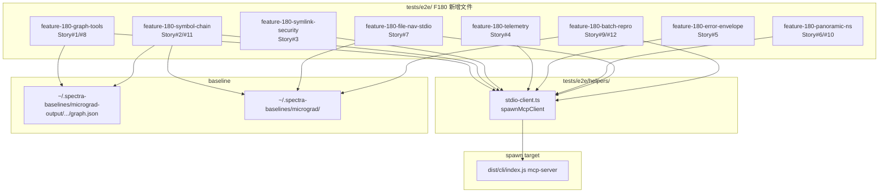

# F180 — 系统性 stdio E2E 补齐：技术实现计划

**Feature**: F180  
**模式**: Story（纯测试新增，零生产代码修改）  
**状态**: 规划中  
**生成时间**: 2026-06-08

---

## Summary

F180 在现有 `tests/e2e/` 目录下新增 **8 个** `*.e2e.test.ts` 文件（按 spawn-config 兼容性分组，而非 12 story 1:1 映射），覆盖 stdio 链路的 12 个用户故事和 FR-001 到 FR-018。所有改动限于 `tests/e2e/`；被测 MCP server 已完全 ship，不修改任何 `src/` 文件。

共享基础设施：抽取轻薄 `tests/e2e/helpers/stdio-client.ts` helper，封装 `spawnMcpClient` 工厂函数，屏蔽不同 env/cwd/graph fixture 的 spawn 差异。

---

## Codebase Reality Check

| 目标文件 | LOC（现状） | 方法数 | 已知 debt |
|---------|-----------|--------|---------|
| `tests/integration/mcp-server-stdio.test.ts` | 204 | 0（纯测试） | 无 TODO/FIXME |
| `tests/e2e/feature-171-file-navigation.e2e.test.ts` | 132 | in-process 直调，无 spawn | 无 |
| `tests/e2e/feature-174-symbol-fuzzy-match.e2e.test.ts` | 238 | mock + in-process | 无 |
| `tests/e2e/feature-175-batch-incremental.e2e.test.ts` | 存在，mock LLM 模式 | 无 stdio spawn | 无 |
| `src/mcp/server.ts` | 255 | 17 工具注册 | 无（本次不修改） |
| `tests/e2e/helpers/stdio-client.ts` | 新建，预计 ~60 行 | 1 个导出函数 | — |

**说明**：现有 9 个 `*.e2e.test.ts` 文件全部采用 in-process 直调或 mock LLM 模式，没有真实 stdio spawn。`tests/integration/mcp-server-stdio.test.ts` 是唯一权威 transport 基座，所有新文件复用其 spawn 模式。

无需前置 cleanup task（现有文件 LOC < 500，无相关 TODO/FIXME，无代码重复超 30 行）。

---

## Impact Assessment

| 维度 | 评估 |
|------|------|
| 直接修改文件 | 新增 9 个文件（8 测试 + 1 helper），不修改任何已有文件 |
| 间接受影响 | 无（仅新增，不改接口） |
| 跨包影响 | 无（仅 `tests/e2e/`） |
| 数据迁移 | 无 |
| API/契约变更 | 无 |
| **风险等级** | **LOW** |

**判定依据**：影响文件 < 10，无跨包影响，无接口变更，无数据迁移。

---

## Technical Context

| 项目 | 值 |
|------|---|
| 语言/版本 | TypeScript 5.x + Node.js 20.x |
| 测试框架 | vitest |
| MCP transport | `@modelcontextprotocol/sdk` `Client` + `StdioClientTransport` |
| spawn 命令 | `node dist/cli/index.js mcp-server` |
| 最低 env | `{ ...process.env, SPECTRA_DEV_DISABLE: '1', CI: '1' }` |
| baseline 位置 | `~/.spectra-baselines/micrograd-output/spectra-full/_meta/graph.json` |
| micrograd 源 | `~/.spectra-baselines/micrograd` |
| dist 前置条件 | `npm run build` 产出 `dist/cli/index.js` |
| 工具注册真值 | **17 个**（server.ts 注释 + 文件头均注明：5 server + 6 graph + 3 agent-context + 3 file-nav）；实现阶段须经 `client.listTools()` 实测确认 |

---

## Architecture

### 核心决策 1：共享 helper 抽取（`tests/e2e/helpers/stdio-client.ts`）

**必要性**：12 个用户故事需要至少 4 种不同 spawn 配置（见下表），无法共用单一 `beforeAll` client。

| spawn-config 类型 | 哪些 story | 关键差异 |
|------------------|-----------|---------|
| `cwd=tempRoot`（baseline graph 拷贝） | #1/#2/#7/#8/#11 | 标准只读配置 |
| `env` 含 `SPECTRA_MCP_TELEMETRY_PATH` | #4 | 独立 telemetry env，afterEach 清理 JSONL |
| malformed graph fixture | #5（graph-query-failed） | graph 特殊构造，单独 spawn |
| `cwd=可写 tempRoot`（micrograd source 拷贝） | #9/#12 | batch 会写文件，需独立 tempRoot |
| `cwd=tempRoot`（含 symlink） | #3 | symlink 测试，安全隔离 |
| 无特殊 graph | #6/#10 | panoramic-query/namespace 独立 |

helper 设计（薄！只封装 spawn 样板）：

```typescript
// tests/e2e/helpers/stdio-client.ts
export interface SpawnMcpClientOpts {
  cwd: string;
  env?: Record<string, string>;
}

export interface McpClientHandle {
  client: Client;
  transport: StdioClientTransport;
  cleanup: () => Promise<void>;
}

export async function spawnMcpClient(opts: SpawnMcpClientOpts): Promise<McpClientHandle>
```

`cleanup` = `client.close()`，tempRoot 清理由各测试文件的 `afterAll` 负责（不在 helper 内删目录，职责分离）。

### 核心决策 2：测试文件分组（8 文件，按 spawn-config 兼容性）

```
tests/e2e/
├── helpers/
│   └── stdio-client.ts              # 共享 helper（新建）
├── feature-180-graph-tools.e2e.test.ts       # Story #1/#8：graph 6工具 + listTools
├── feature-180-symbol-chain.e2e.test.ts      # Story #2/#11：符号链 + fuzzy
├── feature-180-symlink-security.e2e.test.ts  # Story #3：symlink越界
├── feature-180-telemetry.e2e.test.ts         # Story #4：telemetry落盘
├── feature-180-error-envelope.e2e.test.ts    # Story #5：错误envelope + graph-query-failed
├── feature-180-panoramic-ns.e2e.test.ts      # Story #6/#10：panoramic + namespace
├── feature-180-file-nav-stdio.e2e.test.ts    # Story #7：file-nav stdio链路
└── feature-180-batch-repro.e2e.test.ts       # Story #9/#12：batch + reproducibility
```

**分组理由**：
- Story #1 和 #8 共享同一只读 baseline client（`listTools` + graph 工具调用同一子进程）
- Story #2 和 #11 的 fuzzy symbol 测试均需要 baseline graph，symbol 链调用可顺序组合
- Story #9 和 #12 均需要可写 tempRoot（batch 写文件），spawn 配置一致
- Story #6 和 #10 均无需 baseline graph，spawn 最简，合并节约进程数
- Story #3/#4/#5 各有独特 spawn 配置，单文件独立

### 核心决策 3：dist 构建前置与 skipIf 机制

每个文件顶层声明：

```typescript
const PROJECT_ROOT = resolve('.');
const DIST_CLI = join(PROJECT_ROOT, 'dist', 'cli', 'index.js');
const BASELINE_GRAPH = join(homedir(), '.spectra-baselines', 'micrograd-output', 'spectra-full', '_meta', 'graph.json');
const MICROGRAD_SOURCE = join(homedir(), '.spectra-baselines', 'micrograd');

const HAS_DIST = existsSync(DIST_CLI);
const HAS_BASELINE = existsSync(BASELINE_GRAPH);     // 仅需要 baseline 的文件检查
const SHOULD_SKIP = !HAS_DIST || !HAS_BASELINE;
```

不需要 baseline 的文件（#5 的 malformed fixture、#6 的 panoramic 失败路径、#10 的 namespace）只检查 `!HAS_DIST`。

### 核心决策 4：Fixture 策略

| Fixture 类型 | 构造位置 | 生命周期 |
|------------|---------|---------|
| baseline graph 拷贝（只读） | `beforeAll` 内 `copyFileSync` | `afterAll` rmSync tempRoot |
| malformed graph（缺 label） | `beforeAll` 内 `writeFileSync` | `afterAll` rmSync tempRoot |
| micrograd source 拷贝（可写，batch 用） | `beforeAll` 内递归拷贝 | `afterAll` rmSync tempRoot |
| symlink（tempRoot 内指向 /etc） | `beforeAll` 内 `symlinkSync` | 随 tempRoot 一并删除 |
| telemetry JSONL 临时文件 | `afterEach` 清理 | 每用例后 unlink |
| micrograd/nn.py diff（detect_changes 用） | 测试文件内常量 | 无状态，无需清理 |

**malformed graph 构造规格**（FR-006，Story #5 的关键）：

```json
{
  "directed": true,
  "multigraph": false,
  "graph": { "name": "spectra-knowledge-graph", "nodeCount": 1, "edgeCount": 0, "sources": ["unified-graph"], "schemaVersion": "1.0", "generatedAt": "2026-01-01T00:00:00.000Z" },
  "nodes": [{ "id": "test::Foo", "kind": "component", "metadata": { "sourceFile": "test.ts" } }],
  "links": []
}
```

注意：节点有 `id`/`kind`/`metadata` 通过加载校验，但**无 `label` 字段**，`scoreNodes` 访问 `node.label.toLowerCase()` 在查询期抛错。fixture 必须保留 `nodes`/`links` 数组（否则在更早的加载校验处报 graph-not-built，测不到 graph-query-failed）。

### 核心决策 4b：view_file symbolId→lineRange 的 fixture patch（Codex Plan 阶段 Critical 1/2/3）

**问题（实测确认）**：micrograd baseline graph 的 Python node **无 `metadata.lineRange`**（Python adapter 未产出行号），且 node 的 `sourceFile`/`sourcePath` 是**绝对路径**指向原始 baseline 位置。直接 `view_file({ symbolId: 'MLP' })` 会因拿不到 lineRange **静默降级返回前 200 行（假绿）**；而把 `context.definition.file`（绝对路径）传给 `view_file.path` 会被 `resolveSafePath` 的 containment 守卫判 `path-outside-root`。

**正确布局（Story #2/#7 必须遵循）**：

```
tempRoot/
  micrograd/nn.py            # 从 MICROGRAD_SOURCE 拷入（repo-relative 布局）
  micrograd/engine.py
  specs/_meta/graph.json     # baseline 拷贝 + 对目标 node patch lineRange
```

- copied graph.json 上对目标 node（如 `micrograd/nn.py#MLP`）手动 patch `metadata.lineRange = { start, end }`（start/end 取 nn.py 中 MLP 真实行号），使 view_file symbolId 路径有行号可用。
- `view_file` 的 `path` **永远传 tempRoot 内相对路径**（`micrograd/nn.py`），**绝不**传 `definition.file` 的绝对路径。
- symbolId 用**完整相对形式** `micrograd/nn.py#MLP`，不要用裸 `MLP`。
- detect_changes 链（Story #2）：从 `changedSymbols` 里**显式选 component 级 symbol**（`id === 'micrograd/nn.py#MLP'`），不要取 `symbols[0]`（可能是无 lineRange 的模块节点）。

### 核心决策 4c：batch stdio E2E 的 LLM 依赖现实（Codex Plan 阶段 Warning 3）

**问题（实测确认）**：`runBatch` 始终调 `generateSpec` → `callLLM`，仅在 `LLMUnavailableError` 时 AST-only 降级；`mode:'code-only'` 只跳 enrichment 不跳首轮 LLM。故真实 stdio batch 需 LLM 可用（订阅/key），且 spec 文档层有随机性。

**处置**：
- Story #9（batch MCP 路径）降为 **MCP 入参/响应 smoke**：验证 `{incremental:true}` / `{full:true}` 响应结构 + `{mode:'incremental'}` 非法 enum 被拒，**不深验 deltaReport 语义内容**（响应能解析、isError 合理即可），并用 `languages:['python']` 缩到 micrograd 5 文件 + 适当放宽 timeout。
- Story #12（reproducibility）的两次 full batch graph.json byte-equal：graph.json 本身是 AST 派生（F179 byte-stable，与 LLM 随机性无关），但跑两次 full batch 需 LLM 可用。**gate 在 `HAS_LLM_E2E` skipIf 之后**（环境变量显式开启，缺省 skip），作为 dev-machine 守护；keyless CI 自动 skip。byte-stable 的进程内深测仍由 F179 既有测试覆盖，本 stdio 用例是叠加的最强护栏（当环境允许时跑）。
- 实现阶段先实测：在本机 spawn batch 跑一次 micrograd python-only，确认能否完成 + 耗时；据此定 timeout 与 skipIf 阈值。

### 核心决策 5：与现有 9 个 in-process E2E 的边界

不修改任何现有文件。新增文件完全独立。现有文件（feature-171、feature-174、feature-175 等）保持原样。F180 的 stdio 链路补充的是不同测试层次，不替代 in-process 测试。

---

## Mermaid 架构图



---

## Project Structure（新增文件清单）

```
tests/e2e/helpers/stdio-client.ts                   # [新建] spawn 工厂
tests/e2e/feature-180-graph-tools.e2e.test.ts       # [新建] FR-001/FR-009
tests/e2e/feature-180-symbol-chain.e2e.test.ts      # [新建] FR-002/FR-012
tests/e2e/feature-180-symlink-security.e2e.test.ts  # [新建] FR-003
tests/e2e/feature-180-telemetry.e2e.test.ts         # [新建] FR-004
tests/e2e/feature-180-error-envelope.e2e.test.ts    # [新建] FR-005/FR-006
tests/e2e/feature-180-panoramic-ns.e2e.test.ts      # [新建] FR-007/FR-011
tests/e2e/feature-180-file-nav-stdio.e2e.test.ts    # [新建] FR-008
tests/e2e/feature-180-batch-repro.e2e.test.ts       # [新建] FR-010/FR-013
```

不修改文件：`src/**`（FR-018），`tests/integration/**`，`tests/e2e/feature-17*`。

---

## Complexity Tracking

| 决策 | 偏离简单方案 | 理由 |
|------|-----------|------|
| 8 文件分组（而非 12 文件 1:1） | 轻微复杂（1 文件对应多 story） | 共享 spawn-config 减少子进程数；12 文件 1:1 会有大量重复 beforeAll 样板 |
| `spawnMcpClient` helper 抽取 | 轻微抽象（新建目录和文件） | 4 种 spawn-config 如不抽取会导致 200+ 行样板重复 5 次以上；helper 仅 ~60 行，代价小 |
| malformed graph fixture（内联构造） | 无偏离 | 最简方案：直接 writeFileSync 写死 JSON，无需额外依赖 |
| reproducibility 两级断言 | 轻微复杂（两个 it 块） | spec EC-6 要求：第一级失败时第二级仍运行，测试框架不支持单 it 内「失败后继续」 |

---

## Constitution Check

| 原则 | 适用性 | 评估 | 说明 |
|------|--------|------|------|
| 不修改未要求的内容 | 强适用 | PASS | FR-018 硬约束，零生产代码修改 |
| 不使用 `any` 类型 | 适用 | PASS | 所有响应解析使用具名类型断言 |
| 测试规范（vitest + async/await） | 适用 | PASS | 复用现有 vitest 框架 |
| 测试间独立（无共享可变状态） | 适用 | PASS | 每个分组文件的 client 在 beforeAll/afterAll 中独立管理 |
| skipIf CI 友好 | 适用 | PASS | FR-014 强制要求 |
| 零回归（SC-001） | 适用 | PASS | 仅新增文件，不修改现有测试 |

---

## 实现阶段需实测确认的不确定点

1. **工具数真值**：server.ts 注释标注 17，但 FR-009/EC-4 要求实测 `client.listTools()` 确认后将 exact sorted names 写入断言注释（不写死数字，写具体名单）。

2. **namespace 前缀路由**（FR-011/EC-5）：实测 `client.callTool({ name: 'mcp__plugin_spectra_spectra__impact', ... })` 的响应，决定用例走「路由成功」分支还是 `skipIf + TODO` 分支。

3. **panoramic-query architecture-ir fixture 能力**（Story #6 场景 4）：对无 monorepo 配置的 tempRoot 调用 `architecture-ir`，实测确认返回 `invalid-input` 还是成功，注释记录结论。

4. **detect_changes diff fixture 选型**（Story #2/FR-002）：确认 micrograd/nn.py 相关 diff 能产出非空 `changedSymbols`，否则换 diff fixture；链断时 fail 并打印原始响应（spec 明确不静默跳过）。

---

## Codex 对抗审查处置记录（Plan/Tasks 阶段）

| 编号 | 档位 | 结论 | 处置 |
|------|------|------|------|
| C-1 | CRITICAL | micrograd Python node 无 `metadata.lineRange`，view_file symbolId 静默降级前 200 行假绿 | ✅ 决策 4b：copied graph patch lineRange + 完整相对 symbolId |
| C-2 | CRITICAL | graph node `sourcePath` 绝对路径，传 view_file.path 触发 path-outside-root | ✅ 决策 4b：path 永远传 tempRoot 相对路径，不传 definition.file |
| C-3 | CRITICAL | `symbols[0]` 可能是无 lineRange 的模块节点 | ✅ T-004-2：显式选 component `micrograd/nn.py#MLP` |
| W-1 | WARNING | graph_query 真实必填是 `question` 非 `query`（spec Story#1 + tasks 写错） | ✅ 修 spec.md Story#1 + tasks T-003 全部 graph 入参名 |
| W-2 | WARNING | diff header 须 `a/micrograd/nn.py`，否则 changedSymbols 永远空假绿 | ✅ T-004-1 固定 header |
| W-3 | WARNING | mode:'code-only' 不跳 LLM；batch stdio 需 key + 非确定 | ✅ 决策 4c + T-010：gate HAS_LLM_E2E、缩 python-only、降为 smoke |
| W-4 | WARNING | telemetry env 只能 spawn 注入，运行中不可改 | ✅ T-006：删「重置路径」备选，每 describe 独立 spawn |
| I-1 | INFO | malformed graph 缺 label 触发 graph-query-failed 方案成立 | 保留，fixture 保 nodes/links 数组 |
| I-2 | INFO | view_file endLine 超界是 clamp 非 error | ✅ T-009-3 改断言「优雅截断」 |
