# F183 修复规划

## 执行摘要

**问题**：4 项独立但同主题的静默/误导缺陷：graph 三写盘点形态不一致、两处 tsconfig 失败静默、双口径可观测性缺失、CLI 帮助文本误导。

**方案 A（已选定）**：

1. `writeKnowledgeGraph` 内聚归一化（guard-scan → normalize → write）
2. `buildTsConfigContext` 两静默分支加 `logger.warn` + 限频 negative cache
3. `module-derivation.ts` monorepo 双口径 warn（可行半）+ 文档化不可行半
4. CLI 帮助文本校正（code-only 描述）

**变更范围**：直接修改 5 个源文件 + 新增/修改测试文件若干；F182 三护栏文件零改动。

---

## Codebase Reality Check

| 文件 | LOC | 已有 debt | 本次改动量 | 说明 |
|------|-----|----------|-----------|------|
| `src/panoramic/graph/graph-builder.ts` | 675 | 无 TODO/FIXME；`writeKnowledgeGraph` 仅 17 行，结构清晰 | +15 行（内聚 `normalizeGraphForWrite` 调用 + 形参 + 注释） | 核心改动；`normalizeGraphForWrite` 已存在，不新增 |
| `src/core/import-resolver.ts` | 425 | 无 TODO/FIXME；`buildTsConfigContext` 27 行，两静默分支在 L443-445/L464-466 | +20 行（两处 warn + 模块级 Set + logger import） | 需新增 `createLogger` import |
| `src/knowledge-graph/module-derivation.ts` | 410 | 无 TODO/FIXME；已 import logger + fs，`buildModuleGraph` 有完整 resolvedRoot 上下文 | +20 行（monorepo 多 tsconfig 探测 + warn） | 已具备 fs 扫描能力，自包含改动 |
| `src/cli/index.ts` | 189 | 无；L99 含误导文案「纯 AST，< 30s，无 LLM，最快」 | +2 行（文案校正） | 纯文本改动 |
| `src/cli/commands/batch.ts` | 148 | 无；L73-74 TTY hint 同样误导 | +2 行（文案校正） | 纯文本改动 |

**前置清理判定**：所有文件 LOC < 500 且无相关 TODO/FIXME；无需前置 cleanup task。

**graph-builder.ts 特殊注意**：`writeKnowledgeGraph` 当前使用 `console.warn`（L521），F183 保持风格一致（F193 遗留，不在本 fix 作用域内替换为 `logger.warn`）。`import-resolver.ts` 需新增 logger import（当前无 logger）。

---

## Impact Assessment

### 直接修改文件

| 文件 | 改动类型 | 调用方影响 |
|------|---------|----------|
| `src/panoramic/graph/graph-builder.ts` | 函数体扩展（新增 normalize 调用 + 可选形参） | `graph.ts:198`、`community.ts:99` 自动获益（无需改签名）；`batch-orchestrator.ts:1631` 零改动（双重幂等） |
| `src/core/import-resolver.ts` | 新增 warn 日志 + Set 状态 | `module-derivation.ts:354`（buildTsConfigContext 唯一调用方）行为不变，仅多 warn 输出 |
| `src/knowledge-graph/module-derivation.ts` | 新增 fs 扫描 + warn | 无下游 API 变更 |
| `src/cli/index.ts` | 帮助文本字面值修改 | 帮助文本测试（快照/断言）需同步更新 |
| `src/cli/commands/batch.ts` | TTY hint 字面值修改 | 同上 |

### 间接受影响文件（测试）

| 文件 | 影响类型 |
|------|---------|
| `tests/unit/graph/graph-builder-normalize.test.ts` | 需补 `writeKnowledgeGraph` 归一化路径测试（跨写盘点一致性 + epoch 保留） |
| `tests/panoramic/graph-persistence.test.ts` | 直接调 `writeKnowledgeGraph`；内聚 normalize 后 currentRun 会被剥除，需确认断言是否受影响 |
| `tests/unit/graph/graph-builder-bytestable.test.ts` | 回归验证；内聚归一化幂等，快照预期不变 |
| 新建：`tests/unit/import-resolver-warn.test.ts`（或在已有 resolver 测试文件追加） | buildTsConfigContext warn 限频测试 |
| 新建：`tests/unit/cli-helptext.test.ts`（或追加到现有 CLI 测试） | 帮助文本不含「无 LLM」断言 |

### 风险评估

- **影响文件数**：5 源文件 + ~5 测试文件 = 共 ~10 个
- **跨包影响**：无跨顶层包边界（均在 `src/`）
- **数据迁移**：无 schema 变更；写盘行为变化（graph/community 新增归一化）向后兼容（结构更规范，不含破坏性字段删除）
- **API 契约变更**：`writeKnowledgeGraph` 新增可选第三参 `options?: NormalizeGraphOptions`，源码兼容（现有调用点无需更新）

**风险等级：LOW**（影响文件 < 10，无跨包，无 schema 迁移，可选参数向后兼容）

---

## Constitution Check

| 原则 | 适用性 | 评估 | 说明 |
|------|------|------|------|
| I. 双语文档规范 | 适用 | PASS | 注释中文（why）+ 代码标识符英文；plan.md 正文中文 |
| II. Spec-Driven Development | 适用 | PASS | 通过 fix-report → plan → tasks 标准流程 |
| III. YAGNI / 奥卡姆剃刀 | 适用 | PASS | 修复 1 复用已有 `normalizeGraphForWrite`，不新增抽象；negative cache 只做 warn 限频，不跳过解析；module-derivation warn 自包含 |
| IV. 诚实标注不确定性 | 适用 | PASS | .d.ts 零传播不可行半明确文档化为已知限制，不用假告警替代 |
| V. AST 精确性优先 | 不适用 | N/A | 本 fix 不涉及 LLM 推理产出结构数据 |
| VII. 只读安全性 | 适用 | PASS | 不修改源文件；写操作仅限 `specs/_meta/graph.json` |
| VIII. 纯 Node.js 生态 | 适用 | PASS | 仅用 `node:fs`、`node:path`；`createLogger` 已是仓库内工具 |
| XIV. 可观测性与架构守护 | 适用 | PASS | 本 fix 核心目标之一即提升可观测性（warn 日志）；单文件行数增量 <25 行，无架构劣化 |

---

## 技术上下文

- **语言 / 运行时**：TypeScript 5.x / Node.js 20.x
- **关键依赖**：`node:fs`（module-derivation fs 扫描）；`createLogger`（`src/panoramic/utils/logger.ts`，已在 module-derivation 使用）
- **测试框架**：vitest
- **不确定项**：无（所有设计决策已在 fix-report.md 用户拍板 D-1~D-4 + Codex 处置 C-1/W-1~W-3 确定）

---

## 架构图（变更点）

```mermaid
graph TD
    subgraph "修复 1 — writeKnowledgeGraph 内聚"
        A1[graph.ts:198] -->|调用，签名不变| W[writeKnowledgeGraph<br/>graph-builder.ts:514]
        A2[community.ts:99] -->|调用，签名不变| W
        A3[batch-orchestrator.ts:1631] -->|调用，签名不变| W
        W --> G1[①scanGraphPortabilityViolations<br/>F193 守卫 保留不动]
        G1 --> G2[②normalizeGraphForWrite<br/>新增内聚调用]
        G2 --> G3[③writeAtomicJson]
    end

    subgraph "修复 2 — buildTsConfigContext warn"
        B1[module-derivation.ts:354] -->|调用| TC[buildTsConfigContext<br/>import-resolver.ts:440]
        TC -->|失败分支 L443/L464| WL[logger.warn<br/>+ negativeCache Set 限频]
        TC -->|仍 return null| B1
    end

    subgraph "修复 3 — 双口径 warn"
        MD[module-derivation.ts<br/>buildModuleGraph] -->|fs 扫描 resolvedRoot| SC[检测非 root tsconfig.json]
        SC -->|存在 ≥1 个| WD[logger.warn<br/>双口径提示]
    end

    subgraph "修复 4 — 帮助文本校正"
        CLI1[cli/index.ts:99] -.->|校正文案| T1[移除「无 LLM」「< 30s」误导]
        CLI2[batch.ts:73-74] -.->|校正 hint| T2[移除「最快 < 30s」误导]
    end
```

---

## 变更清单（按文件）

### 修复 1：`src/panoramic/graph/graph-builder.ts`

**改动位置**：`writeKnowledgeGraph` 函数（L514-530）

改动：
1. 函数签名新增可选第三参：`options?: NormalizeGraphOptions`
2. 函数体在 `scanGraphPortabilityViolations` 之后、`writeAtomicJson` 之前插入 `normalizeGraphForWrite(graphJson, options)`
3. 添加注释标注执行顺序及 F183 理由（中文 why 注释）

**不改动**：`normalizeGraphForWrite` 函数本体；`NormalizeGraphOptions` 类型定义；F193 portable 守卫逻辑。

**调用点**：`graph.ts:198`、`community.ts:99`、`batch-orchestrator.ts:1631` 三处均不改动签名（options 默认 undefined，等价于 `{stripTimestamps:false}`）。

### 修复 2：`src/core/import-resolver.ts`

**改动位置**：文件顶部 import 区域 + `buildTsConfigContext` 函数（L440-467）

改动：
1. 新增 import：`import { createLogger } from '../panoramic/utils/logger.js';`
2. 模块级常量：`const logger = createLogger('import-resolver');`
3. 模块级 Set：`const warnedConfigPaths = new Set<string>();`（仅限频 warn emission，不跳过解析）
4. L443-445 `configFile.error` 分支：加 `logger.warn(...)` + `warnedConfigPaths.add(configPath)`（仅首次）
5. L464-466 `catch` 分支：加 `logger.warn(...)` + 同上限频

**警告信息格式**：`[import-resolver] buildTsConfigContext 失败（${configPath}）：${errorSummary}`

**不改动**：函数返回值语义（失败仍 return null）；调用方 `module-derivation.ts:354` 不改动。

### 修复 3：`src/knowledge-graph/module-derivation.ts`

**改动位置**：`buildModuleGraph` 函数（约 L348-355，tsConfigPath 解析后）

改动（**Codex C-2 修订：抽纯 helper 避免测试 fs mock 污染 scanFiles**）：
- 新增导出纯 helper `collectNonRootTsConfigNames(fileNames: string[]): string[]`（过滤 `tsconfig*.json` 且 ≠ `tsconfig.json`，无 fs，可零 mock 单测）
- 解析 tsConfigPath 后、`buildTsConfigContext` 调用前：`collectNonRootTsConfigNames(fs.readdirSync(resolvedRoot))`（无 withFileTypes→string[]，不冲突 scanFiles 的 Dirent 调用），try/catch 包裹防 root 不可读；返回非空则 `logger.warn`

**警告信息格式**：`[module-derivation] 检测到 monorepo 结构（${resolvedRoot} 下存在非 root tsconfig：${names.join(', ')}）。module-derivation 使用 root-only tsconfig，batch 使用 per-file nearest tsconfig，子包 alias 可能漏解析。详见 F183 已知限制。`

**不改动**：`logger` 已存在（L29-31）；`fs` 已 import（L19）；不碰 F182 护栏文件。

**不可行半（.d.ts 零传播）**：仅文档化（见本文件「已知限制」节），不加运行时检测。

### 修复 4：`src/cli/index.ts` + `src/cli/commands/batch.ts`

**`src/cli/index.ts:99`**（**Codex W-1：纯定性，无具体耗时数字**）：
- 当前：`code-only（纯 AST，< 30s，无 LLM，最快）`
- 修改为：`code-only（仅跳 enrichment 层，仍逐模块调 spec-gen LLM，非零成本/非最快，耗时随模块数增长）`

**`src/cli/commands/batch.ts:73-74`**：
- 当前：`如需最快分析（< 30s），请使用 --mode code-only`
- 修改为：`如需进一步跳过 enrichment 层，可使用 --mode code-only（注：仍逐模块调 spec-gen LLM，非零成本）`

**红线**：不新增 `graph-only` 描述行（归 F195）。

---

## 回归测试规划

### 新增测试（必须）

#### T-01：跨写盘点形态一致性
**文件**：`tests/unit/graph/graph-builder-normalize.test.ts`（追加 describe 块）

验证：graph / community / batch 三路写盘后 graph.json：
- `nodes` 按 id 字典序
- `links` 按三元组字典序
- 无任何节点 `metadata.currentRun` 字段
- **不断言** `generatedAt` 逐字节相等（D-2：`stripTimestamps:false` 时各路时间戳独立）
- **不断言** hyperedge.nodes 成员序 / metadata key 序（W-1：不在 F183 归一化契约内，需注释标注）

#### T-02：batch epoch 保留（W-2 防回归）
**文件**：`tests/unit/graph/graph-builder-normalize.test.ts`（追加 it 块）

验证：含 epoch 时间戳（`1970-01-01T00:00:00.000Z`）的 graph 经 `writeKnowledgeGraph` 默认 options 写盘后 epoch 值不变。

#### T-03：buildTsConfigContext warn 限频
**文件**：`tests/unit/core/import-resolver-warn.test.ts`（新建）或追加到现有 import-resolver 测试

验证：
- 损坏 tsconfig（configFile.error）→ logger.warn 触发一次
- 相同 configPath 第二次调用 → warn 不重复触发（限频）
- catch 路径同上
- 函数仍 return null（行为不变）

#### T-04：帮助文本断言
**文件**：`tests/unit/cli/helptext.test.ts`（新建）或追加

验证：
- `cli/index.ts` 的 mode 帮助文本不含字符串 `无 LLM`
- `cli/index.ts` 的 mode 帮助文本不含字符串 `< 30s`
- `batch.ts` TTY hint 不含字符串 `< 30s`

### 现有测试必查（回归验证）

| 测试文件 | 验证点 | 预期结论 |
|---------|-------|---------|
| `tests/unit/graph/graph-builder-normalize.test.ts` | normalizeGraphForWrite 现有断言 | 全绿（不改 normalizeGraphForWrite 本体） |
| `tests/unit/graph/graph-builder-bytestable.test.ts` | byte-stable 快照 | 全绿（双重幂等，快照不变） |
| `tests/panoramic/graph-persistence.test.ts` | 直接调 writeKnowledgeGraph（I-4）| 需检查：内聚归一化后 currentRun 会被剥除，若断言原始 mock 中的 currentRun 字段，则断言需更新为"已剥除" |
| `tests/unit/graph/graph-builder-upsert.test.ts` | upsert 逻辑 | 全绿（不涉及写盘） |
| `tests/unit/graph/cross-worktree-byte.test.ts`（若存在） | 跨 worktree byte 一致 | 全绿（F193 portable 守卫零回归） |
| F180 的 44 stdio E2E | graph CLI 端到端 | 全绿（graph.ts 调用签名不变） |

---

## 回归护栏（验证清单）

执行顺序：

1. **F182 护栏文件零改动验证**：`git diff HEAD -- src/batch/delta-regenerator.ts src/batch/regen-plan.ts src/batch/batch-orchestrator.ts` → 无输出
2. **类型检查**：`npm run build` → 零 TypeScript 错误（`options?: NormalizeGraphOptions` 可选参数，I-3 已确认源码兼容）
3. **全量单元测试**：`npx vitest run` → 4300+ 用例全绿（含新增 4 组测试）
4. **仓库健康检查**：`npm run repo:check` → 57 项全绿
5. **特定测试确认**：
   - `npx vitest run tests/unit/graph/graph-builder-bytestable.test.ts` 快照不变
   - `npx vitest run tests/panoramic/graph-persistence.test.ts` 验证 currentRun 剥除行为正确
   - `npx vitest run tests/unit/graph/graph-builder-normalize.test.ts` 含新增 T-01/T-02

---

## 已知限制（文档化）

### 问题 #3 不可行半：手写 .d.ts 零传播

手写 `.d.ts` 文件入边在图中全部显示为 `external`（`null`）原因：`import-resolver.ts:120-125/250-263` 在 resolver 层已将 `.d.ts` 折叠为 external/null，`ImportReference`（`code-skeleton.ts:117-131`）不保留 `resolveKind`/`reason` 字段，module-derivation 派生层无法区分手写 .d.ts external 与 npm package external。

可靠检测需在 resolver/analyzer 层给 `ImportReference` 增加 `resolveKind` 枚举字段，属数据模型手术，超出 F183 fix 作用域。已作为后续改进候选记录，不加假告警。

### 归一化契约边界（W-1）

F183 归一化不变量 = **三路使用同一 normalize 出口，结构一致**，不等于 byte-identical。以下内容不在 F183 归一化契约内：
- `hyperedge.nodes` 成员顺序（`normalizeGraphForWrite` 只排 hyperedges 数组，不排成员顺序）
- `metadata` key 顺序（JSON.stringify key 序由对象插入顺序决定）
- `generatedAt` 值（`stripTimestamps:false` 时各路独立，不要求相等）

测试断言须在注释中明记上述边界，避免误以为 F183 保证完全 byte-stable。

---

## Complexity Tracking

| 决策 | 偏离"最简方案"的理由 |
|------|-------------------|
| `warnedConfigPaths: Set<string>` 模块级状态（修复 2） | 最简是每次都 warn；但 monorepo 项目中同一损坏 tsconfig 会被每个文件 import-resolve 循环触发，造成日志洪泛，负面体验。Set 限频是最小必要复杂度（Codex W-3 要求）。Set 不跳过解析，仅控制 emission，不引入行为语义变化 |
| monorepo 探测用 `fs.readdirSync`（修复 3） | 最简是不探测（defer 到文档）；但探测代码 5 行、自包含（module-derivation 已有 fs/logger），运行时开销微小（单次 readdirSync），提供有价值的 monorepo 用户告警信号。Codex C-1 已确认此路径可行（.d.ts 不可行半用文档化替代）|
