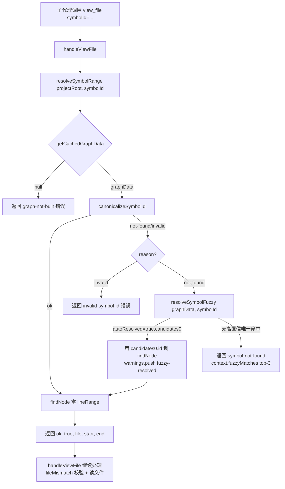

# Implementation Plan: F184 — 子代理 MCP 触发率工程

**Branch**: `184-mcp-adoption-engineering` | **Date**: 2026-06-13 | **Spec**: `spec.md`
**Input**: `specs/184-mcp-adoption-engineering/spec.md`

---

## Summary

F176 实测揭示的核心问题是**采用率（adoption）**而非工具质量问题：30 次 run 中 16 次零 MCP 调用，触发率 1.77/run 未达 SC-002 ≥2 目标。本 feature 从 4 个工程抓手系统性修复：

1. **view_file fuzzy symbol 解析**（FR-003/004）：修复 `context → view_file` 工具链自断问题，接入已有 `resolveSymbolFuzzy`，零新外部依赖
2. **MCP server instructions 注入**（FR-002）：在 `McpServer` 第二个 `ServerOptions` 参数注入 17 工具导览，零成本提升子代理使用动机
3. **server 5 工具 description 补齐至 4 要素**（FR-005）：`prepare/generate/batch/diff/panoramic-query` 当前仅 2-6 字标签，提升至 file-nav 范本标准
4. **graph 6 工具 description 补 Use when / chained-usage**（FR-007）：提升使用率最低工具组的可发现性
5. **A/B 评测**（FR-010）：量化前后触发率，明确 instructions 传播性结论

技术选型核心：全部改动均为**局部 MCP 层修改**，无新模块、无 schema 迁移、无外部依赖引入。`resolveSymbolFuzzy` 已在 F174 完整落地（`src/knowledge-graph/query-helpers.ts:420`），本 feature 仅在 `file-nav-tools.ts` 新增调用点。

---

## Technical Context

**Language/Version**: TypeScript 5.x / Node.js 20.x  
**Primary Dependencies**: `@modelcontextprotocol/sdk` 1.26.0（已验证 `McpServer(serverInfo, options)` 签名）、`zod`（已有）  
**Storage**: 无新增存储；复用 `_meta/graph.json` 内存缓存（通过 `getCachedGraphData`）  
**Testing**: vitest（单元测试）+ stdio E2E 测试（`tests/e2e/`）  
**Target Platform**: Node.js MCP server（stdio / SSE transport）  
**Performance Goals**: 无新增计算路径；`resolveSymbolFuzzy` 已有单测覆盖，延迟可忽略  
**Constraints**: 向后兼容硬约束（FR-001）；工具名称不变（FR-006）；不碰 `graph-query.ts`（FR-003 scope 约束）  
**Scale/Scope**: 改动 3 个源文件（`server.ts` / `file-nav-tools.ts` / `graph-tools.ts`）+ 2 个测试文件新增

---

## Codebase Reality Check

| 文件 | LOC | 公开接口数 | 已知 debt | 本次新增行估计 |
|------|-----|-----------|----------|--------------|
| `src/mcp/server.ts` | 254 | 1（`createMcpServer`） | 无 TODO/FIXME | ~60 行（instructions 文本 + 5 工具 description 扩充） |
| `src/mcp/file-nav-tools.ts` | 362 | 4（`handleViewFile` 等 + `registerFileNavTools`） | 无 | ~25 行（fuzzy 分支 + import 新增） |
| `src/mcp/graph-tools.ts` | 383 | 3（`reloadGraph` / `getCachedGraphData` / `registerGraphTools`） | 无 | ~50 行（6 工具 description 扩充） |

**结论**：所有目标文件 LOC < 500，无前置 cleanup task 触发条件。`file-nav-tools.ts` LOC 362 + 新增 25 行，远低于 500 阈值。`resolveSymbolFuzzy` 已被 `agent-context-tools.ts` 引入和单测覆盖，file-nav 引入是同模块第二个调用点。

---

## Impact Assessment

| 维度 | 评估 |
|------|------|
| 直接修改文件 | 3（`server.ts` / `file-nav-tools.ts` / `graph-tools.ts`） |
| 间接受影响（调用方/测试） | ~5（`tests/unit/mcp-server.test.ts`、`tests/e2e/feature-180-*.ts`、`tests/unit/mcp/response-contract.test.ts`、`tests/unit/mcp/telemetry-coverage.test.ts`、`tests/e2e/feature-174-symbol-fuzzy-match.e2e.test.ts`） |
| 跨包影响 | 无（仅 `src/mcp/` 内部；`query-helpers.ts` 已有，只新增调用） |
| 数据迁移 | 无 |
| API/契约变更 | 成功响应新增可选 `warnings: ['fuzzy-resolved']`；错误响应 `context.fuzzyMatches` 新增路径（均为向后兼容扩展，见 FR-001） |
| **风险等级** | **LOW** |

**判定依据**：影响文件 < 10（LOW 判定），无跨包影响，无数据迁移，API 仅向后兼容扩展。

**高风险预防点**（虽整体 LOW，但需特别注意）：
- `view_file` fuzzy 路径在 F193 合入 master 后，运行时通过 `getCachedGraphData → GraphQueryEngine` 触达 graph load 层，需 F193 合入后复跑 view_file E2E 确认 graph load 兼容（FR-003 注记）
- `instructions` 传播性到 Task 子代理在 SDK 层面未经验证，这是 A/B 评测的核心待答问题（EC-005）

---

## FR-008 路径决议（graph_node fuzzy）

### 路径 A（MCP handler 层 fuzzy 预解析）

**做法**：在 `graph-tools.ts` 的 `graph_node` handler 中，于调用 `engine.getNode({ id, keyword, budget })` 之前，若 `id` 参数传入但 `getNode` 返回 `node: null`，先调用 `resolveSymbolFuzzy(graphData, id)` 预解析，成功则用解析后的精确 id 重新调 `getNode`。

**语义风险评估**：
- `graph_node` 现有 `keyword` 参数是"substring 匹配 label"语义（`node.label.toLowerCase().includes(kw)`），而 `resolveSymbolFuzzy` 是"分层 fuzzy symbol resolve"语义（path-suffix → partial-name → edit-distance）
- 二者不等价：fuzzy 识别的是 symbolId 格式（`file::Class.method`），keyword 匹配的是节点 label 文本
- 若对 keyword 参数也套 fuzzy，会破坏现有 substring 语义；安全做法是**仅对 `id` 参数的 not-found 路径** 加 fuzzy 兜底
- `getNode` 当前不返回"未找到"错误码，只返回 `{ node: null, ... }`，handler 需额外处理 null 检测分支
- 存在快照测试：`tests/integration/__snapshots__/graph-mcp-snapshot.test.ts.snap` 中有 `layer-a-graph_node` snapshot，改动后需更新快照

**路径 A 额外改动面**：
- `getCachedGraphData` 调用：`graph-tools.ts` 已 export 此函数，无需 import 修改
- `resolveSymbolFuzzy` import：需在 `graph-tools.ts` 新增 import
- handler 层新增 null 检测 + fuzzy 分支 + not-found 错误响应构造（约 20 行）
- 快照测试需更新（snapshot 对应 id=`src/foo.ts` not-found 场景，fuzzy 接入后响应 schema 变化）

**路径 B（延后到 F193 ship 后）**

**做法**：本 FR 标记 deferred，不纳入本 feature 交付范围；F193 ship 后单独处理（F193 会改 `graph-query.ts`，届时可在更整洁的基础上实现）。

### 推荐结论：**路径 B（延后）**

**理由**：

1. **scope 风险实质存在**：虽然路径 A 不直接碰 `graph-query.ts`，但接入 fuzzy 后需处理 `getNode` 返回 null 的响应 schema 变化，会触动 `graph-mcp-snapshot.test.ts` 的 snapshot 更新，引入额外验证面
2. **优先级不对等**：`graph_node` fuzzy 是 MAY 级别，而 `view_file` fuzzy（FR-003）是 P1 MUST。F184 主线价值由后者承载，graph_node fuzzy 的边际收益相对有限
3. **语义实现复杂**：正确实现应是"仅对 id 参数 not-found 路径加 fuzzy 兜底，keyword substring 语义保持不变"，这比 view_file 的 fuzzy 更有语义边界需要仔细设计，不适合塞进当前已有足够交付内容的 feature
4. **deferred 路径清晰**：F193 ship 后，graph_node fuzzy 可作为独立 fix 在 `graph-tools.ts` 干净实现，冲突风险归零

**deferred 事实记录**：FR-008 在本 feature 中标记 deferred，不计入验收判定；后续处理归属：F193 ship 到 master 后，作为独立 fix 在 `src/mcp/graph-tools.ts` handler 层实现（不碰 `graph-query.ts`）。

---

## Constitution Check

本项目宪法（`CLAUDE.md`）主要约束评估：

| 原则 | 适用性 | 评估 | 说明 |
|------|--------|------|------|
| 不引入未要求的优化/功能 | 高 | **通过** | 严格按 spec 11 FR 实现，FR-008 明确 deferred 而非偷偷做 |
| 代码标识符英文、注释中文 | 高 | **通过** | instructions/description 文案沿用 file-nav 范本：中文语义主体 + 英文小标题 |
| 提交前零失败 vitest | 高 | **通过** | 4250+ vitest + F180 44 E2E 作为验收门槛 |
| npm build 零 TypeScript 错误 | 高 | **通过** | `resolveSymbolFuzzy` 已有类型定义，新增 import 类型安全 |
| 向后兼容 | 高 | **通过** | 成功响应只增可选 warnings；错误响应新增仅进 context.fuzzyMatches |
| 工具名称不变 | 高 | **通过** | FR-006 强制约束，只改 description 字符串 |
| 自用 dogfooding 反馈 | 中 | **通过** | A/B 评测（FR-010）即本 feature 的自用反馈闭环 |

无 VIOLATION，无需豁免论证。

---

## Project Structure

```text
specs/184-mcp-adoption-engineering/
├── spec.md              # 已定稿（GATE_DESIGN 通过）
├── plan.md              # 本文件
├── research.md          # 技术决策记录（见下方）
├── data-model.md        # 响应 schema 变更形式化描述
├── quickstart.md        # 快速上手指南
└── tasks.md             # 由 spec-driver.tasks 生成
```

源码改动范围：

```text
src/mcp/
├── server.ts            # FR-002（instructions 注入）+ FR-005（server 5 工具 description）
├── file-nav-tools.ts    # FR-003/004（view_file fuzzy 接入）
└── graph-tools.ts       # FR-007（graph 6 工具 description）

tests/
├── unit/mcp/
│   └── mcp-server.test.ts           # description 4 要素断言（新增）
├── unit/file-nav/
│   └── file-nav-tools.test.ts       # fuzzy 分支单测（新增）
└── e2e/
    └── feature-184-view-file-fuzzy.e2e.test.ts   # stdio E2E（新增，用户故事命名）
```

---

## Architecture

### 数据流：view_file fuzzy 接入路径



### instructions 注入位置


### 工具改造矩阵

| 工具 | 当前 description | 改造类型 | 改造后目标 |
|------|----------------|---------|----------|
| `prepare` | `'AST 预处理 + 上下文组装'` | 纯字符串扩充 | 4 要素（what/when/example/chained） |
| `generate` | `'完整 Spec 生成流水线'` | 纯字符串扩充 | 4 要素 |
| `batch` | `'批量 Spec 生成'` | 纯字符串扩充 | 4 要素 |
| `diff` | `'Spec 漂移检测'` | 纯字符串扩充 | 4 要素 |
| `panoramic-query` | `'运行 panoramic 架构分析...'`（一句话） | 纯字符串扩充 | 4 要素 |
| `graph_query` | 一句话（含使用场景） | 纯字符串扩充 | 补 Use when + chained-usage |
| `graph_node` | 含 id/keyword 说明 | 纯字符串扩充 | 补 Use when + chained-usage |
| `graph_path` | 一句话 | 纯字符串扩充 | 补 Use when + chained-usage |
| `graph_community` | 一句话 | 纯字符串扩充 | 补 Use when + chained-usage |
| `graph_god_nodes` | 一句话 | 纯字符串扩充 | 补 Use when + chained-usage |
| `graph_hyperedges` | 一句话（含过滤说明） | 纯字符串扩充 | 补 Use when + chained-usage |
| `view_file` | 已满足 4 要素 | **逻辑修改**（fuzzy 接入） | 不改 description |
| `search_in_file` | 已满足 4 要素 | 不改 | 不改 |
| `list_directory` | 已满足 4 要素 | 不改 | 不改 |
| `impact` | （agent-context-tools.ts 注册） | 不改 | 不改 |
| `context` | （agent-context-tools.ts 注册） | 不改 | 不改 |
| `detect_changes` | （agent-context-tools.ts 注册） | 不改 | 不改 |

---

## 逐 FR 实现策略

### FR-001 响应 schema 向后兼容

**性质**：约束而非改动，贯穿所有 FR 实现。

约束验证点：
- `view_file` 成功响应：`warnings` 只在 `warnings.length > 0` 时写入（复用现有 `if (warnings.length > 0) data['warnings'] = warnings` 模式，文件第 198 行已有该模式）
- `view_file` 错误响应：`buildErrorResponse` 第 4 参 `context` 传入 `{ fuzzyMatches: [...] }`，不新增顶层字段
- `instructions` 是 server 初始化层字段，不出现在任何工具响应中

### FR-002 server instructions 注入

**文件**：`src/mcp/server.ts:40`  
**改动性质**：纯配置改动（修改 `new McpServer(...)` 第二个参数）  
**实施细节**：

```typescript
// 当前（不生效）：
const server = new McpServer({
  name: 'spectra',
  version: pkg.version,
});

// 改造后（正确位置）：
const TOOL_GUIDE = `...（见下方 instructions 文本草案）...`;
const server = new McpServer(
  { name: 'spectra', version: pkg.version },
  { instructions: TOOL_GUIDE },
);
```

**注意**：`instructions` 必须在 `ServerOptions`（第二个参数），SDK 1.26.0 已核实签名，写入第一个 `Implementation` 对象不会进入 initialize result。

### FR-003/004 view_file fuzzy 接入

**文件**：`src/mcp/file-nav-tools.ts`  
**改动性质**：逻辑修改（在 `resolveSymbolRange` 的 `not-found` 分支接入 `resolveSymbolFuzzy`）  
**新增 import**：在现有 `canonicalizeSymbolId, findNode, moduleFileFromId` 导入行追加 `resolveSymbolFuzzy`  
**实施位置**：`resolveSymbolRange` 函数（第 85 行），在 `canon.reason === 'not-found'` 分支：

```typescript
// 当前（第 98-103 行）：
if (canon.reason === 'not-found' || canon.canonicalId === null) {
  return {
    ok: false,
    result: buildErrorResponse('symbol-not-found', '...'),
  };
}

// 改造后（精确范本来自 agent-context-tools.ts:173-185）：
if (canon.reason === 'not-found' || canon.canonicalId === null) {
  const fuzzy = resolveSymbolFuzzy(graphData, symbolId, { projectRoot });
  if (fuzzy.autoResolved && fuzzy.candidates[0] !== undefined) {
    // 用解析后的精确 id 继续 findNode
    const resolvedId = fuzzy.candidates[0].id;
    const resolvedNode = findNode(graphData, resolvedId);
    if (resolvedNode === null) {
      return { ok: false, result: buildErrorResponse('symbol-not-found', '...') };
    }
    const md = resolvedNode.metadata;
    const file = ((md['sourceFile'] as string | undefined) ?? ...) || null;
    const lineRange = md['lineRange'] as { start?: number; end?: number } | undefined;
    // 返回包含 fuzzy warning 信号的 ok 结果
    return { ok: true, file, start: lineRange?.start, end: lineRange?.end, fuzzyResolved: true };
  } else {
    return {
      ok: false,
      result: buildErrorResponse('symbol-not-found', '...', '...', {
        fuzzyMatches: fuzzy.candidates.slice(0, 3),
      }),
    };
  }
}
```

**返回类型扩展**：`resolveSymbolRange` 的 `ok: true` 分支新增可选 `fuzzyResolved?: boolean` 字段（仅内部传递，外层 `handleViewFile` 据此 push `'fuzzy-resolved'` 到 warnings 数组）。

**handleViewFile 中的 warnings 接收**（第 169 行之后）：

```typescript
const sym = resolveSymbolRange(projectRoot, args.symbolId);
if (!sym.ok) return sym.result;
// 如果是 fuzzy resolve 成功，追加 warning
if (sym.fuzzyResolved) warnings.push('fuzzy-resolved');
```

`fileMismatch` 校验：fuzzy resolved 的 file 与用户 path 的 fileMismatch 校验行为与精确 resolve **一致**（均走现有 `fileMismatch(reqRel, sym.file)` 分支，无需特判），EC-004 约束得到满足。

**EC-003（空 symbolId）**：`resolveSymbolFuzzy` 对空/空白 query 返回 `{ candidates: [], autoResolved: false }`（query-helpers.ts:432-435 已有 guard），不抛异常；`resolveSymbolRange` 上游 `canonicalizeSymbolId` 对空/空白会走 `invalid` 路径，在 fuzzy 分支之前返回 `invalid-symbol-id` 错误，EC-003 自然满足。

### FR-005 server 5 工具 description

**文件**：`src/mcp/server.ts`  
**改动性质**：纯字符串改动（server.tool() 第二个参数字符串扩充）  
**格式范本**：`file-nav-tools.ts:307-358`（view_file / search_in_file / list_directory 的 4 要素格式）

description 格式（4 要素模板）：

```
{功能简述，1-2 句话}

Use this tool when:
- {使用场景 1}
- {使用场景 2}

Example:
- Input: { {关键参数示例} }
- Output: { {关键输出字段} }

Typical chained usage:
- {在工具链中的位置描述}
```

各工具的 chained-usage 关键定位：
- `prepare`：`prepare → generate`（为单文件 spec 生成预处理）
- `generate`：`prepare → generate`（生成单文件完整 spec）
- `batch`：`batch → context/impact/view_file`（批量生成图谱后进入分析工具链）
- `diff`：`batch → diff`（图谱更新后检测 spec 漂移）
- `panoramic-query`：`batch → panoramic-query`（图谱就绪后做架构分析）

### FR-006 工具名称不变

**性质**：纯约束，无代码改动。所有 17 工具名称不变，只改 description 字符串第二参数。

### FR-007 graph 6 工具 description

**文件**：`src/mcp/graph-tools.ts`  
**改动性质**：纯字符串改动（各 `server.tool()` 第二个参数字符串扩充，补 Use when + chained-usage 两项）  
**不需要完整 4 要素**：FR-007 仅要求 Use when + chained-usage，不强制 example（与 FR-005 标准区分）

各工具的典型 chained-usage 定位：
- `graph_query`：`batch → graph_query`（图谱就绪后探索子图/模块依赖）
- `graph_node`：`graph_query → graph_node`（从子图结果中看单节点详情）
- `graph_path`：`impact → graph_path`（确认两节点间调用链路）
- `graph_community`：`panoramic-query → graph_community`（社区识别后深入某社区节点）
- `graph_god_nodes`：独立使用（识别架构瓶颈时直接调用）
- `graph_hyperedges`：`graph_query → graph_hyperedges`（子图探索后查跨模块协作流程）

### FR-008 graph_node fuzzy

**推荐**：路径 B（deferred）。见上方"FR-008 路径决议"章节完整分析。

### FR-009 F170d 任务→工具映射

**性质**：FR-002 instructions 文本内容的扩充部分，不引入新模块。作为 instructions TOOL_GUIDE 常量的一个章节写入。

### FR-010 A/B 评测

**说明**：复用 F176 telemetry 基线设施，使用 F176 既有数据（1.77/run，16/30 零调用）作为对照基线，仅跑改造后实验组。执行前 verify 三件套（`SILICONFLOW_API_KEY` / Claude OAuth / `~/.codex/auth.json`），列预估成本等用户确认。

### FR-011 现有测试套件零回归

**性质**：验收门槛。vitest 4250+、F180 44 个 stdio E2E、npm build、repo:check 57 项全绿。

---

## instructions 文本草案（FR-002 TOOL_GUIDE 大纲）

以下为注入 `McpServer` 第二参数的 `instructions` 字符串内容框架，实际文案在实现阶段细化：

```
Spectra MCP — 17 工具使用导览（v{版本}）

## 工具分组

### 组 A — 图谱生成（先跑这里，其他工具依赖图谱）
- batch: 批量生成整个项目的代码知识图谱（最常用入口）
- prepare: 单文件/目录 AST 预处理
- generate: 生成单文件完整 spec 文档

### 组 B — 代码分析（图谱就绪后）
- detect_changes: 检测 git diff 影响的 symbol（改动起点）
- impact: 评估 symbol 改动的 blast radius（BFS 反向遍历）
- context: 查询 symbol 360° 上下文（定义 + callers + callees + imports）

### 组 C — 文件导航（代码定位）
- view_file: 按行区间或 symbolId 查看文件片段（省 token）
- search_in_file: 在文件内按 pattern 搜索
- list_directory: 列出目录结构

### 组 D — 图谱探索（架构分析）
- graph_query: 关键词子图查询
- graph_node: 单节点详情和邻居
- graph_path: 两节点间最短调用路径
- graph_community: 社区节点列表
- graph_god_nodes: 枢纽节点识别
- graph_hyperedges: 超边（跨模块协作流程）查询

### 组 E — 辅助工具
- diff: Spec 漂移检测
- panoramic-query: panoramic 架构分析（cross-package/overview/natural-language）

## 典型调用链路

代码定位任务（推荐）:
  detect_changes → impact → context → view_file

架构分析任务:
  batch → panoramic-query / graph_query → graph_node

Spec 生成任务:
  prepare → generate（单文件）/ batch（全项目）

影响面分析任务:
  detect_changes → impact（评估 blast radius）

## graph-not-built 恢复流

遇到 graph-not-built 错误时：先调 batch（传 projectRoot）生成图谱，然后重试原工具。
```

**控制长度原则**：instructions 总长度目标 500-800 字符，避免过长占用 context window。以上草案需在实现阶段精简。

---

## 测试策略

### 单元测试（新增）

**文件 1**：`tests/unit/mcp/server-instructions.test.ts`（新建）
- 验证 `createMcpServer()` 返回的 server 实例，`McpServer` 构造时第二参数含非空 `instructions` 字段
- 验证 instructions 包含工具分组关键词（"组 A"/"batch"/"detect_changes → impact → context"）
- 验证 instructions 包含 graph-not-built 恢复流说明

**文件 2**：`tests/unit/mcp/description-completeness.test.ts`（新建）
- 验证 server 5 工具（`prepare/generate/batch/diff/panoramic-query`）的 description 包含 "Use this tool when"、"Example:"、"Typical chained usage:" 关键词（4 要素断言）
- 验证 graph 6 工具（`graph_query/graph_node/...`）的 description 包含 "Use when" 和 "chained usage" 关键词
- 验证工具名称列表仍为 17 个，与现有 `tests/unit/mcp/telemetry-coverage.test.ts` 的 `ALL_17_TOOLS` 一致

**文件 3**：`tests/unit/mcp/view-file-fuzzy.test.ts`（新建）
- 分支覆盖：
  - fuzzy autoResolved=true，唯一高分候选 → 返回 `ok: true`，含 `fuzzyResolved: true`
  - fuzzy autoResolved=false，多候选 → 返回 `ok: false`，`result.context.fuzzyMatches` 含 top-3
  - graph-not-built（getCachedGraphData 返回 null）→ 现有行为不变
  - 空 symbolId → `canonicalizeSymbolId` 走 invalid 路径，fuzzy 分支不触发
- mock `getCachedGraphData` 返回合成图（复用 feature-174 的 `makeMicrogradGraph` 模式）

### E2E 测试（新增）

**文件**：`tests/e2e/feature-184-view-file-fuzzy.e2e.test.ts`

命名格式（符合 spec 要求）：

```
describe('用户故事: view_file fuzzy symbol resolve 经 stdio JSON-RPC 链路行为成立', ...)
```

测试场景（对应 SC-001、SC-002）：
- **T-001**：向 `view_file` 传入大小写偏差的 symbolId（如 `src/mcp/server.ts::CreateMcpServer` vs 真实 `createMcpServer`），验证返回成功响应 + `warnings: ['fuzzy-resolved']`
- **T-002**：向 `view_file` 传入无法高置信解析的模糊 symbolId（不存在），验证返回错误响应 + `context.fuzzyMatches` 数组非空

E2E 基础设施复用 F180 的 `stdio-client.ts` helper + `BASELINE_GRAPH` fixture。

### 回归测试（确认不破坏）

- F180 44 个 stdio E2E：`tests/e2e/feature-180-*.e2e.test.ts` 全部通过，重点确认 listTools 17 工具名称断言零回归（EC-007）
- F174 既有 fuzzy E2E：`tests/e2e/feature-174-symbol-fuzzy-match.e2e.test.ts` 全部通过（view_file fuzzy 改动不影响 agent-context 工具的 fuzzy 路径）
- 快照测试：`tests/integration/__snapshots__/graph-mcp-snapshot.test.ts.snap` 不涉及 description 内容，不需要更新（snapshot 测 `getNode` 返回值，不测 description 字符串）

---

## 实现顺序与依赖

```
Phase 1（并行，无互相依赖）:
  ├── Task A: FR-002 instructions 注入（server.ts，~1h）
  ├── Task B: FR-005 server 5 工具 description 扩充（server.ts，~2h）
  └── Task C: FR-007 graph 6 工具 description 扩充（graph-tools.ts，~1.5h）

Phase 2（依赖 Phase 1 完成，因为需要在同文件确认改动隔离）:
  └── Task D: FR-003/004 view_file fuzzy 接入（file-nav-tools.ts，~2h）

Phase 3（依赖 Task D）:
  └── Task E: 单元测试新增（3 个测试文件，~2h）

Phase 4（依赖 Task D + E）:
  └── Task F: E2E 测试新增 + 全量回归确认（~1.5h）

Phase 5（在代码全部稳定、tests 全绿后）:
  └── Task G: A/B 评测执行（FR-010，异步，用户确认后执行）
```

**关键依赖约束**：
- Task A、B、C 可并行，但均改 `server.ts`，实际实现时在同一 PR 内按顺序处理（A → B 同文件）
- Task D（fuzzy 逻辑）必须在 Task A/B/C 稳定后，避免多文件改动混在一起增加 debug 难度
- A/B 评测（FR-010）作为最后阶段，不阻塞代码改动交付

---

## 复杂度与风险评估

| 风险点 | 类型 | 概率 | 影响 | 缓解措施 |
|-------|------|------|------|---------|
| F193 运行时兼容（view_file + graph load 路径） | 运行时兼容 | 中 | 低（view_file 单测已 mock，E2E 依赖真实 graph） | F193 合入后复跑 E2E，已在 FR-003 注记要求 |
| instructions 未传播到 Task 子代理 | SDK 行为未知 | 中 | 中（改善效果打折） | A/B 评测给出明确结论；description 改善为结构性兜底 |
| SDK 1.26.0 `ServerOptions.instructions` 字段 | SDK 版本 | 低（已对照 .d.ts 核实） | 高（instructions 完全无效） | 单测验证 server 实例构造参数 |
| `resolveSymbolFuzzy` 阈值行为变化 | 代码变更 | 低（EC-008 约束使用默认 0.9） | 低 | 复用 F174 已覆盖的 mock + 测试 |

**整体风险等级**：LOW。所有改动均为 MCP 层局部修改，无架构变动，无新外部依赖。

### 回滚策略

所有改动为独立的字符串扩充或单函数内分支增加，可按文件级别回滚：
- description 改动：直接 revert 对应 `server.ts` / `graph-tools.ts` 的字符串部分
- instructions 改动：revert `new McpServer(...)` 第二参数，恢复单参数形式
- view_file fuzzy：revert `resolveSymbolRange` 中的 fuzzy 分支，恢复 `buildErrorResponse('symbol-not-found', ...)` 硬失败

---

## Complexity Tracking

无 Constitution Check VIOLATION。以下记录偏离"最简方案"的决策及理由：

| 决策 | 复杂度原因 | 为何不取更简方案 |
|------|-----------|--------------|
| `resolveSymbolRange` 返回类型扩展（新增 `fuzzyResolved?: boolean`） | 需在 ok 路径传递 fuzzy 信号给 `handleViewFile` | 替代方案（warnings 直接在 resolveSymbolRange 内构造并通过某 side channel 传出）违反单一职责；当前方案最干净 |
| FR-008 选路径 B（deferred）而非 A | 增加"deferred 记录"管理成本 | 路径 A 语义风险 + 快照测试更新面 > deferred 记录成本；F184 主线价值不依赖 graph_node fuzzy |

---

## Codex 对抗审查修订（Plan 阶段，主编排器裁决）

Codex 对 plan 给出 2 critical + 6 warning + 2 info，主编排器逐条独立核实后裁决如下（全部已核实属实并修订）：

### CRITICAL（已修，binding）

**[C-001] view_file fuzzy E2E 用例按字面不可执行 → 改用 micrograd 既有 fixture**
- 核实：`resolveSymbolFuzzy` 无候选时返回 `{ candidates: [], autoResolved: false }`（query-helpers.ts:461）；plan 原例 `server.ts::CreateMcpServer` 在 micrograd fixture 里不存在 → 完全不存在的串产生**空** fuzzyMatches，断言"非空候选"必假红。
- 裁决：测试一律用 micrograd fixture（`feature-180-symbol-chain.e2e.test.ts` 已建 `micrograd/nn.py#MLP` lineRange 45-60 的 graph.json patch，直接扩展该 fixture）。
  - **SC-002（失败带候选）**：用裸名 `'MLP'` → `symbol-not-found` + `context.fuzzyMatches[0].confidence=0.85 < 0.9`（已是 feature-180-symbol-chain.e2e.test.ts:205 的实测 proven 模式）。
  - **SC-001（auto-resolve 成功）**：用唯一 path-suffix 近似（如去掉 `micrograd/` 前缀的 `nn.py#MLP` 或等价 path-suffix 命中），目标 confidence ≥ 0.9 唯一候选 → autoResolved=true。⚠️ 具体 query 需 implement 时对 fixture 实测微调（path-suffix 层置信度），不得用臆造串。

**[C-002] instructions 缺 stdio initialize 级验证 → 新增 stdio E2E（不可砍，对应 spec EC-005/SC-003）**
- 核实：SDK `Client.getInstructions(): string | undefined` 存在（client/index.d.ts:167）；stdio helper 已走 `Client.connect`（tests/e2e/lib/stdio-client.ts）。仅 mock McpServer 的 unit test 无法证明真实 JSON-RPC initialize 携带 instructions。
- 裁决：新增 stdio E2E（"用户故事:"命名）——`spawnMcpClient()` 后断言 `handle.client.getInstructions()` 非空 + 含 `detect_changes → impact → context → view_file` 链路串 + `graph-not-built` 恢复流关键词。这验证**协议层传播**（与 A/B 要回答的"Task 子代理是否在模型上下文里看到 instructions"是两个不同问题，spec EC-005 已区分）。

### WARNING（已修）

- **[W-001] FR-008 deferred 三处留痕**：plan 已记；tasks.md 生成时加 deferred 记录任务，verification report 固定写一行"FR-008 deferred，不计入本 feature pass"。（spec.md FR-008 W-003 口径）
- **[W-002] fuzzy fileMismatch 测试缺失**：补单测——`path='a.ts'`、symbolId fuzzy 解析到 `sub/b.ts::foo` → 期望 `invalid-input`（验证 fuzzy-resolved 的 file 同样过 fileMismatch 校验）。
- **[W-003] fuzzyMatches 含 matchKind**：data-model.md + spec.md FR-004 已改为 `{ id, confidence, matchKind }` 完整 SymbolCandidate（与 feature-180-symbol-chain.e2e.test.ts:221 既有断言一致）。
- **[W-004] instructions 长度纪律**：草案实测 ~1717 字符 vs plan 原写 500-800（内部不一致）。裁决：instructions 目标上限放宽到**务实区间 ≤ 1600 字符**并加**长度断言**（server 级一次性导览，比单工具 description 长可接受，但禁止无限膨胀）；server 5 / graph 6 description 仍受 `[100, 500]` 单工具上限约束（feature-170c 契约）。
- **[W-005] warnings 顺序**：定义为无序集合语义；data-model.md 已改为实际顺序 `['fuzzy-resolved', 'symbolId-overrides-lines']` + 注明测试用 `toContain`/`arrayContaining`，禁 `toEqual` 数组精确相等。

### INFO（确认，无需动作）

- **[I-001]** 无 server/graph description 字面值断言会被打爆（主编排器已独立核实 tests/ 零命中）；回归风险转为"新文案过长/关键词测试太弱"，已由 W-004 长度断言 + 4 要素结构断言覆盖。
- **[I-002]** view_file fuzzy "resolved id 再 findNode" 数据流架构点未被证伪，保留分层。

### over-engineer 自查（Codex 审查点 1 回应）
- data-model.md / quickstart.md 对 LOW 复杂度 feature 略重，但已生成且无害，作为实现期契约参照保留；不再追加额外制品。
