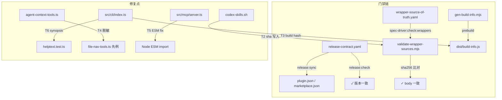

# F186 修复规划 — 分发可靠性（npm 4.3.0）

## 概述

本次修复围绕"内容级门禁缺失"这一根因，分 6 个主任务并行推进，1 个 best-effort 附带串。核心主线：release-contract 版本 bump → wrapper body sha256 指纹校验 → CLI `--version` build 元数据 → 3 处 MCP 脱敏 → prepare ESM 死代码 → synopsis 定点断言。全量通过 vitest / build / repo:check / release:check 后生成 publish 准备清单，等用户授权再执行 `npm publish`。

---

## Codebase Reality Check

| 文件 | LOC | 关键方法/接口数 | 已知 Debt | 触发前置清理？ |
|------|-----|----------------|-----------|----------------|
| `contracts/release-contract.yaml` | 31 | — | 无 | 否 |
| `plugins/spec-driver/scripts/validate-wrapper-sources.mjs` | 303 | 6 个函数（`validateWrapperMarkers`、`validateContract`、`loadWrapperSourceContract` 等） | 无 | 否 |
| `plugins/spec-driver/contracts/wrapper-source-of-truth.yaml` | 45 | — | 无 `sourceSha256` 字段 | 否 |
| `plugins/spec-driver/scripts/codex-skills.sh` | 226 | `write_wrapper`、`write_wrapper_source_contract`、`write_skill_body` 等 | `write_wrapper_source_contract` 未写入 sha 标记 | 否 |
| `src/cli/index.ts` | ~180 | 1 入口（`main`）+ HELP_TEXT 常量 | synopsis 行 L43 漏 `graph-only` | 否 |
| `src/mcp/server.ts` | ~250 | `prepare` handler | L105-106 裸 `require()` — ESM 死代码 | 否 |
| `src/mcp/agent-context-tools.ts` | ~600 | `runAgentContextTool`、`loadGraphOrError`、3 个工具注册 | L104-107 泄露 `err.message`/stack；L129/148/140 含 projectRoot 内插；L140 stale 分支泄露绝对路径节点 id | 否 |
| `tests/unit/cli/helptext.test.ts` | 41 | 4 个 it 断言 | 缺 synopsis 行定点断言 | 否 |
| `scripts/gen-build-info.mjs`（新建） | — | 1 个脚本 | — | — |
| `src/build-info.ts`（新建，gitignored） | — | 1 个常量导出 | — | — |

**结论**：所有目标文件均 < 500 LOC，无超 3 个 TODO/FIXME，无循环依赖，不触发前置清理规则。

---

## Impact Assessment

| 维度 | 评估 |
|------|------|
| 直接修改文件数 | 8 个（含 2 个新建）|
| 间接受影响 | `npm run repo:check` 链路、`release:check` 链路、wrapper 安装脚本、MCP 工具消费方（无代码改动，仅文案变化）|
| 跨包影响 | 是：同时触 `src/`（CLI + MCP）、`plugins/spec-driver/`（scripts + contracts）、`contracts/`（release-contract）、`scripts/`（新建 gen-build-info）—— 4 个顶层边界 |
| 数据迁移 | 无（无 schema 结构变更；`wrapper-source-of-truth.yaml` 增字段向后兼容）|
| API/契约变更 | `--version` 输出格式新增 `(<commit>)` 后缀；MCP 错误文案变更（客户端只消费 code 字段，message 变更无破坏性）；wrapper header 新增 `Source SHA256:` 行（校验脚本负责验证，下游不感知）|
| **风险等级** | **MEDIUM**（跨 4 个顶层包边界，但改动均为局部内聚，无 schema 破坏，无公共 API 签名变更）|

> MEDIUM 风险，无需强制分阶段，但建议按任务顺序（先门禁/契约，后脱敏/修复）提交，便于逐步验证。

---

## 变更清单（按文件 + 修复动作 + 验证手段）

### T1 — release-contract 版本 bump

**目标文件**: `contracts/release-contract.yaml`

**修复动作**:
- `products.spectra.version`: `4.2.0` → `4.3.0`
- `productMappingDescription` 追加一行 4.3.0 changelog（内容涵盖 F175-F196 修复摘要 + 防漂移门禁）
- 执行 `npm run release:sync` 令受控行（`plugin.json` / `marketplace.json` / `package-lock.json` / README badge）自动同步

**禁止**: 手改 `plugin.json` / `marketplace.json` / `package-lock.json` / README。

**验证**:
- `npm run release:check` 零错误
- `grep '"version"' plugins/spectra/.claude-plugin/plugin.json` 返回 `4.3.0`
- git diff 确认受控行仅通过 `release:sync` 变更

---

### T2 — wrapper body sha256 指纹校验（方案 A）

**目标文件**:
- `plugins/spec-driver/scripts/codex-skills.sh`（生成端：写入 sha 标记）
- `plugins/spec-driver/scripts/validate-wrapper-sources.mjs`（校验端：重算比对）
- `plugins/spec-driver/contracts/wrapper-source-of-truth.yaml`（可选：记录 sha 字段供文档说明）

**修复动作**:

1. **`codex-skills.sh`** — `write_wrapper_source_contract` 函数中，在写入 wrapper 前先算 canonical SKILL.md body 的 sha256（用 `sha256sum` / macOS `shasum -a 256` 兼容），写入 header 行：

   ```
   - Source SHA256: <hash>
   ```

   具体位置：在现有 `Canonical source` 行下方追加。`write_skill_body` 管道出来的内容（frontmatter 剥除 + runtime text rewrite 后）才是 body，sha256 须对 body 文本而非原始文件计算（保证与校验端一致）。

2. **`validate-wrapper-sources.mjs`** — `validateWrapperMarkers` 函数新增逻辑：
   - 从 wrapper 文件解析 `Source SHA256: <hash>` 标记提取嵌入 hash
   - 读取对应 source SKILL.md，重走相同 body 提取逻辑（剥 frontmatter + runtime text rewrite，复用纯 JS 实现）计算 sha256
   - 比对不一致 → 追加 fail 条目 `wrapper body sha256 不匹配（期望 X，实际 Y）`
   - 无 `Source SHA256:` 行视为"旧格式 wrapper"→ warn 而非 fail（兼容已有 wrapper 渐进迁移）

3. **`wrapper-source-of-truth.yaml`**（可选文档字段）— 在 `generator` 下补注释说明 sha 校验机制，无需增加强制字段（sha 嵌在 wrapper header，不需要 yaml 额外存储）。

**验证**:
- 新测试（`tests/unit/spec-driver/wrapper-sha256.test.ts`）：
  - 造漂移场景：安装 wrapper 后手动改 source SKILL.md 一行 → `validateWrapperSources()` 返回 `status: fail` + sha 不匹配错误
  - 正常场景：安装后立即校验 → `status: pass`
  - 旧格式兼容：无 `Source SHA256:` 行的 wrapper → `status: warn`（不 fail）
- `npm run spec-driver:check:wrappers` 在干净安装后通过

---

### T3 — CLI `--version` build 元数据

**目标文件**:
- `scripts/gen-build-info.mjs`（新建）
- `src/build-info.ts`（新建，gitignore）
- `src/cli/index.ts`（修改：引入 build-info 并更新 `--version` 输出）
- `package.json`（修改：在 `prebuild` 脚本链中追加 gen-build-info）
- `.gitignore`（修改：加入 `src/build-info.ts`）

**修复动作**:

1. **`scripts/gen-build-info.mjs`** — prebuild 脚本：
   - `git rev-parse --short HEAD` 获取 7 位 commit hash，失败时 fallback 到 `'unknown'`
   - 生成 `src/build-info.ts`，内容为：
     ```typescript
     // 此文件由 scripts/gen-build-info.mjs 在 build 时生成，不入库
     export const BUILD_COMMIT = '<hash>';
     ```

2. **`package.json`** — `prebuild` 字段改为：
   ```
   "prebuild": "node scripts/gen-build-info.mjs && tsx scripts/inline-d3.ts"
   ```

3. **`src/cli/index.ts`** — 顶部 import 处引入 `BUILD_COMMIT`；`--version` 输出改为：
   ```typescript
   // 优雅降级：build-info 缺失时仅输出版本号
   const buildSuffix = BUILD_COMMIT && BUILD_COMMIT !== 'unknown' ? ` (${BUILD_COMMIT})` : '';
   console.log(`spectra v${version}${buildSuffix}`);
   ```
   build-info 导入使用动态 import 或 try/catch，缺文件时 `BUILD_COMMIT = ''`。

4. **`.gitignore`** — 追加 `src/build-info.ts`。

**验证**:
- 新测试（`tests/unit/cli/version.test.ts`）：
  - 验证 `src/cli/index.ts` 的 `--version` 逻辑路径覆盖：有 commit hash 时输出 `v4.3.0 (abc1234)` 格式；无时输出 `v4.3.0`
  - 验证现有 CLI 测试不破坏（grep 现有测试中的 version 断言字面值，确认无硬编码期待格式）
- `npm run build` 后确认 `dist/cli/index.js` 包含 commit hash 文本
- `npm pack --dry-run` 确认 `build-info.ts` 源码不入包，`dist/build-info.js` 入包（baked 值）

---

### T4 — MCP 脱敏：3+1 处漏口

**目标文件**: `src/mcp/agent-context-tools.ts`

**4 处修复点**（对齐先例 `src/mcp/file-nav-tools.ts:140`）:

| 位置 | 当前行为 | 修复后 |
|------|----------|--------|
| `runAgentContextTool` catch（L104-107） | 回传 `err.message` + `stack.slice(0,200)` | 固定文案 `'内部错误，请稍后重试'`，drop stack；保留 `internal-error` code + telemetry（telemetry 内部可记录 message，不外漏）|
| `loadGraphOrError` 缺图分支（L129） | `graph.json 不存在或加载失败 (projectRoot=${projectRoot})` | `'graph 未构建'` + hint `'请先运行 \`spectra batch\` 生成图谱'`（无 projectRoot 内插）|
| `loadGraphOrError` catch 其他加载失败（L148） | `graph.json 加载失败 (projectRoot=${projectRoot})` | 同上固定文案 |
| `loadGraphOrError` stale 分支（L140） | `err.message`（含节点绝对路径，如 `/Users/xxx/...`）| 固定文案 `'图格式已过期'` + hint 保留（hint 无绝对路径，可留）；绝对路径信息仅写入 telemetry 内部字段，不外漏 |

**验证**:
- 新测试（`tests/unit/mcp/agent-context-sanitize.test.ts`）：
  - mock `getCachedGraphData` 抛含绝对路径的错误 → `loadGraphOrError` 返回的 error message 不含 `/Users/` / `/home/` 等路径前缀
  - mock `runAgentContextTool` body 抛 Error（message 含路径）→ catch 结果 message 为固定文案，无 stack 字段
  - stale 场景：mock `isGraphFormatStaleError` 返回 true，err.message 含绝对路径 → 脱敏后无绝对路径
- 确认 17 个 MCP 工具中其余 14 个（已是固定文案）无改动，只改 agent-context-tools 的 4 处

---

### T5 — prepare 工具 ESM 死代码修复

**目标文件**: `src/mcp/server.ts`

**修复动作**:
- L105 `require('node:path').resolve(targetPath)` → 使用文件顶部已 import 的 `resolve`（或补 import `resolve from 'node:path'`）
- L106 `require('node:fs')` → 补顶部 ESM import `import { statSync } from 'node:fs'`（或扩展已有 fs import）
- try/catch 内 `statSync` 调用：增加目录场景明确断言，不依赖 `require` 动态加载

**验证**:
- 新测试（`tests/unit/mcp/server-prepare-languages.test.ts`）：
  - 给 `prepare` handler 传入一个实际目录路径（mock `prepareContext` + `scanFiles`）→ `detectedLanguages` 字段正常出现在响应中
  - 传入文件路径 → `detectedLanguages` 不出现（非目录场景跳过）
  - 确认不抛 `require is not defined` 错误

---

### T6 — synopsis 定点断言 + 帮助文本校正

**目标文件**:
- `src/cli/index.ts`（修复 synopsis 漏 `graph-only`）
- `tests/unit/cli/helptext.test.ts`（升级为定点断言）

**修复动作**:

1. **`src/cli/index.ts` L43** — 将 synopsis 行改为：
   ```
   spectra batch [--full] [--force] [--incremental] [--languages <lang,...>] [--include-docs] [--include-images] [--mode <full|reading|code-only|graph-only>] [--hyperedges] [--concurrency <N>] [--no-html] [--output-dir <dir>]
   ```

2. **`tests/unit/cli/helptext.test.ts`** — 新增定点断言 it：
   ```typescript
   it('synopsis 行包含全部 4 个 mode 值（定点断言）', () => {
     const src = readFileSync(join(root, 'src/cli/index.ts'), 'utf8');
     // 定位 synopsis 行（batch 命令行）
     const synopsisLine = src.split('\n').find(l => l.includes('spectra batch') && l.includes('--mode'));
     expect(synopsisLine).toBeDefined();
     expect(synopsisLine).toContain('full');
     expect(synopsisLine).toContain('reading');
     expect(synopsisLine).toContain('code-only');
     expect(synopsisLine).toContain('graph-only');
   });
   ```

**验证**:
- 现有 4 个 it 保持绿色（无破坏）
- 新增 synopsis 定点 it 绿色
- 确认 `spectra --help` 实际输出 synopsis 行含 `graph-only`

---

### T7 — 附带串（best-effort，不阻塞主验收）

| 子项 | 动作 | 文件 |
|------|------|------|
| zod 缺依赖优雅降级 | orchestrator-cli / 脚本中 zod import 失败时给出清晰错误提示，不 crash | `plugins/spec-driver/scripts/orchestrator-cli.mjs` 等 |
| MCP server volta 鲁棒 | MCP server 启动脚本加 volta bypass 或 PATH 修补 | `src/cli/commands/mcp-server.ts` / launch script |
| plugin 同名冲突文档化 | 在 `plugins/spec-driver/README.md` 或 CLAUDE.md 补充同名冲突行为说明 | 文档，不入 `src/` |

**约束**: T7 仅在 T1-T6 全绿后按剩余时间处理，不得因 T7 阻塞主验收或 publish 准备。

---

## 回归风险矩阵

| 变更 | 可能影响的现有路径 | 风险 | 防护措施 |
|------|-------------------|------|----------|
| T1 版本 bump | `release:check` 期待值、所有含版本号的测试断言 | 低 | `npm run release:check` 全通；grep 测试中硬编码 `4.2.0` |
| T2 wrapper sha | 现有 `validate-wrapper-sources` 测试（若有）；旧格式 wrapper 已安装的环境 | 中 | 旧格式 warn 不 fail；新测试覆盖两条路径 |
| T3 `--version` | CLI 测试中含 `spectra v` 断言的 it（如 `version.test.ts` 是否存在）；npm pack 文件列表 | 低 | 优雅降级确保无 build-info 时输出不变；`.gitignore` 防止源码入库 |
| T4 脱敏 | `agent-context-tools` 现有测试的 error message 期待值 | 中 | grep 现有测试 message 字面值，确认无硬编码绝对路径期待；新测试替代旧断言 |
| T5 ESM 修复 | `prepare` 工具调用路径 | 低 | try/catch 保留，失败静默 → 只是 `detectedLanguages` 从"假绿"变为"真实运行" |
| T6 synopsis | `helptext.test.ts` 已有 `graph-only` 正面断言（L35-40），本次改 src 与测试一致 | 极低 | 测试已期待 `graph-only`，修 synopsis 让测试更稳 |

---

## 验证策略

### 新增测试文件

| 文件 | 覆盖点 |
|------|--------|
| `tests/unit/spec-driver/wrapper-sha256.test.ts` | T2 漂移检测（pass / fail / warn-旧格式） |
| `tests/unit/cli/version.test.ts` | T3 `--version` 输出格式（有/无 commit hash） |
| `tests/unit/mcp/agent-context-sanitize.test.ts` | T4 脱敏（4 处漏口均无绝对路径） |
| `tests/unit/mcp/server-prepare-languages.test.ts` | T5 detectedLanguages 正常注入 |
| 在 `tests/unit/cli/helptext.test.ts` 追加 | T6 synopsis 定点断言 |

### 门禁顺序（每次 commit 前必须全绿）

```
npx vitest run           # 全量单元测试，零失败
npm run build            # TypeScript 编译，零错误
npm run repo:check       # wrapper 同步 + skill mirror 一致性
npm run release:check    # release contract 一致性
```

### publish 准备验证（末步，等授权后执行）

```bash
# 1. dry-run 确认包内容
npm run release:publish:dry

# 2. 确认 dist/ 包含 build-info.js（baked commit hash）
# 3. 确认 src/build-info.ts 不在 npm pack 文件清单
# 4. 手工验证 npm view spectra-cli version 当前为 4.2.0（未污染）
# 5. 用户明确"确认 publish" 后执行 npm publish
```

---

## Publish 准备清单（末步，等用户授权）

以下步骤在所有 T1-T6 合并到 master、全量门禁通过后，**等待用户明确授权**再执行 `npm publish`。

- [ ] T1 合并：`contracts/release-contract.yaml` 已 bump 4.3.0，`release:sync` + `release:check` 通过
- [ ] T2 合并：wrapper sha 校验生效，干净安装后 `spec-driver:check:wrappers` pass
- [ ] T3 合并：`npm run build` 含 prebuild gen-build-info，`dist/cli/index.js` 包含 baked commit hash
- [ ] T4 合并：agent-context-tools 脱敏测试全绿
- [ ] T5 合并：prepare ESM 修复，prepare-languages 测试全绿
- [ ] T6 合并：synopsis 定点断言通过
- [ ] 全量门禁：`npx vitest run` + `npm run build` + `npm run repo:check` + `npm run release:check` 四项零失败
- [ ] `npm run release:publish:dry` 确认包文件清单正确（无 `src/build-info.ts` 源码，有 `dist/build-info.js`）
- [ ] **等用户明确授权** → `npm publish`（不可逆操作，一次授权只对本次生效）

---

## 实施顺序建议

```
T1（release-contract bump）
  → T6（synopsis + 测试，改动最小，先保证帮助文本正确）
  → T5（ESM 死代码，独立）
  → T4（脱敏，4 处集中改一个文件）
  → T3（build-info 脚本 + CLI 改动）
  → T2（wrapper sha，改动面最广，放最后集中验证）
  → [全量门禁 pass] → publish 准备清单 → 等授权
  → T7（best-effort，有余量再做）
```

T1/T5/T6 可并行；T4 依赖 T1 后（确认版本号稳定）；T2/T3 彼此独立但建议 T3 后再做 T2（wrapper 校验脚本引入新工具方法后完整测试更稳）。

---

## Codex 对抗审查处置（设计阶段，2026-06-14）

Codex 对 fix-report/plan/tasks 做对抗审查，逐项核实源码后处置如下（详见 tasks.md「FINAL 设计审查处置」节）：

| 档位 | 发现 | 核实结论 | 处置 |
|------|------|---------|------|
| CRITICAL-1 | 脱敏漏口不止 3 处：stale 消息含外来绝对路径 node.id，graph-tools L177 / file-nav L132 / agent-context L140 三处均原样回传 | 属实（graph-query.ts:189 抛 `…（${node.id}）`） | **用户裁定维持原 #5 的 3 处**（agent-context projectRoot/err）；stale 三处**保持现状一致不动**（外来路径是故意诊断信号），删除 plan 误加的 L140 脱敏，避免半修不一致 |
| CRITICAL-2 | 缺 `Source SHA256:` 只 warn，`repo:check` 以 0 退出可旁路门禁 | 属实（validate L223/L288 + repo-check.mjs 仅 fail 非零退出） | **采纳**：缺 sha = fail（仓内 wrapper 均由生成器重建会带 sha） |
| WARNING-1 | JS 重走 shell sed 管道逐字节复刻脆弱 | 属实（9 条 sed + awk，含 2 条长中文替换） | **采纳**：抽单一 Node helper `extract-wrapper-body.mjs`，shell 生成端与 JS 校验端共用，杜绝分叉；重生成 wrapper 须字节等同 |
| WARNING-2 | build-info.ts 静态 import gitignored 文件 → clean checkout tsc/vitest 报错 | 属实（tsconfig 编 src/**，vitest 先于 build 跑） | **采纳**：废 build-info.ts，改运行时读 `dist/.spectra-build-meta.json`（F176），无静态 import |
| WARNING-3 | T7 源码改动超 fix 最小面且排在 publish 后语义矛盾 | 属实 | **采纳**：T7 zod/volta 源码改剥离为 follow-up；仅留纯文档 best-effort |
| INFO-2 | 已有 F176 `dist/.spectra-build-meta.json` 盖章机制可复用 | 属实（build-spectra-stamped.mjs + spectra-version-gate.mjs） | **采纳**：T3 复用之，避免并行元数据链 |
| INFO-1 | T7 引用的 volta blocker 文档仓内未找到 | 属实（是 Claude memory 非仓内文件） | T7 剥离后该引用随之移除 |
| T1 版本一致性 | spectra 与 spec-driver version 独立 | PASS（无误动风险） | 维持 |

---

## 注：architecture 图（精简版）


