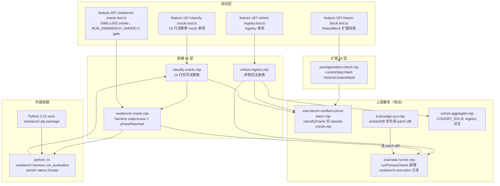

# 技术实现计划：F187 评测设施 v2 — FAIL_TO_PASS Oracle

## Summary

将现有 fuzzy-match oracle 替换为真实 SWE-Bench FAIL_TO_PASS 测试执行路径，修通三分类（pass / fail / error），补全 patch 持久化、cohort 注册表单一化、freezeBlock 语义冻结，并提供 experiment manifest 参数化。

**技术路径**：`swebench` pip 包（Python 3.11 venv）+ Epoch AI arm64 原生镜像 + TS `child_process.spawn` 桥接，结合表驱动 classifyOracle、声明式 cohort registry、扩展后 freezeBlock 实现完整评测可信链。

**核心改动范围**：新建 3 个 lib 模块（`classify-oracle.mjs`、`cohort-registry.mjs`、`swebench-oracle.mjs`）+ 扩展 1 个 lib（`preregistration-check.mjs`）+ 改动 3 个上游脚本（`eval-task-runner.mjs`、`swe-bench-verified-cohort-batch.mjs`、`eval-judge-jury.mjs`）+ 新增 vitest 单测文件 + venv 脚本。

---

## Technical Context

**语言/版本**：Node.js 20.x + ESM `.mjs`（评测脚本层）；Python 3.11 venv（隔离 swebench pip 包）  
**主要依赖**：`swebench`（pip，Python venv 隔离）、`child_process.spawnSync`（TS/Node 标准库，**同步**调用 harness，`timeout` 选项即 watchdog）、`node:crypto`（hash 计算）、`node:fs`（atomic write）  

> **关键设计收敛（Codex plan review C-5 驱动）**：harness 调用用 `spawnSync({ timeout })` 而非 async `spawn`。理由：现有 `runPrimaryOracle` 是**同步**函数，被 7 处同步调用（含竞品 cohort 路径，不可改其行为）；async 化会断裂所有调用方。`spawnSync` 保持同步、零调用方迁移；`phaseReached` 改为对**捕获到的 stdout/stderr/log（超时时为部分输出）**做**事后纯函数解析**（evidence-based），天然满足 C-6 可测性与 C-3 证据判定。代价：phaseReached 非实时——但 evidence-based 后置解析更稳、更可单测。
**存储方案**：文件系统（`<run_artifacts_dir>/<run_id>/`）；temp-file + rename 原子写入  
**测试框架**：vitest（单元测试）；smoke 测试以 `RUN_SWEBENCH_SMOKE=1` env flag gate，默认 skip  
**目标平台**：arm64 macOS（开发/自测）；x86_64 CI 机器（F188 全量跑批）  
**性能目标**：单 instance 自测 ≤300 秒（arm64 native），全量 F188 批次 ≤900 秒/instance  
**约束**：  
- 评测脚本层为 `.mjs`（ESM），非 `src/` 下 TypeScript，无 tsc 类型检查覆盖
- Python venv 不污染 node_modules，不入库（`.gitignore`）
- importer（`swe-bench-fixture-import.py`）零改动

---

## Codebase Reality Check

### 目标文件统计

| 文件 | LOC | 公开函数/导出数 | 已知 Debt |
|------|-----|----------------|-----------|
| `scripts/eval-task-runner.mjs` | 975 | 11 导出（`runPrimaryOracle`、`buildDriverPrompt`、`SUPPORTED_TOOLS` 等） | 超长文件（975 行，单文件承载 oracle + runner + prompt builder + fixture assembler）；`runPrimaryOracle`（行 570-628）oracle dispatch 为 if-else 链，新增 kind 需在此处插入分支 |
| `scripts/swe-bench-verified-cohort-batch.mjs` | 379 | 8 导出（`classifyOracle`、`COHORT_TO_TOOL`、`buildRunMatrix` 等） | `classifyOracle`（行 179-193）仅识别 exitCode 126/127/timedOut 三种环境信号，不含 phaseReached 分阶段归因；F176 硬编码参数散布 6 处（行 82/162/214/217-221/268）|
| `scripts/lib/cohort-aggregate.mjs` | 150 | 4 导出（`aggregateCohorts`、`COHORT_IDS`、`cohortStats`、`buildFixtureMatrix`） | 无 debt；`COHORT_IDS` 为 hardcode 常量，将从 registry 派生 |
| `scripts/eval-judge-jury.mjs` | 667 | 6+ 导出（`extractDiff`、`anonymizeDiff`、`anonymizeFixture` 等） | `extractDiff`（行 197-215）硬依赖 `wtDir` 存在，patch 持久化文件优先读取逻辑尚未实现 |
| `scripts/lib/preregistration-check.mjs` | 110 | 4 导出（`freezeBlock`、`checkPreregistration`、`parsePreregistration`、`computeTaskSetHash`） | `freezeBlock`（行 98-109）字段集合为 F176 旧结构，缺 `schemaVersion`、`oracleSpecHash`、`fixtureContentHash`、`promptSha256`、数据源标识 |

**前置清理规则检查**：
- `eval-task-runner.mjs` 975 行且将新增 ~100 行 `swebench-execution` oracle 分支 → 满足"文件 LOC > 500 且将新增 > 50 行"规则
- **决定**：新 oracle 逻辑**抽取到独立 `scripts/lib/swebench-oracle.mjs`**（而非在 975 行文件内追加），`runPrimaryOracle` 中只保留调用入口（~10 行），满足前置清理原则且不增加文件肥胖度

---

## Impact Assessment

### 影响范围

| 层次 | 文件 | 改动类型 |
|------|------|---------|
| 新建 lib | `scripts/lib/swebench-oracle.mjs` | 新建（~250 行），封装 harness subprocess + phaseReached 打点 + watchdog |
| 新建 lib | `scripts/lib/classify-oracle.mjs` | 新建（~120 行），14 行穷尽决策表 + fallback；被 swebench-oracle、cohort-batch 调用 |
| 新建 lib | `scripts/lib/cohort-registry.mjs` | 新建（~80 行），声明式注册表；替换 6 处散布的 cohort 配置 |
| 扩展 lib | `scripts/lib/preregistration-check.mjs` | 扩展（+60 行），新增 oracleSpecHash/fixtureContentHash/promptSha256/schemaVersion 字段计算与校验 |
| 改动上游 | `scripts/eval-task-runner.mjs` | +30 行（`runPrimaryOracle` 新增 `swebench-execution` 分支，调用 lib；`buildDriverPrompt` default 改 throw；`SUPPORTED_TOOLS` 新增 `swebench-execution` 种类标识） |
| 改动上游 | `scripts/swe-bench-verified-cohort-batch.mjs` | +50 行（`classifyOracle` 替换为调用 `classify-oracle.mjs`；`COHORT_TO_TOOL`/`COHORT_IDS` 从 registry 派生；6 处硬编码改从 manifest 读取） |
| 改动上游 | `scripts/eval-judge-jury.mjs` | +15 行（`extractDiff` 优先读 `patch.diff` 持久化文件） |
| 新增测试 | `tests/unit/feature-187-classify-oracle.test.ts` | 新建，14 行决策表单测（mock，默认跑） |
| 新增测试 | `tests/unit/feature-187-cohort-registry.test.ts` | 新建，registry 单测（mock，默认跑） |
| 新增测试 | `tests/unit/feature-187-freeze-block.test.ts` | 新建，freezeBlock 扩展字段 + 校验单测（mock，默认跑） |
| 新增测试 | `tests/unit/feature-187-swebench-oracle.test.ts` | smoke 测试，`RUN_SWEBENCH_SMOKE=1` gate，**默认 skip** |
| 新增脚本 | `scripts/setup-swebench-venv.sh` | 新建，一次性 bootstrap Python 3.11 venv + swebench 安装 |

**影响文件数**：直接修改 3 个 + 新建 3 个 lib + 4 个测试文件 = **10 个文件**  
**跨包影响**：仅 `scripts/` 层，不涉及 `src/`（TypeScript 生产源码）、`plugins/` 层，无跨顶层边界影响  
**数据迁移**：freezeBlock schema 字段扩展（新增字段），旧 preregistration.md 仍能通过内部一致性校验（缺新字段时跑批前需先重新 freeze；backward compatible on read，校验时若 oracleSpecHash 缺失则 warn 而非 hard-fail，除非跑 `swebench-execution` kind）  
**API/契约变更**：`classifyOracle` 函数签名改变（swebench-verified-cohort-batch.mjs 现有调用方将切到 classify-oracle.mjs 的新函数）；`buildDriverPrompt` default 分支从 return 改为 throw（破坏性变更，已在 spec 范围内）；`freezeBlock` 增加新必需参数

**风险等级**：**MEDIUM**（影响文件 10 个，限 `scripts/` 内部，无跨包影响；但 `classifyOracle` 行为语义变更影响现有 F176 测试）

### 风险因子
1. **phaseReached 打点准确性**：harness log marker → phase 映射脆弱，marker 字符串若版本升级改动则打点失效
2. **classifyOracle 重写影响现有 F176 单测**：`tests/unit/feature-176-batch.test.ts` 直接测 `classifyOracle`，重写后需同步更新
3. **freezeBlock schema 不兼容**：现有 preregistration.md 跑 `checkPreregistration` 在 oracleSpecHash 字段缺失时的行为需明确

---

## Constitution Check

| 原则 | 适用性 | 评估 | 说明 |
|------|--------|------|------|
| I. 双语文档规范 | 适用 | PASS | plan.md 中文散文 + 英文代码标识符 |
| II. Spec-Driven Development | 适用 | PASS | 本计划产出于 Spec-Driver 流程，spec.md 先行 |
| III. 如无必要勿增实体（YAGNI）| 适用 | PASS（有注意点）| 新建 3 个 lib 各有独立职责（oracle adapter / 分类决策 / cohort 注册）；OracleAdapter interface 设计精简（仅 `runInstance` 一个方法）；ExperimentManifest 仅覆盖 spec FR-006 要求的 6 个硬编码字段，不泛化 |
| IV. 诚实标注不确定性 | 适用 | PASS | 本文件中不确定项均标注 [需 implement 时验证] |
| V. AST 精确性优先 | 不适用 | N/A | 评测脚本层（scripts/），非 spectra 分析管道 |
| VI-VIII. spectra 插件约束 | 不适用 | N/A | 本 feature 改动 scripts/ 评测脚本，非 spectra 插件核心 |
| VIII. 纯 Node.js 生态（含隐含约束）| **部分例外** | **豁免** | swebench pip 包引入 Python venv 作为外部运行时。豁免理由：swebench harness 是 Python 模块，TS 层仅通过 `child_process.spawn` 桥接（外部进程，非 Node.js 导入）；Python venv 与 Node.js 生态完全隔离，不污染 node_modules；spec 第 7 条非目标明确不实现方案 B（轻量自建），官方 harness 是判定语义保真度的必要条件。spec.md 技术现实约束第 1 条已明确此约束。 |
| IX-XIV. spec-driver 插件约束 | 不适用 | N/A | 改动限 scripts/ 层，非 spec-driver 插件自身 |

**Constitution Check 结论**：原则 VIII 存在豁免项（Python venv），已在上表给出充分理由。无 VIOLATION 未豁免项，计划有效。

---

## Architecture

### 架构图



### 关键数据流

```
候选 patch
    │
    ▼
swebench-oracle.mjs（runSwebenchInstance）
    ├── 写 predictions.jsonl（含 candidatePatch，不用 goldPatch）
    ├── spawn python -m swebench.harness.run_evaluation
    ├── 实时解析 stdout/stderr → phaseReached 打点
    ├── TS watchdog（setTimeout）独立计时
    └── 读 report.json + 解析 log
         │
         ▼
classify-oracle.mjs（classifySwebenchResult）
    ├── 输入：{exitCode, signal, timedOut, phaseReached, logText, report}
    ├── 按优先级遍历 14 行决策表
    └── 输出：{classification, failureSource}
         │
         ▼
OracleResult（统一合同）
    ├── primaryOracle 字段写入 fixture
    └── patch.diff + stdout.log + stderr.log → run_artifacts_dir/<run_id>/
```

---

## Project Structure

### 制品文件（本 feature）

```text
specs/187-eval-harness-v2-failtopass-oracle/
├── spec.md              # 需求规范（已通过 GATE_DESIGN）
├── plan.md              # 本文件
├── research/
│   └── tech-research.md # 技术调研
└── verification/
    └── codex-review-spec.md
```

### 源码改动（仓库根）

```text
scripts/
├── lib/
│   ├── phase-markers.mjs             # [新建] log marker 表常量 + parsePhaseFromLog 纯函数（C-3/C-6；纳入 oracleSpecHash）
│   ├── classify-oracle.mjs          # [新建] 14 行穷尽决策表 + ranking classifier，纯函数（纳入 oracleSpecHash）
│   ├── cohort-registry.mjs          # [新建] 声明式 cohort 注册表（单一来源）
│   ├── swebench-oracle.mjs          # [新建] spawnSync harness + 候选 patch predictions 构造 + 结果组装（纳入 oracleSpecHash）
│   ├── swebench-dataset-build.mjs   # [新建] 从 fixture.swebenchMeta 合成本地 dataset JSONL（Phase 0）
│   └── preregistration-check.mjs   # [扩展] +schemaVersion/oracleSpecHash(3模块)/fixtureContentHash/promptSha256；checkPreregistration 加 {oracleKind,oracleSpecInput,manifest}
├── eval-task-runner.mjs             # [改动] runPrimaryOracle 新增 swebench-execution 分支(spawnSync,保持同步)；buildDriverPrompt default→throw；assembleTaskFixture:741 写完整 OracleResult 不截断
├── swe-bench-verified-cohort-batch.mjs  # [改动] classifyOracle→重命名 classifyLegacyOracle；排名走 classifyRunForRanking(:289 修 error 漏判)；cohort 配置→registry；manifest 参数化；checkPreregistration 传 oracle/manifest
└── eval-judge-jury.mjs              # [改动] extractDiff 优先读 patch.diff 文件

scripts/setup-swebench-venv.sh       # [新建] Python 3.11 venv 一次性 bootstrap 脚本
scripts/freeze-preregistration.mjs   # [改动/确认] 冻结脚本加 oracle/dataset/manifest 参数渲染新 schema

tests/unit/
├── feature-187-phase-markers.test.ts      # [新建] marker→phase 纯函数（默认跑，C-6）
├── feature-187-classify-oracle.test.ts    # [新建] 14 行决策表（默认跑）
├── feature-187-ranking.test.ts            # [新建] ranking classifier error→null（默认跑，C-1）
├── feature-187-oracle-pipeline.test.ts    # [新建] fake-subprocess 全链路（默认跑，不依赖 docker，C-6）
├── feature-187-cohort-registry.test.ts    # [新建] registry 注册/派生/throw（默认跑）
├── feature-187-freeze-block.test.ts       # [新建] freezeBlock 3 模块 hash+校验（默认跑）
├── feature-187-patch-persistence.test.ts  # [新建] 写盘失败→不cleanup/原子写/完整持久化（默认跑）
└── feature-187-swebench-oracle.test.ts    # [新建] SWE-L003 smoke（RUN_SWEBENCH_SMOKE=1 gate，**默认 skip**）

.gitignore 追加：
  scripts/.swebench-venv/                  # Python venv 不入库
  run_artifacts/                            # patch 持久化运行产物不入库
```

---

## Phase 0: 技术决策

### Decision 1：harness 测试集数据源（FR-001-f / W1）

**问题**：官方 `run_evaluation` 默认按 `instance_id` 从 HuggingFace dataset 读取 `failToPass`/`passToPass`/`testPatch`。是否改用本地 JSONL？

**方案对比**：

| 方案 | 描述 | 优点 | 缺点 |
|------|------|------|------|
| A：本地 JSONL dataset | 从 fixture.swebenchMeta 合成 `--dataset_name <本地 JSONL 路径>` 喂给 harness | 离线可跑；执行集与 fixture 一致；满足 FR-001-f W1 不变量 | 需确认 swebench 支持本地 JSONL 路径（`--dataset_name` 接受文件路径 or 仅 HF repo name）[需 implement 时验证] |
| B：HF dataset + 冻结 revision | `--dataset_name princeton-nlp/SWE-bench_Verified` + `--split verified` + HF cache + 在 freezeBlock 记录 HF dataset revision | 判定语义与官方完全一致；无需合成 JSONL | 需要网络访问（首次）；revision 冻结依赖 HF API；与 fixture 数据源可能漂移 |

**推荐**：**方案 A（本地 JSONL）**。理由：FR-001-f 要求执行集可校验，本地 JSONL 来自 fixture.swebenchMeta，天然自洽；FR-005-c 要求 freezeBlock 记录数据源标识，本地 JSONL 的 sha256 更稳定。

**⚠️ 升级为 Phase 0 hard gate（Codex C-4）**：`--help | grep dataset_name` **不足以**证明本地文件被 `run_evaluation` 实际接受。实施第一步必须真跑一次端到端验证（这是 Phase 0 阻断 spike，先于任何 lib 编码）：

```bash
# Phase 0 hard gate：从 SWE-L003 swebenchMeta 合成一行本地 dataset JSONL，真跑到可解析 report
bash scripts/setup-swebench-venv.sh
node scripts/lib/swebench-dataset-build.mjs --fixture tests/baseline/swe-bench-lite/fixtures/SWE-L003-*.json --out /tmp/swe-l003.jsonl
scripts/.swebench-venv/bin/python -m swebench.harness.run_evaluation \
  --dataset_name /tmp/swe-l003.jsonl --predictions_path /tmp/pred.jsonl \
  --instance_ids pytest-dev__pytest-11143 --run_id phase0_probe --max_workers 1
# 通过判据：harness 接受本地路径 + 产出可解析 report.json（resolved 字段存在）
```

- **方案 A 通过** → 继续 lib 编码，freezeBlock 记 `datasetSourceDigest`（本地 JSONL sha256）。
- **方案 A 失败**（只接受 HF repo name）→ **降级方案 B 必须真正闭合 W1**（不可只记 `datasetHFRevision`）：从冻结的 HF dataset revision 重新生成 fixture，记录 HF row 的 canonical hash（failToPass/passToPass/testPatch/baseCommit 逐字段），**跑前逐字段比对 fixture.swebenchMeta vs HF row**，不一致 → hard-fail 或 `classification='error'/failureSource='fixture'`。事后比对 executed test ids（SC-014）只是补充检测，不能替代跑前比对。

### Decision 2：phaseReached 打点机制

**问题**：harness 是黑盒 subprocess，runner 如何实时感知执行阶段？

**log marker → phase 映射表**（基于 swebench 官方 harness 源码分析）：

| log marker（stdout/stderr） | phaseReached | 说明 |
|----------------------------|-------------|------|
| `"Starting evaluation"` / harness 进程启动 | `image` | 初始状态，镜像拉取/构建阶段 |
| `"Building image"` / `"Pulling"` | `image` | 确认在镜像层 |
| `"Creating container"` / `"Container created"` | `container_start` | 容器已创建 |
| `"Container started"` / `"Running evaluation"` | `container_start` | 容器已启动 |
| `"Applying patch"` / `"git apply"` | `patch_apply` | patch 应用阶段 |
| `"Apply patch successful"` / `"Running tests"` | `test_exec` | 开始执行测试 |
| `">>>>> Start Test"` / `"pytest"` log 出现 | `test_exec` | pytest 执行中 |
| `">>>>> End Test"` | `report_parse` | 测试执行完成，解析阶段 |
| harness 退出（exit 0/1） + report.json 存在 | `done` | 完成 |

**实现形态（spawnSync + 纯函数解析，Codex C-5/C-6）**：marker 解析不是实时流，而是 `spawnSync` 返回后对 `stdout+stderr+读取的 run_instance.log`（超时时为部分输出）调用一个**纯函数** `parsePhaseFromLog(logText) → {phaseReached, phaseMarkerMatched, phaseEvidence}`。该纯函数默认跑单测（C-6）。

**脆弱性与 fallback 策略（Codex C-3 修正——不再保守判 image）**：
- harness 升级可能改 log marker 文本 → marker 表抽到独立常量模块 `scripts/lib/phase-markers.mjs`（也纳入 oracleSpecHash，见 Decision 5）
- **marker 缺失但有测试执行证据**（log 含 `pytest`、`>>>>> Start Test`、test node id、`OOMKilled`、`PASSED`/`FAILED` 等）→ 判 `phaseReached='test_exec'`，按 Q1 → 候选导致的 timeout/OOM/crash 归 `fail/candidate`（**不洗成 infra**）
- **真正无任何证据**（log 空/截断到无信息）→ `phaseReached='unknown'`：输出**强告警** + 计入 `markerMissingCount` 指标；自测/CI 中 markerMissing 超阈值即 fail（防静默累积）。`unknown` 的分类：保守仍归 `error/infra`（无证据时不冤枉候选），**但因为有了 evidence-based 兜底，真正落到 unknown 的只剩"log 完全无信息"的罕见 case，且会告警暴露**——这与 C-3 要求一致：不再用 `image` 默认把"有崩溃证据"的 case 洗成 infra
- 分类日志必须记录原始 `{exitCode, signal, timedOut, phaseReached, phaseMarkerMatched, phaseEvidence}`，供事后排查

### Decision 3：classifyOracle 重写与落点

**推荐**：抽取到 `scripts/lib/classify-oracle.mjs`（纯函数模块）。

**理由**：
1. 需要冻结 oracle 语义（FR-005-b oracleSpecHash 覆盖此模块源码摘要），独立文件使 sha256 计算边界清晰
2. 当前 `swe-bench-verified-cohort-batch.mjs:classifyOracle`（行 179-193）实现简陋（仅 exitCode 126/127/timedOut），完全重写不适合原地扩展
3. `eval-task-runner.mjs` 的 `runPrimaryOracle` 同样需要调用，共享 lib 更合理

**函数签名**：
```javascript
// scripts/lib/classify-oracle.mjs
export function classifySwebenchResult({
  exitCode,     // number | null
  signal,       // string | null
  timedOut,     // boolean
  phaseReached, // OraclePhase
  logText,      // string
  report,       // {resolved?: boolean, completed?: boolean} | null
}) {
  // 返回 {classification: OracleClass, failureSource: FailureSource}
}
```

**与现有调用方的兼容（Codex C-1 修正——避免把 Q1 修复洗出分母）**：

关键问题：现有 `swe-bench-verified-cohort-batch.mjs:289` 是 `oraclePassed: oracleState === 'unavailable' ? null : oracleState === 'pass'`。新分类器返回 `'error'`（非 `'unavailable'`），若直接复用此行，`error` 会落入 `false` → **计入 fail 分母**，恰好把要修的 bug 固化。

解决（三件套）：
1. **新增显式 ranking classifier**：`classifyRunForRanking(primaryOracle) → true | false | null`，映射 `pass→true`、`fail→false`、`error→null`、（legacy）`unavailable→null`。`:289` 改为调用它。
2. **swebench-execution 路径**：排名一律读 `primaryOracle.classification`（新枚举 pass/fail/error），**不走** legacy `details`-based 路径。
3. **旧函数降级**：现 `classifyOracle`（行 179-193）**重命名 `classifyLegacyOracle`**，仅服务 legacy ast-diff / fuzzy secondary 对照（非排名口径）。F176 单测随之更新：测 `classifyLegacyOracle`（保留 legacy 语义，因竞品 secondary 路径不变），并**新增** F187 单测覆盖 `phaseReached='test_exec' && timedOut → fail`（Q1）、`classification='error' → ranking=null（剔除分母）`。

> 即"排名用新分类器、旧降级 secondary"明确写死，杜绝 Codex C-1 指出的"保留旧测=固化 bug"。

### Decision 4：swebench-execution runner 落点

**推荐**：新建独立 lib `scripts/lib/swebench-oracle.mjs`，`eval-task-runner.mjs:runPrimaryOracle` 新增 `swebench-execution` kind 分支，调用 lib。

**理由**：
- `eval-task-runner.mjs` 已 975 行，超出 500 行阈值，应向外抽取而非追加
- `swebench-oracle.mjs` 包含 subprocess 管理、watchdog、phaseReached 打点、report.json 解析 ~250 行逻辑，独立文件可独立单测
- OracleAdapter interface 精简为单方法（不创建完整 Strategy class 层，YAGNI）：

```javascript
// 在 swebench-oracle.mjs 内部实现，对外暴露单函数
export async function runSwebenchInstance({
  instanceId,
  candidatePatch,
  swebenchMeta,     // {failToPass, passToPass, testPatch, goldPatch}
  artifactsDir,     // patch 持久化目录
  runId,
  timeoutMs,        // 默认 300000（自测）
  venvPath,         // Python venv 路径
}) { ... }
```

### Decision 5：freezeBlock 语义冻结 hash（Q2）

**oracleSpecHash canonical 输入组成（Codex C-2 修正——覆盖全部判分语义模块）**：

判分语义不只在 classify-oracle.mjs——`phaseReached` 打点（决定 candidate vs infra）在 marker 解析逻辑，predictions JSONL 构造（候选 patch 来源）在 dataset/command builder。只 hash classify-oracle.mjs 会留下"改 marker→改判分→不触发 hash"的绕过路径，架空 Q2。因此把判分语义代码拆成可 hash 的独立纯模块并**全部纳入**：

```
canonical = stableStringify({
  kind: "swebench-execution",
  timeout: <timeoutMs>,
  arch: <镜像策略：'arm64-first'|'x86_64'>,
  datasetSource: <'local-jsonl'|'hf:{name}:{revision}'>,
  // —— 判分语义模块源码摘要（Codex C-2：任一变更都改判分，必须冻结）——
  semanticModuleShas: {
    'classify-oracle.mjs':  sha256(read('scripts/lib/classify-oracle.mjs')),
    'phase-markers.mjs':    sha256(read('scripts/lib/phase-markers.mjs')),     // marker 表 + parsePhaseFromLog
    'swebench-oracle.mjs':  sha256(read('scripts/lib/swebench-oracle.mjs')),   // predictions 构造 + spawnSync + 结果组装
  },
  swebenchVersion: <从 venv pip freeze 取 swebench==x.y.z>,
})  // stableStringify = 递归 sort keys + 固定 \n + UTF-8
```

**单测（C-2）**：改 phase-markers.mjs 任一 marker 字符串 / 改 classify-oracle.mjs 决策表 → 重算 oracleSpecHash 必须变化（断言 hash 不等）。

**schemaVersion**：`"1.0"`（随 oracleSpecHash 规则变更升版）

**canonical 序列化规则**：手动按字母序排 key（不依赖第三方 JSON 序列化库），固定换行 `\n`，UTF-8 编码，sha256 hex。

**checkPreregistration 扩展**：新增 `oracleSpecHash` 和 `fixtureContentHash` 字段的校验逻辑；字段缺失时区分行为：
- 跑 `swebench-execution` kind：缺 oracleSpecHash → hard-fail（不允许语义不明跑批）
- 跑其他 kind：缺 oracleSpecHash → warn（向后兼容旧 preregistration.md）

### Decision 6：cohort registry 落点

**方案**：新建 `scripts/lib/cohort-registry.mjs`，定义并导出：
```javascript
export const REGISTRY = [
  {
    id: 'baseline-claude',
    tool: 'control',
    promptBuilder: (taskPrompt) => taskPrompt,
    claudeArgsProfile: 'default',
    prepSteps: [],
    stdinPolicy: 'positional',
  },
  // ... 其余 4 个内部 cohort
  // graphify/aider/superpowers/gstack 逐字等价迁入
];

// 从 registry 派生的便捷导出
export const COHORT_IDS = REGISTRY.map(c => c.id);
export const COHORT_TO_TOOL = Object.fromEntries(REGISTRY.map(c => [c.id, c.tool]));
```

**6 处改动迁移路径**：

| 当前位置 | 现有 cohort 配置形式 | 迁移后 |
|---------|---------------------|-------|
| `cohort-batch.mjs:46-52` COHORT_TO_TOOL | 硬编码 object | 从 registry 派生 |
| `cohort-batch.mjs:167` COHORT_IDS（通过 cohort-aggregate import）| 从 aggregate.mjs import | 从 registry 导出，aggregate 改 import registry |
| `eval-task-runner.mjs:35` SUPPORTED_TOOLS | 含 cohort tool 字符串 | 从 registry.map(c=>c.tool) 补充；`swebench-execution` 作为 oracle kind 非 tool，需区分 |
| `cohort-batch.mjs:210-221` runner 固定参数 | 硬编码（model/format/stdin/skill）| manifest 读取（Decision 7）；cohort 特有 args 从 claudeArgsProfile 派生 |
| `cohort-batch.mjs:253-259` stdinPolicy | 散布在 runOne | 从 registry.stdinPolicy |
| `cohort-aggregate.mjs:17` COHORT_IDS | 独立常量 | 改 import registry 的 COHORT_IDS |

**竞品 cohort 迁移回归护栏**：golden 测试在单测文件中对比迁移前 promptBuilder 输出与迁移后逐字一致（见 SC-013）。

### Decision 7：experiment manifest

**格式**：YAML（YAML 可加注释，便于评测工程师注释说明）  
**loader 落点**：新增 `loadExperimentManifest(manifestPath)` 函数内联在 `swe-bench-verified-cohort-batch.mjs`（约 30 行），不单独建 lib（YAGNI）  
**schema 字段**：
```yaml
# experiment-manifest.yaml
schemaVersion: "1.0"
model: "claude-opus-4-7"          # 覆盖硬编码 model
outputFormat: "stream-json"       # 覆盖硬编码 output-format
cleanup: "on-success"             # always | on-success | never
repeat: 3                         # 每 task 重复次数
skipJury: false                   # 跳过 jury
quotaCheckInterval: 6             # 每 N runs 检查配额
swebench:
  timeoutMs: 300000               # swebench-execution oracle timeout
  venvPath: "scripts/.swebench-venv"  # Python venv 路径
```
**CLI 参数名**：`--manifest <path>`  
**默认值回退**：manifest 未提供字段时，保留现有硬编码默认值（向后兼容）

### Decision 8：patch 持久化

**路径约定**：
```
run_artifacts/
└── <run_id>/                   # run_id = taskId__tool__rN（与 quota-store 一致）
    ├── patch.diff              # PASS run 落盘（worktree git diff 字节级）
    ├── stdout.log              # 所有 run 落盘
    └── stderr.log              # 所有 run 落盘
```
- `run_artifacts/` 位于仓库根（与 `tests/baseline/tasks/` 同层），加入 `.gitignore`
- 不与 `tests/baseline/tasks/<taskId>/<tool>/` 混合（按 spec FR-003 独立）

**原子写入**：
```javascript
// 写 patch.diff（以 stdout.log 为例，同理）
const tmpPath = `${targetPath}.tmp.${process.pid}`;
fs.writeFileSync(tmpPath, content, 'utf-8');
fs.renameSync(tmpPath, targetPath);
```

**与 cleanup 顺序**（spec 命门）：
```
1. 执行 oracle（runSwebenchInstance）
2. 原子写入 stdout.log + stderr.log（无论 pass/fail）
3. [仅 pass] 原子写入 patch.diff（git diff 字节级）
4. 写入成功 → 执行 cleanup（按策略）
5. 写入失败 → 不执行 cleanup，保留 worktree 现场，记录错误
```

**jury extractDiff 改动**：`extractDiff` 函数增加第一优先检查：
```javascript
// 1. 优先读持久化 patch.diff
const persistedDiff = path.join(artifactsDir, runId, 'patch.diff');
if (fs.existsSync(persistedDiff)) return fs.readFileSync(persistedDiff, 'utf-8');
// 2. 回退 wtDir git diff
// 3. 回退 fallbackDiffStat
```

### Decision 9：测试策略

**设计原则**：真实 swebench smoke 绝不能进入 `npx vitest run` 默认路径。

| 测试类型 | 文件 | 默认跑 | 条件 | 覆盖场景 |
|---------|------|--------|------|---------|
| classify-oracle 决策表单测 | `tests/unit/feature-187-classify-oracle.test.ts` | YES | 无 | 14 行决策表全部覆盖（SC-002 / SC-003 / SC-004）|
| **phase-markers 解析纯函数单测（C-6）** | `tests/unit/feature-187-phase-markers.test.ts` | YES | 无 | 每 marker→期望 phase；阶段单调前进（不回退）；缺失 marker 但有 pytest/OOM evidence→test_exec；无证据→unknown+告警标记 |
| **fake-subprocess 集成测试（C-6，不依赖 docker）** | `tests/unit/feature-187-oracle-pipeline.test.ts` | YES | 无 | 用预录 stdout/stderr/log 夹具喂 parsePhaseFromLog+classify 全链路："marker 后 timedOut→fail/candidate"、"无 marker 有 pytest evidence→fail+告警"、"无 evidence→unknown 告警"、"image 阶段 timeout→error/infra" |
| cohort registry 单测 | `tests/unit/feature-187-cohort-registry.test.ts` | YES | 无 | registry 派生正确性；promptBuilder 缺失 throw（SC-007/008）；竞品 golden（SC-013）|
| ranking classifier 单测（C-1） | `tests/unit/feature-187-ranking.test.ts` | YES | 无 | classifyRunForRanking：pass→true/fail→false/error→null/unavailable→null；:289 口径修正后 error 剔除分母 |
| freezeBlock 扩展校验单测 | `tests/unit/feature-187-freeze-block.test.ts` | YES | 无 | oracleSpecHash 计算覆盖 3 个语义模块；改任一模块源码/marker→hash 变化（SC-009 + C-2）；fixtureContentHash；schemaVersion |
| patch 持久化 mock 单测 | `tests/unit/feature-187-patch-persistence.test.ts` | YES | 无 | 写盘失败→cleanup 不执行（SC-012）；原子 rename；extractDiff 优先读（SC-006）；assembleTaskFixture 写完整 OracleResult 不截断 |
| swebench-oracle smoke | `tests/unit/feature-187-swebench-oracle.test.ts` | **NO** | `RUN_SWEBENCH_SMOKE=1` | SWE-L003 真实执行 + 断言 phase event 序列 + marker 命中率（SC-001/005/011/014）|

**vitest 配置**：smoke 测试通过 `describe.skipIf(!process.env.RUN_SWEBENCH_SMOKE)` gate（不引入独立 vitest project，YAGNI）。

> **C-6 核心**：phaseReached 的"打点错→分类错"链路靠 phase-markers 纯函数单测 + fake-subprocess 夹具集成测试在**默认跑**的层面覆盖，不依赖默认 skip 的真实 smoke——决策表全绿不再等同于"判分对"。

**F176 现有测试的兼容性**：`tests/unit/feature-176-batch.test.ts` 中的 `classifyOracle` 单测仍可通过（包装函数保留旧接口），同时在 F187 单测中测试新接口。

### Decision 10：swebench venv 与 npm 集成

**venv 位置**：`scripts/.swebench-venv/`（仓库内，.gitignore 忽略）  
**bootstrap 脚本**：`scripts/setup-swebench-venv.sh`
```bash
#!/usr/bin/env bash
# 检测 python3.11/python3.12，创建 venv，pip install swebench
PYTHON=${SWEBENCH_PYTHON:-python3.11}
VENV=${SWEBENCH_VENV:-scripts/.swebench-venv}
$PYTHON -m venv "$VENV"
"$VENV/bin/pip" install --quiet swebench
echo "swebench venv ready at $VENV"
```
**不入 npm scripts**：不在 `package.json` 增加 `preinstall`/`postinstall` hook（避免污染普通 `npm install` 流程）；使用者手动一次性跑 setup 脚本  
**CI 集成**：smoke 测试 CI job 需在 runner 上先执行 `bash scripts/setup-swebench-venv.sh`；默认 CI（vitest 全量）无需 Python venv  
**`.gitignore` 追加**：`scripts/.swebench-venv/`

### Decision 11：现有调用方集成合同（Codex C-5）

三处现有集成点必须在 plan 显式处理，否则引入回归：

**(1) 同步性——用 spawnSync，零调用方迁移**
`runPrimaryOracle` 是同步 `export function`，被 **7 处同步调用**（`eval-task-fixture-check.mjs:136`、`eval-mcp-augmented-classic.mjs:256`、`eval-task-executor.mjs:265/315`、`eval-task-prepare.mjs:60`、`eval-task-runner.mjs:833/915`、`eval-task-finalize.mjs:52`），含竞品 cohort 路径（行为不可变）。决定：swebench-execution 分支内用 `spawnSync({ timeout: timeoutMs })` 同步执行 harness——`runPrimaryOracle` 保持同步签名，**7 处调用方一律不改**。`timedOut` 由 spawnSync 的 `error.code==='ETIMEDOUT'` / `result.signal==='SIGTERM'` 判定。timeout 后清理可能残留的 docker 容器（`docker rm -f` by run_id label）。

**(2) assembleTaskFixture 完整持久化（修 :741 截断）**
现 `eval-task-runner.mjs:741` 只写 `{kind, passed, details: JSON.stringify(details).slice(0,1000)}`——既截断破坏 JSON，又丢失新字段。改为写**完整 OracleResult**：`{kind, passed, classification, failureSource, phaseReached, exitCode, signal, timedOut, stdoutTail, stderrTail, details(结构化对象不截断)}`；并并列写 `secondaryOracle`（fuzzy 对照）。

**(3) checkPreregistration 参数扩展 + 重冻结**
现 `swe-bench-verified-cohort-batch.mjs:113` `checkPreregistration(taskIds, PREREG)` 不传 oracle kind/manifest，无法执行"swebench-execution 缺 oracleSpecHash → hard-fail"。改签名为 `checkPreregistration(taskIds, PREREG, { oracleKind, oracleSpecInput, manifest })`，batch 传入。`freeze-preregistration.mjs`（冻结脚本）加 oracle/dataset/manifest 参数并渲染新 schema 字段；**现有 `specs/176-.../verification/preregistration.md` 必须用新 schema 重新冻结**（旧文件缺新字段，跑 swebench-execution kind 会 hard-fail——符合预期，提示重冻结）。

---

## Complexity Tracking

| 决策 | 偏离最简方案 | 为何必要 |
|------|-------------|---------|
| Python venv（原则 VIII 豁免）| 引入非 Node.js 运行时 | 官方 harness 是 Python 模块，语义保真度要求必须用官方 harness；方案 B 轻量自建因依赖漂移导致 oracle 不可信（spec §7 非目标） |
| phaseReached 实时打点 | 需持续解析 stdout/stderr 流，而非事后解析 | spec 命门：分阶段归因（Q1）要求打点准确性，事后猜 log 无法保证 image/container_start 阶段的正确边界 |
| oracleSpecHash 覆盖源码 sha256 | 需稳定 canonical 序列化 | 用户裁决 Q2：仅冻结 config 不够，改分类逻辑也要被检测；classify-oracle.mjs 独立文件使 sha256 计算边界清晰 |
| classifyOracle 14 行穷尽决策表 | 比现有 3 行 if-else 复杂 | spec FR-002-a 明确要求穷尽式决策表，且 14 行每行覆盖独立失败模式，无法合并 |

---

## Implementation Phases

鉴于风险等级为 MEDIUM，建议按以下顺序实现（非并行），每阶段有独立验证点：

### Phase 0：数据源可行性 hard gate（Codex C-4，阻断 spike，先于一切编码）

1. 新建 `scripts/setup-swebench-venv.sh` + 跑通 venv bootstrap
2. 新建 `scripts/lib/swebench-dataset-build.mjs`（从 fixture.swebenchMeta 合成本地 JSONL）
3. 真跑 Decision 1 的端到端验证命令（SWE-L003 本地 dataset → run_evaluation → 可解析 report）
4. **gate 判据**：本地 JSONL 被接受且产出可解析 report → 走方案 A；否则切方案 B（HF revision + 逐字段比对），并据此调整 freezeBlock 字段与 FR-001-f 实现

**验证点**：phase0_probe run_id 的 report.json 含 resolved 字段；记录实测的 log marker 文本（更新 phase-markers.mjs 常量）

### Phase A：核心 lib 层（P1 依赖，独立可测）

1. 新建 `scripts/lib/phase-markers.mjs`（marker 表常量 + `parsePhaseFromLog` 纯函数）+ 单测 `feature-187-phase-markers.test.ts`（C-6）
2. 新建 `scripts/lib/classify-oracle.mjs`（14 行决策表 + fallback，输入含 phaseReached）+ 单测 `feature-187-classify-oracle.test.ts`（SC-002/003/004）
3. 新建 ranking classifier（`classifyRunForRanking`，落 classify-oracle.mjs 或 cohort-aggregate）+ 单测 `feature-187-ranking.test.ts`（C-1：error→null 剔除分母）
4. 新建 `scripts/lib/cohort-registry.mjs`（5 cohort 声明）+ 单测 `feature-187-cohort-registry.test.ts`（SC-007/008/013）
5. 扩展 `scripts/lib/preregistration-check.mjs`（freezeBlock 新字段 + 3 语义模块 hash + checkPreregistration 新参数）+ 单测 `feature-187-freeze-block.test.ts`（SC-009 + C-2）
6. fake-subprocess 全链路集成测试 `feature-187-oracle-pipeline.test.ts`（C-6，不依赖 docker）

**验证点**：`npx vitest run tests/unit/feature-187-*.test.ts` 全绿

### Phase B：swebench oracle runner（P1 核心）

1. 新建 `scripts/lib/swebench-oracle.mjs`（subprocess + phaseReached + watchdog）
2. 在 `eval-task-runner.mjs:runPrimaryOracle` 新增 `swebench-execution` 分支
3. 新建 `scripts/setup-swebench-venv.sh`
4. 配置 `RUN_SWEBENCH_SMOKE=1` gate + smoke 测试框架
5. smoke：SWE-L003 真实执行验证（SC-001/005/011/014）[需 implement 时验证]

**验证点**：`RUN_SWEBENCH_SMOKE=1 npx vitest run tests/unit/feature-187-swebench-oracle.test.ts`（SWE-L003 单实例）

### Phase C：上游脚本迁移（P2）

1. `swe-bench-verified-cohort-batch.mjs` 中 classifyOracle 切换到 classify-oracle.mjs
2. cohort 配置从 registry 派生（6 处迁移）
3. experiment manifest 读取逻辑（FR-006）
4. `eval-judge-jury.mjs extractDiff` 优先读 patch.diff
5. patch 持久化单测（SC-012/006）

**验证点**：F176 单测全绿（`npx vitest run tests/unit/feature-176-*.test.ts`）+ F187 全量单测绿

### Phase D：验收护栏

1. `npx vitest run` 全量零失败（SC-016）
2. `npm run build` 零类型错误（SC-016）
3. `npm run repo:check` 零告警（SC-016）
4. SC-015 四项可执行回归护栏全绿（importer 零改动 / 无 API key 必选前提 / 产物 gitignore / allowlist）

---

## 风险与缓解

| # | 风险 | 概率 | 缓解策略 |
|---|------|------|---------|
| R1 | swebench `--dataset_name` 不接受本地文件路径，方案 A 不可行 | 中 | implement 时先跑验证命令确认；若不支持则降级方案 B（HF dataset + 冻结 revision）；freezeBlock 字段切为 `datasetHFRevision` |
| R2 | arm64 镜像中 SWE-L003（pytest-dev__pytest-11143）不在覆盖列表 | 低-中 | smoke 前先 `docker manifest inspect ghcr.io/epoch-research/swe-bench.eval.arm64.pytest-dev__pytest-11143:latest`；缺失时加 `--platform linux/amd64` Rosetta 回退 |
| R3 | harness log marker 在当前 swebench 版本与调研版本不同 | 中 | 单测中 mock log 文本用常量；implement 时从实际跑 SWE-L003 的 stdout 提取真实 marker 更新 |
| R4 | F176 单测因 classifyOracle 重写失败 | 低 | 旧接口保留包装函数；新增 F187 单测独立测新接口；两套并存 |
| R5 | oracleSpecHash canonical 序列化不稳定（跨平台字段顺序） | 低 | 手动 sort keys + 固定换行，单测验证在相同输入下 hash 值稳定 |

---

## Codex plan review 处置

本 plan 已吸收 Codex 对抗审查 6 条 CRITICAL（详见 `verification/codex-review-plan.md`）：
- C-1 → Decision 3 ranking classifier + 旧函数降级 + :289 error 漏判修正
- C-2 → Decision 5 oracleSpecHash 覆盖 3 个判分语义模块
- C-3 → Decision 2 evidence-based 判定 + phaseReached='unknown' 告警（不再默认 image）
- C-4 → Phase 0 数据源可行性 hard gate（真跑非 --help）
- C-5 → Decision 11 spawnSync 保持同步 + assembleTaskFixture 完整持久化 + checkPreregistration 参数 + 重冻结
- C-6 → Decision 9 phase-markers 纯函数单测 + fake-subprocess 集成测试（默认跑）

## GATE_TASKS 关注点

1. **Phase 0 hard gate 是否先跑**：本地 JSONL 可行性决定方案 A/B，必须在 lib 编码前用真 harness 验证（不是 --help）
2. **Phase A 能否先行独立交付**：phase-markers/classify-oracle/ranking/cohort-registry/preregistration 扩展均纯函数，无 docker 依赖，可独立 merge 验证
3. **FR-006（P3，SHOULD）是否并入本次 tasks 或推后**：与 P1/P2 无硬依赖，可拆独立 task 降低风险面（tasks 阶段决定）
4. **smoke 测试 CI job 设计**：`RUN_SWEBENCH_SMOKE=1` 是否在 CI 特定 job 触发（需 docker + arm64），还是纯本地自测
5. **swebench venv bootstrap 是否加 npm scripts entry**（如 `npm run setup:swebench`）：便于文档引用
