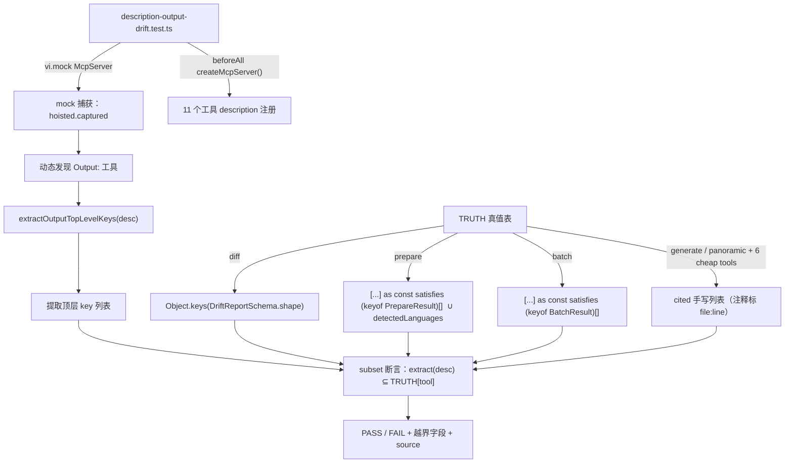

# Implementation Plan: F196 MCP description Output 字段名防漂移守护

**Branch**: `claude/elated-shockley-5115f0` | **Date**: 2026-06-13 | **Fix Report**: [fix-report.md](fix-report.md)

## Summary

新增一道测试期 lint 守护（`tests/unit/mcp/description-output-drift.test.ts`），校验所有带 `Output:` 的 MCP 工具（当前 11 个，动态发现）description 所举顶层字段名 ⊆ 真实返回顶层 key 集合（子集断言）。extractor 与 checker 均以 test-time 纯函数实现，co-locate 于新增测试文件内，不侵入 `src/` 运行时产物。真值来源：`diff` 用运行时 producer 派生（`Object.keys(DriftReportSchema.shape)`），`prepare`/`batch` 用 `[...] as const satisfies readonly (keyof T)[]`，其余 8 个工具用 cited 手写真值列表（每条注释标 source `file:line`）。

**守护强度边界（诚实声明）**：always-on 的 CI 守护是**运行时子集检查**——抓 description 侧字段名漂移（= F184 那 4 类历史缺陷的真实形态），对全部 11 工具有效。**producer-rename 闭合**真正被 CI 强制的**仅 `diff`**（运行时 `.shape` 派生）；`prepare`/`batch` 的 `satisfies` 是编译期断言，但本仓库 `build`/`lint`（根 tsconfig exclude tests）与 `typecheck:tests`（仅覆盖 type-tests/）**都不 type-check 本测试文件**，故该编译守护在 CI 里**休眠**（仅 IDE / 直接 `tsc` 下生效，作 latent 防御 + 自文档）。详见"回归风险评估"与"C1 残留"。零源码改动，零回归风险。

---

## Technical Context

**Language/Version**: TypeScript 5.x + Node.js 20.x  
**Primary Dependencies**: vitest（测试框架）；现有 MCP mock 机制（`@modelcontextprotocol/sdk/server/mcp.js`）  
**Storage**: N/A  
**Testing**: vitest；复用 `tests/unit/mcp/description-completeness.test.ts` 的 hoisted captured mock 写法  
**Target Platform**: 开发时 lint，不进入运行时  
**Performance Goals**: 单文件测试，执行时间 < 500ms  
**Constraints**: 纯新增文件，不改任何 src/ 文件；extractor 不引入第三方依赖

---

## Codebase Reality Check

| 文件 | LOC | 方法数 | 已知 debt |
|------|-----|--------|----------|
| `tests/unit/mcp/description-completeness.test.ts`（参考） | 84 | 1 helper + 3 test groups | 无 |
| `src/models/module-spec.ts`（只读 import） | ~280+ | — | 无（只用 DriftReportSchema 导出） |
| `src/core/single-spec-orchestrator.ts`（只读 import） | ~300+ | — | 无（只用 PrepareResult 类型） |
| `src/batch/batch-orchestrator.ts`（只读 import） | ~250+ | — | 无（只用 BatchResult 类型） |
| **新增**：`tests/unit/mcp/description-output-drift.test.ts` | 预估 210–250 行 | extractOutputTopLevelKeys（1）+ TRUTH（常量）+ subset×11 + drift×4 + non-fp×3 + completeness×2 + extractor unit×5 | — |

**前置清理规则评估**：目标文件均无新增行超过 500 LOC 门槛，无相关 TODO/FIXME，无代码重复。不需要前置 cleanup task。

---

## Impact Assessment

| 维度 | 评估 |
|------|------|
| 直接修改文件 | 1（新增测试文件） |
| 间接受影响 | 0（纯新增，无修改现有文件） |
| 跨包影响 | 无 |
| 数据迁移 | 无 |
| API/契约变更 | 无 |
| **风险等级** | **LOW** |

**风险判定理由**：影响文件数 = 1（纯新增），无跨包影响，无源码改动。唯一耦合点是 import 3 个已 export 的类型/schema——均已确认 `export`（见下方 Import 路径表）。

---

## Constitution Check

| 原则 | 适用性 | 评估 | 说明 |
|------|--------|------|------|
| 不自行添加未要求的功能 | 适用 | PASS | 仅实现 fix-report.md 已定方案 A，不引入额外功能 |
| 不改没完整看过的文件 | 适用 | PASS | 三个 import 源文件均已读取并确认 export 状态 |
| 提交前运行 vitest + build + repo:check | 适用 | PASS | 验证方案含三项全量检查 |
| extractor 逻辑不污染 src/ | 适用 | PASS | 所有新逻辑 co-locate 于 tests/，不进入 src/ |
| 测试间无共享可变状态 | 适用 | PASS | hoisted captured 在 beforeAll 重置；TRUTH 为 const，不可变 |

**VIOLATION**：无。

---

## 变更清单

| 操作 | 文件路径 | 说明 | 预估行数 |
|------|----------|------|---------|
| **新增** | `tests/unit/mcp/description-output-drift.test.ts` | 守护测试主文件（extractor + TRUTH + 全部 test suite） | ~220 行 |

**Import 路径确认表**（均已验证 export）：

| Symbol | 来源文件 | export 类型 | 验证状态 |
|--------|----------|------------|---------|
| `DriftReportSchema` | `src/models/module-spec.ts:246` | `export const` (Zod schema) | ✅ 已确认 |
| `PrepareResult` | `src/core/single-spec-orchestrator.ts:131` | `export interface` | ✅ 已确认 |
| `BatchResult` | `src/batch/batch-orchestrator.ts:201` | `export interface` | ✅ 已确认 |

---

## Architecture



---

## Extractor 算法详述

### `extractOutputTopLevelKeys(description: string): string[]`

**输入**：完整 description 字符串  
**输出**：`Output: { ... }` 段内深度 0 的 key 列表（无序）

**状态机伪代码**：

```
1. 在 description 中搜索 "Output: {" 子串（含前导空白变体）
2. 若未找到，返回 []（description 无 Output 段）

3. 从找到的 "{" 开始，初始化：
   depth = 0（当前花括号嵌套深度）
   sqDepth = 0（当前方括号嵌套深度）
   keys = []
   i = position of "{"

4. 逐字符扫描（i++）：
   char = description[i]

   case "{":
     depth++
     continue

   case "}":
     depth--
     if depth == 0:
       STOP（顶层对象已闭合，停止扫描）
     continue

   case "[":
     sqDepth++
     continue

   case "]":
     sqDepth--
     continue

   case default:
     // 仅在 depth == 1 且 sqDepth == 0 时收集顶层 key
     // （depth==1 表示在顶层对象内；depth>1 或 sqDepth>0 表示嵌套）
     if depth == 1 && sqDepth == 0:
       // 🔴 Codex C1 修正：分隔符用 lookahead，绝不消费 ,:}]
       // 否则末尾 key（如 "tokenUsage }"）会把闭合 } 一起吃掉，
       // 导致 case "}" 的 depth 归零 + STOP 永不触发，扫描漏入尾随散文。
       从当前位置匹配标识符模式 /^([a-zA-Z_$][a-zA-Z0-9_$]*)(?=\s*[,:}\]])/
       若匹配成功：keys.push(match[1])；i 仅前进 match[1].length - 1（只跳标识符本身，
                  把后随的 ,/:/}/] 留给下一轮循环交给上面的 depth/sqDepth 分支处理）

5. return keys（去重）
```

**关键边界处理**：

| 场景 | 输入片段 | 期望行为 |
|------|---------|---------|
| 嵌套数组对象 | `matches: [{line, text}]` | `sqDepth > 0` 时跳过，只收 `matches` |
| 嵌套对象值 | `summary: { a, b }, items` | `depth > 1` 时跳过，只收 `summary`、`items` |
| panoramic 尾随中文散文 | `{ answer, citations, tokenUsage }（其他 operation...）` | depth==0 时停止，`（其他...）` 被正确忽略 |
| **顶层 `}` 后跟 ASCII token（C1 回归）** | `Output: { a, b }, see: docs` | 末尾 `b` 后的 `}` 必须触发 depth 归零 + STOP；`see` **不得**被误收（lookahead 不消费 `}` 是关键）。Suite 1 须含此 fixture（见 E-06）|
| 无 Output 段 | graph 工具 description | 搜索不到 `Output: {`，返回 `[]` |
| 可选字段（`[key]` 写法） | `Output: { a, [b], c }` | `[` 触发 sqDepth++ 跳过 `b`；需特殊处理——此 description 写法不在当前 11 个工具中出现，暂不处理，保持简单 |

---

## 真值来源分层表（11 工具）

| 工具 | description Output 顶层字段 | 真值来源机制 | Source 引用 |
|------|---------------------------|------------|------------|
| **prepare** | skeletons, mergedSkeleton, detectedLanguages | `[...typed] as const satisfies readonly (keyof PrepareResult)[]` ∪ `'detectedLanguages'` | `src/core/single-spec-orchestrator.ts:131`（PrepareResult）；`src/mcp/server.ts:117`（detectedLanguages 附加） |
| **generate** | specPath, tokenUsage, confidence, warnings | cited 手写 | `src/mcp/server.ts:158-164`（JSON.stringify 内联字面量） |
| **batch** | successful, skipped, failed, indexGenerated | `['successful','skipped','failed','indexGenerated'] as const satisfies readonly (keyof BatchResult)[]` | `src/batch/batch-orchestrator.ts:201`（BatchResult）；`src/mcp/server.ts:244`（JSON.stringify(result) 原样透传） |
| **diff** | summary, items, recommendation | `Object.keys(DriftReportSchema.shape)` | `src/models/module-spec.ts:246`（DriftReportSchema） |
| **panoramic-query** | answer, citations, tokenUsage | cited 手写 | `src/panoramic/query.ts:63`（natural-language 分支返回 answer/citations/tokenUsage/durationMs/fallbackMode） |
| **view_file** | lines, startLine, endLine, totalLines, truncated, nextStepHint | cited 手写 | `src/mcp/file-nav-tools.ts:255-264`（data 对象字段） |
| **search_in_file** | matches, totalMatches, nextStepHint | cited 手写 | `src/mcp/file-nav-tools.ts:314-321`（data 对象字段） |
| **list_directory** | entries, entryCount, nextStepHint | cited 手写 | `src/mcp/file-nav-tools.ts:353-360`（data 对象字段） |
| **impact** | affected, summary, topImpacted, nextStepHint | cited 手写 | `src/mcp/agent-context-tools.ts:251-265`（data 对象字段） |
| **context** | definition, callers, callees, imports, topRelevantCallers, nextStepHint | cited 手写 | `src/mcp/agent-context-tools.ts:365-408`（data 对象字段） |
| **detect_changes** | changedSymbols, affectedSymbols, riskSummary, riskTier, topImpacted, nextStepHint | cited 手写 | `src/mcp/agent-context-tools.ts:636-651`（data 对象字段） |

**producer 派生覆盖说明（已并入 Codex C2 修正）**：
- `diff`：`Object.keys(DriftReportSchema.shape)` 运行时从 Zod schema 派生（Codex I1 确认 schema 是纯 `z.object`，未用 `.merge/.extend/.passthrough`，`.shape` 拿全 key 安全）。producer 改字段名 → `.shape` key 自动变 → 若 description 未同步则 subset 断言失败。**完全 producer 派生，零手写。**
- `prepare`/`batch`：用 **`[...] as const satisfies readonly (keyof T)[]`**（**不是** `Record<keyof T, true>`——后者写成 `{} as ...` 会被类型擦除产生空集，见 Codex C2）。数组字面量只列 description 相关 key，`satisfies` 编译期校验**每个元素都是真实 keyof T**：
  - producer 把某 key 改名 → 字面量里该字符串不再是 `keyof T` → **编译报错**，逼开发者更新 TRUTH → 更新后 description 旧名 ∉ TRUTH → subset 断言失败（漂移被抓）。
  - TRUTH 里写错字（typo）→ 非 keyof T → 编译报错。
  - 优点：无需枚举 T 全部 key（BatchResult 20+ 字段）；T 新增**无关**字段不会打断本测试编译（低耦合）。
  - `as const` 非必需但推荐（修正 Phase 2 复审 W）：`satisfies` 自带 contextual typing，会把每个 string literal 按 `keyof T` 校验（typo / 改名后旧名报 TS2322），**不加 `as const` 也能守护 typo**；加 `as const` 仅额外保留 readonly tuple 字面量类型，无害且更显式，故保留。

**C1 残留（诚实收窄，应对 Codex C3）**：8 个 cited 手写工具（generate / panoramic-query / view_file / search_in_file / list_directory / impact / context / detect_changes）的真值是纯手写列表，仍存在"producer 改名 + description + 真值表三处同向漏改 → 漏判"的残留 gap。**修正前的 over-claim**："这 8 个都有独立 producer 测试守护"——Codex C3 证伪：`search_in_file`/`list_directory` 的现有 handler 测试（`file-nav-tools.test.ts`）**未断言 `nextStepHint`**（producer 在 file-nav-tools.ts:321/359 附加），故这些字段的 producer 改名不会被任何现有测试或本守护捕获。**诚实结论**：
  - 既有测试只对**部分**字段提供独立守护（如 `matches`/`totalMatches`/`entryCount`/`entries`），**不覆盖** `nextStepHint` 等 enrichment 字段；
  - 本守护对这 8 个工具**只可靠捕获 description 侧打错字**（即 F184 那 4 类历史漂移的真实形态——全是 description 侧错误），**不可靠捕获 producer 侧改名**；
  - 接受此残留的依据：(1) F184 历史缺陷全是 description 侧，本守护对其 100% 有效；(2) producer 侧改名属 C2 文档化的 out-of-scope（本守护是"顶层字段名 lint"非完整合约）；(3) 闭合需对 6 个 inline-data 工具引入响应类型或运行时调用——属未要求的重构/重量，违背"轻量"约束。

---

## 测试用例清单

### Suite 1：extractor 单元测试（纯函数，不依赖 mock）

| ID | 描述 | 输入 | 期望输出 |
|----|------|------|---------|
| E-01 | 基本顶层 key 提取 | `"Output: { answer, citations, tokenUsage }"` | `['answer', 'citations', 'tokenUsage']` |
| E-02 | 嵌套数组对象跳过 | `"Output: { matches: [{line, text}], totalMatches, nextStepHint }"` | `['matches', 'totalMatches', 'nextStepHint']` |
| E-03 | 嵌套对象值跳过 | `"Output: { summary: { a, b }, items }"` | `['summary', 'items']` |
| E-04 | panoramic 尾随中文散文截止 | `"Output: { answer, citations, tokenUsage }（其他 operation...）"` | `['answer', 'citations', 'tokenUsage']` |
| E-05 | 无 Output 段返回空 | `"Use this tool when..."（无 Output:）` | `[]` |
| **E-06（C1 回归）** | **顶层 `}` 后跟 ASCII token 不被误收**（lookahead 不消费 `}`，顶层闭合即 STOP）| `"Output: { a, b }, see: docs and more"` | `['a', 'b']`（**不含** `see`/`docs`/`more`）|

### Suite 2：subset 断言 × 11 真实工具（所有当前 description 必须全绿）

| ID | 工具 | 断言 | 期望 |
|----|------|------|------|
| S-01 | prepare | extract(desc) ⊆ TRUTH['prepare'] | PASS |
| S-02 | generate | extract(desc) ⊆ TRUTH['generate'] | PASS |
| S-03 | batch | extract(desc) ⊆ TRUTH['batch'] | PASS |
| S-04 | diff | extract(desc) ⊆ TRUTH['diff'] | PASS |
| S-05 | panoramic-query | extract(desc) ⊆ TRUTH['panoramic-query'] | PASS |
| S-06 | view_file | extract(desc) ⊆ TRUTH['view_file'] | PASS |
| S-07 | search_in_file | extract(desc) ⊆ TRUTH['search_in_file'] | PASS |
| S-08 | list_directory | extract(desc) ⊆ TRUTH['list_directory'] | PASS |
| S-09 | impact | extract(desc) ⊆ TRUTH['impact'] | PASS |
| S-10 | context | extract(desc) ⊆ TRUTH['context'] | PASS |
| S-11 | detect_changes | extract(desc) ⊆ TRUTH['detect_changes'] | PASS |

### Suite 3：F184 历史漂移复现 fixture（证明 checker 会 flag）

使用**合成 drifted description**（不改源码），断言 checker 必须检测到漂移：

| ID | 工具 | 注入的错误 Output | 期望越界字段 |
|----|------|-----------------|------------|
| D-01 | prepare | `{ skeleton, detectedLanguages }` | `skeleton`（真实是 `skeletons`） |
| D-02 | batch | `{ generated, skipped, graphPath }` | `generated`, `graphPath` |
| D-03 | diff | `{ drifts, newBehaviors, staleItems }` | `drifts`, `newBehaviors`, `staleItems` |
| D-04 | panoramic-query | `{ answer, graph, overview }` | `graph`, `overview` |

### Suite 4：非误报（false-positive）fixture

断言合法 description 不触发漂移报告：

| ID | 描述 | 测试 fixture |
|----|------|-------------|
| FP-01 | 嵌套数组对象不误报 | `"Output: { matches: [{line, text, before, after}], totalMatches, nextStepHint }"` |
| FP-02 | 嵌套对象值不误报 | `"Output: { summary: { hits, misses }, items, count }"` |
| FP-03 | panoramic 尾随中文散文不误报 | 真实 panoramic-query description 中的 `}（其他 operation 返回各自结构...）` 片段 |

### Suite 5：完整性守护（防真值表覆盖漂移）

| ID | 描述 | 断言逻辑 |
|----|------|---------|
| C-01 | 每个带 Output 的工具在 TRUTH 有条目（防漏新工具） | `outputTools.every(name => name in TRUTH)` |
| C-02 | TRUTH 每条 key 对应真实带 Output 工具（防 stale） | `Object.keys(TRUTH).every(name => outputTools.includes(name))` |

---

## Known Gap（C2 文档化）

新测试文件头部注释须明示：

```
KNOWN SCOPE LIMITATION (C2):
本守护仅校验 description Example Output 的顶层字段名是否存在于真实返回的顶层 key 集合中。
不校验：嵌套字段名、值类型、字段顺序、可选性语义。
绿灯通过 ≠ 合约完全安全。嵌套 shape 一致性守护需独立的深度结构比对机制，
属 out-of-scope，不在本 F196 修复范围内。
```

---

## 回归风险评估

**为何零回归**：

1. **纯新增文件**：不修改任何现有 `src/` 或 `tests/` 文件，不改工具 description，不改任何运行时逻辑。
2. **mock 隔离**：复用 `description-completeness.test.ts` 同款 `vi.hoisted` + `vi.mock('@modelcontextprotocol/sdk/server/mcp.js')`，不影响其他测试文件。
3. **import 只读**：`DriftReportSchema`、`PrepareResult`、`BatchResult` 均只作类型/schema 读取，不调用任何函数，不触发副作用。
4. **11 个 description 当前已对**：F184 已修复所有漂移。Suite 2（动态遍历 `getOutputTools()`）的 subset 断言在现有 codebase 上必然全绿。
5. **唯一新增失败路径**：有人在 PR 中引入新漂移，此时新测试会 flag 并阻止合并 — 这正是守护的目的。

---

## 验证方案

```bash
# 1. 类型检查（src-only；注：根 tsconfig exclude tests，故本测试文件不被 build/lint type-check）
npm run build && npm run lint

# 2. type-tests（仅覆盖 tests/type-tests/，不含本文件——确认未破坏既有 type-tests）
npm run typecheck:tests

# 3. 新增测试 + 全量单元测试（本测试文件的类型/逻辑由 vitest 运行期校验；确认零失败、零回归）
npx vitest run

# 4. 仓库一致性检查
npm run repo:check
```

> 注（应对 Codex Issue 1）：`prepare`/`batch` 的 `as const satisfies` 编译期断言**不被上述任何命令覆盖**（tests 不在 type-check 范围）；它仅在 IDE / 手动 `tsc` 单测文件时生效。always-on 守护是 `npx vitest run` 跑的运行时子集检查。

**验收标准**：
- `npx vitest run` 全绿，新增测试 Suite 1-5 全部 PASS
- `npm run build` 类型零错
- `npm run repo:check` 无 violation
- Suite 3（D-01~D-04）通过：4 个合成 drifted fixture 均触发 checker flag（证明守护有效）
- Suite 5（C-01、C-02）通过：动态发现的 Output 工具数与 TRUTH 条目数一致（当前预期 = 11）

---

## Project Structure

```text
specs/196-fix-mcp-description-output-drift/
├── fix-report.md       # 诊断报告（输入）
└── plan.md             # 本文件

tests/unit/mcp/
├── description-completeness.test.ts   # 已有，不修改（参考 mock 写法）
└── description-output-drift.test.ts   # 新增（本 fix 唯一交付物）
```

**Structure Decision**：单一新增文件，co-locate 于 `tests/unit/mcp/`（与 `description-completeness.test.ts` 同目录，同属 MCP description 守护层），符合"测试与被测逻辑同层"约定。extractor 作为文件内私有函数（不 export），避免滥用为运行时工具。
