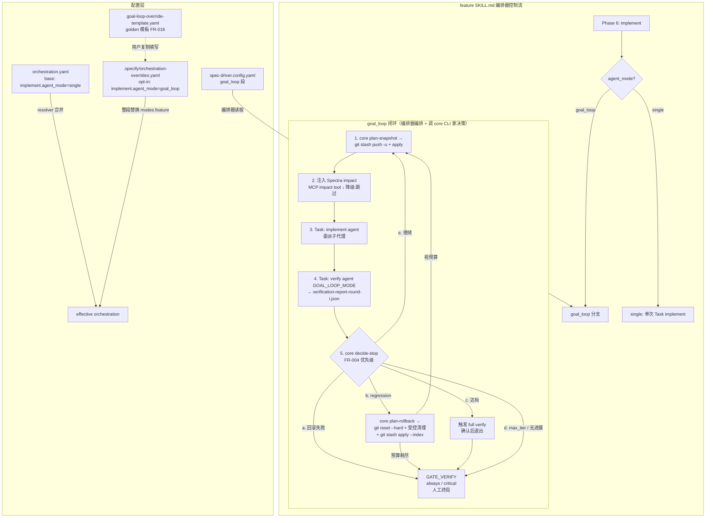

# Feature 201 — 技术实现计划

## 1. 总体架构决策

### 1.1 核心形态：可执行 core（确定性逻辑）+ SKILL.md 散文编排（修正 Codex GL-02）

> **关键架构修正（Codex GL-02）**：初版计划把停止判定、五维 delta、metric 分类、回滚命令规划全部写进 SKILL.md 散文块，由编排器 LLM 解释。Codex 指出：这些逻辑**无可 import 的代码**，T-GL-05~13 等单测将测试一个"不存在的决策模块"——形成"测试通过但实际闭环未被测"的自欺。**修正**：把所有**确定性决策逻辑下沉到可执行、可单测的 core 模块**，SKILL.md 散文只保留"编排"职责（何时委派 implement/verify、调 core、执行 core 规划出的 git 命令）。

goal_loop 由两层构成：

1. **可执行确定性 core**（新增）——`plugins/spec-driver/scripts/lib/goal-loop-core.mjs`。**12 个纯函数（无 I/O，输入→输出，100% 单测）**：
   - `classifyCommand(cmdResult)` → `PASS|FAIL|SKIPPED|UNKNOWN`（缺 exit_code → UNKNOWN，FR-009）
   - `evaluateMetric(report)` → 达标布尔（Layer2 全 PASS ∧ P1 FR 100% ∧ Layer1.5 COMPLIANT，FR-008）
   - `detectRegression(prevReport, curReport)` → `{ regression: bool, commands: [] }`，**按 `verify_mode` 同模式分桶**比较（smoke↔smoke / full↔full，修正 GL-04），FR-013
   - `computeDelta(prevReport, curReport)` → 五维向量 + `hasProgress` 布尔（FR-006）
   - `decideStop({report, round, config, prevReports, rollbackResult})` → `{ stop, exit_reason, action }`，FR-004 优先级；**内部自调 `detectRegression`** 推导 regression（修正 tasks C-01，不依赖外部传入或 report 自带字段）
   - `decideDispatch(phaseId, agentMode)` → `{ dispatch: 'goal_loop'|'single', warning? }`，误配非 implement 阶段降级（FR-017）
   - `selectVerifyMode(round, maxIterations, aboutToExit)` → `'smoke'|'full'`（FR-007 分层）
   - `planSnapshotCommands(isClean)` / `planRollbackCommands(S_i)` → git 命令序列（GL-01 回滚正确性下沉为可测命令规划）
   - `parseReport(jsonText)` → `{ report } | { degraded: 'infra-failure', reason }`：**纯函数，仅返回结构化结果或降级标记，不写日志**（日志由编排器写，修正 WL-01）；schema 非法/缺退出码 → 降级标记（FR-010/GL-03）
   - `interpretImpactResult(mcpResult)` → `{ injected, summary } | { skipped, warning }`：**纯函数只解释 MCP impact 返回**（实际 MCP 调用由编排器发起），graph-not-built/错误 → skipped+warning（FR-011/012，修正 tasks C-03——取代不可测的 injectSpectraImpact）
   - `formatIterationLogEntry(entry)` → 含内嵌 ```json 围栏的 markdown 块（FR-019 结构化日志可解析，修正 tasks W-04；写盘由编排器做）
2. **I/O 边界小助手**（不在纯 core）——单实例锁 `acquireLock(lockPath)` / `releaseLock(lockPath)` 有文件系统副作用，放 `goal-loop-cli.mjs` 内或单列，**用 temp-dir 集成测试**（非纯函数单测），FR-018。诚实标注：这部分不是"纯函数 100% 覆盖"。
3. **SKILL.md 散文编排层**（薄）——`feature SKILL.md` 新增 goal_loop 小节：委派 implement/verify 子代理、调 `goal-loop-cli.mjs` 拿决策、执行 core 规划的 git 命令、写迭代日志。**不在散文手写 stop/delta/回滚逻辑**。

CLI 包装 `plugins/spec-driver/scripts/goal-loop-cli.mjs`（薄，仿 `orchestrator-cli.mjs`）把 core 暴露为子命令供散文经 Bash 调用：`decide-stop` / `classify-report` / `plan-snapshot` / `plan-rollback` / `select-verify-mode` / `decide-dispatch`（纯 core，输出 JSON）+ `acquire-lock` / `release-lock`（I/O 边界）。

**与 batch_loop 的关系**：仍沿用"orchestration.yaml 声明性标签 + SKILL.md 编排"的形态；差异是 goal_loop 把确定性逻辑下沉为可测 core（batch_loop 逻辑简单无此需要）。这不违背"平行范式"，是对更复杂停止逻辑的合理工程化。

### 1.2 委派边界（最重要的架构约束）

根据 `plugins/spec-driver/skills/spec-driver-feature/SKILL.md:181-183` 的委派硬约束：

```text
编排器亲自执行范围（GATE 式控制逻辑，goal_loop 循环体内）：
  - 调用 goal-loop-cli.mjs 拿 snapshot/rollback git 命令并执行（core 规划，编排器执行）
  - 注入 Spectra impact 上下文（调用 MCP tool，摘要结果注入 Task prompt）
  - 调用 goal-loop-cli.mjs decide-stop 拿停止/处置决策（core 计算五维 delta + 优先级）
  - 维护单实例锁（文件锁）和迭代日志追加

委派子代理执行（不可 inline）：
  - 每轮 implement → Task("implement", ...)
  - 每轮 verify → Task("verify", ...)，产出结构化 verification-report-round-{i}.json
```

> 确定性判断（stop/delta/metric/回滚命令规划）虽由编排器"触发"，但**实际计算在可执行 core 里**，编排器只是执行 core 的输出。这把"LLM 解释复杂逻辑"的风险压到最小，且让逻辑可单测。

GATE_IMPLEMENT_MID 现状为 `on_failure / non_critical`（仅适用于 implement mode）。**F201 的 golden override 模板不把它计入 goal_loop reward-hacking 护栏，也不升级它**（GL-05）；goal_loop 每轮结束即 verify，已覆盖"中途检查"价值。若未来文档/模板要把它列为护栏，**必须同步升级为 `always/critical`**（FR-023）。GATE_VERIFY（`always / critical`）保持最终人工收口，是真正的强护栏。

### 1.3 feature SKILL.md 中的 goal_loop 分派分支落点

在现有 feature SKILL.md 的"执行模式"小节，编排器处理 implement phase 时已有"读取 agent_mode 分派"模式（inline/single/parallel_group/gate/orchestrator_verify）。F201 在该分派逻辑处**新增 `goal_loop` 分支**：

```text
当 implement phase 的 effective agent_mode == "goal_loop" 时：
  → 执行 §goal_loop 编排逻辑（散文小节：委派 + 调 core CLI + 执行 git 命令）
  → 而非委派单次 Task("implement", ...)
否则（single，base 默认）：
  → 原单次 Task("implement", ...) 路径不变
```

goal_loop 散文小节作为独立章节添加在 feature SKILL.md 工作流执行章节末尾。

---

## 2. Open Questions 决策

### OQ-02 决策：snapshot 机制选型（修正 Codex GL-01）

**选型：`git stash push --include-untracked`（建锚点并保留工作区）+ 受控还原**

> **GL-01 修正**：初版选 `git stash create` + `git checkout -- .`，存在真 bug——`git stash create` **不含 untracked 新文件**，`git checkout -- .` **不删 untracked、不复位 index**。若某轮 implement 新建文件或 staged 增删，回滚会残留脏文件，违反 FR-013/SC-003。下面是修正后的正确语义，且**回滚命令序列由 `goal-loop-core.planRollbackCommands()` 规划、被单测覆盖**（不再是散文里手写易错的 git 咒语）。

> **核心洞察（修正 CL-01）**：`git stash push --include-untracked` **会捕获全部 untracked（含 goal_loop 启动前已存在的 untracked）**。因此回滚用 `git clean -fd` 删掉所有 untracked 是安全的——它们已在 stash 里，`stash apply` 会原样还原。初版的"受控清理（只删本轮新增）"反而漏还原"本轮修改了的既有 untracked 文件"，是错误设计。正确机制是**全量捕获 + 全量清理 + 全量还原**，简单且无损。

**snapshot 启动前置语义（修正 CL-01/Codex 第 1 点）**：goal_loop 可能在**工作区已有未提交改动**（用户进入前的 staged/unstaged/untracked）时启动。S_1 的 snapshot 捕获**完整工作区状态**，回滚还原到该完整状态——即 goal_loop 把"启动时的脏状态"视为基线，每轮回滚都回到该轮**开始前**的完整状态（含上一轮保留的累积改动）。这定义明确、无歧义。

**建立 snapshot S_i（每轮 implement 前）**：
```text
if `git status --porcelain` 为空:           # 工作区干净
    S_i = { clean: true, ref: <HEAD SHA> }   # 无 stash entry，锚点 = HEAD
else:
    git stash push --include-untracked -m "goal_loop-S{i}"   # 全量捕获 tracked+staged+untracked，树回到 HEAD
    S_i = { clean: false, ref: $(git rev-parse stash@{0}) }  # 紧接 push 后捕获 SHA（不会取到旧 stash）
    git stash apply --index {S_i.ref}                         # 立即原样还原，继续本轮
```
> 干净分支不执行 `git rev-parse stash@{0}`（避免误取旧 stash，修正 CL-02）；非干净分支在 push 成功后立即 `rev-parse` 捕获本次 SHA。

**回滚到 S_i（core `planRollbackCommands(S_i)` 规划，纯函数可单测）**：
```text
planRollbackCommands(S_i):
  base = [ "git reset --hard HEAD",   # 复位 tracked+index 到 HEAD
           "git clean -fd" ]          # 删全部 untracked（-f -d，不带 -x 故保留 .gitignore 文件）
  if S_i.clean:
    → base                            # 干净基线：reset+clean 即回到 S_i
  else:
    → base + [ "git stash apply --index {S_i.ref}" ]   # 全量还原 S_i（含既有 untracked，CL-01 解决）
```
- `git clean -fd` 安全性（修正 A-2）：
  - **不带 `-x`** → `.gitignore` 文件（node_modules / dist 等）不被误删
  - **单 `-f`（非 `-ff`）** → git 拒绝删除嵌套 git 仓库（nested `.git`），不会误删；本仓库**无 submodule**（`.gitmodules` 不存在），`-d` 不会递归进子模块
  - **已知限制（诚实标注）**：git 不追踪空目录，故 goal_loop 启动前已存在的**空 untracked 目录**不在 stash 内、回滚 `clean -fd` 会删且不重建。对代码 worktree 这是可接受的低影响限制；若未来需要保留，可在 snapshot 时 `find . -type d -empty` 记录清单、回滚后重建（留后续，不在 MVP）
- core 只**规划命令字符串**（纯函数）；编排器逐条执行并检查退出码。

**迭代结束清理**：迭代结束后按各轮 `S_i.ref`（非 clean 者）`git stash drop`，**严格后置于所有 apply**，不丢锚点。

**失败处理（FR-014）**：任一回滚命令非零退出 → 立即停止进 GATE_VERIFY，输出失败详情，不继续（FR-014）。

**与 autoresearch:fix 范式的关系**：fix 的 keep/discard 是一次性用户决策，goal_loop 是无人值守自动迭代，需要可靠且**可单测**的回滚——故把回滚命令规划下沉 core。

---

### OQ-03 决策：verify smoke/full 分层粒度

**选型：固定策略（不运行时动态判断），由轮次决定层级**

| 轮次 | 默认策略 | 理由 |
|------|---------|------|
| 第 1 至 (N-1) 轮 | **smoke（快速子集）** | 快速反馈循环，减少 max_verify_seconds 消耗 |
| 最后一轮（i == max_iterations）| **full** | 确保最终状态完整验证 |
| 达标退出前 | **full**（强制触发一次）| 达标必须经过 full verify，防止 smoke 下的假达标 |

**smoke 定义（修正 GL-04 + WL-03：typecheck 而非 full build）**：
```text
smoke 模式：tsc --noEmit（快速类型检查，不产物输出）+ unit test（npx vitest run）
            —— 用 tsc --noEmit 而非 npm run build：前者只做类型检查、秒级，
               既即时捕获类型回归（spec EC-03），又不付完整构建（emit/bundle）的时间代价（WL-03）
full 模式：npm run build（完整构建）+ lint + repo:check（+ release:check 如涉发布）
```

> **GL-04 修正**：初版 smoke 仅跑 unit test、跳过类型检查，类型错误潜伏到最后一轮才暴露、前面轮次基于无法编译的代码迭代浪费预算。**WL-03 修正**：但用 full `npm run build` 每轮又太慢、可能把正常慢构建误判 infra-failure；折中用 `tsc --noEmit` 秒级类型检查，full build 留最后一轮。`max_verify_seconds` 默认 300 对 smoke（tsc --noEmit + vitest）充裕。

> smoke 下的达标判定：即使 smoke 轮 Layer2（build+test）全 PASS，goal_loop MUST NOT 记达标——达标退出前必须触发一次 full verify 重判。堵死"smoke 假达标"。

**regression 比较只在同 mode 内（修正 GL-04）**：`regression_check` 比较 `previously_passing_commands` 时，**只比较本轮实际执行且与上一同 mode 轮次相同的命令集**——smoke 轮与 smoke 轮比、full 轮与 full 轮比；绝不把"smoke 未跑 lint"误判成 lint regression。`computeDelta` / regression 判定在 core 里按 `verify_mode` 分桶比较，单测覆盖（T-GL-12 增加 smoke↔full 不误判用例）。

**与 max_verify_seconds 的关系（FR-007）**：单次 verify 墙钟上限，smoke/full 均适用；超限→该命令标 FAIL（timeout 视同非零退出）计入 delta；连续 `no_progress_max_rounds` 轮五维全 0 → 早停。

**smoke 子集与 Spectra impact 的关系**（US-5 D2）：smoke 子集为**静态定义**（build+unit test 全量），不依赖 Spectra impact BFS 动态派生，避免"smoke 依赖 graph 可用"的循环依赖；Spectra impact 仅用于注入 implement agent prompt（FR-011）。

---

### verification-report schema 决策（FR-010）

goal_loop 消费的结构化 verification-report 文件为 `{feature_dir}/goal-loop/verification-report-round-{i}.json`，格式如下：

```jsonc
{
  "round": 1,
  "timestamp": "2026-06-20T10:00:00Z",
  "verify_mode": "smoke | full",
  "wall_seconds": 42.3,

  // Layer 2：每命令结果（职责分离：由独立 verify 子代理实跑产出，implement 不得自报）
  "layer2_commands": [
    {
      "name": "npm run build",
      "exit_code": 0,                // 必须有真实退出码；缺失则 status = UNKNOWN
      "status": "PASS",              // PASS | FAIL | SKIPPED | UNKNOWN
      "duration_seconds": 8.1,
      "output_summary": "Build succeeded, 0 errors",
      "skipped_reason": null         // 非 null 时 status = SKIPPED，内容为原因
    }
  ],

  // Layer 1：FR 覆盖率（checkbox 级，复用 verify agent 现有统计）
  "layer1_fr_coverage": {
    "p1_total": 12,
    "p1_covered": 10,
    "p1_coverage_pct": 83.3,
    "uncovered_fr_ids": ["FR-018", "FR-021"]
  },

  // Layer 1.5：证据状态
  "layer1_5_evidence": {
    "status": "COMPLIANT | PARTIAL | EVIDENCE_MISSING",
    "detail": "..."
  },

  // 回归检测：与前一轮 PASS 集合的差集
  "regression_check": {
    "previously_passing_commands": ["npm run build", "npx vitest run"],
    "now_failing": [],              // 非空则触发回滚（FR-013）
    "regression_detected": false
  },

  // 五维 delta 所需字段（编排器读取此轮与上轮 report 计算 delta）
  "delta_inputs": {
    "layer2_pass_count": 3,         // 维度 1
    "p1_fr_coverage_pct": 83.3,     // 维度 2
    "layer1_5_status_score": 1,     // 维度 3：COMPLIANT=2 / PARTIAL=1 / EVIDENCE_MISSING=0
    "regression_count": 0,          // 维度 4
    "net_loc_delta": 42             // 维度 5：由编排器通过 git diff --stat 计算，不依赖 verify agent
  }
}
```

**生产者契约（修正 GL-03：改 verify.md 支持 JSON 输出模式）**：
- 初版说"不改 verify.md、只靠 prompt 注入要求产出 JSON"——Codex GL-03 指出 verify.md 现状只产 Markdown（`verification-report.md`），靠 prompt 注入无法保证每轮稳定产出严格 JSON。**修正**：在 `verify.md` 新增 **goal_loop JSON 输出模式**——当编排器在 prompt 注入 `GOAL_LOOP_MODE=round-{i}` 时，verify 子代理除常规 Markdown 报告外，**额外**按本 schema 写 `{feature_dir}/goal-loop/verification-report-round-{i}.json`。verify.md 已逐命令记录退出码 + 输出摘要（:154），JSON 化是把既有数据结构化落盘，不改 Layer 1/1.5/2 验证逻辑本身。
- **解析失败降级（GL-03）**：`goal-loop-core.parseReport()` 若遇 JSON 缺失 / schema 非法 / 字段缺失 → **返回 `{degraded:'infra-failure', reason}` 降级标记**（纯函数，不自行写日志），所有无法证明退出码的 command 记 **UNKNOWN**（不达标）；**编排器**据此把该轮标 infra-failure 写入 iteration-log，按 FR-007 计入无进展/早停判定，绝不静默当达标。

**职责分离（防 reward-hacking，FR-010，N-01）**：
- report **必须由独立 verify 子代理实跑命令捕获真实退出码**产出；implement 子代理产出不得含 `layer2_commands[].exit_code|status`，`parseReport` 对缺 exit_code 的条目强制 UNKNOWN。
- goal_loop 调 verify 子代理时 prompt 注入："此次 verify 由 goal_loop 闭环触发，你必须独立实跑所有命令并捕获真实退出码，不得引用 implement agent 的任何达标声明。"

**存储约定**：
- 结构化报告：`{feature_dir}/goal-loop/verification-report-round-{i}.json`（按轮分文件，保留历史）
- 迭代日志：`{feature_dir}/goal-loop/iteration-log.md`（人可读，供 GATE_VERIFY 回顾）
- 单实例锁：`{feature_dir}/goal-loop/.lock`

---

### goal_loop 配置项落点（FR-005/FR-006/FR-007）

在 `spec-driver.config.yaml` 新增顶层 `goal_loop` 段：

```yaml
# goal_loop 配置（Feature 201）
# 仅在 .specify/orchestration-overrides.yaml 启用 goal_loop 时生效
goal_loop:
  max_iterations: 5               # 最大迭代轮数（FR-005），默认 5
  no_progress_max_rounds: 2       # 连续无进展轮数触发早停（FR-006），默认 2
  max_verify_seconds: 300         # 单轮 verify 墙钟上限（FR-007，timeout 强制、可机器校验），默认 300
  max_tool_invocations: 50        # 单轮编排器可见委派/调用数上限（FR-007，best-effort 粗粒度安全网，非子代理内部计数；见 tasks GL-09），默认 50
```

schema 扩展：在 `plugins/spec-driver/scripts/lib/config-schema.mjs` 的 config schema 新增 `goal_loop` 段（可选，不破坏现有 config 校验）。

---

## 3. Codebase Reality Check

### 直接修改文件

| 文件 | LOC | 函数/方法数 | 已知 Debt | 前置清理？ |
|------|-----|-----------|----------|-----------|
| `plugins/spec-driver/contracts/orchestration-schema.mjs` | ~280 | ~9 exported schema | 无 | 否 |
| `plugins/spec-driver/config/orchestration.yaml` | ~400（估算） | N/A | 无 | 否 |
| `plugins/spec-driver/skills/spec-driver-feature/SKILL.md` | ~370 | N/A（散文） | 无 | 否 |
| `plugins/spec-driver/agents/verify.md` | ~230 | N/A（散文） | 无 | 否（仅加 JSON 输出模式段）|
| `plugins/spec-driver/scripts/lib/config-schema.mjs` | 457（已确认存在，GL-08）| Zod config schema | 无 | 否 |
| `spec-driver.config.yaml` | 126 | N/A | 无 | 否 |

### 新增文件

| 文件 | 类型 | 说明 |
|------|------|------|
| `plugins/spec-driver/scripts/lib/goal-loop-core.mjs` | 新增 | **确定性 core**：10 纯函数 classifyCommand / evaluateMetric / detectRegression / computeDelta / decideStop / decideDispatch / selectVerifyMode / planSnapshotCommands / planRollbackCommands / parseReport（GL-02，可单测）|
| `plugins/spec-driver/scripts/goal-loop-cli.mjs` | 新增 | core 的薄 CLI 包装（仿 orchestrator-cli.mjs），供 SKILL.md 散文经 Bash 调用 |
| `plugins/spec-driver/templates/goal-loop-override-template.yaml` | 新增 | golden override 模板（FR-016）|
| `plugins/spec-driver/tests/fixtures/orchestration/valid-overrides-goal-loop.yaml` | 新增 | 测试 fixture |
| `plugins/spec-driver/tests/fixtures/goal-loop/*.json` | 新增 | verification-report 样例 fixture（喂 core 单测）|
| `plugins/spec-driver/tests/goal-loop-core.test.mjs` | 新增 | **测 core 真实函数**（GL-02 修正：不再测散文虚构模块）|

### feature SKILL.md source-of-truth 确认

通过检查 `plugins/spec-driver/scripts/codex-skills.sh`（行 60-69）：`spec-driver-feature` 在 `SKILLS` 数组中，安装时从 `plugins/spec-driver/skills/spec-driver-feature/SKILL.md` 同步到 `.codex/skills/spec-driver-feature/SKILL.md`（加 wrapper 头）。

**结论**：`plugins/spec-driver/skills/spec-driver-feature/SKILL.md` 是直接 source-of-truth，可直接编辑。编辑后运行 `bash $PLUGIN_DIR/scripts/codex-skills.sh install` 同步 Codex wrapper。`sync-agent-docs.mjs` **不同步 SKILL.md**（仅同步 CLAUDE.md / AGENTS.md 中的共享段），无被覆盖风险。

---

## 4. Impact Assessment

### 影响范围

| 类别 | 文件 / 区域 | 说明 |
|------|-----------|------|
| 直接修改 | 4-5 个文件 | schema、orchestration.yaml、feature SKILL.md、config schema、config.yaml |
| 间接受影响 | `plugins/spec-driver/tests/orchestration-resolver.test.mjs` | 需新增 goal_loop fixture 测试，无需修改已有测试 |
| 间接受影响 | `.codex/skills/spec-driver-feature/SKILL.md` | 通过 codex-skills.sh 重新安装后自动同步，不手动修改 |
| 无影响 | fix / story / refactor / implement / resume / sync / doc | 7 种 mode 不消费 YAML phases，goal_loop 对其完全透明 |

**跨包影响**：无（仅在 `plugins/spec-driver/` 包内）。

**数据迁移**：无（spec-driver.config.yaml 新增可选段，后向兼容；现有 config 不需要变更）。

**API/契约变更**：
- `agent_mode` Zod 枚举扩展（加 `goal_loop`）—— 纯增量，现有合法值校验不变
- `config-schema.mjs` 新增可选段 —— 后向兼容

**风险等级：LOW**
- 影响文件 < 10
- 无跨包影响
- 无数据迁移
- 无现有接口破坏（仅增量扩展枚举和可选配置段）；新增 core/cli 是独立纯函数模块，不被现有路径 import
- 最大风险点：feature SKILL.md 编排散文层的 LLM 解释——已通过把确定性逻辑下沉可测 core（GL-02）大幅压低，剩余靠 verify 阶段 e2e 兜底

---

## 5. 改动文件清单（精确路径）

| # | 文件路径 | 操作 | 说明 |
|---|---------|------|------|
| 1 | `plugins/spec-driver/contracts/orchestration-schema.mjs` | **修改** | `agent_mode` enum 新增 `goal_loop`；`error_map` 文案更新列出 goal_loop（FR-001）|
| 2 | `plugins/spec-driver/config/orchestration.yaml` | **修改** | feature mode implement phase 注释说明 base 默认 `single`、goal_loop 使用说明注释（FR-002、FR-015）|
| 3 | `plugins/spec-driver/scripts/lib/goal-loop-core.mjs` | **新增** | 确定性 core 10 纯函数（GL-02 核心）：classify/evaluateMetric/detectRegression/computeDelta/decideStop/decideDispatch/selectVerifyMode/planSnapshot/planRollback/parseReport |
| 4 | `plugins/spec-driver/scripts/goal-loop-cli.mjs` | **新增** | core 薄 CLI 包装（decide-stop/classify-report/plan-snapshot/plan-rollback/select-verify-mode/decide-dispatch 纯命令 + acquire-lock/release-lock I/O 边界，输出 JSON）|
| 5 | `plugins/spec-driver/skills/spec-driver-feature/SKILL.md` | **修改** | "执行模式"小节新增 goal_loop 分派分支 + goal_loop **编排散文小节**（委派 + 调 core CLI + 执行 git 命令；FR-002/003/004…019）|
| 6 | `plugins/spec-driver/agents/verify.md` | **修改** | 新增 **goal_loop JSON 输出模式**段（GOAL_LOOP_MODE 注入时额外产出 `verification-report-round-{i}.json`）（FR-010、GL-03）|
| 7 | `plugins/spec-driver/scripts/lib/config-schema.mjs` | **修改** | 新增可选 `goal_loop` 段（四项配置 + default）；Zod schema（FR-007）|
| 8 | `spec-driver.config.yaml` | **修改** | 新增注释掉的 `goal_loop` 段示例（不激活）|
| 9 | `plugins/spec-driver/templates/goal-loop-override-template.yaml` | **新增** | feature golden override 模板（完整 phase，仅 implement 改 goal_loop）（FR-016）|
| 10 | `plugins/spec-driver/tests/fixtures/orchestration/valid-overrides-goal-loop.yaml` | **新增** | override 合法配置 fixture |
| 11 | `plugins/spec-driver/tests/fixtures/goal-loop/*.json` | **新增** | verification-report 样例（喂 core 单测的输入）|
| 12 | `plugins/spec-driver/tests/goal-loop-core.test.mjs` | **新增** | 测 core 真实函数（见第 7 节）|

**不需要修改的文件**：
- `plugins/spec-driver/lib/orchestration-resolver.mjs`：resolver 整段替换合并，新 enum 由 schema 自动接受，无需改 resolver
- `.codex/skills/spec-driver-feature/SKILL.md`：经 codex-skills.sh 重装自动同步

---

## 6. 架构图



---

## 7. 测试策略（TDD）

**测试目标 = 可执行 core 真实函数（修正 GL-02）**。`goal-loop-core.test.mjs` 直接 `import` 并断言 `goal-loop-core.mjs` 的 **10 个纯函数**（classifyCommand / evaluateMetric / detectRegression / computeDelta / decideStop / decideDispatch / selectVerifyMode / planSnapshotCommands / planRollbackCommands / parseReport）；schema/opt-in/模板类测试走现有 resolver 测试设施。格式沿用 `orchestration-resolver.test.mjs` 的 `node:test` 风格。**每个测都对应可 import 的真实代码，不存在"测散文虚构模块"。**

### 测试矩阵

| 测试 ID | 覆盖 FR | 被测真实目标 | 断言要点 | 关联 SC |
|---------|---------|------------|---------|---------|
| T-GL-01 | FR-001 | orchestration-schema 枚举 | `goal_loop` 通过 schema；error_map 文案含 `goal_loop` | SC-004 |
| T-GL-02 | FR-015/016 | resolver effective config | base + 无 override → feature implement agent_mode=single | SC-004 |
| T-GL-03 | FR-016 | golden 模板 + resolver | 模板经 resolver 后仅 implement.agent_mode=goal_loop，其余 phase 与 base **逐字段等价**（GL-07）| SC-004 |
| T-GL-04 | FR-016 | resolver diagnostics | version 不一致 → diagnostics 含 version-mismatch；一致 → 空 | SC-004 |
| T-GL-05 | FR-004/008 | `decideStop()` | 末轮 report layer2 全 PASS+p1 100%+layer1_5 COMPLIANT+i==max → exit_reason=REACHED_GOAL（达标优先）| SC-001 |
| T-GL-06 | FR-005 | `decideStop()` | 连续 3 轮未达标 + max=3 → exit_reason=MAX_ITERATIONS | SC-002 |
| T-GL-07 | FR-006 | `computeDelta()`+`decideStop()` | 连续 2 轮五维全 0 → exit_reason=NO_PROGRESS | SC-002 |
| T-GL-08 | FR-006 | `computeDelta()` | 1 轮五维全 0 + 1 轮 layer2_pass +1 → hasProgress=true，不早停 | SC-002 |
| T-GL-09 | FR-008/009 | `evaluateMetric()` | layer2 含 SKIPPED → 不达标 | SC-001 |
| T-GL-10 | FR-008/009 | `classifyCommand()` | 缺 exit_code → UNKNOWN → 不达标 | SC-001 |
| T-GL-11 | FR-009/010 | `parseReport()` | 缺退出码/非法 JSON → infra-failure + 条目 UNKNOWN，不达标 | SC-001 |
| T-GL-12 | FR-013 | `detectRegression()` | 上轮 PASS 本轮 FAIL → regression=true；**smoke↔full 跨模式不比较**（修正 WL-02：测分桶逻辑所在的真实函数）| SC-003 |
| T-GL-12b | FR-003/013 | `planRollbackCommands()` | 返回 `reset --hard + clean -fd (+ stash apply --index)` 正确序列（clean 与非 clean 两分支）| SC-003 |
| T-GL-13 | FR-014 | `decideStop()` | rollbackResult=failed → exit_reason=ROLLBACK_FAILED（最高优先）| SC-003 |
| T-GL-14 | FR-017 | `decideDispatch()` | goal_loop 配在非 implement phase → `{dispatch:'single', warning}` | SC-004 |
| T-GL-15 | FR-021 | orchestration.yaml 解析 | GATE_VERIFY default_behavior=always / severity=critical 固定断言 | SC-005 |
| T-GL-16 | FR-007 | `selectVerifyMode()` | round < max → smoke；round == max / aboutToExit → full | SC-001 |
| T-GL-17（集成）| FR-012 | 编排层 impact 降级 | **MCP impact 调用返回 graph-not-built → 跳过注入、记降级、迭代继续**；非纯函数，用 mock MCP 的集成测试（不归 parseReport，修正 WL-06）| SC-001 |
| T-GL-18（集成）| FR-018 | `acquireLock()`（I/O）| temp-dir：.lock 存在 → 第二实例 acquire 返回 conflict；非纯函数 | SC-001 |
| T-GL-19 | FR-013 | `planSnapshotCommands()` | isClean=true → 仅 HEAD 锚点（无 stash）；isClean=false → `stash push -u` + `rev-parse` + `apply --index` 序列 | SC-003 |

> **测试边界（single-source，诚实分层）**：
> - **纯函数单测（100% 覆盖）**：T-GL-05~16、T-GL-19——直接 import core 纯函数喂 fixture 断言。这些是确定性逻辑，可完全覆盖。
> - **I/O 集成测试**：T-GL-17（mock MCP impact 降级）、T-GL-18（temp-dir 文件锁）——有副作用，用集成测试，不宣称纯函数覆盖（修正 CL-03 的 over-claim）。
> - **e2e（verify 阶段）**：编排器实际委派 implement/verify、真实 git stash 执行、迭代日志写盘——启用 goal_loop override 跑红→绿有界任务实测。
> - **golden-text 校验**：SKILL.md 散文含必需步骤与 MUST 标记。
> - **文档校验**：FR-023 reward hacking 诚实记录由 plan.md/spec.md 内容校验。
>
> **不 over-claim**：单测覆盖确定性 core；LLM 编排与真实 git/MCP 由 e2e 兜底。

---

## 8. Constitution Check

| 原则 | 适用性 | 评估 | 说明 |
|------|--------|------|------|
| 委派硬约束（禁止 inline 产出阶段）| 高 | COMPLIANT | goal_loop 的 implement + verify 轮次各委派子代理；确定性决策在可执行 core，编排器只是触发 + 执行 core 输出（GATE 式控制），符合 inline 豁免范围的精神 |
| 不得引入 spec 未定义功能 | 高 | COMPLIANT | 所有新增均有对应 FR；core 模块是 FR-004/006/008/010/013 确定性逻辑的落地载体，非新功能 |
| 显式路径 commit 禁 git add -A | 高 | COMPLIANT | plan/tasks 用显式路径；snapshot 用 `git stash push -u`（非 commit、不碰 git add -A 交付路径）|
| repo:sync / repo:check / release:check | 高 | 需注意 | 修改 plugins/spec-driver/ 后必须跑 repo:sync；提交前 repo:check；plan 中不增加新 plugin 版本（SemVer minor 变更）但 release:check 仍要跑 |
| 双语规范（中文注释 + 英文标识符）| 中 | COMPLIANT | SKILL.md 散文块用中文；JSON 字段名用英文 |
| 开源通用定位（不写具体客户）| 低 | COMPLIANT | goal_loop 是通用能力 |
| Codex 对抗审查（所有 plugins/spec-driver 改动）| 高 | 必须执行 | 每个 phase commit 前跑 codex-rescue 子代理，产出制品到 specs/201-goal-loop-agent-mode/verification/ |

---

## 9. 风险与回滚

### 9.1 feature SKILL.md 编排散文的 LLM 解释风险（已大幅压低，GL-02）

**风险**：散文编排层若表达不清，编排器 LLM 可能跳步骤、循环不终止、误解停止优先级。

**缓解（核心 = 把确定性逻辑移出散文）**：
- stop/delta/metric/回滚命令规划全部下沉可执行 core，散文只负责"委派 + 调 core CLI + 执行 core 输出的命令"，**复杂判断不再依赖 LLM 解释**
- core 纯函数 100% 单测覆盖（T-GL-05~16 + T-GL-19）；T-GL-17/18 为 I/O 集成测试，不计入纯函数覆盖
- 散文用编号步骤 + 优先级序号 + MUST 标记，与 batch_loop 成熟写法对齐
- golden-text 校验断言散文含必需步骤

**残留**：散文的"何时调哪个 core 命令、何时委派"仍靠 LLM 编排，无法纯静态验证——由 verify 阶段 e2e 实测兜底。比初版（全部逻辑在散文）残留面显著缩小。

### 9.2 reward hacking 残留风险（FR-023）

职责分离（独立 verify 子代理产出 report）把"implement 自报达标"的通道堵死，但无法阻止 implement 子代理**篡改测试本身**使其 trivially 变绿（测试过拟合）。这是诚实记录的残留风险，缓解依赖：
- Layer 1.5 证据状态（COMPLIANT 要求实际执行证据）
- GATE_VERIFY 人工终局（每次都会看到完整迭代日志和最终改动）
- Codex 对抗审查（每 phase commit 前运行）

### 9.3 git stash apply --index 冲突风险

`git reset --hard` 后 `git stash apply --index` 还原 S_i 时，理论上工作区已复位到 HEAD、冲突概率很低；但极端场景（如 index 状态特殊）仍可能 apply 失败。

**缓解**：`planRollbackCommands` 逐条命令检查退出码；任一非零 → FR-014 立即进 GATE_VERIFY，不继续。T-GL-13 覆盖回滚失败路径。

### 9.4 F201 自身改动的回滚

若 F201 实现后发现问题需要回滚：
- `orchestration-schema.mjs` 的 enum 扩展：纯增量，移除 goal_loop 值不影响现有配置（现有配置不含 goal_loop）
- `feature SKILL.md` 的散文块：移除 goal_loop 分支，行为退化为仅识别 single（base 默认）
- `orchestration.yaml`：base 默认仍为 single，无需改变
- 用户 `orchestration-overrides.yaml`：若已启用 goal_loop 的 override 需手动移除

回滚影响面极小：goal_loop 是 opt-in，未配置 override 的项目不受任何影响。

### 9.6 golden override 漂移风险（GL-07）

**风险**：base feature phase 序列未来变更但未 bump version 时，用户已复制的整段替换 override 会**静默漂移**（仍跑旧 phase 序列）。

**缓解**：
- golden 模板携带 `version` 字段；T-GL-04 断言 version 不一致时 resolver diagnostics 含 `version-mismatch` warning
- T-GL-03 断言 golden 模板非 implement phase 与当前 base **逐字段等价**（CI 守护：base 改了模板没跟会测试失败）
- 诚实标注：整段替换是 MVP 折中，phase 序列单源化（消除整段替换）留后续 milestone（spec Out of Scope #2）

### 9.5 现有 8 mode 回归面

现有测试覆盖（`orchestration-resolver.test.mjs`、`delegation-contract.test.mjs`）对已有 mode 不变。F201 的变更：
- schema enum 扩展：新增合法值不影响旧值校验
- orchestration.yaml：feature implement phase 注释增加，base 默认值不变（仍为 single）
- feature SKILL.md：新增分支在现有 batch_loop 已有先例，现有 single 路径不受影响

---

## 10. MVP 必须 vs 后续

### MVP 必须（本 Feature）

- FR-001（enum 扩展）、FR-002（SKILL.md 分派分支）、FR-003（闭环伪码块）、FR-004（停止优先级）、FR-005（max_iterations）、FR-006（无进展 fallback）、FR-007（成本预算）
- FR-008/009（metric 定义 + 四级分类）、FR-010（结构化 report schema）
- FR-011/012（Spectra impact 注入 + 降级）
- FR-013/014（snapshot + 回滚失败处理）
- FR-015/016（opt-in + golden 模板）
- FR-017（误配降级）——**纳入 MVP**（修正 GL-06）：core `decideDispatch()` 实现成本低、T-GL-14 已覆盖，留在 MVP 消除"既推迟又测试"的自相矛盾
- FR-018/019（单实例锁 + 迭代日志）
- FR-020/021（不回归保证 + GATE_VERIFY 字段锁）
- FR-022/023（Codex 审查制品 + reward hacking 诚实记录）

### 刻意推迟（Out of Scope，spec 已记录）

- 非 feature mode 的 goal_loop 推广（fix/refactor 需各自 SKILL.md 增加 config 读取管线）
- phase 序列单源化（消除 runtime_consumption_caveat 与整段替换漂移）
- smoke 子集基于 Spectra impact BFS 动态推断（当前静态定义 smoke = build + unit test 全量）

---

## 11. 反 over-engineer 自检

| 决策点 | 是否简化？ | 说明 |
|--------|-----------|------|
| 实现形态 | 适当 | 薄散文编排 + 小可执行 core；core **不是** over-engineer 而是 GL-02 要求的"让确定性逻辑可测、不靠 LLM 解释"。core 仅 10 个纯函数 + 2 个 I/O 边界 lock 助手，无状态机框架、无类层级 |
| snapshot 机制 | 是 | `git stash push -u` + 受控清理，复用 git 原生对象存储，非自建 patch 格式 / rollback manager |
| verification-report | 适当 | JSON schema 每字段对应一个 FR 决策点，无"以防万用"冗余字段 |
| smoke 定义 | 是 | 静态定义（build + unit test）而非 Spectra BFS 动态推断（避免 graph 可用性循环依赖）|
| 单实例锁 | 是 | 简单文件锁（.lock）而非分布式锁 / 进程组锁 |
| 配置段 | 是 | 4 个配置项，defaults 覆盖大多数场景，零配置可用 |
| CLI 包装 | 是 | 薄 CLI 仿现有 orchestrator-cli.mjs，不引入新 CLI 框架 |

---

## 12. 执行阶段划分

由于风险等级为 LOW，不强制要求多阶段。但建议按以下顺序执行，每步独立可测：

建议三阶段，每步独立可测（TDD：先写测试再实现）：

**Phase A：声明层 + 配置（无行为变更）**
- schema enum（#1）+ config-schema goal_loop 段（#7）+ orchestration.yaml 注释（#2）+ spec-driver.config.yaml 示例（#8）
- golden 模板（#9）+ override fixture（#10）
- 测试 T-GL-01/02/03/04/15（schema + opt-in + golden 等价 + 字段锁）
- 验证：vitest + build 零失败

**Phase B：确定性 core + CLI（GL-02 核心，纯函数 TDD）**
- 新增 `goal-loop-core.mjs`（#3，10 纯函数）+ `goal-loop-cli.mjs`（#4，含 I/O 边界 lock）+ report fixture（#11）
- **纯函数测试 T-GL-05~16 + T-GL-19**（先写测试喂 fixture，再实现 core 到全绿）
- 验证：vitest（core 单测全绿）+ build

**Phase C：编排散文 + verify JSON 模式 + 集成测试**
- feature SKILL.md goal_loop 编排小节（#5，调 core CLI + 委派）+ verify.md JSON 输出模式（#6）
- **集成测试 T-GL-17（mock MCP impact 降级）+ T-GL-18（temp-dir 文件锁）** + golden-text 校验散文必需步骤
- 验证：vitest + build + repo:check + release:check 全过；e2e 留 verify 阶段（红→绿有界任务实跑）

---

## 关联文档

- `specs/201-goal-loop-agent-mode/spec.md` — 需求规范（权威）
- `specs/201-goal-loop-agent-mode/verification/codex-adversarial-review-spec.md` — Spec 阶段审查记录
- `plugins/spec-driver/contracts/orchestration-schema.mjs:115-131` — agent_mode 枚举
- `plugins/spec-driver/config/orchestration.yaml:84-108` — GATE_IMPLEMENT_MID + GATE_VERIFY
- `plugins/spec-driver/skills/spec-driver-feature/SKILL.md:178-254` — 工作流执行（goal_loop 落点）
- `plugins/spec-driver/skills/spec-driver-refactor/SKILL.md:152-174` — batch_loop 参考形态
- `plugins/spec-driver/agents/verify.md` — verify agent Layer 1/1.5/2 原语
- `plugins/spec-driver/contracts/orchestration-overrides-contract.yaml` — runtime_consumption_caveat
