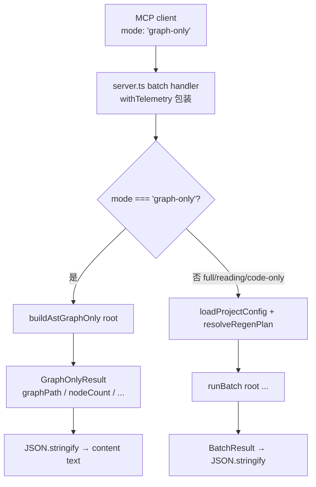

# 技术实现计划：MCP batch 工具 graph-only 模式 + goal_loop Pilot

**Feature**: 202-mcp-batch-graph-only-pilot
**Plan 版本**: 1.0
**日期**: 2026-06-20
**风险等级**: LOW

---

## 摘要

本 Feature 完成 F195 遗留的 W-001 缺口——MCP `batch` 工具 Zod 枚举不含 `'graph-only'`，导致 AI Agent 无法通过 MCP 路径触发纯 AST 零 LLM 建图。

代码改动面极小：仅修改 `src/mcp/server.ts` 的 batch 工具注册段（约 8 行），全部逻辑均复用现有 `buildAstGraphOnly`（来自 `batch-orchestrator.ts`）与 CLI dispatch 范式（来自 `src/cli/commands/batch.ts:56-75`）。不引入任何新抽象，不修改 `BatchMode` 类型定义。

---

## 技术上下文

| 维度 | 当前状态 |
|------|---------|
| 语言/版本 | TypeScript 5.x / Node.js 20.x+ |
| 目标文件 | `src/mcp/server.ts`（约 800+ 行，batch 工具注册在 :170–247） |
| 复用函数 | `buildAstGraphOnly(root, options?)`（`batch-orchestrator.ts:2487`） |
| Zod 验证库 | `z.enum([...])` 构建 MCP 工具 schema |
| 现有 import | `runBatch` 已 import 自 `batch-orchestrator.js`（:15），`buildAstGraphOnly` 需追加具名 import |
| CLI 范式参考 | `src/cli/commands/batch.ts:56-75`（graph-only 提前拦截，在 checkAuth 前分支） |
| 测试范式 | `tests/unit/mcp-server.test.ts`：vi.mock 劫持 `batch-orchestrator.js` + `createMcpServer` 直接调 handler |

### 架构决策：为何 handler 提前分支而非扩展 BatchMode

`BatchMode`（`src/panoramic/qa/types.ts:16`，union `'full' | 'reading' | 'code-only'`）被 `runBatch` 的 `validModes` 内部使用。`graph-only` 不走 `runBatch` 管线，故**不应加入 BatchMode**，避免 `runBatch` 内部 validModes 检查与该值相遇时产生未定义行为。

正确方案是在 handler 层**提前分支**：检测到 `mode === 'graph-only'` 时立即 dispatch 到 `buildAstGraphOnly`，使整个 runBatch/regen 轴逻辑对该路径不可见。此方案与 CLI（`batch.ts:59`）完全对称，改动最小，回归风险最低。

---

## Codebase Reality Check

| 文件 | LOC（估算） | 公开接口数 | 已知 debt |
|------|-----------|----------|---------|
| `src/mcp/server.ts` | ~800 | 1（`createMcpServer`） | 注释段已有"MCP batch 暂不支持 graph-only"待清 |
| `src/batch/batch-orchestrator.ts` | 2562 | `runBatch`, `buildAstGraphOnly` 等 | 不修改，仅新增调用 |
| `tests/unit/mcp-server.test.ts` | ~257 | — | 无 |

**前置清理规则评估**：`server.ts` LOC < 500，TODO/FIXME 无相关标记，无代码重复超 30 行。**不需要前置 cleanup task**。

---

## Impact Assessment

| 维度 | 评估 |
|------|------|
| 直接修改文件 | 2（`src/mcp/server.ts` + `tests/unit/mcp-server.test.ts`） |
| 间接受影响 | 0（`buildAstGraphOnly` 签名不变，`BatchMode` 不变） |
| 跨包影响 | 无（改动限于 `src/mcp/` 调用 `src/batch/` 已有函数） |
| 数据迁移 | 无 |
| API/契约变更 | MCP batch 工具 schema 枚举新增一值（向后兼容，不删旧值） |
| F196 守卫影响 | 无（顶层 `Output:` 示例区不变） |

**风险等级：LOW**（影响文件 < 10，无跨包边界，无数据迁移）。

---

## 与现有架构的融合点

```
MCP client
    │  mode: 'graph-only'
    ▼
server.ts batch handler（:213–246）
    │  新增分支：mode === 'graph-only'
    ├─► buildAstGraphOnly(root)  ←── 来自 batch-orchestrator.ts（不修改）
    │       │
    │       └─ GraphOnlyResult { graphPath, nodeCount, edgeCount, ... }
    │           │
    │           └─ JSON.stringify → content[0].text（与现有 batch 返回形态同构）
    │
    └─► runBatch(root, {...})    ←── 其他三 mode 不变
```

`buildAstGraphOnly` 已自包含完整的 AST 采集 → 建图 → 写盘 → 返回 GraphOnlyResult 管线，handler 只需调用一次，无需了解内部实现细节。

---

## 实现步骤（按文件+行号锚点）

> **TDD 顺序：先写红测试（Step 1），后改 server.ts 转绿（Step 2-4）**

### Step 1（RED）：在 `tests/unit/mcp-server.test.ts` 新增红测试

**位置**：在文件 `vi.hoisted` 的 `mocks` 对象（:7–12）中追加 `buildAstGraphOnly: vi.fn()`；在 `vi.mock('../../src/batch/batch-orchestrator.js', ...)` 块（:48–50）中追加 `buildAstGraphOnly: mocks.buildAstGraphOnly`。

**新增三个测试用例**，紧跟现有 T094-05 测试（约 :230 之后）：

**用例 A — graph-only dispatch 到 buildAstGraphOnly，不调用 runBatch**

```typescript
it('batch handler graph-only 模式 dispatch 到 buildAstGraphOnly，不调用 runBatch', async () => {
  const server = createMcpServer() as unknown as InstanceType<typeof hoistedTypes.FakeMcpServer>;
  const fakeResult = {
    graphPath: '/tmp/test-proj/specs/graph.json',
    nodeCount: 42,
    edgeCount: 10,
    callEdgeCount: 6,
    dependsOnEdgeCount: 4,
    pythonSymbolCount: 0,
    durationMs: 800,
  };
  mocks.buildAstGraphOnly.mockResolvedValue(fakeResult);
  const tool = findTool(server, 'batch');

  const result = await tool.handler({ projectRoot: '/tmp/test-proj', mode: 'graph-only' });

  expect(result.isError).toBeUndefined();
  expect(mocks.buildAstGraphOnly).toHaveBeenCalledTimes(1);
  expect(mocks.runBatch).not.toHaveBeenCalled();
  // 返回形态与现有 batch 同构：裸 JSON.stringify
  const parsed = JSON.parse(result.content[0]!.text) as typeof fakeResult;
  expect(parsed.graphPath).toBe('/tmp/test-proj/specs/graph.json');
  expect(parsed.nodeCount).toBe(42);
});
```

**用例 B — graph-only 时 buildAstGraphOnly 不接收 regen 参数（incremental/force 被忽略）**

```typescript
it('graph-only 模式 buildAstGraphOnly 调用签名不含 regen 轴参数', async () => {
  const server = createMcpServer() as unknown as InstanceType<typeof hoistedTypes.FakeMcpServer>;
  mocks.buildAstGraphOnly.mockResolvedValue({
    graphPath: '/tmp/p/specs/graph.json',
    nodeCount: 0, edgeCount: 0,
    callEdgeCount: 0, dependsOnEdgeCount: 0, pythonSymbolCount: 0, durationMs: 1,
  });
  const tool = findTool(server, 'batch');

  await tool.handler({
    projectRoot: '/tmp/p',
    mode: 'graph-only',
    incremental: true,
    force: true,
  });

  expect(mocks.buildAstGraphOnly).toHaveBeenCalledTimes(1);
  // 🔴 Codex C2 修正：实现为 buildAstGraphOnly(root)（单参），callArgs[1] 为 undefined，
  //    用 not.toHaveProperty 会因 undefined 直接报错（绿实现仍红）。改为断言只传 1 个参数。
  const callArgs = mocks.buildAstGraphOnly.mock.calls[0]!;
  expect(callArgs).toHaveLength(1);              // 只传 projectRoot，未传 regen/options 第二参
  expect(callArgs[0]).toBe('/tmp/p');
  expect(mocks.runBatch).not.toHaveBeenCalled(); // regen 参数对 graph-only 完全不可见
});
```

**用例 A2 — Zod schema 枚举确实接受 graph-only（FR-001，schema 级断言，Codex W1）**

```typescript
it('batch 工具 mode schema 接受 graph-only 枚举值', () => {
  const server = createMcpServer() as unknown as InstanceType<typeof hoistedTypes.FakeMcpServer>;
  const batchTool = findTool(server, 'batch');
  // schema.mode 是 Zod ZodEnum；safeParse 直接验枚举（FakeMcpServer 不跑校验，故此处显式 parse）
  const modeSchema = batchTool.schema.mode as { safeParse: (v: unknown) => { success: boolean } };
  expect(modeSchema.safeParse('graph-only').success).toBe(true);
  expect(modeSchema.safeParse('full').success).toBe(true);      // 旧值不丢
  expect(modeSchema.safeParse('bogus').success).toBe(false);    // 非法值仍拒
});
```

> ⚠️ Codex W1 澄清：FakeMcpServer 只存 schema/handler，**不执行** Zod 校验；`withTelemetry` 也不校验（校验在真实 SDK 层）。故用例 A 的红态判据不是"Zod 拒绝"，而是"未改枚举时 handler 直跑旧逻辑 → 走 runBatch(mode='graph-only') → runBatch 内 validModes 抛错 / buildAstGraphOnly 从未被调用"。用例 A 以 `runBatch.not.toHaveBeenCalled()` + `buildAstGraphOnly.toHaveBeenCalledTimes(1)` 为红→绿判据；枚举本身由用例 A2 的 safeParse 显式守护。

**用例 C — mode 字段 describe 文案一致性（SC-载体-001b）**

```typescript
it('batch 工具 mode describe 文案不含旧"暂不支持 graph-only"字样且含 graph-only 定位关键词', () => {
  const server = createMcpServer() as unknown as InstanceType<typeof hoistedTypes.FakeMcpServer>;
  const batchTool = findTool(server, 'batch');
  // Zod schema 存储在 tool.schema.mode；describe() 文本在其 .description 属性
  const modeSchema = batchTool.schema.mode as { description?: string } | undefined;
  const desc = modeSchema?.description ?? '';
  expect(desc).not.toContain('暂不支持 graph-only');
  expect(desc).toMatch(/纯 AST|零 LLM/);
});
```

**用例 D — 三旧 mode 仍走 runBatch、不进 graph-only 分支（FR-007 零回归，Codex W2）**

```typescript
it.each(['full', 'reading', 'code-only'] as const)(
  'batch handler %s 模式仍 dispatch 到 runBatch，不调用 buildAstGraphOnly',
  async (mode) => {
    const server = createMcpServer() as unknown as InstanceType<typeof hoistedTypes.FakeMcpServer>;
    mocks.runBatch.mockResolvedValue({ successful: [], skipped: [], failed: [], indexGenerated: false });
    const tool = findTool(server, 'batch');

    await tool.handler({ projectRoot: '/tmp/p', mode });

    expect(mocks.runBatch).toHaveBeenCalledTimes(1);
    expect(mocks.runBatch.mock.calls[0]![1]).toMatchObject({ mode }); // mode 逐值透传
    expect(mocks.buildAstGraphOnly).not.toHaveBeenCalled();
  },
);
```

**用例 E — graph-only + languages 不报错、不透传 languages、发 warn 日志（FR-010，Codex W3）**

```typescript
it('graph-only + languages 时透传 warn 日志但不把 languages 传给 buildAstGraphOnly', async () => {
  const server = createMcpServer() as unknown as InstanceType<typeof hoistedTypes.FakeMcpServer>;
  mocks.buildAstGraphOnly.mockResolvedValue({
    graphPath: '/tmp/p/specs/graph.json',
    nodeCount: 1, edgeCount: 0, callEdgeCount: 0, dependsOnEdgeCount: 0, pythonSymbolCount: 0, durationMs: 1,
  });
  // batch handler 的日志出口是 console.error（mcpLogger.info → console.error）
  const errSpy = vi.spyOn(console, 'error').mockImplementation(() => {});
  const tool = findTool(server, 'batch');

  const result = await tool.handler({ projectRoot: '/tmp/p', mode: 'graph-only', languages: ['typescript'] });

  expect(result.isError).toBeUndefined();                          // 不报错、不拒绝
  expect(mocks.buildAstGraphOnly).toHaveBeenCalledTimes(1);
  expect(mocks.buildAstGraphOnly.mock.calls[0]!).toHaveLength(1);  // 第二参未传，languages 没漏给建图
  expect(errSpy.mock.calls.flat().join('\n')).toMatch(/graph-only.*languages|languages.*graph-only/);
  errSpy.mockRestore();
});
```

**mock 补全（Codex C3）**：在 `vi.hoisted` 的 `mocks` 对象（:7-12）追加 `buildAstGraphOnly: vi.fn()`；在 `vi.mock('../../src/batch/batch-orchestrator.js', ...)`（:48-50）追加 `buildAstGraphOnly: mocks.buildAstGraphOnly`。**追加后必须全量 vitest**：`server.ts` 新增 `import { buildAstGraphOnly }` 后，其余 mock 了 `batch-orchestrator.js` 的测试文件（`tests/unit/mcp/response-contract.test.ts:54`、`tests/unit/mcp/telemetry-coverage.test.ts:50`，以及 graph-only-cli / batch-command-exit-code / cli-command-runners / watch-command）的 mock factory 仅导出各自所需符号——它们不调 graph-only 路径，理论上 `buildAstGraphOnly` 为 undefined 也不报错；但实现时**以全量 `npx vitest run` 实证**，若任一文件因缺失 export 报错，则在该文件 mock 补 `buildAstGraphOnly: vi.fn()`。

**红态确认**：`server.ts` 改动前运行 `tests/unit/mcp-server.test.ts`：用例 A（`buildAstGraphOnly` 未被调用 / `runBatch` 被以非法 mode 调用）红、A2（枚举不含 graph-only → safeParse 失败）红、B 红、C（旧 describe 文案）红、E（buildAstGraphOnly 未被调用）红；用例 D（三旧 mode）应已绿（回归基线）。

---

### Step 1b（RED→GREEN 集成）：真实 portable graph 端到端测试（Codex C1 / SC-载体-001）

**为何必须有**：上面的单元用例 mock 了 `buildAstGraphOnly`，只能证明"handler 路由正确"，**证明不了"MCP 路径真的产出合法 portable graph"**。F195 只测了 CLI 路径与 `buildAstGraphOnly` 直调，**没测 MCP dispatch 端到端产图**。SC-载体-001 的 oracle 必须由一个**不 mock** `buildAstGraphOnly` 的集成测试坐实。

**新文件**：`tests/integration/mcp-batch-graph-only.test.ts`
- **不** `vi.mock('../../src/batch/batch-orchestrator.js')`（用真实 `buildAstGraphOnly`）
- 仍用 FakeMcpServer 范式 mock `@modelcontextprotocol/sdk/server/mcp.js` 捕获 handler（graph-only 分支在 `loadProjectConfig` 之前，故无需真实 config）
- fixture：`mkdtemp` 临时目录写 1-2 个最小 `.ts` 文件（如 `export function a(){ return b(); } export function b(){ return 1; }`），制造非空 call graph
- 调 `tool.handler({ projectRoot: tmpDir, mode: 'graph-only' })`
- 断言：
  - `result.isError` 为 undefined
  - `parsed = JSON.parse(result.content[0].text)`；`parsed.graphPath` 存在、`parsed.nodeCount > 0`
  - 读 `parsed.graphPath` 文件 → `graph.schemaVersion === '2.0'`（FR-006）
  - 遍历 `graph.nodes`，断言**无任何节点的路径字段为绝对路径**（不以 `/` 开头 / 不含 tmpDir 前缀）→ 绝对路径节点计数 = 0（F193 portable）
  - 零 LLM：本路径不调任何 LLM（无需 API key 即跑通即为证）；并断言未触达 runBatch（本文件未 mock runBatch，可不强测，dispatch 单测已覆盖）
- `afterEach` 清理临时目录

**红态**：改动前 schema 拒绝/handler 走 runBatch 抛错 → 集成测试红；改动后产出真实 portable graph → 绿。

---

### Step 2（GREEN）：修改 `src/mcp/server.ts`

**子步骤 2-1：追加 import**（约 :15 行，修改现有 import 行）

```typescript
// 改前
import { runBatch } from '../batch/batch-orchestrator.js';
// 改后
import { runBatch, buildAstGraphOnly } from '../batch/batch-orchestrator.js';
```

**子步骤 2-2：Zod schema 枚举新增 `'graph-only'`**（约 :208-209）

```typescript
// 改前
mode: z
  .enum(['full', 'reading', 'code-only'])
  .optional()
  .describe('spec 文档质量维度（与 regen 轴正交）：full（默认，完整文档）| reading（轻量，跳过产品文档层）| code-only（仅跳 enrichment 层，仍逐模块调 spec-gen LLM，非零成本）。注：纯 AST / 零 LLM 建图请用 CLI `spectra batch --mode graph-only`（MCP batch 暂不支持 graph-only）'),

// 改后
mode: z
  .enum(['full', 'reading', 'code-only', 'graph-only'])
  .optional()
  .describe(
    'spec 文档质量维度（与 regen 轴正交）：full（默认，完整文档）| reading（轻量，跳过产品文档层）| code-only（仅跳 enrichment 层，仍逐模块调 spec-gen LLM，非零成本）| graph-only（纯 AST · 零 LLM · 无需认证 · 仅建图不生成 spec 文档，可作为 impact/context 工具的前置步骤）'
  ),
```

**子步骤 2-3：handler TypeScript type union 同步新增 `'graph-only'`**（约 :220）

```typescript
// 改前
mode?: 'full' | 'reading' | 'code-only';
// 改后
mode?: 'full' | 'reading' | 'code-only' | 'graph-only';
```

**子步骤 2-4：handler 内部新增 graph-only 提前分支**（在 `const effectiveMode = ...` 日志行之后，`const fileConfig = loadProjectConfig(root)` 之前插入）

```typescript
// graph-only 提前拦截：纯 AST 零 LLM，不走 runBatch/regen 轴
if (effectiveMode === 'graph-only') {
  if (languages?.length) {
    mcpLogger.info('[warn] graph-only 不支持 languages 过滤，将全仓建图');
  }
  const graphResult = await buildAstGraphOnly(root);
  return {
    content: [{ type: 'text' as const, text: JSON.stringify(graphResult) }],
  };
}
```

插入位置锚点：约 `server.ts:227`（`mcpLogger.info(...)` 之后）。这样 `fileConfig` / `regenPlan` / `runBatch` 三段代码对 graph-only 路径完全不执行，符合 FR-009。

---

### Step 3：本地验证（红→绿确认）

```bash
# 仅跑新测试用例（快速确认绿态）
npx vitest run tests/unit/mcp-server.test.ts

# 全量门禁（NFR-001 要求）
npx vitest run
npm run build
npm run repo:check
```

---

### Step 4：确认 F196 description-output-drift 守卫绿色

```bash
# F196 守卫（如有独立脚本）
npm run repo:check
```

确认 batch 工具顶层 `description` 的 `Output:` 示例区文本未变，仅 mode 字段 `.describe()` 文本改变。

---

## 测试策略

### 测试文件选择

**主要测试文件**：`tests/unit/mcp-server.test.ts`（现有单元测试范式，直接 import `createMcpServer` 调 handler）。

**不使用 stdio E2E**：live MCP server 是全局旧编译产物（见 project memory），不可靠。单元测试通过 `vi.mock` 劫持 `batch-orchestrator.js` 导出，完全在进程内验证 dispatch 逻辑，不依赖真实 AST 采集。

### Mock 策略

```
vi.mock('../../src/batch/batch-orchestrator.js') 中：
  runBatch: mocks.runBatch（既有）
  buildAstGraphOnly: mocks.buildAstGraphOnly（新增）
```

- 单元层（mcp-server.test.ts，mock buildAstGraphOnly）：验证 dispatch 路由（A/A2/B/D/E）与 describe 文案（C）——快、隔离、覆盖 FR-001/002/004/007/009/010。
- 集成层（mcp-batch-graph-only.test.ts，**不** mock buildAstGraphOnly）：真跑小 fixture 产图、读 graphPath 验 portable——覆盖 FR-006 / SC-载体-001 的端到端 oracle。

### 两层测试分工（Codex C1 修正后）

| 层 | 文件 | 是否 mock buildAstGraphOnly | 覆盖 |
|----|------|---------------------------|------|
| 单元 | tests/unit/mcp-server.test.ts | 是（spy 路由） | FR-001/002/004/007/009/010 |
| 集成 | tests/integration/mcp-batch-graph-only.test.ts | **否**（真跑） | FR-006 / SC-载体-001 portable 端到端 |

集成测试是本 Feature 的**核心 oracle**——它是唯一能证明"MCP graph-only 路径真的产出 schemaVersion 2.0 / 零绝对路径节点的 portable graph"的测试；纯 mock 无法替代（mock 即重言式）。

### 红→绿 TDD 顺序

```
Step 1: 写测试（3 用例）→ 运行 → 确认 3 个红（Zod 枚举拒绝 / 旧 describe）
Step 2: 改 server.ts（4 子步骤）→ 运行 → 确认 3 个新用例全绿
Step 3: 全量 vitest → 确认 0 失败（三旧 mode 用例仍绿）
```

---

## 回归护栏验证清单

| 检查项 | 验证手段 | 预期 |
|--------|---------|------|
| `full` mode 仍走 `runBatch` | 现有 `batch handler 成功时返回结果` 测试 | 绿，runBatch 调用计数=1 |
| `reading` / `code-only` mode | 可追加显式测试或推断自现有 batch 测试 | runBatch 不丢参数 |
| graph-only 不进 runBatch | 新增用例 A / B spy 断言 | runBatch 调用计数=0 |
| F196 顶层 Output 示例不变 | `npm run repo:check` / 目视 server.ts description 字符串 | 守卫绿 |
| F193 portable 守卫（MCP 路径绝对路径节点=0 / schemaVersion 2.0） | **本 Feature 集成测试 mcp-batch-graph-only.test.ts 端到端实测**（Codex C1） | 绿 |
| TypeScript 类型零错误 | `npm run build` | 0 errors |
| 全量 vitest | `npx vitest run` | 0 failures |
| `npm run repo:check` | 仓库同步检查 | 0 errors |

---

## 风险与缓解

| 风险 | 可能性 | 影响 | 缓解方案 |
|------|--------|------|---------|
| `withTelemetry` 包装层在 Zod 校验前拒绝 `'graph-only'`，导致 handler 不可达 | 低（改了枚举即可） | 中（新测试仍红） | Step 2-2 确保枚举先改；Run Step 3 立即验证 |
| `mcpLogger` 在 graph-only 分支前已初始化，但 `effectiveMode` 此时含 `'graph-only'`，传入日志打印 `mode=graph-only` | 低（仅日志） | 无功能影响 | 日志文案不进 JSON 响应，不触碰 F196 |
| `buildAstGraphOnly` 不传 `outputDir` 时默认 `'specs'`——与 runBatch 路径行为一致 | 无风险 | 低 | spec 明确"同样默认 specs 即可"，不引入 outputDir 参数 |
| 现有测试依赖 batch-orchestrator mock 仅含 `runBatch`，新增 `buildAstGraphOnly` import 后其他 mock 文件缺 export | 低 | 低 | server.ts 加 `import { buildAstGraphOnly }` 后**全量 `npx vitest run` 实证**；如 response-contract / telemetry-coverage / graph-only-cli / batch-command-exit-code / cli-command-runners / watch-command 任一报缺失 export，则在该文件 mock 补 `buildAstGraphOnly: vi.fn()`（这些文件不调 graph-only，预期 undefined 无害但需实证） |
| 集成测试真跑 AST 采集，墙钟偏慢 / fixture 写盘副作用 | 低 | 低 | fixture 仅 1-2 个最小 .ts 文件（亚秒级）；用 mkdtemp 隔离 + afterEach 清理，不污染仓库 |

---

## 复杂度自检

**总体复杂度：LOW**（与 spec 评估一致）

| 决策 | 是否偏离最简方案 | 理由 |
|------|----------------|------|
| handler 提前分支而非 runBatch 内部加 case | 否（这就是最简方案） | 对齐 CLI 已有范式，BatchMode 不污染 |
| mock `buildAstGraphOnly` 而非真实 AST 运行 | 否 | 零 LLM / portable 守卫由 F195 独立覆盖，避免跨层测试重复 |
| `outputDir` 不加入 MCP schema | 否 | 保持改动面最小，buildAstGraphOnly 默认 'specs' 足够 |

不引入新抽象，不新增依赖，不修改任何合约。

---

## goal_loop Pilot 配置（编排层，不计入代码复杂度）

pilot 通过 `.specify/orchestration-overrides.yaml` 在 feature mode 开启 goal_loop（F201 设计），implement 阶段将自主迭代：

1. 写红测试 → 检测红态
2. 改 server.ts → 运行门禁验证
3. 若绿 → 触发 GATE_VERIFY 退出循环

verify 报告须记录每轮迭代的 `decide-stop` 裁决、impact 注入是否降级（预期因图谱不含新写代码而降级）、是否触发 fallback / 原子回滚，诚实坐实或推翻 F201 未验证结论。

---

## 架构图（Mermaid）



---

## 产出制品

本 plan 对应的实现产物：
- `src/mcp/server.ts`（修改，约 +10 行 / -2 行：import + enum + type union + graph-only 分支）
- `tests/unit/mcp-server.test.ts`（修改：mock 补 buildAstGraphOnly + 新增用例 A/A2/B/C/D/E）
- `tests/integration/mcp-batch-graph-only.test.ts`（**新增**：真实 portable graph 端到端 oracle，不 mock buildAstGraphOnly）
- 视实证可能追加：response-contract / telemetry-coverage 等 mock 文件补 `buildAstGraphOnly: vi.fn()`（仅当全量 vitest 报缺失 export）
