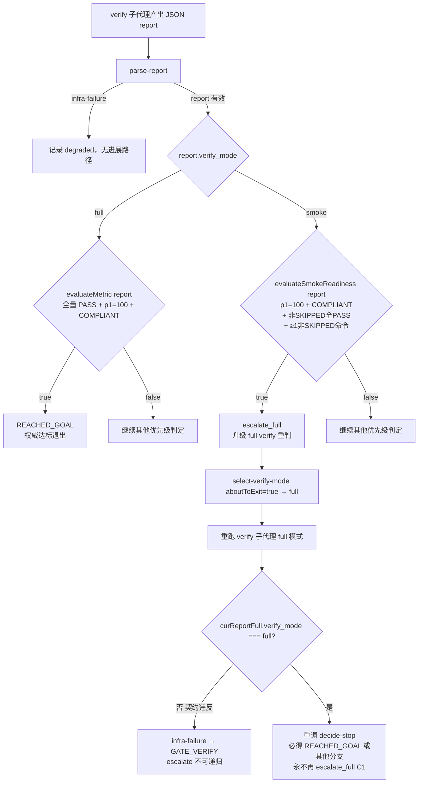

# 修复计划 — F203 goal_loop core 两处缺陷

**分支**: `claude/modest-feistel-b070f5` | **日期**: 2026-06-21 | **来源**: fix-report.md（F202 e2e pilot 实测）
**输入**: specs/203-fix-goal-loop-snapshot-smoke/fix-report.md（权威，包含 Codex 对抗审查修订）
**模式**: fix（最小变更，无新功能引入）

---

## 摘要

F202 goal_loop e2e pilot 实测暴露两处 core 缺陷：

1. **缺陷 1 — snapshot/rollback 误删未跟踪 config**：`planSnapshotCommands` 的 `git stash push --include-untracked` 与 `planRollbackCommands` 的 `git clean -fd` 把 `.specify/orchestration-overrides.yaml`（goal_loop 验证态 override，刻意不入 commit）当成普通工作树变更卷走/删除，导致 goal_loop 循环中途配置自毁。

2. **缺陷 2 — smoke 指标假阴性**：smoke 轮跑全量 `npx vitest run` 但不先 `npm run build`，含 build 依赖的 e2e 必失败；`evaluateMetric` 要求全量 PASS 故永不达标；加之 full 轮契约（verify.md）不含 vitest，使权威门禁实为空洞。

修复方案（用户拍板「组合：core 放宽 + 源头 SKIPPED」）：
- 缺陷 1：引入 `PRESERVED_CONFIG_PATHSPECS` 常量 + pathspec 排除 + 新增 `assessPreservedConfigSafety` preflight 守护（staged/tracked-modified 硬失败拦截）
- 缺陷 2：新增 `evaluateSmokeReadiness`（smoke escalate 非权威触发）+ 重构 `decideStop` 优先级 3 + 修正 full/smoke verify.md 命令集 + smoke 用 vitest project selector 真实排除 e2e

---

## 技术上下文

**语言/版本**: JavaScript（ESM `.mjs`），Node.js 20.x
**主要依赖**: 无新外部依赖；`node:test`（内置测试框架，已用于既有 goal-loop-core.test.mjs）
**存储**: 无（纯函数 core + prose 文档修改）
**测试框架**: `node --test`（goal-loop-core.test.mjs 既有框架）；新增集成测试用 `node:child_process.execFileSync` + temp git 仓库
**目标平台**: Node.js 20.x，macOS/Linux worktree 环境

---

## Codebase Reality Check

| 目标文件 | LOC | 公开导出函数数 | 已知 debt/标记 |
|---------|-----|-------------|--------------|
| `plugins/spec-driver/scripts/lib/goal-loop-core.mjs` | 443 | 10 | 无 TODO/FIXME；函数最长 ~60 行（`decideStop`+`countConsecutiveNoProgress`），在安全范围内 |
| `plugins/spec-driver/tests/goal-loop-core.test.mjs` | 1132 | 0（test-only）| 无 debt；92 个 test case；现有 planSnapshot/planRollback deepEqual 断言需同步更新 |
| `plugins/spec-driver/agents/verify.md` | 277 | N/A（prose）| L260 关键 bug：`full` 层 2 命令集不含 vitest，需修正 |
| `plugins/spec-driver/skills/spec-driver-feature/SKILL.md` | ~500+ | N/A（prose）| L367-368 smoke 无 build；full 命令集描述不含 vitest，需补全 |
| `plugins/spec-driver/tests/fixtures/goal-loop/`（新增 2 个 fixture 文件） | 新增 ~60 行 | N/A | 无；需新建 `report-smoke-skipped-e2e.json` + `report-smoke-fail-real.json` |
| `plugins/spec-driver/tests/goal-loop-snapshot-rollback-integration.test.mjs`（新建）| 新增 ~200 行 | N/A | 无；真实 git 集成测试文件 |

**前置清理规则评估**：
- goal-loop-core.mjs（443 LOC）本次新增约 40-50 行（2 个新函数 + 常量修改），触及 LOC > 500 边界偏低，且**无**相关 TODO/FIXME，**无**明显重复超 30 行的逻辑。判定：**不需要前置 cleanup task**，直接修复。

---

## Impact Assessment

| 维度 | 评估 |
|------|------|
| 直接修改文件 | 4 个：goal-loop-core.mjs / goal-loop-core.test.mjs / verify.md / SKILL.md |
| 间接受影响 | goal-loop-cli.mjs（新增导出函数需在 dispatch 暴露，仅 `assessPreservedConfigSafety`）；新增 2 个 fixture + 1 个集成测试文件 |
| 跨包影响 | 无（全部在 `plugins/spec-driver/` 内，未跨顶层边界） |
| 数据迁移 | 无 schema 变更；`decideStop` 返回结构不变（`{stop, exit_reason, action}`） |
| API/契约变更 | 新增 2 个导出函数（`evaluateSmokeReadiness`、`assessPreservedConfigSafety`），均为纯函数。`planSnapshotCommands` / `planRollbackCommands` 命令字符串格式变更（追加 pathspec 排除参数），为兼容性扩展。`decideStop` 返回 schema 不变。 |
| 风险等级 | **LOW**（影响文件 < 10，无跨包影响，无数据迁移）|

**LOW 风险说明**：变更集中在 `plugins/spec-driver/scripts/lib/goal-loop-core.mjs` 纯函数模块，有完整单测防护；prose 修改（verify.md / SKILL.md）无运行时副作用；fix 不引入新架构层次。

---

## Constitution Check

| 宪法原则 | 适用性 | 评估 | 说明 |
|---------|--------|------|------|
| 不引入未 spec 定义的功能 | 是 | PASS | `assessPreservedConfigSafety` + `evaluateSmokeReadiness` 均在 fix-report.md 明确定义，无越界新功能 |
| 纯函数原则（core 无 I/O） | 是 | PASS | 两个新函数均为纯函数（无 git I/O、无文件读写）；git I/O 仍由编排器（SKILL.md prose）发起 |
| 提交前 `npx vitest run` 零失败 | 是 | PASS（目标状态） | 本次修复需同步更新 deepEqual 断言；验证 task 含全量 `node --test` 运行 |
| `npm run build` 零类型错误 | 是 | PASS（目标状态） | .mjs 纯 JS，build 不走 tsc；但 repo:check 仍需过 |
| `npm run repo:check` + `npm run release:check` | 是 | PASS（目标状态） | 修改插件后需 repo:sync/check |
| 不修改 spec 范围外文件 | 是 | PASS | 仅修改 core + 测试 + 两个 prose 文件，均在 fix-report.md 明确列出 |
| 命名即文档 | 是 | PASS | `PRESERVED_CONFIG_PATHSPECS`、`assessPreservedConfigSafety`、`evaluateSmokeReadiness` 语义明确 |
| **无 VIOLATION** | — | PASS | — |

---

## 项目结构（受影响文件）

```text
specs/203-fix-goal-loop-snapshot-smoke/
├── fix-report.md                         # 诊断 + Codex 对抗审查（权威，已定稿）
├── plan.md                               # 本文件
└── tasks.md                              # 后续由 tasks 阶段生成

plugins/spec-driver/
├── scripts/lib/
│   └── goal-loop-core.mjs                # [修改] 缺陷 1 & 2 的 core 修复
├── agents/
│   └── verify.md                         # [修改] full 命令集 + smoke SKIPPED 约定
├── skills/spec-driver-feature/
│   └── SKILL.md                          # [修改] full/smoke build 次序 + preflight 调用点
└── tests/
    ├── goal-loop-core.test.mjs           # [修改] 更新现有断言 + 新增单测用例
    ├── goal-loop-snapshot-rollback-integration.test.mjs  # [新建] 真实 git 集成测试
    └── fixtures/goal-loop/
        ├── report-full-pass.json         # [不变] 既有 fixture
        ├── report-smoke-pass.json        # [不变] 既有 fixture（smoke 全绿，无 SKIPPED）
        ├── report-smoke-skipped-e2e.json # [新建] smoke 含 SKIPPED e2e + 非 e2e 全 PASS
        └── report-smoke-fail-real.json   # [新建] smoke 含真实 FAIL（非 SKIPPED）
```

---

## 架构设计

### 缺陷 1 修复：pathspec 排除 + preflight 守护

```mermaid
flowchart TD
    A[编排器进入快照前] --> B[git status --porcelain PRESERVED_CONFIG_PATHSPECS]
    B --> C{assessPreservedConfigSafety entries}
    C -->|safe=false staged/tracked-modified| D[硬失败 + 清晰指引\n中止 goal_loop]
    C -->|safe=true untracked/absent/tracked-clean| E[planSnapshotCommands isClean]
    E -->|isClean=true| F[返回空命令序列]
    E -->|isClean=false| G["git stash push --include-untracked -m goal_loop-S{i}\n   -- . ':(exclude).specify/orchestration-overrides.yaml'"]
    G --> H[git rev-parse stash@{0}]
    H --> I["git stash apply --index {stash_ref}"]
    
    J[编排器触发回滚] --> K[planRollbackCommands S_i]
    K --> L["git reset --hard HEAD"]
    L --> M["git clean -fd -e '.specify/orchestration-overrides.yaml'"]
    M -->|S_i.clean=false| N["git stash apply --index {hex40}"]
    M -->|S_i.clean=true| O[完成]
```

**关键约束**：
- `PRESERVED_CONFIG_PATHSPECS = ['.specify/orchestration-overrides.yaml']` 为模块级常量（可扩展数组）
- 多 preserved path 时**展开为多个独立 argv**（stash 多个 `':(exclude)<p>'`、clean 多个 `-e <p>`），**禁止 join 成单字符串**
- `assessPreservedConfigSafety(entries)` 为纯函数（仅判定，无 git I/O）：
  - `entries = [{path, state}]`，state ∈ `absent|untracked|tracked-clean|tracked-modified|staged`
  - 返回 `{ safe: boolean, unsafe: [{path, state, reason}] }`
  - `untracked`/`absent`/`tracked-clean` → 安全；`staged`/`tracked-modified` → 不安全
  - 编排器在 SKILL.md 中发起 `git status --porcelain <paths>`，解析后传入该函数

**保护边界（Codex CRITICAL 修订）**：pathspec 排除只保护 **untracked** 的 preserved config（stash/clean 不触碰）。`staged`/`tracked-modified` 态会被 `git reset --hard` 摧毁，故由 preflight 提前拦截（硬失败），而非靠 pathspec 保护。

### 缺陷 2 修复：smoke 放宽 + 源头 SKIPPED + full 契约补全



**smoke 命令集（修正后）**：
- `tsc --noEmit`（必跑，记真实 exit_code）
- `npx vitest run --project unit --project integration ...`（排除 e2e project，记真实 exit_code）
- 检测 `dist/` 缺失时，对 `tests/e2e/**` 命令标 `skipped_reason="dist_not_built"`（SKIPPED）
- **必须用 vitest project selector 真正排除 e2e 实跑其余**（非口头 SKIPPED）

**full 命令集（修正后）**：
- `npm run build`（先构建，dist 就位）
- `npx vitest run`（含 e2e，dist 已就位故无 build 依赖 SKIPPED）
- `npm run lint`（如适用）
- `npm run repo:check`
- full 轮若仍出现 `dist_not_built` SKIPPED → 标 infra-failure（verify 契约违反，非普通 continue）

**`evaluateSmokeReadiness` 判据**（仅决定 smoke→escalate_full，非权威达标）：
```
p1_coverage_pct === 100
∧ layer1_5_evidence.status === 'COMPLIANT'
∧ 所有非 SKIPPED 命令均 PASS（SKIPPED 不阻塞）
∧ ≥1 条非 SKIPPED 命令（vacuous-truth 防护 C3）
```

**C1 escalate 非递归不变量（严格保持）**：
- `evaluateSmokeReadiness` 仅在 `verify_mode !== 'full'` 分支（smoke 路径）内调用
- full 报告走 `evaluateMetric` 路径，永不触发 `evaluateSmokeReadiness`
- 从纯函数层面，full 报告无法触达 `escalate_full` 返回路径

---

## 测试计划（Codex omission 清单全部覆盖）

### 一、更新既有单测断言（goal-loop-core.test.mjs）

**T-GL-19 `planSnapshotCommands` 更新**：
```text
isClean=false 的 deepEqual 断言更新为含 pathspec 排除的命令序列：
[
  'git stash push --include-untracked -m "goal_loop-S{i}" -- . \':(exclude).specify/orchestration-overrides.yaml\'',
  'git rev-parse stash@{0}',
  'git stash apply --index {stash_ref}'
]
isClean=true 仍返回 [] 不变。
```

**T-GL-12b `planRollbackCommands` 更新**：
```text
clean=false 的 deepEqual 断言更新为含 -e 排除的命令序列：
[
  'git reset --hard HEAD',
  "git clean -fd -e '.specify/orchestration-overrides.yaml'",
  `git stash apply --index ${VALID_SHA_2}`
]
clean=true 的断言更新为：
[
  'git reset --hard HEAD',
  "git clean -fd -e '.specify/orchestration-overrides.yaml'"
]
```

**保证**：92 个既有 test case 的其他断言不得回归（仅修改上述两处 deepEqual 的字面值）。

### 二、新增单测用例（goal-loop-core.test.mjs）

**`assessPreservedConfigSafety` 单测**（Codex omission 清单 #3 / 新增）：

| 用例 | state | 期望 |
|------|-------|------|
| absent → 安全 | absent | safe=true |
| untracked → 安全 | untracked | safe=true |
| tracked-clean → 安全 | tracked-clean | safe=true |
| staged → 不安全 | staged | safe=false, unsafe 含 path+reason |
| tracked-modified → 不安全 | tracked-modified | safe=false, unsafe 含 path+reason |
| 多 path 全安全 | [untracked, absent] | safe=true, unsafe=[] |
| 多 path 一个不安全 | [untracked, staged] | safe=false, unsafe 仅含 staged 项 |
| entries 空数组 | [] | safe=true（无 preserved config 需检查，视为安全） |

**`evaluateSmokeReadiness` 单测**（Codex omission 清单 #6）：

| 用例 | 场景 | 期望 |
|------|------|------|
| 全 SKIPPED（e2e dist_not_built）→ 不 escalate | vacuous 防护 C3 | false |
| 非 SKIPPED 有 FAIL → 不 escalate | 真实失败 | false |
| ≥1 非 SKIPPED PASS + 其余 SKIPPED → escalate | 正常 smoke + e2e SKIPPED | true |
| p1_coverage_pct !== 100 → 不 escalate | 覆盖不足 | false |
| layer1_5 非 COMPLIANT → 不 escalate | 证据不足 | false |
| UNKNOWN 命令存在 → 不 escalate（非 SKIPPED 且非 PASS） | 缺退出码 | false |

**`decideStop` 新增 C1/smoke 用例**（Codex omission 清单 #6）：

| 用例 | 场景 | 期望 |
|------|------|------|
| smoke 报告含 SKIPPED e2e + 非 e2e 全 PASS → escalate_full | smoke 正常触发 | action=escalate_full |
| smoke 报告全 SKIPPED → 不 escalate（vacuous 防护） | smoke 无有效命令 | action≠escalate_full |
| full 报告含 SKIPPED 命令 → 永不 REACHED_GOAL | full 严格判据 | exit_reason≠REACHED_GOAL |
| full 报告 → 永不 escalate_full（C1 回归）| escalate 非递归 | action≠escalate_full |

### 三、新建集成测试（goal-loop-snapshot-rollback-integration.test.mjs）

**真实 git 集成测试**（Codex omission 清单 #2）：每个 test case 在 `os.tmpdir()` 内建立临时 git 仓库（`git init` + `git commit`），实际执行 `planSnapshotCommands` / `planRollbackCommands` 规划出的命令序列，验证文件系统副作用。

| 用例标签 | 场景 | 验证副作用 |
|---------|------|-----------|
| `untracked-X` | 创建 `.specify/orchestration-overrides.yaml`（untracked），执行 snapshot，然后 apply | X 文件在 stash push 后仍存在（stash apply 还原），**或** X 从未被 stash 卷走（排除成功） |
| `tracked-staged-X` | `assessPreservedConfigSafety` 在 staged 态返回 safe=false，集成层面不进入 snapshot | preflight 返回 unsafe，不执行 stash 命令，X 不丢失 |
| `new-staged-X` | 新建 X 并 `git add`，preflight 拦截 | same as above |
| `isClean-true` | 干净仓库，planSnapshotCommands 返回 [] | 执行 [] 不出错，X 不受影响 |
| `multi-preserved-paths` | 两个 preserved path 均为 untracked | stash/clean 命令含多个独立 argv 排除项（展开不 join），两个文件均存活 |
| `stash-apply-index` | snapshot 后 implement（改代码），rollback 后验证 stash apply --index 完整还原 | 改动消失，X 存活 |
| `clean-fd-minus-e` | rollback 时 untracked X 不被 `git clean -fd -e` 删除 | X 文件在 clean 后仍存在 |
| `multiple-minus-e` | 两个 preserved path，rollback 命令有两个独立 `-e` | 两个文件均存活 |

**实现约束**：
- 测试执行真实 git 命令（`execFileSync`），非 mock
- 每 test case 独立 temp dir，`finally` 块 `fs.rmSync(..., {recursive: true, force: true})`
- 命令超时设 10s（集成测试环境允许）
- `TEST_TMPDIR` 环境变量支持（与既有测试保持一致，防沙箱 EPERM）

### 四、新增 fixture 文件

**`report-smoke-skipped-e2e.json`**（Codex omission 清单 #5 验证 fixture）：
```json
{
  "round": 1, "verify_mode": "smoke",
  "layer2_commands": [
    {"name": "tsc --noEmit", "exit_code": 0, "status": "PASS", "skipped_reason": null},
    {"name": "npx vitest run --project unit --project integration", "exit_code": 0, "status": "PASS", "skipped_reason": null},
    {"name": "npx vitest run --project e2e", "exit_code": null, "status": "SKIPPED", "skipped_reason": "dist_not_built"}
  ],
  "layer1_fr_coverage": {"p1_coverage_pct": 100, ...},
  "layer1_5_evidence": {"status": "COMPLIANT", ...},
  ...
}
```
验证用途：`evaluateSmokeReadiness` → true（e2e SKIPPED 不阻塞）；`evaluateMetric` → false（SKIPPED 仍阻止权威达标）

**`report-smoke-fail-real.json`**（验证真实 FAIL 不 escalate）：
```json
{
  "round": 1, "verify_mode": "smoke",
  "layer2_commands": [
    {"name": "tsc --noEmit", "exit_code": 1, "status": "FAIL", "skipped_reason": null},
    {"name": "npx vitest run --project e2e", "exit_code": null, "status": "SKIPPED", "skipped_reason": "dist_not_built"}
  ],
  ...
}
```
验证用途：`evaluateSmokeReadiness` → false（非 SKIPPED 命令 FAIL）

---

## Complexity Tracking

| 决策 | 为何必要 | 更简单方案被否原因 |
|------|---------|-----------------|
| 引入 `assessPreservedConfigSafety` 纯函数（而非直接在命令里处理） | Codex CRITICAL：staged/tracked-modified 态被 `reset --hard` 摧毁，pathspec 排除不够 | 若只加 pathspec 排除，staged 态仍会被 rollback 摧毁，静默数据丢失比硬失败更危险 |
| 新增 `evaluateSmokeReadiness`（而非直接放宽 `evaluateMetric`） | 权威达标（REACHED_GOAL）必须经 full 严格判定；smoke 触发判据与权威门禁语义不同，必须分开 | 若直接改 `evaluateMetric` 放宽，则 full 轮也会接受 SKIPPED，权威性丧失（reward-hacking 风险） |
| full 轮显式加 `npx vitest run`（而非保持现状 build+lint+repo:check）| Codex CRITICAL #3：当前 full 不含 vitest → smoke escalate 到 full 但 e2e 从未权威跑过，论证悬空 | 修复成立的前提，不可省略 |
| 新建独立集成测试文件（而非在既有 test.mjs 内加集成块）| 真实 git 副作用测试需要 `execFileSync` 执行真实 git 命令，与既有纯函数单测性质不同；分离保持既有文件的纯函数测试纯洁性 | 混入会污染"T-GL-x 纯函数"标签，影响 test isolation |

---

## 实现次序约束

```text
1. 新增 fixture 文件（无依赖，可先建）
2. 修改 goal-loop-core.mjs（缺陷 1 + 缺陷 2 core 部分）
   2a. 引入 PRESERVED_CONFIG_PATHSPECS 常量
   2b. 修改 planSnapshotCommands（加 pathspec 排除）
   2c. 修改 planRollbackCommands（加 -e 排除）
   2d. 新增 assessPreservedConfigSafety 函数（导出）
   2e. 新增 evaluateSmokeReadiness 函数（导出）
   2f. 重构 decideStop 优先级 3（smoke 路径调 evaluateSmokeReadiness）
3. 更新 goal-loop-core.test.mjs
   3a. 更新 T-GL-19 / T-GL-12b 的 deepEqual 断言（含排除项字面值）
   3b. 新增 assessPreservedConfigSafety 单测
   3c. 新增 evaluateSmokeReadiness 单测
   3d. 新增 decideStop 新场景用例（SKIPPED fixture）
4. 新建 goal-loop-snapshot-rollback-integration.test.mjs
5. 修改 verify.md（full/smoke 命令集 + SKIPPED 约定）
6. 修改 SKILL.md（full/smoke build 次序 + preflight 调用点 + assessPreservedConfigSafety 编排）
7. 如需 goal-loop-cli.mjs 暴露新子命令（assess-preserved-config-safety），则修改 CLI dispatch
8. 运行 node --test goal-loop-core.test.mjs + 集成测试，确认全绿
9. 运行 npm run repo:check + npm run release:check
```

**步骤 2f 的 C1 非递归不变量实现要求**：重构 `decideStop` 优先级 3 时，`evaluateSmokeReadiness` 调用**必须**写在 `report.verify_mode !== 'full'`（即 smoke 分支）内，不得泛化到 full 路径。代码结构示意：

```js
// 优先级 3（保持现有 full 路径结构）
if (!isDegraded && evaluateMetric(report)) {
  if (report.verify_mode === 'full') {
    return { stop: true, exit_reason: 'REACHED_GOAL', action: 'goto_gate_verify' };
  }
  return { stop: false, exit_reason: null, action: 'escalate_full' };
}
// 优先级 3b（新增 smoke escalate 路径，仅在 verify_mode !== 'full' 时才可能到达）
if (!isDegraded && report.verify_mode !== 'full' && evaluateSmokeReadiness(report)) {
  return { stop: false, exit_reason: null, action: 'escalate_full' };
}
```

> 注意：上述示意仅表达分支结构意图，实际实现需与现有 `evaluateMetric` 路径兼容（smoke 全绿时走 `evaluateMetric` 仍为 true → 直接 escalate；smoke 未满 evaluateMetric 但满 evaluateSmokeReadiness 时再触发 escalate）。在现有 fixture `report-smoke-pass.json`（全 PASS + p1=100 + COMPLIANT）中，`evaluateMetric` 已为 true，`decideStop` 走现有 smoke → escalate_full 路径。新增的 `evaluateSmokeReadiness` 路径处理「非全 PASS 但非 SKIPPED 均 PASS」场景。实现时需避免重复调用，注意两者判据的覆盖关系。

---

## 验证方案

### 修复验证检查清单

| 验证项 | 命令/方法 | 期望结果 |
|--------|---------|---------|
| 既有 92 个 test case 不回归 | `node --test plugins/spec-driver/tests/goal-loop-core.test.mjs` | 全部 PASS，无新失败 |
| 新增 assessPreservedConfigSafety 单测 | 同上（新 describe 块） | 全部 PASS |
| 新增 evaluateSmokeReadiness 单测 | 同上 | 全部 PASS |
| 新增 decideStop SKIPPED 场景 | 同上 | 全部 PASS，C1 回归 PASS |
| 真实 git 集成测试 | `node --test plugins/spec-driver/tests/goal-loop-snapshot-rollback-integration.test.mjs` | 全部 PASS（untracked X 存活、preflight 拦截 staged、多 -e 展开等） |
| `planSnapshotCommands(false)` 命令含 `:(exclude)` | 单测 deepEqual | PASS |
| `planRollbackCommands({clean:false,...})` 命令含 `-e` | 单测 deepEqual | PASS |
| `evaluateSmokeReadiness`：全 SKIPPED → false | 单测 | PASS（vacuous 防护） |
| `evaluateSmokeReadiness`：FAIL 存在 → false | 单测 | PASS |
| `evaluateSmokeReadiness`：e2e SKIPPED + 其余 PASS → true | 单测 + fixture | PASS |
| full + SKIPPED 不 REACHED_GOAL | 单测 | PASS |
| full 报告永不 escalate_full（C1） | 单测（多 round + prev 组合） | PASS |
| repo:check 通过 | `npm run repo:check` | 零错误 |
| build 通过（类型检查） | `npm run build` | 零错误 |

### 回归风险点

| 风险点 | 缓解措施 |
|--------|---------|
| `planSnapshot/planRollbackCommands` 命令字面值变更破坏散文编排器依赖 | SKILL.md 散文同步更新命令示例；T025 golden-text 测试守护散文/CLI 一致性 |
| `evaluateMetric` 被误改（smoke 用了 evaluateSmokeReadiness 后误为 full 放宽）| C1 回归单测：full 报告 + evaluateMetric 严格判据逐用例验证，不允许任何 full → escalate_full |
| `assessPreservedConfigSafety` staged 判断遗漏 | 单测覆盖 staged/tracked-modified 两个不安全 state；集成测试覆盖 staged 拦截 |
| smoke SKIPPED 被 `evaluateMetric` 当 PASS（不应发生，但防御） | 既有 T-GL-09「layer2 含 SKIPPED → 不达标」测试不变，保证严格门禁 |
| full 轮出现 `dist_not_built` SKIPPED 未被检测为 infra-failure | verify.md 明确约定 + 单测 `report-full-skipped-dist.json`（如需）|

---

## 附：Codex omission 清单自检

| 项 | fix-report.md 中的要求 | 本 plan 覆盖 |
|----|----------------------|------------|
| 1 | preserved config 保护范围 = untracked-only + staged preflight 硬失败 | Impact Assessment、架构设计、`assessPreservedConfigSafety` 设计 ✅ |
| 2 | 新增 snapshot/rollback 真实 git 集成测试（untracked X/staged X/new-staged X/isClean=true/多 preserved/stash apply/clean -e 多参）| 三、新建集成测试（8 个用例） ✅ |
| 3 | command builder 多 preserved path 展开为多独立 argv，禁止 join | 架构设计「关键约束」+ 集成测试 `multi-preserved-paths` 用例 ✅ |
| 4 | full verify 命令集显式含 `npm run build` 后的 `npx vitest run` | full 命令集（修正后）节 ✅ |
| 5 | smoke "跳过 dist 依赖 e2e" 用真实 vitest project selector 排除并实跑其余（非口头 SKIPPED） | smoke 命令集（修正后）节 + `report-smoke-skipped-e2e.json` fixture ✅ |
| 6 | `evaluateSmokeReadiness` 单测：全 SKIPPED / 非 SKIPPED FAIL / ≥1 PASS / full+SKIPPED 不 REACHED_GOAL / full 不 escalate（C1） | 二、新增单测用例，`evaluateSmokeReadiness` + `decideStop` 节 ✅ |
| 7 | full 轮出现 `dist_not_built` SKIPPED → 视为 infra-failure，非普通 continue | full 命令集（修正后）末句 + 回归风险点最后一条 ✅ |
