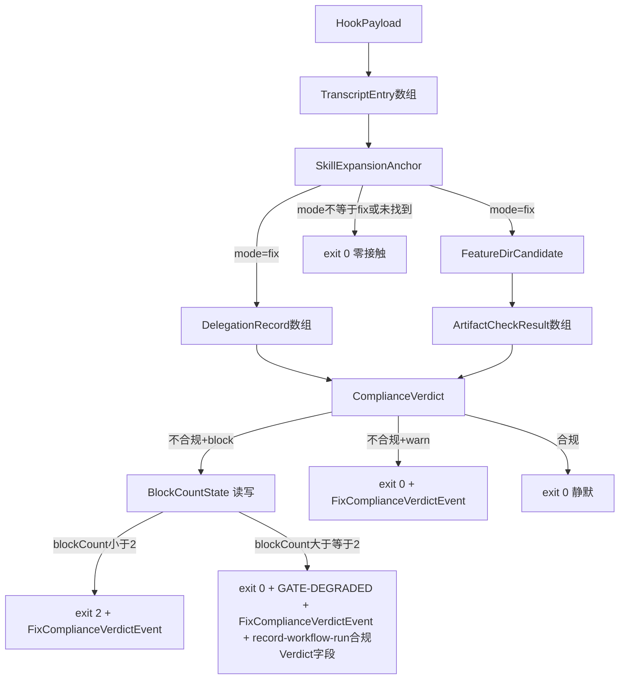

# 数据模型：Fix 模式流程依从性结构化保障

**特性分支**: `208-fix-mode-process-compliance`
**阶段**: Phase 1（`/spec-driver.plan` 设计与契约）

本特性不涉及数据库或持久化业务实体，"数据模型"指判定流程中流转的结构化对象与磁盘/审计落盘格式。以下实体与 spec.md 的 Key Entities 一一对应，补充实现层字段定义。

---

## 1. HookPayload（输入，来自 Claude Code Stop hook stdin）

| 字段 | 类型 | 说明 |
|------|------|------|
| `session_id` | string | 会话稳定标识，用于阻断计数键与并发会话隔离（对应 Key Entity"阻断记录"的会话标识要求） |
| `transcript_path` | string | transcript JSONL 文件绝对/相对路径 |
| `stop_hook_active` | boolean | Claude Code 提供的重入标记；本设计仅作诊断透传，不参与核心判定（见 research.md D3） |
| `cwd` | string（可选，容错） | 若 payload 未提供，退化用 CLI `--project-root`（默认 `process.cwd()`） |

**校验规则**：`session_id`/`transcript_path` 缺失或非字符串 → 判定为 payload 异常，走 FR-013 fail-open（`diagnostics: ['payload-invalid']`）。

---

## 2. TranscriptEntry（中间态，`readTranscriptEntries` 输出）

逐行 JSON.parse 后的会话事件对象数组，附加行索引：

| 字段 | 类型 | 说明 |
|------|------|------|
| `lineIndex` | number | 在 transcript 中的行序号（判定窗口锚定的排序依据） |
| `role` | string \| undefined | `user` / `assistant` / 其他 |
| `textBlocks` | string[] | 该行消息内 `content[].type === 'text'` 的文本集合（用于技能展开痕迹匹配） |
| `toolUseBlocks` | `{ name: string, input: object }[]` | 该行消息内 `content[].type === 'tool_use'` 的集合（用于委派/制品写入检测） |
| `parseError` | boolean | 该行 JSON.parse 失败时为 true，条目其余字段为空数组/undefined（容错跳过，不中断整体解析） |

**校验规则**：文件体积 > `MAX_TRANSCRIPT_BYTES`（20MB，[推断]，见 research.md D6）→ 整体判定 `transcript-too-large`，不逐行解析，直接 fail-open。

---

## 3. SkillExpansionAnchor（`detectFixSkillExpansion` 输出）

| 字段 | 类型 | 说明 |
|------|------|------|
| `found` | boolean | 是否存在任意 spec-driver 技能展开痕迹 |
| `mode` | string \| null | 最新一次展开对应的技能名（如 `fix`、`feature`、`story`） |
| `anchorLineIndex` | number \| null | 该次展开在 transcript 中的行索引 |

**判定分支**：`found === false` 或 `mode !== 'fix'` → 非 fix 会话，零接触放行（US5）。

---

## 4. DelegationRecord（`extractDelegationsAfter` 输出，数组元素）

| 字段 | 类型 | 说明 |
|------|------|------|
| `lineIndex` | number | 委派发生的 transcript 行索引（必须 `> anchorLineIndex`） |
| `toolName` | string | `Agent` 或 `Task`（两种记录名等价对待） |
| `subagentType` | string \| null | `tool_use.input.subagent_type` |
| `description` | string \| null | `tool_use.input.description`（`subagentType` 缺失时的判据退化来源） |
| `roleClass` | `'implement' \| 'verify' \| 'other'` | 由 `classifyDelegationRole` 基于 D6 的正则规则派生 |

---

## 5. FeatureDirCandidate（`resolveFeatureDirCandidate` 输出）

| 字段 | 类型 | 说明 |
|------|------|------|
| `path` | string \| null | 候选特性目录相对路径（如 `specs/208-fix-mode-process-compliance`），无候选时为 null |
| `existsOnDisk` | boolean | `fs.existsSync` 核验结果；`path !== null && existsOnDisk === false` 时按"无特性目录"处理 |

---

## 6. ArtifactCheckResult（`checkArtifactSection` 输出）

| 字段 | 类型 | 说明 |
|------|------|------|
| `path` | string | 被检查的制品相对路径 |
| `exists` | boolean | 文件是否存在 |
| `nonEmpty` | boolean | 内容非空（去除空白后长度 > 0） |
| `hasRequiredSection` | boolean \| null | 是否含指定标题的机械可判必填章节（`null` 表示该制品类型无此要求，如 `verification-report.md`） |
| `placeholderResidue` | boolean | 章节内容是否仍含未替换占位符（FR-012a 空壳检测，F228 四段判据）：正文去空白 **≤ 20** 字符；**或** canonical 中文模板占位符（`{根本原因一句话总结}` 形态）跨代码区一律命中，其闭合边界为 `}` 或**行尾**（不要求实际闭合；不成对形态锚定在同一行内，不跨行匹配）；**或**通用花括号占位符（正则 `/\{/`：任何 ASCII U+007B，不要求闭合、不区分 Markdown 转义）在剥离**闭合**围栏与行内 code span 之后的文本上扫描命中（未闭合围栏不剥离，转义反引号不作 code span 定界符）；**或**正文原文含花括号、但剥离代码区后的实质散文（去空白）仍 **≤ 20** 字符（代码区豁免的边界：豁免只服务"引用代码"，不服务"整段正文包在代码里的占位符"） |

---

## 7. ComplianceVerdict（`judgeCompliance` 最终输出，核心实体，对应 Key Entity"Fix 会话合规状态"）

| 字段 | 类型 | 说明 |
|------|------|------|
| `closureForm` | `'repair' \| 'no-op' \| 'undetermined'` | 收口形态判定（FR-002 三支之二 + 无法判定时的第三态） |
| `compliant` | boolean | 是否达到对应形态的最低合规要求 |
| `missing` | string[] | 缺失项清单（如 `['fix-report.md', 'delegation:implement']`），用于生成可执行反馈文本（FR-010） |
| `delegationCounts` | `{ implement: number, verify: number, other: number }` | 供审计与调试观察 |
| `enforcement` | `'block' \| 'warn' \| 'off'` | 本次生效的强制程度（FR-015） |
| `configDegraded` | boolean | 配置解析是否回落默认值（FR-015 类型化回落之一） |
| `diagnostics` | string[] | 判定过程诊断标签（如 `transcript-too-large`、`transcript-unavailable`、`internal-error`、`state-storage-unavailable`） |

---

## 8. BlockCountState（磁盘持久态，`.specify/runs/.fix-compliance-state/<session_id>.json`）

```json
{
  "sessionId": "string",
  "blockCount": 0,
  "degradedRecorded": false,
  "updatedAt": "2026-07-09T12:00:00.000Z"
}
```

**生命周期**：首次不合规阻断时创建（`blockCount: 1`，`degradedRecorded: false`）；每次后续不合规阻断时递增，上限判定在读取时进行（`blockCount >= 2` → 本次降级放行，不再递增）；文件无 TTL/清理机制（与会话生命周期同源，遗留文件对下次判定无副作用，仅按 `session_id` 命中时才被读取，不同 `session_id` 互不干扰，满足并发隔离要求）。

**`degradedRecorded` 字段语义**（research.md D4 幂等修订的落地）：默认 `false`；首次降级放行并成功写入 `workflow-run-summary` 终态事件后置 `true`；后续同会话再次触发降级路径时读到 `true` → 只输出 `[GATE-DEGRADED]` reason 与轻量 `fix-compliance-verdict` 审计事件，跳过重复的终态事件写入。历史状态文件缺该字段 → 按 `false` 处理（向后兼容）。存储不可用（state-storage-unavailable）场景下无法读写该标记 → 允许重复写终态事件（宁可重复可审计，不可静默丢失），由事件的 `diagnostics: ['state-storage-unavailable']` 提示消费方去重。

**同一 `runId` 多条终态事件的预期语义**（Feature 211 compliant-reset 落地补充）：当同一会话内合规收口成功时会触发 `resetBlockState`，将 `blockCount` 与 `degradedRecorded` 一并归位（详见 specs/211-fix-block-count-reset）。归位后该会话后续若再次耗尽额度降级，会再写入一条 `workflow-run-summary` 终态事件——因此**同一 `(workflowId, runId)` 出现多条终态事件是预期语义**（每个"阻断周期"一条），并非仅限 state-storage-unavailable 一种异常场景。消费方（`generate-adoption-insights.mjs`）按 `(workflowId, runId)` 去重，取时间最晚（`recordedAt`/`finishedAt`）的一条作为该 run 的最终结果，run 计数按唯一 `runId` 计；原始事件在 JSONL 审计日志中全部保留。

---

## 9. FixComplianceVerdictEvent（审计落盘格式，新增 JSONL eventType）

写入 `.specify/runs/YYYY-MM.jsonl`（与既有 `workflow-run-summary` 事件同文件，见 research.md D4）：

```json
{
  "schemaVersion": 1,
  "eventType": "fix-compliance-verdict",
  "recordedAt": "2026-07-09T12:00:00.000Z",
  "sessionId": "string",
  "enforcement": "block",
  "closureForm": "repair",
  "compliant": false,
  "missing": ["fix-report.md"],
  "blockCount": 1,
  "degraded": false,
  "diagnostics": []
}
```

**写入条件**：仅在"不合规且阻断/警告"或"判定异常/降级放行"路径写入；合规放行的 happy path 不写入（见 research.md D4 理由 2）。

**`compliant: null` 语义边界**（对应 contracts/fix-compliance-verdict-event.schema.json）：`null` 仅出现在**未能生成 ComplianceVerdict** 的审计事件中（FR-013 fail-open：payload 非法/transcript 不可用/超限/内部异常）；只要 `judgeCompliance` 正常执行，核心 `ComplianceVerdict.compliant`（本文件 §7）永远是 boolean，写入事件时原样透传。两者不是同一字段的两种取值习惯，而是"有判定结论的事件"与"仅诊断的事件"两类记录。

**消费方兼容性修正**（采纳 codex plan 审查 W-5，推翻 plan 初稿"无需改动"结论）：实测 `generate-adoption-insights.mjs` 对 `eventType !== 'workflow-run-summary'` 的行**并非静默过滤**，而是计入 `invalidLineCount` 并逐行产生"忽略无效 run event"warning——新增事件会污染 adoption 报告的 invalid 统计。处置：本次改动需同步给该脚本增加**已知非 summary 事件类型的静默 skip 白名单**（含 `fix-compliance-verdict`），保持单文件审计流设计不变；该脚本位于 `plugins/spec-driver/scripts/`（C-002 范围内），改动为纯增量。

---

## 10. record-workflow-run.mjs 事件新增字段（`complianceVerdict`，FR-014）

仅当调用方（本次唯一调用方 = Stop hook 判定器"降级放行"分支的编程调用）显式提供时出现：

```json
{
  "schemaVersion": 1,
  "eventType": "workflow-run-summary",
  "workflowId": "spec-driver-fix",
  "runId": "string",
  "result": "failed",
  "warnings": ["[GATE-DEGRADED] fix 会话在 3 次不合规尝试后降级放行，缺失: fix-report.md"],
  "complianceVerdict": {
    "closureForm": "undetermined",
    "compliant": false,
    "missing": ["fix-report.md"],
    "degraded": true,
    "blockCount": 2
  }
}
```

**向后兼容契约**：未显式传入 `complianceVerdict` 相关 CLI flag 时，事件对象**不包含** `complianceVerdict` 键（而非值为 `null`/`undefined` 的显式键），保证既有 4 个 SKILL 调用方（story/implement/doc/resume）与 fix 自身既有的"运行事件记录"步骤产出的事件字节级不变。

---

## 实体关系图


