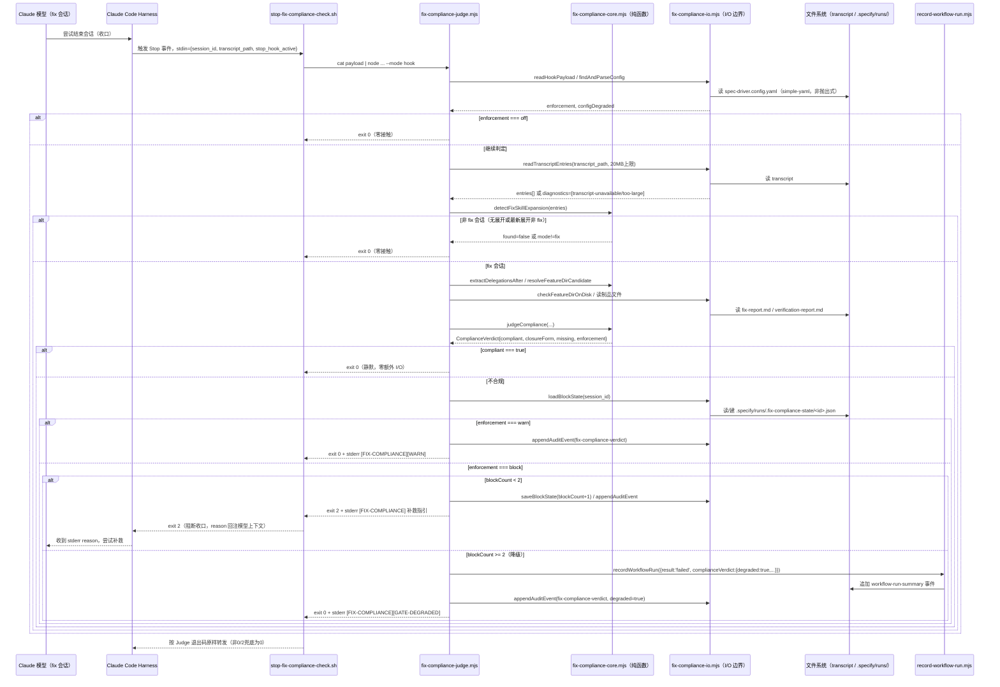
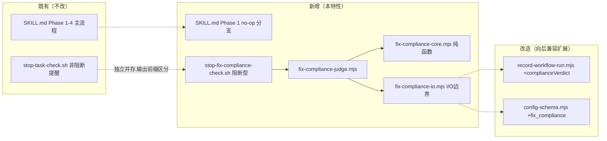

# Implementation Plan: Fix 模式流程依从性结构化保障（防仪式坍塌）

**Branch**: `208-fix-mode-process-compliance` | **Date**: 2026-07-09 | **Spec**: `specs/208-fix-mode-process-compliance/spec.md`
**Input**: Feature specification from `specs/208-fix-mode-process-compliance/spec.md`

## Summary

F206 战役实测证明：fix 会话在"agent 判断问题已修复/无需改动"场景下会**整体遗弃 SKILL.md 流程骨架**——不跑 `init-project.sh`、不建特性目录、不产出 `fix-report.md`、0 次子代理委派——直接在最终消息中行内 cosplay 一份"已完成"陈述收口，三轮纯 Prompt 层守卫全部被绕过（坍塌率 20%-29%）。技术方案（`research/tech-research.md` a+c+d 组合，经 `research/harness-verification.md` 三重实锤确认 headless/交互式场景均生效）：在 Claude Code `Stop` hook 挂载一个**住在模型上下文之外**的判定器，读取 harness 层写入的客观信号（transcript 中的 fix 技能展开痕迹 + `Agent`/`Task` 委派记录 + 磁盘制品状态），机械判定本次 fix 会话是否达到按收口形态分层的最低合规门槛（修复收口 / no-op 收口 / 二者皆禁"零委派+无制品"），不达标则阻断收口并返回可执行反馈；同时提供"确认无需改动"一等公民出口（避免误伤诚实场景）、阻断次数上限 2 次的有界降级放行、项目级 `block`/`warn`/`off` 强制程度配置（FR-015）。

判定路径本身**零 LLM、零子代理委派、纯本地文件系统/transcript 结构解析**，p95 目标 < 100ms；改动范围严格限定 `plugins/spec-driver/**`（C-002），不触碰评测 harness（C-001）。

## Technical Context

**Language/Version**: Node.js（LTS ≥ 20.x，`.mjs` ESM）+ Bash 5.x（hook 入口）——与仓库 `plugins/spec-driver` 既有技术栈约束一致，本次不新增技术栈
**Primary Dependencies**: 无新增依赖。复用仓库内既有零依赖模块：`plugins/spec-driver/scripts/lib/simple-yaml.mjs`（YAML 解析，判定路径专用，不经由 zod）、`node:fs`/`node:path`/`node:os`（内置）；判定路径**刻意不 import** `plugins/spec-driver/scripts/lib/config-schema.mjs`（避免拉入 `loadZod()` 间接依赖链，见 `contracts/fix-compliance-config-field.md`）
**Storage**: 文件系统（`.specify/runs/YYYY-MM.jsonl` 月度 JSONL 追加写入，复用 `record-workflow-run.mjs` 既有文件命名与目录约定；新增 `.specify/runs/.fix-compliance-state/<session_id>.json` 阻断计数持久态，已被既有 `.specify/runs/` 整段 `.gitignore` 规则覆盖）
**Testing**: `node --test`（`plugins/spec-driver/tests/*.test.mjs`，经 `npm run test:plugins` glob 执行，与仓库既有 `goal-loop-core.test.mjs`/`config-schema.test.mjs` 同构）+ `npx vitest run`（仓库主套件回归确认零失败，SC-005；verify 阶段两者都必须跑）；headless E2E 手工 spike（`plugins/spec-driver/scripts/dev/`，插件目录内、C-002 范围内，不计入自动化套件）
**Target Platform**: Claude Code 沙箱（交互式 CLI + headless `claude --print --plugin-dir`），跨 macOS/Linux（不依赖 GNU-only 命令，如不使用 `timeout`）
**Project Type**: single（插件源码，无前后端拆分）
**Performance Goals**: Stop hook 单次判定 p95 < 100ms（C-003）；transcript 解析设 20MB 体积上限（`[推断]`，需 implement 阶段实测校准）作为主要性能防线，不引入运行时熔断
**Constraints**: 零 LLM 调用、零子代理委派（C-003）；不得修改 `scripts/eval-*.mjs`/`scripts/lib/**`（C-001）；改动范围限 `plugins/spec-driver/**`（C-002）；不得以任务 ID/描述文本为判据（FR-011）；判定路径必须在评测环境（`claude --print --plugin-dir <worktree 源码> --allowedTools ... [--dangerously-skip-permissions]`，无 `--bare`）下与交互式环境行为一致，不得探测环境差异化（FR-015 红线）
**Scale/Scope**: 4 个新增源码文件（hook 脚本 + CLI + 2 个 lib 模块）+ 4 个既有文件的增量修改（`hooks.json`/`record-workflow-run.mjs`/`config-schema.mjs`/`spec-driver-fix/SKILL.md`）+ 测试与 fixture；不涉及数据库、不涉及跨包改动

## Codebase Reality Check

按 spec.md 目标文件逐一实测（LOC 为 `Read`/`cat -n` 实测结果，非估算）：

| 目标文件 | 现状 LOC | 公开接口/函数数 | 已知 debt | 本次改动类型 | 预估新增行数 |
|---------|---------|-----------------|-----------|-------------|-------------|
| `plugins/spec-driver/hooks/hooks.json` | 70 | N/A（JSON 配置） | 无（无 TODO/FIXME，结构清晰） | 追加 1 个 `Stop` 数组条目 | +8~10 |
| `plugins/spec-driver/hooks/stop-task-check.sh` | 22 | 1（脚本主体） | 无 | **不改动**（新脚本独立并存，见 Constitution XIII 落实原则） | 0 |
| `plugins/spec-driver/scripts/record-workflow-run.mjs` | 332 | 17（1 导出函数 `recordWorkflowRun` + 16 内部 helper） | 无（无 TODO/FIXME，最长函数 `recordWorkflowRun` ~60 行，未超 200 行阈值） | 新增可选 `complianceVerdict` 字段与对应 CLI flag（FR-014，向后兼容） | +40~70 |
| `plugins/spec-driver/scripts/lib/config-schema.mjs` | 526（已超 500） | 多个 zod sub-schema + `validateConfig`/`resolveEffectiveConfig`/`suggestField` | 无 TODO/FIXME | 新增 `fix_compliance` schema 段 + `BUILTIN_DEFAULTS` 一行 | +15~20（**未触发前置清理规则**：新增行数 < 50，见下方判定） |
| `plugins/spec-driver/skills/spec-driver-fix/SKILL.md` | 518（已超 500） | N/A（Markdown Prompt，无函数概念，按"阶段/步骤"计息，现有 4 阶段 + 若干子步骤） | 无 TODO/FIXME；结构清晰、无重复段落 | 新增 Phase 1 内 no-op 判定分支（含精简模板）+ "运行事件记录" 步骤无需改动（决策见 research.md D4） | +80~120（**触发前置清理规则**，见下） |

### 前置清理规则判定

- `record-workflow-run.mjs`：332 LOC < 500，不触发规则（无论新增行数），跳过。
- `config-schema.mjs`：526 LOC > 500，但预估新增 15-20 行 < 50，不触发"文件 LOC>500 且新增>50 行"复合条件，跳过。且无 TODO/FIXME 残留、无代码重复，无需前置清理。
- `spec-driver-fix/SKILL.md`：518 LOC > 500，预估新增 80-120 行 **> 50**，复合条件成立 → **触发前置清理规则**。但实测该文件无 TODO/FIXME、无重复段落、无超长函数（Markdown Prompt 无"函数"概念），触发原因纯粹是"体量已过阈值 + 本次新增量较大"，而非存在实质代码坏味道。**处置**：不制造无依据的"清理"任务（避免为满足规则字面而在无实际债务的 Prompt 文件上做无意义重排），改为在 tasks.md 生成阶段标注一个 `[CLEANUP]` 性质的**前置整理任务**——职责收窄为"在插入 no-op 分支前，复核 Phase 1 现有结构与'运行事件记录'段落的衔接点，确保插入位置不引入跨阶段编号混乱或重复的『上下文注入块模板』引用"，而非凭空杜撰不存在的债务清理项。该任务应排在 no-op 分支实现任务之前。

## Impact Assessment

- **影响文件数**：直接修改 5（`hooks.json`/`record-workflow-run.mjs`/`config-schema.mjs`/`spec-driver-fix/SKILL.md`/`generate-adoption-insights.mjs`）+ 间接受影响（调用方/依赖方）1（`validate-config.mjs` 消费 `config-schema.mjs` 新增 schema 段）= 共 6 个既有文件触及/需回归确认，另加 4 个新增源码文件（hook 脚本 + CLI + 2 个 lib 模块）+ 测试与 fixture 若干（不计入"影响文件数"，属新增制品而非既有代码变更面）。**[REVISED-BY-ORCHESTRATOR: 采纳 codex plan 审查 W-5]** `generate-adoption-insights.mjs` 从"无需修改"更正为"需小改"——实测其对非 `workflow-run-summary` 事件并非静默过滤，而是逐行计入 `invalidLineCount` 并产生"忽略无效 run event"warning，新增 `fix-compliance-verdict` 事件会污染 adoption 报告 invalid 统计；处置为给该脚本增加已知非 summary 事件类型的静默 skip 白名单（纯增量，C-002 范围内）
- **跨包影响**：0——全部改动落在 `plugins/spec-driver/**` 内（C-002 硬约束），不触碰 `src/`、`scripts/`（仓库根）、其他 `plugins/*`
- **数据迁移**：无——新增 JSONL 字段/事件类型均为纯增量可选字段，既有历史 `.specify/runs/*.jsonl` 记录无需回填或迁移；新增的 `.fix-compliance-state/` 状态文件无历史数据，首次运行自然创建
- **API/契约变更**：`record-workflow-run.mjs` 新增可选 CLI flag 与 `options.complianceVerdict` 编程参数——**内部接口**变更（无对外发布的公共 API），且严格向后兼容（未传参时事件字节级不变，见 `contracts/record-workflow-run-fields.md`）；`config-schema.mjs` 新增 `fix_compliance` schema 段——同样是内部接口的增量扩展，遵循既有"未配置新字段时行为不变"的 Constitution XIII 惯例
- **风险等级判定**：按机械规则（影响文件 <10 且跨包影响 0）应落 LOW，但本次改动**引入一个新的、默认生效的阻断型 harness Stop hook**——这是从"无到有"的强制点，误判/性能回归会直接影响**所有** fix 会话（不仅限于本次改动的直接调用方），且规则本身明确"修改内部接口"即可触发 MEDIUM 判定（`record-workflow-run.mjs`/`config-schema.mjs` 均属此类）。**综合判定为 MEDIUM**（内部接口变更成立 + 新增默认生效的阻断型 harness 组件带来的"小改动面、高杠杆"特征，超出文件计数所能反映的真实风险）。
- **MEDIUM 判定下的验证策略建议**（非强制分阶段，MEDIUM 不触发 spec.md 中"HIGH 风险强制分阶段"规则，但作为审慎工程实践在 tasks.md 阶段建议保留以下顺序依赖，作为任务排序依据而非独立 Phase 门禁）：
  1. 先落地判定核心（`fix-compliance-core.mjs` 纯函数 + 单测）并通过全部 fixture 场景，**在挂载 hook 之前**充分验证判定逻辑正确性；
  2. 再落地 I/O 边界（`fix-compliance-io.mjs`）与 CLI（`fix-compliance-judge.mjs` `--mode report`），用 quickstart.md 步骤 2/3 只读验证，**仍不接入 hooks.json**；
  3. 最后才修改 `hooks.json` 挂载 `--mode hook`，并立即跑 quickstart.md 步骤 4-6 的阻断/降级/配置场景 + headless E2E spike，确认不误伤非 fix 会话（US5）后再考虑 GATE_VERIFY 收口。
  这一顺序把"高杠杆、一旦出错影响全部会话"的挂载动作推迟到判定逻辑充分验证之后，是对 MEDIUM 风险的务实响应，不需要升级为 HIGH 的强制多阶段 GATE 拆分。

## Constitution Check

*GATE: Must pass before Phase 0 research. Re-checked after Phase 1 design — 本次为 tech-only 模式，Phase 0/1 由本 plan 一并产出，故一次性给出最终评估。*

| 原则 | 适用性 | 评估 | 说明 |
|------|--------|------|------|
| I. 双语文档规范 | 适用 | ✅ 通过 | 本 plan/research/data-model/contracts/quickstart 全部中文散文 + 英文代码标识符；实现产物（`.mjs`/`.sh`/`.md` 模板）遵循同一惯例 |
| II. Spec-Driven Development | 适用 | ✅ 通过 | 本特性本身通过 spec-driver-feature 全流程（specify→clarify→checklist→plan→tasks→implement→verify）推进，`trace.md` 已记录全部阶段 |
| III. YAGNI / 奥卡姆剃刀 | 适用 | ✅ 通过（已显式克制） | 未单独暴露 `orchestrator-cli.mjs` 断言子命令（tech-research.md 方案 b 已否决单列）；未在 fix SKILL 自身收口步骤引入判据自证式"丰富化"调用（research.md D4 alternatives，避免为凑"5 个调用方全升级"的字面联想制造第二判定链路）；未引入 OS 级超时机制（体积上限已足够，D6） |
| IV. 诚实标注不确定性 | 适用 | ✅ 通过 | `MAX_TRANSCRIPT_BYTES=20MB`、transcript envelope 精确字段结构均显式标注 `[推断]` 并要求 implement 阶段实测校准（research.md 末节） |
| V-VIII（spectra 插件约束） | 不适用 | N/A | 本特性改动范围为 `plugins/spec-driver/**`，不涉及 `plugins/spectra/`/`src/` |
| IX. Prompt 编排 + Harness 强制 | 适用（核心） | ✅ 通过，且是该原则的具体落地 | 本次方案正是"Harness 层通过 Hook 强制不可绕过约束"适用范围从 PreToolUse 扩展到 Stop 的具体实现；SKILL.md（Prompt 层）+ Stop hook（Harness 层）互补，未引入第三种绕过 Prompt 层编排核心的运行时逻辑 |
| X. 零运行时依赖 | 适用（核心） | ✅ 通过 | 无新增 npm 包；判定路径刻意规避 `config-schema.mjs`/zod 间接依赖链（`contracts/fix-compliance-config-field.md`），仅用 Node 内置模块与仓库既有零依赖 `simple-yaml.mjs` |
| XI. 质量门控不可绕过 | 适用 | ✅ 通过 | 新增 Stop hook 是本原则"Harness 层通过 Hook 强制不可绕过约束"条款的直接扩展应用场景 |
| XII. 验证铁律 | 适用（verify 阶段） | ⏳ 待 verify 阶段兑现 | plan 阶段已设计 quickstart.md 步骤 8 的性能实测任务，要求 verify 阶段附带**实际运行**的 p50/p95 命令输出而非推测性声明 |
| XIII. 向后兼容 | 适用（核心） | ✅ 通过 | `record-workflow-run.mjs`/`config-schema.mjs` 的新增字段均为可选且默认不改变既有行为；4 个非 fix SKILL 调用方逐字不变（FR-014） |
| XIV. 可观测性与架构守护 | 适用 | ✅ 通过 | 新增 `fix-compliance-verdict` 审计事件类型提供可追溯性；`fix-compliance-core.mjs`/`fix-compliance-io.mjs` 的纯函数/IO 分层复用既有 `goal-loop-core.mjs`/`goal-loop-cli.mjs` 惯例，避免架构风格漂移 |

**结论**：无 VIOLATION，无需 Complexity Tracking 表中的偏离豁免记录（本次全部设计决策均在 Constitution 既定原则内落地，非"偏离简单方案"，故 Complexity Tracking 表留空，符合模板"仅在有违规需要论证时填写"的用法）。

## Project Structure

### Documentation (this feature)

```text
specs/208-fix-mode-process-compliance/
├── spec.md                                    # 已存在（specify + clarify 全部裁决已固化）
├── plan.md                                     # 本文件
├── research.md                                 # Phase 0 输出（本次新增，9 个技术难点 D1-D7 决策记录）
├── data-model.md                               # Phase 1 输出（10 个实体定义 + 关系图）
├── quickstart.md                               # Phase 1 输出（本地验证步骤）
├── contracts/
│   ├── fix-compliance-judge-cli.md             # CLI 参数/退出码/stdout-stderr 合同
│   ├── fix-compliance-verdict-event.schema.json # 审计事件 JSON Schema
│   ├── record-workflow-run-fields.md           # record-workflow-run.mjs 新增字段合同
│   ├── fix-compliance-config-field.md          # spec-driver.config.yaml fix_compliance 字段合同
│   └── no-op-report-template.md                # no-op 精简报告模板 + 机械判据锚点合同
├── research/                                    # 已存在（tech-research.md / harness-verification.md / evidence-f206-r3.md）
├── trace.md                                     # 已存在，编排轨迹持续追加
└── tasks.md                                     # Phase 2 输出（/spec-driver.tasks 命令产出，本次不生成）
```

### Source Code (repository root)

本特性为单项目插件源码改动，不涉及 web/mobile 多项目结构，采用仓库既有 `plugins/spec-driver/` 布局：

```text
plugins/spec-driver/
├── hooks/
│   ├── hooks.json                              # [改] 新增 Stop 数组第 2 个条目
│   ├── stop-task-check.sh                      # [不改] 既有非阻断型 Stop hook，独立并存
│   └── stop-fix-compliance-check.sh            # [新] 阻断型 Stop hook 入口（bash，薄壳）
├── scripts/
│   ├── record-workflow-run.mjs                 # [改] 新增可选 complianceVerdict 字段（FR-014）
│   ├── fix-compliance-judge.mjs                # [新] CLI 编排入口（--mode hook|report）
│   ├── dev/
│   │   └── spike-fix-compliance-e2e.mjs        # [新] 手工 headless E2E spike（不计入 npm test）
│   └── lib/
│       ├── simple-yaml.mjs                     # [不改] 复用（fix_compliance.enforcement 读取）
│       ├── config-schema.mjs                   # [改] 新增 fix_compliance zod schema 段
│       ├── goal-loop-core.mjs                  # [不改] 仅作分层惯例参照
│       ├── fix-compliance-core.mjs             # [新] 纯函数判定核心（零 I/O）
│       └── fix-compliance-io.mjs               # [新] I/O 边界（transcript/config/state/audit 读写）
├── skills/spec-driver-fix/
│   └── SKILL.md                                # [改] Phase 1 新增 no-op 判定分支 + 精简模板
└── tests/
    ├── fix-compliance-core.test.mjs            # [新] 纯函数单测
    ├── fix-compliance-io.test.mjs              # [新] I/O 边界单测（含 FR-015 三步判定顺序）
    └── fixtures/fix-compliance/
        ├── collapsed-zero-delegation.jsonl      # [新] F206 核心坍塌场景
        ├── compliant-full.jsonl                 # [新] 完整合规
        ├── compliant-noop.jsonl                 # [新] no-op 合规
        ├── noop-zero-delegation.jsonl            # [新] no-op 但 0 委派（应判不合规，US2 场景2）
        ├── placeholder-shell.jsonl               # [新] 占位空壳制品
        ├── role-mismatch.jsonl                   # [新] 委派角色不匹配
        ├── multi-expansion.jsonl                 # [新] 多技能/多次展开
        ├── non-fix-session.jsonl                 # [新] 无展开痕迹
        └── malformed-transcript.txt              # [新] 损坏/超限 transcript
```

**Structure Decision**：延续 `plugins/spec-driver/{hooks,scripts,scripts/lib,skills,tests}` 既有目录职责划分，新增文件均落在对应既有目录内（无新建顶层目录），`scripts/dev/` 为本次唯一新建子目录，专门隔离"消耗真实凭据、非确定性、不计入自动化套件"的手工验证脚本，与 `scripts/`（生产 CLI）、`tests/`（自动化断言）形成三方职责边界。

## Architecture





## Complexity Tracking

> 本特性无需填写此表——Constitution Check 全部通过，未出现需要论证豁免的偏离简单方案的架构决策。spec.md 自身的"复杂度评估"章节已判定整体复杂度为 MEDIUM（3 个组件、4-5 个接口、1 个状态机式复杂度信号），本 plan 的设计决策（research.md D1-D7）均在该复杂度预算内落地，未引入超出 spec 预判的额外抽象层。
