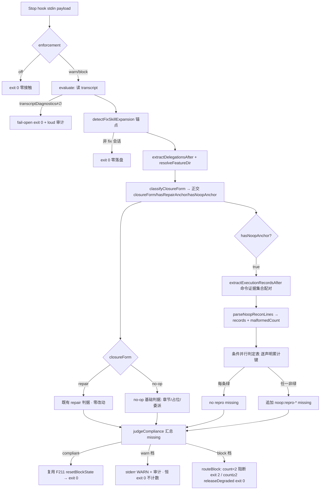

# Implementation Plan: fix 模式 no-op 出口可执行证据门

**Branch**: `claude/f216-noop-evidence-gate-85136d` | **Date**: 2026-07-20 | **Spec**: [spec.md](./spec.md)
**Input**: `specs/216-fix-noop-evidence-gate/spec.md`（19 FR / 7 SC / 10 EC）
**Research**: [research/tech-research.md](./research/tech-research.md) · [clarifications.md](./clarifications.md)
**GATE_DESIGN 已拍板**：变体 2（A+结构化报告骨架）· 不开替代证据例外 · 判定材料不可用沿用 fail-open
**修订**：R1/R2（2026-07-20）吸收 Codex 两轮对抗审查——对账行单行 JSON 机械冻结、sentinel 整行末行 + W5 归一化、证据集合条件并行累计、双锚点正交、6 键 taxonomy、exitCode 分支门禁

## Summary

给 fix 流程 no-op 出口（`hasNoopAnchor === true`）加一道**可执行证据门**：把"问题是否已修复"从可被自信文本断言满足，改为必须携带**逐声明结构化复现证据 + 主 transcript 可见的真实 Bash 执行痕迹**才放行。技术路线：(1) io 归一化层扩展保留 `ExecutionRecord` 字段（tool_use.id / tool_result.is_error / 命令 / 完整 flatten 内容 / 定位行）；(2) core 纯函数层新增"逐声明单行 JSON 对账解析 + fix 锚点后窗口命令证据集合配对 + 受控断言（sentinel 整行末行）判定 + 6 个互斥 missing 枚举"；(3) judge 编排层在 noop 锚点分支接线 ExecutionRecord 提取并透传 core；(4) SKILL.md no-op 分支合同改为"编排器亲执行 Bash 复现 + 逐声明单行 JSON 对账模板 + 只读/非交互安全边界"，经 `repo:sync` 重生双写链。全程复用 F208 三档语义 / 有界降级 / F211 清零 / 三层测试骨架，零新增运行时依赖。诚实边界：本门核验"复现命令是否真被执行、是否得约定 PASS sentinel、fix-report 声明是否与执行记录逐条配对"，**不核验**命令语义是否真对应 issue 症状、不从退出码判读 bug 是否存在。

## Technical Context

**Language/Version**: Node.js ≥ 20.x（ESM `.mjs`），插件编排核心零运行时依赖（Constitution X）
**Primary Dependencies**: 无新增——复用 `fix-compliance-core.mjs` 纯函数层 / `fix-compliance-io.mjs` fs 层 / `simple-yaml.mjs`；**禁止** import `scripts/lib/driver-eval-core.mjs`（跨目录，plugins/spec-driver 是独立分发单元；仅借鉴其 use/result 配对模式）
**Storage**: 复用 F208 `BlockCountState`（`.specify/runs/.fix-compliance-state/<session>.json` + tmpdir 降级）；审计事件复用 `.specify/runs/YYYY-MM.jsonl`；**无新增状态存储、无数据迁移**
**Testing**: vitest（三层：`fix-compliance-core.test.mjs` 纯函数 / `fix-compliance-io.test.mjs` I/O / `fix-compliance-judge-cli.test.mjs` 集成）+ `plugins/spec-driver/tests/fixtures/fix-compliance/` transcript fixture
**Target Platform**: Claude Code Stop hook 运行时（headless + 交互）；Codex rollout 消费待 M9 A3 hook 接线后适配（本期仅做 schema 差异记录）
**Project Type**: single（插件内 scripts + skills + tests）
**Constraints**: F208 判定合同零破坏；Stop hook 不可 brick 会话（fail-open 保险）；正向修复路径零新增摩擦；wrapper 双写 sha 门禁保持绿
**Scale/Scope**: 判据侧 ~3 个 .mjs 文件追加 + 1 个 SKILL.md 合同修订 + 3 个测试文件扩展 + ~14 个新 fixture

## Codebase Reality Check

| 目标文件 | LOC | 公开接口 | 已知 debt | 本次预计新增 |
|----------|-----|----------|-----------|--------------|
| `scripts/lib/fix-compliance-core.mjs` | 434 | ~12 export | 无 TODO/FIXME；分层清晰、纯函数无副作用 | ~120-160 行（flatten + assertionStatus + 单行 JSON 解析 + 证据集合配对 + 决策表 + noop 分支扩展 + 6 枚举文案） |
| `scripts/lib/fix-compliance-io.mjs` | 335 | 12 export | 无；io 仅经 `readTranscriptEntries` **调用** core 的 `normalizeTranscriptEntry`（函数定义在 core L102，tasks 审查修正归属） | 极小或零（调用链不变；集成回归验证 20MB/坏行/全损坏行为不变） |
| `scripts/fix-compliance-judge.mjs` | 415 | main/parseArgs/buildFeedbackText/evaluate 等 | 无；`evaluate()` 是 noop 锚点分支接线唯一落点 | ~20-30 行（noop 锚点分支透传 ExecutionRecord） |
| `skills/spec-driver-fix/SKILL.md` | 547 | prompt 合同（L284-311 no-op 分支）；`allowed-tools` 已含 `Bash` | 无；为 wrapper source-of-truth，改后触发双写链 | ~40-50 行（亲执行步骤 + 单行 JSON 对账模板 + 只读/非交互/timeout 安全文案） |

**前置清理规则评估**：无文件触发强制前置 cleanup task——

- `fix-compliance-core.mjs`（434）+ 新增 ~140 行后**将越过 500**（≈574）。评估：不满足"LOC>500 **且** 本次新增>50 于**同一既存热点**"的坏味道判据（新增为全新纯函数 + 常量，非在既有超长函数内膨胀）；核心已高内聚、无既存坏味道，新增延续 `detect*/extract*/classify*` 命名与纯函数惯例，按 Constitution III 属同构追加。**在 tasks 中标注监控项**：若 implement 后 core 单文件 > 600 行或出现职责混杂，作为 follow-up 拆分候选（`execution-record` 抽子模块），**本期不前置拆分**（避免为规模而拆、放大验证面）。
- `SKILL.md`（547 > 500）新增 ~45 行为 prompt 合同文本（非代码逻辑），代码坏味道 cleanup 规则不适用。
- 无 > 3 个相关 TODO/FIXME；无 > 30 行重复逻辑。
- **结论**：tasks.md 中**无 `[CLEANUP]` 前置任务**；实现从 Phase 0（FR-017 真实 transcript 锚定）起步；core 体积作为**监控项**而非前置阻断。

> **注**：`normalizeTranscriptEntry` 放开 tool_result 需谨慎——现注释明确"tool_result 排除出 textBlocks 从源头堵反伪造洞"。本次扩展**只把 tool_result 的 `is_error`/`tool_use_id`/完整 flatten 内容收进独立字段（不并入 textBlocks/toolUseBlocks）**，展开痕迹与委派判据仍只认 text/tool_use，反伪造语义不回退（AD-2 详述）。

## Impact Assessment

| 维度 | 评估 |
|------|------|
| **直接修改文件** | 4 源文件（core / io / judge / SKILL.md）+ 3 测试文件 + fixture 目录 ≈ 8-9 个 |
| **间接受影响** | `hooks/stop-fix-compliance-check.sh`（薄壳，退出码转发不变）；`record-workflow-run.mjs`（降级终态调用不变）；生成产物 `.codex/skills/spec-driver-fix/SKILL.md` + `skills-codex/spec-driver-fix/SKILL.md`（经 repo:sync 重生，非手改）；spec.md FR-019 键列表（已由编排器同步为 6 键，plan 侧只读校验，见 §2 W6） |
| **跨包影响** | **0**——全部落 `plugins/spec-driver/` 内 + 其 Codex 镜像；不触 `src/`、`scripts/eval*`、`scripts/lib/driver-eval-core.mjs` |
| **数据迁移** | **无**——`ExecutionRecord` 为新增只读派生结构；旧版 fix-report 无新字段按缺证据处理（FR-011）；`BlockCountState` schema 不变、`normalizeState` 已有缺字段容错 |
| **API/契约变更** | 追加式（非破坏）：`ExecutionRecord` 新数据合同、`MISSING_ACTION_TEXT` 新增 6 key、F208 verdict 的 noop 分支追加判据、`classifyClosureForm` 返回结构由字符串扩为正交对象、SKILL no-op 模板合同修订 |
| **风险等级** | **MEDIUM**——影响文件 < 10 且跨包 = 0（本可判 LOW），但因**修改 F208 既有 harness 判定合同的 noop 分支 + 改 `classifyClosureForm` 返回形态**（内部接口修改）上调至 MEDIUM |

**分阶段驱动力说明**：本 plan 的 7 phase 分阶段**不由风险等级强制触发**（MEDIUM 未达 HIGH 阈值），而由 **FR-017 TDD 硬顺序**驱动——ExecutionRecord 字段路径必须先经真实 Bash transcript fixture 锚定，才能实现解析器；每个新判据先红测试后实现。风险缓解详见「实施 Phases」每阶段验证点。

## Constitution Check

*GATE：Phase 0 前必过，Phase 1 设计后复检。*

| 原则 | 适用性 | 评估 | 说明 |
|------|--------|------|------|
| III YAGNI / 奥卡姆剃刀 | 适用 | PASS | 复用 F208 blockState/审计/三层测试，无新状态机、无新存储、无新 registry；ExecutionRecord/6 键为当前 FR-016/019 明确所需，非假设性未来能力；core 拆分列为监控项而非过早抽象 |
| IV 诚实标注不确定性 | 适用 | PASS | 能力边界声明保留；FR-017 前字段路径（含是否暴露数字退出码）为待验证假设，AD-1/AD-3 显式标注"锚定后定稿，禁猜测" |
| IX Prompt 编排 + Harness 强制 | 适用 | PASS | SKILL.md 承载 noop 分支编排合同（prompt 层）；judge/core/io 承载不可绕过机械门（Harness 层），互补 |
| X 零运行时依赖 | 适用 | PASS | 无新增 npm 包；纯函数 + fs + simple-yaml；不 import 跨目录 driver-eval-core |
| XI 质量门控不可绕过 | 适用 | PASS | 本 feature 即强化 Harness 层 Stop hook 门禁；仅追加 noop 判据，不削弱既有门 |
| XII 验证铁律 | 适用 | PASS | TDD 先红后绿；编排器自跑 vitest/build/repo:check，不信 agent 自报 |
| XIII 向后兼容 | 适用 | PASS | FR-011 旧 fix-report 无新字段按缺证据处理且不崩溃；F208 off/warn/block 三档与降级/清零语义全保持 |
| XIV 可观测性与架构守护 | 适用 | PASS | 降级/警告审计复用 missing[] 结构；core 新增判据延续纯函数分层，体积监控项防劣化 |
| I 双语文档 | 适用 | PASS | plan 中文散文 + 英文标识符 |
| II Spec-Driven | 适用 | PASS | 走 spec→plan→tasks→implement→verify 制品链 |

**VIOLATION**：无。无需 Complexity Tracking 豁免论证。

## Project Structure

### Documentation（本 feature）

```text
specs/216-fix-noop-evidence-gate/
├── spec.md · clarifications.md · plan.md（本文件）
├── research/tech-research.md · checklists/requirements.md
└── tasks.md   # 下阶段（/spec-driver.tasks 产出，非本 plan 创建）
```

### Source Code（改动落点，仓库根相对路径）

```text
plugins/spec-driver/
├── scripts/
│   ├── lib/fix-compliance-core.mjs   # [改] flattenToolResultContent / deriveAssertionStatus /
│   │                                  #      extractExecutionRecordsAfter / parseNoopReconLines /
│   │                                  #      normalizeCommandConservative / classifyReproEvidence /
│   │                                  #      classifyClosureForm 返回正交结构 / judgeCompliance noop 扩展 / 6 missing 文案
│   ├── lib/fix-compliance-io.mjs     # [回归] readTranscriptEntries 调用链不变（normalizeTranscriptEntry 定义在 core，io 侧改动极小或零）
│   └── fix-compliance-judge.mjs      # [改] evaluate() 按 hasNoopAnchor 透传 ExecutionRecord
├── skills/spec-driver-fix/SKILL.md   # [改] source-of-truth：noop 分支亲执行 + 单行 JSON 对账模板 + 安全边界
├── skills-codex/spec-driver-fix/SKILL.md   # [生成] repo:sync 重生（勿手改）
└── tests/
    ├── fix-compliance-core.test.mjs · fix-compliance-io.test.mjs · fix-compliance-judge-cli.test.mjs   # [改]
    └── fixtures/fix-compliance/            # [新] ~14 个 fixture（含 FR-017 真实 Bash 锚点 ×2 runtime）
.codex/skills/spec-driver-fix/SKILL.md      # [生成] repo:sync 重生（勿手改）
plugins/spec-driver/scripts/dev/spike-fix-compliance-e2e.mjs  # [改] 新增 noop-unverified scenario（Phase 6 可选子项）
```

**Structure Decision**: 沿用 F208 既有三层分离（core 纯函数 / io 边界 / judge 编排）+ SKILL prompt 合同 + fixture 驱动测试，不新建目录、不新建平行 registry。ExecutionRecord 逻辑就近落既有文件，遵循 Constitution III。

## Architecture

### 1. 数据合同：ExecutionRecord

`ExecutionRecord` 是"一次主 transcript 可见的真实 Bash 执行"的只读派生结构，由 core 从归一化后的 transcript entries 配对生成（不落盘）。字段（FR-016）：

| 字段 | 来源 | 说明 |
|------|------|------|
| `id` | assistant tool_use `block.id` | Bash tool_use 唯一 id，配对主键 |
| `name` | tool_use `block.name` | 恒 `'Bash'`（非 Bash 工具 MVP 不支持，EC-007） |
| `command` | tool_use `input.command` | 原文命令（保守规范化用于比对，见 §2） |
| `toolUseLineIndex` / `toolResultLineIndex` | entry.lineIndex（各侧） | 定位信息；缺 result 时 result 行为 `null` |
| `paired` | 派生 | tool_use.id 命中某 tool_result.tool_use_id 才为 `true` |
| `isError` | tool_result `block.is_error === true` | 工具级错误；缺 result 时 `null` |
| `flattenedOutput` | io `toolResultBlocks[].flattenedContent`（**完整、未预截断**） | assertionStatus 唯一计算源（判定用完整内容） |
| `assertionStatus` | 派生 ∈ {`PASS`,`FAIL`,`INCONCLUSIVE`,`CONTRADICTION`} | 见下 sentinel 规则 |
| `outputSummary` | flattenedOutput 截断（展示上限 ≈2000 字符） | **仅供反馈展示，绝不作判定源**（C1） |

**content flatten 规则（C1/W5）**：tool_result `block.content` 两形态（现有 fixture `fake-anchor-in-tool-result.jsonl` 已证明 block-array 形态存在）：
- string → 直接取；
- array → **仅取顶层 `type==='text'` 块**的 `text`（`typeof === 'string'`）按序以 `\n` 拼接，非文本块忽略；**不递归 nested array**（Phase 0 验证目标 runtime 顶层形态即够；若 Phase 0 发现 nested 形态则升级为深度 ≤2 递归并在 fixture README 记录）。
`flattenedContent`（io 侧）= **完整、未预截断**文本，受既有 20MB 文件上限自然约束、无单独 flatten 截断；core 在其上算 assertionStatus；`outputSummary`（core 侧展示截断）**不参与判定**。

**assertionStatus 派生（sentinel 整行末行精确匹配，C2/W5）**——先归一化 `flattenedContent`：CRLF 与 lone-CR 统一为 `\n`；空行定义 `line.trim().length === 0`。再扫描非空输出行：
- 合法 sentinel 行 = **原行 trim 后精确等于** `SPEC-DRIVER-REPRO: PASS` 或 `SPEC-DRIVER-REPRO: FAIL` 字面量（含 ANSI 色码/任何装饰一律拒绝，**不做去色规范化**——SKILL 文案提示复现命令勿加彩色输出；整行约束天然排除 grep 模式串/源码摘录噪声）；
- 恰好 1 个合法 sentinel 行 **且为最后一个非空输出行** → `PASS` 或 `FAIL`（按其值）；
- ≥2 个合法 sentinel 行，或 PASS 与 FAIL 同现 → `CONTRADICTION`；
- 0 个合法 sentinel 行，或唯一 sentinel 非末行 → `INCONCLUSIVE`。

> **exitCode 分支门禁（Phase 0 定，非静默 fallback；C4/FR-014）**：数字退出码是否入判据由 Phase 0 真实 transcript 证据决定——
> - **(a) 若 transcript 暴露数字退出码**：判据加一条——非零退出**无条件 INCONCLUSIVE**（`noop:repro-output-mismatch`）；PASS sentinel 与非零退出同现 → `noop:repro-contradiction`。数字退出码仍**不作** 0=绿的正向判读（FR-014 废弃 0/非0=绿/红）。
> - **(b) 若不暴露**：受控断言合同 = SKILL **强制的 wrapper 形态**（`<断言> && printf 'SPEC-DRIVER-REPRO: PASS\n' || printf 'SPEC-DRIVER-REPRO: FAIL\n'`——原命令状态经 wrapper 转译为唯一 sentinel，非零状态必然产 FAIL sentinel 而非 PASS）；judge 侧可观测面 = sentinel + is_error。此时 FR-014"非零→INCONCLUSIVE"是**经 wrapper 转译而非直接观测**——此**边界精度注记**须由编排器在 Phase 0 落 (b) 时**补写入能力边界声明**（一句：非零退出的 INCONCLUSIVE 判定依赖 wrapper 转译正确性）；阻断语义不变（无合法 PASS sentinel 一律不放行），非削弱、非静默。

**归一化层落点（io，AD-2/I10）**：`normalizeTranscriptEntry` 现只保留 `toolUseBlocks:{name,input}` 且丢弃 tool_result。扩展为：
- `toolUseBlocks` 每项追加 `id`（缺失 `null`）；
- 新增 `toolResultBlocks: {toolUseId, isError, flattenedContent}[]`（**独立字段，不并入 textBlocks/toolUseBlocks**）；
- **不预截断判定源**：`flattenedContent` 保留完整 flatten 文本，内存边界由既有 20MB transcript 文件上限自然约束（无单独 flatten 上限）；展示截断只发生在 core 侧 `outputSummary`；
- **所有返回分支（含 parseError/非对象）恒带 `toolResultBlocks: []`**（下游免 undefined 判空）；
- 20MB 上限、坏行静默跳过、全损坏→`transcript-unavailable` 三项既有行为**不变**；
- **回归保留**：fake tool_result 不影响锚点/委派/目录提名（现有反伪造用例继续绿）。

**配对层落点（core）**：新增纯函数 `extractExecutionRecordsAfter(entries, anchorLineIndex)`——镜像 `driver-eval-core.mjs` 的 use/result 配对模式（`tool_use.id ↔ tool_result.tool_use_id`）但**自包含实现、零跨目录 import**。仅收 `name==='Bash'` 且 `lineIndex > anchorLineIndex`（fix 锚点后窗口）的 tool_use，按 id join tool_result。

### 2. 判据设计：单行 JSON 对账 + 证据集合 + 受控断言

**逐声明对账结构（C1：废弃内联 `症状|命令|结果` regex）**——内联管道 regex 无法无损承载含反引号 / 管道 / heredoc / `\` 续行 / 多行的合法 Bash 命令，且 malformed 行静默消失会造成"一绿一坏"误放行。改为 `## 判定依据 > ### 复现对账` 子标题下，每条 bullet 后跟**单行 JSON 对象**（命令内换行编码为 `\n`）：

```markdown
## 判定依据

### 复现对账
- {"claim":"症状 X 已消除","command":"pytest -q test_contains.py -k not_broken && printf 'SPEC-DRIVER-REPRO: PASS\n' || printf 'SPEC-DRIVER-REPRO: FAIL\n'","expected":"PASS"}
```

**解析器合同（C1/C3 机械冻结，malformed 不可静默丢弃）**：`parseNoopReconLines(fixReportContent)` 返回 `{records: {claim,command,expected}[], malformedCandidateCount}`：
- 定位 `### 复现对账` 区块（至下一**同级 `###` 或上级 `##`** 标题或文件尾止）；
- 区块内除空白行（`trim` 后空）外，**每一行 MUST 匹配 `^\s*-\s+(.+)$`**，否则计 malformed（普通说明文字 MUST 放区块外——区块内非 bullet 正文即 malformed）；
- bullet payload MUST `JSON.parse` 成功且为 object；字段冻结：`claim` 非空 string、`command` 非空 string、**`expected === "PASS"` 字面量冻结**（任何其他值/类型均 malformed——由此 `expected` 被解析层消费，不留"装饰字段"）；
- 合规行入 `records`，否则 `malformedCandidateCount++`；
- `### 复现对账` 区块缺失，或 `records` 为空，或 `malformedCandidateCount > 0` → 判 `noop:repro-fields`（block 级短路，先于逐声明判定）。

**保守规范化**（FR-016，C1 codex 修正）：`normalizeCommandConservative(cmd)` = 仅去首尾空白 + 折叠尾随换行；**不去引号**。报告侧与 transcript 侧各自 normalize 后 `===` 精确比对。

**证据集合语义（C3，拒绝"任一绿即绿"）**：对每条对账 record，其**证据集合 E** = fix 锚点后窗口内、`normalizeCommandConservative(record.command) === normalizeCommandConservative(er.command)` 的**全部** ExecutionRecord。判定**采信整个集合**——仅当集合非空且全部记录均"配对 ∧ ¬is_error ∧ assertionStatus===PASS"才判该条绿。

**判定语义（C2：条件并行，非 first-match）**——逐声明**累计全部适用键**，再跨声明**并集去重**（对齐 spec"多缺失 MUST 合并全部列出"）。每条声明：E 空 → 仅 `command-mismatch`；E 非空时**并行判定**下表各条件，命中即累计对应键（可同时命中多条）；**该声明绿当且仅当其键集为空且全部记录 assertionStatus===PASS**。

**条件并行判定表（行间非互斥、逐声明累计、跨声明并集去重；行 0 为块级前置短路）**：

| 序 | 层级 | 条件（命中即累计该键） | missing key |
|----|------|------|-------------|
| 0 | 块级前置（短路） | `### 复现对账` 缺失 / records 为空 / malformedCandidateCount>0 | `noop:repro-fields`（短路，不进逐声明） |
| 1 | 每声明 | 证据集合 E 为空（无任一命令匹配，含窗口内全无 Bash） | `noop:repro-command-mismatch` |
| 2 | 每声明（E 非空并行） | ∃ 记录 `paired===false`（有 tool_use 无配对 tool_result） | `noop:repro-result-missing` |
| 3 | 每声明（E 非空并行） | ∃ 记录 `paired ∧ isError===true` | `noop:repro-tool-error` |
| 4 | 每声明（E 非空并行） | ∃ 记录 `paired ∧ ¬isError ∧ assertionStatus∈{FAIL,CONTRADICTION}`，或集合内 PASS/FAIL 冲突 | `noop:repro-contradiction` |
| 5 | 每声明（E 非空并行） | ∃ 记录 `paired ∧ ¬isError ∧ assertionStatus===INCONCLUSIVE`（0 sentinel / 非末行） | `noop:repro-output-mismatch` |
| — | 每声明 | 键集为空 **且** 全部记录 `paired ∧ ¬isError ∧ assertionStatus===PASS` | **绿**（该条无 missing） |

行 1 与行 2-5 互斥（E 空 vs 非空）；行 2-5 之间**可同时命中**（如一条声明的 E 内既有 unpaired 又有 isError 记录 → 同时累计 `result-missing` + `tool-error`）。no-op 合规当且仅当块级前置通过 **且** 每条对账 record 均绿。产出 **6 个** canonical missing key。

**canonical missing keys（6 键互斥穷尽，FR-019）+ MISSING_ACTION_TEXT**（`buildFeedbackText` 静默过滤未注册 key，故 core 单测断言"每 key 有文案"防漏配）：

| key | MISSING_ACTION_TEXT（措辞 implement 定稿；含 FR-015 一句话骨架） |
|-----|-------------------------------------------------------------------|
| `noop:repro-fields` | "no-op 判定依据缺结构化复现对账：请在 `## 判定依据 > ### 复现对账` 下每条 bullet 写单行合法 JSON，如 `{\"claim\":\"症状已消除\",\"command\":\"<复现命令>\",\"expected\":\"PASS\"}`，命令内换行用 \\n" |
| `noop:repro-command-mismatch` | "缺可执行复现痕迹：报告声称的复现命令在主 transcript 无对应 Bash 执行——请先经 Bash 亲自执行该命令再据实收口。断言骨架：`<断言> && printf 'SPEC-DRIVER-REPRO: PASS\\n' || printf 'SPEC-DRIVER-REPRO: FAIL\\n'`（FR-015）" |
| `noop:repro-result-missing` | "复现命令有调用但无执行结果（transcript 截断/未完成）：请确认命令执行完成并在主 transcript 留下 tool_result" |
| `noop:repro-tool-error` | "复现命令工具级报错（is_error）：无法据此判断 bug 不存在，请修正命令使其可执行" |
| `noop:repro-output-mismatch` | "复现输出无约定 PASS 标记：命令末行须精确输出 `SPEC-DRIVER-REPRO: PASS`（整行、唯一、末行），否则判 INCONCLUSIVE" |
| `noop:repro-contradiction` | "复现声明与执行记录冲突：报告声称已修但执行输出为 FAIL/矛盾 sentinel，请复核根因或转真实修复" |

> **spec 同步（C5/W6，已完成）**：spec.md FR-019 的 6 键（`noop:repro-fields`/`-command-mismatch`/`-result-missing`/`-tool-error`/`-output-mismatch`/`-contradiction`）与 EC-001（`command-mismatch`）已由编排器**先行同步落地**——这是按 FR-016"缺 result / result 报错 / 命令不匹配 / 输出不匹配 MUST 用不同稳定枚举区分"的逐类要求**更严格履行**（非降级）。Phase 5 仅做只读一致性校验（见下）。

### 3. SKILL.md 合同修订（no-op 分支，L284-311）

1. **新增亲执行步骤**：no-op 结论落盘前，Phase 1 编排器 MUST **亲自经 Bash 工具**执行每条复现命令（使主 transcript 可见 tool_use/tool_result）；verify 类子代理仅复核"无需改动"结论、**不承担复现执行**（子代理 sidechain 主 transcript 不可见，FR-001）。
2. **模板改单行 JSON 对账**：`## 判定依据` 下强制 `### 复现对账` 子标题 + 每条 bullet 单行 JSON `{claim,command,expected}`（§2），标注硬要求（FR-002）。
3. **sentinel 约定**：复现命令末行须精确打印 `SPEC-DRIVER-REPRO: PASS`（期望行为成立）或 `SPEC-DRIVER-REPRO: FAIL`，给断言骨架示例（FR-015 采用，见 C5/I12）；提示复现命令**勿加彩色/ANSI 输出**（W5：装饰行不被识别为 sentinel）。
4. **安全边界文案（W9-finding）**：复现命令 MUST **只读**（禁改源码/状态，EC-009 仅合同约束）、**非交互**、**禁 sudo/提权**、**禁启动后台常驻进程**、**必须带工具级 timeout**；**超时或需交互一律按 INCONCLUSIVE 记录，不无限重试**。
5. **双锚点提示**：若同时写 `Root Cause` 表格与 `## 判定依据`，取严为 repair，须**同时满足 repair 合同与 no-op 证据合同**（FR-018，判据可达性见 AD-4）。
6. 改后 `npm run repo:sync` 重生 `.codex/skills/` + `skills-codex/` 双写并重算 `Source SHA256`；`npm run repo:check` + `wrapper-sha256.test.ts` 保持绿（FR-012，**勿手改生成产物**）。

### 4. 判定流架构图



> **关键（C4）**：`hasNoopAnchor===true` 即追加复现证据校验，与 `closureForm` 路由正交——双锚点（closureForm=repair 但 hasNoopAnchor=true）时 repair 合同**和** repro 证据合同并行判定，二者 missing 合并，使 FR-018"须同时满足两合同"可达。纯 repair（hasNoopAnchor=false）零介入（FR-007）。

## Architecture Decisions（AD）

**AD-1 · ExecutionRecord 提取放 core 纯函数 vs io/judge**
选 **core 纯函数**（`extractExecutionRecordsAfter`）。io 只做字段保留式归一化（无判断逻辑），配对/断言判定放 core，与既有 `detect*/extract*` 同层同惯例。
- Trade-off：core 承担更多逻辑但全部可纯函数单测、零 I/O；放 io 则配对逻辑混入 fs 层难测、破坏 F208 分层。
- 风险：字段路径依赖真实 transcript schema——由 **FR-017 Phase 0 fixture 锚定**兜底，锚定前标注待验证假设（Constitution IV）。

**AD-2 · io 归一化受控放开 tool_result vs 全量解析**
选 **受控放开**：tool_result 仅收 `is_error`/`tool_use_id`/完整 flatten 内容进**独立 `toolResultBlocks` 字段**，不并入 textBlocks/toolUseBlocks。
- Trade-off：既取执行证据又保住"展开痕迹只认 user text、委派只认 assistant tool_use"反伪造不变量——tool_result 由 harness 写入（真实执行结果），是可信 envelope，用它配对抬高绕过成本；模型伪造的"我跑过 Bash"文本无对应 harness result 即判 `noop:repro-command-mismatch`/`result-missing`。
- 拒绝：把 tool_result 并入 textBlocks（重开"自导自演更新展开痕迹"Goodhart 洞）。

**AD-3 · PASS 判定用 sentinel 整行末行 vs 退出码符号 vs NL 解析**
选 **sentinel 整行末行精确匹配**（在完整 flatten 内容上算 assertionStatus）。
- Trade-off：机械可判、天然排除 grep 模式串/源码摘录噪声（非整行末行）、不把退出码重解读为"bug 存在/不存在"（FR-014）、边界诚实。残余绕过（模型无条件 `printf` sentinel）已在能力边界承认——但门已把绕过成本从"纯文本断言"抬到"必须有真实配对执行记录、is_error 假、且唯一整行末行 PASS"。
- 拒绝：退出码 0/非0=绿/红（FR-014 明令废弃）；自由文本"test passed"解析（无界假阳性）。
- 待锚定（C4 分支门禁）：数字退出码是否入判据 = Phase 0 fixture 证据决定——暴露则加"非零→INCONCLUSIVE / PASS+非零→contradiction"判据；不暴露则合同=SKILL wrapper 形态 + sentinel + is_error，且编排器在能力边界补注"非零 INCONCLUSIVE 依赖 wrapper 转译"一句。非静默 fallback。

**AD-4 · 证据校验挂 hasNoopAnchor（正交）vs 挂 closureForm 字符串**
选 **`classifyClosureForm` 返回正交结构 `{closureForm, hasRepairAnchor, hasNoopAnchor}`**，证据校验挂 `hasNoopAnchor===true`。
- Trade-off：双锚点时（旧实现塌缩为字符串 `'repair'`，noop 锚点信息丢失，FR-018 不可达）保留两锚点信息，repair 合同 + repro 合同并行判定可达；纯 repair 零介入不变（FR-007）。代价是纯 repair 零改动伪装仍不覆盖（EC-008 能力边界）。
- 拒绝：给所有出口加证据门（over-engineer，违 Constitution III）。

## 实施 Phases（TDD 硬顺序）

> 每 phase 先红测试后实现；phase 间为可独立验证的检查点。

**Phase 0 · FR-017 真实 Bash transcript fixture 锚定（前置，最先；W6 provenance）**
从**真实 Claude Code 会话**采集最小 Bash use/result 片段，锚定 `tool_use.id`/`name`/`input.command`/`tool_result.tool_use_id`/`is_error`/`content` / **是否暴露数字退出码**的权威字段路径。**content 形态按实际观测记录**：单条命令不强求同现 string 与 block-array 两形态，未观测形态以合成兼容 fixture 补充并在 README 标注"合成/未实测"（tasks 审查修正）。**Codex 侧角色收敛（tasks 审查修正）**：真实 Codex rollout 是 `custom_tool_call(name="exec")`/`custom_tool_call_output` 格式，与 Claude envelope **不同构**，且 Codex hooks 接线属 M9 A3 范围——本期 F216 判定合同**仅覆盖 Claude Stop-hook transcript**；Codex 采集任务降为 **schema 差异记录（非阻断、非判定输入、不参与 C4 裁决）**。脱敏规则：**只替换路径/命令输出/ID 值，保留 block 类型、content 形态、字段位置与 ID 关联**。fixture README 记录 runtime、CLI version、采集日期、采集步骤、脱敏规则。**验证点**：字段路径与 `driver-eval-core.mjs` 观测一致；据此冻结 ExecutionRecord 字段映射并执行 **C4 exitCode 分支门禁**（**以 Claude fixture 为准**）：若 fixture 证明暴露数字退出码走判据分支 (a)（非零→INCONCLUSIVE / PASS+非零→contradiction），否则走 (b)（SKILL wrapper 形态 + 能力边界补注一句），**分支选择由 fixture 证据决定、不静默**。**禁止**凭假设字段路径进 Phase 1。缓解风险 #3（原始 V008 材料丢失）——fixture 为合成锚点非回放。

**Phase 1 · 归一化扩展（core 函数 + io 集成回归；tasks 审查修正落点）**
修改落点 = **core 的 `normalizeTranscriptEntry`**（io 仅调用方）：保留 `toolUseBlocks[].id` + 新增 `toolResultBlocks`（含 flatten + 完整无预截断 + 恒带空数组）；`flattenToolResultContent` helper **前移到本 phase**（消费方在此，不留到 Phase 2）。**先红**：`fix-compliance-core.test.mjs` 直测 `normalizeTranscriptEntry` 新字段与双形态 flatten（仅顶层 text 不递归）、`flattenedContent` 完整无预截断；`fix-compliance-io.test.mjs` 补 `readTranscriptEntries` 集成回归（20MB/坏行/全损坏既有行为不变、fake tool_result 不污染锚点/委派/目录提名）。**验证点**：core+io 相关单测绿（runner = `node --test`，plugin `.mjs` 测试不在 vitest 收集范围）。

**Phase 2 · core 判据实现**
新增 `deriveAssertionStatus`/`extractExecutionRecordsAfter`/`normalizeCommandConservative`/`parseNoopReconLines`/`classifyReproEvidence` + `classifyClosureForm` 正交返回 + `judgeCompliance` noop 扩展 + 6 missing 枚举文案（`flattenToolResultContent` 已于 Phase 1 落地）。**先红**：`fix-compliance-core.test.mjs` 覆盖单行 JSON 解析（反引号/管道/多行 heredoc/`\` 续行命令无损）、malformed 行→fields、保守规范化（引号差异不等价）、sentinel 整行末行四态（含 grep 模式串/源码摘录不误判）、证据集合条件并行累计（重复执行时序×3 + 多键同现）、6 键决策表逐条件、每 key 有文案、双锚点正交。**验证点**：core 全套绿 + 合成 fixture 判定符合决策表。

**Phase 3 · judge 编排接线**
`evaluate()` 按 `hasNoopAnchor` 提取 ExecutionRecord 并透传 `judgeCompliance`。**先红**：`fix-compliance-judge-cli.test.mjs` report verdict 含新 missing key；SC-003a 序列（阻断→补证据→放行）；SC-004 档位切换 + W7 精确窗口用例（见测试计划）。**验证点**：F208 退出码矩阵/有界降级/fail-open/F211 清零全回归绿。

**Phase 4 · SKILL.md 合同修订 + 双写重生**
改 `skills/spec-driver-fix/SKILL.md` noop 分支（§3 六项含安全边界）。**验证点**：`npm run repo:sync` → 双写重生 + `Source SHA256` 重算；`npm run repo:check` + `wrapper-sha256.test.ts` 绿（SC-005）。缓解风险 #4。

**Phase 5 · spec/plan/实现键集静态一致性校验（只读，无写操作）**
spec.md FR-019 6 键与 EC-001 已由编排器先行同步（见 §2 C5/W6 注）。本 phase 只做**只读校验**：断言 spec FR-019 枚举、plan §2 判定表、`MISSING_ACTION_TEXT` 常量三处 key 集合逐一相等（可加一条 core 单测把 spec 键清单硬编码为期望集对比）。**验证点**：三方键集合 diff 为空。

**Phase 6 · 全量门禁 + 可选 E2E smoke**
`npx vitest run` + **`npm run test:plugins`（node --test 套件——plugin `.mjs` 测试不被 vitest 收集，含本 feature 全部新用例；tasks 审查修正）** + `npm run build` + `npm run repo:check` 全绿（SC-006）。**可选子项（SC-003b，非门禁）**：`spike-fix-compliance-e2e.mjs` 新增 `noop-unverified` scenario（默认 haiku <$0.05）手工验证 hook 线路 + 退出码转发；承认风险 #5（SKILL 编排决策逻辑无自动化单测，仅设计审查 + 有限 E2E 抽样）。

## Test & Fixture 计划（按判定分支覆盖率设计，I11）

**新增 fixture（`tests/fixtures/fix-compliance/`，覆盖决策表每分支 + 边界形态）**：

| fixture | 场景 | 期望判定分支 |
|---------|------|--------------|
| `real-bash-transcript-claude.jsonl` | FR-017 真实 Claude Bash use/result 字段锚点 | 字段路径参照（非判定用例，W6） |
| `real-bash-transcript-codex.jsonl` | Codex rollout **schema 差异记录**（`custom_tool_call` 格式，与 Claude 不同构） | 文档性参照（**非判定输入、不参与 C4 裁决**；判定合同待 A3，tasks 审查修正） |
| `noop-unverified-citation.jsonl` | V008 形态合成：判定依据引用行号 + 零 Bash 执行 | `noop:repro-command-mismatch`（block exit 2）——SC-001 核心 |
| `compliant-noop-with-repro.jsonl` | 诚实 no-op：单行 JSON 对账 + 真实 Bash + 唯一末行 PASS sentinel | 绿放行（exit 0）——SC-002 |
| `noop-recon-malformed-row.jsonl` | 复现对账区块含一条坏 JSON 候选行 | `noop:repro-fields`（malformed 不静默丢，C1/C3） |
| `noop-recon-one-green-one-broken.jsonl` | 两条声明：一条完整 PASS + 一条 malformed | `noop:repro-fields`（防"一绿一坏"误放行，C1/C3） |
| `noop-cmd-with-backtick-pipe-heredoc.jsonl` | 命令含反引号/管道/多行 heredoc/双引号/连续反斜杠（单行 JSON `\n` 编码）+ 真实执行 PASS | 绿（验证 C1/C3 无损承载） |
| `noop-result-missing.jsonl` | Bash tool_use 有但无配对 tool_result（截断） | `noop:repro-result-missing` |
| `noop-tool-error.jsonl` | Bash 执行 is_error===true | `noop:repro-tool-error` |
| `noop-multikey-missing-and-error.jsonl` | 单声明 E 内既 unpaired 又 is_error（条件并行） | `result-missing` + `tool-error` 同现（C2 累计） |
| `noop-output-no-sentinel.jsonl` | 执行完成但输出无合法整行末行 sentinel | `noop:repro-output-mismatch`——EC-002 |
| `noop-contradiction-fail-sentinel.jsonl` | 声称 PASS 但执行末行 FAIL / 双 sentinel | `noop:repro-contradiction` |
| `noop-multiexec-fail-then-pass.jsonl` | 同命令先 FAIL 后 PASS（证据集合时序） | `noop:repro-contradiction`（拒绝"任一绿即绿"，C3） |
| `noop-multiexec-pass-then-fail.jsonl` | 同命令先 PASS 后 FAIL | `noop:repro-contradiction`（C3） |
| `noop-multiexec-pass-plus-noresult.jsonl` | 同命令一次 PASS + 一次无 result | `noop:repro-result-missing`（C3） |
| `noop-long-output-truncation.jsonl` | 超大 tool_result（验证 outputSummary 展示截断**不影响判定**——判定在完整 flattenedContent 上算，C1/I10） | 绿（sentinel 在完整内容末行） |
| `noop-dual-anchor-missing-repair.jsonl` | Root Cause + 判定依据双现，缺 repair 合同（无 verification/implement） | repair missing + repro 满足（FR-018 可达，C4） |
| `noop-dual-anchor-missing-repro.jsonl` | 双锚点，repair 合同满足但缺 repro 证据 | `noop:repro-*` + repair 满足（C4） |
| `noop-dual-anchor-both-satisfied.jsonl` | 双锚点，两合同均满足 | 合规放行（C4） |
| `legacy-noop-without-repro.jsonl` | 旧形态 no-op（有判定依据但无 `### 复现对账`），保留不升级 | `noop:repro-fields`（block exit 2，FR-011/W8，judge-cli 层断言） |
| `legacy-repair-no-noop-anchor.jsonl` | 旧 repair（无 noop 锚点） | 证据门零介入（FR-007/W8） |

**三层测试骨架分配**：
- **core**（`fix-compliance-core.test.mjs`）：单行 JSON 解析（反引号/管道/heredoc/续行/命令含双引号/连续反斜杠转义/缺字段/malformedCandidateCount）+ C3 冻结（坏 bullet 前缀 `* `/无空格 `-{`、区块内非 bullet 正文、`expected:"FAIL"`/数字/缺失均计 malformed）、保守规范化引号不等价、sentinel 整行末行四态（CRLF 归一、ANSI 拒绝、grep 模式串/源码摘录不误判）、证据集合三时序、**条件并行累计**（result-missing+tool-error 同现、tool-error+output-mismatch 同现、三者同现 → 断言 `missing[]` 含全部对应键）、`classifyClosureForm` 正交返回、每 missing key 有文案、**每条 MISSING_ACTION_TEXT 内 JSON 示例 `JSON.parse` 断言合法（W7）**、旧 fix-report 无 `### 复现对账`→fields（FR-011）。
- **io**（`fix-compliance-io.test.mjs`）：归一化保留 id/tool_result、content 双形态 flatten（仅顶层 text，不递归）、`flattenedContent` 完整无预截断、恒带空数组、20MB/坏行/全损坏回归、fake tool_result 反伪造回归。
- **judge-cli**（`fix-compliance-judge-cli.test.mjs`）：SC-003a 序列闭环、SC-004 档位切换矩阵、**W7 精确窗口**（预装 `blockState.count=2`（旧合同缺口产生）→ 输入"旧合同全满足、仅缺新 repro 证据"的 no-op → 断言首次新证据失败即 degraded 放行 + 审计 `missing[]` 仅含新键 → 补证据合规 → 断言清零）、report verdict、warn stderr 不计数、`legacy-noop-without-repro` block exit 2 + `noop:repro-fields`、legacy repair 零介入。
- **spike**（`spike-fix-compliance-e2e.mjs`）：`noop-unverified` scenario（Phase 6 可选子项，SC-003b，非 CI）。

**回归护栏**：`compliant-full.jsonl`（真修复路径）继续绿；`compliant-noop.jsonl` **升级为新合同**（补 `### 复现对账` 单行 JSON + 配对真实执行记录 + 末行 PASS sentinel），否则合法 no-op 被堵死（风险 #2 假阳性摩擦）。

## Complexity Tracking

Constitution Check 无 VIOLATION，无需豁免论证。复杂度信号（spec 复杂度评估）：命中 1 个"跨制品一致性/交叉核验"（fix-report 逐声明 ↔ 主 transcript 执行记录配对）；无递归、无新状态机（复用 F208 blockState）、无并发、无数据迁移。core 单文件预计越 500 行 → 列为**监控项**（越 600 或职责混杂则 follow-up 拆 `execution-record` 子模块，本期不前置拆）。总体 MEDIUM-HIGH，核心风险在判据抗绕过强度与合法 no-op 不误伤，由 AD-2/AD-3/AD-4 + 条件并行判定表 + 回归护栏 fixture 缓解。

## Constitution / 合同预检自查

- **F208 合同零破坏**：off 零接触 / warn 恒放行不计数 / block 计数 / `BLOCK_LIMIT` 共享预算不分桶 / `releaseDegraded` 幂等终态 / `resetBlockState` 清零——证据校验为 `judgeCompliance` noop 分支内**追加 missing**，不改路由与计数语义（FR-008/FR-009/FR-010，checklist 0.5 已逐行核对一致）；W7 用例专测"旧计数 + 仅缺新键"精确窗口。
- **fail-open 沿用**：transcript 缺失/超大/损坏路径不改（Q3 决议），不新增材料完整性阻断；残余绕过窗口入能力边界。
- **插件自包含**：仅借鉴 `driver-eval-core.mjs` 配对模式，零跨目录 import；不碰 `scripts/eval*`。
- **判定合同 runtime 边界（tasks 审查补）**：F216 机械判据仅消费 **Claude Stop-hook transcript**（F208 现行接线）；Codex rollout（`custom_tool_call` 格式）待 M9 A3 hook 接线后适配，本期不扩张、不在 tasks 阶段悄然加入 adapter。
- **wrapper 双写**：改 SKILL.md 后 `repo:sync` 重生，不手改生成产物，不碰 A2 生成机制本身。
- **classifyClosureForm 返回形态变更**：由字符串扩为正交对象——现有 caller（`judgeCompliance` 内部 + 测试）随本 feature 同步更新，属追加式非破坏（closureForm 字段保留原三值）。
- **能力边界补注（C4）**：Phase 0 若落 exitCode 分支 (b)，编排器 MUST 在 spec 能力边界声明补一句"非零退出的 INCONCLUSIVE 判定依赖 wrapper 转译正确性"，不静默。
- **诚实边界**：plan 全程保留能力边界声明（不核验语义对应/声明完整性/副作用/因果真实性/退出码符号/repair 零改动伪装/非 Bash 执行/材料不可用绕过），禁 over-claim。

## 工具使用反馈（Dogfooding）

- 本次规划以直接 Read F208 判定三层文件 + `driver-eval-core.mjs` 配对先例为主，未调用 Spectra MCP `impact`/`context`：判定链为 `plugins/spec-driver` 下 `.mjs` 脚本，位于 Spectra TS 图谱抽取范围之外（图谱主覆盖 `src/` TS），直接源码阅读已获完整 caller/callee 图（`judge.mjs` import `core`+`io`；hook shell 调 judge；三测试文件 import 三层），MCP 预期返回 graph-not-built，故按 fallback 约定用 Read/Grep。
- 无 MCP 可用性阻塞；建议后续把 `plugins/**/*.mjs` 纳入图谱抽取以便此类插件内改动也能用 impact 评估影响面。
- **本地工具约束记录**：本会话 **Edit 与 Bash 工具均不可用**，plan 修订只能以整文件 Write 完成（编排器要求的小步 Edit / Bash sed 均无法执行）——已逐条比对确保仅目标锚点变更、其余内容逐字保留；记录备查。
