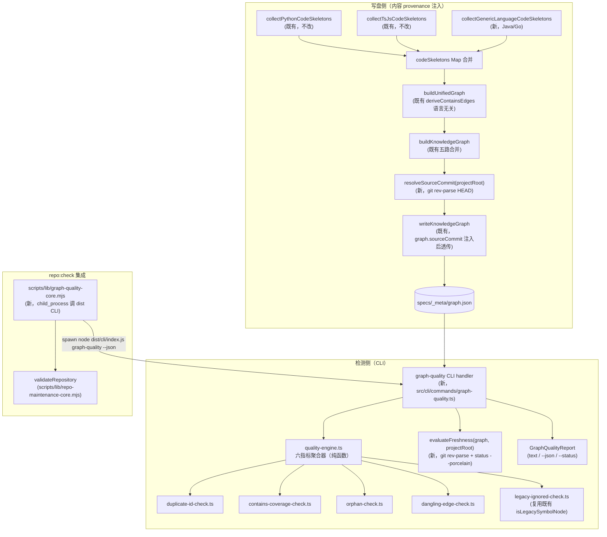
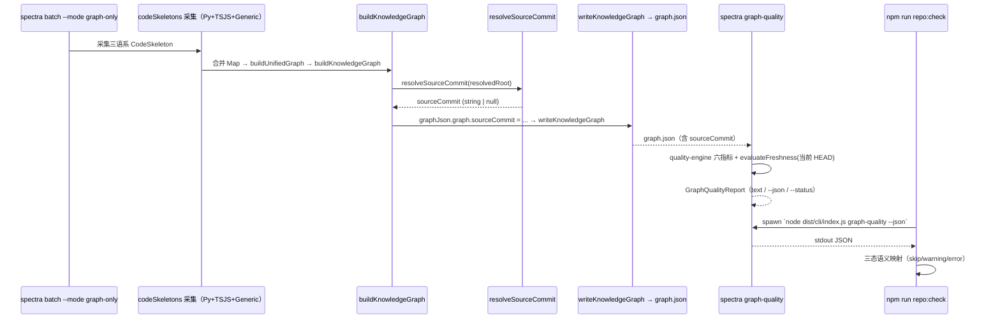

# 技术实现计划：图质量门机器化（Graph Quality Gates，F217）

**关联 spec**: `specs/217-graph-quality-gates/spec.md`（27 FR + 7 CONSTRAINT + 14 SC）
**关联调研**: `specs/217-graph-quality-gates/research/tech-research.md`
**关联决策历史**: `specs/217-graph-quality-gates/trace.md`（D1-D4 + Codex 审查处置）

---

## 0. Technical Context

| 维度 | 取值 |
|---|---|
| 语言/运行时 | TypeScript 5.x（编译到 `dist/`）+ Node.js 20.x+；`repo:check` 层为 ESM `.mjs` |
| 测试框架 | vitest（单元 `src/**/*.test.ts`、集成 `tests/integration/`、e2e `tests/e2e/`） |
| 检测对象 | `specs/_meta/graph.json`（GraphJSON，`src/panoramic/graph/graph-types.ts:145-189`），不触碰 UnifiedGraph zod schema、SnapshotWrapper |
| 新增外部依赖 | 无——git 交互复用 Node `child_process`（`resolveSourceCommit`/`evaluateFreshness` 用 `execFileSync` 跑 git 只读命令；`graph-quality-core.mjs` 调用 dist CLI 改用 `spawnSync`，见决策 4），不新增 npm 包 |
| CLI 范式 | 独立顶层子命令，形态照抄 `src/cli/commands/direction-audit.ts` |
| repo:check 集成 | `scripts/lib/repo-maintenance-core.mjs` 的 `validateRepository`，新增第 12 个子检查族 `graph-quality` |
| CONSTRAINT 硬约束 | 不动 `plugins/spec-driver/`；不新增 MCP 工具；不动 UnifiedGraph zod schema；不破坏 byte-stable；不与 F193/F214 既有职责重叠 |

---

## 1. 架构总览



| 层 | 文件 | 是否新增 |
|---|---|---|
| GraphJSON schema | `src/panoramic/graph/graph-types.ts` | 修改（+1 可选字段） |
| 采集扩展 | `src/batch/generic-language-skeleton-collector.ts` | **新增** |
| 采集扩展接入 | `src/batch/batch-orchestrator.ts` | 修改（3 处） |
| 节点 metadata 透传 | `src/knowledge-graph/index.ts` | 修改（`deriveNodesFromSkeletons`） |
| 节点 metadata 透传 | `src/panoramic/graph/graph-builder.ts` | 修改（UnifiedGraph 合并段，含 existing-node 分支补齐） |
| sourceCommit / freshness | `src/panoramic/graph/source-commit.ts` | **新增** |
| 六指标引擎 | `src/panoramic/graph/quality/*.ts`（8 文件） | **新增** |
| CLI 命令 | `src/cli/commands/graph-quality.ts` | **新增** |
| CLI 接入 | `src/cli/utils/parse-args.ts` / `src/cli/index.ts` | 修改 |
| 写盘注入点 | `src/cli/commands/graph.ts` | 修改（`community.ts` 确认零改动） |
| repo:check 薄封装 | `scripts/lib/graph-quality-core.mjs` | **新增** |
| repo:check 接入 | `scripts/lib/repo-maintenance-core.mjs` | 修改 |
| 契约 | `specs/217-graph-quality-gates/contracts/graph-quality-report.schema.json` | **新增** |
| Fixture | `tests/fixtures/graph-quality-{ts,java,go}*/`、`tests/fixtures/graph-quality-adversarial/` | **新增** |

---

## 2. 关键架构决策

### 决策 1：Java/Go 进 graph-only 链

**现状确认（本次读码新增证据）**：
- `extractSymbolNodes` 是 `PythonLanguageAdapter` **专有方法**（`grep` 全仓仅 `python-adapter.ts` + `batch-orchestrator.ts` 两处命中），**不是** `LanguageAdapter` 接口方法。这意味着 Python 特有的"第四路提取"双轨风险**不会在 Java/Go 扩展下复现**——Java/Go 符号节点只会经过单一路径（`codeSkeletons → buildUnifiedGraph → deriveContainsEdges`），不存在并行第二路产生重复/缺口的结构性可能。此前 research 提出的"开放问题 #2"在 Java/Go 侧被证伪（仅 Python 侧仍需保留观察，见风险清单）。
- `JavaLanguageAdapter` / `GoLanguageAdapter` 的 `analyzeFile` 均已透传 `extractCallSites` 选项（`java-adapter.ts:48-49`、`go-adapter.ts:42-43`），委托 `TreeSitterAnalyzer`，与 Python/TS-JS 适配器同构。
- `LanguageAdapterRegistry`（`src/adapters/language-adapter-registry.ts`）提供 `getAdapter(filePath)` O(1) 查找，但依赖 `bootstrapRuntime()` 完成注册；直接调用 `buildAstGraphOnly` 的测试路径若未跑 bootstrap，registry 为空，会静默产出零文件——**generic collector 因此不依赖 registry**（见下方裁定），仅 CLI 层已确定 bootstrap 完成的场景（如决策 2 例外分类的 `getAdapter` 查找）才复用它。

**裁定**：新增独立模块 `src/batch/generic-language-skeleton-collector.ts`，导出：

```ts
export async function collectGenericLanguageCodeSkeletons(
  projectRoot: string,
  adapters: readonly LanguageAdapter[] = [new JavaLanguageAdapter(), new GoLanguageAdapter()],
): Promise<Map<string, CodeSkeleton>>
```

**不经过 `LanguageAdapterRegistry`，直接实例化传入 adapter 集合**（默认 Java+Go，可选参数注入其他实例做测试替身）——与既有 `collectPythonCodeSkeletons`/`collectTsJsCodeSkeletons` 各自直接 `new` 自己的分析器对称，消除"直接调 `buildAstGraphOnly` 的测试没跑 `bootstrapRuntime` → registry 空 → 静默零文件"的隐藏前置（决策 1 现状确认已指出该风险）。

内部逻辑：① 遍历注入的 `adapters` 集合，用各自的 `extensions` 并集 + `defaultIgnoreDirs` 并集 + 通用忽略集（`node_modules/.git/dist/build` 等，与 `PY_SKELETON_IGNORE_DIRS`/`TSJS_SKELETON_IGNORE_DIRS` 对齐但不复用其常量，避免跨语言耦合）走自有 walk；② 复用共享 ignore oracle（`src/panoramic/graph/quality/ignore-oracle.ts`，见决策 2 增补，组合 `createGitignoreFilter` + 内置忽略目录集合）；③ 逐文件按扩展名匹配到对应 adapter，调用 `adapter.analyzeFile(filePath, { extractCallSites: true })`，单文件失败 `catch` 吞掉（与 Python/TS-JS 采集器 EC-14 兜底一致）。

**为何新起文件而非塞进 `batch-orchestrator.ts`**：milestone-M9 文档轨道 D 已把"拆解 2,561 行 `batch-orchestrator.ts`"列为待办；本 Feature 若继续往该文件里堆采集器函数，会与既定拆解方向背道而驰。新文件只需在 `batch-orchestrator.ts` 的两个采集点各插入 3 行调用（见下），符合"最小侵入"。

**为何不复用/不重构 Python/TS 现有 collector**：二者各自内嵌了语言特定的 import resolver（`resolvePythonImport`/`resolveTsJsImport`），把它们抽成"通用 collector + 语言插件"会牵动这两条已稳定、被大量测试覆盖的既有回归面，超出本 Feature 范围（out-of-scope 显式声明：不做 Java/Go 的 import resolution）。三个 collector（Python/TS-JS/Generic）并存、各自独立，是当前"零基思维"下职责最清晰的选择——Generic collector 本就没有需要与既有二者共享的语言特定逻辑。

**范围裁剪（写入 CONSTRAINT 级 out-of-scope）**：
- Java/Go **不实现** import resolution，`imports[].resolvedPath` 恒为 `null` → `deriveImportEdges` 对 Java/Go 不产生 `depends-on` 边（该函数要求 `resolvedPath` 非空才建边，具体判定逻辑属既有代码，不改动）。
- `calls` 边由 `resolveCalls` 按函数名启发式匹配，Java/Go 会"有多少算多少"，不保证完备。
- 六指标中 **不依赖** calls/depends-on 完备性的指标（duplicate-id / contains-coverage / dangling-edge / legacy-ignored 全部不依赖；orphan 依赖，但已按口径重新校准为"任意边 degree=0"，contains 边天然覆盖绝大多数非孤立符号）。

**受支持语义面（诚实声明，非本 Feature 修复项）**：Java `mapper` 只遍历顶层类型，nested class 在 `java-mapper.ts:391-425` 的 `default` 分支被丢弃，不进节点/不进任何指标分母；Go 缺 receiver 的 method 会被 `go-mapper.ts:154-175` 降级为独立 function 处理（不作为某 struct 的方法）。这是 mapper 既有边界，不在本 Feature 范围内修复——决策 6 的 fixture 合同据此显式避开这两类结构，避免 fixture 断言依赖尚未支持的语义面。

**(b) 自身图影响**：`tests/fixtures/multilang/java/*.java`（5 个）、`tests/fixtures/multilang/go/*.go`（5 个，含 `syntax-error.go`/`empty.go`）、`tests/fixtures/multilang-project/go-services/*.go`（2 个）、`tests/fixtures/multilang-project/src/services/helpers.go`（1 个）会在启用 Generic collector 后首次进入本仓库自身的 graph-only/full 输出。这与 Python/TS-JS 现有行为对称——`tests/fixtures/multilang-project/{scripts,src}/*.py`、`f214-mixed/**/*.ts` 等**当前已经**被 Python/TS-JS 采集器扫入自身图（无特殊排除规则），故此并非"新增一类风险"，而是既有行为在 Java/Go 上的对称延伸。仍需在里程碑 P4 做一次实测验证（详见风险清单 R3）。

**(c) full batch 主链同步策略**：`runBatch`（`batch-orchestrator.ts:414`）在 line 1283-1306 构建"早期 UnifiedGraph"，与 `buildAstGraphOnly`（line 2487-2561）的采集逻辑天然应保持口径一致（研究已确认二者共用 collector 是既定设计意图）。两处均改为：

```ts
const genericSkeletons = await collectGenericLanguageCodeSkeletons(resolvedRoot); // 默认 adapters = [Java, Go]
const codeSkeletons = new Map([...pythonSkeletons, ...tsJsSkeletons, ...genericSkeletons]);
```

不引入新的 `--languages` 过滤联动（当前 `--languages` 过滤逻辑作用于 spec 生成阶段，不作用于 unifiedGraph 采集——与既有 Python/TS-JS 行为一致，不新增语义）。

---

### 决策 2：指标引擎模块位置与形态

**裁定路径**：`src/panoramic/graph/quality/`（贴近 `graph-types.ts`/`graph-query.ts` 现有职责边界，六指标本质是 GraphJSON 消费者，与 `graph-query.ts` 的"读图判定"定位一致，但拆分独立子目录避免把 `graph-query.ts` 越撑越大）。

文件与签名草图：

```ts
// quality-types.ts —— GraphQualityReport 全套类型（对应 spec Key Entities）
export type CheckStatus = 'pass' | 'fail' | 'not-applicable';
export interface DuplicateCanonicalIdGroup { filePath: string; symbolName: string; kind: string; ids: string[]; }
export interface DanglingEdgeRecord { source: string; target: string; relation: string; }
export type OrphanExceptionCategory = 'entrypoint' | 'pure-type' | 'test-export';
export interface GraphFreshnessVerdict {
  state: 'fresh' | 'dirty' | 'stale' | 'unknown-provenance';
  recordedSourceCommit: string | null | undefined;
  currentHead: string | null; // null（非 git 仓库 / rev-parse 失败）一律判 unknown-provenance，绝不据此比较出 stale
  dirtyFiles?: string[];
}
export interface GraphQualityReport {
  graphPath: string; generatedAt: string; schemaVersion: string;
  duplicateCanonicalId: { status: 'pass' | 'fail'; groups: DuplicateCanonicalIdGroup[] };
  containsCoverage: { status: CheckStatus; total: number; covered: number; ratio: number | null; uncoveredIds: string[] };
  orphanRatio: {
    status: CheckStatus; totalSymbolNodes: number; rawOrphanCount: number;
    exemptedByCategory: Record<OrphanExceptionCategory, number>;
    offendingRatio: number | null; offendingIds: string[];
    allNodeZeroDegreeRatio: number; // 信息展示，不参与 pass/fail（FR-005）
  };
  danglingEdges: { status: 'pass' | 'fail'; edges: DanglingEdgeRecord[] };
  legacyAndIgnoredNodes: { status: 'pass' | 'fail'; legacyHashNodeIds: string[]; ignoredPathNodeIds: string[] };
  freshness: GraphFreshnessVerdict;
  overallVerdict: 'pass' | 'pass-with-warnings' | 'fail-strong-invariant' | 'cannot-assess'; // FR-012 四态；非强指标 fail（containsCoverage/orphanRatio/legacyAndIgnoredNodes/freshness.stale）→ pass-with-warnings，exit 仍为 0
  cannotAssessReason?: 'graph-missing' | 'json-parse-error' | 'schema-too-old';
  nextSteps: string[];
}

// duplicate-id-check.ts   —— FR-001/002：checkDuplicateCanonicalIds(graph: GraphJSON): GraphQualityReport['duplicateCanonicalId']
// contains-coverage-check.ts —— FR-003/004：checkContainsCoverage(graph): GraphQualityReport['containsCoverage']
// dangling-edge-check.ts  —— FR-006：checkDanglingEdges(graph): GraphQualityReport['danglingEdges']
// legacy-ignored-check.ts —— FR-007/008：checkLegacyAndIgnoredNodes(graph, isIgnored): GraphQualityReport['legacyAndIgnoredNodes']
//   复用既有 isLegacySymbolNode（graph-query.ts:178，已导出）判定 FR-007；FR-008 用注入的 isIgnored(relativePath) 判定（由 ignore-oracle.ts 提供）
// orphan-check.ts —— FR-005：checkOrphanRatio(graph, opts: { getTestPatterns }): GraphQualityReport['orphanRatio']
// ignore-oracle.ts —— FR-008：组合 createGitignoreFilter + 内置忽略目录集合，供 legacy-ignored-check.ts 与 generic collector 共用
// quality-engine.ts —— 聚合器：runGraphQualityChecks(graph, opts): Omit<GraphQualityReport, 'freshness'|'graphPath'|'generatedAt'|'overallVerdict'|'nextSteps'|'cannotAssessReason'|'schemaVersion'>
```

**六指标各判定函数均为纯函数**（`GraphJSON` + 注入的判定回调 in → 结构化结果 out，零 I/O），符合 CLAUDE.md「类型系统是第一道防线」与「单一职责」约定，也使单测无需 mock fs/child_process。I/O（gitignore 读取、语言适配器查找、git 交互）全部由 CLI 层准备好回调后注入，引擎本身不 import `fs`/`child_process`。

**共享 ignore oracle（FR-008，本次审查增补）**：现状 ignore 规则碎片化——`createGitignoreFilter`（`src/utils/file-scanner.ts:199`）只覆盖 `.gitignore` 内容；`file-scanner.ts` 内置的忽略目录集合（`node_modules`/`.git`/`dist`/`build` 等）是模块私有实现细节，未导出；Python/TS collector 各自另有一份忽略常量（`PY_SKELETON_IGNORE_DIRS`/`TSJS_SKELETON_IGNORE_DIRS`）。若 `legacy-ignored-check.ts` 的 `isIgnored` 回调只查 `.gitignore`，会漏判命中内置忽略目录（如 `dist/`）但未在 `.gitignore` 显式声明的节点——而 FR-008 要求覆盖"`.gitignore` / 内置 ignore 规则命中"两者，只查 `.gitignore` 会让检测矩阵假绿。

**裁定**：新增共享模块 `src/panoramic/graph/quality/ignore-oracle.ts`，组合 `createGitignoreFilter` + 从 `file-scanner.ts` 导出的内置忽略目录集合常量（需额外导出，见 §3 文件清单），对外提供单一 `isIgnoredPath(relativePath): boolean` 判定函数，供 CLI 层注入 `legacy-ignored-check.ts`；generic collector（决策 1）与本检测复用同一个 oracle，避免第三份规则来源。**不重构** Python/TS 既有 collector 的私有忽略常量（超出 scope、牵动稳定回归面）——改为新增一致性单测：断言 `PY_SKELETON_IGNORE_DIRS`/`TSJS_SKELETON_IGNORE_DIRS` ⊆ 共享 oracle 的内置集合，防止未来三处定义漂移。

**例外分类判定精度（回应"能判则判，不能判则诚实降级"的要求）**：
- **entrypoint**：路径级启发式，严格按 FR-005 字面枚举 `main.*` / `index.*` / `__init__.py`，不额外发明 Java/Go 专属规则（如 `Application.java` 不在此列——避免臆造未在 spec 中声明的规则）。
- **纯类型声明（interface/type）**：GraphJSON 层当前**不携带** `ExportKind`（research 已确认，`unifiedKind` 只到 `'symbol'` 粒度）。本 Feature 做**最小、合规的追加**：
  1. `knowledge-graph/index.ts::deriveNodesFromSkeletons` 在派生 symbol/member 节点时，`metadata` 增加 `exportKind: exp.kind`（symbol 节点）/ `memberKind: m.kind`（member 节点）——`UnifiedNodeSchema.metadata` 本就是 `z.record(z.string(), z.unknown())`（`unified-graph.ts:92`），新增 key **不触碰 zod schema 定义**，满足 CONSTRAINT-003。
  2. `graph-builder.ts` 的 UnifiedGraph→GraphNode 合并段**新节点分支**（当前已按同一模式透传 `callSitesCount`/`external`，见 `graph-builder.ts:363-381`）比照追加透传 `exportKind`/`memberKind` 到 `GraphNode.metadata`。
  3. `orphan-check.ts` 按 `metadata.exportKind === 'interface' | 'type'` 归类为 `pure-type` 例外。
  4. **（本次审查增补）** `graph-builder.ts` 的**既有节点合并分支**（`existing` 命中，`graph-builder.ts:355-361`，当前只合并 `callSitesCount`）改为同时补齐 `unifiedKind`/`sourcePath`/`exportKind`/`memberKind`，**不覆盖** extraction provenance 字段（如 Python `extractSymbolNodes` 写入的 `sourceTag: 'extraction'`/`sourceFile`/`symbolKind`）。**动机**：Python graph-only 链路里 `extractSymbolNodes` 先为顶层 function/class 写入节点（`sourceTag: 'extraction'`），随后 `buildUnifiedGraph` 对同 ID 节点走 `existing` 合并分支——若该分支不补 `unifiedKind`，这些节点在 `contains-coverage-check.ts`（依赖 `metadata.unifiedKind === 'symbol'` 判定分母）与 `orphan-check.ts`（同一字段）里不计入分母，导致 FR-003/FR-005 对 Python 顶层符号的判定矩阵假绿（分母缩水）。
  - 这是本计划中**唯一**对既有核心节点派生函数的改动，影响面已评估（见风险清单 R1）：新增 metadata key 不改变现有字段、不改变排序、不影响 byte-stable（`normalizeGraphForWrite` 不感知具体 key 内容）。
  - **snapshot 混合 metadata 策略**：`SnapshotWrapper`（`.spectra/unified-graph.json` 增量缓存）会长期保留无 `exportKind`/`memberKind` 的旧节点（incremental merge 原样保留旧 metadata，不做批量回填），本次改动**不 bump** SnapshotWrapper 版本。理由：图质量门只读 `specs/_meta/graph.json`，从不读 snapshot；`graph-only`/`batch` 全量模式每次都重新 `derive`，不复用 snapshot 里的旧节点 metadata。**禁止**下游任何逻辑依赖 snapshot 内该字段的存在性（风险清单已加 R7 记录）。
- **测试导出（test-export）**：不新写一套跨语言正则，**复用** `LanguageAdapter.getTestPatterns()`（`language-adapter.ts:172`，纯函数、零 I/O，各适配器已各自实现，返回 `{ filePattern: RegExp, testDirs: readonly string[] }`——非 glob）。匹配规则固化为：`filePattern.test(path.posix.basename(sourcePath))` **且** `testDirs` 同时匹配路径根前缀与路径中间任意段（如 `src/foo/__tests__/bar.ts` 命中 `testDirs` 含 `__tests__` 的场景）。CLI 层按节点 `sourcePath` 扩展名解析出对应 `LanguageAdapter`（用 `LanguageAdapterRegistry.getAdapter`——此处 CLI 层在命令入口已完成 `bootstrapRuntime()`，registry 非空，与决策 1 中 generic collector 刻意不依赖 registry 的场景不同），把 `getTestPatterns()` 结果通过回调注入 `orphan-check.ts`。查不到适配器（如扩展名未注册）时**保守失败**——不归为 test-export 例外，即计入超标分子（宁可"漏判 pass"也不"误判"，避免臆造）。

---

### 决策 3：freshness 判定的 git 交互与 sourceCommit 注入范围

**共享 helper**：新增 `src/panoramic/graph/source-commit.ts`：

```ts
/** 在 projectRoot 执行 git rev-parse HEAD；非 git 仓库 / 命令失败均返回 null，不抛异常（FR-009）。 */
export function resolveSourceCommit(projectRoot: string): string | null;

/** 与当前 HEAD 比对 + 工作树 dirty 判定，产出 FR-010 四态之一。 */
export function evaluateFreshness(
  recordedSourceCommit: string | null | undefined,
  projectRoot: string,
): GraphFreshnessVerdict;
```

- `resolveSourceCommit`：`execFileSync('git', ['rev-parse', 'HEAD'], { cwd: projectRoot, encoding: 'utf-8', stdio: ['ignore','pipe','ignore'] }).trim()`，catch 全部异常返回 `null`。detached HEAD 天然返回具体 SHA（`git rev-parse HEAD` 本身在 detached 状态下正常工作），无需特判（FR-009 edge case 天然满足）。
- **dirty 判定固化解析合同**：统一使用 `git status --porcelain=v1 -z --untracked-files=all`（`-z` NUL 分隔输出、`--untracked-files=all` 避免整目录折叠漏检，同族教训见 F204 CRITICAL-7）执行并解析；按 NUL 协议切分记录，每条记录前两列为 staged/unstaged 状态码，rename 记录（`R `/`RXXX` 前缀）同时提取旧路径与新路径两段（NUL 分隔的双路径）。过滤面按**源码扩展名**筛选（`.ts/.tsx/.js/.jsx/.py/.go/.java` ∪ 已注册适配器 `extensions`）——rename 检查新旧两路径任一命中即算 dirty，删除按旧路径触发。理由：spec 措辞是"工作树存在未提交的**源码文件**改动"（非任意文件），若不过滤，修改 `README.md`/`docs/*.md` 也会触发 `dirty` 提示，与"图内容是否可能过期"这一语义无关，是噪音而非信号。此解析逻辑与 `evaluateFreshness` 内联实现（无需暴露给引擎层，属于 CLI/写盘两侧共用的读写对称逻辑），测试覆盖 rename/删除/路径含空格/全新 untracked 目录四类场景（§5.1 `source-commit.test.ts`）。
- **CLI 侧 `--graph` 显式路径场景的 projectRoot 推导**：默认 `projectRoot = process.cwd()`；显式 `--graph <path>` 时不做路径反推，仍以 `process.cwd()` 作为 git 上下文（并在 `--help` 与命令输出中显式声明这一点）——反推 projectRoot 涉及猜测 `graph.json` 相对哪个仓库根，容易在多 worktree/嵌套仓库场景误判，显式声明 + cwd 语义比"智能推断"更安全可预测。该裁定同样排除了任何反推 `outputDir` 上层目录作为 projectRoot 的方案（无论是 CLI 查询侧还是 `graph.ts` 写盘侧，见下方裁定表第三行）——`outputDir` 只负责图产物落盘路径，不承担 git 上下文推导职责。

**写盘侧注入范围裁定（四个 `writeKnowledgeGraph` 调用点逐一裁定）**：

| 调用点 | 是否注入 sourceCommit | 理由 |
|---|---|---|
| `buildAstGraphOnly`（`batch-orchestrator.ts:2487`） | **是**，写盘前 `graphJson.graph.sourceCommit = resolveSourceCommit(resolvedRoot)` | 真实基于当前工作树 AST 内容重新生成 nodes/edges |
| `runBatch` 主写盘（`batch-orchestrator.ts:1631`） | **是**，同上，`projectRoot = resolvedRoot`（已在作用域内） | 同上 |
| `runGraphCommand`（`graph.ts:198`） | **否，显式写 `null`** | 该命令不解析源码（读缓存 architectureIR / 存量 spec / crossRefs 三路合并产出），若盖当前 HEAD 属于把旧内容伪造成"与当前 HEAD 一致"（provenance 伪造，spec FR-009 明确禁止）；`outputDir` 只负责落盘路径，不参与 git 上下文推导，无需反推 projectRoot。与 spec FR-009"非 AST 重建的写盘路径 MUST NOT 注入当前 HEAD"完全一致；门禁读取 `null` 后按 FR-010 判定为 `unknown-provenance`，是诚实降级而非缺陷 |
| `runCommunityCommand`（`community.ts:99`） | **否，零代码改动** | 该命令只读取既有 `graphJson`（`JSON.parse`）并 patch `node.metadata.community` 字段，从未触碰 `graphJson.graph`。若原图已有 `sourceCommit`，该字段随对象引用**自然透传**到 `writeKnowledgeGraph` 调用；若原图没有该字段，也不应凭空补上（社区分析不重新解析源码，无法证明内容与当前 HEAD 的关系）。**这是本计划中"透传优于重算"的唯一实例**，故意不做任何改动，避免产生"内容未变但字段显示为最新"的假新鲜信号 |

---

### 决策 4：repo:check 复用链路（FR-020）

**裁定**：child_process 方案（研究选项 a），新增 `scripts/lib/graph-quality-core.mjs`：

```js
export async function validateGraphQuality({ projectRoot }) {
  // 1. graph.json 不存在 → 优雅跳过（FR-017），不 spawn
  // 2. dist/cli/index.js 不存在 → warning（"图质量检测器未构建，npm run build 后重验"），不 spawn（决策 4 降级语义，理由见下）
  // 3. spawnSync('node', [distCliPath, 'graph-quality', '--json', '--graph', graphJsonPath], { cwd: projectRoot, encoding: 'utf-8' })
  //    —— 不用 execFileSync：CLI 合同是"输出 JSON 后以 exit 1/2 表达强不变量违反/无法评估"，execFileSync 遇非零 exit 直接 throw
  //    （stdout 被裹进 error 对象），会让本应识别的强失败被静默吞掉/误判。spawnSync 无论 status 0/1/2 均先取 stdout。
  //    - JSON.parse(result.stdout) 失败（含进程异常退出但 stdout 仍非法）→ warning（归入 FR-027 同类"无法评估"处理，
  //      涵盖 JSON 损坏 + schemaVersion 过旧两种 exit-2 场景，二者对 repo:check 语义等价）
  //    - 解析成功后交叉校验 result.status 与 report.overallVerdict 是否一致（如 status===1 但 overallVerdict!=='fail-strong-invariant'）
  //      → 不一致视为检测器自身 bug，降级为 warning（不信任不一致的信号，不放大为 error）
  //    - report.overallVerdict === 'fail-strong-invariant' → error（duplicate-id / dangling-edge 任一 fail，对应 status===1）
  //    - report.containsCoverage.status/orphanRatio.status/legacyAndIgnoredNodes 任一 fail → warning
  //    - report.freshness.state === 'stale' → warning；'dirty' 不产生 warning（FR-026）
  // 4. 返回 { warnings, errors, checks }（六个粒度 checks 条目，namespace 前缀 'graph-quality'）
}
```

**选型理由**（对比研究列出的三选项）：
- 排除 (c)（scripts 层重写判定逻辑）：直接违反 FR-020"避免重复实现"。
- (a) child_process spawn dist CLI vs (b) scripts 层直接 `import` dist 编译产物：选 (a)。原因：
  1. `repo-maintenance-core.mjs` 已有 `child_process` 调用外部命令的既定先例（`runSpecDriverCodexInstall` 调 `bash codex-skills.sh` 用 `execFileSync`），架构方向一致；但本调用点因需要在非零 exit（status 1/2）时仍读取 `stdout` 做结构化判定——`execFileSync` 遇非零 exit 直接 `throw`（`stdout` 被裹进 `error.stdout`，容易被 catch 分支静默吞掉）——故改用同一 `child_process` 家族的 `spawnSync`，语义更贴合"先看 exit code + stdout 再判定"的检测器契约，不引入新的 IPC 机制；
  2. (a) 复用的是"用户实际会跑的同一条命令"，测试 (a) 等于端到端验证 CLI 契约本身，规避"scripts 层直接 import dist 内部 API，CLI 层却另有一套薄封装，两者可能悄悄漂移"的双维护面；
  3. (b) 需要 scripts（ESM `.mjs`，Node 原生模块解析）稳定 import `dist/panoramic/graph/quality/*.js` 的内部路径，一旦这些模块被后续重构挪位置，scripts 层会静默失联（无编译期报错，因为 `.mjs` 不过 `tsc` 类型检查）——(a) 只依赖 `dist/cli/index.js` 这一个稳定入口 + `graph-quality --json` 这一个公开契约，边界更硬。

**降级语义（graph.json 存在但 dist 未构建）**：**warning**（新增 `checks` 条目 `status: 'warning'`，提示文案"图质量检测器未构建，`npm run build` 后重验"），不再是优雅跳过。**修订理由**（原"静默 skip"方案已作废）：`npm run repo:check` 不会自动触发 `build`，而 `package.json` 现有 `prepublishOnly` 顺序是 `release:check && repo:check && build && vitest`——`repo:check` 排在 `build` 之前执行，是本仓库最常见/最关键的发布前校验链路；若 dist 缺失时静默 skip，图质量门在这条最常用链路上形同虚设（永远因为 dist 还没 build 出来而被跳过，永远没有机会真正跑到检测逻辑）。因此改为 warning——同时联动调整 `prepublishOnly` 顺序为 `build` 先于 `repo:check`（见 §3 文件清单 `package.json` 一行），从根上让发布链路里 dist 先于 repo:check 就绪，warning 只作为"手动跑 `repo:check` 且未提前 build"场景的兜底提示。**graph.json 本身缺失**（图未生成）仍维持优雅跳过不变（FR-017 明确要求，理由不同：未建图是"还没到检测这一步"，与"检测器不可用"是两类信号）。

---

### 决策 5：schemaVersion 处置

**裁定**：`graph.schemaVersion` **不 bump**，维持 `'1.0' | '2.0'` 联合类型不变，`sourceCommit?: string | null` 作为纯可选新增字段挂在 `graph-types.ts:151-179` 的 `graph` 对象上。

**理由**：
- 参照 F214 先例——UnifiedGraph 层（`UNIFIED_GRAPH_SCHEMA_VERSION`）曾因 canonical ID 格式变更（破坏性、影响下游解析逻辑）而 bump；GraphJSON 层（`schemaVersion: '2.0'`）当时**未**联动 bump，因为消费方对新增可选字段的兼容处理方式是"不存在则按未知处理"，不需要版本号做区分。
- 本次新增字段同样是**纯可选、向后兼容**：旧版本消费方（未升级的 MCP 工具/CLI）读到无此字段的图，`sourceCommit` 为 `undefined`，spec 已明确此即 `unknown-provenance`（FR-010 edge case），是一等公民语义，不是异常。
- FR-016 的"schemaVersion 过旧"判定依据的是**结构性不兼容**（如旧图缺 `links`/`nodes` 基础字段、或未来某天真的出现破坏性变更），当前最低支持版本判定逻辑（`schemaVersion < '2.0'` 时给出降级提示）与本字段增减无关，故无需为本字段单独设一个 `'2.1'` 分支。

---

### 决策 6：四语言 fixture 布局

**核心澄清（解决 FR-022 文本表面矛盾）**：spec FR-022 原文"TS/JS 复用 F215 已有的 in-repo pinned fixture**机制**"中的"机制"指**方法论/SOP**（校验源 commit → 只读拷贝 → `batch --mode graph-only` → 冻结拷贝入库），而非字面复用 `micrograd-baseline-graph/graph.json` 这一份内容——该 fixture 内容是纯 Python，无法充当 TS/JS 语言角色。四语言各自的 fixture 载体裁定如下：

| 语言 | 载体 | 来源 | skip 语义 |
|---|---|---|---|
| Python | 复用既有 `tests/fixtures/micrograd-baseline-graph/`（33 节点/37 边，已验证规模充分） | 外部 clone（`~/.spectra-baselines/micrograd`） | `MICROGRAD_SOURCE` 环境变量控制，缺失时 skip（沿用 F215） |
| TS/JS | **新增** `tests/fixtures/graph-quality-ts/`（源码，in-repo）+ `tests/fixtures/graph-quality-ts-graph/graph.json`（pinned，in-repo） | 无需外部 clone——源码本身就在仓库里提交 | **无 skip 语义，恒实跑**（比 micrograd 模式更强） |
| Java | **新增** `tests/fixtures/graph-quality-java/` + `tests/fixtures/graph-quality-java-graph/graph.json` | 同上，in-repo | 恒实跑 |
| Go | **新增** `tests/fixtures/graph-quality-go/` + `tests/fixtures/graph-quality-go-graph/graph.json` | 同上，in-repo | 恒实跑 |

**为何不复用 `tests/fixtures/multilang-project/go-services/`**：该目录当前服务于其他既有测试（跨包依赖分析等），其内容/结构由那些测试的既有断言锁定。为 F217 六指标断言（需要"刻意设计出至少一个 contains 覆盖充分、至少一个可能触发 orphan 边界"的结构）复用会产生两组测试对同一 fixture 的隐性耦合——任一方修改 fixture 都可能悄悄破坏另一方。新建独立 `graph-quality-go/` 是更清晰的职责边界（零基思维：新职责配新目录，不共享可变状态，符合测试规范"避免测试间共享可变状态"）。

**逐语言 fixture 合同表**（不再用"统一规模基准"笼统概括——Java 顶层结构只支持 class/interface/enum/record（无自由函数），Go 无 class，若强套同一模板会与语言自身语法能力冲突）：

| 语言 | 顶层结构要求 | 备注 |
|---|---|---|
| TS/JS | ≥1 个 module 级自由函数 + ≥1 个 class（含 ≥2 member）+ ≥1 个 interface + ≥1 个 type 声明 | class 内方法间至少 1 条可被 AST 解析的调用关系，驱动 `calls` 边非空 |
| Java | ≥1 个 class（含 ≥2 method）+ ≥1 个 interface + ≥1 个 enum 或 record | 无自由函数（避开决策 1 增补"受支持语义面"已声明的 nested class 边界，顶层类型即可） |
| Go | ≥1 个 package 级 func + ≥1 个 struct（含 ≥1 个 receiver method）+ ≥1 个 interface + ≥1 个 type alias | 避开决策 1 增补已声明的"缺 receiver method 降级独立 function"边界，receiver 必须显式声明 |

每语言均含 ≥1 个测试文件（符合对应 `LanguageAdapter.getTestPatterns()`），用于覆盖含测试文件的常规场景（例外分类断言本身改在下方对抗 fixture 独立验证，见下）。**期望指标值人工推导**（SC-002 强制要求）：每个 fixture 目录配一份 README，逐条列出"N 个 symbol 节点、预期 contains 覆盖率、预期 orphan 数"，测试断言直接引用这些手推数值，禁止"仅断言与上次运行结果 deepEqual"的弱断言。

**orphan 豁免例外分类断言移出正常 fixture**：生产建图链路（`deriveContainsEdges`）会给所有 export/member 节点建立 contains 边——这意味着正常 fixture 里的 interface、测试导出等节点天然 degree≥1，永远不会落入 orphan 候选集合，豁免分类逻辑（entrypoint/pure-type/test-export）在正常四语言矩阵测试中根本不会被触发，若断言写在正常 fixture 里就是"写了但从未真正执行"的假覆盖。**裁定**：豁免分类断言全部移到手工构造的 JSON 级对抗 fixture（见下），用真正 zero-degree 的节点驱动。

**对抗注入 fixture（独立第二套，SC-003~SC-009 + 豁免分类专项）**：`tests/fixtures/graph-quality-adversarial/` 下 10 个手工构造的最小 GraphJSON：原 7 个（`duplicate-canonical-id.json`/`dangling-edge.json`/`ignored-path-node.json`/`legacy-hash-node.json`/`stale-commit.json`/`coverage-gap.json`/`orphan-excess.json`）+ 新增 3 个豁免分类专项（`pure-type-orphan.json`/`test-export-orphan.json`/`entrypoint-orphan.json`，每个构造 zero-degree 节点 + 对应豁免特征字段，验证豁免分子归类与计数逻辑本身，回应上方"豁免分类断言移出正常 fixture"）。每个只包含触发对应指标 fail 所需的最小节点/边集合（不基于真实建图产出，直接手写 JSON 字面量，语言无关）。`stale-commit.json` 的对抗测试**不依赖测试进程自身 cwd 所在仓库的真实 HEAD**（避免因主仓库提交历史变化导致测试隐性 flaky）——测试用例内用 `mkdtemp` + `git init` + 1 次 commit 构造一个隔离的临时 git 仓库，取其 HEAD 作为"当前"，再用一个固定不可能存在的 SHA（如全 `f` 的 40 位十六进制串）写入 fixture 的 `graph.sourceCommit`，以该临时仓库路径为 `--graph`/cwd 跑真实 `graph-quality` CLI，断言 `stale` 判定成立。

---

### 决策 7：`--status` 轻量模式

**裁定：纳入 MVP**（FR-013 虽为 SHOULD，仍实现）。实现成本低——`quality-engine.ts` 的聚合结果已经算出全部字段，`--status` 只是 CLI 层输出格式化时的字段裁剪（`{ graphExists, freshness: verdict.state, overallVerdict }` 三字段），其中 `overallVerdict` 完整保留四态（`pass`/`pass-with-warnings`/`fail-strong-invariant`/`cannot-assess`，不做进一步裁剪坍缩为二元 pass/fail——否则 `pass-with-warnings` 场景会被 `--status` 静默抹平成无修饰的 `pass`，违反 FR-012 对该状态的显式要求），不需要单独跑一遍轻量检测逻辑，不存在"维护两套判定路径"的额外成本，符合"能带来价值且成本可控就做"的取舍。

---

## 3. 文件级改动清单

### 新增文件

| 文件 | 职责（一句话） | 预估行数 |
|---|---|---|
| `src/panoramic/graph/quality/quality-types.ts` | GraphQualityReport 全套类型定义（对应 spec Key Entities） | ~90 |
| `src/panoramic/graph/quality/duplicate-id-check.ts` | FR-001/002：语义三元组归一化 + 分组检出重复 canonical ID | ~70 |
| `src/panoramic/graph/quality/contains-coverage-check.ts` | FR-003/004：symbol 节点 contains 入边覆盖率计算 | ~50 |
| `src/panoramic/graph/quality/dangling-edge-check.ts` | FR-006：edge source/target 存在性校验 | ~40 |
| `src/panoramic/graph/quality/legacy-ignored-check.ts` | FR-007/008：复用 `isLegacySymbolNode` + 注入 `isIgnored` 判定 ignored 路径节点 | ~60 |
| `src/panoramic/graph/quality/orphan-check.ts` | FR-005：degree=0 判定 + 三类例外分类 + 双口径（超标分子/全节点 zero-degree） | ~150 |
| `src/panoramic/graph/quality/ignore-oracle.ts` | 共享 ignore 判定：组合 `createGitignoreFilter` + 内置忽略目录集合，供 generic collector 与 `legacy-ignored-check.ts` 复用（决策 2 增补） | ~40 |
| `src/panoramic/graph/quality/quality-engine.ts` | 六指标聚合器，纯函数装配 | ~90 |
| `src/panoramic/graph/source-commit.ts` | git rev-parse HEAD 注入 + freshness 四态判定（唯一含 `child_process` 调用的模块） | ~90 |
| `src/batch/generic-language-skeleton-collector.ts` | Java/Go（及未来新语言）通用 CodeSkeleton 采集器，直接实例化 adapter（不依赖 `LanguageAdapterRegistry`，决策 1 增补） | ~110 |
| `src/cli/commands/graph-quality.ts` | CLI handler：读图 → 聚合六指标 + freshness → 格式化输出 → exit code | ~260 |
| `scripts/lib/graph-quality-core.mjs` | repo:check 薄封装：child_process 调 dist CLI，三态语义映射 | ~110 |
| `specs/217-graph-quality-gates/contracts/graph-quality-report.schema.json` | `--json` 输出结构的 JSON Schema 契约 | ~120 |

### 修改文件

| 文件 | 改动点 | 预估行数 |
|---|---|---|
| `src/panoramic/graph/graph-types.ts` | `graph.*` 新增 `sourceCommit?: string \| null` | +3 |
| `src/knowledge-graph/index.ts` | `deriveNodesFromSkeletons` 新增 `metadata.exportKind`/`memberKind` 透传 | +6 |
| `src/panoramic/graph/graph-builder.ts` | UnifiedGraph→GraphNode 合并段：新节点分支追加 `exportKind`/`memberKind` metadata 透传（比照既有 `callSitesCount` 模式）；**既有节点合并分支同步补齐 `unifiedKind`/`sourcePath`/`exportKind`/`memberKind`**（决策 2 增补 4，修复 Python 顶层 symbol 分母缺口，不覆盖 extraction provenance 字段） | +14 |
| `src/batch/batch-orchestrator.ts` | ① `collectGenericLanguageCodeSkeletons` 接入 `runBatch` 早期 UnifiedGraph 段（line ~1285）；② 接入 `buildAstGraphOnly`（line ~2501）；③ 两处写盘前注入 `sourceCommit` | +20 |
| `src/cli/commands/graph.ts` | 写盘前显式写入 `sourceCommit: null`（不解析源码，不调用 git，符合 FR-009 非 AST 重建路径约束；无需反推 projectRoot） | +2 |
| `src/cli/utils/parse-args.ts` | `subcommand` 联合新增 `'graph-quality'` + 5 个新字段（`graphQualityGraph`/`graphQualityJson`/`graphQualityStatus`/`graphQualityOutput`/`graphQualityFormat`） | +15 |
| `src/cli/index.ts` | import + switch dispatch + HELP_TEXT 追加一行 | +6 |
| `src/utils/file-scanner.ts` | 导出内置忽略目录集合常量（供 `ignore-oracle.ts` 复用，决策 2 增补） | +4 |
| `scripts/lib/repo-maintenance-core.mjs` | import `validateGraphQuality` + `aggregateValidation('graph-quality', ...)` 调用 | +8 |
| `package.json` | `prepublishOnly` 顺序调整为 `build` 先于 `repo:check`（决策 4 修订：`release:check && npm run build && npm run repo:check && npx vitest run`，让发布链路里图质量门禁真实生效） | +0（脚本行 reorder） |

### 不改动（明确确认）

- `src/cli/commands/community.ts`（决策 3 已论证零改动）
- `src/panoramic/graph/graph-query.ts`（`assertGraphFormatNotStale` 保持原职责，CONSTRAINT-006）
- `src/knowledge-graph/unified-graph.ts`（zod schema 定义本身不改，只是 `metadata` record 内新增 key，CONSTRAINT-003）
- `scripts/graph-semantic-diff.mjs`（保持独立脚本，不重构进新引擎，避免扩大 scope）

---

## 4. 数据流：三段



三段职责边界：
1. **建图注入**（写盘侧）：只有真正基于当前工作树内容重新生成图的路径（`buildAstGraphOnly`、`runBatch` 主链）才计算并写入 `sourceCommit`；`runGraphCommand` 虽然是独立的建图写盘动作，但因不解析源码，MUST 显式写 `null`（provenance 诚实降级，而非计算/继承）；只读 patch 路径（`runCommunityCommand`）保持透传。
2. **CLI 读取判定**：`graph-quality` 命令是唯一读取 `graph.sourceCommit` 并与当前 HEAD 比对的地方，产出完整 `GraphQualityReport`（含四态 freshness）。
3. **repo:check 消费**：不重新判定，只 spawn CLI 拿 `--json` 结果做三态语义路由（skip/warning/error），零重复实现。

---

## 5. 测试策略

### 5.1 单元测试（纯函数，vitest，`src/panoramic/graph/quality/*.test.ts`）
- 每个 check 函数独立测试文件，覆盖：pass 场景、fail 场景（各自的问题清单精确性）、`not-applicable`（分母为 0）边界。
- `orphan-check.test.ts`：三类例外分类各自独立断言 + 全部命中导致"超标分子=0"边界（spec edge case）+ `allNodeZeroDegreeRatio` 信息展示字段独立断言（不影响 pass/fail）。
- `quality-engine.test.ts`：聚合器正确装配六项 + `overallVerdict` 四态映射正确性（strong invariant fail 优先于 pass-with-warnings，pass-with-warnings 优先于无修饰 pass）。
- `source-commit.test.ts`：mock `child_process.execFileSync` 覆盖 git 成功/非 git 仓库/命令报错三分支；`evaluateFreshness` 四态覆盖（用临时 git 仓库 `execFileSync('git', ['init'...])` 真实跑，而非全 mock，确保与真实 git 行为不漂移）；`porcelain=v1 -z --untracked-files=all` 解析覆盖 rename/删除/路径含空格/全新 untracked 目录四类场景。
- `ignore-oracle.test.ts`：断言 `PY_SKELETON_IGNORE_DIRS`/`TSJS_SKELETON_IGNORE_DIRS` ⊆ 共享内置忽略集合；`isIgnoredPath` 对 `.gitignore` 命中路径与内置忽略目录命中路径均返回 true。
- `generic-language-skeleton-collector.test.ts`：用 `tests/fixtures/graph-quality-java/`、`graph-quality-go/` 真实跑，断言文件发现数量、单文件解析失败不影响整体（构造一个语法错误文件）；直接实例化 adapter 场景下不依赖 `bootstrapRuntime()`。

### 5.2 对抗注入 fixture 测试（`tests/integration/graph-quality-adversarial.test.ts`）
- 10 个 `tests/fixtures/graph-quality-adversarial/*.json` 逐一跑 `graph-quality` CLI（或直接调 `quality-engine`）：原 7 个断言 SC-003~SC-009 的 100% 检出率 + 精确定位信息（三元组/edge source-target-relation 字符串完全匹配，而非仅数量断言）；新增 3 个豁免分类专项（`pure-type-orphan.json`/`test-export-orphan.json`/`entrypoint-orphan.json`）断言 `orphanRatio.exemptedByCategory` 对应分类计数精确归位（决策 6 增补，回应"正常 fixture 无法触发豁免逻辑"）。

### 5.3 四语言矩阵测试（`tests/integration/graph-quality-lang-matrix.test.ts`）
- Python：复用既有 `MICROGRAD_SOURCE` skip 门槛 + 顶层 function/class 分母精确断言（依据 micrograd 源码手推的具体数值，验证决策 2 增补 4 的 `graph-builder.ts` existing-node 合并分支修复生效，而非仅断言测试整体不崩溃）。
- TS/JS/Java/Go：三个新 fixture（各自遵循决策 6 逐语言 fixture 合同表），恒实跑，断言值来自各自 README 人工推导表格（SC-002 强制）；**只验证生产链结构指标**（symbol 节点数、contains 覆盖率、无豁免分类的正常场景 pass/fail），orphan 豁免分类断言不在此测试文件覆盖范围（已移至 5.2 对抗 fixture）。

### 5.4 CLI 端到端测试（`tests/integration/graph-quality-cli.test.ts`）
- exit code 矩阵：0（全 pass）/ 1（强不变量违反）/ 2（graph 缺失、JSON 损坏、schemaVersion 过旧）三档，逐一构造对应输入验证。
- `--json` / `--status` / text 三种输出格式的字段完整性。
- `dirty` 态验证（SC-014 前半）：构造临时 git 仓库 + 未提交改动，断言 CLI 输出含 dirty 提示。

### 5.5 repo:check 集成测试（`tests/unit/graph-quality-core.test.ts`，仿照 `tests/unit/codex-plugin-consistency-core.test.ts` 结构）
- SC-012 四态场景各自独立用例：graph 缺失→skip；JSON 损坏→warning；强不变量违反→error（阻断）；非强不变量问题→warning（不阻断）。
- `spawnSync` 真实覆盖 exit 1（强不变量违反）与 exit 2（无法评估）两条分支——不能只 mock 返回值，须构造真实触发这两个 exit code 的 `--graph` 输入，跑真实 dist CLI 子进程，断言 `graph-quality-core.mjs` 对非零 exit 仍正确解析出 stdout JSON（验证决策 4 从 `execFileSync` 改 `spawnSync` 的动机成立）。
- SC-014 后半：dirty 态下 `repo:check` 不产生 warning（mock `validateGraphQuality` 输入 freshness=dirty 的 report，断言零 warning）。
- 新增 `dist/cli/index.js` 缺失场景 → warning（决策 4 降级语义修订，断言 warning 文案含"未构建"/"`npm run build`"提示）。

### 5.6 e2e Fixture 重生成影响面（micrograd-baseline-graph 重生成后须复核的消费文件）
本 Feature 不直接修改 `deriveContainsEdges`/canonical ID 格式，但**新增了 `sourceCommit` 字段和 `exportKind`/`memberKind` metadata 字段**，micrograd fixture 若在实现完成后按 SOP 重新生成一次（验证 P1/P2 决策落地正确性），以下 7 个消费文件需按 F215 README "再生步骤"逐文件核对（不能只看 pass count）：
1. `tests/integration/mcp-server-stdio.test.ts`
2. `tests/integration/agent-context-real-graph.test.ts`
3. `tests/e2e/feature-180-graph-tools.e2e.test.ts`
4. `tests/e2e/feature-180-file-nav-stdio.e2e.test.ts`
5. `tests/e2e/feature-180-symbol-chain.e2e.test.ts`
6. `tests/e2e/feature-184-view-file-fuzzy.e2e.test.ts`（+ `feature-180-telemetry.e2e.test.ts`，README 提及的第 6 个消费方之一）
7. `tests/integration/graph-mcp-snapshot.test.ts`（self-dogfood 图 snapshot：启用 Generic collector 后，`graph_god_nodes` top=5 等排名类断言会因 Java/Go fixture 文件（决策 1(b) 自身图影响清单）新进入图而发生变化，须重新核对预期值而非直接判定为回归）

**注**：由于新增字段均为**可选新增**（`sourceCommit`/`exportKind`/`memberKind`），micrograd fixture 从只读 clone（`.git` 被 rsync 排除）生成，`sourceCommit` 恒为 `null`（CONSTRAINT-002 已知约束），预期前 6 个文件的既有断言**不需要修改**——只是节点 `metadata` 里多出 `exportKind` 字段，若这些测试对 `metadata` 做了穷举式深度比较（而非按需取字段）才会受影响，需逐文件确认比较方式；第 7 个文件涉及自身仓库图（非 micrograd），Java/Go 新增文件会实际改变节点/边计数，须单独核对预期值。

### 5.7 现有测试回归影响评估
- 全量 `npx vitest run`（当前基线 5145+ 用例零失败）必须保持零失败。
- `deriveNodesFromSkeletons`/`graph-builder.ts` 改动影响面用 `mcp__plugin_spectra_spectra__impact`（downstream，depth=3）复核一次实际调用方数量，确认改动前评估的"仅新增 metadata key、不改变现有字段/排序"结论未遗漏隐藏调用方。
- `batch-orchestrator-incremental.test.ts` 已知偶发并行 flaky（非本次改动引入，隔离重跑验证）。

---

## 6. C2（drift repo:check 集成）扩展位设计（FR-021）

不新建抽象层/插件系统（避免过度工程——FR-021 是 SHOULD，且当前只有一个消费者）。**约定**：未来 M9 轨道 C 的 spec drift 检测若要接入 `repo:check`，遵循与 `graph-quality` 完全一致的三段式契约：

1. 提供一个 `scripts/lib/<feature>-core.mjs`，导出 `async function validate<Feature>({ projectRoot }): Promise<{ warnings: string[], errors: string[], checks: CheckEntry[] }>`（与现有 11 个子检查族同一函数签名约定）。
2. 该函数内部若需要读取"某个已构建产物是否存在"→ 缺失时优雅跳过（`checks` 里放 `status:'skip'` 条目，`warnings`/`errors` 留空）；产物存在但内容不可信/损坏 → warning；产物证明了代码级强不变量违反 → error。这正是 `graph-quality-core.mjs` 已经落地的三态语义模板，drift 检测可直接照抄决策 4 的分支结构。
3. 在 `repo-maintenance-core.mjs::validateRepository` 中新增一行 `aggregateValidation('spec-drift', await validateSpecDrift({...}), warnings, errors, checks);`，与 `graph-quality` 并列，不需要改动 `aggregateValidation` 本身。

本 Feature 交付物中即为这一约定提供了唯一具体范例（`graph-quality-core.mjs`），无需额外抽象代码。

---

## 7. 风险清单

| ID | 风险 | 影响 | 缓解 |
|---|---|---|---|
| R1 | `deriveNodesFromSkeletons`/`graph-builder.ts` 是被 Python/TS-JS/Java/Go 四语言、batch/graph-only/community 多条链路共享的核心函数，新增 metadata key 若引入非预期副作用会有较大爆炸半径 | 中 | 改动仅"新增 key"，不修改现有字段/控制流；`impact`（downstream, depth=3）复核调用方；全量 vitest + micrograd fixture 重生成后逐文件核对（5.6/5.7） |
| R2 | Python "第四路提取"双轨 contains 风险是否在 Java/Go 扩展下复现 | 低（已在决策 1 论证为**不复现**——`extractSymbolNodes` 是 Python 专有方法，Java/Go 无并行第二路） | P1 阶段仍需针对本仓库真实 Java/Go fixture 跑一次 contains 覆盖率实测，作为该论证的实证复核（不能只靠代码阅读结论） |
| R3 | 启用 Generic collector 后，本仓库自身 graph-only/full 输出会新增 `tests/fixtures/multilang/{java,go}/*`、`multilang-project/go-services/*.go`、`multilang-project/src/services/helpers.go` 等既有测试样本文件产生的节点（含 `syntax-error.go`/`empty.go`/`empty.java` 等边界样本），可能引入意外 orphan / 影响 SC-001（自身仓库六指标全绿） | 中 | 不做特殊排除（与 Python/TS-JS 既有对称行为一致，避免双标）；P4 里程碑显式执行一次自身仓库 `graph-quality` 实测，若确有指标劣化需具体分析（新增合法测试导出例外 vs. 真实遗漏），不得为了"让指标好看"而伪造豁免规则 |
| R4 | 四语言 fixture 新增体量较大（3 个新 mini 项目 + 对应 pinned graph.json + 10 个对抗 fixture），review 与验证成本高 | 中 | 里程碑 P3 单独收口，逐 fixture 配 README 人工推导表格（决策 6 已定），避免"生成后不核对直接入库" |
| R5 | `scripts/lib/graph-quality-core.mjs` spawn `dist/cli/index.js` 依赖构建产物；决策 4 修订后 dist 缺失降级为 warning（非 skip），若本地/CI 顺序把 `repo:check` 排在 `build` 之前，会在每次未构建时看到该 warning | 低 | `package.json` `prepublishOnly` 已联动调整为 `build` 先于 `repo:check`（§3 文件清单）；CI workflow 中 `repo:check` 步骤同样惯例排在 `npm run build` 之后；本地手跑顺序不对时该 warning 是预期提示而非误报 |
| R6 | `git status --porcelain` 源码扩展名过滤面若与实际项目结构不匹配（如自定义扩展名语言），可能漏判/误判 dirty | 低 | 过滤面基于已注册 `LanguageAdapterRegistry` 扩展名动态计算（非硬编码列表），新语言适配器注册后自动纳入过滤面 |
| R7 | `SnapshotWrapper`（`.spectra/unified-graph.json` 增量缓存）里长期保留无 `exportKind`/`memberKind` 的旧节点（不 bump 版本，见决策 2 snapshot 混合 metadata 策略），若未来有代码误读 snapshot 节点 metadata 做 orphan 例外判定会得到不一致结果 | 低 | 图质量门只读 `specs/_meta/graph.json`，从不读 snapshot；本风险仅在假设的未来误用场景下成立，本 Feature 不引入该误用路径，此处仅作显式记录防止后续开发者踩坑 |

---

## 8. 里程碑切分

| Phase | 范围 | 验证点 |
|---|---|---|
| **P1** 指标引擎 + sourceCommit 基座 + generic collector | `quality-types.ts` + 6 个 check 函数 + `ignore-oracle.ts` + `quality-engine.ts` + `source-commit.ts`；`graph-types.ts` schema 扩展；`deriveNodesFromSkeletons`/`graph-builder.ts` metadata 透传（含 existing-node 合并分支补齐）；3 个写盘点注入；`generic-language-skeleton-collector.ts`（Java/Go 采集器，直接实例化 adapter，不依赖 registry） | 单元测试全绿（决策 1 R2 的 contains 双轨实证复核在此阶段用真实 Java/Go 小样本跑一次）；`npm run build` 零错误 |
| **P2** CLI + repo:check 集成 | `graph-quality.ts` CLI handler + `parse-args.ts`/`index.ts` 接入；`graph-quality-core.mjs` + `repo-maintenance-core.mjs` 接入；`package.json` `prepublishOnly` 顺序调整；契约 JSON Schema | CLI exit code 矩阵测试全绿；repo:check SC-012 四态测试全绿；`npm run repo:check` 在本仓库真实跑一次通过 |
| **P3** 四语言 fixture 固化与矩阵验收 | 3 个新 mini 项目 fixture（TS/Java/Go，遵循决策 6 逐语言合同表）+ pinned graph + README 人工推导表；10 个对抗 fixture（含新增 3 个豁免分类专项） | SC-002/SC-003~SC-009 全部测试用例绿；`npx vitest run` 全量零失败 |
| **P4** 重生成 + 全量回归 | 按需重新生成 `micrograd-baseline-graph`（若 P1 metadata 改动影响到它）；自身仓库 `graph-quality` 实测（R3 复核）；7 个消费文件逐一核对 | SC-001（自身仓库六指标全绿）+ SC-013（全量 vitest/build/repo:check 零失败）；`git diff` 审查 fixture 变更是否符合预期 |

---

## 附：FR 覆盖自检（27 条 FR 全部映射到文件级改动或测试项）

| FR | 覆盖文件/测试 |
|---|---|
| FR-001/002 | `duplicate-id-check.ts` + `graph-quality-adversarial.test.ts`（duplicate-canonical-id.json） |
| FR-003/004 | `contains-coverage-check.ts` + `graph-builder.ts` existing-node 合并分支修复（决策 2 增补 4）+ `graph-quality-adversarial.test.ts`（coverage-gap.json）+ 四语言矩阵测试（含 Python 顶层 symbol 分母精确断言） |
| FR-005 | `orphan-check.ts` + `graph-quality-adversarial.test.ts`（orphan-excess.json / pure-type-orphan.json / test-export-orphan.json / entrypoint-orphan.json）+ 四语言矩阵测试（仅生产链结构指标，豁免分类断言已移至对抗 fixture） |
| FR-006 | `dangling-edge-check.ts` + 同上（dangling-edge.json） |
| FR-007/008 | `legacy-ignored-check.ts` + `ignore-oracle.ts`（共享 ignore 判定，决策 2 增补）+ 同上（legacy-hash-node.json / ignored-path-node.json） |
| FR-009 | `source-commit.ts::resolveSourceCommit` + `batch-orchestrator.ts`/`graph.ts` 注入点 + `source-commit.test.ts` |
| FR-010 | `source-commit.ts::evaluateFreshness`（`porcelain=v1 -z` 解析合同 + `currentHead` null→`unknown-provenance`）+ `graph-quality-adversarial.test.ts`（stale-commit.json，临时 git 仓库构造）+ `graph-quality-cli.test.ts`（dirty 态） |
| FR-011/012 | `graph-quality.ts` CLI handler + `graph-quality-cli.test.ts` |
| FR-013 | `graph-quality.ts` `--status` 分支 + 同上 |
| FR-014 | `graph-quality.ts` exit code 逻辑 + `graph-quality-cli.test.ts`（exit code 矩阵） |
| FR-015 | `graph-quality.ts` graph 缺失分支 + 同上 |
| FR-016 | `graph-quality.ts` schemaVersion 校验分支 + 同上 |
| FR-017/018/019/026/027 | `graph-quality-core.mjs` + `tests/unit/graph-quality-core.test.ts`（SC-012） |
| FR-020 | 决策 4（child_process `spawnSync` 复用架构，交叉校验 exit code 与 overallVerdict） |
| FR-021 | 第 6 节扩展位设计 |
| FR-022 | 决策 6 + TS/JS fixture |
| FR-023 | 决策 6 + Java fixture（正常路径）+ 对抗 fixture（异常路径，独立） |
| FR-024 | 决策 6 + 新建独立 Go/TS fixture（不复用 multilang-project） |
| FR-025 | 决策 6（SOP 一致性） + 四语言矩阵测试 skip 语义 |
| CONSTRAINT-001~007 | 全篇贯穿（0 节 Technical Context 表格 + 各决策逐条落实） |
