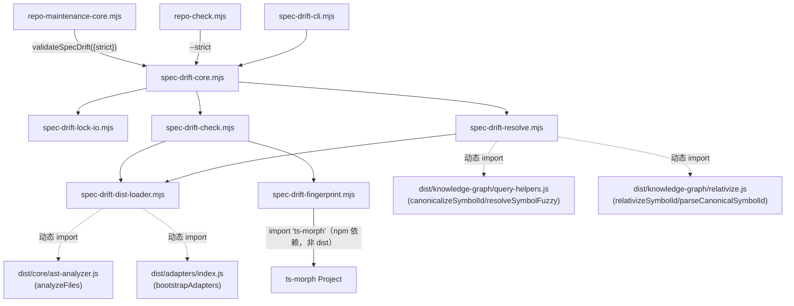

# 技术实施计划：Spec Drift 首次生产发布（M9 轨道 C）

**Feature**: `219-spec-drift-production`
**输入**：[spec.md](./spec.md)（已定稿，唯一需求事实源）
**迁移蓝本**：[specs/189-ast-anchored-spec-drift-detection/prototype/](../189-ast-anchored-spec-drift-detection/prototype/)
**状态**：Revised v2（已收口 Codex round-1 对抗审查，待 GATE_TASKS）

### 修订记录 — Codex round-1 对抗审查处置（session 019f8529）

审查发现 7 CRITICAL + 6 WARNING，逐条处置如下（✅=已修 / ⚖️=部分采纳并说明驳回理由 / ✔️=经 spec 修订已消解）：

| 编号 | 问题 | 处置 | 落点 |
|------|------|------|------|
| C-1 | `drift link` 缺可执行的 graph 数据来源（`canonicalizeSymbolId` 需完整 GraphJSON，manifest 无源文件集） | ✅ 采纳"从 file-qualified ref 就地构建最小 graph"，并给出不选缓存 graph 的理由 | 新增 §6.4 |
| C-2 | C3 序列化**确定漏报**（实测：`+a`/`-a`、`++a`/`--a`、`a++`/`a--`、`const`/`let` 序列完全相同）+ overload 未聚合 | ✅ 新增 `extraSemanticTokens()` 补记 unary operator 与 VariableDeclarationList NodeFlags；新增 `canonicalizeDeclarationSet()` 聚合重载 | §7.3 |
| C-3 | `locateExportedNode` 静默 `declarations[0]` 兜底 → 对错误 Node 算指纹 | ✅ 改 `locateExportedNodes()`，exportName+startLine+sourceFile 三元组精确匹配，零匹配/身份分叉/re-export 一律 `fingerprint-unavailable`，禁兜底 | §7.3 |
| C-4 | `parser-degrade` 对普通语法错误**不可达**（ts-morph 错误恢复不抛异常）+ `unsupported-language` 判据（`startLine===undefined`）建立在错误事实上 | ✅ 新增显式 parser-health 判定（diagnostics/parser 回退）；语言判据改规范化扩展名；补 ENOENT 竞态分流 | §9.1 |
| C-5 | report 级 `graph-unavailable` 被 C2 伪代码静默丢失 → 误贡献 pass | ✅ 先处理 report 级状态再处理 anchor 级，显式 degraded + 默认 warn/strict fail，禁伪造 anchor 状态绕过 | §11.3 |
| C-6 | 发布 npm 包不含新增 CLI 文件 | ⚖️ **部分采纳**：核实 `repo:check` 完全同形态（script 已发布但文件不在 `files`），FR-014/SC-006 只要求 repo 根 `npm run` 入口 → **驳回**扩 `files`/打包 e2e（无 FR 支撑的范围扩张），**采纳**其内核：e2e 改经 `npm run drift:*` | 新增 §10.4、§12.3 |
| C-7 | `fingerprintVersion` 状态归属冲突（lock-corrupt vs fingerprint-unavailable） | ✔️ 经 spec 修订消解（已从 US2-AC5 与 lock-corrupt next-step 移除） | §8.1 注 |
| W-1 | dist 加载失败面覆盖不全；dist 陈旧静默用旧逻辑 | ✅ loader 捕获全部 import 失败（语法/传递依赖/初始化）；dist 陈旧作为**诚实标注的残留风险**不做校验并说明理由 | §7.2、§15 |
| W-2 | JSDoc 跳过分支是死代码（实测遍历序列中无 JSDoc）；括号/引号/数字分隔符误报 stale | ✅ 删除"必须命中 JSDoc 分支"的必然失败断言，改断言无 JSDoc token；新增 `SYNTACTIC_NOISE_KINDS` 剔括号 + `normalizedLiteralText()` 归一字面值 | §7.3、§12.1、§15 |
| W-3 | strict 下子 check 硬编码 `warn`，与整体 `fail` 自相矛盾 | ✅ `checkResult` 随 strict 变化；evidence 断言非空真实对象 | §11.3 |
| W-4 | 退出码表漏 `graph-unavailable`；混合优先级未定 | ✅ check/link 两行补入；显式规定 `graph-unavailable + stale` → exit **2 非 1** | §10.2 |
| W-5 | 测试矩阵未覆盖全部 SC | ✅ 新增 11 态 table-driven 测试、F217 六指标逐项 + 12 族快照断言、`graph-unavailable` 独立 fixture、LLM 边界测试补传递闭包层 | §12.1/12.2 |
| W-6 | 顶层 `schemaVersion` 未获 spec 修订；字段校验只查四项 | ✔️+✅ spec 已修订对齐；校验扩至 FR-003 全十项 + 被禁字段检测，并说明"漏校验会把 lock 损坏误报成代码漂移" | §8.1、§8.3 |

### round-2 验证结论与增补（session 019f88c4）

Codex 复核判定：**9 CLOSED / 4 PARTIALLY-CLOSED / 0 NOT-CLOSED**，并用 ts-morph@24 内存探针实测确认 C-2 四组漏报已全部区分（哈希两两不等）、C-3 无残留兜底、W-2 JSDoc 结论成立、C-6 驳回理由事实成立。以下为本轮增补修复：

| 编号 | 问题 | 实测证据 | 处置 | 落点 |
|------|------|---------|------|------|
| **N-1** 🔴CRITICAL | `using` 被误序列化为 `var`（同序列漏报）；`await using` 因 flags 含 Const bit 被误标 `const` | 实测 flags：var=0 / let=1 / const=2 / **using=4** / **await using=65542**；且 `NodeFlags.AwaitUsing===6===Using\|Const`（位重叠）。朴素判定下 `using`→`var` 完全同序列 | ✅ 抽出 `declarationKeyword()`，判定顺序改 AwaitUsing→Using→Const→Let→var，AwaitUsing 用**全等**比较防 `const`(2&6=2 truthy) 误判 | §7.3 |
| **N-2** | BigInt 数字分隔符仍误报 stale（`1000n` vs `1_000n`） | `BigIntLiteral` 在 TEXT_BEARING_KINDS 内但 `normalizedLiteralText()` 只归一 `NumericLiteral`，BigInt 回退 `getText()` | ✅ 补 BigIntLiteral 归一分支 | §7.3 |
| **N-3** | `.mts/.cts` 被错误排除，仓内可解析的 TS 文件会被误标 unsupported-language | 已核对 `TsJsLanguageAdapter.extensions` 实为**八种**含 `.mts/.cts` | ✅ 支持集合对齐为八种并注明须与 adapter 一致 | §9.1 |
| **N-4** | lock 示例仍用被 FR-001 禁止的裸 ref，会污染 tasks/quickstart/测试数据 | spec FR-001 已要求 `<relPath>::<symbolName>` | ✅ 示例改 file-qualified | §8.1 |
| **C-4 残留** | "属 syntactic 范畴"判据未定义 | 实测语法错误(1109) 与类型错误(2322) 在 `getPreEmitDiagnostics()` 中**同为 category=Error**，仅按 category 过滤会把类型错误文件误判 parser-degrade | ✅ 改用 `program.getSyntacticDiagnostics(sourceFile.compilerNode)`（API 层即只返语法诊断，消除未定义判据） | §9.1 |
| **W-1 残留** | 我写的缓解"drift 位于既有 build 校验之后"**是事实错误** | 核实 `validateRepository()` 内**无任何 build 步骤**，仅 `prepublishOnly` 保证先 build | ✅ 删除该虚构缓解并显式更正；dist 陈旧改判为**"已知未缓解"残留风险**（虚构缓解比无缓解更危险） | §7.2、§15 |
| **W-5 残留** | SC-008 写入面校验、SC-007(d) 全量门禁只在散文中，无可执行落点 | — | ✅ 落成 §12 两个 verify 阶段显式校验项，并写明 merge-base 口径与 flaky 排除口径 | §12.1 |
| **N-5** INFO | "完整 GraphJSON" 措辞不准确 | query helper 实际只读 `nodes[].id`；真实 `GraphJSON` 还需 `directed/multigraph/graph`，且 `GraphNode.kind` 无 `'symbol'` | ✅ 改称"满足 query helper 的最小只读视图" | §6.4 |

---

## 1. Summary

把 F189 prototype（11/11 场景通过、只存活在 `specs/189-*/prototype/`）推向生产：新增独立 `scripts/spec-drift-cli.mjs` + `scripts/lib/spec-drift-*.mjs` 模块群，实现 `drift link` / `drift check` / `drift unlink` 三命令、JSON lock 制品持久化、`repo:check` 第 13 检查族接线，并把指纹算法从"symbol 源切片 + 空白归一化"升级为"parser-specific canonical AST fingerprint"（ts-morph 结构+token 序列化，剥离全部注释/JSDoc/格式）。全程零 LLM、零新运行时依赖、不修改任何 `src/` 生产代码，写入面严格限定在 spec SC-008 allowlist。

实施按 spec 自身的 C1 → C2 → C3 三段天然分阶段（详见 §9 阶段划分），每阶段可独立验证。

---

## 2. Codebase Reality Check

目标改动文件（按 SC-008 allowlist）：

| 文件 | 现状 LOC | 现状方法/导出数 | 已知 debt | 处置 |
|------|---------|----------------|-----------|------|
| `scripts/lib/repo-maintenance-core.mjs` | 330 | `syncRepository` / `validateRepository` / 4 个内部 helper | 无 TODO/FIXME；F217 已在第 311 行留注释指路"未来 M9 轨道 C 接入时照抄本行模式" | 仅新增 1 处 `import` + 1 处 `aggregateValidation(...)` 调用（~6 行），`validateRepository` 签名新增可选 `options={}` 参数（向后兼容）；不触发前置 cleanup 规则（新增 < 50 行，且 LOC 未过 500 阈值到需要拆分的程度） |
| `scripts/lib/graph-quality-core.mjs` | 237 | `validateGraphQuality` 单一导出 | 无 debt，仅作参照，不改动 | 只读参照，不写 |
| `scripts/repo-check.mjs` | 24 | CLI 入口，无导出 | 无 debt | 新增 `--strict` 手动解析（不改 `parseCommonProjectArgs` 共享文件，因其不在 allowlist 内） |
| `package.json` | — | `scripts` 字段现有 40+ 条目 | 无 debt | 新增 3 条 `drift:link` / `drift:check` / `drift:unlink` |
| `scripts/spec-drift-cli.mjs`（新建） | 0 | — | — | 新文件，CLI 薄壳 |
| `scripts/lib/spec-drift-core.mjs`（新建） | 0 | — | — | 新文件，顶层编排 + `validateSpecDrift` |
| `scripts/lib/spec-drift-lock-io.mjs`（新建） | 0 | — | — | 新文件，lock 读写 |
| `scripts/lib/spec-drift-resolve.mjs`（新建） | 0 | — | — | 新文件，link 解析 |
| `scripts/lib/spec-drift-fingerprint.mjs`（新建） | 0 | — | — | 新文件，C3 canonical AST 序列化 |
| `scripts/lib/spec-drift-check.mjs`（新建） | 0 | — | — | 新文件，check 状态矩阵计算 |
| `scripts/lib/spec-drift-dist-loader.mjs`（新建） | 0 | — | — | 新文件，dist 动态 import 小工具 |

无文件触发"前置清理规则"（无 >500 LOC 文件叠加 >50 行新增，无 >3 处相关 TODO，无 >30 行重复逻辑）——**不新增 `[CLEANUP]` 前置 task**。

---

## 3. Impact Assessment

- **直接修改文件**：3 个既有文件（repo-maintenance-core.mjs、repo-check.mjs、package.json）+ 7 个新文件 = 10 个。
- **间接受影响**：
  - `tests/integration/repo-maintenance-sync-check.test.ts`（若该测试对 `checks` 数组做穷举式断言，需要同步补充第 13 族的存在性断言，不修改既有 12 族断言——按 SC-007c 零回归要求）。
  - `spectra` MCP 图谱不受影响（本 Feature 不碰 `src/knowledge-graph/**`，FR-013 显式禁止把 drift 指纹挂图上）。
- **跨包影响**：0（全部改动落在 `scripts/**` 单一顶层边界内，未跨越 `plugins/` / `src/` 边界）。
- **数据迁移**：无 schema 变更、无既有配置格式变更；新增的 `.specify/spec-drift.lock.json` 是全新制品，无历史数据需要迁移。
- **API/契约变更**：新增 CLI 命令与 3 个 npm script（净新增，非修改既有契约）；`validateRepository` 签名新增*可选*参数，向后兼容不算契约破坏。
- **风险等级：LOW**（影响文件 10 个 < 10 的边界值附近但不跨包、无数据迁移、无破坏性 API 变更）。

> 说明：影响文件数（10）踩在 LOW/MEDIUM 边界，但由于跨包影响=0、无迁移、无破坏性契约变更，三项判据仅"文件数"临界，判定仍为 **LOW**，不强制多阶段 HIGH 风险处理。尽管如此，本计划仍按 spec 自身 C1/C2/C3 结构分阶段实施（§9），原因是**功能复杂度**（C3 canonical AST 序列化）本身需要独立验证点，而非风险等级驱动。

**MCP 工具核查**（按工具优先规则）：
- `impact` 工具查询 `scripts/lib/repo-maintenance-core.mjs::validateRepository` 返回 `symbol-not-found`（.mjs 治理脚本当前未被纳入 Spectra 图谱索引范围，预期内的降级，非本 Feature 引入的问题）。
- `context` 工具查询 `src/core/ast-analyzer.ts::analyzeFiles` 成功返回：现有 caller 含 F189 prototype 两处（`fingerprint.ts::computeSymbolFingerprint`、`resolve.ts::buildGraphFromFiles`，均为迁移蓝本自身）及 `single-spec-orchestrator.ts::prepareContext`、`skeleton-hash.ts::computeModuleSkeletonHash`（生产既有调用，与本 Feature 无关，确认本 Feature **不修改** `analyzeFiles` 本身，零新增 caller 影响）。

---

## 4. 技术上下文

| 维度 | 选型 |
|------|------|
| 语言/运行时 | Node.js ESM（`.mjs`，`"type": "module"`），Node ≥ 20.x |
| AST 引擎 | `ts-morph`（已在 `package.json` `dependencies` 中，^24.0.0；scripts/ 直接 `import { Project, SyntaxKind } from 'ts-morph'`，零新依赖） |
| 既有生产逻辑复用方式 | **动态 `import()` 编译产物 `dist/**`**（见 §6 详述），不重复实现 `analyzeFiles` / `canonicalizeSymbolId` / `resolveSymbolFuzzy` / `relativizeSymbolId` / `bootstrapAdapters` |
| 持久化 | JSON 文件（`.specify/spec-drift.lock.json`），Node 内建 `fs`，零新依赖 |
| 哈希 | `node:crypto` SHA-256，零新依赖 |
| 测试 | Vitest（沿用现有 `tests/unit` / `tests/integration` 结构） |
| CI 接线 | `scripts/repo-check.mjs` 第 13 检查族 |

无 `NEEDS CLARIFICATION` 项——spec 的 GATE_DESIGN 拍板表（CL-1/CL-2/CL-3）与状态矩阵已消解全部此前的裁决盲区。

---

## 5. Constitution Check

| 原则 | 适用性 | 评估 | 说明 |
|------|--------|------|------|
| I. 双语文档规范 | 适用 | PASS | plan/spec/tasks 中文散文 + 英文标识符 |
| II. Spec-Driven Development | 适用 | PASS | 本 Feature 全程走 spec → plan → tasks → implement → verify |
| III. YAGNI | 适用 | PASS | `graph-stale` 状态仅定义 + fixture 化，不实现从未触达的 graph 消费路径（§9 C1/C2 阶段说明）；模块拆分（6 个 lib 文件）均对应单一职责，无过早抽象层 |
| IV. 诚实标注不确定性 | 适用 | PASS，附条件 | C3 序列化对"forEachDescendant 是否天然遍历 JSDoc 节点"标注 `[不确定]`，采用防御性显式跳过而非假设遍历器行为（§6 设计） |
| V. AST 精确性优先 | 适用（spectra 分区，但本 Feature 精神对齐） | PASS | 指纹 100% 来自 ts-morph AST 节点 kind + token，不做任何 LLM 推断 |
| VI. 混合分析流水线 | **不适用** | N/A | 本原则约束 spectra 的"预处理→上下文组装→生成增强"LLM 产出流程；drift 是零 LLM 治理工具，不经过该流水线 |
| VII. 只读安全性 | 部分适用 | PASS，附说明 | 本原则字面约束"所有 spectra 工具（`/spectra`、`/spectra-batch`、`/spectra-diff`）...写操作仅允许作用于 `specs/` 和 `drift-logs/` 目录"——drift CLI 不属于该具名工具族，而是 spec-driver 治理层新增脚本，其写入面由本 Feature spec 的 SC-008 allowlist 单独授权（`.specify/spec-drift.lock.json`）。精神层面仍满足"不修改/删除/重命名源文件"的核心约束 |
| VIII. 纯 Node.js 生态 | 适用 | PASS | ts-morph 已是既有依赖，零新增；不引入 tree-sitter 或其他 parser（非目标 #5） |
| IX-XIV（spec-driver 分区） | 不适用 | N/A | 约束 `plugins/spec-driver/` 下 Prompt/Hook 开发，本 Feature 是 `scripts/` 治理脚本，非 spec-driver 插件源码变更 |

**结论**：无 VIOLATION，无需豁免论证。

---

## 6. 架构与模块布局

### 6.1 目录结构

```
scripts/
├── spec-drift-cli.mjs                 # CLI 入口（薄壳）：参数解析/--help/--format json/dispatch/退出码
├── repo-check.mjs                     # [改] 新增 --strict 解析，透传给 validateRepository
└── lib/
    ├── repo-maintenance-core.mjs      # [改] 新增第 13 族接线（+import +aggregateValidation 调用）
    ├── spec-drift-core.mjs            # 顶层编排：link/check/unlink 门面 + validateSpecDrift(repo:check 契约)
    ├── spec-drift-lock-io.mjs         # lock 读/写/原子写/schemaVersion 校验/损坏判定
    ├── spec-drift-resolve.mjs         # link 阶段：manifest 解析 + ref→symbolId 解析（依赖 dist canonicalize/fuzzy）
    ├── spec-drift-check.mjs           # check 阶段：精确匹配 + 状态矩阵 + 混合优先级/exitCode 计算
    ├── spec-drift-fingerprint.mjs     # C3 canonical AST 序列化 + SHA-256（自建 ts-morph Project）
    └── spec-drift-dist-loader.mjs     # dist/** 动态 import 小工具（缺失时返回 null，供上层降级判断）
```

### 6.2 依赖方向（单向无环，对齐 F218 拆分经验）



无反向依赖：`spec-drift-fingerprint.mjs` / `spec-drift-dist-loader.mjs` 不 import 任何上层模块；`spec-drift-check.mjs` / `spec-drift-resolve.mjs` 不互相 import；顶层 `spec-drift-core.mjs` 是唯一横向协调点。

> **[C1 实施后补充两条真实边]**
> 1. **新增 `RESOLVE --> FP`**：`link` 必须在建锚时产出指纹，故 `spec-drift-resolve.mjs` 也依赖 `spec-drift-fingerprint.mjs`（上图只画了 `CHECK --> FP`）。该边单向、无环，且不违反上述任一不变量。
> 2. **`STATE_MATRIX` 常量落在 `spec-drift-check.mjs` 并导出**，由 `spec-drift-core.mjs` 复用——刻意不新建第 7 个模块，模块数维持 6 个。
>
> **`distRoot` vs `projectRoot` 正交（plan 原先混用，实施中发现必须区分）**：`dist/**` 的查找基准是 **drift 脚本自身所在的包根**（`PACKAGE_ROOT`），而 `--project-root` 指的是**被检项目**的根。二者混用会导致任何非本仓的 `projectRoot` 恒判 `graph-unavailable`（因为被检项目下并没有我们的 `dist/`）。实现中 `distRoot` 独立解析并可经 option 覆盖——`graph-unavailable` fixture 正是靠覆盖它来稳定触发。

### 6.3 各模块职责

| 模块 | 职责 | 关键导出 |
|------|------|---------|
| `spec-drift-cli.mjs` | 参数解析（`link`/`check`/`unlink` 子命令、`--help`、`--format json`、`--project-root`、`--lock`）、调用 core、格式化输出、映射退出码 | `main()`（供 e2e 测试以"公开入口"方式调用，FR-014） |
| `spec-drift-core.mjs` | 门面：`linkReferences()` / `checkAnchors()` / `unlinkAnchor()`；`validateSpecDrift({projectRoot, strict})` 供 `repo:check` 消费 | `linkReferences`, `checkAnchors`, `unlinkAnchor`, `validateSpecDrift` |
| `spec-drift-lock-io.mjs` | 读取/校验/原子写 `.specify/spec-drift.lock.json`；损坏判定（FR-015） | `readLock`, `writeLockAtomic`, `LOCK_SCHEMA_VERSION` |
| `spec-drift-resolve.mjs` | manifest 解析（**仅 JSON**，见下注）；ref → canonical symbolId（仅 link/`--refresh` 调用，`check` 不调用，FR-004） | `resolveReference`, `parseManifest` |

> **[C1 实施后修正] manifest 只支持 JSON**：本表原写"JSON/YAML"，但 YAML 解析需引入新依赖，与"零新运行时依赖"护栏（非目标 #5）直接冲突。实施采纳：**任何扩展名一律按 JSON 解析**，解析失败返回 `manifest-parse-failed`。这与 CL-1（lock 用 JSON）也保持一致。
| `spec-drift-check.mjs` | 按 symbolId 精确匹配（不重 fuzzy）；状态矩阵映射；混合优先级 exitCode 计算 | `checkOneAnchor`, `computeReportExitCode` |
| `spec-drift-fingerprint.mjs` | C3 canonical AST 序列化 + SHA-256；`FINGERPRINT_VERSION` / `NORMALIZATION_PROFILE` 常量 | `computeCanonicalFingerprint`, `FINGERPRINT_VERSION`, `NORMALIZATION_PROFILE` |
| `spec-drift-dist-loader.mjs` | 封装"动态 import `dist/xxx.js`，加载失败（缺失/语法错误/传递依赖失败/初始化抛错）时返回结构化失败对象"，避免各模块重复样板 | `loadDistModule(projectRoot, relDistPath)` |

### 6.4 `drift link` 的 graph 数据来源（C-1 收口）

**问题**：`canonicalizeSymbolId` / `resolveSymbolFuzzy` 的既有签名都要求传入一个 `GraphJSON` 形态的实参（`src/knowledge-graph/query-helpers.ts`），不是只靠动态 import 就能调用。

> **[N-5 措辞精确化]** 实际运行时这两个 helper **只读取 `nodes[].id`**，因此我们构造的是"**满足 query helper 读取需求的最小只读视图**"，而非结构完整的 `GraphJSON`（后者还要求 `directed`/`multigraph`/`graph` 等字段，且 `GraphNode.kind` 并无 `'symbol'` 取值）。F189 prototype 同样是显式 cast 的最小结构。本文后续所称"最小 graph"均指此只读视图，不声称构造了完整 GraphJSON。F189 prototype 由调用方先提供 `absFiles[]` 再经 `buildGraphFromFiles` 构造最小 graph；而本 CLI 的 manifest 条目只有 `{id, ref, docPath, line}`，既无源文件集合也无 `--graph` 参数——原 §6.3/§10.1 未定义任何 graph 构造步骤，导致 link 的解析链路**没有可执行的数据面**。

**采纳方案：从 ref 自带的文件路径就地构建最小 graph**（不读 `specs/_meta/graph.json`，不做全仓扫描）。

依据 spec FR-001 的 `ref` 形态合同——`ref` MUST 为 file-qualified 形式 `<relPath>::<symbolName>`（F214 canonical ID 形态），裸 symbol 名一律判 `unresolved`。因此每条 manifest 条目**自带目标文件路径**，link 可直接：

```
对 manifest 每条 entry：
  1. parseCanonicalSymbolId(entry.ref) → { filePart, symbolPart }
     解析失败（非 file-qualified）→ unresolved（machineCode DRIFT_UNRESOLVED）
  2. filePart 在磁盘不存在 → unresolved（reason: "引用文件不存在"）
  3. 按 filePart 分组去重后，对每组调用一次 analyzeFiles([absPath])
     （与 §9.1 check 侧同一去重策略，避免 O(entries) 次重复解析）
  4. 用该文件的 skeleton 经 buildMinimalGraph() 构造仅含此文件节点的 GraphJSON
  5. 把该最小 graph 传入 canonicalizeSymbolId / resolveSymbolFuzzy 完成解析
```

`buildMinimalGraph()` 迁移自 F189 prototype 的 [`resolve.ts::buildGraphFromFiles`](../189-ast-anchored-spec-drift-detection/prototype/src/resolve.ts)，落在 `spec-drift-resolve.mjs` 内（不新建模块）。

**为何不选"读取 `specs/_meta/graph.json`"**：
1. 会让 link 依赖一份**预构建缓存制品**，其陈旧性需要引入 `graph-stale` 的真实触发路径与新鲜度校验，显著扩大首发面；
2. 与 check 侧 FR-004"即时重新解析、不依赖缓存 graph 制品"的口径分裂，同一 Feature 内两条真值策略会造成 link 判 fresh / check 判 orphaned 的错位；
3. 最小 graph 方案下 link 与 check 共享同一真值来源（现场 `analyzeFiles`），口径统一。

**对 fuzzy 兜底能力的诚实影响（C1 实施后按实测修正）**：最小 graph 只含 ref 指定的那一个文件，因此 `resolveSymbolFuzzy` 的"跨文件找相似 symbol"能力在本方案下**不可用**，跨文件误拼写不会被兜底命中，一律落 `unresolved`。这是 file-qualified ref 合同（FR-001）的直接推论，非缺陷。

> ⚠️ **更正一处此前的错误断言**：本节早先写"`matchKind` 的 `exact`/`partial-name`/`levenshtein` 三值在同文件范围内仍全部可产生"——**该说法经 C1 实测被证伪**。实际行为：最小 graph 下 levenshtein 层的置信度上限为 0.75，低于 auto-resolve 阈值 0.9，**恒不自动绑定**；而 file-qualified ref 形态下 path-suffix / partial-name 层也不可达。因此 **C1 首发实际只有 `matchKind: 'exact'` 可达**，其余取值路径在代码中保留（未来若某层自动命中会如实记录），但当前不产生。
>
> 相应地，非 exact 的解析结果只会落到两态：多候选 → `ambiguous`（附 top-3，不自动绑）；单个低置信候选 → `unresolved`。测试按**实测行为**断言而非按此前的错误预期断言。

---

## 7. C3 canonical AST serialization 技术设计（最难点）

### 7.1 为什么需要"自建 ts-morph Project"而非只用 `analyzeFiles`

`analyzeFiles`（`src/core/ast-analyzer.ts`）返回的 `CodeSkeleton`/`ExportSymbol` 是**纯 JSON 可序列化结构**，只带 `startLine`/`endLine`（见 F182 `skeletonHash` 的既有教训——已确认 spec/文件级哈希不是 normalized-AST），**不携带任何存活的 ts-morph `Node` 对象**。C3 要求的"AST 节点 kind + token 序列"必须在一棵真实的语法树上行走（`forEachDescendant`），因此 fingerprint 模块必须自己实例化一个 `ts-morph.Project` 解析目标文件，而不能只用 `analyzeFiles` 的输出。

`analyzeFiles` 仍然是**必需**的一环（FR-004 明确要求"即时重新解析"MUST 走 `analyzeFiles`）：它承担"symbol 是否存在 + 该导出的行号边界"这一**信任判定**，理由：
1. 只有经过 `LanguageAdapterRegistry`（`ts-js-adapter`）路径的文件才产出 `startLine`/`endLine`，这正是 FR-009(a) 首发语言范围的判据来源——不能绕过这层判断自行按文件后缀猜测。
2. 避免在 `scripts/` 里重新实现一套独立的"导出符号发现"逻辑（会和生产 adapter 分叉，违反"只读复用"精神与"消除重复"代码质量约束）。

**结论（技术选型）**：两阶段协作——`analyzeFiles` 判定"存在性 + 目标行号"（信任源），自建 `ts-morph.Project` 判定"该行号范围对应的具体 Node + 做 canonical 序列化"（结构源）。二者对同一个 `exp.name` 可能各自解析出的候选（如函数重载）用 `startLine` 做唯一性消歧（见 §7.3）。

### 7.2 依赖来源：动态 import `dist/**`（不新建 CLI 命令，不改 `ast-analyzer.ts`）

**问题**：`scripts/*.mjs` 是普通 Node ESM 脚本（无 TS 编译步骤），而 `analyzeFiles`/`canonicalizeSymbolId`/`resolveSymbolFuzzy`/`relativizeSymbolId`/`bootstrapAdapters` 都定义在 `src/**/*.ts`。F189 prototype 的做法（相对路径 `.js` 后缀直接 import `src/` 下 `.ts` 文件）**只在 TS-aware 运行时（vitest/tsx）下成立**，spec-drift-cli.mjs 作为 `npm run drift:check` 的生产入口不能依赖这个前提。

**参照 `graph-quality-core.mjs` 的现有解法**（F217）：该模块**不**直接 import 任何 `src/` 或 `dist/` 内部模块，而是 `spawnSync('node', [distCliPath, 'graph-quality', '--json', ...])` 调用**已编译好的 CLI 命令**。这条路径对我们不可行，原因：
- SC-008 allowlist **不包含** `src/cli/**`，本 Feature **不能**新增 `spectra graph-quality` 式的专属 CLI 子命令来包装 `analyzeFiles`。
- `analyzeFiles` 本身需要的是"函数级"复用（返回结构化数据给调用方继续处理），而非"整份报告"式的子进程 CLI 契约——没有合适的既有子命令可以复用。

**采用的替代先例**：仓库内已有大量 `scripts/*.mjs` 采取"**同进程动态 `import()` 编译产物 `dist/**`**"模式（非 spawn 子进程），例如：
- `scripts/verify-feature-151.mjs`：`await import(distMain)` 取 `buildUnifiedGraph`，`await import(dist/adapters/python-adapter.js)` 取 `PythonLanguageAdapter`。
- `scripts/verify-feature-152.mjs`：`await import(distBatchPath)` 取 `collectTsJsCodeSkeletons`，`await import(distBootstrapPath)` 取 `bootstrapRuntime`。
- `scripts/feature-165-replay-detect-changes.mjs`：`await import(path.join(PROJECT_ROOT, 'dist/mcp/agent-context-tools.js'))`。

本 Feature 沿用同一先例：`spec-drift-dist-loader.mjs` 封装 `existsSync` 检查 + `await import(pathToFileURL(distPath).href)`，加载：
- `dist/core/ast-analyzer.js` → `analyzeFiles`
- `dist/adapters/index.js` → `bootstrapAdapters`（幂等，check/link 前必须先调用一次）
- `dist/knowledge-graph/query-helpers.js` → `canonicalizeSymbolId` / `resolveSymbolFuzzy`（**仅** `spec-drift-resolve.mjs` 使用，`spec-drift-check.mjs` **禁止**引用，对齐 FR-004 "check 不重新模糊解析"）
- `dist/knowledge-graph/relativize.js` → `relativizeSymbolId` / `parseCanonicalSymbolId`（跨 worktree id 口径，F193/F214 既有资产）

**降级契约（W-1 收口）**：loader MUST 覆盖**全部**模块加载失败模式，而非仅"文件不存在"：

```js
// spec-drift-dist-loader.mjs
export async function loadDistModule(projectRoot, relDistPath) {
  const distPath = path.join(projectRoot, relDistPath);
  if (!fs.existsSync(distPath)) {
    return { ok: false, reason: 'dist-missing', detail: relDistPath };
  }
  try {
    return { ok: true, mod: await import(pathToFileURL(distPath).href) };
  } catch (err) {
    // ⚠️ 必须捕获**全部** import 失败：语法错误、传递依赖缺失/加载失败、模块顶层初始化抛错。
    // 原设计只承诺"文件不存在返回 null"，这三类失败会直接冒泡成未捕获异常，
    // 使 CLI 以栈回溯崩溃而非返回稳定状态码（违反 FR-012"稳定状态码 + next step"）。
    return { ok: false, reason: 'dist-load-failed', detail: `${relDistPath}: ${err.message}` };
  }
}
```

两类失败统一由上层（`spec-drift-core.mjs`）在 `check`/`link` 整体入口处**一次性**判定，映射为 report 级 `graph-unavailable`（machineCode `DRIFT_GRAPH_UNAVAILABLE`，`degraded: true`）。

状态矩阵中该状态的 next-step 已随 spec 修订为「AST 分析环境不可用（dist 编译产物缺失或模块加载失败），运行 `npm run build` 后重跑」——与本 Feature 的真实修复动作一致（此前指向 `spectra batch` 的误导性文案已在 spec 侧修正，W-1 第三点已消解）。`reason` 字段承载 per-report 动态诊断（区分 `dist-missing` 与 `dist-load-failed` 及具体模块路径），与静态 next-step 文案并存不冲突。

**dist 陈旧（存在但落后于 `src/`）的处理边界**：本 Feature **不**引入 dist-vs-src 新鲜度校验，理由：(1) 无 FR 要求；(2) 仓库内既有全部 `scripts/*.mjs` 动态 import dist 的先例（`verify-feature-151/152`、`feature-165-replay-*`）均未做此校验，单独为 drift 加会造成治理脚本行为分裂；(3) 可靠实现需比对 mtime/内容哈希，成本与收益不匹配。

**诚实标注残留风险（不隐藏、不虚构缓解）**：dist 陈旧时 drift 会静默使用旧编译逻辑计算指纹，可能产生与当前源码不符的判定。

> ⚠️ **更正一处此前的错误表述**：早先版本曾写"缓解措施：`repo:check` 链路中 drift 位于既有 build 校验之后"——**该说法不成立**，已核实 `validateRepository()` 内部**没有任何 build 步骤**，只有 `prepublishOnly` 钩子保证先 build。用户直接跑 `npm run repo:check` 时**仍可能消费陈旧 dist**。虚构的缓解比没有缓解更危险，故删除该表述。

**实际可用的缓解（仅此两项，均为提示性而非强制）**：
1. quickstart.md 明确提示"改动 `src/` 后须先 `npm run build` 再跑 drift"；
2. `graph-unavailable` 的 next-step 文案已指向 `npm run build`，dist **完全缺失**时能给出正确指引（但 dist **存在却陈旧**时无信号——这正是残留风险本体）。

此风险以"已知未缓解"状态记入 §15 风险表；若后续实践中出现真实误判，再单独立 Feature 引入 dist 新鲜度门（不在 M9-C 范围）。

`ts-morph` 本身**不**走 dist 动态 import——它是发布态 npm 依赖（`package.json` `dependencies.ts-morph`），`spec-drift-fingerprint.mjs` 直接 `import { Project, SyntaxKind } from 'ts-morph';`，零特殊处理、零新依赖。

### 7.3 canonical token 序列化伪代码

```js
// spec-drift-fingerprint.mjs
import { Project, SyntaxKind, NodeFlags } from 'ts-morph'; // NodeFlags 用于提取 const/let/var（C-2）
import { createHash } from 'node:crypto';

export const NORMALIZATION_PROFILE = 'ts-morph-canonical-v1';
export const FINGERPRINT_VERSION = '1';

// 单次 check 运行内跨文件共享一个 Project 实例（性能，见 §11 风险）
export function createSharedProject() {
  return new Project({
    skipFileDependencyResolution: true,   // 只解析目标文件本身，不递归解析其 import 依赖（性能）
    skipAddingFilesFromTsConfig: true,
    compilerOptions: { allowJs: true },    // 首发含 .js/.jsx（FR-009a）
  });
}

function isJsDocNode(node) {
  // 【已实测，非假设】ts-morph@24 的 forEachDescendant 委托 compiler node 的 forEachChild，
  // 实测 JSDoc 节点**不在**遍历序列中（root.getJsDocs() 非空但遍历到的 JSDoc 节点数为 0）。
  // 即注释/JSDoc 天然被剥离（trivia），本函数是**冗余的防御层**，正常路径下永不命中。
  // 因此测试 MUST NOT 断言"至少命中一次 JSDoc 分支"（那是死代码，必然失败，W-2），
  // 而应断言"canonical token 序列中不含任何 JSDoc 字样"。
  return node.getKindName().startsWith('JSDoc'); // JSDocComment 是 JSDoc 的 deprecated alias，前缀判断已覆盖
}

// 语法噪声节点：仅改变书写形式、不改变语义结构，MUST 从序列中剔除。
// 实测证据：`a+b` → `(a+b)` 会新增 ParenthesizedExpression 节点，若不剔除会误报 stale（W-2）。
const SYNTACTIC_NOISE_KINDS = new Set([
  SyntaxKind.ParenthesizedExpression,
]);

/**
 * 字面值规范化：取"值"而非原始书写文本。
 * 实测证据：getText() 保留原始书写，导致 `"x"`→`'x'`、`1000`→`1_000` 误报 stale，
 * 与原伪代码注释声称的"避免等价书写差异"自相矛盾（W-2）。
 */
function normalizedLiteralText(node) {
  const kind = node.getKind();
  if (kind === SyntaxKind.StringLiteral || kind === SyntaxKind.NoSubstitutionTemplateLiteral) {
    return JSON.stringify(node.getLiteralValue()); // 引号风格归一
  }
  if (kind === SyntaxKind.NumericLiteral) {
    return String(node.getLiteralValue());          // 1_000 / 0x3E8 / 1e3 归一为同一数值
  }
  if (kind === SyntaxKind.BigIntLiteral) {
    // N-2：BigIntLiteral 在 TEXT_BEARING_KINDS 内但此前未归一，
    // 实测 `1000n` vs `1_000n` 走 getText() 会误报 stale（与 W-2 修复意图不一致）
    return `${node.getLiteralValue()}n`;
  }
  return node.getText();                            // 其余 text-bearing 节点保留原文
}

// 需要记录"文本内容"的节点类型：标识符/私有标识符/字面值/模板字面值片段。
// 运算符 token（如 PlusToken/EqualsEqualsEqualsToken）与关键字节点（IfKeyword 等）
// 靠 getKindName() 本身即可唯一标识其语义，无需额外记录文本。
// ⚠️ 但**仅记 kind 不足以覆盖一元运算符与 const/let/var**——它们不在 forEachChild 序列里，
//    须由 extraSemanticTokens() 单独补记（C-2 实测漏报）。
// ⚠️ text-bearing 节点一律走 normalizedLiteralText() 而非裸 getText()，
//    否则引号风格/数字分隔符等等价书写会被误判为语义差异（W-2 实测）。
const TEXT_BEARING_KINDS = new Set([
  SyntaxKind.Identifier,
  SyntaxKind.PrivateIdentifier,
  SyntaxKind.StringLiteral,
  SyntaxKind.NoSubstitutionTemplateLiteral,
  SyntaxKind.TemplateHead,
  SyntaxKind.TemplateMiddle,
  SyntaxKind.TemplateTail,
  SyntaxKind.NumericLiteral,
  SyntaxKind.BigIntLiteral,
  SyntaxKind.RegularExpressionLiteral,
  SyntaxKind.JsxText,
]);

/**
 * 记录 forEachChild 不枚举的语义信息（C-2 核心修复）。
 *
 * 【实测漏报证据（ts-morph@24 内存探针）】以下四组在原设计下序列**完全相同** = 改运算符/声明类型却判 fresh：
 *   `return +a`  vs `return -a`      （一元运算符）
 *   `return ++a` vs `return --a`     （前缀自增/自减）
 *   `return a++` vs `return a--`     （后缀自增/自减）
 *   `export const foo=1` vs `export let foo=1`（声明类型）
 * 根因：一元运算符存于 PrefixUnaryExpression/PostfixUnaryExpression 的 `operator` 属性，
 *       **不作为 forEachChild 子节点**；而 const/let/var 存于父节点 VariableDeclarationList 的
 *       NodeFlags，`getExportedDeclarations()` 返回的根却是 VariableDeclaration（拿不到父标志）。
 * 这些都是 FR-009(c)/SC-001 的直接合同违约，MUST 显式补记。
 */
function extraSemanticTokens(node) {
  const out = [];
  const kind = node.getKind();

  // (1) 一元运算符：operator 是 SyntaxKind 枚举值，转成 kind 名记入
  if (kind === SyntaxKind.PrefixUnaryExpression || kind === SyntaxKind.PostfixUnaryExpression) {
    out.push(`op:${SyntaxKind[node.compilerNode.operator]}`);
  }
  // (2) 变量声明：从父 VariableDeclarationList 的 NodeFlags 提取声明类型
  if (kind === SyntaxKind.VariableDeclaration) {
    const listFlags = node.getParent()?.compilerNode?.flags ?? 0;
    out.push(`declKind:${declarationKeyword(listFlags)}`);
  }
  return out;
}

/**
 * NodeFlags → 声明关键字（N-1 CRITICAL 修复）。
 *
 * 【实测 flags（ts-morph@24）】var=0 / let=1 / const=2 / using=4 / await using=65542
 * 【关键陷阱】`NodeFlags.AwaitUsing === 6 === Using(4) | Const(2)` —— 位有重叠：
 *   - 朴素写法 `(flags & Const) ? 'const' : (flags & Let) ? 'let' : 'var'` 会让
 *     `using`(4) 落到 `var`（**与真 var 完全同序列 → 资源释放语义变化被判 fresh**），
 *     `await using`(65542) 因含 Const bit 被误标 `const`。
 *   - 因此判定顺序 MUST 为 AwaitUsing → Using → Const → Let → var，
 *     且 AwaitUsing MUST 用**全等**比较（`& AwaitUsing) === AwaitUsing`）而非真值判断，
 *     否则普通 `const`(2 & 6 = 2，truthy) 会被误判成 await using。
 */
function declarationKeyword(flags) {
  if ((flags & NodeFlags.AwaitUsing) === NodeFlags.AwaitUsing) return 'await using';
  if (flags & NodeFlags.Using) return 'using';
  if (flags & NodeFlags.Const) return 'const';
  if (flags & NodeFlags.Let) return 'let';
  return 'var';
}

/** 对单个已定位的 ts-morph Node 做 canonical token 序列化（CL-3 / FR-009c 落地） */
export function canonicalizeNode(rootNode) {
  const tokens = [rootNode.getKindName()]; // 根节点自身 kind 也计入（forEachDescendant 不含自身）
  tokens.push(...extraSemanticTokens(rootNode)); // 根节点自身也可能是 VariableDeclaration/UnaryExpression

  rootNode.forEachDescendant((child, traversal) => {
    if (isJsDocNode(child)) {
      traversal.skip(); // 冗余防御层（实测不会命中，见 isJsDocNode 注释）
      return;
    }
    const kind = child.getKind();
    if (SYNTACTIC_NOISE_KINDS.has(kind)) {
      return; // 剔除括号等纯书写噪声，但**继续遍历其子节点**（不 skip），保留内部语义
    }
    if (TEXT_BEARING_KINDS.has(kind)) {
      tokens.push(`${child.getKindName()}:${normalizedLiteralText(child)}`);
    } else {
      tokens.push(child.getKindName()); // 结构/关键字/运算符节点只记录 kind，不记录源文本
    }
    tokens.push(...extraSemanticTokens(child)); // 补记 forEachChild 不枚举的语义（C-2）
    // 普通行内/块注释（非 JSDoc）是 trivia，不在 forEachDescendant 序列中，天然剥离。
  });

  return tokens.join('|');
}

/**
 * 重载聚合（C-2 第二处漏报）：`extractExports` 对同名 overload 返回多个 ExportSymbol，
 * 若只取第一个声明，则"改实现体或后续 overload 签名"时第一个声明不变 → 误判 fresh。
 * 合同：一个导出名的**全部**声明按源码顺序（startLine 升序）各自序列化后拼接，
 * 必须同时包含 overload signatures 与实现节点。
 */
export function canonicalizeDeclarationSet(nodes) {
  return nodes
    .slice()
    .sort((a, b) => a.getStartLineNumber() - b.getStartLineNumber())
    .map((n) => canonicalizeNode(n))
    .join('#');
}

export function hashCanonicalSequence(sequence) {
  return `sha256:${createHash('sha256').update(sequence, 'utf8').digest('hex')}`;
}

/**
 * 在已解析的 SourceFile 中定位目标 Node（C-3 收口）。
 *
 * 【禁止静默兜底】原设计的 `?? declarations[0]` 是把"不知道"伪装成确定结论：
 * 行号对不上意味着 analyzeFiles 与本地 Project 对"目标 Node 身份"的判断已经分叉，
 * 此时仍输出 fresh/stale 属于**基于错误 Node 计算指纹**。MUST 改判不可验证态。
 *
 * 匹配三元组：exportName + startLine + sourceFile 同一性。
 * - sourceFile 同一性检查用于挡住 re-export：`getExportedDeclarations()` 的声明节点
 *   可能实际位于**另一个文件**（re-export 场景），对其计算指纹会把指纹归属到错误文件。
 *
 * @returns {{ok:true, nodes:Node[]} | {ok:false, reason:string}}
 *          成功时返回**声明集合**（重载场景多于一项，交 canonicalizeDeclarationSet 聚合）
 */
export function locateExportedNodes(sourceFile, exportName, expStartLine) {
  const all = sourceFile.getExportedDeclarations().get(exportName) ?? [];
  if (all.length === 0) {
    return { ok: false, reason: 'node-locate-failed' }; // 导出名在本地 Project 中不存在
  }

  // 只保留声明在**本文件**内的候选，挡住 re-export 跨文件归属
  const local = all.filter((d) => d.getSourceFile().getFilePath() === sourceFile.getFilePath());
  if (local.length === 0) {
    // 声明全部来自其他文件 = re-export。首发**显式拒绝**（不定义跨文件指纹归属，见下方决策）
    // 可达性：F221（spec 生成器识别 re-export）落地后，analyzeFiles 会把该导出如实返回为
    // kind: 're-export'，存在性判定不再落 orphaned，本分支在生产链路上**已真实可达**。
    return { ok: false, reason: 'reexport-unsupported' };
  }

  // 重载：同名多声明合法，全部返回交聚合序列化；但必须有一项与 analyzeFiles 的 startLine 对齐，
  // 以证明两侧对"同一个符号"的身份判断一致。
  const anchorMatched = local.some((d) => d.getStartLineNumber() === expStartLine);
  if (!anchorMatched) {
    return { ok: false, reason: 'node-locate-ambiguous' }; // 身份分叉，绝不猜
  }
  return { ok: true, nodes: local };
}
```

### 7.4 `normalizationProfile` / `fingerprintVersion` 版本语义

两个字段职责不同（对应 FR-003 字段清单、FR-009b）：
- **`normalizationProfile`**（如 `"ts-morph-canonical-v1"`）：标识"canonical token 产生规则"这一算法家族版本——当 §7.3 的 token 规则本身发生变化（如决定把某类节点从"只记 kind"改为"记 kind+text"）时 bump。
- **`fingerprintVersion`**（如 `"1"`）：标识整条 lock 记录的哈希 schema 版本——当哈希算法（如从 SHA-256 换成其他算法）或 lock 条目结构发生不兼容变化时 bump，粒度比 `normalizationProfile` 更粗。

`drift check` 比对时，**两个字段任一与当前工具常量不一致** → 一律标 `fingerprint-unavailable`（reason 明确区分是 `normalizationProfile` 还是 `fingerprintVersion` 不匹配），不做部分兼容尝试（FR-009b MUST NOT 直接比较新旧哈希）。

---

## 8. lock schema 定稿

### 8.1 完整 JSON Schema（顶层 `schemaVersion` + `anchors[]`）

```jsonc
{
  "schemaVersion": "1",              // 顶层 schema 版本（lock 文件整体结构版本，FR-015 判定对象）
  "anchors": [
    {
      "id": "spec219-canonicalizeSymbolId",     // 用户显式指定，稳定主键（W1，不由 docPath+line 派生）
      // ref MUST 为 file-qualified 形式（FR-001）；裸 symbol 名一律判 unresolved
      "ref": "src/knowledge-graph/query-helpers.ts::canonicalizeSymbolId",
      "docPath": "specs/219-spec-drift-production/spec.md",
      "line": 147,
      "symbolId": "src/knowledge-graph/query-helpers.ts::canonicalizeSymbolId", // canonical symbol id（link 时解析）
      "resolvedFrom": "src/knowledge-graph/query-helpers.ts::canonicalizeSymbolId", // = ref，审计留痕
      "matchKind": "exact",                       // exact/path-suffix/partial-name/levenshtein
      "fingerprint": "sha256:9f3a...",             // canonical AST 哈希（link/refresh 时写入）
      "fingerprintVersion": "1",                   // §7.4
      "normalizationProfile": "ts-morph-canonical-v1" // §7.4
    }
  ]
}
```

> **[已消解] 原 SPEC-CONFLICT（`schemaVersion` 字段归属）**：此前 spec FR-003 把 `schemaVersion` 列入 lock **条目**字段集合，而 FR-015 写"lock **顶层** `schemaVersion`"，两处层级归属不一致。**spec 已于 GATE_DESIGN 后修订**（FR-003 现明确："lock 顶层 MUST 含 `schemaVersion`（制品级 schema 版本，单一顶层字段）与 `anchors` 数组；每条 anchor 条目字段集合为 `{ id, ref, docPath, line, symbolId, fingerprint, fingerprintVersion, normalizationProfile, resolvedFrom, matchKind }`"）。本 plan §8.1 的顶层方案与修订后的 FR-003 **完全一致**，不再存在 SPEC-CONFLICT，也无需 GATE_TASKS 二选一。
>
> **[已消解] 原 `fingerprintVersion` 状态归属冲突（C-7）**：此前 spec US2-AC5 与状态矩阵 `lock-corrupt` next-step 把"`fingerprintVersion` 不兼容"归入 `lock-corrupt`（exit 3、report 级），而 FR-009(b)/Edge Cases/SC-005 要求归入 `fingerprint-unavailable`（exit 2、anchor 级）——这是退出码与作用域的实质冲突，非措辞问题。**spec 已修订**：从 US2-AC5 与 `lock-corrupt` next-step 中移除 `fingerprintVersion`，统一保留"旧指纹版本 → anchor 级 `fingerprint-unavailable`、exit 2、提示 refresh"。本 plan §7.4 的选择与之一致。

### 8.2 原子写实现

```js
// spec-drift-lock-io.mjs（伪代码）
export function writeLockAtomic(lockPath, data) {
  const tmpPath = `${lockPath}.tmp-${process.pid}-${Date.now()}`;
  fs.writeFileSync(tmpPath, JSON.stringify(data, null, 2) + '\n', 'utf8');
  fs.renameSync(tmpPath, lockPath); // POSIX rename 同文件系统内是原子操作
}
```

- `drift link` 批处理多条 manifest 条目时，内存中累积全部结果后**一次性** `writeLockAtomic`（FR-002：不允许半成品）。
- 写入前检测残留 `*.tmp-*` 文件（同目录 glob）→ 若存在，判定为上一次写入中断的痕迹，`drift check`/`drift link` 直接报错拒绝继续（FR-015 并发写入中断条款），不静默使用/清理。

### 8.3 损坏判定边界（FR-015）

| 场景 | 判定 |
|------|------|
| lock 文件不存在 | 非损坏；`drift link` 首次运行自动创建（`{schemaVersion: LOCK_SCHEMA_VERSION, anchors: []}`）；`drift check` 视为无锚，`exitCode 0` |
| `anchors` 为空数组 | 非损坏，同上"无锚" |
| 非法 JSON（`JSON.parse` 抛错） | `lock-corrupt` |
| 顶层缺 `schemaVersion` 或 `anchors` 非数组 | `lock-corrupt` |
| `schemaVersion` 与当前工具 `LOCK_SCHEMA_VERSION` 不兼容（不等） | `lock-corrupt` |
| `anchors` 中任意一条缺**任一必需字段**或字段类型不符 | `lock-corrupt`（整体判定，不做"跳过坏条目"部分容忍） |
| `anchors` 条目出现**被禁字段**（`status`/`stale`/`fresh` 等运行时派生态） | `lock-corrupt`（FR-015 修订后新增） |
| 检测到残留 `*.tmp-*` 临时文件 | `lock-corrupt`（视为写入中断证据） |

**必需字段全集（W-6 收口）**：校验 MUST 覆盖 FR-003 定义的**全部十项**，而非仅 `id`/`ref`/`docPath`/`line` 四项：

```
id, ref, docPath, line, symbolId, fingerprint, fingerprintVersion, normalizationProfile, resolvedFrom, matchKind
```

理由：若只校验四项，缺 `symbolId`/`fingerprint`/`fingerprintVersion` 的**结构性损坏**会漏过 lock 校验，被下游 check 流程误报成运行时的 `orphaned`（symbolId 缺失 → 查不到符号）或 `fingerprint-unavailable`（版本字段缺失 → 版本比对失败）——**把"lock 文件坏了"错误呈现为"代码漂移了"**，直接误导使用者。

校验语义为**全字段精确校验**：必需字段齐全 + 类型正确 + 无被禁字段，三者任一不满足即 `lock-corrupt`，不做宽松忽略（对齐 FR-015 修订后条款）。

---

## 9. check 精确匹配设计

### 9.1 流程

```
输入：lock.anchors[]（每条含 symbolId）
按 symbolId 的 filePart（parseCanonicalSymbolId）分组 → 每个唯一文件只调用一次 analyzeFiles（性能优化，见 §11）
对每组：
  1. 语言判定（先于一切解析）：按**规范化文件扩展名**判定是否首发支持
     支持集合 MUST 与仓内 `TsJsLanguageAdapter.extensions` **完全一致的八种**（N-3 实测核对）：
       .ts / .tsx / .js / .jsx / .mjs / .cjs / .mts / .cts
     ⚠️ 此前遗漏 .mts/.cts（TypeScript ESM/CJS 显式扩展），会把仓内 adapter 能正常解析的
        TS 文件误标 unsupported-language；spec FR-009(a) 写的是 "TypeScript/JavaScript"
        这一语言族，而非某个扩展子集
     → 不在首发集合 → 组内全部锚标 unsupported-language
     ⚠️ MUST NOT 用 `exp.startLine === undefined` 作为 unsupported-language 判据（C-4 实测反证：
        `ExportSymbolSchema` 把 startLine/endLine 定义为**必填正整数**，且 tree-sitter fallback 的
        Python/Go/Java 路径也**确实填充**行号——该 guard 永不触发，是建立在错误事实上的死分支）
  2. 文件不存在于磁盘 → 组内全部锚标 orphaned（reason: "文件已删除"）
  3. 调 analyzeFiles([absPath])，按异常类型分流（C-4：existsSync 之后仍可能被并发删除）：
       - 抛 FileNotFoundError / ENOENT → orphaned（竞态删除，不是解析失败）
       - 抛其他异常 → parser-degrade（reason 含错误信息）
  4. **显式 parser-health 判定**（C-4 核心修复，必须在"导出存在性"之前）：
     ⚠️ 实测：ts-morph 采用**错误恢复**策略——`export const foo = ;`、不闭合参数列表、非法控制结构
        都能成功创建 SourceFile 并返回导出，**不抛异常**，只是 diagnostics 非空；
        且 `ast-analyzer.ts` 内部异常会**回退 tree-sitter** 而非向上传播。
        因此"仅靠 analyzeFiles 抛错判 parser-degrade"对普通语法错误**基本不可达**，
        原设计的 parser fixture 无法稳定命中目标状态。
     判定规则（TS/JS 首发语言）：
       a. skeleton 标注的 parser 不是 ts-morph（即走了 tree-sitter fallback）→ parser-degrade
       b. 在 fingerprint 侧的 ts-morph Project 上取**语法诊断**：
          `project.getProgram().compilerObject.getSyntacticDiagnostics(sourceFile.compilerNode)`
          返回非空 → parser-degrade
          ⚠️ **MUST NOT 用 `getPreEmitDiagnostics()` + `category === Error` 过滤**（C-4 残留问题）：
             实测语法错误（code 1109）与纯类型错误（code 2322）在该列表里**都是 category=Error**，
             仅按 category 过滤会把"语法完全可解析、只是类型不完整"的文件误判为 parser-degrade。
             `getSyntacticDiagnostics` 在 API 层面就只返回语法类诊断，无需自行分类，
             消除了原设计"属 syntactic 范畴"这一未定义判据。
       （类型错误不算——drift 只关心语法结构可解析性，类型不完整不影响 AST 指纹）
  5. 正常返回 skeleton：
     对组内每个锚，按 symbolPart（= exp.name，member 已在 link 阶段拒绝，check 阶段不应再出现）：
       a. skeleton.exports 找不到同名 export → orphaned
       b. 定位 Node（§7.3 locateExportedNodes）返回 ok:false
          → fingerprint-unavailable（reason 透传 node-locate-failed / node-locate-ambiguous / reexport-unsupported）
       c. normalizationProfile/fingerprintVersion 与当前工具不一致 → fingerprint-unavailable（§7.4）
       d. canonicalizeDeclarationSet(nodes) 计算 actualFingerprint；与 lock.fingerprint 比对：
          - 相等 → fresh
          - 不等 → stale（报告含 expectedFingerprint/actualFingerprint）
汇总 summary + 混合优先级计算 exitCode（复用 spec 状态矩阵规则，逐条实现，不简化）
```

### 9.2 orphaned 判定边界

- 文件整体消失（`fs.existsSync` 为 false）→ `orphaned`。
- 文件存在但解析后 `exports` 中找不到该名字 → `orphaned`（涵盖"删除"与"重命名"两种物理表现，M9 不做 rename-follow，统一走 orphaned，FR-009d 边界之外的正常路径）。
- 与 `fingerprint-unavailable` 的边界：`orphaned` = "symbol 客观不存在"；`fingerprint-unavailable` = "symbol 存在但当前工具取不到可用指纹"（member 粒度、版本不匹配、node 定位失败）——两者判定顺序：先判存在性（orphaned），存在之后才判指纹可用性。

### 9.3 `graph-stale` 首发实现范围（回应 SPEC-CONFLICT 风险点，明确不冲突）

spec FR-004 明确：`drift check` 的存在性判定与指纹重算 **MUST** 基于对目标文件的**即时重新解析**（`analyzeFiles` 现场跑），**不依赖任何预构建/缓存的整仓 graph 制品**。US2 Acceptance Scenario 5 的前提是"**若**实现选择消费一份预构建/缓存的 graph 制品"——这是一个条件从句，而本 plan 的设计（§9.1）从未选择消费缓存 graph 制品做存在性判断，因此该场景的触发前提在本次实现中**不成立**，不构成对 FR-004 的违反，也不是需要"回避"的缺口。

**处理方式（非 SPEC-CONFLICT，是 spec 本身允许的两种实现路径之一）**：
- `graph-stale` 的 machineCode（`DRIFT_GRAPH_STALE`）、`repo:check` 严重度映射、混合优先级层级（4）**在类型定义与 check 汇总逻辑中完整保留**（`AnchorStatus` 枚举含该值，`computeReportExitCode` 的 switch 分支覆盖它）。
- 提供**单元测试 fixture**：直接构造一份"人工合成的" `AnchorCheckResult[]`（其中一条 `status: 'graph-stale'`），验证 `computeReportExitCode`/`repo:check` 严重度映射/`--format json` 序列化对该状态的处理正确（SC-003 要求的"11 态均有独立 machineCode 与文案"在结构层面成立）。
- **不**提供端到端触发路径（即不存在一条真实命令让用户看到 `graph-stale` 从磁盘状态自然产生），因为本期实现从不消费缓存 graph 制品。这一点在 quickstart.md 中会显式注明："`graph-stale` 是为未来消费 graph 制品的实现路径预留的状态位，当前版本不会在正常使用中产生此状态"。

---

## 10. CLI 参数与退出码

### 10.1 子命令参数表

| 子命令 | 参数 | 说明 |
|--------|------|------|
| `drift link` | `--manifest <path>`（必需）、`--refresh`（可选，刷新模式）、`--id <id>`（可选，配合 `--refresh` 只刷新单条；不传则刷新 manifest 中列出的所有已存在 id）、`--lock <path>`（可选，默认 `.specify/spec-drift.lock.json`）、`--project-root <path>`、`--format json`、`--help` | 新增走"新增"分支；`--refresh` 走"刷新"分支（FR-002） |
| `drift check` | `--strict`（可选）、`--lock <path>`、`--project-root <path>`、`--format json`、`--help` | 不需要 `--manifest`（只读 lock 里已持久化的 symbolId，FR-004） |
| `drift unlink` | `<id>`（位置参数，必需）、`--lock <path>`、`--project-root <path>`、`--format json`、`--help` | 按 id 精确删除，不接受 `--ref`/`--docPath` 反查（FR-002） |

### 10.2 退出码表

| 命令 | 0 | 1 | 2 | 3 |
|------|---|---|---|---|
| `drift check` | 全部 fresh | 存在 `stale`/`orphaned`（确认型 drift） | **`graph-unavailable`（report 级，优先级最高）**、`ambiguous`、`unresolved`、`fingerprint-unavailable`、`graph-stale`、`unsupported-language`、`parser-degrade`（均为不可验证态）| `lock-corrupt` |
| `drift link` | 全部新增/刷新成功，无 ambiguous/unresolved | *（不使用，link 阶段无"确认型 drift"概念，避免语义借用混淆）* | **`graph-unavailable`（dist 缺失/模块加载失败）**、ambiguous、unresolved、unsupported-language、fingerprint-unavailable，或 manifest 文件缺失/JSON 解析失败，或同 id 未加 `--refresh` 重复 link（操作性失败） | `lock-corrupt` |
| `drift unlink` | 删除成功 | *（不使用）* | 指定 `id` 不存在（操作性失败） | `lock-corrupt` |

> **混合优先级硬约束（W-4）**：`graph-unavailable` 是 report 级"整体不可验证"，优先级**高于** anchor 级的 `stale`/`orphaned`。
> 因此 `graph-unavailable + stale` 共存时整体 exitCode MUST 为 **2 而非 1**——不可验证优先于已确认 drift。
> 实现 MUST 按 spec 状态矩阵的分层顺序求值（lock-corrupt=3 → graph-unavailable=2 → 其他不可验证态=2 → stale/orphaned=1 → 全 fresh=0），
> 而非按 anchor 数组的出现顺序取首个非 fresh 项。§12 须有覆盖该混合场景的专项用例。

> 三命令的退出码语义在 0/2/3 层级上保持一致（0=干净成功，2=不可验证/操作性失败，3=lock 损坏），`1` 仅 `check` 使用（"确认型 drift"是 check 独有的概念，`link`/`unlink` 不产生该语义，故不复用 `1` 这个数值去表达不同含义），满足 FR-014"MUST 与 check 的 0/1/2/3 语义不冲突"。

### 10.3 `package.json` 新增 script

```json
"drift:link": "node scripts/spec-drift-cli.mjs link",
"drift:check": "node scripts/spec-drift-cli.mjs check",
"drift:unlink": "node scripts/spec-drift-cli.mjs unlink"
```

用法：`npm run drift:check -- --strict`、`npm run drift:link -- --manifest path/to/manifest.json`、`npm run drift:unlink -- spec219-canonicalizeSymbolId`。

### 10.4 分发层级定位（C-6 收口，含对审查建议的部分驳回）

**已核实事实**：`package.json` 的 `files` 为 `["dist/","grammars/","queries/","scripts/lifecycle-runner.cjs","plugins/","templates/","README.md"]`，**不含** `scripts/**`（除 lifecycle-runner）；`tsconfig.json` 的 `include` 仅 `["src/**/*.ts"]`，不会把 `.mjs` 复制进 `dist/`。因此新增的 `scripts/spec-drift-cli.mjs` / `scripts/lib/spec-drift-*.mjs` **不会进入 npm 发布包**。

**但这不是本 Feature 引入的缺陷，而是仓库既有的治理脚本分发惯例**：`repo:check` 完全同形态——`scripts.repo:check = "node scripts/repo-check.mjs"` 存在于已发布的 package.json 中，而 `scripts/repo-check.mjs` **同样不在 `files` 内**（已实测确认）。drift 的主消费方正是 `repo:check`（C2），二者属同一层级。

**定位裁决**：drift CLI 是**仓库内治理工具**（与 `repo:check` / `release:check` 同层），**不**是面向 npm 安装用户的发布态 CLI。依据：
1. FR-014 的公开入口定义是"`package.json` 注册 `drift:*` script + `npm run drift:check -- --strict` 形式传参"；
2. SC-006 的验收原文是"从 `npm run drift:link` / `drift:check` / `drift:unlink` 公开入口跑通闭环"——指**仓库根**的 npm script，未要求从 npm 安装产物运行；
3. 没有任何 FR 要求 drift 对 npm 安装用户可用。

**因此对审查建议的处置**：
- ❌ **不采纳**"扩展 `files` allowlist 把 CLI 打进发布包"——这会在无 FR 支撑的情况下扩大发布面（新增对外契约即新增长期兼容负担），属范围扩张；且会让 drift 与其同层的 `repo:check` 分发策略分裂。
- ❌ **不采纳**"新增 `npm pack` → 临时安装 → 从安装产物跑闭环"的 e2e——它验证的是 SC-006 未要求的场景。
- ✅ **采纳其事实内核**：e2e MUST 真正经由 `npm run drift:*`（而非仅 `spawnSync('node', ['scripts/spec-drift-cli.mjs'])`）执行，以证明 script 注册本身有效——见 §12.3 修订。
- ✅ **诚实记录边界**：若未来需要让 npm 安装用户直接使用 drift，MUST 同时 (a) 把 CLI 与其 lib 加入 `files`、(b) 增加打包产物 e2e。本 Feature 明确不做，记入 quickstart.md 的"已知边界"节，不留隐性假设。

---

## 11. `repo:check` 接线（C2）

### 11.1 `scripts/repo-check.mjs` 改动

```js
// [改] 手动解析 --strict（不改共享 parseCommonProjectArgs，因其位于 plugins/spec-driver/，不在 SC-008 allowlist）
const strict = process.argv.slice(2).includes('--strict');
const args = parseCommonProjectArgs(process.argv.slice(2), { json: false });
const result = await validateRepository(args.projectRoot, { strict });
```

### 11.2 `scripts/lib/repo-maintenance-core.mjs` 改动

```js
import { validateSpecDrift } from './spec-drift-core.mjs';

export async function validateRepository(projectRoot, options = {}) {
  const { strict = false } = options;
  // ...既有 12 族不变...
  aggregateValidation(
    'spec-drift',
    await validateSpecDrift({ projectRoot: resolvedRoot, strict }),
    warnings,
    errors,
    checks,
  );
  return { /* ...不变... */ };
}
```

- `validateRepository` 新增*可选*第二参数，默认 `{}`，不传时行为与改动前完全一致（向后兼容，对齐 Constitution XIII）。
- **严格 `await` 链**：`validateRepository` 本身已是 `async function`（既有代码），`aggregateValidation` 的第二参数 `await validateSpecDrift(...)` 保证 Promise 被完全展开后才传入——这是 FR-006/FR-008 要求的"堵死遗漏 await 静默空跑"的直接实现方式：**不提供**任何"忘记 await 也能跑"的旁路（`validateSpecDrift` 内部所有异步操作——`analyzeFiles`/动态 `import()`——全部在函数体内被 `await`，函数本身返回一个已 resolve 的对象而非 Promise 链）。

### 11.3 `validateSpecDrift` 三段式契约（照抄 F217 第 12 族模式）

```js
// spec-drift-core.mjs
export async function validateSpecDrift({ projectRoot, strict = false }) {
  const lockPath = path.join(projectRoot, '.specify', 'spec-drift.lock.json');
  const lockResult = readLock(lockPath);

  if (lockResult.corrupt) {
    return {
      status: 'fail', // lock-corrupt 恒 fail，不受 strict 影响（FR-007）
      checks: [createCheck('lock-integrity', 'lock 文件可解析且 schema 兼容', 'fail', { reason: lockResult.reason })],
      warnings: [],
      errors: [`[spec-drift] lock 文件损坏：${lockResult.reason}`],
    };
  }
  if (lockResult.anchors.length === 0) {
    return {
      status: 'pass',
      checks: [createCheck('anchors-status', '无锚或全部锚 fresh', 'pass', { anchorCount: 0 })],
      warnings: [],
      errors: [],
    };
  }

  const report = await checkAnchors(lockResult.anchors, projectRoot); // spec-drift-check.mjs
  const severity = strict ? 'error' : 'warn'; // §状态矩阵严重度提升规则（FR-007，单一定义，不做差异化分支）

  // ⚠️ C-5：**必须先处理 report 级状态，再处理 anchor 级**。
  // report 级 graph-unavailable（dist 缺失/模块加载失败）不属于任何单条 anchor：
  // 若只遍历 report.anchors，nonFresh 可能为空 → 整体误贡献 pass（静默假通过）。
  // 也 MUST NOT 把 report 级状态伪造进每条 anchor 绕过——那会违反状态矩阵的作用域定义。
  if (report.reportStatus && report.reportStatus !== 'ok') {
    const msg = `[spec-drift] ${report.reportStatus}：${report.reason ?? ''}（${report.nextStep ?? ''}）`;
    return {
      status: strict ? 'fail' : 'warn',
      checks: [createCheck('analysis-environment', 'AST 分析环境可用', severity === 'error' ? 'fail' : 'warn', {
        reportStatus: report.reportStatus,
        machineCode: report.machineCode,   // 如 DRIFT_GRAPH_UNAVAILABLE
        degraded: true,                     // 状态矩阵要求 degraded=true
        reason: report.reason,
      })],
      warnings: strict ? [] : [msg],
      errors: strict ? [msg] : [],
    };
  }

  const nonFreshStatuses = report.anchors.filter((a) => a.status !== 'fresh');

  const warnings = [];
  const errors = [];
  for (const a of nonFreshStatuses) {
    const message = `锚 ${a.id}（${a.symbolId ?? a.ref}）状态 ${a.status}：${a.reason ?? ''}`;
    if (severity === 'error') errors.push(message);
    else warnings.push(message);
  }

  // ⚠️ W-3：子 check 的 result 必须随 strict 变化，不能恒为 'warn'。
  // 否则外部消费 checks[] 的工具会看到"子检查 warn 但整体 fail"的自相矛盾结果。
  const checkResult = nonFreshStatuses.length === 0 ? 'pass' : (severity === 'error' ? 'fail' : 'warn');

  return {
    status: checkResult,
    checks: [createCheck('anchors-status', '所有锚状态', checkResult, {
      summary: report.summary,   // FR-008(b)：evidence 必须非空且是真实对象（非 Promise 残影）
      exitCode: report.exitCode,
      anchorCount: report.anchors.length,
      nonFreshCount: nonFreshStatuses.length,
    })],
    warnings,
    errors,
  };
}
```

---

## 12. 测试策略（TDD）

### 12.1 单测模块清单

| 模块 | 测试文件 | 覆盖点 |
|------|---------|--------|
| `spec-drift-lock-io.mjs` | `tests/unit/spec-drift-lock-io.test.ts` | 文件不存在自动创建/空 anchors/原子写(临时文件+rename)/残留 tmp 文件检测/schemaVersion 不兼容/缺字段判 lock-corrupt/字段类型不符判 lock-corrupt |
| `spec-drift-fingerprint.mjs` | `tests/unit/spec-drift-fingerprint.test.ts` | **fresh 组**：仅行内/块注释改动、仅 JSDoc 改动、仅格式化/缩进改动、**`a+b`→`(a+b)` 加括号**、**`"x"`→`'x'` 引号风格**、**`1000`→`1_000` 数字分隔符**（后三项为 W-2 实测误报面，MUST 断言 fresh）；**stale 组**：标识符名/字面值/控制结构改动，外加 **C-2 四组 + N-1 两组实测漏报的强制 fixture**——`+a`vs`-a`、`++a`vs`--a`、`a++`vs`a--`、`export const foo=1`vs`export let foo=1`（C-2，原设计下序列完全相同）、**`var x=a()`vs`using x=a()`**、**`using x=a()`vs`await using x=a()`**（N-1，实测 `using` flags=4 会落到 `var` 分支产生同序列、`await using` flags 含 Const bit 被误标 const；资源释放语义变化不得判 fresh）。以上六组 MUST 逐组独立断言两变体哈希**不相等**，不得合并简化——这是防 C-2/N-1 回归的核心资产；**overload 聚合**：同名函数重载，改第二个 overload 签名或实现体 MUST stale（防"只取第一个声明"漏报）；JSDoc 断言方式 MUST 为"canonical token 序列中不含任何 `JSDoc` 前缀 token"，**MUST NOT** 断言"至少命中一次 JSDoc 跳过分支"（实测该分支为死代码，永不命中，W-2）；`normalizationProfile`/`fingerprintVersion` 不匹配路径 |
| `spec-drift-resolve.mjs` | `tests/unit/spec-drift-resolve.test.ts` | exact/partial-name/levenshtein 命中；ambiguous top-3；unresolved；member（`Class.method`）显式拒绝 → fingerprint-unavailable；非 TS/JS 语言 → unsupported-language；`--refresh` 时 ambiguous/unresolved 保留刷新前基线（W1，Acceptance Scenario 5） |
| `spec-drift-check.mjs` | `tests/unit/spec-drift-check.test.ts` | 精确匹配（不重 fuzzy，构造"同名新 symbol"场景验证不被误洗成 fresh）；orphaned（文件删除/symbol 改名消失）；同文件他 symbol 变动不误伤（SC-002）；`graph-stale` 合成 fixture（§9.3）；**`parser-degrade` 按 §9.1 步骤 4 的新判据构造**——MUST 用"语法 diagnostic 非空"或"parser 回退 tree-sitter"触发，**MUST NOT** 依赖 `analyzeFiles` 抛异常（实测 ts-morph 错误恢复不抛异常，旧 fixture 设计不可达，C-4）；`locateExportedNodes` 三类失败（node-locate-failed / node-locate-ambiguous / reexport-unsupported）各自映射 fingerprint-unavailable；**混合优先级专项**：`graph-unavailable + stale` 共存 MUST 得 exitCode 2（非 1），覆盖状态矩阵五层的代表性组合 |
| **11 态状态矩阵（SC-003）** | `tests/unit/spec-drift-state-matrix.test.ts` | **table-driven 全覆盖**：对 11 个状态逐一断言状态矩阵**全部列**——`machineCode` 字面值、作用域（anchor/report）、单态 `exitCode`、`degraded` 标记、`repo:check` 默认映射、`repo:check` strict 映射、`next-step` 文案非空且非通用兜底。含 `graph-unavailable` 独立 fixture（此前缺失）与 `graph-stale` 的 next-step 断言（此前只测汇总/序列化） |
| **F217 六指标 + 既有 12 族零回归（SC-007b/c）** | `tests/integration/spec-drift-repo-check-regression.test.ts` | 跑真实 `validateRepository`，断言：(a) F217 六个 check id（duplicate/orphan/contains/dangling/ignored/freshness）**逐项** result 为 pass——不接受"整体 exit 0"作为代理证据；(b) 既有 12 族的 check id 集合与 result 与基线快照**逐项一致**；(c) 第 13 族 `spec-drift:*` 确实出现在 `checks` 中 |
| **写入面 allowlist（SC-008）** | verify 阶段显式校验步骤（非单测） | W-5 收口：此前 SC-008 的 merge-base 写入面校验只在 §13 散文提及，未落任何可执行落点。MUST 在 verify 阶段执行：<br>`git diff --stat $(git merge-base master HEAD) HEAD -- src/ plugins/` 结果为空（证明未越界改生产源码），<br>且实际改动路径集合 ⊆ allowlist（`scripts/spec-drift-*`、`scripts/lib/spec-drift-*`、`scripts/lib/repo-maintenance-core.mjs`、`scripts/repo-check.mjs`、`package.json`、`tests/**`、`specs/219-*/**`）。<br>⚠️ **MUST NOT 用工作树 `git diff`**（提交后恒为空 = 假通过） |
| **全量门禁（SC-007d）** | verify 阶段最终 gate（非单测） | W-5 收口：`npx vitest run` + `npm run build` + `npm run repo:check` 三者零失败，作为 Feature 交付的**硬前置**。<br>已知噪声排除口径：`tests/integration/graph-quality-adversarial.test.ts` 在全量满载下存在 `runCLI` 子进程饿死导致 stdout 空的负载型 flaky（已于 implement 前基线复现并经隔离复跑 19/19 绿证伪），**若且仅若**隔离复跑通过方可判定为非回归，不得直接忽略 |
| `spec-drift-core.mjs`（repo:check 接线） | `tests/unit/spec-drift-core-validate.test.ts` | `strict` 透传；严重度提升规则（全 warn→全 error，fresh 不受影响，lock-corrupt 恒 fail 不受 strict 影响）；**防静默 no-op 测试**（FR-008）：构造含 1 条 stale 锚的 lock fixture，调用真实 `await validateRepository(projectRoot)`，断言 `checks.some(c => c.id.startsWith('spec-drift:'))` 且 `warnings.some(w => w.startsWith('[spec-drift]'))` 非空——这一断言方式本身即是回归防线：未来若有人误删 `await`，`aggregateValidation` 拿到未展开的 Promise 对象，`result.warnings ?? []` 因 Promise 无 `warnings` 属性而退化为空数组，该测试会真实失败 |
| 导入边界 / 零 LLM（SC-007a） | `tests/unit/spec-drift-no-llm-import.test.ts` | **两层**（原设计只有第一层，证明力不足）：<br>**L1 直接导入**——静态读取 `spec-drift-*.mjs`/`spec-drift-cli.mjs` 源码，正则断言不含 `@anthropic-ai/sdk`、`openai`、`@google/generative-ai` 等 provider 字面量。<br>**L2 传递闭包**——drift 动态 import 的 dist 模块是**有界集合**（`dist/core/ast-analyzer.js`、`dist/adapters/index.js`、`dist/knowledge-graph/query-helpers.js`、`dist/knowledge-graph/relativize.js`）；从这四个入口在 `dist/` 内递归解析 `import`/`export from` 语句构建可达模块集，断言该集合中无任何 provider 包引用。<br>**诚实边界**：L2 是静态可达性分析，不覆盖运行时 `eval`/字符串拼接构造的动态 import（本仓 dist 产物无此模式，但不做无根据的绝对声称） |

### 12.2 Fixture 设计（`tests/fixtures/spec-drift/`）

| Fixture | 用途 |
|---------|------|
| `fresh-comment-only/` | 仅改行内/块注释的 before/after 文件对 |
| `fresh-jsdoc-only/` | 仅改前导 JSDoc 的 before/after 文件对 |
| `fresh-format-only/` | 仅改缩进/换行/空格的 before/after 文件对 |
| `fresh-syntactic-noise/` | **W-2 + N-2 实测误报面**：`a+b`→`(a+b)` 加括号、`"x"`→`'x'` 引号风格、`1000`→`1_000` 数字分隔符、**`1000n`→`1_000n` BigInt 分隔符**（N-2：BigIntLiteral 此前未归一，走 `getText()` 会误报 stale）——四组均 MUST fresh |
| `stale-using-vs-var/` / `stale-await-using/` | **N-1 实测漏报面（CRITICAL 防回归资产）**：`var x=a()` vs `using x=a()`（原判定同为 `var` → 同序列）、`using x=a()` vs `await using x=a()`（原判定误标 const）——两组 MUST stale |
| `lang-mts-cts/` | **N-3**：`.mts` / `.cts` 文件各一，MUST 被判为**受支持**（不得标 unsupported-language）——防"支持集合漏列导致仓内可解析 TS 文件被误拒" |
| `stale-identifier/` / `stale-literal/` / `stale-control-flow/` | 三类 AST 结构变化的 before/after 文件对 |
| `stale-unary-prefix/` / `stale-unary-postfix/` / `stale-decl-kind/` | **C-2 实测漏报面（防回归核心资产）**：`+a`vs`-a`、`++a`vs`--a`、`a++`vs`a--`、`export const foo=1`vs`export let foo=1`——原设计下序列完全相同，MUST stale |
| `stale-overload-second/` | 同名函数重载，仅改**第二个** overload 签名或实现体 → MUST stale（防"只取 declarations[0]"漏报，C-2） |
| `sibling-symbol-unaffected/` | 同文件两个 symbol，改动 A 不影响锚定 B 的 fixture |
| `fingerprint-version-mismatch/` | 手工构造一条 `fingerprintVersion` 为旧值的 lock 条目 + 未变化的源文件 → anchor 级 `fingerprint-unavailable`（**非** lock-corrupt，C-7 已消解） |
| `lock-corrupt-*/` | FR-015 全分支：非法 JSON / 顶层缺 `schemaVersion` 或 `anchors` 非数组 / `schemaVersion` 不兼容 / **条目缺十项必需字段中任一** / **条目含被禁字段（`status`/`stale`/`fresh`）** / 字段类型不符 / 残留 `*.tmp-*` |
| `member-rejected/` | manifest 含 `Class.method` 形式 ref → link 阶段显式拒绝 |
| `reexport-unsupported/` | `export { foo } from './other'` 形态 → `locateExportedNodes` 返回 `reexport-unsupported` → fingerprint-unavailable（C-3）。**F221 落地后该路径在生产链路上已可达**（依据：`analyzeFiles` 现返回 `{ name, kind: 're-export' }`，存在性判定通过，不再先落 orphaned），单测已按端到端形态断言 |
| `unsupported-language/` | manifest 含指向 `.py`/`.go` 文件符号的 ref。**判据为规范化文件扩展名**，不是 `startLine === undefined`（C-4 实测反证：`ExportSymbolSchema` 要求 startLine 必填正整数，tree-sitter fallback 也确实填充行号，旧判据是死分支） |
| `parser-degrade/` | **按 §9.1 步骤 4 新判据构造**：语法 diagnostic 非空（如 `export const foo = ;`——ts-morph 错误恢复**不抛异常**但 diagnostics 非空）或 parser 回退 tree-sitter。**MUST NOT** 设计成"让 `analyzeFiles` 抛异常"（不可达，C-4） |
| `graph-unavailable/` | **此前缺失**：临时移除/改名 `dist/core/ast-analyzer.js` 模拟 dist 缺失 → report 级 `graph-unavailable`、`degraded: true`、exitCode 2；另含 `dist-load-failed`（写入语法错误的假 dist 模块）分支（W-1/W-5） |

### 12.3 公开入口 e2e（FR-014/SC-006）

`tests/integration/spec-drift-cli-e2e.test.ts`：**MUST 经 `npm run drift:*` 执行**（`spawnSync('npm', ['run','drift:check','--','--format','json'], {cwd: tmpRepo})`），而非仅 `spawnSync('node', ['scripts/spec-drift-cli.mjs'])`。

理由（C-6 采纳内核）：SC-006 的验收原文是"从 `npm run drift:link` / `drift:check` / `drift:unlink` 公开入口跑通"——直接 spawn 脚本路径会**绕过 script 注册本身**，无法证明 `package.json` 的三条 `drift:*` 注册有效；若某次改动写错 script 命令行，直接 spawn 的测试仍全绿而真实用户入口已坏。

跑通步骤：
1. 准备临时工作目录 + manifest fixture + 目标 TS 源文件
2. `drift link --manifest ...` → 断言 lock 新增记录、退出码 0
3. `drift check` → 断言 fresh、退出码 0
4. 修改源文件（改变标识符）→ `drift check` → 断言 stale、退出码 1
5. `drift unlink <id>` → 断言 lock 记录移除、退出码 0
6. `--help` 与 `--format json` 分别验证输出格式

---

## 13. Constitution Check 复核 & 护栏对齐

- **零 LLM**：§12.1 导入边界测试覆盖（SC-007a）。
- **只读复用**：所有生产逻辑复用均通过 `import()` 只读引用编译产物，`FR-010` 明确的三个文件（`ast-analyzer.ts`/`skeleton-hash.ts`/`knowledge-graph/**`）全程零 diff，由 SC-008 的 `git diff --stat` merge-base 校验保证。
- **图 schema 不变**：per-symbol 指纹只存在于 `.specify/spec-drift.lock.json`，绝不挂载到 `graph.json` 节点（FR-013）。
- **图质量门零回归**：F217 六指标 check id 逐项验证（SC-007b），本 Feature 不触碰 `graph-quality-core.mjs`。
- **`repo:check` 零回归**：既有 12 族 id/结果不变，`spec-drift` 作为第 13 族追加（SC-007c），`tests/integration/repo-maintenance-sync-check.test.ts` 视既有断言方式决定是否需要补充第 13 族存在性断言（不修改既有 12 族断言）。
- **与 F220 disjoint**：本 Feature 不碰 `src/batch/**`，写入面严格限定在 §2 表格列出的文件集合内。
- **通用定位红线**：全部制品（lock 示例、fixture、文档）不出现具体客户/公司名。
- **提交方式**：显式路径提交（`git add scripts/spec-drift-cli.mjs scripts/lib/spec-drift-*.mjs ...`），不使用 `git add -A`。

---

## 14. Complexity Tracking（偏离简单方案的决策）

| 决策 | 偏离的"更简单"方案 | 采纳理由 |
|------|-------------------|---------|
| 拆分为 6 个 `spec-drift-*.mjs` 而非单文件 | 全部塞进一个 `spec-drift-core.mjs`（如 F189 prototype 的 3 文件规模） | 对齐 F217/F218 已验证的"cli 薄壳 + 职责单一 core 模块"范式；C3 canonical AST 序列化本身逻辑量级（§7.3）足以独立成模块并独立单测，混在一起会重演 F218 拆分前"819 行" 的问题模式 |
| 自建 `ts-morph.Project` 而非只用 `analyzeFiles` 输出 | 继续用 prototype 的"行号切片"方式并逐步加改进 | `analyzeFiles` 不暴露存活 Node 对象，无法做真正的 AST 结构比对；这是 C3 的核心要求（spec FR-009c），非过度设计 |
| `graph-stale` 状态保留定义但不实现触发路径 | 干脆从状态矩阵/类型定义中移除，等未来需要时再加 | spec 状态矩阵是"唯一权威定义源"，FR-004/005/006/007 均引用，移除会破坏 SC-003 的"11 态均有独立 machineCode"断言；保留定义+合成 fixture 的成本极低（YAGNI 不等于"删除已定合同"） |

---

## 15. 风险与缓解

| 风险 | 影响 | 缓解 |
|------|------|------|
| **ts-morph 版本敏感性** | ts-morph/TypeScript 编译器版本升级可能改变某些节点的 `getKindName()`/子节点结构（如 JSDoc 遍历行为），导致历史 lock 记录集体误报 stale | `normalizationProfile` 版本号机制（§7.4）——升级 ts-morph 若观察到 canonical 序列变化，bump `normalizationProfile`，旧锚统一转 `fingerprint-unavailable` 而非误报 stale；`package.json` 锁定 `ts-morph` 版本范围 `^24.0.0`，非本 Feature 范围内的 minor/patch 升级需人工验证后决定是否 bump profile |
| **性能：每锚一次 `analyzeFiles` 调用的开销** | lock 条目多且分散在多个文件时，若不去重会产生 O(anchors) 次重复解析同一文件 | §9.1 按 `symbolId` 的 `filePart` 分组，每个唯一文件只调用一次 `analyzeFiles([absPath])`；`spec-drift-fingerprint.mjs` 的 `ts-morph.Project` 在单次 check 运行内跨文件共享同一实例（`createSharedProject()`），避免重复初始化编译器上下文 |
| **W2 lock 生命周期残留风险** | 长期使用后 lock 中可能累积大量已 `orphaned`（未及时 `unlink`）的僵尸锚，report 噪声增大 | 本 Feature 范围内不做自动清理（非目标，避免"静默删除用户数据"）；`orphaned` 状态的 next-step 文案已明确引导人工 `drift unlink`（状态矩阵表），文档层面在 quickstart.md 建议"定期审查 orphaned 锚" |
| ~~`schemaVersion` 字段归属歧义~~ **[已消解]** | — | spec FR-003 已修订为"顶层 `schemaVersion` + anchor 条目十字段"，与本 plan §8.1 完全一致，不再存在 SPEC-CONFLICT，无需 GATE_TASKS 二选一 |
| **最小 graph 使 `resolveSymbolFuzzy` 跨文件兜底不可用** | link 时若 ref 的文件路径写错，不会被跨文件模糊匹配兜底命中，一律落 `unresolved` | 这是 file-qualified ref 合同（FR-001）的直接推论而非缺陷——ref 已显式声明文件，跨文件模糊搜索超出该合同语义。同文件内 partial-name/levenshtein 仍有效，`matchKind` 三值仍全部可产生。`unresolved` 的 next-step 文案已引导检查路径拼写（§6.4） |
| ~~`forEachDescendant` 对 JSDoc 遍历行为的不确定性~~ **[已实测消解]** | — | **已用 ts-morph@24 内存探针实测**：`root.getJsDocs()` 非空时，`forEachDescendant()` 遍历到的 JSDoc 节点数**为 0**——JSDoc 属 trivia，天然不在遍历序列中。因此 `isJsDocNode` 跳过分支是**冗余防御层（死代码）**，正常路径永不命中。<br>⚠️ 原缓解措施"断言至少命中一次 JSDoc 分支"是**基于错误假设的必然失败断言**，MUST 删除。正确断言：canonical token 序列中不含任何 `JSDoc` 前缀 token（§12.1 已改）。保留该防御分支的理由仅为跨 ts-morph 版本的行为兜底，不为其编写命中型测试 |
| **dist 陈旧（存在但落后于 `src/`）** ⚠️**已知未缓解** | drift 静默使用旧编译逻辑计算指纹，可能产出与当前源码不符的 fresh/stale 判定 | 本 Feature **不**引入 dist-vs-src 新鲜度校验（无 FR 要求；仓内既有全部动态 import dist 的 `scripts/*.mjs` 先例均未做，单独为 drift 加会造成治理脚本行为分裂）。<br>❌ **此前写的"drift 位于既有 build 校验之后"是错误表述，已删除**——实测 `validateRepository()` 内无任何 build 步骤，仅 `prepublishOnly` 保证先 build，用户直接跑 `npm run repo:check` 仍可能消费陈旧 dist。<br>✅ 实际缓解仅两项提示性措施：quickstart.md 明示"改 `src/` 后须先 `npm run build`"；dist **完全缺失**时 `graph-unavailable` next-step 指向 `npm run build`（但 dist **存在却陈旧**时无信号 = 风险本体）。<br>**以"已知未缓解"状态诚实记录**，若实践中出现真实误判再单独立 Feature（不在 M9-C 范围）（W-1） |
| ~~dist 未构建导致的 `graph-unavailable` 误导性 next-step~~ **[已消解]** | — | spec 状态矩阵的 `graph-unavailable` next-step 已修订为「AST 分析环境不可用（dist 编译产物缺失或模块加载失败），运行 `npm run build` 后重跑」，与本 Feature 的真实修复动作一致；此前指向 `spectra batch` 的误导文案已移除。`reason` 字段继续承载 `dist-missing`/`dist-load-failed` 的动态诊断，与静态 next-step 并存（W-1） |

---

## 16. 阶段划分（对应 spec 自身 C1/C2/C3，非因 HIGH 风险强制，因功能复杂度需要独立验证点）

1. **阶段 C1**：`spec-drift-lock-io.mjs` + `spec-drift-resolve.mjs` + `spec-drift-check.mjs`（沿用 prototype 的"源切片指纹"作为过渡实现，先打通 link/check/unlink 三命令 + lock 持久化 + CLI 骨架）+ `spec-drift-cli.mjs`。验证点：US1/US2 除"C3 canonical AST"外全部 Acceptance Scenario 通过（此阶段指纹算法仍是过渡态，SC-001 的"仅注释/JSDoc/格式化 → fresh"断言在此阶段**尚不成立**，属于 C3 阶段的验收目标，不在 C1 验证范围内声称达成）。
2. **阶段 C2**：`repo:check` 接线（`validateSpecDrift` + `repo-maintenance-core.mjs`/`repo-check.mjs` 改动）。验证点：US3 全部 Acceptance Scenario + SC-004/SC-007c。
3. **阶段 C3**：`spec-drift-fingerprint.mjs` 落地 canonical AST 序列化，替换 C1 阶段的过渡指纹算法，`spec-drift-check.mjs` 切换调用。验证点：US4 全部 Acceptance Scenario + SC-001/SC-002/SC-005。

三阶段共享同一 lock schema（§8），C1→C3 切换指纹算法时，`normalizationProfile` 从"过渡态标识"（如 `"source-slice-whitespace-v1"`，仅阶段内部使用不对外承诺）直接切到 `"ts-morph-canonical-v1"`——由于 C1 阶段产出的锚在 C3 落地后本就需要 `--refresh`（算法切换即 profile 变化），不存在"半成品 profile 混入正式发布"的风险。

---

## 后续制品

- `research.md`：无遗留 `NEEDS CLARIFICATION` 项，本 Feature 跳过独立 research.md 生成（技术选型已在本 plan §4/§6/§7 内完整给出决策+理由+替代方案，符合"决策必须有理由"约束，未重复建档）。
- `data-model.md`：见下方精简版（Key Entities 已在 spec.md 定义，plan 层面补充字段级 schema，见 §8.1，不重复生成独立文件——lock schema 是本 Feature 唯一的数据模型，已完整内嵌在本 plan）。
- `contracts/`：`drift check --format json` 的 `DriftReport` 输出结构、`drift link`/`unlink --format json` 的操作摘要结构，将在 tasks.md 对应 task 中以 TypeScript-like 注释形式固化在 `spec-drift-core.mjs` 的 JSDoc 中（本 Feature 规模不需要独立 `contracts/*.yaml` 文件，遵循 YAGNI）。
- `quickstart.md`：将在 GATE_TASKS 通过后、implement 阶段开始前单独生成，内容涵盖 manifest 编写示例、三命令用法、`graph-stale` 状态的"预留未触发"说明（§9.3）。
