# Implementation Plan: 判定器快照漂移信号（Judge Snapshot Drift Signal）

**Branch**: `236-judge-snapshot-drift-signal` | **Date**: 2026-07-24 | **Spec**: [spec.md](./spec.md)
**Input**: Feature specification from `specs/236-judge-snapshot-drift-signal/spec.md`

## Summary

fix 依从性 Stop hook 实际运行的是**已安装插件快照**里的判定器（6 个 `.mjs` 文件），不是仓库源码；八个历史修复（F208/F216/F224/F225/F227/F228/F229/F230）都没有触发版本号升级，导致"仓库已修好"与"本机正在生效的快照已修好"这两件事无法区分。本 feature 新增一个**独立、只读、开发者主动调用**的 doctor CLI（`npm run judge:doctor`），对仓库侧与已安装快照侧的 6 个判定器文件现算 sha256 逐一比对，产出四态结果之一（`in-sync`/`drift`/`not-applicable`/`indeterminate`），不接入 `repo:check`、不接入 Stop hook、不修改任何现有文件的行为，不给出修复建议——只做状态可见。

技术方案：沿用仓库 `fix-compliance-judge.mjs`（CLI 编排）/ `fix-compliance-io.mjs`（I/O 边界）/ `fix-compliance-core.mjs`（纯函数判定）三层分层惯例，新增 3 个文件：`judge-snapshot-doctor.mjs`（CLI）、`lib/judge-snapshot-io.mjs`（I/O：sha256 读取、manifest 校验、`installed_plugins.json`/`.specify/.spec-driver-path` 读取，均以**判别式联合**而非布尔/null 坍缩的方式暴露"确定性负判定 vs 不确定性错误"两种不同性质的结果）、`lib/judge-snapshot-core.mjs`（纯函数：`JUDGE_FILE_SET` 常量、FR-007 四步优先级决策、单文件/整体状态判定）。零新增 npm 依赖（仅 `node:crypto`/`node:fs`/`node:path`/`node:os`/`node:url`），零跨模块耦合（不修改任何现有文件的接口）。

> **注（implement 阶段架构转向）**：FR-002b 守卫解析器已放弃本段描述的"词法屏蔽 + 形态枚举"手写方案——经 codex 四轮 critical 证明手写 ESM 词法解析是无底洞，最终改为 **Node vm 官方解析**（`vm.SourceTextModule` 的 `moduleRequests` / Node 20 回退 `dependencySpecifiers`），dynamic import 一律 fail-closed。最终事实源以 `data-model.md §7` + `contracts/judge-snapshot-drift-result.md` 为准，本段仅存历史设计脉络。

经 codex 对抗审查发现并已修订的两处实现层关键设计：(1) FR-002b 守卫测试的 import 闭包解析器采用"词法屏蔽（剥离注释/字符串/模板字面量）+ 已知安全 import 形态枚举 + 未知形态 fail-closed"策略，而非朴素逐行正则（朴素正则会漏掉跨行 import/re-export/side-effect import 而静默腐化清单，也可能误判注释掉的伪 import）；(2) active 快照解析与文件比对的 I/O 边界函数全部改为判别式联合返回值（`absent`/`invalid`/`error` 三态分明），确保"确实没有"与"读取失败/内容损坏导致无法判断"不会被静默坍缩成同一结果，且 `indeterminate` 顶层结果按"是否已定位到快照目录"拆分为 `resolution`/`comparison` 两个互斥变体，避免部分文件读取失败时整体转 `indeterminate` 却吞掉已确认的 `mismatch` 明细。详见 data-model.md 与两份 contracts。

## Technical Context

**Language/Version**: Node.js ≥ 20.x（ESM `.mjs`），与仓库其余 `plugins/spec-driver/scripts/*.mjs` 一致，无 TypeScript 编译步骤
**Primary Dependencies**: 仅 Node 内置模块 `node:crypto`（sha256）、`node:fs`、`node:path`、`node:os`（`os.homedir()`）、`node:url`（`fileURLToPath`，供 `isDirectExecution()` 判定）；零新增 npm 依赖（FR-004）
**Storage**: N/A —— 两侧现算 sha256、现比对，不持久化"预期指纹"、不落盘任何检测记录（诊断信息，用后即弃）
**Testing**: `node:test`（`npm run test:plugins`），与 `fix-compliance-*` 系列测试同一运行方式；辅以：(1) `plugins/spec-driver/tests/judge-file-set-guard.test.mjs`（FR-002b 守卫：对仓库真实入口 `scripts/fix-compliance-judge.mjs` 跑词法屏蔽 + 已知安全形态提取的 BFS 闭包解析，断言与 `JUDGE_FILE_SET` 完全相等；解析器本身返回"无法归类"时测试同样判 FAIL，不允许静默放行）；(2) `plugins/spec-driver/tests/judge-file-set-guard-parser.test.mjs`（对 `extractModuleReferences` 纯函数单独喂 5 类语法 fixture：跨行 import、specifier 行内注释、re-export、side-effect import、注释掉的伪 import，防止"只靠改 `JUDGE_FILE_SET` 看红"这种间接验证掩盖解析器本身的 bug）；(3) 一个容忍任意合法四态之一的 smoke 测试
**Target Platform**: 开发者本机 CLI，Claude Code 与 Codex 运行时均适用（不依赖 Harness 特有能力，spec Edge Cases 已明确）
**Project Type**: Single（新增脚本 + lib + 测试，无前后端拆分）
**Performance Goals**: 无专门性能目标——6 个文件 × 2 侧 sha256 属毫秒级操作
**Constraints**: 零运行时依赖（Constitution X）；不得修改 `stop-fix-compliance-check.sh` 现有 exit code 语义（FR-010）；不得挂载为 `repo:check` 新增检查项（FR-009）；核心判定函数以显式 `projectRoot` 为合同，不直接读 `cwd`（FR-005）；FR-002b 守卫解析器 fail-closed——遇到无法归类的可疑 import 形态时守卫测试直接判定失败，不静默漏报；active-version 解析与文件比对的 I/O 结果一律用判别式联合表达"确定性负判定"与"不确定性错误"两种性质，不得用布尔/null 互相坍缩
**Scale/Scope**: 固定 6 文件集合的字节级比对，不构建通用"任意插件/任意文件"漂移检测框架（非目标已明确排除）

## Codebase Reality Check

本 feature **不修改**任何现有源文件的行为逻辑，只在仓库新增 3 个源文件 + 5 个测试文件 + 1 个 fixture 目录，并在 `package.json` 追加 1 行 `npm run` 脚本。下表核实的是本 feature **读取/比对的对象**（6 个既有判定器文件）与将要修改的 1 个既有文件（`package.json`）的现状，用于确认无需前置 cleanup task。

| 文件 | 角色 | LOC（非空行） | 公开导出数 | 已知 debt |
|------|------|------|------|------|
| `plugins/spec-driver/scripts/fix-compliance-judge.mjs` | 判定器文件集合成员（只读，本 feature 不改） | 456 | `parseArgs`/`buildFeedbackText`/`main` | 0 个 TODO/FIXME/HACK（F218 拆分后新文件，无遗留债务） |
| `plugins/spec-driver/scripts/lib/fix-compliance-core.mjs` | 同上 | 1039 | 多个判定纯函数 | 同上，0 |
| `plugins/spec-driver/scripts/lib/fix-compliance-execution-record.mjs` | 同上 | 311 | 执行证据抽取函数 | 同上，0 |
| `plugins/spec-driver/scripts/lib/fix-compliance-io.mjs` | 同上 | 309 | I/O 边界函数 | 同上，0 |
| `plugins/spec-driver/scripts/lib/simple-yaml.mjs` | 同上 | 220 | `parseYamlDocument` | 同上，0 |
| `plugins/spec-driver/scripts/record-workflow-run.mjs` | 同上 | 376 | `recordWorkflowRun` | 同上，0 |
| `package.json` | 将新增 1 行 `scripts.judge:doctor` | 106 | N/A | 0；改动量远低于前置清理阈值 |

**前置清理判定**：6 个判定器文件均为 F218 拆分（core 拆分五段）后的产物，零 TODO/FIXME/HACK 标记，无超长函数已知问题，本 feature 对它们是**只读比对**（不修改其内容/接口）。`package.json` 改动仅 1 行新增。**均不触发前置 cleanup task 规则**（无文件 LOC>500 且将新增>50 行到该文件本身；无跨文件重复逻辑需要抽取）。

## Impact Assessment

- **影响文件数**：新增 3 个源文件（`judge-snapshot-doctor.mjs` + 2 个 `lib/*.mjs`）+ 5 个测试文件（core 单测、io 单测、FR-002b 真实闭包守卫测试、FR-002b 解析器 fixture 单测、smoke 测试）+ 1 个 fixture 目录（含 5 个语法样例文件，供解析器 fixture 单测使用）+ 1 个既有文件的 1 行新增（`package.json`）。合计约 9~10 个文件/目录变更，直接修改 0 个既有源码文件的逻辑。
- **跨包影响**：0 —— 全部落在 `plugins/spec-driver/` 内，`package.json` 的新增行是独立 script 条目，不触碰 `src/`、`plugins/spectra/` 或其他顶层边界。
- **数据迁移**：无 —— 不涉及任何 schema/配置格式/状态文件格式变更（本 feature 本身不落盘任何状态）。
- **API/契约变更**：无 —— 新增的是一个全新独立 CLI 命令，不修改 `hooks.json`、不修改 `stop-fix-compliance-check.sh`、不修改 `repo-maintenance-core.mjs`、不修改任何现有 agent prompt 或 skill 的输入输出协议。
- **风险等级**：**LOW-MEDIUM**（影响文件数 < 10、跨包影响 = 0、无数据迁移、无公共 API/契约变更——均落在 LOW 判定区间；但存在两个需要重点验证的实现层风险面，如实标注为 LOW-MEDIUM 而非压低为 LOW，与 spec.md 复杂度评估口径保持一致）：
  1. **active-version resolution**（FR-007 四步 fallback 链）：涉及三路来源（env var / `.specify/.spec-driver-path` / `installed_plugins.json`）的优先级判定、`invalid` vs `error` 的性质区分、多候选去重（symlink canonicalize + scope 优先级），逻辑分支数量在本 feature 中最高，是 codex 审查（C2/W1）指出问题最集中的模块。
  2. **FR-002b 守卫解析器**：需要正确处理跨行 import、re-export、side-effect import、注释内伪 import 等真实存在于仓库文件中的语法形态，解析错误会导致"清单腐化"这一本 feature 试图杜绝的问题重新出现（这正是 codex 审查 C1 指出的问题）。

因风险等级为 LOW-MEDIUM（未达 HIGH），不触发"HIGH 风险强制分阶段"规则；但鉴于上述两个风险面，implement 阶段建议仍按"纯函数层 → I/O 层 → CLI 编排层 → 守卫测试（真实闭包 + fixture 解析器双重验证）→ smoke"的自然依赖顺序推进，且两个风险面模块（`resolveActiveSnapshot` 与守卫解析器）均需独立的、穷举式的单元测试覆盖（见下方"实现顺序建议"与 contracts 测试断言基准表），不得仅靠端到端 smoke 测试兜底验证。

## Constitution Check

*GATE：Phase 0 研究前必须通过；Phase 1 设计后已复核。*

### 项目级原则

| 原则 | 适用性 | 评估 |
|------|--------|------|
| I. 双语文档规范 | 适用 | plan/research/data-model/quickstart/contracts 均为中文散文 + 英文标识符；PASS |
| II. Spec-Driven Development | 适用 | 本 feature 全程走 spec → plan → tasks → implement → verify；PASS |
| III. YAGNI/奥卡姆剃刀 | 适用 | `--json` 输出、`getJudgeFileSet()` 包装函数均已按"当前无消费场景"原则砍掉（research.md D6）；FR-002b 解析器不追求完整 ESM 语法解析、只做"词法屏蔽 + 已知安全形态枚举 + fail-closed"这一最小充分方案；组件数收窄为 3（CLI + 2 lib）；PASS |
| IV. 诚实标注不确定性 | 适用 | `indeterminate` 态本身就是"诚实标注不确定性"在产品层面的体现；经 codex 审查修订后进一步拆分为 `resolution-indeterminate`/`comparison-indeterminate` 两个互斥变体，避免"部分文件读取失败"这类局部不确定性掩盖已确认的比对明细；`missingInSnapshot`/`missingInRepo`/`missingBoth` 如实区分三种缺失情形；PASS |

### Plugin: spec-driver 约束（本 feature 只涉及 spec-driver 插件）

| 原则 | 适用性 | 评估 |
|------|--------|------|
| IX. Prompt 编排 + Harness 强制 | 部分适用 | doctor CLI 是"辅助功能"性质的 mjs 脚本（诊断工具），不承载编排决策逻辑，符合"Bash/MJS 脚本用于辅助功能"的既有定位；PASS |
| X. 零运行时依赖 | 适用（核心） | 仅用 Node 内置模块，零新增 npm 依赖，含测试代码（FR-002b 守卫测试用轻量词法屏蔽 + 正则而非引入 parser 依赖）；PASS |
| XI. 质量门控不可绕过 | 适用（反向验证） | 本 feature **刻意不**接入任何 GATE_*，因为它是诊断信息非质量门禁——这正是 spec 暴露点选型表格论证过的结论，不构成对本原则的违反（本原则约束的是"已有门禁不可被绕过"，不要求"所有新信号都必须是门禁"）；PASS |
| XII. 验证铁律 | 适用 | implement 完成后需实际跑 `npm run test:plugins`/`npx vitest run`/`npm run build`/`npm run repo:check` 并附真实输出，非推测性声明；将在 tasks.md/verify 阶段落实 |
| XIII. 向后兼容 | 适用（核心） | 不修改 `stop-fix-compliance-check.sh` exit code 语义（FR-010）；不修改 `repo:check` 现有检查项；新增 `judge:doctor` script 是纯增量，未使用该命令的开发者行为完全不变；PASS |
| XIV. 可观测性与架构守护 | 适用 | 本 feature 本身就是"可观测性"能力的新增；新增文件行数均预计 <250 行（对照下方实现顺序建议的函数清单），不引入循环依赖（`judge-snapshot-core.mjs` 零依赖 `judge-snapshot-io.mjs`，单向：`doctor.mjs` → `{io.mjs, core.mjs}`）；PASS |

**结论**：无 VIOLATION，Constitution Check 全数通过，无需豁免论证，Complexity Tracking 表留空（无偏离需要正当化）。

## Project Structure

### Documentation (this feature)

```text
specs/236-judge-snapshot-drift-signal/
├── spec.md               # 已完成（story 模式，已过 codex 审查）
├── plan.md                # 本文件（已过 codex 对抗审查第二轮修订）
├── research.md            # Phase 0 输出：D1~D8 技术决策记录
├── data-model.md          # Phase 1 输出：7 个运行期/测试期实体定义（含 §7 FR-002b 守卫解析器专用实体）
├── quickstart.md          # Phase 1 输出：手动验证步骤（对应 User Story 1 Independent Test）
├── contracts/
│   ├── judge-snapshot-doctor-cli.md      # CLI 参数/退出码/输出格式合同
│   └── judge-snapshot-drift-result.md    # 核心函数接口清单 + 判定优先级 + 测试断言基准表 + FR-002b 守卫解析器契约
└── tasks.md                # Phase 2 输出（本次不生成，用户已声明"到 tasks 为止即停"——此处指 implement 前停，tasks.md 由后续阶段生成）
```

### Source Code（新增，仓库根）

```text
plugins/spec-driver/
├── scripts/
│   ├── judge-snapshot-doctor.mjs          # [新增] CLI 编排入口（含 main/parseArgs/checkJudgeSnapshotDrift/格式化输出，含 resolution/comparison 两种 indeterminate 呈现分支）
│   └── lib/
│       ├── judge-snapshot-io.mjs          # [新增] I/O 边界：computeSha256/validatePluginRoot/readSpecDriverPathFile/readInstalledPluginsMetadata/scanInstalledSnapshotPresence（判别式联合返回，见 contracts）
│       └── judge-snapshot-core.mjs        # [新增] 纯函数：JUDGE_FILE_SET 常量、resolveActiveSnapshot、compareFile、aggregateStatus
└── tests/
    ├── judge-snapshot-core.test.mjs             # [新增] 纯函数单测：状态覆盖 + FR-007 优先级穷举 + W1 canonicalize/scope 去重边界
    ├── judge-snapshot-io.test.mjs               # [新增] I/O 单测：tmp 目录 fixture，覆盖 absent/invalid/error 三态各自的判别式分支
    ├── judge-file-set-guard.test.mjs            # [新增] FR-002b 守卫测试：对仓库真实入口跑词法屏蔽+BFS 解析真实 import 闭包 == JUDGE_FILE_SET
    ├── judge-file-set-guard-parser.test.mjs     # [新增] FR-002b 解析器单测：5 类 fixture（跨行/注释/re-export/side-effect/注释掉的伪 import）独立验证 extractModuleReferences 本身
    ├── judge-snapshot-doctor-smoke.test.mjs      # [新增] 端到端 smoke：真实本机环境跑一次，容忍任意合法状态之一
    └── fixtures/
        └── judge-file-set-guard/                 # [新增] 5 个语法样例文件，供 judge-file-set-guard-parser.test.mjs 使用

package.json                                # [修改] scripts 新增 1 行 "judge:doctor"
```

**Structure Decision**：单项目结构（Option 1 精简版），新增文件全部落在 `plugins/spec-driver/scripts/`（含 `lib/` 子目录）与 `plugins/spec-driver/tests/`（含 `fixtures/` 子目录），与仓库既有 `fix-compliance-*` 系列文件同目录、同分层惯例，不新建顶层目录，不引入 `contracts/*.schema.json`（本次无外部消费者需要 JSON Schema 强校验，Markdown 合同已足够描述内部函数接口）。

### 架构图

```mermaid
flowchart TD
    subgraph CLI["judge-snapshot-doctor.mjs（CLI 编排层）"]
        parseArgs["parseArgs(argv)"]
        check["checkJudgeSnapshotDrift(&#123;projectRoot,env,claudeHome&#125;)"]
        format["formatReport(result)<br/>按 indeterminateKind 分支呈现"]
        main["main(argv) → exit 0|1"]
    end

    subgraph IO["lib/judge-snapshot-io.mjs（I/O 边界层，判别式联合返回）"]
        sha["computeSha256(absPath)<br/>→ DigestResult"]
        validRoot["validatePluginRoot(dir)<br/>→ PluginRootValidation（ok/invalid/error）"]
        readSpecPath["readSpecDriverPathFile(projectRoot)<br/>→ SourceProbe"]
        readMeta["readInstalledPluginsMetadata(claudeHome)<br/>→ InstalledPluginsMetadataResult"]
        scanPresence["scanInstalledSnapshotPresence(claudeHome)<br/>→ 'present'|'absent'|'error'"]
    end

    subgraph CORE["lib/judge-snapshot-core.mjs（纯函数层）"]
        fileSet["JUDGE_FILE_SET（常量）"]
        resolve["resolveActiveSnapshot(sources)<br/>→ SnapshotResolutionResult"]
        cmp["compareFile(repoDigest,snapshotDigest)<br/>→ 9 组合判定表"]
        agg["aggregateStatus(files)"]
    end

    EnvVar["process.env.CLAUDE_PLUGIN_ROOT"]
    SpecPathFile[".specify/.spec-driver-path"]
    MetaFile["~/.claude/plugins/installed_plugins.json"]
    RepoFiles["仓库侧 6 文件<br/>plugins/spec-driver/&lt;JUDGE_FILE_SET&gt;"]
    SnapFiles["快照侧 6 文件<br/>&lt;snapshotPath&gt;/&lt;JUDGE_FILE_SET&gt;"]

    main --> parseArgs --> check
    check -->|读取| EnvVar
    check --> validRoot
    readSpecPath --> SpecPathFile
    readMeta --> MetaFile
    check --> readSpecPath
    check --> readMeta
    check --> scanPresence
    check --> resolve
    resolve --> fileSet
    check -->|逐文件| sha
    sha --> RepoFiles
    sha --> SnapFiles
    check --> cmp
    cmp --> agg
    check --> format --> main
```



（FR-002b 守卫解析器 `extractModuleReferences`/`resolveStaticImportClosure` 不出现在本图——它是测试专用基础设施，不参与生产运行期数据流，详见 data-model.md §7 与 contracts 文末独立小节。）

## 实现顺序建议（供 tasks.md 拆解参考，非强制阶段门禁——风险等级 LOW-MEDIUM 未达 HIGH，不触发强制分阶段，但两个高风险模块见下方标注）

1. **纯函数层**（`lib/judge-snapshot-core.mjs`）：`JUDGE_FILE_SET`、`resolveActiveSnapshot`、`compareFile`、`aggregateStatus`。零 I/O，可最先写单测（`judge-snapshot-core.test.mjs`，用 data-model.md/contracts 的测试断言基准表逐条覆盖各状态 + FR-007 优先级链路 + W1 canonicalize/scope 去重边界）。**⚠ 高风险模块**：`resolveActiveSnapshot` 是 codex 审查 C2/W1 修订最集中的部分，单测须穷举 §4 决策逻辑全部分支（含 `source-error` 短路、`installed-plugins-metadata-ambiguous`、symlink 去重不算歧义、valid 过滤后不算歧义等边界）。
2. **I/O 层**（`lib/judge-snapshot-io.mjs`）：`computeSha256`、`validatePluginRoot`、`readSpecDriverPathFile`、`readInstalledPluginsMetadata`、`scanInstalledSnapshotPresence`。用 `os.tmpdir()` fixture 单测（`judge-snapshot-io.test.mjs`），覆盖每个函数的 `absent`/`invalid`/`error` 判别式分支各自独立触发（不得让某一态吞掉另一态，对应 C2 修订）。
3. **CLI 编排层**（`judge-snapshot-doctor.mjs`）：组装 1+2，实现 `parseArgs`/`checkJudgeSnapshotDrift`/`formatReport`/`main`/`isDirectExecution()` 兜底（照抄 `fix-compliance-judge.mjs` 底部的直接执行判定模式）；`formatReport` 须按 `indeterminateKind` 分支呈现（`resolution` 不打印文件明细，`comparison` 必须打印，对应 C3 修订）。
4. **`package.json`**：新增 `"judge:doctor": "node plugins/spec-driver/scripts/judge-snapshot-doctor.mjs"`。
5. **FR-002b 守卫测试**（`judge-file-set-guard.test.mjs`）：待步骤 1 的 `JUDGE_FILE_SET` 落地后编写；对仓库真实入口 `scripts/fix-compliance-judge.mjs` 跑"词法屏蔽 + 已知安全形态提取"的 BFS 闭包解析（`resolveStaticImportClosure`），断言解析结果与常量数组相等；解析器返回"无法归类"时该测试同样判 FAIL。**⚠ 高风险模块**：本步骤单靠"改 `JUDGE_FILE_SET` 看红"不足以验证解析器正确性，须配合步骤 6。
6. **FR-002b 解析器 fixture 单测**（`judge-file-set-guard-parser.test.mjs`，与步骤 5 独立）：对 `extractModuleReferences` 纯函数单独喂 `tests/fixtures/judge-file-set-guard/` 下 5 类语法 fixture（跨行 import、specifier 行内注释、re-export、side-effect import、注释掉的伪 import），逐条断言解析结果，防止解析器本身存在遗漏而被步骤 5 的"仅仓库真实文件"测试掩盖。
7. **Smoke 测试**（`judge-snapshot-doctor-smoke.test.mjs`）：真实调用 `checkJudgeSnapshotDrift({ projectRoot: 仓库根 })`（不注入 fixture），只断言 `status` 属于合法枚举值且结构合法（含 `indeterminate` 态下 `indeterminateKind` 字段存在且值合法），**不钉死** `drift`（CI 无快照会得 `not-applicable`，本机当前会得 `drift`，二者都是合法结果，见"已知约束"）。

## Complexity Tracking

*Constitution Check 无 VIOLATION，本表按要求留空——以下仅作为与 spec 复杂度评估的对齐说明，非豁免论证：*

spec.md"复杂度评估"段落估算"预计新增 3 个组件、4 个内部函数接口"，总体复杂度自评 **LOW-MEDIUM**。本 plan 的实际设计：组件数仍为 3（`judge-snapshot-doctor.mjs` + 2 个 `lib/*.mjs`），与估算一致；接口数上，`getJudgeFileSet()` 改为直接导出 `JUDGE_FILE_SET` 常量（不包装成函数——数组本身已是只读事实源，包一层 getter 除了防止"意外改写数组内容"外无其他收益，而后者可用 `Object.freeze` 更直接地保证，无需一个新函数签名），故实际生产运行期"内部函数接口"为 3 个（`checkJudgeSnapshotDrift`/`resolveActiveSnapshot`/`compareFile`+`aggregateStatus` 视为同一层的一对协作纯函数）+ 1 个常量导出，与 spec 估算基本一致。

经 codex 对抗审查后新增的 FR-002b 守卫解析器（`extractModuleReferences`/`resolveStaticImportClosure`）不计入上述生产复杂度预算——它是**测试专用基础设施**（不从 `plugins/spec-driver/scripts/lib/` 生产目录导出，不被 `checkJudgeSnapshotDrift` 消费），其存在是为了正确性验证本身的严谨性（回应"朴素正则会漏报"这一真实缺陷），而非产品功能复杂度的增加。I/O 层函数从"布尔/null 坍缩"改为"判别式联合返回"（C2 修订）同样不增加函数数量，只是让既有函数的返回类型更精确地表达"确定性负判定 vs 不确定性错误"这一此前被掩盖的区分，属于同一批次函数内部的正确性修正，不构成对 spec 复杂度评估的实质性偏离，无需 Complexity Tracking 表登记豁免。
